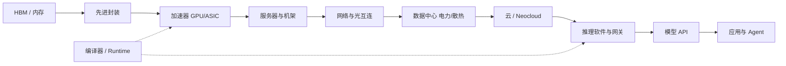

# 执行摘要：AI 推理全景

> 位置：[InferenceAtlas](../../INDEX.md) > [模块 00](README.md) > 当前文档
> 信息截至：2026-07-29 ｜ 最后核验：2026-07-29 ｜ 内容版本：v0.1
> 时效性等级：中
> 相关主题：[端到端生命周期](02_end_to_end_inference_lifecycle.md)｜[公司与生态](../14_company_and_ecosystem_landscape/)｜[市场与战略](../15_market_economics_and_strategy/)

## 本章导读

本章用一页篇幅给出 AI 推理的全局图景：技术栈由哪些层构成、瓶颈在哪里、产业价值如何分布、未来几年的关键变量是什么。它面向两类读者——需要快速建立全局坐标系的工程师，以及需要理解技术约束的战略与投资读者。

本章刻意不含具体的性能数字、市场规模或公司财务数据。原因是这类数字的时效性极短，且脱离配置与来源后极易被误用。本章提供的是**结构性判断**：哪些约束是物理的因而稳定，哪些格局是商业的因而可变。具体数字见对应模块，且均带来源与核验日期。

## 学习目标

读完本章后，读者应能够：

1. 用一分钟向他人说清推理技术栈的层次划分与各层职责；
2. 指出推理系统的三个物理级约束，并解释为什么它们比软件优化更根本；
3. 说明推理与训练在产业经济学上的结构性差异；
4. 列出未来三年最值得跟踪的技术与产业变量。

## 核心结论

- **推理已从"模型的附属环节"变成独立的系统工程学科**，其复杂度来自变长、有状态、严时延三个特征的叠加。
- **三个物理约束支配全局**：显存带宽（决定 decode 速度）、显存容量（决定并发上限）、供电与散热（决定单位空间可交付算力）。软件优化在这些约束内腾挪，不能突破它们。
- **推理成本是持续运营成本，直接决定服务毛利**，这使得它的优化压力在结构上大于训练。
- **价值捕获正在向内存、互连与系统集成迁移**——因为瓶颈在那里。这是理解产业格局变化的技术起点。

## 1. 问题定义、系统边界与工作负载

### 1.1 推理栈的六层划分

| 层 | 内容 | 核心问题 | 对应模块 |
|---|---|---|---|
| **应用与编排** | agent、RAG、工具调用、路由 | 一次任务要花多少 token | [05](../05_decoding_and_generation_algorithms/) |
| **服务与调度** | 批处理、队列、KV 管理、QoS | 如何在时延约束下最大化吞吐 | [03](../03_serving_engines_and_scheduling/) |
| **模型与算法** | 架构、KV 结构、解码算法、量化 | 如何用更少的计算达到同等质量 | [02](../02_transformer_and_kv_cache/)、[05](../05_decoding_and_generation_algorithms/) |
| **编译与运行时** | 图优化、算子融合、kernel | 如何让每份计算更便宜 | [04](../04_compilers_runtimes_and_kernels/) |
| **硬件与互连** | 加速器、HBM、NVLink、网络 | 物理上能提供多少带宽与算力 | [07](../07_hardware_and_server_architecture/)、[08](../08_networking_and_interconnect/) |
| **设施** | 电力、散热、机架、选址 | 能部署多少、多快能部署 | [09](../09_datacenter_power_thermal_and_operations/) |

**关键认识**：这六层不是独立优化的。一个 KV cache 量化决策（模型层）会同时改变显存占用（硬件层）、可并发数（服务层）和单位成本（设施层）。跨层理解是本库的组织原则。

### 1.2 三个物理级约束

软件可以优化的空间受限于三个不随版本更新而改变的物理事实：

**约束一：显存带宽决定 decode 速度。** LLM 自回归解码每生成一个 token 就要把模型权重完整读一遍。因此单序列的生成速度上界约为「显存带宽 ÷ 权重字节数」。这个上界与峰值算力无关，也无法通过更好的 kernel 突破——只能通过减少需要读取的字节（量化）或摊薄读取成本（批处理、投机解码）来逼近。

**约束二：显存容量决定并发上限。** KV cache 占用与「并发数 × 上下文长度」成正比。给定显卡，这两者构成一条双曲线式的可行边界：要么服务多个短请求，要么服务少数长请求。长上下文与高并发在物理上是竞争关系。

**约束三：机架功率与散热决定部署密度。** 单位机架能塞进多少加速器，取决于供电与散热能力而非机械空间。这把"多久能上线新容量"从软件问题变成了土建与电力问题。

**这三条为什么重要**：它们解释了为什么推理领域的技术演进方向高度可预测——几乎所有主流技术（GQA/MLA、KV 量化、分页管理、投机解码、prefill/decode 分离、液冷、光互连）都可以归类为对这三条约束之一的缓解。

## 2. 原理、数学与性能模型

### 2.1 支配全局的两个比值

**比值一：算术强度与硬件平衡点。**

Roofline 模型指出可达性能为：

$$
\text{Attainable} = \min(\text{Peak Compute},\ I \times BW)
$$

其中 $I$ 为算术强度（FLOP/byte），$BW$ 为显存带宽（byte/s）。硬件的**平衡点** $I^* = \text{Peak Compute} / BW$ 是一个纯硬件属性。

当 workload 的 $I < I^*$ 时为 memory-bound。LLM decode 的 $I$ 远低于当代加速器的 $I^*$，因此 decode 稳定处于 memory-bound 区间。**这是整个推理系统设计的物理起点。**

**比值二：单位经济性。**

$$
\text{Cost per Token} = \frac{C_{accel} + C_{power} + C_{network} + C_{software} + C_{ops}}{\text{Delivered Tokens}}
$$

分母是**实际交付的** token，而非理论产能。因此利用率直接进入分母：一个利用率 30% 的集群，其单 token 成本约为满载时的三倍。这解释了为什么推理服务的商业竞争很大程度上是**利用率竞争**，而不只是硬件单价竞争。

**假设与局限**：两式均为近似模型。前者忽略 cache 层级与并行开销，后者忽略折旧口径差异、预留与按需的混合、以及跨 workload 的资源共享。它们用于建立敏感度直觉，不用于精确核算。详见 [模块 01](../01_foundations_and_metrics/)。

## 3. 实现机制与系统设计

### 3.1 主流技术的归类

把纷繁的技术名词按"缓解哪条约束"归类，可以极大降低认知负担：

| 缓解的约束 | 技术手段 |
|---|---|
| **带宽**（decode 慢） | 量化（权重/激活/KV）、投机解码、多 token 预测、MoE（减少激活参数）、算子融合 |
| **容量**（并发受限） | GQA/MQA/MLA、KV 量化、分页管理、前缀共享、KV offload、驱逐策略 |
| **调度效率**（利用率低） | continuous batching、chunked prefill、优先级调度、prefill/decode 分离、模型路由 |
| **通信**（分布式代价） | 拓扑感知放置、通信重叠、all-to-all 优化、RDMA、光互连 |
| **设施**（部署密度） | 液冷、48V 供电、高密机架、能耗感知调度 |

**面试与尽调价值**：当有人介绍一项新技术时，先问它缓解的是哪条约束、代价是什么。这个框架能快速识别出真正的创新与换汤不换药的包装。

### 3.2 产业价值链的结构

推理的价值链比训练更长，因为它是持续运营的：

**图展示什么**：从内存颗粒到最终应用的价值传递链条，以及编译器/runtime 作为横切层的位置。

**核心瓶颈在哪**：链条的瓶颈环节随时间移动。当前的结构性紧约束集中在链条左段（内存与封装）与中段（电力与散热）——这两处的扩产周期以年计，而需求变化以季度计。

**图中的 trade-off**：越靠左，技术壁垒与资本强度越高、但客户集中度也越高；越靠右，进入门槛越低、但差异化更依赖产品与生态。垂直整合（自研芯片、自建数据中心）是用资本换取供应确定性与成本控制，代价是灵活性下降。

**面试如何引用**：被问到"如何看某公司的战略定位"时，先在这条链上定位它，再讨论它向左或向右延伸的动机与可行性——这比逐条罗列产品更有分析价值。

### 3.3 参与者类型

| 类型 | 在链条中的位置 | 核心竞争要素 |
|---|---|---|
| 内存厂商 | 最上游 | 产能、良率、代际节奏 |
| 商用加速器厂商 | 上游 | 性能、软件生态、供应能力 |
| 超大规模厂商自研芯片 | 上游（自用） | 与自身 workload 的匹配度、成本 |
| 推理专用芯片初创 | 上游 | 特定 workload 的架构优势、软件成熟度 |
| 网络与光互连 | 中游 | 带宽、时延、功耗、标准话语权 |
| 服务器/ODM | 中游 | 集成能力、交付速度、散热方案 |
| 云与 neocloud | 中游 | 容量、价格、可用性 |
| 推理软件 | 中下游 | 性能、易用性、社区 |
| 模型公司 | 下游 | 模型质量、单位经济性、分发 |

具体公司档案见 [模块 14](../14_company_and_ecosystem_landscape/)，价值捕获分析见 [模块 15](../15_market_economics_and_strategy/)。本章不列举具体公司的份额或财务数据——那些必须带来源与核验日期。

## 4. 性能、成本、能耗与可靠性 trade-off

推理与训练在产业经济学上的结构差异：

| 维度 | 训练 | 推理 |
|---|---|---|
| 成本性质 | 一次性资本投入 | **持续运营成本** |
| 与收入的关系 | 前置投入 | **直接构成服务成本，进入毛利** |
| 负载可预测性 | 高（可调度） | 低（随用户行为突发） |
| 硬件利用率 | 可做到很高 | 受时延约束限制 |
| 对时延的要求 | 无 | 严格 |
| 优化压力来源 | 迭代速度 | **毛利率** |
| 硬件替代的阻力 | 高（生态与调试成本） | 相对较低（推理 workload 更标准化） |

**最后一行的战略含义**：推理工作负载相对标准化，使得专用芯片与自研硅的替代空间比训练更大。这是理解产业格局演变的一个关键结构性判断。

## 5. benchmark、真实案例或公开部署案例

本章为总览，不复述具体数字。已被公开文献确立的机制性结论：

| 结论 | 来源 |
|---|---|
| 迭代级调度可显著提升生成式模型服务吞吐 | [Orca, OSDI 2022](https://www.usenix.org/conference/osdi22/presentation/yu) |
| 分页式 KV 管理可回收按最大长度预留造成的显存浪费 | [PagedAttention, SOSP 2023](https://arxiv.org/abs/2309.06180) |
| 注意力性能由 HBM 读写而非 FLOP 主导 | [FlashAttention, NeurIPS 2022](https://arxiv.org/abs/2205.14135) |
| 投机解码可在不改变输出分布的前提下减少大模型前向次数 | [Speculative Decoding, ICML 2023](https://arxiv.org/abs/2211.17192) |

**注**：具体加速倍数强依赖实验配置，本库不脱离配置引用。完整实验设置见 [模块 13](../13_research_papers_and_technical_reports/)。

## 6. 设计决策框架

**给工程读者**：从 [02 端到端生命周期](02_end_to_end_inference_lifecycle.md) 开始，建立层次映射；再按 [04 系统设计方法论](04_how_to_design_an_inference_system.md) 的九步顺序落地。

**给战略/投资读者**：三个问题构成基本判断框架——

1. **它缓解哪条物理约束？** 不缓解任何约束的"优化"通常是营销包装；
2. **代价是什么？** 每项技术都有代价（质量、通用性、工程复杂度、供应链），只讲收益不讲代价的材料需要打折；
3. **可验证的里程碑是什么？** 一个无法被证伪的技术叙事没有尽调价值。反证指标的设计见 [模块 15](../15_market_economics_and_strategy/)。

## 7. 常见失败模式与排查路径

理解推理全景时的常见认知错误：

| 错误 | 为什么错 | 纠正 |
|---|---|---|
| 用峰值算力衡量推理能力 | decode 是 memory-bound | 看显存带宽与容量 |
| 把训练经验直接迁移 | 时延约束与负载模式不同 | 区分两类 workload |
| 认为软件优化可无限提升 | 三条物理约束是硬边界 | 先定位约束再谈优化 |
| 忽略利用率对成本的影响 | 利用率进入成本分母 | 用 cost/delivered token |
| 把第三方估计当官方数据 | 二者可信度不同 | 核对披露等级 |
| 用单一指标评价系统 | 五大目标相互冲突 | 联合评估并明确让步点 |

## 8. 关联面试主题

1. **推理与训练在系统需求上的本质差异** → 本章 4、[模块 01](../01_foundations_and_metrics/)
2. **为什么 decode 是 memory-bound，这如何影响硬件选型** → 本章 2.1、[模块 07](../07_hardware_and_server_architecture/)
3. **如何比较不同厂商的公开技术路线** → 本章 3.2–3.3、[模块 14](../14_company_and_ecosystem_landscape/)
4. **推理成本的构成与降低路径** → 本章 2.1、[模块 15](../15_market_economics_and_strategy/)
5. **未来三年最值得跟踪的技术变量** → [模块 16](../16_research_frontiers/)

## 9. 小结

AI 推理已成为独立的系统工程学科，其复杂度源于变长、有状态、严时延三特征的叠加。三条物理约束——显存带宽、显存容量、供电散热——支配全局，主流技术几乎都可归类为对其中之一的缓解。产业上，推理成本是持续运营成本并直接进入毛利，这在结构上产生了比训练更强的优化压力，也为专用硬件提供了更大的替代空间。价值链的紧约束环节随时间移动，当前集中在内存/封装与电力/散热两处。

## 关键术语

| 中文术语 | 英文 | 定义 | 单位/口径 | 关联文档 |
|---|---|---|---|---|
| 平衡点 | machine balance point | 峰值算力与带宽之比，判定 workload 是否 memory-bound | FLOP/byte | [模块 01](../01_foundations_and_metrics/) |
| 内存墙 | memory wall | 算力增速快于带宽增速导致的瓶颈 | — | [模块 07](../07_hardware_and_server_architecture/) |
| 单位经济性 | unit economics | 每单位产出（token/请求）的成本与收入结构 | $/1M tokens | [模块 15](../15_market_economics_and_strategy/) |
| 价值捕获 | value capture | 价值链中某环节获取利润的能力 | — | [模块 15](../15_market_economics_and_strategy/) |

## 延伸阅读

- [02 端到端推理生命周期](02_end_to_end_inference_lifecycle.md) —— 本章第 1 节的完整展开
- [模块 15：市场、经济学与战略](../15_market_economics_and_strategy/) —— 本章第 3.2 节的量化分析
- [模块 16：未来路线](../16_research_frontiers/) —— 结构性判断的前瞻延伸

## 主要来源

| # | 来源 | 类型 | 披露等级 | 核验日期 |
|---:|---|---|---|---|
| 1 | [Orca (OSDI 2022)](https://www.usenix.org/conference/osdi22/presentation/yu) | 会议论文 | 独立可复现实验 | 2026-07-29 |
| 2 | [PagedAttention (SOSP 2023)](https://arxiv.org/abs/2309.06180) | 会议论文 | 独立可复现实验 | 2026-07-29 |
| 3 | [FlashAttention (NeurIPS 2022)](https://arxiv.org/abs/2205.14135) | 会议论文 | 独立可复现实验 | 2026-07-29 |
| 4 | [Speculative Decoding (ICML 2023)](https://arxiv.org/abs/2211.17192) | 会议论文 | 独立可复现实验 | 2026-07-29 |

> **说明**：本章的产业结构判断为**本库推论**，基于上述技术文献的机制性结论与公开的价值链结构，不含任何具体公司的财务、份额或客户数据。此类数据将在 [模块 14](../14_company_and_ecosystem_landscape/)、[模块 15](../15_market_economics_and_strategy/) 中逐条附一手来源与披露等级。

## 更新记录

| 日期 | 版本 | 变更 | 核验人 |
|---|---|---|---|
| 2026-07-29 | v0.1 | 初稿 | — |
