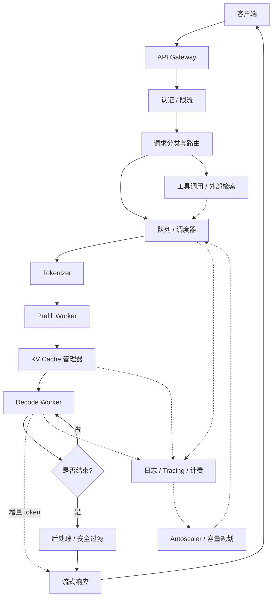

# 端到端推理生命周期

> 位置：[InferenceAtlas](../../INDEX.md) > [模块 00](README.md) > 当前文档
> 信息截至：2026-07-29 ｜ 最后核验：2026-07-29 ｜ 内容版本：v0.1
> 时效性等级：低
> 相关主题：[Serving 架构](../03_serving_engines_and_scheduling/)｜[Transformer 与 KV Cache](../02_transformer_and_kv_cache/)｜[指标与排队论](../01_foundations_and_metrics/)

## 本章导读

本章是全库的骨架。它追踪一次用户请求从进入系统到最后一个 token 返回的完整路径，并在每一站回答同一个问题：**这一层如果出问题，会体现为哪个指标劣化？**

这个映射关系是推理工程最核心的实用知识。当线上出现"P99 时延翻倍"时，可能的根因分布在至少七个层次：网关限流、队列积压、调度器的批内干扰、KV cache 显存耗尽触发抢占、kernel 因输入形状变化走了慢路径、跨节点集合通信遇到 incast、机架功率封顶触发降频。没有这张全景图，排查就退化成猜测。

本章还要建立一个贯穿全库的判断：**推理系统的两个阶段——prefill 与 decode——资源画像截然不同**。prefill 是计算密集的并行批处理，decode 是内存带宽受限的串行循环。几乎所有推理系统设计的复杂性，都来自于要在同一套硬件上同时服务这两种性质相反的工作。

## 学习目标

读完本章后，读者应能够：

1. 完整复述一次推理请求经过的所有层次，并说出每层的职责边界；
2. 给定一个劣化的指标（TTFT / TPOT / P99 / 吞吐 / 成本），列出应当排查的层次及其顺序；
3. 解释为什么 prefill 与 decode 必须被区别对待，以及这一区分如何传导到调度、内存、网络与硬件选型；
4. 说明推理工作负载与传统分类模型推理在系统需求上的本质差异。

## 核心结论

- **推理请求的时延由六段构成**：排队 + 分词 + prefill + decode + 网络 + 后处理。优化必须先定位到段，再选手段；对错段做优化是最常见的浪费。
- **prefill 决定 TTFT，decode 决定 TPOT**。这两个指标由不同的物理瓶颈支配（算力 vs 显存带宽），因此往往需要相互冲突的优化。
- **KV cache 是把无状态前向变成有状态服务的那一个变化**。它使显存容量成为并发度的硬约束，也使得调度、内存管理、网络传输在推理系统中彼此耦合。
- **同时优化 TTFT、TPOT、tail latency、goodput 与 cost/token 是不可能的**。工程价值在于显式选择在哪里让步，而非假装可以全赢。

## 1. 问题定义、系统边界与工作负载

### 1.1 什么是 AI inference

**推理**指使用已训练完成的模型对新输入产生输出的过程。与训练相比，它有三个决定性差异：

| 维度 | 训练 | 推理 |
|---|---|---|
| 运行次数 | 一次（或少数几次） | 每个用户请求一次，持续数年 |
| 时延要求 | 无（关心总时长） | 严格（用户在等） |
| 负载模式 | 可预测、可调度 | 突发、随用户行为波动 |
| 主要成本 | 一次性资本投入 | 持续运营成本，直接决定毛利 |
| 优化目标 | 收敛速度、最终质量 | 时延、吞吐、成本、可用性的联合优化 |

这个差异的实际后果是：**训练系统的优化经验不能直接迁移到推理**。训练关心大批量下的算力利用率，推理关心小批量、变长序列、严格时延约束下的端到端表现。

### 1.2 推理工作负载的分类

不同 workload 对系统的要求差异极大，混在一起讨论会得出矛盾的结论：

| Workload | 输入长度 | 输出长度 | 主导指标 | 主要瓶颈 |
|---|---|---|---|---|
| 交互式 chat | 短–中 | 中 | TTFT、TPOT | decode 带宽 |
| 长上下文 / 文档理解 | 很长 | 短–中 | TTFT | prefill 算力、KV 显存 |
| RAG | 长（检索拼接） | 中 | TTFT、前缀命中率 | prefill、cache 管理 |
| Reasoning | 短–中 | **很长** | 端到端时延、成本 | decode 带宽、总 token 量 |
| 代码生成 | 中–长 | 中–长 | TPOT、质量 | decode |
| 多模态 | 很长（视觉 token） | 中 | TTFT | prefill、编码器 |
| 批量离线 | 任意 | 任意 | 吞吐、成本 | 算力利用率 |
| Agent | 多轮累积 | 多轮累积 | 端到端、工具时延 | 调度、状态管理 |
| 端侧 | 短 | 短 | 时延、功耗 | 内存容量、热预算 |

模块 [01](../01_foundations_and_metrics/) 会对每一类给出量化特征。本章只需建立一个意识：**"LLM 推理性能"这个说法本身是不完整的，必须绑定 workload。**

### 1.3 与传统分类模型推理的差异

传统 CV/推荐模型推理是：固定输入形状、单次前向、无状态、时延以毫秒计、批处理简单。

LLM 推理是：**变长输入、变长输出、自回归多次前向、有状态（KV cache）、时延以秒计、批处理需要迭代级调度**。

这五个差异中的每一个都独立地增加了系统复杂度，而它们是叠加的。这解释了为什么 LLM serving 演化出了一整套专用基础设施（continuous batching、PagedAttention、chunked prefill、disaggregated serving），而不是复用已有的模型服务框架。

## 2. 原理、数学与性能模型

### 2.1 端到端时延分解

一次请求的端到端时延可分解为：

$$
T_{E2E} = T_{queue} + T_{tokenize} + T_{prefill} + T_{decode} + T_{network} + T_{post}
$$

其中：

- $T_{queue}$：请求到达至被调度执行的等待时间（ms）。高负载下这一项可以支配全局，且是 tail latency 的主要来源；
- $T_{tokenize}$：分词与输入预处理（ms）。通常很小，但超长输入或 CPU 资源不足时会显现；
- $T_{prefill}$：处理全部输入 token 的一次并行前向（ms）。**决定 TTFT**；
- $T_{decode}$：生成全部输出 token 的自回归循环（ms）。等于 $N_{out} \times \text{TPOT}$，**通常是长输出场景的主导项**；
- $T_{network}$：客户端与服务端之间的传输（ms）。跨区域时不可忽略；
- $T_{post}$：安全过滤、结构化解析、计费记录等（ms）。

**首 token 时延**只包含前三项加网络：

$$
\text{TTFT} = T_{queue} + T_{tokenize} + T_{prefill} + T_{network,\,first}
$$

**这个分解是本库最重要的一个公式**，因为它把"时延高"这个模糊症状映射到六个可分别测量、可分别优化的量。

**假设与局限**：该分解假设各段串行且无重叠。真实系统中 tokenization 可与排队重叠、流式传输与 decode 重叠、chunked prefill 使 prefill 与 decode 交错。因此它是**上界式的教学分解**，用于定位而非精确预测。

### 2.2 prefill 与 decode 的资源画像

这是理解推理系统的关键。设模型参数量为 $P$，输入长度 $S_{in}$，一次生成 1 个 token。

**Prefill**：一次前向处理 $S_{in}$ 个 token，计算量约与 $S_{in} \times P$ 成正比，而权重只需从显存读取一次。因此**算术强度高**，通常是 **compute-bound**。

**Decode**：一次前向只处理 1 个 token，计算量约与 $P$ 成正比，但**权重仍需完整读取一遍**。算术强度约为 prefill 的 $1/S_{in}$，因此通常是 **memory-bound**——性能由显存带宽而非峰值算力决定。

| 维度 | Prefill | Decode |
|---|---|---|
| 每次前向处理 token 数 | $S_{in}$（成百上千） | 1（每序列） |
| 算术强度 | 高 | 低 |
| 典型瓶颈 | 峰值算力 | **显存带宽** |
| 决定的指标 | TTFT | TPOT |
| 批处理收益 | 已有并行度，收益递减 | **收益极大**（摊薄权重读取） |
| 对 KV cache 的操作 | 大量写入 | 每步追加 1 个 token，全量读取 |
| 时延与长度关系 | 随 $S_{in}$ 增长（约超线性） | 每步近似恒定，随 cache 增长缓慢上升 |

**这张表解释了推理系统中几乎所有的设计张力**：

- decode 需要大 batch 才能摊薄权重读取，但大 batch 需要更多 KV 显存，而显存容量有限；
- prefill 已经算力饱和，把它和 decode 放在同一个批次里，长 prompt 的 prefill 会阻塞所有正在 decode 的请求（表现为 ITL 抖动）——这是 chunked prefill 与 prefill/decode 分离要解决的问题；
- 投机解码之所以有效，正是因为 decode 是 memory-bound：一次前向验证多个 token，权重读取成本被摊薄；也正因如此，**当 batch 已经很大、算力已饱和时，投机解码的收益会显著缩小**。

### 2.3 KV cache：把无状态变成有状态

自回归生成时，第 $t$ 步需要对前 $t-1$ 个 token 的 Key/Value 做注意力。若不缓存，每步都要重算全序列，总计算量与序列长度平方成正比。KV cache 缓存这些张量，把每步计算降为线性。

代价是显存。教学近似公式（完整推导见 [模块 02](../02_transformer_and_kv_cache/)）：

$$
M_{KV} \approx 2 \times L \times B \times S \times H_{KV} \times D_h \times b
$$

其中 $L$ 为层数、$B$ 为并发序列数、$S$ 为缓存 token 数、$H_{KV}$ 为 KV head 数、$D_h$ 为 head 维度、$b$ 为每元素字节数，系数 2 对应 K 与 V。

**这个公式的系统含义**：$M_{KV}$ 与并发数、上下文长度**同时线性相关**。这意味着显存容量直接换算成"能同时服务多少个多长的请求"，即容量规划的核心约束。GQA/MQA/MLA 通过减小 $H_{KV}$ 或压缩表示来缓解这一点。

**局限**：该式为教学近似。真实占用还受 page/block 粒度、对齐、padding、元数据、跨请求共享与张量并行分片影响，通常偏大 5–20%（具体取决于实现，`待核实`）。

## 3. 实现机制与系统设计

### 3.1 完整请求路径

下图展示一次推理请求经过的全部层次。

**图展示什么**：从客户端到 token 返回的控制流与数据流，以及每一层的旁路职责（可观测性、计费、扩缩容）。

**核心瓶颈在哪**：在高负载下，瓶颈几乎总是出现在 `队列/调度器` 与 `KV cache 管理器` 这两处——前者决定排队时延，后者决定并发上限。计算本身（prefill/decode worker）反而较少成为最先饱和的环节。

**图中的 trade-off**：调度器同时向"提高批大小以增吞吐"和"减少排队以降时延"两个方向被拉扯；KV 管理器则在"多留显存给并发"与"多留显存给长上下文"之间做分配。

**面试如何引用**：被问到"设计一个 LLM serving 系统"时，用这张图作为开场骨架，然后声明你要重点展开哪一层——这比一开始就跳进某个具体优化更能体现系统视角。

### 3.2 逐层职责与失效表现

| # | 层 | 职责 | 失效时表现为 |
|---:|---|---|---|
| 1 | API Gateway | 协议终结、路由、TLS | 全局错误率上升、连接超时 |
| 2 | 认证 / 限流 | 鉴权、配额、防滥用 | 429 上升、租户间相互挤占 |
| 3 | 请求分类与路由 | 模型选择、优先级标记、级联 | 请求被送到错误的模型，成本或质量异常 |
| 4 | 队列 / 调度器 | 排队、组批、抢占、准入控制 | **P99 时延放大、TTFT 抖动、队头阻塞** |
| 5 | Tokenizer | 文本 ↔ token | 超长输入下 CPU 瓶颈，TTFT 抬升 |
| 6 | Prefill Worker | 输入的并行前向 | **TTFT 高**，长 prompt 尤其明显 |
| 7 | KV Cache 管理器 | 显存分配、驱逐、前缀复用 | **并发上限骤降、频繁抢占重算、cache thrashing** |
| 8 | Decode Worker | 自回归生成 | **TPOT 高、ITL 抖动** |
| 9 | 后处理 / 安全 | 过滤、结构化解析 | 端到端时延尾部增加、误拒 |
| 10 | 流式响应 | 增量传输 | 首 token 到达但后续卡顿（网络或背压） |
| 11 | 可观测性 / 计费 | 指标、日志、trace | 无法定位问题（元失效） |
| 12 | Autoscaler | 容量伸缩 | 冷启动导致的时延尖峰、容量不足 |

**使用方法**：拿到一个劣化指标，从右列反查左列。例如"TTFT 高但 TPOT 正常"→ 候选层为 4、5、6（排队、分词、prefill），基本可排除 8（decode）。这个反查表在 [模块 17](../17_interview_prep/) 中会被反复用到。

### 3.3 承载层：硬件、网络、电力

上述软件路径运行在物理基础设施上，二者的耦合点：

| 物理层 | 与推理指标的耦合 |
|---|---|
| 加速器算力 | 决定 prefill 速度 → TTFT |
| **显存带宽** | 决定 decode 速度 → TPOT（LLM 推理最关键的硬件参数之一） |
| **显存容量** | 决定 KV cache 可容纳的并发×长度 → 吞吐上限 |
| 节点内互连（NVLink 等） | 张量并行的通信时延 → 每 token 都要付一次 |
| 集群网络 | MoE all-to-all、KV 迁移、多节点 TP → TPOT 与 tail latency |
| 存储 | 模型加载速度 → 冷启动时长 |
| 机架供电 | power cap 触发降频 → 吞吐下降 |
| 散热 | thermal throttling → P99 抬升 |

**一个反直觉但重要的结论**：对多数 LLM decode 场景，**显存带宽比峰值算力更能预测实际吞吐**。这是模块 [07](../07_hardware_and_server_architecture/) 硬件选型框架的出发点。

## 4. 性能、成本、能耗与可靠性 trade-off

推理系统的五个目标两两之间几乎都存在冲突：

| 冲突对 | 冲突机制 | 常见处理 |
|---|---|---|
| 吞吐 ↔ TTFT | 增大 batch 提高吞吐，但请求需等待组批与排队 | 迭代级调度 + 准入控制 |
| 吞吐 ↔ ITL 稳定性 | 长 prompt 的 prefill 阻塞同批 decode | chunked prefill、prefill/decode 分离 |
| 并发 ↔ 上下文长度 | 二者共同争夺 KV 显存 | 分页管理、KV 量化、offload |
| 成本 ↔ 时延 | 高利用率降成本，但排队增加尾时延 | 分层 SLO、按 tier 定价 |
| 质量 ↔ 成本 | 更大模型/更多 test-time compute 提质量但贵 | 模型路由与级联 |
| 利用率 ↔ 可靠性 | 无余量的高利用率在突发下崩溃 | 余量预留、背压、降级模式 |

**结论**：不存在"最优配置"，只存在"针对某个 workload 与 SLO 的合理配置"。任何声称在所有维度都领先的方案，要么限定了 workload，要么在某处让步而未说明。

## 5. benchmark、真实案例或公开部署案例

本章为总览，具体案例分散在各模块。此处只给出**已被公开文献确立的机制性结论**，它们的原始出处见括号：

| 结论 | 来源 | 披露等级 |
|---|---|---|
| 迭代级调度（continuous batching）可显著提升生成式模型服务的吞吐 | Orca, OSDI 2022（[链接](https://www.usenix.org/conference/osdi22/presentation/yu)） | 论文 |
| 按最大长度预留连续 KV 显存造成大量浪费；分页管理可回收之 | PagedAttention, SOSP 2023（[链接](https://arxiv.org/abs/2309.06180)） | 论文 |
| 注意力的性能瓶颈在 HBM 读写而非 FLOP，分块可避免物化注意力矩阵 | FlashAttention, NeurIPS 2022（[链接](https://arxiv.org/abs/2205.14135)） | 论文 |
| 用小模型提议、大模型并行验证，可在不改变输出分布的前提下减少大模型前向次数 | Speculative Decoding, ICML 2023（[链接](https://arxiv.org/abs/2211.17192)） | 论文 |

**具体的加速倍数刻意未在此复述**，因为它们强依赖论文的实验配置，脱离配置引用是本库明确禁止的做法。完整的实验条件见 [模块 13](../13_research_papers_and_technical_reports/) 的论文卡片。

## 6. 设计决策框架

面对一个新的推理系统需求，按以下顺序决策——**顺序本身很重要**，跳步会导致后期返工：

1. **定义 workload**：输入/输出长度分布、并发模式、突发比、多轮与否；
2. **定义 SLO**：TTFT / TPOT 的目标分位数，而非均值；明确可接受的降级行为；
3. **估算 KV 显存需求**：由并发 × 上下文 × 模型 KV 结构推出；这一步通常直接决定硬件下限；
4. **选择并行策略**：单卡装得下就不要分布式；装不下再考虑 TP，跨节点是最后手段；
5. **选择调度策略**：延迟优先还是吞吐优先，是否需要 chunked prefill 与优先级队列；
6. **选择精度**：在质量可接受的前提下取最低精度，因为它同时缓解带宽与容量；
7. **决定是否分离 prefill/decode**：只有在两阶段资源画像严重失配、且规模足以摊薄迁移开销时才做；
8. **设计可观测性**：在上线前就要能测出第 3.2 节表中每一层的信号；
9. **设计降级路径**：过载时先降什么（并发、上下文、模型档位），而不是等崩溃。

## 7. 常见失败模式与排查路径

| 症状 | 首查 | 次查 | 典型根因 |
|---|---|---|---|
| TTFT 高、TPOT 正常 | 队列深度 | prefill 耗时、输入长度分布 | 排队积压；长 prompt 未分块 |
| TPOT 高、TTFT 正常 | 显存带宽利用率 | batch 大小、量化配置 | decode 批太小；未量化；kernel 走慢路径 |
| 均值正常、P99 差 | ITL 分布 | 抢占/重算次数、GC 式驱逐 | 批内长短请求干扰；KV 显存不足触发抖动 |
| 吞吐随并发上升后骤降 | KV 显存占用 | 抢占率 | cache thrashing——超过容量后陷入反复驱逐重算 |
| 吞吐低但利用率也低 | 调度器组批行为 | 请求到达模式 | 静态批处理；组批窗口设置不当 |
| 时延周期性尖峰 | autoscaler 事件 | 模型加载耗时 | 冷启动；扩容时权重分发慢 |
| 多租户互相影响 | 优先级与配额 | 批内混合情况 | 缺少隔离与准入控制 |
| 分布式下 TPOT 异常 | 集合通信耗时 | 网络 incast、拓扑映射 | TP 通信落在每 token 关键路径上 |
| 长时间运行后变慢 | 温度与功耗 | 频率曲线 | thermal throttling 或 power cap |

**排查纪律**：先用第 2.1 节的分解确定劣化落在哪一段，再用 3.2 节的层表确定候选层，最后才动手改配置。反过来做——先调参数再看效果——是最常见的时间浪费。

## 8. 关联面试主题

1. **端到端设计题**：设计一个面向百万 DAU 的多模型 LLM chat service → [模块 17](../17_interview_prep/)
2. **排查题**：TTFT 高但 TPOT 正常如何定位 → 本章 2.1 + 7
3. **原理题**：为什么 decode 是 memory-bound 而 prefill 是 compute-bound → 本章 2.2、[模块 02](../02_transformer_and_kv_cache/)
4. **容量题**：给定并发与上下文长度估算 KV cache → 本章 2.3、[模块 02](../02_transformer_and_kv_cache/)
5. **权衡题**：吞吐与 tail latency 冲突时如何取舍 → 本章 4、[模块 03](../03_serving_engines_and_scheduling/)

## 9. 小结

一次推理请求穿过十二个层次，其时延可分解为六段。prefill 与 decode 的资源画像相反——前者受算力约束决定 TTFT，后者受显存带宽约束决定 TPOT——这一区分是推理系统几乎全部设计复杂性的来源。KV cache 把无状态前向变成有状态服务，使显存容量成为并发度的硬约束。五大目标（时延、吞吐、成本、能耗、可靠性）两两冲突，工程价值在于显式选择让步点。

后续模块沿这张图逐层展开：[01](../01_foundations_and_metrics/) 建立度量语言，[02](../02_transformer_and_kv_cache/) 深入 KV cache，[03](../03_serving_engines_and_scheduling/) 展开调度层，[04](../04_compilers_runtimes_and_kernels/) 下探到 kernel，[06](../06_distributed_and_moe_inference/)–[09](../09_datacenter_power_thermal_and_operations/) 覆盖分布式与物理层。

## 关键术语

| 中文术语 | 英文 | 定义 | 单位/口径 | 关联文档 |
|---|---|---|---|---|
| 预填充 | prefill | 对全部输入 token 的一次并行前向，产生首个输出 token | — | [模块 02](../02_transformer_and_kv_cache/) |
| 解码 | decode | prefill 之后逐 token 自回归生成的阶段 | — | [模块 02](../02_transformer_and_kv_cache/) |
| 首 token 时延 | TTFT | 请求到达至首个 token 返回；本库口径含排队 | ms | [模块 01](../01_foundations_and_metrics/) |
| 每输出 token 时延 | TPOT | 首 token 后平均每 token 生成时间 | ms/token | [模块 01](../01_foundations_and_metrics/) |
| 内存受限 | memory-bound | 性能由显存带宽而非算力决定 | — | [模块 01](../01_foundations_and_metrics/) |
| KV 缓存 | KV cache | 缓存已计算 token 的 K/V 张量以避免重算 | GB | [模块 02](../02_transformer_and_kv_cache/) |
| 队头阻塞 | head-of-line blocking | 队首长请求阻塞其后短请求 | — | [模块 03](../03_serving_engines_and_scheduling/) |

## 延伸阅读

- [模块 01：基础、指标、排队论与成本](../01_foundations_and_metrics/) —— 把本章的定性描述变成可计算的模型
- [模块 02：Transformer 推理与 KV Cache](../02_transformer_and_kv_cache/) —— 本章 2.2 与 2.3 的完整推导
- [模块 03：Serving Engines、调度与 QoS](../03_serving_engines_and_scheduling/) —— 本章 3.1 图中第 4 层的展开

## 主要来源

| # | 来源 | 类型 | 披露等级 | 核验日期 |
|---:|---|---|---|---|
| 1 | [Orca: A Distributed Serving System for Transformer-Based Generative Models (OSDI 2022)](https://www.usenix.org/conference/osdi22/presentation/yu) | 会议论文 | 独立可复现实验 | 2026-07-29 |
| 2 | [Efficient Memory Management for LLM Serving with PagedAttention (SOSP 2023)](https://arxiv.org/abs/2309.06180) | 会议论文 | 独立可复现实验 | 2026-07-29 |
| 3 | [FlashAttention (NeurIPS 2022)](https://arxiv.org/abs/2205.14135) | 会议论文 | 独立可复现实验 | 2026-07-29 |
| 4 | [Fast Inference from Transformers via Speculative Decoding (ICML 2023)](https://arxiv.org/abs/2211.17192) | 会议论文 | 独立可复现实验 | 2026-07-29 |
| 5 | [Attention Is All You Need (NeurIPS 2017)](https://arxiv.org/abs/1706.03762) | 会议论文 | 独立可复现实验 | 2026-07-29 |

## 更新记录

| 日期 | 版本 | 变更 | 核验人 |
|---|---|---|---|
| 2026-07-29 | v0.1 | 初稿 | — |
