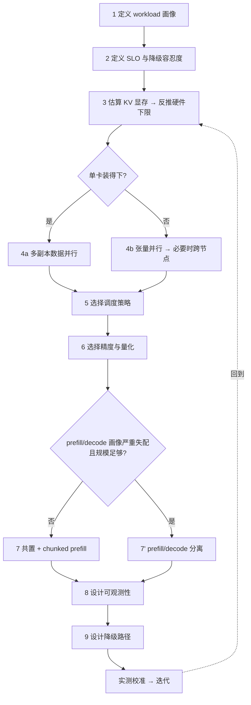

# 如何设计一个推理系统

> 位置：[InferenceAtlas](../../INDEX.md) > [模块 00](README.md) > 当前文档
> 信息截至：2026-07-29 ｜ 最后核验：2026-07-29 ｜ 内容版本：v0.1
> 时效性等级：低
> 相关主题：[端到端生命周期](02_end_to_end_inference_lifecycle.md)｜[Serving 与调度](../03_serving_engines_and_scheduling/)｜[分布式与 MoE](../06_distributed_and_moe_inference/)

## 本章导读

本章给出一套**有顺序的**推理系统设计方法论。顺序本身是方法论的主要内容——绝大多数设计失误不是选错了技术，而是**在错误的阶段做了决策**：在没有 workload 画像时就选硬件，在没有 SLO 时就调 batch，在单卡尚未跑满时就上分布式。

方法论的核心是一条原则：**约束先于选择**。每一步都在收窄可行域，只有当上一步的约束明确后，下一步的选择才有判据。当你发现自己在两个方案之间反复权衡且没有判据时，通常意味着上游某一步被跳过了。

本章给出九步流程、每步的输入输出、以及每步最常见的错误。具体技术的展开在后续模块，本章负责的是**决策顺序**。

## 学习目标

读完本章后，读者应能够：

1. 按九步顺序推导出一个推理系统的架构，并在每步说明决策依据；
2. 判断一个设计决策是否"过早"——即其上游约束是否已经确定；
3. 用 KV 显存估算反推硬件下限，而不是先选硬件再看能跑什么；
4. 在面试白板上用这个框架结构化地展开一道系统设计题。

## 核心结论

- **设计顺序是：workload → SLO → 显存 → 并行 → 调度 → 精度 → 分离 → 观测 → 降级。** 跳步会导致返工。
- **KV 显存估算是硬件选型的入口**，不是选完硬件后的验证步骤。
- **单卡能装下就不要分布式。** 每一级并行都在每个 token 的关键路径上增加通信代价。
- **降级路径必须在设计阶段确定**，而不是在事故中临时决定。没有降级设计的系统在过载时只有一种行为：崩溃。

## 1. 问题定义、系统边界与工作负载

### 1.1 设计的输入

任何推理系统设计都始于三组输入。缺任何一组，设计都无法收敛：

| 输入 | 具体内容 | 缺失后果 |
|---|---|---|
| **Workload 画像** | 输入/输出长度分布、并发曲线、突发比、多轮比例、是否共享前缀 | 无法估算显存与算力，只能猜 |
| **SLO** | TTFT/TPOT 的目标**分位数**、可用性、可接受降级 | 无法判断任何配置是否合格 |
| **约束** | 预算、可用硬件、部署环境、合规要求 | 方案不可落地 |

**最常见的项目失败原因是第一组缺失**：团队知道"要做一个 LLM 服务"，但不知道 P95 输入长度是 500 还是 50,000。这两者对应完全不同的系统。

### 1.2 边界界定

明确什么**不在**本系统范围内，同样重要：模型训练与微调、检索库本身、前端应用逻辑、离线批处理（若与在线共用资源需显式说明）。边界不清会导致容量规划把不可控的负载算进来。

## 2. 原理、数学与性能模型

### 2.1 第三步的核心计算：KV 显存反推

这是整个方法论中唯一一个必须动笔算的步骤。

给定目标并发数 $B$、目标上下文长度 $S$、模型层数 $L$、KV head 数 $H_{KV}$、head 维度 $D_h$、KV 精度字节数 $b$：

$$
M_{KV} \approx 2 \times L \times B \times S \times H_{KV} \times D_h \times b
$$

再加上权重占用 $M_W$（约等于参数量 × 权重精度字节数）与运行时开销 $M_{rt}$（激活、临时缓冲、碎片，通常需预留一定比例）：

$$
M_{total} \approx M_W + M_{KV} + M_{rt}
$$

**用法（关键）**：不要把它当验证公式，要当**求解公式**。固定 $M_{total}$ 为单卡可用显存，反解出可行的 $(B, S)$ 组合，得到一条可行边界曲线。这条曲线直接告诉你：

- 单卡能否满足目标并发与长度 → 决定是否需要分布式；
- 并发与长度的兑换率 → 决定产品上该如何限制上下文；
- KV 量化能带来多少并发提升 → 决定精度策略的优先级。

**假设与局限**：该式为教学近似。真实占用还受 block 粒度、对齐、padding、元数据、前缀共享、张量并行分片影响。$M_{rt}$ 的比例与引擎实现强相关，需实测标定。因此该式用于**确定量级和方向**，最终配置必须实测。完整推导见 [模块 02](../02_transformer_and_kv_cache/)。

### 2.2 第四步的判据：是否需要并行

按代价从低到高排序，**只在上一级不可行时才进入下一级**：

| 级别 | 方式 | 代价 | 何时使用 |
|---|---|---|---|
| 0 | 单卡 | 无 | 权重 + KV 装得下 |
| 1 | 数据并行（多副本） | 无通信代价，但每副本需完整权重 | 单卡装得下，只是吞吐不够 |
| 2 | 张量并行（节点内） | **每层一次集合通信，落在每 token 关键路径** | 单卡装不下权重 |
| 3 | 流水线并行 | 引入气泡；推理下适配性有限 | TP 已用尽仍不够 |
| 4 | 跨节点并行 | 通信跨越集群网络，时延与抖动显著上升 | 单节点不够 |

**核心判据**：分布式解决的是"装不下"，不是"不够快"。如果单卡装得下但吞吐不足，正确答案是加副本（级别 1），不是张量并行。这个区分在面试中经常被考察。

## 3. 实现机制与系统设计

### 3.1 九步流程

**图展示什么**：九步决策流程及两个关键分支点——是否需要模型并行、是否需要 prefill/decode 分离。

**核心瓶颈在哪**：流程的信息瓶颈在第 1、2 步。这两步的输出质量决定了后面七步是否有判据。实践中它们最常被跳过，因为它们不产出代码。

**图中的 trade-off**：流程末尾的回环表示这是迭代过程，但**回环的代价随步数递增**——第 3 步的估算错误只需重算，第 7 步选错架构则可能需要重构。这就是为什么顺序重要。

**面试如何引用**：白板题开场时画出这张图的骨架，然后说明"我先确认 workload 和 SLO，这会决定后面所有选择"。这比直接跳到"我会用 continuous batching"更能体现系统思维。面试官通常会在此处补充 workload 细节，你就拿到了真正的输入。

### 3.2 逐步说明

| # | 步骤 | 输入 | 输出 | 最常见错误 |
|---:|---|---|---|---|
| 1 | 定义 workload | 业务需求、日志 | 长度分布、并发曲线、突发比 | 用均值代替分布 |
| 2 | 定义 SLO | 产品要求 | P95/P99 目标、降级容忍度 | 只定均值目标 |
| 3 | 估算 KV 显存 | 模型结构、1–2 步输出 | $(B,S)$ 可行边界、硬件下限 | 跳过此步直接选硬件 |
| 4 | 选择并行策略 | 第 3 步 | 副本数、TP 度、拓扑 | 未装满就上 TP |
| 5 | 选择调度策略 | 1–2 步 | 批处理方式、优先级、准入规则 | 默认配置直接上线 |
| 6 | 选择精度 | 质量要求 | 权重/激活/KV 精度 | 只看吞吐不评质量 |
| 7 | 是否分离 prefill/decode | 1、3 步 | 池划分或共置 + chunked prefill | 规模不足时过早分离 |
| 8 | 设计可观测性 | 全部 | 指标、trace、告警 | 上线后才补 |
| 9 | 设计降级路径 | 2 步 | 降级顺序与触发条件 | 完全缺失 |

### 3.3 第 5 步：调度策略选择

| 目标 | 策略组合 | 代价 |
|---|---|---|
| 延迟优先 | 小批、高优先级抢占、严格准入控制 | 吞吐与利用率下降 |
| 吞吐优先 | 大批、宽松准入、允许排队 | tail latency 上升 |
| 混合负载隔离 | 按 workload 分池或分优先级队列 | 资源碎片化 |
| 长短混合 | chunked prefill + 长度感知组批 | 调度复杂度上升 |
| 多租户 | 配额 + 公平调度 + 隔离 | 峰值利用率下降 |

**判据**：先看 SLO 是否按 tier 分层。如果所有请求共享一个 SLO，通常单一策略即可；如果存在交互式与批量混合，必须分池或分优先级——把它们放进同一个批次是 tail latency 问题的常见来源。

### 3.4 第 7 步：何时**不**做 prefill/decode 分离

分离的收益来自两阶段资源画像的失配，代价是 KV cache 需要跨池迁移。**不适合分离的情况**：

- 规模太小——迁移开销与运维复杂度无法被摊薄；
- 输入远短于输出——prefill 占比低，分离收益有限；
- 网络带宽不足——KV 迁移会成为新瓶颈，可能比原问题更糟；
- 团队缺乏相应的运维能力——两个池的容量与故障处理复杂度显著高于单池。

**这一节的价值在于"不做"**。分离是当前受关注的方向，但在多数中小规模部署中，chunked prefill + 良好调度已足够，且复杂度低一个数量级。

## 4. 性能、成本、能耗与可靠性 trade-off

设计过程中每一步的让步方向应当被显式记录：

| 步骤 | 让步方向 A | 让步方向 B | 记录要点 |
|---|---|---|---|
| 并行策略 | 多副本（简单、显存冗余） | TP（显存高效、通信代价） | 为什么选此侧 |
| 调度 | 延迟优先（成本高） | 吞吐优先（尾时延差） | SLO 依据 |
| 精度 | 高精度（质量稳） | 低精度（快且省） | 质量评测结果 |
| 分离 | 共置（简单） | 分离（利用率高、复杂） | 规模阈值 |
| 余量 | 高余量（贵、抗突发） | 低余量（省、脆） | 突发比数据 |

**工程纪律**：把这张表作为设计文档的一部分保留下来。半年后当有人问"为什么当初这样设计"时，它是唯一能防止无依据重构的东西。

## 5. benchmark、真实案例或公开部署案例

方法论中被公开文献支持的关键环节：

| 环节 | 支持性文献 | 说明 |
|---|---|---|
| 第 5 步：迭代级调度 | [Orca, OSDI 2022](https://www.usenix.org/conference/osdi22/presentation/yu) | 确立了 continuous batching 的机制 |
| 第 3 步：KV 显存管理 | [PagedAttention, SOSP 2023](https://arxiv.org/abs/2309.06180) | 说明预留式分配的浪费来源 |
| 第 6 步：kernel 层影响 | [FlashAttention, NeurIPS 2022](https://arxiv.org/abs/2205.14135) | 长序列下显存与带宽的优化路径 |

> 具体部署案例（含规模、SLO 与实测结果）将在 [模块 12](../12_open_source_deployment_and_reproduction/) 的参考架构与 [`deployment_cases.csv`](../../data/deployment_cases.csv) 中逐条附一手来源。当前为空。`待核实`

## 6. 设计决策框架

**一页版清单**，可直接用于设计评审：

- [ ] 有输入/输出长度的**分布**（不只是均值）
- [ ] 有并发曲线与突发比
- [ ] SLO 以**分位数**表述
- [ ] 已定义可接受的降级行为
- [ ] 已用 KV 公式反解 $(B,S)$ 可行边界
- [ ] 并行级别是"装不下"驱动而非"不够快"驱动
- [ ] 调度策略与 SLO 分层一致
- [ ] 精度选择附带质量评测结果
- [ ] prefill/decode 分离决策附带规模阈值论证
- [ ] 可观测性覆盖端到端六段时延分解
- [ ] 降级顺序已定义并演练
- [ ] 设计让步表已记录

## 7. 常见失败模式与排查路径

| 失败模式 | 触发条件 | 后果 | 预防 |
|---|---|---|---|
| 过早选硬件 | 跳过第 3 步 | 显存不足或严重浪费 | 先算 KV 再选卡 |
| 过早分布式 | 跳过第 4 步判据 | 每 token 多付通信代价 | 确认单卡确实装不下 |
| 用均值定 SLO | 第 2 步敷衍 | 上线后 P99 大幅超标 | SLO 必须是分位数 |
| 无降级设计 | 跳过第 9 步 | 过载时雪崩 | 设计阶段定义降级顺序 |
| 观测滞后 | 第 8 步延后 | 事故时无法定位 | 观测与功能同步上线 |
| 过早分离 prefill/decode | 规模不足 | 复杂度暴增、收益为负 | 论证规模阈值 |
| 只按峰值设计 | 忽略突发比 | 突发时排队积压 | 按突发后的负载设计 |
| 质量回归未评估 | 第 6 步只看吞吐 | 性能达标但效果下降 | 性能与质量联合评估 |

**排查顺序**：出现问题时，先回到九步流程定位是哪一步的假设失效，再改配置。直接调参数而不回溯假设，是把设计问题当成运维问题处理。

## 8. 关联面试主题

1. **设计一个面向百万 DAU 的多模型 LLM chat service** → 本章 3.1 全流程
2. **如何计算给定 context、batch 和精度下的 KV cache** → 本章 2.1
3. **何时该用张量并行，何时只需多副本** → 本章 2.2
4. **如何设计 prefill/decode disaggregation 及何时不该用** → 本章 3.4
5. **如何 autoscale 并避免冷启动** → 本章 3.2 第 9 步、[模块 03](../03_serving_engines_and_scheduling/)

## 9. 小结

推理系统设计的核心是顺序而非技术选择：workload 画像 → SLO → KV 显存反推 → 并行策略 → 调度 → 精度 → 是否分离 → 可观测性 → 降级路径。每一步收窄可行域并为下一步提供判据；跳步导致的返工代价随步数递增。三条最容易被违反的纪律是：先算 KV 显存再选硬件；分布式由"装不下"而非"不够快"驱动；降级路径在设计阶段而非事故中确定。

## 关键术语

| 中文术语 | 英文 | 定义 | 单位/口径 | 关联文档 |
|---|---|---|---|---|
| 可行边界 | feasible frontier | 显存约束下并发数与上下文长度的可行组合曲线 | — | [模块 02](../02_transformer_and_kv_cache/) |
| 张量并行 | tensor parallel | 将单层权重切分到多加速器，每层需集合通信 | — | [模块 06](../06_distributed_and_moe_inference/) |
| 分块预填充 | chunked prefill | 将长 prompt 的 prefill 切块与 decode 交错 | — | [模块 03](../03_serving_engines_and_scheduling/) |
| 降级模式 | degraded mode | 过载时主动降低服务等级以维持可用性 | — | [模块 11](../11_benchmarking_reliability_and_observability/) |
| 突发比 | burst ratio | 峰值负载与平均负载之比 | 无量纲 | [模块 01](../01_foundations_and_metrics/) |

## 延伸阅读

- [模块 03：Serving Engines、调度与 QoS](../03_serving_engines_and_scheduling/) —— 第 5、9 步的完整展开
- [模块 06：分布式、MoE 与 Disaggregated Inference](../06_distributed_and_moe_inference/) —— 第 4、7 步的完整展开
- [模块 12：开源部署与参考架构](../12_open_source_deployment_and_reproduction/) —— 十个可落地的架构蓝图

## 主要来源

| # | 来源 | 类型 | 披露等级 | 核验日期 |
|---:|---|---|---|---|
| 1 | [Orca (OSDI 2022)](https://www.usenix.org/conference/osdi22/presentation/yu) | 会议论文 | 独立可复现实验 | 2026-07-29 |
| 2 | [PagedAttention (SOSP 2023)](https://arxiv.org/abs/2309.06180) | 会议论文 | 独立可复现实验 | 2026-07-29 |
| 3 | [FlashAttention (NeurIPS 2022)](https://arxiv.org/abs/2205.14135) | 会议论文 | 独立可复现实验 | 2026-07-29 |

> **说明**：本章的九步流程为**本库综合公开工程实践与上述文献提出的方法论框架**，非任何单一来源的直接引用。

## 更新记录

| 日期 | 版本 | 变更 | 核验人 |
|---|---|---|---|
| 2026-07-29 | v0.1 | 初稿 | — |
