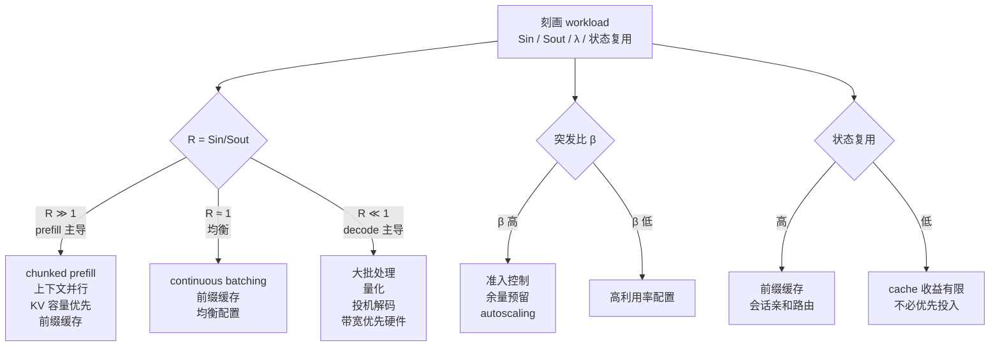

# 推理工作负载分类

> 位置：[InferenceAtlas](../../INDEX.md) > [模块 01](README.md) > 当前文档
> 信息截至：2026-07-29 ｜ 最后核验：2026-07-29 ｜ 内容版本：v0.1
> 时效性等级：低
> 相关主题：[时延与吞吐](02_latency_throughput_and_slo.md)｜[容量规划](08_capacity_planning.md)｜[端到端生命周期](../00_start_here/02_end_to_end_inference_lifecycle.md)

## 本章导读

"LLM 推理性能"这个说法是不完整的。同一套硬件和软件，服务一个平均输入 300 token、输出 200 token 的对话应用，与服务一个平均输入 60,000 token、输出 500 token 的文档理解应用，其瓶颈、成本结构与最优配置几乎没有重合之处。

本章建立一个 workload 分类体系，把每类负载映射到**四个决定系统行为的参数**：输入长度分布、输出长度分布、并发到达模式、状态复用程度。这四个参数一旦确定，系统的瓶颈位置基本就确定了——后续所有模块的技术选择都建立在这个映射之上。

分类的实用价值在于：当你拿到一个新需求时，先把它归到某一类，就能立刻知道该重点关注哪些指标、哪些技术会有效、哪些优化是浪费。

## 学习目标

读完本章后，读者应能够：

1. 用四个参数刻画任意一个推理 workload，而不是笼统地说"LLM 服务"；
2. 给定 workload 类型，预判其主导瓶颈与关键指标；
3. 解释为什么同一项优化技术在不同 workload 上收益差异巨大；
4. 识别混合 workload 带来的干扰问题，并说明隔离的必要性。

## 核心结论

- **四个参数决定一切**：输入长度、输出长度、到达模式、状态复用。它们共同决定 prefill 与 decode 的占比，进而决定瓶颈。
- **输入/输出长度比是最重要的单一指标**。它直接决定系统是 prefill 主导（compute-bound）还是 decode 主导（memory-bound）。
- **必须用分布而非均值刻画**。均值相同但方差不同的两个 workload，其 tail latency 表现可以完全不同。
- **混合 workload 会相互干扰**，长请求会拖累短请求。隔离不是可选优化，而是多租户系统的必需品。

## 1. 问题定义、系统边界与工作负载

### 1.1 四参数刻画法

| 参数 | 记号 | 为什么重要 | 采集方式 |
|---|---|---|---|
| 输入长度分布 | $S_{in}$ | 决定 prefill 成本与 KV 初始占用 | 生产日志的分位数 |
| 输出长度分布 | $S_{out}$ | 决定 decode 段时长与总 token 成本 | 同上 |
| 到达模式 | $\lambda(t)$ | 决定排队与容量余量需求 | 时间序列 + 突发比 |
| 状态复用 | 前缀命中率、多轮比例 | 决定 cache 收益上限 | 请求间前缀相似度 |

**关键要求**：每个参数都要以**分布**（至少 P50/P95/P99）而非均值给出。原因见第 2.2 节。

### 1.2 派生量：prefill/decode 比

定义单请求的 prefill 与 decode 计算量之比（教学近似，忽略常数因子）：

$$
R = \frac{\text{Prefill 计算量}}{\text{Decode 计算量}} \approx \frac{S_{in}}{S_{out}}
$$

因为 prefill 一次处理 $S_{in}$ 个 token，decode 分 $S_{out}$ 步每步处理 1 个 token，二者的总 FLOP 大致同阶，但**内存访问量差异巨大**：decode 要把权重读 $S_{out}$ 遍，prefill 只读一遍。

因此更有意义的是**时间占比**：

- $R \gg 1$（长输入短输出）→ prefill 主导 → 系统偏 compute-bound → 优化重点在 prefill 并行、chunking、算力
- $R \ll 1$（短输入长输出）→ decode 主导 → 系统偏 memory-bound → 优化重点在批处理、量化、投机解码、带宽

**这一条判据可以在需求评审阶段就确定技术路线的大方向。**

## 2. 原理、数学与性能模型

### 2.1 各类 workload 的参数画像

| Workload | $S_{in}$ | $S_{out}$ | $R$ | 到达模式 | 状态复用 | 主导瓶颈 |
|---|---|---|---|---|---|---|
| 交互式 chat | 短–中 | 中 | ≈1 | 突发、日周期 | 多轮前缀高 | decode 带宽 |
| 长上下文 / 文档 | **很长** | 短–中 | **≫1** | 较平稳 | 文档重复时高 | **prefill 算力 + KV 容量** |
| RAG | 长（检索拼接） | 中 | >1 | 突发 | 系统提示前缀高 | prefill + cache 管理 |
| Reasoning | 短–中 | **很长** | **≪1** | 突发 | 低 | **decode 带宽 + 总 token 成本** |
| 代码生成 | 中–长 | 中–长 | ≈1 | 突发 | 仓库上下文可复用 | decode + 质量 |
| 多模态 | **很长**（视觉 token） | 中 | ≫1 | 平稳–突发 | 低 | prefill + 编码器 |
| 批量离线 | 任意 | 任意 | 任意 | **可调度** | 可主动排序 | 算力利用率 |
| Agent | 多轮累积增长 | 多轮累积 | 变化 | 长尾、串行依赖 | 高（会话状态） | 调度 + 端到端 |
| 端侧 | 短 | 短 | ≈1 | 稀疏 | 低 | 内存容量、热预算 |

> 长度的"短/中/长"为相对描述。具体数值随应用差异极大，本库不给出无来源的绝对区间。实际部署必须用自己的日志标定。`待核实`

### 2.2 为什么必须用分布而非均值

考虑两个 workload，平均输入长度都是 2,000 token：

- A：几乎所有请求都在 1,800–2,200 之间；
- B：90% 的请求是 500 token，10% 是 15,500 token。

均值相同，但系统行为完全不同：

**KV 显存**：B 的峰值占用远高于 A，因为少数长请求会长期占据大块显存；

**Tail latency**：B 中的长请求在 prefill 阶段会阻塞同批的短请求（队头阻塞），使短请求的 P99 显著劣化，而 A 不会；

**容量规划**：按均值规划的容量在 B 上会周期性不足。

**结论**：workload 刻画必须给出分布。只报均值的需求文档不足以支撑设计——这是 [模块 00 第 4 章](../00_start_here/04_how_to_design_an_inference_system.md)把"分布而非均值"列为第一步纪律的原因。

### 2.3 到达模式与突发比

定义突发比：

$$
\beta = \frac{\lambda_{peak}}{\bar{\lambda}}
$$

其中 $\lambda_{peak}$ 为观测窗口内的峰值到达率，$\bar{\lambda}$ 为平均到达率。

$\beta$ 直接决定需要预留的容量余量。若按 $\bar{\lambda}$ 配置容量，则在峰值期利用率将超过 1，排队时延发散（见 [排队论](03_queueing_theory_for_inference.md)）。

**注意**：$\beta$ 依赖观测窗口。以分钟为窗口和以小时为窗口测出的 $\beta$ 可以相差数倍。报告 $\beta$ 时必须注明窗口，否则不可比。

## 3. 实现机制与系统设计

### 3.1 workload 到技术选择的映射

**图展示什么**：从 workload 刻画到技术选型的决策映射，三条并行的判据链（计算画像、突发性、状态复用）。

**核心瓶颈在哪**：瓶颈在最左侧——如果 workload 刻画不准确（尤其用了均值而非分布），后面三条链的结论都会错。这也是实践中最常被跳过的一步。

**图中的 trade-off**：三条链的结论可能冲突。例如高突发比要求预留余量（降低利用率），而 decode 主导要求大批处理（需要高利用率才划算）。此时必须按 SLO 优先级排序，不能同时满足。

**面试如何引用**：被问到"如何为某应用选型"时，用这张图说明你的决策依据链，并主动指出三条链冲突时的取舍原则——这比直接给出技术清单更有说服力。

### 3.2 混合 workload 的干扰

生产系统很少只服务单一 workload。混合带来两类干扰：

| 干扰类型 | 机制 | 后果 | 缓解 |
|---|---|---|---|
| **Prefill 阻塞 decode** | 长 prompt 的 prefill 占据整个迭代，同批 decode 请求停顿 | ITL 抖动、P99 恶化 | chunked prefill、prefill/decode 分离 |
| **长请求占用 KV** | 长上下文请求长期占据显存 | 并发上限下降 | 按长度分池、配额限制 |
| **批内长度不齐** | 短序列需 padding 或被长序列拖慢 | 有效算力下降 | 长度感知组批 |
| **优先级倒置** | 低优先级批量任务挤占交互式请求 | 交互体验劣化 | 优先级队列、准入控制 |

**设计原则**：**当两类 workload 的 $R$ 相差一个数量级以上时，应当考虑物理隔离（分池）而非仅靠调度隔离。** 调度隔离能缓解优先级问题，但无法消除批内干扰。

## 4. 性能、成本、能耗与可靠性 trade-off

不同 workload 的成本结构差异：

| Workload | 主要成本驱动 | 降本主要手段 | 降本的代价 |
|---|---|---|---|
| 交互式 chat | decode token 数 × 并发 | 批处理、量化、前缀缓存 | 尾时延、质量 |
| 长上下文 | KV 显存占用时长 | KV 量化、驱逐、分页 | 远端上下文丢失 |
| RAG | prefill（长拼接） | 前缀缓存、检索结果去重 | 缓存命中依赖流量模式 |
| Reasoning | **总输出 token 数** | 限制思考预算、路由到小模型 | 复杂任务质量下降 |
| 批量离线 | 算力利用率 | 大批、可中断实例、离峰调度 | 时延无保证 |
| Agent | 多轮累积 token | 会话缓存、上下文压缩 | 长程一致性 |

**一个重要观察**：reasoning workload 的成本主要由**输出长度**驱动，而输出长度由模型行为决定而非用户输入决定。这使得成本预测比传统 workload 困难得多，也使得"思考预算"成为一个必须显式治理的产品参数。详见 [模块 05](../05_decoding_and_generation_algorithms/)与[模块 15](../15_market_economics_and_strategy/)。

## 5. benchmark、真实案例或公开部署案例

workload 分类与系统设计的关联，在以下公开工作中有直接体现：

| 结论 | 来源 |
|---|---|
| 变长序列下按请求粒度批处理会造成算力闲置，需迭代级调度 | [Orca, OSDI 2022](https://www.usenix.org/conference/osdi22/presentation/yu) |
| 序列长度不确定导致按最大长度预留 KV 显存，产生大量浪费 | [PagedAttention, SOSP 2023](https://arxiv.org/abs/2309.06180) |
| 长序列下注意力的显存与带宽压力主导性能 | [FlashAttention, NeurIPS 2022](https://arxiv.org/abs/2205.14135) |

> 具体 workload 的长度分布数据高度依赖应用，公开可核验的分布数据稀少。本库不引用无来源的"典型值"。生产环境必须自行标定。`待核实`

## 6. 设计决策框架

**workload 刻画清单**（需求评审时逐项确认）：

- [ ] 输入长度的 P50 / P95 / P99（不是均值）
- [ ] 输出长度的 P50 / P95 / P99
- [ ] 计算 $R = S_{in}/S_{out}$，确定 prefill 还是 decode 主导
- [ ] 到达率时间序列，计算突发比 $\beta$（注明观测窗口）
- [ ] 多轮对话比例与平均轮数
- [ ] 请求间前缀相似度（估算前缀缓存上限）
- [ ] 是否存在多类 workload 混合；若有，各类的 $R$ 相差多少
- [ ] 各类 workload 的 SLO 是否相同；若不同，是否需要分池
- [ ] 是否有可离峰调度的批量部分

## 7. 常见失败模式与排查路径

| 失败模式 | 表现 | 根因 | 纠正 |
|---|---|---|---|
| 用均值规划容量 | 峰值期排队积压 | 忽略分布与突发比 | 按 P95 + 突发余量规划 |
| 混合 workload 未隔离 | 短请求 P99 异常 | 长 prompt 阻塞 | chunked prefill 或分池 |
| 对 decode 主导负载优化 prefill | 优化后无改善 | 瓶颈判断错误 | 先算 $R$ |
| 高估前缀缓存收益 | 命中率远低于预期 | 请求间前缀实际不相似 | 先测相似度再投入 |
| 忽略 reasoning 输出长度不可控 | 成本严重超预算 | 按固定输出长度估算 | 设置思考预算上限 |
| 按峰值配置所有容量 | 成本过高、利用率低 | 未区分可调度部分 | 批量部分离峰调度 |

## 8. 关联面试主题

1. **如何刻画一个推理 workload** → 本章 1.1
2. **为什么必须用分布而非均值** → 本章 2.2
3. **混合 workload 如何隔离** → 本章 3.2、[模块 03](../03_serving_engines_and_scheduling/)
4. **reasoning 负载的成本结构为何特殊** → 本章 4、[模块 05](../05_decoding_and_generation_algorithms/)
5. **给定 workload 如何选技术路线** → 本章 3.1

## 9. 小结

推理 workload 由四个参数刻画：输入长度分布、输出长度分布、到达模式、状态复用。派生量 $R = S_{in}/S_{out}$ 决定系统是 prefill 主导（compute-bound）还是 decode 主导（memory-bound），从而决定技术路线的大方向。所有参数必须以分布而非均值给出，否则容量规划与 tail latency 预测都会失效。混合 workload 之间存在批内干扰，当 $R$ 相差一个数量级以上时应考虑物理分池。

## 关键术语

| 中文术语 | 英文 | 定义 | 单位/口径 | 关联文档 |
|---|---|---|---|---|
| 计算画像比 | prefill/decode ratio | $R=S_{in}/S_{out}$，判断系统偏 compute- 还是 memory-bound | 无量纲 | 本章 1.2 |
| 突发比 | burst ratio | 峰值到达率与平均到达率之比；**必须注明观测窗口** | 无量纲 | 本章 2.3 |
| 状态复用 | state reuse | 请求间可复用的 KV cache 比例 | % | [模块 03](../03_serving_engines_and_scheduling/) |
| 长度感知组批 | length-aware batching | 按序列长度相近原则组批以减少干扰 | — | [模块 03](../03_serving_engines_and_scheduling/) |

## 延伸阅读

- [02 时延、吞吐与 SLO](02_latency_throughput_and_slo.md) —— 本章参数如何映射到指标
- [08 容量规划](08_capacity_planning.md) —— 突发比与余量的量化处理
- [模块 03](../03_serving_engines_and_scheduling/) —— 混合 workload 的调度层解法

## 主要来源

| # | 来源 | 类型 | 披露等级 | 核验日期 |
|---:|---|---|---|---|
| 1 | [Orca (OSDI 2022)](https://www.usenix.org/conference/osdi22/presentation/yu) | 会议论文 | 独立可复现实验 | 2026-07-29 |
| 2 | [PagedAttention (SOSP 2023)](https://arxiv.org/abs/2309.06180) | 会议论文 | 独立可复现实验 | 2026-07-29 |
| 3 | [FlashAttention (NeurIPS 2022)](https://arxiv.org/abs/2205.14135) | 会议论文 | 独立可复现实验 | 2026-07-29 |

## 更新记录

| 日期 | 版本 | 变更 | 核验人 |
|---|---|---|---|
| 2026-07-29 | v0.1 | 初稿 | — |
