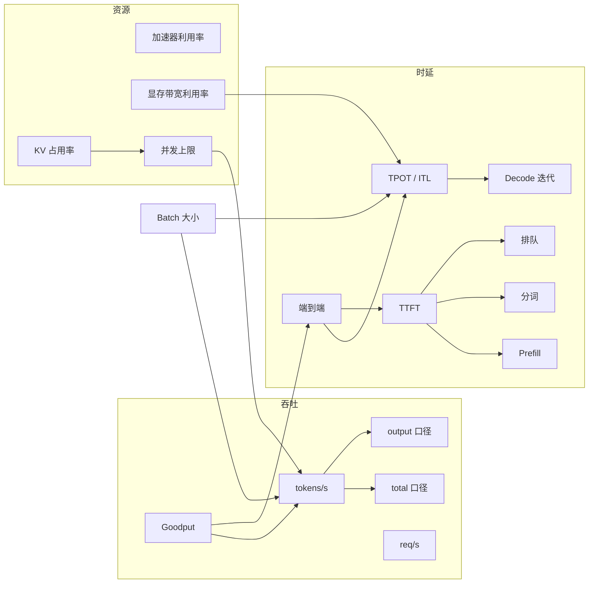

# 时延、吞吐与 SLO

> 位置：[InferenceAtlas](../../INDEX.md) > [模块 01](README.md) > 当前文档
> 信息截至：2026-07-29 ｜ 最后核验：2026-07-29 ｜ 内容版本：v0.1
> 时效性等级：低
> 相关主题：[排队论](03_queueing_theory_for_inference.md)｜[如何读 benchmark](../00_start_here/03_how_to_read_inference_benchmarks.md)｜[SLO 与错误预算](../11_benchmarking_reliability_and_observability/)

## 本章导读

本章为全库钉死指标口径。这看起来是琐碎的定义工作，实际上是推理领域最高频的错误来源：两个团队用同一个词指代不同的量，讨论就无法收敛；两份 benchmark 用不同口径报告同一指标，比较就毫无意义。

本章做三件事：给出每个指标的**精确定义与测量边界**；标出每个指标最常见的口径分歧点；说明如何把这些指标组织成可执行的 SLO。

一个贯穿本章的原则：**任何时延数字，如果没有附带分位数、样本量和观测窗口，它承载的信息量接近于零。**

## 学习目标

读完本章后，读者应能够：

1. 精确定义 TTFT、TPOT、ITL、端到端时延、吞吐、goodput，并说出各自的测量边界；
2. 识别外部 benchmark 中的口径分歧，并判断其结果是否可与本库口径比较；
3. 解释为什么吞吐与时延由同一个旋钮反向控制，以及 goodput 如何调和二者；
4. 设计一份可执行的分层 SLO，而非一组无法落地的均值目标。

## 核心结论

- **TTFT 是否包含排队时延，是最常见的口径分歧**。本库口径**包含**排队。不含排队的 TTFT 在高负载下会严重低估用户实际体验。
- **吞吐必须注明是 output token 还是 total token**，二者可差约 2 倍。
- **吞吐与时延由 batch 大小反向控制**，因此单独报告任一项都可以被操纵。goodput 是调和二者的正确指标。
- **SLO 必须以分位数表述且分层**。用均值定义的 SLO 在生产中不可执行。

## 1. 问题定义、系统边界与工作负载

### 1.1 测量边界的三个选择

任何时延指标都必须回答"从哪里量到哪里"。三个常见边界：

| 边界 | 起点 | 终点 | 谁关心 |
|---|---|---|---|
| **用户视角** | 客户端发出请求 | 客户端收到内容 | 产品、SLA |
| **服务视角**（本库默认） | 请求到达服务端 | 内容离开服务端 | SRE、容量规划 |
| **引擎视角** | 请求进入推理引擎 | 引擎产出 token | 引擎优化、benchmark |

三者的差值分别是客户端网络与网关处理时间、以及排队时延。**引擎视角的数字最漂亮，用户视角的数字最真实。** 厂商 benchmark 通常采用引擎视角，这不是造假，但你必须知道差在哪里。

**本库统一采用服务视角**，并在引用外部数据时显式标注其边界。

## 2. 原理、数学与性能模型

### 2.1 时延指标精确定义

设请求于 $t_0$ 到达服务端，首个 token 于 $t_1$ 离开服务端，第 $i$ 个 token 于 $t_i$ 离开，共 $N$ 个输出 token，最后一个于 $t_N$。

| 指标 | 定义式 | 单位 | 口径要点 |
|---|---|---|---|
| **TTFT** | $t_1 - t_0$ | ms | **含**排队与 tokenization |
| **端到端时延** | $t_N - t_0$ | ms | 含全部六段 |
| **TPOT** | $\dfrac{t_N - t_1}{N - 1}$ | ms/token | 分母用 $N-1$（首 token 已计入 TTFT） |
| **ITL** | $\{t_i - t_{i-1}\}_{i=2}^{N}$ | ms | 是**分布**，不是均值 |

**TPOT 与 ITL 的关系**：TPOT 是 ITL 的均值。二者常被混用，但**ITL 的分布比 TPOT 的均值有用得多**——用户感知到的"卡顿"是 ITL 的尖峰，而非平均值上升。

**分母之争**：部分来源用 $N$ 而非 $N-1$ 作 TPOT 分母。当 $N$ 较大时差异可忽略，$N$ 较小时（如 reasoning 之外的短回复）差异显著。引用外部数据时需核对。

### 2.2 六段分解

$$
T_{E2E} = T_{queue} + T_{tokenize} + T_{prefill} + T_{decode} + T_{network} + T_{post}
$$

$$
\text{TTFT} = T_{queue} + T_{tokenize} + T_{prefill} + T_{network,\,first}
$$

$$
T_{decode} = (N-1) \times \text{TPOT}
$$

**假设与局限**：假设各段串行。真实系统中 chunked prefill 使 prefill 与 decode 交错、流式传输与 decode 重叠，因此这是**定位用的上界式分解**，不用于精确预测。

**实用价值**：当 $T_{E2E}$ 劣化时，先确定劣化落在哪一段。这一步把六个可能性收敛到一个，是排查的第一动作。

### 2.3 吞吐指标

| 指标 | 定义 | 陷阱 |
|---|---|---|
| Output token 吞吐 | 单位时间产出的**输出** token 数 | 本库默认口径 |
| Total token 吞吐 | 输入 + 输出 token 数 | 数值更大，须显式标注 |
| 请求吞吐 | 单位时间完成的请求数 | 受输出长度分布强烈影响 |

**为什么可差 2 倍**：当 $S_{in} \approx S_{out}$ 时，total token 吞吐约为 output token 吞吐的 2 倍。若一方用 total、另一方用 output，比较结果会完全错误。

### 2.4 吞吐与时延的反向关系

设批大小 $B$，单次迭代耗时 $T_{iter}(B)$：

$$
\text{Throughput}(B) = \frac{B}{T_{iter}(B)}, \qquad \text{TPOT}(B) = T_{iter}(B)
$$

由于 decode 是 memory-bound，权重读取时间在小 $B$ 时几乎与 $B$ 无关，故 $T_{iter}$ 增长缓慢，吞吐近似线性上升；而 TPOT 单调不减。

**两条曲线的形状**：

- 吞吐随 $B$ 上升，直到算力饱和或 KV 显存耗尽后转平甚至下降（后者是 cache thrashing）；
- TPOT 随 $B$ 缓慢上升，饱和后急剧上升。

**结论**：存在一条吞吐-时延 Pareto 前沿。**报告单点性能等于隐藏了你在前沿上的位置。** 这是 [如何读 benchmark](../00_start_here/03_how_to_read_inference_benchmarks.md) 要求提供扫描曲线的原因。

### 2.5 Goodput

$$
\text{Goodput} = \frac{\text{满足 SLO 的请求所产出的 token 数}}{\text{观测时长}}
$$

Goodput 把时延约束内化进吞吐指标，因此不能通过无限增大 batch 来刷高——超过 SLO 的请求不计入分子。

**报告要求**：必须同时给出所用 SLO 定义。不同 SLO 下的 goodput 不可比。

## 3. 实现机制与系统设计

### 3.1 完整指标体系

**图展示什么**：三组指标（时延、吞吐、资源）之间的因果关系，以及 batch 大小作为共同控制变量的位置。

**核心瓶颈在哪**：图中 `显存带宽利用率 → TPOT` 与 `KV 占用率 → 并发上限 → 吞吐` 这两条链是 LLM 推理的主要约束路径。加速器利用率（左下）反而经常是误导性指标——它可以很高而有效算力利用率很低。

**图中的 trade-off**：`Batch 大小` 同时指向 TPOT（变差）与吞吐（变好），这是全图的核心张力。Goodput 是唯一同时约束两侧的指标。

**面试如何引用**：被问到"你会监控哪些指标"时，用这张图说明指标之间的因果关系，而不是列一个平铺的清单——能说清因果关系才说明理解了系统。

### 3.2 SLO 设计

**SLO 必须满足四个条件**才可执行：

1. **以分位数表述**：P95 TTFT < X ms，而非"平均 TTFT < X ms"；
2. **绑定观测窗口**：滚动 5 分钟 / 1 小时 / 30 天，不同窗口的同一分位数含义不同；
3. **绑定 workload 条件**：输入长度超过某阈值的请求应有单独 SLO 或明确排除；
4. **定义违约后的行为**：降级、拒绝、还是排队——必须事先确定。

**分层 SLO 示例结构**：

| 层级 | 请求类型 | TTFT 目标 | TPOT 目标 | 违约行为 |
|---|---|---|---|---|
| Tier 1 | 交互式、付费 | P95 严格 | P95 严格 | 优先保障，降级其他层 |
| Tier 2 | 交互式、免费 | P95 宽松 | P95 宽松 | 限流 |
| Tier 3 | 批量、离线 | 无 | 无 | 可中断、可延迟 |

> 具体数值取决于产品要求，本库不给出无来源的"行业标准值"。`待核实`

**为什么分层**：单一 SLO 迫使系统按最严格的要求配置全部容量，成本极高。分层允许在容量紧张时有序降级而非全面劣化。

### 3.3 报告纪律

任何时延数字必须携带：

| 必带项 | 原因 |
|---|---|
| 分位数 | 均值掩盖尾部 |
| 样本量 | 小样本的 P99 不可靠 |
| 观测窗口 | 窗口不同结果不同 |
| workload 条件 | 长度分布影响巨大 |
| 测量边界 | 用户/服务/引擎视角差异 |

## 4. 性能、成本、能耗与可靠性 trade-off

| 优化动作 | TTFT | TPOT | 吞吐 | 成本/token | 说明 |
|---|---|---|---|---|---|
| 增大 batch | ↑（排队） | ↑ | ↑↑ | ↓ | 最基本的吞吐-时延旋钮 |
| Chunked prefill | ↑（长请求） | ↓（同批） | ≈ | ≈ | 用长请求的 TTFT 换 ITL 稳定 |
| 前缀缓存命中 | ↓↓ | — | ↑ | ↓ | 收益依赖流量模式 |
| 权重量化 | ↓ | ↓ | ↑ | ↓ | 可能有质量代价 |
| KV 量化 | — | ↓ | ↑ | ↓ | 提升并发上限 |
| 投机解码 | — | ↓ | 视情况 | 视情况 | 大 batch 下收益缩小 |
| 提高优先级 | ↓（该请求） | — | — | ↑ | 以他人时延为代价 |
| 增加副本 | ↓ | — | ↑ | ↑（若利用率下降） | 最直接但最贵 |

**读法**：这张表的每一行都是一个"付出什么换取什么"的陈述。**没有任何一行是纯粹的改善**——凡是声称纯改善的方案，通常是没说出代价在哪里。

## 5. benchmark、真实案例或公开部署案例

| 与本章相关的公开结论 | 来源 |
|---|---|
| 请求级批处理下短请求需等待长请求，迭代级调度可消除该等待 | [Orca, OSDI 2022](https://www.usenix.org/conference/osdi22/presentation/yu) |
| KV 显存不足时的抢占与重算直接影响时延稳定性 | [PagedAttention, SOSP 2023](https://arxiv.org/abs/2309.06180) |

> 具体的 TTFT/TPOT 数值高度依赖配置，本库不脱离配置引用。`benchmarks.csv` 中的记录将逐条附完整配置。当前为空。`待核实`

## 6. 设计决策框架

**定义 SLO 的步骤**：

1. 从产品要求出发确定用户可感知的边界（用户视角）；
2. 减去客户端网络与网关开销，转换为服务视角目标；
3. 按 workload 分层（长上下文、reasoning 通常需单独 SLO）；
4. 按用户 tier 分层；
5. 为每层定义违约行为（降级顺序）；
6. 确定观测窗口与样本量下限；
7. 用 goodput 作为容量规划的核心指标，而非裸吞吐。

## 7. 常见失败模式与排查路径

| 失败模式 | 表现 | 根因 | 纠正 |
|---|---|---|---|
| 用均值定 SLO | 上线后大量用户投诉但指标"达标" | 均值掩盖尾部 | 改用 P95/P99 |
| TTFT 不含排队 | 压测通过、生产不通过 | 引擎视角 vs 服务视角 | 统一测量边界 |
| 吞吐口径混用 | 与外部对比结论相反 | output vs total | 显式标注口径 |
| 只优化吞吐 | 吞吐达标但用户体验差 | 未约束时延 | 改用 goodput |
| 忽略 ITL 分布 | 平均 TPOT 正常但用户感觉卡顿 | 只看均值 | 监控 ITL 分位数 |
| 小样本 P99 | 指标剧烈波动 | 样本量不足 | 设定样本量下限 |
| 单一 SLO | 容量成本过高 | 未分层 | 按 workload 与 tier 分层 |

## 8. 关联面试主题

1. **TTFT、TPOT、ITL 的精确定义与区别** → 本章 2.1
2. **为什么吞吐和时延要一起报告，goodput 解决什么** → 本章 2.4–2.5
3. **如何设计一份可执行的 SLO** → 本章 3.2
4. **P99 高但均值正常如何排查** → 本章 2.2、[模块 11](../11_benchmarking_reliability_and_observability/)
5. **如何判断两份 benchmark 是否可比** → [模块 00](../00_start_here/03_how_to_read_inference_benchmarks.md)

## 9. 小结

本章钉死了全库的指标口径：TTFT 含排队，TPOT 分母为 $N-1$，ITL 是分布而非均值，吞吐默认 output token 口径。时延可六段分解，用于定位而非精确预测。吞吐与时延由 batch 大小反向控制，因此单独报告任一项都可被操纵，goodput 是调和二者的正确指标。SLO 必须以分位数表述、绑定窗口与 workload 条件、并预先定义违约行为，且应按 workload 与用户 tier 分层。

## 关键术语

| 中文术语 | 英文 | 定义 | 单位/口径 | 关联文档 |
|---|---|---|---|---|
| 首 token 时延 | TTFT | $t_1-t_0$，含排队与分词 | ms | 本章 2.1 |
| 每输出 token 时延 | TPOT | $(t_N-t_1)/(N-1)$ | ms/token | 本章 2.1 |
| token 间隔 | ITL | 相邻 token 返回间隔的**分布** | ms | 本章 2.1 |
| 有效吞吐 | goodput | 满足 SLO 的请求贡献的吞吐 | tokens/s | 本章 2.5 |
| 测量边界 | measurement boundary | 用户/服务/引擎三种视角 | — | 本章 1.1 |

## 延伸阅读

- [03 排队论](03_queueing_theory_for_inference.md) —— $T_{queue}$ 的定量分析
- [09 指标速查卡](09_inference_metrics_cheat_sheet.md) —— 本章的压缩版
- [模块 11](../11_benchmarking_reliability_and_observability/) —— SLO、错误预算与可观测性

## 主要来源

| # | 来源 | 类型 | 披露等级 | 核验日期 |
|---:|---|---|---|---|
| 1 | [Orca (OSDI 2022)](https://www.usenix.org/conference/osdi22/presentation/yu) | 会议论文 | 独立可复现实验 | 2026-07-29 |
| 2 | [PagedAttention (SOSP 2023)](https://arxiv.org/abs/2309.06180) | 会议论文 | 独立可复现实验 | 2026-07-29 |

> **说明**：本章的指标定义为**本库统一口径的规范性定义**，用于全库内部一致性。外部来源采用不同口径时，本库在引用处显式标注差异。

## 更新记录

| 日期 | 版本 | 变更 | 核验人 |
|---|---|---|---|
| 2026-07-29 | v0.1 | 初稿 | — |
