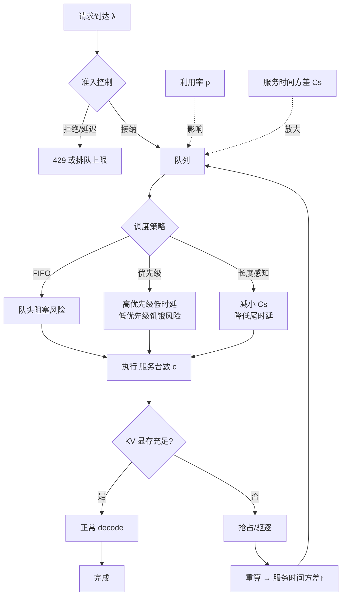

# 推理系统的排队论

> 位置：[InferenceAtlas](../../INDEX.md) > [模块 01](README.md) > 当前文档
> 信息截至：2026-07-29 ｜ 最后核验：2026-07-29 ｜ 内容版本：v0.1
> 时效性等级：低
> 相关主题：[时延与 SLO](02_latency_throughput_and_slo.md)｜[容量规划](08_capacity_planning.md)｜[调度与准入控制](../03_serving_engines_and_scheduling/)

## 本章导读

推理系统的时延问题中，有相当大一部分与模型、kernel、硬件都无关，而是排队现象。当有人报告"P99 是均值的 10 倍"时，最可能的解释不是某个算子偶尔变慢，而是**系统运行在高利用率区间，排队时延发散**。

排队论提供了理解这一现象的最小工具集。本章不做严格的随机过程推导，只建立四个可用于工程判断的结论：Little's Law 给出并发、到达率与时延的恒等关系；利用率接近 1 时排队时延**非线性发散**；服务时间的方差直接放大尾时延；队头阻塞会把长请求的代价转嫁给短请求。

理解这四条之后，"为什么不能把利用率跑到 95%"这类问题就有了定量答案，而不是经验之谈。

## 学习目标

读完本章后，读者应能够：

1. 用 Little's Law 在并发数、到达率、逗留时间三者间互相反推；
2. 解释利用率与排队时延的非线性关系，并说明为何必须预留余量；
3. 说明服务时间方差如何放大尾时延，以及这在 LLM 推理中为何尤其严重；
4. 用排队视角解释准入控制、优先级队列、抢占的作用与代价。

## 核心结论

- **$L = \lambda W$ 是恒等式**，对任何稳态排队系统成立，不依赖分布假设。它是容量估算最可靠的工具。
- **排队时延随利用率 $\rho$ 按 $\frac{\rho}{1-\rho}$ 量级增长**。$\rho$ 从 0.8 升到 0.95，排队时延增长约 4.75 倍；升到 0.99 则增长约 19 倍。
- **LLM 推理的服务时间方差极大**（输出长度可差两个数量级），这使得尾时延放大效应比传统 Web 服务严重得多。
- **准入控制不是可选项**。没有准入控制的系统在过载时会进入排队时延发散状态，且无法自行恢复。

## 1. 问题定义、系统边界与工作负载

### 1.1 把推理系统抽象成排队系统

| 排队论概念 | 推理系统中的对应 | 注意事项 |
|---|---|---|
| 顾客（customer） | 请求 | — |
| 到达率 $\lambda$ | req/s | 需按时间段区分，非平稳 |
| 服务台数 $c$ | 有效并发槽位 | 受 KV 显存约束，**不是固定值** |
| 服务时间 $S$ | 请求的处理时长 | 与输出长度强相关，方差极大 |
| 服务率 $\mu$ | $1/E[S]$ | — |
| 利用率 $\rho$ | $\lambda / (c\mu)$ | 超过 1 即不稳定 |
| 排队规则 | FIFO / 优先级 / 抢占 | 影响公平性与尾时延 |

**关键差异**：经典排队模型假设服务台数固定。而推理系统的"服务台数"由 KV 显存决定，随请求长度动态变化——长请求占用更多显存，实际可并发数下降。这使得推理系统比经典模型更容易在长请求集中时突然进入过载。

### 1.2 本章模型的适用边界

本章使用 M/M/1 与 M/M/c 作为**定性工具**，它们假设泊松到达与指数服务时间。真实推理系统两条假设都不严格成立：

- 到达通常有突发性（比泊松更集中）；
- 服务时间不是指数分布（输出长度分布往往重尾）。

**因此本章的公式用于建立量级直觉与趋势判断，不用于精确预测。** 精确预测需要用实际分布做仿真或直接压测。这一点必须明确，否则容易产生伪精确。

## 2. 原理、数学与性能模型

### 2.1 Little's Law

$$
L = \lambda W
$$

- $L$：系统中平均请求数（含排队与服务中），单位：个；
- $\lambda$：平均到达率（= 稳态下的完成率），单位：req/s；
- $W$：请求的平均逗留时间（排队 + 服务），单位：s。

**为什么它可靠**：这是一个恒等式，只要求系统稳态且长期平均存在，**不依赖任何分布假设**。这使它成为容量估算中最不容易出错的工具。

**三种用法**：

| 已知 | 求 | 应用场景 |
|---|---|---|
| $\lambda$, $W$ | $L$ | 估算需要支持的并发规模 |
| $L$, $W$ | $\lambda$ | 由并发上限反推可承载流量 |
| $L$, $\lambda$ | $W$ | 由观测的并发与流量推算平均时延 |

**教学案例一（交互式 chat 服务）**：
目标平均端到端时延 $W = 8$ s，预期到达率 $\lambda = 50$ req/s。
则 $L = 50 \times 8 = 400$ 个请求同时在系统中。
若单实例的并发上限为 40（由 KV 显存决定），则至少需要 10 个实例——**且这还没有留任何余量**。

**教学案例二（企业 RAG 服务）**：
输入长，$W = 15$ s（prefill 占比高），$\lambda = 12$ req/s。
$L = 180$。若长上下文使单实例并发上限降至 12，则需 15 个实例。
**观察**：$\lambda$ 只有案例一的 1/4，但所需实例数反而更多——因为 $W$ 更长且单实例并发更低。这说明**吞吐需求不能只看 req/s**。

**教学案例三（高并发 agent workload）**：
Agent 请求含多轮工具调用，$W = 45$ s（含等待外部工具），$\lambda = 20$ req/s。
$L = 900$。
**关键观察**：其中大量请求处于"等待外部工具"状态，不占用 GPU 但占用会话状态与 KV cache。
**设计含义**：必须区分"占用 GPU 的并发"与"占用状态的并发"。若不区分，会严重高估所需 GPU 数量；若对等待中的会话不做 KV 处理（如换出），则会耗尽显存。

### 2.2 利用率与排队时延

对 M/M/1 系统，平均排队时延（不含服务时间）为：

$$
W_q = \frac{\rho}{1-\rho} \cdot \frac{1}{\mu}
$$

其中 $\rho = \lambda/\mu$ 为利用率，$1/\mu$ 为平均服务时间。

**核心因子 $\dfrac{\rho}{1-\rho}$ 的行为**：

| $\rho$ | $\frac{\rho}{1-\rho}$ | 相对 $\rho=0.5$ 的倍数 |
|---:|---:|---:|
| 0.50 | 1.00 | 1× |
| 0.70 | 2.33 | 2.3× |
| 0.80 | 4.00 | 4× |
| 0.90 | 9.00 | 9× |
| 0.95 | 19.00 | 19× |
| 0.99 | 99.00 | 99× |

**这张表是本章最重要的内容**。它定量回答了"为什么不能把利用率跑满"：

- 从 0.8 到 0.9，利用率只提升 12.5%，排队时延增加 125%；
- 从 0.9 到 0.95，利用率提升 5.6%，排队时延再增加 111%。

**工程含义**：高利用率的边际收益迅速被时延代价吞噬。存在一个由 SLO 决定的**经济利用率上限**，超过它的"效率提升"实际上是在损害服务。

**局限**：M/M/1 假设指数服务时间。实际推理系统的服务时间方差更大，因此**真实的发散比该式更早、更陡**。这个方向的偏差意味着上表是**乐观估计**。

### 2.3 方差如何放大尾时延

对 M/G/1 系统，Pollaczek–Khinchine 公式给出：

$$
W_q = \frac{\lambda E[S^2]}{2(1-\rho)}
$$

其中 $E[S^2]$ 为服务时间的二阶矩。用变异系数 $C_S = \sigma_S / E[S]$ 改写：

$$
W_q = \frac{\rho}{1-\rho} \cdot \frac{E[S]}{2} \cdot (1 + C_S^2)
$$

**关键**：排队时延与 $(1 + C_S^2)$ 成正比。服务时间的**变异系数越大，排队时延越长**，且是平方关系。

**这对 LLM 推理为何格外重要**：

推理请求的服务时间主要由输出长度决定。若输出长度分布从 50 token 到 5,000 token（两个数量级），则 $C_S$ 可以远大于 1，使 $(1+C_S^2)$ 达到很大的值。

**对比**：传统 Web 服务的响应时间通常在一个数量级内波动，$C_S \approx 1$，$(1+C_S^2) \approx 2$。

**结论**：**LLM 推理系统的尾时延对利用率比传统服务敏感得多**，因此需要更大的余量。用 Web 服务的运维经验（"利用率跑到 70–80% 很正常"）直接套用到推理系统是危险的。

**缓解手段**：减小 $C_S$ 本身，即按长度分池或分优先级——这是第 3 节的主题。

## 3. 实现机制与系统设计

### 3.1 排队现象与调度手段的映射

**图展示什么**：请求在排队系统中的路径，以及三个影响排队时延的因子（利用率、方差、抢占重算）如何作用于队列。

**核心瓶颈在哪**：图中 `KV 显存不足 → 抢占 → 重算 → 回到队列` 这条反馈回路是最危险的路径。它**增大服务时间方差**，而方差又增大排队时延，进而使更多请求积压——这是一个正反馈，即 cache thrashing 的排队论解释。

**图中的 trade-off**：准入控制在入口拒绝请求（牺牲可用性）以保护已接纳请求的时延；优先级调度改善高优先级时延但可能使低优先级饥饿；长度感知调度减小方差但增加调度复杂度与碎片。

**面试如何引用**：被问到"过载时系统为什么不能自行恢复"时，指出这条正反馈回路——抢占重算增大方差、方差放大排队、排队加剧显存压力。能识别正反馈是排查此类问题的关键。

### 3.2 三类调度手段的排队论解释

| 手段 | 作用的量 | 效果 | 代价 |
|---|---|---|---|
| **准入控制** | 限制 $\lambda$ | 防止 $\rho \to 1$ 导致发散 | 拒绝部分请求 |
| **优先级队列** | 分层的有效 $\rho$ | 高优先级看到更低的 $\rho$ | 低优先级时延恶化 |
| **长度感知分池** | 降低每池的 $C_S$ | 直接压缩尾时延放大因子 | 资源碎片、利用率下降 |
| **抢占** | 防止长请求独占 | 改善短请求时延 | 重算成本、**增大方差** |
| **增加副本** | 提高 $c\mu$，降低 $\rho$ | 全面改善 | 成本上升 |

**重要观察**：抢占是双刃剑。它改善短请求的等待，但重算会**增大服务时间方差**，从而通过 $(1+C_S^2)$ 项反向推高排队时延。因此抢占策略必须限制频率，否则会适得其反。

### 3.3 队头阻塞

FIFO 队列中，队首的长请求会阻塞其后所有短请求，即使后者只需极短服务时间。

**在 LLM 推理中的两种形态**：

1. **调度层队头阻塞**：长 prompt 的 prefill 占据整个迭代，队列中的短请求无法开始；
2. **批内队头阻塞**：同批中最长的序列决定该批的结束时间（在非迭代级调度下）。

第二种由 continuous batching 解决（见 [模块 03](../03_serving_engines_and_scheduling/)），第一种需要 chunked prefill 或优先级/长度感知调度。

## 4. 性能、成本、能耗与可靠性 trade-off

**经济利用率的确定**：

给定 SLO 要求的排队时延上限 $W_q^{max}$ 与平均服务时间 $E[S]$、变异系数 $C_S$，可反解可接受的最大利用率：

$$
\rho^{max} \approx \frac{2 W_q^{max}}{2 W_q^{max} + E[S](1+C_S^2)}
$$

**用法**：这给出一个数量级估计，说明"该系统的利用率不应超过多少"。它把"留多少余量"从拍脑袋变成有依据的计算。

**局限**：基于 M/G/1 的平均值公式，对分位数只是间接约束；实际应以压测得到的分位数曲线为准。

**成本含义**：$\rho^{max}$ 越低，达成同样吞吐所需的硬件越多，成本越高。因此**降低 $C_S$（分池、限制最大输出长度）是同时改善时延与成本的少数手段之一**。

## 5. benchmark、真实案例或公开部署案例

| 与本章相关的公开结论 | 来源 |
|---|---|
| 请求级批处理下短请求需等待批内最长请求完成——批内队头阻塞的直接描述 | [Orca, OSDI 2022](https://www.usenix.org/conference/osdi22/presentation/yu) |
| KV 显存不足触发的抢占与重算是服务质量波动的来源之一 | [PagedAttention, SOSP 2023](https://arxiv.org/abs/2309.06180) |

> 排队论本身是经典结果（Little 1961；Pollaczek–Khinchine）。本章的推理系统应用为**本库的分析框架**，具体数值案例为教学构造，非实测数据。

## 6. 设计决策框架

**排队相关的设计检查表**：

- [ ] 已用 Little's Law 估算目标并发规模 $L$
- [ ] 已区分"占用 GPU 的并发"与"占用状态的并发"（agent 场景必需）
- [ ] 已测算服务时间的变异系数 $C_S$
- [ ] 已确定经济利用率上限 $\rho^{max}$，并据此规划容量
- [ ] 已实现准入控制，且过载行为已定义
- [ ] 已评估是否需要按长度或优先级分池
- [ ] 抢占频率已设上限，避免正反馈
- [ ] 监控项包含队列深度与排队时延（而非只有端到端时延）

## 7. 常见失败模式与排查路径

| 失败模式 | 表现 | 排队论解释 | 纠正 |
|---|---|---|---|
| 利用率跑到 90%+ | P99 急剧恶化 | $\frac{\rho}{1-\rho}$ 发散 | 降低目标利用率，加副本 |
| 长短请求混合 | 短请求 P99 异常 | $C_S$ 过大 + 队头阻塞 | 分池或长度感知调度 |
| 过载后无法恢复 | 流量降回正常仍积压 | 抢占重算正反馈 | 准入控制 + 限制抢占 |
| 用均值容量规划 | 峰值期崩溃 | 忽略突发使实际 $\rho > 1$ | 按峰值 + 余量规划 |
| Agent 场景 GPU 估算过高 | 资源浪费 | 未区分两类并发 | 分别建模 |
| 只监控端到端时延 | 无法定位 | 缺少 $W_q$ 观测 | 单独埋点排队时延 |
| 优先级导致饥饿 | 低优先级请求超时 | 低优先级实际 $\rho$ 接近 1 | 设置最低服务保障 |

## 8. 关联面试主题

1. **用 Little's Law 做容量估算** → 本章 2.1
2. **为什么不能把利用率跑满** → 本章 2.2
3. **为什么 LLM 推理的尾时延比 Web 服务更敏感** → 本章 2.3
4. **过载后系统为什么无法自行恢复** → 本章 3.1
5. **准入控制、优先级、抢占各解决什么问题** → 本章 3.2

## 9. 小结

排队论为推理系统的时延问题提供了最小工具集。Little's Law 是不依赖分布假设的恒等式，是容量估算最可靠的工具。排队时延随利用率按 $\frac{\rho}{1-\rho}$ 发散，因此存在由 SLO 决定的经济利用率上限。服务时间方差通过 $(1+C_S^2)$ 放大排队时延，而 LLM 推理的输出长度可跨两个数量级，使其尾时延对利用率远比传统服务敏感。抢占重算会增大方差并形成正反馈，这是过载后系统无法自行恢复的机制性原因；准入控制因此是必需而非可选。

## 关键术语

| 中文术语 | 英文 | 定义 | 单位/口径 | 关联文档 |
|---|---|---|---|---|
| 利特尔法则 | Little's Law | $L=\lambda W$，稳态恒等式 | — | 本章 2.1 |
| 利用率 | utilization $\rho$ | $\lambda/(c\mu)$，超过 1 即不稳定 | 无量纲 | 本章 2.2 |
| 变异系数 | coefficient of variation $C_S$ | $\sigma_S/E[S]$，服务时间的相对离散度 | 无量纲 | 本章 2.3 |
| 经济利用率上限 | economic utilization ceiling | SLO 约束下可接受的最大利用率 | 无量纲 | 本章 4 |
| 队头阻塞 | head-of-line blocking | 队首长请求阻塞其后短请求 | — | 本章 3.3 |
| 准入控制 | admission control | 入口处限制 $\lambda$ 以保护已接纳请求 | — | [模块 03](../03_serving_engines_and_scheduling/) |

## 延伸阅读

- [08 容量规划](08_capacity_planning.md) —— 把本章结论转化为容量数字
- [模块 03：调度与准入控制](../03_serving_engines_and_scheduling/) —— 排队手段的工程实现
- [模块 11：SLO 与可靠性](../11_benchmarking_reliability_and_observability/) —— 过载与级联失效

## 主要来源

| # | 来源 | 类型 | 披露等级 | 核验日期 |
|---:|---|---|---|---|
| 1 | [Orca (OSDI 2022)](https://www.usenix.org/conference/osdi22/presentation/yu) | 会议论文 | 独立可复现实验 | 2026-07-29 |
| 2 | [PagedAttention (SOSP 2023)](https://arxiv.org/abs/2309.06180) | 会议论文 | 独立可复现实验 | 2026-07-29 |

> **说明**：Little's Law 与 Pollaczek–Khinchine 公式为排队论经典结果（教科书内容，无需单一出处）。本章的推理系统应用与三个数值案例为**本库构造的教学示例**，非实测数据，已在正文中标明。

## 更新记录

| 日期 | 版本 | 变更 | 核验人 |
|---|---|---|---|
| 2026-07-29 | v0.1 | 初稿 | — |
