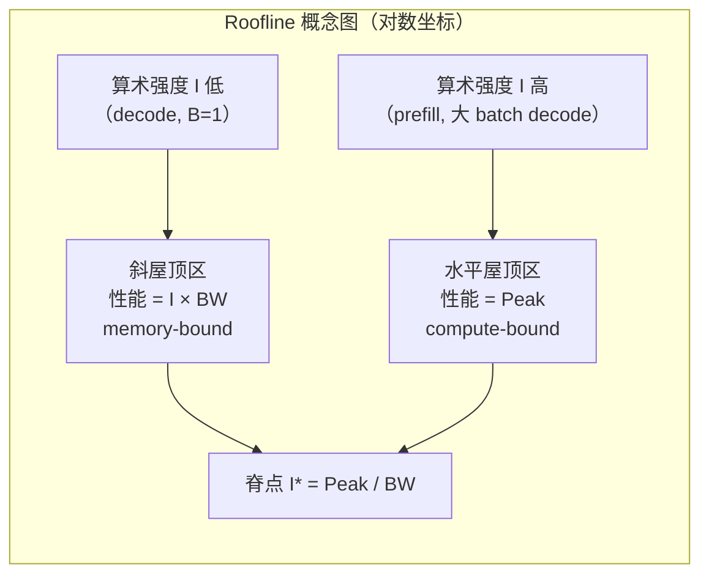

# Roofline 与性能建模

> 位置：[InferenceAtlas](../../INDEX.md) > [模块 01](README.md) > 当前文档
> 信息截至：2026-07-29 ｜ 最后核验：2026-07-29 ｜ 内容版本：v0.1
> 时效性等级：低
> 相关主题：[内存带宽与算术强度](05_memory_bandwidth_and_arithmetic_intensity.md)｜[硬件架构](../07_hardware_and_server_architecture/)｜[Kernel 优化](../04_compilers_runtimes_and_kernels/)

## 本章导读

Roofline 是推理性能分析中最有价值的单一模型。它用两个硬件参数（峰值算力、内存带宽）和一个 workload 参数（算术强度）就能判断：**你的性能瓶颈是算力还是带宽，以及理论上还有多少提升空间**。

这个判断决定了后续所有优化是否有意义。如果一个 kernel 已经跑到带宽上限，那么再怎么优化指令调度也不会更快——唯一的出路是减少内存访问量。反过来，如果它远低于两条上限，说明存在实现问题（占用率不足、同步开销、launch 开销），此时调整算法是浪费时间。

本章还要说明 Roofline 的局限。它是一个**上界模型**，不预测实际性能，只给出"不可能超过多少"。把 Roofline 当成性能预测器是常见误用。

## 学习目标

读完本章后，读者应能够：

1. 画出并解释 Roofline 图，标出脊点（ridge point）与两个区间；
2. 计算 prefill 与 decode 阶段的算术强度，并判定各自的瓶颈类型；
3. 用 Roofline 判断一次优化是否有理论空间，以及应该往哪个方向优化；
4. 说明 Roofline 的四个主要局限，避免误用。

## 核心结论

- **可达性能 = min(峰值算力, 算术强度 × 带宽)**。这是一个上界，不是预测值。
- **脊点 $I^* = \text{Peak}/BW$ 是纯硬件属性**。workload 的算术强度低于它即为 memory-bound。
- **LLM decode 的算术强度远低于当代加速器的脊点**，因此稳定处于 memory-bound 区间。批处理是提升算术强度的主要手段。
- **Roofline 判断优化方向**：memory-bound 时减少内存访问（量化、融合、批处理），compute-bound 时减少计算量或提高算力利用率。

## 1. 问题定义、系统边界与工作负载

### 1.1 两个硬件上限

任何计算都受两个物理上限约束：

| 上限 | 含义 | 单位 | 决定因素 |
|---|---|---|---|
| 峰值算力 $P$ | 每秒最多能做多少次运算 | FLOP/s（须注明精度） | 计算单元数量与频率 |
| 内存带宽 $BW$ | 每秒最多能搬运多少字节 | byte/s | 显存类型、位宽、频率 |

**注意**：峰值算力必须绑定精度。BF16 与 INT8 的峰值可以相差数倍，稀疏加速又是另一档。不注明精度的 FLOPS 数字无法用于 Roofline 分析。

### 1.2 一个 workload 参数

**算术强度**（arithmetic intensity）：

$$
I = \frac{\text{计算量 (FLOP)}}{\text{内存访问量 (byte)}}
$$

**关键**：分母是**实际发生的**内存访问量，不是理论最小值。同一个算法，不同实现的 $I$ 可以差很多——这正是算子融合与 tiling 优化的作用机理。

## 2. 原理、数学与性能模型

### 2.1 Roofline 公式

$$
\text{Attainable Performance} = \min\left(P,\; I \times BW\right)
$$

单位为 FLOP/s。两项的含义：

- $P$：无论内存多快，算力不可能超过峰值——**水平屋顶**；
- $I \times BW$：每字节能做 $I$ 次运算，每秒能搬 $BW$ 字节，故上限为 $I \times BW$——**斜屋顶**。

### 2.2 脊点

两条线的交点：

$$
I^* = \frac{P}{BW}
$$

单位：FLOP/byte。这是**纯硬件属性**，与 workload 无关。

| 情况 | 判定 | 优化方向 |
|---|---|---|
| $I < I^*$ | **memory-bound** | 减少内存访问量：量化、算子融合、提高数据复用、增大 batch |
| $I > I^*$ | **compute-bound** | 减少计算量、提高算力利用率、用更低精度换更高峰值 |
| $I \approx I^*$ | 平衡点附近 | 两侧都需兼顾 |

**当代趋势**：加速器的峰值算力增速长期快于内存带宽增速，因此 $I^*$ 持续上升。这意味着**越来越多的 workload 落入 memory-bound 区间**——这就是"内存墙"在 Roofline 视角下的表述。详见 [模块 07](../07_hardware_and_server_architecture/)。

### 2.3 LLM 推理两阶段的算术强度

**Decode 阶段（每序列每步生成 1 个 token）**

设模型权重字节数为 $W_{bytes}$。一次前向：

- 计算量：约 $2 \times P_{params}$ FLOP（每个参数一次乘加）；
- 内存访问：至少需读取全部权重，即 $W_{bytes}$ 字节。

若批大小为 $B$（$B$ 个序列同时 decode），权重只需读一次但被 $B$ 个序列复用：

$$
I_{decode} \approx \frac{2 \times P_{params} \times B}{W_{bytes} + \text{KV 访问}} \approx \frac{2 B}{b_w}
$$

其中 $b_w$ 为每参数的权重字节数（BF16 时为 2，INT8 为 1，INT4 为 0.5）。

**这个结果非常重要**：

$$
\boxed{I_{decode} \approx \frac{2B}{b_w}}
$$

- $B=1$、BF16：$I \approx 1$ FLOP/byte；
- $B=32$、BF16：$I \approx 32$ FLOP/byte；
- $B=32$、INT4：$I \approx 128$ FLOP/byte。

**推论一**：单序列 decode 的算术强度约为 1，远低于当代加速器的脊点，因此**必然 memory-bound**。

**推论二**：**批处理是提升 decode 算术强度的直接手段**，且近似线性。这从第一性原理解释了为什么 continuous batching 对吞吐提升如此显著。

**推论三**：**量化通过减小 $b_w$ 同时提升算术强度并减少总访问量**，因此对 decode 是双重收益。

**Prefill 阶段（一次处理 $S_{in}$ 个 token）**

$$
I_{prefill} \approx \frac{2 S_{in}}{b_w}
$$

由于 $S_{in}$ 通常成百上千，$I_{prefill}$ 远高于脊点，因此 **prefill 通常 compute-bound**。

**统一理解**：prefill 与 decode 的算术强度公式形式相同，只是"同时被处理的 token 数"分别是 $S_{in}$ 与 $B$。这解释了为什么把二者放在一起分析时容易混淆——它们本质是同一个公式的两个取值区间。

**假设与局限**：以上推导忽略了 KV cache 的读取（在长上下文下不可忽略）、激活的读写、以及非线性层的开销。它给出的是**量级估计**，用于判定瓶颈类型而非精确计算。长上下文下 KV 读取可能主导内存访问，需单独建模。

### 2.4 Roofline 图

**图展示什么**：算术强度轴上的两个区间与分界脊点，以及 LLM 推理两阶段的典型位置。

**核心瓶颈在哪**：LLM decode 在小 batch 时位于斜屋顶区的左端，可达性能远低于峰值算力。**这意味着购买峰值算力更高的卡对单序列 decode 几乎无帮助**——这是硬件选型中最容易犯的错误。

**图中的 trade-off**：向右移动（增大 batch）提升算术强度与吞吐，但增大 batch 会提高 TPOT 与 KV 显存占用。因此"往右走多远"由 SLO 和显存共同限制，不是越右越好。

**面试如何引用**：被问到"为什么 decode 慢"或"批处理为什么有效"时，用 Roofline 给出定量解释：$I_{decode} \approx 2B/b_w$，小 $B$ 时远低于脊点，批处理沿横轴右移直至触及水平屋顶。这比定性说"decode 是内存受限"深一层。

## 3. 实现机制与系统设计

### 3.1 用 Roofline 指导优化

**步骤**：

1. 测量实际性能（FLOP/s）与实际内存访问量（可用 profiler 获取）；
2. 计算实际算术强度 $I$；
3. 在 Roofline 图上定位；
4. 比较实际性能与该 $I$ 处的上界；
5. 按下表决定行动。

| 情况 | 诊断 | 行动 |
|---|---|---|
| 实际性能接近斜屋顶 | 已达带宽上限 | **减少内存访问**：量化、融合、增大 batch、提高数据复用 |
| 实际性能接近水平屋顶 | 已达算力上限 | **减少计算量**或换更高峰值精度 |
| 实际性能远低于两条屋顶 | **实现问题** | 查占用率、launch 开销、同步、内存合并、尾部效应 |

**第三种情况最常见也最有价值**——它说明存在无需改变算法就能获得的收益。[模块 04](../04_compilers_runtimes_and_kernels/) 展开具体排查手段。

### 3.2 分层 Roofline

单一 Roofline 假设只有一级内存。真实加速器有多级：寄存器 → 共享内存/SRAM → L2 → HBM。

**分层 Roofline** 为每一级画一条斜屋顶。这解释了 FlashAttention 类优化的机理：**通过 tiling 把数据保持在 SRAM 中，使有效带宽从 HBM 带宽变为 SRAM 带宽**，从而把斜屋顶大幅抬高。

这也说明为什么"减少 HBM 访问"比"减少总内存访问"更准确——不同层级的字节成本相差一个数量级以上。

## 4. 性能、成本、能耗与可靠性 trade-off

| 优化 | 对 $I$ 的作用 | 对可达性能 | 代价 |
|---|---|---|---|
| 增大 batch | ↑ 线性 | ↑ 直至触顶 | TPOT ↑、KV 显存 ↑ |
| 权重量化 | ↑（$b_w$ ↓） | ↑ 双重收益 | 可能质量下降 |
| KV 量化 | ↑（长上下文时） | ↑ | 可能质量下降 |
| 算子融合 | ↑（减少中间读写） | ↑ | 实现复杂度 |
| Tiling / FlashAttention | 有效 $BW$ ↑ | ↑ 显著 | kernel 复杂度 |
| 投机解码 | ↑（一次验证多 token） | ↑ | draft 开销、接受率依赖 |
| 换更高峰值算力的卡 | 不变 | **memory-bound 时无改善** | 成本 ↑ 而无收益 |

**最后一行是硬件选型的关键提醒**：在 memory-bound 区间，提升峰值算力不改变可达性能。选型应看**带宽与容量**，这一点在 [模块 07](../07_hardware_and_server_architecture/) 的选型框架中会被反复使用。

## 5. benchmark、真实案例或公开部署案例

| 公开结论 | 来源 | 与 Roofline 的关系 |
|---|---|---|
| 注意力的性能瓶颈在 HBM 读写而非 FLOP；通过分块与在线 softmax 避免物化注意力矩阵 | [FlashAttention, NeurIPS 2022](https://arxiv.org/abs/2205.14135) | 分层 Roofline 的典型应用：把访问从 HBM 移到 SRAM |
| 迭代级调度通过提高有效批大小改善加速器利用率 | [Orca, OSDI 2022](https://www.usenix.org/conference/osdi22/presentation/yu) | 沿算术强度轴右移 |

> 具体硬件的 $P$、$BW$、$I^*$ 数值需引用厂商官方规格，将在 [模块 07](../07_hardware_and_server_architecture/) 与 [`accelerators.csv`](../../data/accelerators.csv) 中逐条附来源与披露等级。本章不给出无来源的具体数字。`待核实`

## 6. 设计决策框架

**Roofline 分析检查表**：

- [ ] 已获取目标硬件的峰值算力（**注明精度**）与内存带宽（官方来源）
- [ ] 已计算脊点 $I^*$
- [ ] 已估算 workload 在 prefill 与 decode 两阶段的 $I$
- [ ] 已判定各阶段的瓶颈类型
- [ ] 已用 profiler 测量实际性能与实际内存访问量
- [ ] 已定位实际性能相对上界的位置
- [ ] 优化方向与瓶颈类型一致（未在 memory-bound 时优化算力）
- [ ] 已考虑长上下文下 KV 访问对 $I$ 的影响

## 7. 常见失败模式与排查路径

| 失败模式 | 表现 | 根因 | 纠正 |
|---|---|---|---|
| 在 memory-bound 时优化算力 | 优化后无改善 | 未做 Roofline 定位 | 先算 $I$ 与 $I^*$ |
| 用峰值算力选卡 | 实际吞吐远低于预期 | decode 是 memory-bound | 看带宽与容量 |
| 忽略 KV 访问 | 长上下文下模型失准 | $I$ 估算只算了权重 | 长上下文需单独建模 |
| 把 Roofline 当预测器 | 实际远低于上界却认为异常 | 混淆上界与预测 | Roofline 只给上界 |
| 未注明精度的峰值 | 分析结论错误 | FLOPS 未绑定精度 | 明确精度与稀疏性 |
| 单层 Roofline 分析融合优化 | 无法解释收益来源 | 忽略层级差异 | 用分层 Roofline |

## 8. 关联面试主题

1. **解释 Roofline 模型与脊点** → 本章 2.1–2.2
2. **推导 decode 的算术强度，说明批处理为何有效** → 本章 2.3
3. **为什么峰值算力不能预测 LLM 推理性能** → 本章 4
4. **FlashAttention 的收益在 Roofline 上如何体现** → 本章 3.2
5. **性能远低于两条屋顶时如何排查** → 本章 3.1

## 9. 小结

Roofline 用峰值算力、内存带宽与算术强度三个量给出可达性能上界。脊点 $I^*=P/BW$ 是纯硬件属性，workload 算术强度低于它即为 memory-bound。LLM decode 的算术强度约为 $2B/b_w$，单序列时约为 1，远低于当代脊点，因此必然 memory-bound；这从第一性原理解释了批处理与量化为何是 decode 优化的主要手段。Roofline 是上界模型而非预测器，其最大实用价值在于判断优化方向与识别"实际性能远低于两条屋顶"的实现问题。分层 Roofline 进一步解释了 tiling 类优化把访问从 HBM 移到 SRAM 的收益机理。

## 关键术语

| 中文术语 | 英文 | 定义 | 单位/口径 | 关联文档 |
|---|---|---|---|---|
| 算术强度 | arithmetic intensity | 计算量与实际内存访问量之比 | FLOP/byte | 本章 1.2 |
| 脊点 | ridge point | $I^*=P/BW$，memory/compute-bound 分界 | FLOP/byte | 本章 2.2 |
| 可达性能 | attainable performance | $\min(P, I\times BW)$，上界非预测 | FLOP/s | 本章 2.1 |
| 分层 Roofline | hierarchical roofline | 为每级内存画一条斜屋顶 | — | 本章 3.2 |
| 内存墙 | memory wall | 算力增速快于带宽增速导致 $I^*$ 上升 | — | [模块 07](../07_hardware_and_server_architecture/) |

## 延伸阅读

- [05 内存带宽与算术强度](05_memory_bandwidth_and_arithmetic_intensity.md) —— 本章 2.3 的深入展开
- [模块 04：Kernel 与编译](../04_compilers_runtimes_and_kernels/) —— "实际远低于上界"的排查手段
- [模块 07：硬件架构](../07_hardware_and_server_architecture/) —— 具体硬件的 $P$ 与 $BW$

## 主要来源

| # | 来源 | 类型 | 披露等级 | 核验日期 |
|---:|---|---|---|---|
| 1 | [FlashAttention (NeurIPS 2022)](https://arxiv.org/abs/2205.14135) | 会议论文 | 独立可复现实验 | 2026-07-29 |
| 2 | [Orca (OSDI 2022)](https://www.usenix.org/conference/osdi22/presentation/yu) | 会议论文 | 独立可复现实验 | 2026-07-29 |

> **说明**：Roofline 模型为经典性能分析方法（Williams, Waterman & Patterson, CACM 2009）。本章第 2.3 节的 LLM 两阶段算术强度推导为**本库基于第一性原理的教学推导**，其近似性质已在正文中声明。

## 更新记录

| 日期 | 版本 | 变更 | 核验人 |
|---|---|---|---|
| 2026-07-29 | v0.1 | 初稿 | — |
