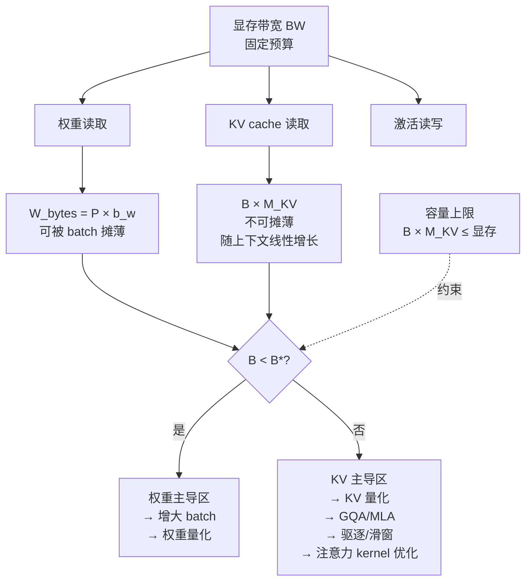

# 内存带宽、算术强度与带宽墙

> 位置：[InferenceAtlas](../../INDEX.md) > [模块 01](README.md) > 当前文档
> 信息截至：2026-07-29 ｜ 最后核验：2026-07-29 ｜ 内容版本：v0.1
> 时效性等级：低
> 相关主题：[Roofline](04_roofline_and_performance_modeling.md)｜[KV Cache 容量](../02_transformer_and_kv_cache/)｜[HBM 与内存层次](../07_hardware_and_server_architecture/)

## 本章导读

上一章用 Roofline 建立了"decode 是 memory-bound"这一判断。本章回答其直接后果：**给定硬件带宽，单序列的 token 生成速度存在一个不可逾越的上界**，且这个上界只由带宽和权重字节数决定，与算力完全无关。

这是推理系统中最有实用价值的估算之一。它让你在拿到硬件规格的五分钟内，就能估出"这块卡跑这个模型，单序列最快能到每秒多少 token"，从而判断厂商宣称的数字是否合理、目标 SLO 是否可能达成。

本章还要处理一个常被忽略的复杂性：**长上下文下，KV cache 的读取会取代权重读取成为带宽消耗的主体**。这改变了优化的优先级，也解释了为什么长上下文服务的性能特征与短上下文完全不同。

## 学习目标

读完本章后，读者应能够：

1. 由模型大小、精度与硬件带宽估算单序列 decode 的 token/s 上界；
2. 说明批处理如何摊薄权重读取，以及这一收益的饱和条件；
3. 判断在给定上下文长度下，带宽消耗以权重为主还是以 KV 为主；
4. 解释带宽墙的形成机理及其对系统与硬件设计的传导后果。

## 核心结论

- **单序列 decode 速度上界 $\approx BW / W_{bytes}$ token/s**。这是一个五分钟内可完成的估算，且相当接近实际。
- **批处理摊薄权重读取**：$B$ 个序列共享一次权重读取，因此吞吐近似随 $B$ 线性增长，直到算力饱和或 KV 带宽成为主体。
- **量化是唯一同时降低带宽需求与显存占用的手段**，因此对 memory-bound 的 decode 是杠杆最大的优化。
- **长上下文下 KV 读取主导带宽**。当 KV 总字节数超过权重字节数时，优化重点必须从权重转向 KV。

## 1. 问题定义、系统边界与工作负载

### 1.1 decode 一步到底搬了多少字节

每生成一个 token，至少需要从显存读取：

| 项 | 字节数 | 是否随 batch 摊薄 | 是否随上下文增长 |
|---|---|---|---|
| 模型权重 | $W_{bytes} = P_{params} \times b_w$ | **是**（$B$ 个序列共享） | 否 |
| KV cache | $M_{KV}$（见下） | 否（每序列独立） | **是**（线性） |
| 激活与中间结果 | 相对较小 | 部分 | 弱 |

**核心区别**：权重读取**可被批处理摊薄**，KV 读取**不能**——每个序列必须读自己的 KV。这个不对称性是理解 decode 性能的关键。

### 1.2 两个区间

| 区间 | 条件 | 带宽主体 | 优化重点 |
|---|---|---|---|
| **权重主导** | $W_{bytes} \gg B \times M_{KV,\text{per-seq}}$ | 权重 | 批处理、权重量化 |
| **KV 主导** | $B \times M_{KV,\text{per-seq}} \gg W_{bytes}$ | KV cache | KV 量化、GQA/MLA、驱逐、注意力优化 |

短上下文、小 batch 时处于权重主导区；长上下文、大 batch 时进入 KV 主导区。**两个区间的优化手段几乎不重叠**，因此先判定区间再选手段是必要的第一步。

## 2. 原理、数学与性能模型

### 2.1 单序列 decode 速度上界

设显存带宽 $BW$（byte/s），模型权重字节数 $W_{bytes}$。忽略 KV 与激活（短上下文下合理）：

每步至少读一遍权重，故每步耗时下界：

$$
t_{step} \ge \frac{W_{bytes}}{BW}
$$

因此单序列生成速度上界：

$$
\boxed{\text{tokens/s} \le \frac{BW}{W_{bytes}} = \frac{BW}{P_{params} \times b_w}}
$$

**这个式子的用法**：

| 已知 | 求 | 用途 |
|---|---|---|
| $BW$、$P_{params}$、$b_w$ | tokens/s 上界 | 判断 SLO 是否可能达成 |
| 目标 tokens/s、$P_{params}$ | 所需 $BW$ | 硬件选型下限 |
| $BW$、目标 tokens/s | 可接受的 $W_{bytes}$ | 决定量化精度 |

**量化的直接后果**：$b_w$ 从 2（BF16）降到 1（INT8）使上界翻倍，降到 0.5（INT4）使上界翻两番。**这是量化对 decode 收益如此显著的根本原因**——它不是"让计算更快"，而是"让需要搬运的字节更少"。

**局限**：这是上界。实际会低于它，因为还要读 KV、写激活、存在 kernel 效率损失与非理想的带宽利用率。实测通常达到上界的某个比例，该比例依赖实现质量，需实测标定。`待核实`

### 2.2 批处理的摊薄效应

$B$ 个序列同时 decode 时，权重只需读一次：

$$
\text{总吞吐} \le \frac{B \times BW}{W_{bytes} + B \times M_{KV,\text{per-seq}}}
$$

**两个极限**：

- 当 $B \times M_{KV} \ll W_{bytes}$：吞吐 $\approx B \times BW / W_{bytes}$，**随 $B$ 线性增长**；
- 当 $B \times M_{KV} \gg W_{bytes}$：吞吐 $\approx BW / M_{KV,\text{per-seq}}$，**与 $B$ 无关，饱和**。

**这解释了两个重要现象**：

1. 短上下文场景下，增大 batch 对吞吐的提升近似线性——这是 continuous batching 收益巨大的原因；
2. 长上下文场景下，增大 batch 的吞吐收益迅速饱和——因为 KV 读取无法摊薄。**在长上下文服务中，一味增大 batch 是无效的**。

**第三个约束**：$B$ 还受 KV 显存容量限制（$B \times M_{KV} \le$ 可用显存）。因此实际的 $B$ 上限是"带宽饱和点"与"容量上限"中较小者。

### 2.3 判定区间的临界并发

令权重与 KV 带宽消耗相等：

$$
W_{bytes} = B^* \times M_{KV,\text{per-seq}}
$$

$$
B^* = \frac{W_{bytes}}{M_{KV,\text{per-seq}}} = \frac{P_{params} \times b_w}{2 L S H_{KV} D_h b_{kv}}
$$

**用法**：当实际并发 $B < B^*$ 时处于权重主导区，$B > B^*$ 时进入 KV 主导区。

**观察**：$B^*$ 与上下文长度 $S$ 成反比。上下文越长，越早进入 KV 主导区。这定量说明了为什么长上下文服务需要完全不同的优化策略。

**局限**：忽略了注意力计算本身的访存模式、cache 层级效应与实现细节。用于确定量级与方向。

## 3. 实现机制与系统设计

### 3.1 带宽预算分配

**图展示什么**：固定的带宽预算如何在权重、KV、激活之间分配，以及临界并发 $B^*$ 如何划分两个优化区间。

**核心瓶颈在哪**：瓶颈随位置移动。左侧（小 batch、短上下文）瓶颈是权重读取，右侧（大 batch、长上下文）瓶颈是 KV 读取。**在错误的区间应用优化是常见的浪费**——例如在 KV 主导区继续加大 batch。

**图中的 trade-off**：增大 batch 摊薄权重（收益）但增加 KV 带宽与容量占用（代价）。存在一个使总吞吐最大的 $B$，超过它反而下降。同时容量上限（虚线）可能在带宽饱和之前就已触及。

**面试如何引用**：被问到"如何提升 decode 吞吐"时，先问上下文长度与并发，据此判定区间，再给出对应手段。直接回答"用 continuous batching"而不区分区间，会在长上下文追问下失分。

### 3.2 各优化手段的作用位置

| 手段 | 减少的字节 | 作用区间 | 对容量的影响 |
|---|---|---|---|
| 权重量化（INT8/INT4） | $W_{bytes}$ | 权重主导区 | 显存占用 ↓ |
| 批处理 | 摊薄 $W_{bytes}$ | 权重主导区 | KV 占用 ↑ |
| KV 量化 | $M_{KV}$ | KV 主导区 | 显存占用 ↓ |
| GQA / MQA | $M_{KV}$（减小 $H_{KV}$） | KV 主导区 | 显存占用 ↓ |
| MLA | $M_{KV}$（低维潜表示） | KV 主导区 | 显存占用 ↓ |
| 滑窗 / 驱逐 | $M_{KV}$（减小 $S$） | KV 主导区 | 显存占用 ↓，**丢失远端上下文** |
| 前缀共享 | 摊薄 $M_{KV}$ | 两者 | 显存占用 ↓ |
| FlashAttention 类 | 把访问从 HBM 移到 SRAM | KV 主导区 | 无 |
| 投机解码 | 摊薄 $W_{bytes}$（一次读多 token） | 权重主导区 | 需 draft 模型显存 |
| MoE | $W_{bytes}$（只读激活专家） | 权重主导区 | 总权重显存 ↑ |

**MoE 一行值得注意**：MoE 减少每 token 需读取的权重字节（只读激活的专家），因此在带宽维度是收益；但总权重必须全部驻留显存，因此在容量维度是代价。这个"带宽收益、容量代价"的组合是理解 MoE 推理特性的关键，详见 [模块 06](../06_distributed_and_moe_inference/)。

### 3.3 带宽墙

**形成机理**：加速器峰值算力的增长长期快于内存带宽的增长。其物理原因包括：算力可通过增加计算单元与降低精度快速扩展，而带宽受限于封装引脚数、信号完整性与内存代际节奏。

**Roofline 视角的表述**：脊点 $I^* = P/BW$ 持续上升，越来越多的 workload 落入 memory-bound 区间。

**传导后果**：

| 层 | 后果 |
|---|---|
| 硬件 | HBM 容量与带宽成为核心竞争点；先进封装成为瓶颈环节 |
| 架构 | 促使 MoE、GQA/MLA 等"减少每 token 访存"的架构设计 |
| 算法 | 促使量化、投机解码、多 token 预测 |
| 系统 | 促使批处理、前缀共享、KV 管理成为一等问题 |
| 产业 | 价值向内存与封装环节迁移 |

**这条传导链是 [模块 01 执行摘要](../00_start_here/01_executive_summary.md)"三个物理约束"论断的技术基础**，也是理解产业格局变化的技术起点。

## 4. 性能、成本、能耗与可靠性 trade-off

**能耗视角**：数据搬运的能耗通常显著高于同等规模的算术运算，且距离越远（寄存器 → SRAM → HBM → 片外）能耗差距越大。

**因此**：减少 HBM 访问不仅提升性能，也直接降低 J/token。这使得 memory-bound 优化在性能与能耗上是同向的——这在优化中并不常见（多数优化需要在两者间取舍）。

**具体的能耗比值需引用厂商或学术测量，本库不给出无来源数字。** `待核实` 详见 [07 能效](07_energy_efficiency_and_joules_per_token.md)。

## 5. benchmark、真实案例或公开部署案例

| 公开结论 | 来源 | 与本章的关系 |
|---|---|---|
| 注意力的瓶颈是 HBM 读写而非 FLOP；通过 tiling 与在线 softmax 避免物化中间矩阵，减少 HBM 访问 | [FlashAttention, NeurIPS 2022](https://arxiv.org/abs/2205.14135) | 直接印证"减少 HBM 访问"是 memory-bound 优化的正确方向 |
| 迭代级调度提高有效批大小，改善加速器利用率 | [Orca, OSDI 2022](https://www.usenix.org/conference/osdi22/presentation/yu) | 批处理摊薄权重读取 |
| 分页管理提高 KV 显存有效利用率，从而支持更高并发 | [PagedAttention, SOSP 2023](https://arxiv.org/abs/2309.06180) | 容量约束的缓解 |
| 投机解码用一次前向验证多个 token，摊薄权重读取 | [Speculative Decoding, ICML 2023](https://arxiv.org/abs/2211.17192) | 权重主导区的优化 |

> 具体硬件的带宽数值与实测达成比例，将在 [模块 07](../07_hardware_and_server_architecture/) 与 [`accelerators.csv`](../../data/accelerators.csv) 中附官方来源。`待核实`

## 6. 设计决策框架

**带宽分析检查表**：

- [ ] 已获取目标硬件的显存带宽（官方来源，单位 **TB/s 字节**）
- [ ] 已计算 $W_{bytes} = P_{params} \times b_w$
- [ ] 已估算单序列 decode 速度上界 $BW/W_{bytes}$
- [ ] 已用该上界检验目标 TPOT 是否可能达成
- [ ] 已计算临界并发 $B^*$，判定所处区间
- [ ] 优化手段与所处区间匹配
- [ ] 已同时检查容量约束（$B \times M_{KV} \le$ 可用显存）
- [ ] 长上下文场景已单独建模 KV 带宽

## 7. 常见失败模式与排查路径

| 失败模式 | 表现 | 根因 | 纠正 |
|---|---|---|---|
| 用峰值算力估算 decode 速度 | 估算值远高于实际 | decode 是 memory-bound | 用 $BW/W_{bytes}$ |
| 长上下文下继续加大 batch | 吞吐不再提升甚至下降 | 已进入 KV 主导区 | 转向 KV 优化 |
| 只做权重量化 | 长上下文下收益有限 | KV 未量化，仍是带宽主体 | 同时量化 KV |
| 忽略容量约束 | OOM 或频繁抢占 | 只算带宽未算容量 | 两者同时检查 |
| 用 Tb/s 当 TB/s | 估算差 8 倍 | 单位混淆 | 严格区分字节与比特 |
| 假设带宽 100% 利用 | 实际低于估算 | 存在效率损失 | 用实测比例修正 |
| 认为 MoE 一定省显存 | 显存不足 | MoE 省带宽不省容量 | 区分两个维度 |

## 8. 关联面试主题

1. **估算单序列 decode 的 token/s 上界** → 本章 2.1
2. **批处理为什么能提升吞吐，何时饱和** → 本章 2.2
3. **长上下文下优化重点为何改变** → 本章 2.3、3.1
4. **量化对 decode 的收益机理** → 本章 2.1
5. **带宽墙如何传导到架构与产业** → 本章 3.3

## 9. 小结

decode 阶段每生成一个 token 至少要把权重读一遍，因此单序列速度上界约为 $BW/W_{bytes}$——一个只依赖带宽与权重字节数、与算力无关的量。批处理让多个序列共享权重读取，使吞吐近似线性增长，但 KV 读取无法摊薄，因此在临界并发 $B^*$ 之后进入 KV 主导区，此时优化重点必须从权重转向 KV。$B^*$ 与上下文长度成反比，这定量解释了长上下文服务的特殊性。量化通过减小每元素字节数同时缓解带宽与容量，是 memory-bound 场景杠杆最大的手段。带宽墙——算力增速持续快于带宽增速——是这一切的物理背景，并向上传导到架构、算法、系统与产业格局。

## 关键术语

| 中文术语 | 英文 | 定义 | 单位/口径 | 关联文档 |
|---|---|---|---|---|
| 权重字节数 | weight bytes | $P_{params}\times b_w$，每步至少读取一遍 | byte | 本章 2.1 |
| 临界并发 | critical batch size $B^*$ | 权重与 KV 带宽消耗相等时的并发数 | 个 | 本章 2.3 |
| 权重主导区 | weight-dominated regime | $B<B^*$，带宽主要消耗在权重读取 | — | 本章 1.2 |
| KV 主导区 | KV-dominated regime | $B>B^*$，带宽主要消耗在 KV 读取 | — | 本章 1.2 |
| 带宽墙 | bandwidth wall | 算力增速持续快于带宽增速 | — | 本章 3.3 |

## 延伸阅读

- [04 Roofline](04_roofline_and_performance_modeling.md) —— 本章的理论框架
- [模块 02：KV Cache 容量模型](../02_transformer_and_kv_cache/) —— $M_{KV}$ 的完整推导
- [模块 07：HBM 与内存层次](../07_hardware_and_server_architecture/) —— 带宽的物理来源与演进

## 主要来源

| # | 来源 | 类型 | 披露等级 | 核验日期 |
|---:|---|---|---|---|
| 1 | [FlashAttention (NeurIPS 2022)](https://arxiv.org/abs/2205.14135) | 会议论文 | 独立可复现实验 | 2026-07-29 |
| 2 | [Orca (OSDI 2022)](https://www.usenix.org/conference/osdi22/presentation/yu) | 会议论文 | 独立可复现实验 | 2026-07-29 |
| 3 | [PagedAttention (SOSP 2023)](https://arxiv.org/abs/2309.06180) | 会议论文 | 独立可复现实验 | 2026-07-29 |
| 4 | [Speculative Decoding (ICML 2023)](https://arxiv.org/abs/2211.17192) | 会议论文 | 独立可复现实验 | 2026-07-29 |

> **说明**：本章的带宽上界与临界并发推导为**本库基于第一性原理的教学推导**，其近似性质与忽略项已在正文中逐条声明。具体硬件数值需引用官方规格，本章不提供。

## 更新记录

| 日期 | 版本 | 变更 | 核验人 |
|---|---|---|---|
| 2026-07-29 | v0.1 | 初稿 | — |
