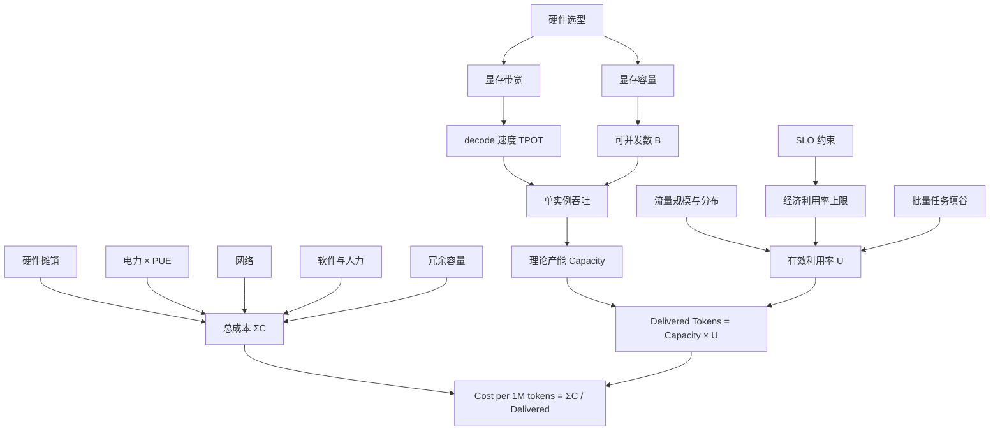

# 成本建模与单位经济性

> 位置：[InferenceAtlas](../../INDEX.md) > [模块 01](README.md) > 当前文档
> 信息截至：2026-07-29 ｜ 最后核验：2026-07-29 ｜ 内容版本：v0.1
> 时效性等级：中
> 相关主题：[容量规划](08_capacity_planning.md)｜[能效](07_energy_efficiency_and_joules_per_token.md)｜[市场与经济学](../15_market_economics_and_strategy/)

> **免责声明**：本章提供成本**分析框架**，不构成投资建议。所有涉及具体价格的数字必须带来源与核验日期；本章不给出无来源的价格数值。

## 本章导读

推理成本是持续运营成本，直接进入服务毛利。这使得成本建模不是财务部门的事后核算，而是**系统设计的一个约束条件**——它与时延、吞吐处于同一层级。

本章要建立的核心认识是：**硬件单价低不必然意味着服务成本低**。单 token 成本的分母是"实际交付的 token"，因此利用率、批处理效率、输入输出长度比都直接进入成本。一块单价便宜但带宽不足、导致只能跑小 batch 的卡，其单 token 成本可能高于单价昂贵的卡。

本章还要反复强调一件事：**避免伪精确**。成本模型的输入（利用率、折旧年限、电价、运维分摊）通常只有一两位有效数字，因此输出不应该有五位。看到 `$0.0037421/1K tokens` 这样的数字，第一反应应该是怀疑而非信任。

## 学习目标

读完本章后，读者应能够：

1. 写出单 token 成本的分解式，并说明每一项的口径与常见遗漏；
2. 解释利用率如何进入成本分母，并量化其影响；
3. 说明为什么硬件单价不能单独决定服务成本；
4. 识别成本估算中的伪精确，并给出合理的有效位数。

## 核心结论

- **$\text{Cost/Token} = \dfrac{\sum \text{成本项}}{\text{实际交付 token}}$**。分母是实际交付量而非理论产能，因此**利用率直接进入成本**。
- **利用率 30% 时单位成本约为满载的 3.3 倍**。推理服务的商业竞争在很大程度上是利用率竞争。
- **输入与输出 token 的成本结构不同**：输入经 prefill（一次并行处理，成本低），输出经 decode（逐 token，成本高）。二者定价不同是有技术依据的。
- **成本模型的有效位数受最不精确的输入约束**，通常应保留 1–2 位有效数字。

## 1. 问题定义、系统边界与工作负载

### 1.1 成本的边界

成本模型的第一步是声明**包含什么、不包含什么**。不同边界得出的数字相差可以很大，混用会导致错误结论。

| 成本项 | 通常包含 | 常被遗漏 |
|---|---|---|
| 加速器 | 采购摊销或云实例费用 | 折旧年限假设、残值 |
| 主机 | CPU、内存、本地存储 | — |
| 电力 | IT 设备耗电 | **散热耗电（PUE 系数）** |
| 网络 | 集群内互连 | **出口带宽费用** |
| 存储 | 模型权重、日志 | 日志的长期留存成本 |
| 软件 | 许可、订阅 | **自研软件的工程人力摊销** |
| 运维 | 人力、监控 | 值班、事故处理 |
| 冗余 | 备用容量 | **为突发预留的闲置容量** |

**最常见的三个遗漏**：散热耗电、闲置冗余容量、工程人力。三者合计可以显著改变结论，因此边界声明必须明确。

## 2. 原理、数学与性能模型

### 2.1 单 token 成本

$$
\text{Cost per Token} = \frac{C_{accel} + C_{power} + C_{network} + C_{software} + C_{ops}}{\text{Delivered Tokens}}
$$

**变量说明**：

| 符号 | 含义 | 单位 | 常见口径问题 |
|---|---|---|---|
| $C_{accel}$ | 加速器与主机成本（摊销到观测期） | $ | 折旧年限、是否含主机 |
| $C_{power}$ | 电力成本（**须含 PUE**） | $ | 是否含散热 |
| $C_{network}$ | 网络成本 | $ | 是否含出口带宽 |
| $C_{software}$ | 软件许可与工程摊销 | $ | 自研人力常被漏算 |
| $C_{ops}$ | 运维人力与设施 | $ | — |
| Delivered Tokens | **观测期内实际交付的** token | token | 是 output 还是 total |

**报告单位**：本库统一使用 **$/1M tokens**。不使用 $/token，因为后者会产生大量前导零，诱发伪精确。

### 2.2 利用率如何进入成本

把交付量写成产能与利用率的乘积：

$$
\text{Delivered Tokens} = \text{Capacity} \times U
$$

其中 $U$ 为有效利用率（实际交付 ÷ 理论产能）。则：

$$
\text{Cost per Token} = \frac{\sum C_i}{\text{Capacity} \times U} \propto \frac{1}{U}
$$

**因为大部分成本项（加速器摊销、运维、预留容量）与是否有流量无关**，它们在低利用率时被更少的 token 摊薄。

| 利用率 $U$ | 相对满载的单位成本 |
|---:|---:|
| 100% | 1.0× |
| 70% | 1.4× |
| 50% | 2.0× |
| 30% | **3.3×** |
| 15% | 6.7× |

**这张表的商业含义**：两家公司使用完全相同的硬件与软件，仅因利用率不同，单位成本就可以相差数倍。**推理服务的成本竞争在很大程度上是利用率竞争**，而利用率取决于流量规模、流量的时间分布、以及能否用批量任务填谷。

**与排队论的张力**：[排队论](03_queueing_theory_for_inference.md) 指出利用率过高会使排队时延发散。因此存在一个**由 SLO 约束的经济利用率上限**——不是越高越好。成本优化与时延保障在这一点上直接冲突，必须显式取舍。

### 2.3 输入与输出 token 的成本差异

**技术依据**：

- 输入 token 经 prefill 处理：一次并行前向，$S_{in}$ 个 token 共享一次权重读取，算术强度高，**单 token 边际成本低**；
- 输出 token 经 decode 处理：每个 token 一次前向，权重读取只能被同批的 $B$ 个序列摊薄，**单 token 边际成本高**。

**粗略的相对关系**（教学近似）：

$$
\frac{\text{成本}_{\text{output token}}}{\text{成本}_{\text{input token}}} \sim \frac{S_{in}}{B}
$$

即输入越长、批越小，两者差距越大。

**这解释了为什么 API 定价普遍对输入与输出分别计价，且输出单价更高**——这是有技术依据的定价结构，不是随意设定。

**重要修正**：前缀缓存命中会使输入 token 的边际成本进一步大幅下降（无需重新 prefill）。这解释了缓存命中的输入通常有单独的、更低的计价档。

> 具体的定价数值与倍数关系需引用各厂商官方定价页，将在 [模块 15](../15_market_economics_and_strategy/) 与 [`cloud_pricing.csv`](../../data/cloud_pricing.csv) 中逐条附来源与核验日期。本章不给出无来源的价格。`待核实`

### 2.4 避免伪精确

**规则**：输出的有效位数不应超过最不精确输入的有效位数。

典型输入的精度：

| 输入 | 典型精度 | 说明 |
|---|---|---|
| 硬件采购价 | 2–3 位 | 视采购规模浮动 |
| 折旧年限 | 1 位 | 通常是 3 年或 5 年这样的整数假设 |
| 有效利用率 | **1 位** | 波动大，且随时间变化 |
| 电价 | 2 位 | 地区与合约差异 |
| PUE | 2 位 | 季节波动 |
| 运维分摊 | **1 位** | 基本是估计 |

**结论**：由于至少两项输入只有 1 位有效数字，**输出应保留 1–2 位有效数字**。

**正确写法**：`约 $0.4/1M tokens（利用率 50% 假设下，±50% 区间）`
**错误写法**：`$0.42731/1M tokens`

第二种写法传递了模型不具备的确定性，是本库明确禁止的。

## 3. 实现机制与系统设计

### 3.1 成本传导链

**图展示什么**：从硬件选型到单位成本的完整传导链，以及利用率这条独立支路如何与产能相乘决定分母。

**核心瓶颈在哪**：图中 `有效利用率 U` 是最容易被忽视但影响最大的节点。它不由技术决定，而由流量规模、流量分布与 SLO 约束共同决定。**一个技术上优秀但利用率低的部署，其单位成本可能高于技术平庸但满载的部署。**

**图中的 trade-off**：`SLO 约束 → 经济利用率上限` 这条边表示时延保障对成本的直接代价。收紧 SLO 会压低可接受利用率，从而抬高单位成本。这是产品决策而非技术决策。

**面试如何引用**：被问到"如何降低推理成本"时，用这张图说明有两条独立路径——提高产能（技术路径）与提高利用率（业务与调度路径），并指出后者常被低估。能同时讨论两条路径说明具备成本视角。

### 3.2 降本手段与其作用位置

| 手段 | 作用于 | 代价 |
|---|---|---|
| 量化 | 提高吞吐 → Capacity ↑ | 可能质量下降 |
| 批处理 | 提高吞吐 → Capacity ↑ | TPOT ↑ |
| 前缀缓存 | 减少 prefill 计算 → Capacity ↑ | 收益依赖流量模式 |
| 模型路由/级联 | 简单请求用小模型 → 成本 ↓ | 路由错误的质量风险 |
| 批量任务填谷 | 提高 $U$ | 需要有可延迟的负载 |
| 预留实例 | 降低 $C_{accel}$ 单价 | 承诺期风险 |
| 可中断/竞价实例 | 降低 $C_{accel}$ | 中断处理复杂度 |
| 提高 SLO 容忍度 | 提高经济利用率上限 → $U$ ↑ | 用户体验 |
| 限制最大输出长度 | 减少 token 数与方差 | 功能限制 |
| 液冷等设施优化 | 降低 PUE → $C_{power}$ ↓ | 前期投入 |

**观察**：这张表分为两组——前四项提高产能（技术路径），后六项提高利用率或降低单价（业务与运营路径）。**成熟的成本优化必须同时走两条路**，只做技术优化会遇到明显的收益递减。

## 4. 性能、成本、能耗与可靠性 trade-off

| 冲突 | 机制 | 处理 |
|---|---|---|
| 成本 ↔ 时延 | 高利用率降成本但排队时延发散 | 由 SLO 确定经济利用率上限 |
| 成本 ↔ 可靠性 | 冗余容量长期闲置 | 用可中断的批量负载填充冗余 |
| 成本 ↔ 质量 | 量化与小模型路由降成本但可能降质量 | 质量评测门槛 + 分级路由 |
| 成本 ↔ 灵活性 | 预留实例便宜但锁定容量 | 预留 + 按需混合 |
| 短期成本 ↔ 长期成本 | 自建摊销周期长但单位成本低 | 视规模与增长确定性 |

## 5. benchmark、真实案例或公开部署案例

| 与本章相关的机制性结论 | 来源 |
|---|---|
| 提高有效批大小可显著改善加速器利用率，进而改善单位产出成本 | [Orca, OSDI 2022](https://www.usenix.org/conference/osdi22/presentation/yu) |
| 减少 KV 显存浪费可提高并发数，摊薄固定成本 | [PagedAttention, SOSP 2023](https://arxiv.org/abs/2309.06180) |

> **本库不提供**任何厂商的实际成本、定价、毛利或 capex 数字。此类数据必须来自官方定价页、财报或正式披露，将在 [模块 15](../15_market_economics_and_strategy/) 中逐条附一手来源与核验日期。当前 [`cloud_pricing.csv`](../../data/cloud_pricing.csv) 为空。`待核实`

## 6. 设计决策框架

**成本建模步骤**：

1. **声明边界**：明确包含与不包含的成本项，写进模型文档；
2. **确定观测期**：月度或年度，与折旧假设一致；
3. **列出各成本项**并标注每项的精度（有效位数）；
4. **估算理论产能**：由硬件与配置推出 tokens/s，再乘以观测期；
5. **估算有效利用率**：从历史流量或规划流量推出，并说明依据；
6. **计算单位成本**，保留 1–2 位有效数字；
7. **做敏感度分析**：逐一改变利用率、折旧年限、电价，看结论是否稳健；
8. **区分输入与输出成本**，并单独处理缓存命中的输入；
9. **明确声明模型为近似**，给出不确定区间。

**第 7 步是最重要的**。如果结论在利用率从 40% 变到 60% 时发生反转，那么这个结论不足以支撑决策。

## 7. 常见失败模式与排查路径

| 失败模式 | 表现 | 根因 | 纠正 |
|---|---|---|---|
| 伪精确 | 给出 5 位有效数字 | 未考虑输入精度 | 保留 1–2 位 + 区间 |
| 忽略利用率 | 实际成本远高于估算 | 用理论产能作分母 | 分母用实际交付量 |
| 漏算散热耗电 | 电力成本低估 | 未乘 PUE | $C_{power}$ 含 PUE |
| 漏算闲置冗余 | 成本低估 | 只算在用容量 | 冗余成本计入 |
| 漏算工程人力 | 自研方案显得过于便宜 | 只算硬件 | 人力摊销计入 |
| 输入输出不分 | 定价或成本归因错误 | 未区分 prefill/decode | 分别建模 |
| 只做技术优化 | 收益递减 | 未动利用率 | 同时优化利用率 |
| 无敏感度分析 | 结论脆弱 | 单点估算 | 关键输入做区间 |
| 用硬件单价比较 | 选型错误 | 忽略吞吐差异 | 比较 $/1M tokens |

## 8. 关联面试主题

1. **写出并解释单 token 成本模型** → 本章 2.1
2. **利用率如何影响单位成本** → 本章 2.2
3. **为什么输入与输出 token 定价不同** → 本章 2.3
4. **为什么硬件单价低不必然服务成本低** → 本章 3.1
5. **如何避免成本估算中的伪精确** → 本章 2.4

## 9. 小结

单 token 成本的分母是实际交付量而非理论产能，因此利用率直接进入成本且影响巨大——利用率 30% 时单位成本约为满载的 3.3 倍。这使推理服务的成本竞争在很大程度上成为利用率竞争，而利用率又受 SLO 约束的经济上限限制，形成成本与时延的直接冲突。输入 token 经 prefill 并行处理、输出 token 经 decode 逐个生成，二者边际成本结构不同，这是分别计价的技术依据。成本模型的输入通常只有 1–2 位有效数字，因此输出必须相应地保留 1–2 位并给出区间；伪精确是本领域最常见的分析缺陷之一。

## 关键术语

| 中文术语 | 英文 | 定义 | 单位/口径 | 关联文档 |
|---|---|---|---|---|
| 单 token 成本 | cost per token | 交付每 token 的摊销成本 | **$/1M tokens** | 本章 2.1 |
| 有效利用率 | effective utilization | 实际交付量与理论产能之比 | % | 本章 2.2 |
| 经济利用率上限 | economic utilization ceiling | SLO 约束下可接受的最大利用率 | % | [03 排队论](03_queueing_theory_for_inference.md) |
| 伪精确 | false precision | 输出位数超出输入精度所支持的范围 | — | 本章 2.4 |
| 敏感度分析 | sensitivity analysis | 检验结论对关键输入变化的稳健性 | — | 本章 6 |

## 延伸阅读

- [07 能效与 J/token](07_energy_efficiency_and_joules_per_token.md) —— $C_{power}$ 的展开
- [08 容量规划](08_capacity_planning.md) —— 产能与冗余的确定
- [模块 15：市场、经济学与战略](../15_market_economics_and_strategy/) —— 带来源的实际定价与 TCO 分析

## 主要来源

| # | 来源 | 类型 | 披露等级 | 核验日期 |
|---:|---|---|---|---|
| 1 | [Orca (OSDI 2022)](https://www.usenix.org/conference/osdi22/presentation/yu) | 会议论文 | 独立可复现实验 | 2026-07-29 |
| 2 | [PagedAttention (SOSP 2023)](https://arxiv.org/abs/2309.06180) | 会议论文 | 独立可复现实验 | 2026-07-29 |

> **说明**：本章的成本分解式与利用率倍数表为**本库的分析框架与算术推论**，不含任何厂商的实际成本或定价数据。所有具体价格数字将在 [模块 15](../15_market_economics_and_strategy/) 中附官方来源与核验日期。

## 更新记录

| 日期 | 版本 | 变更 | 核验人 |
|---|---|---|---|
| 2026-07-29 | v0.1 | 初稿 | — |
