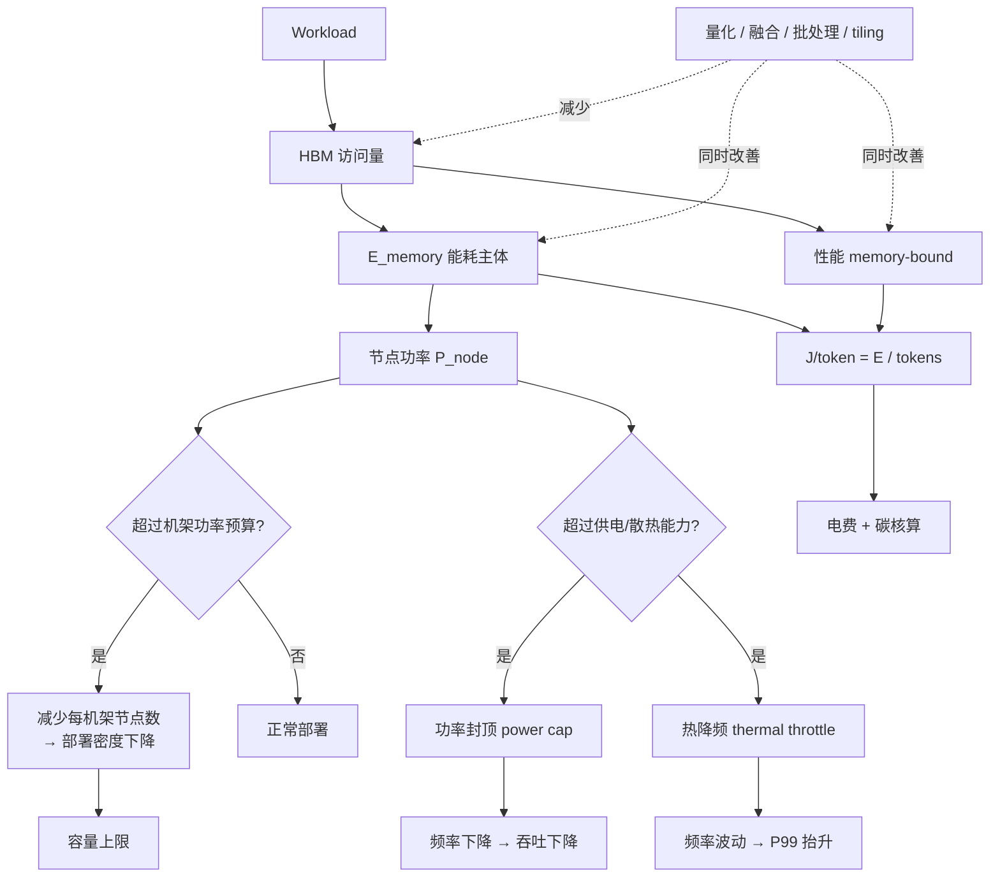

# 能效与每 token 焦耳

> 位置：[InferenceAtlas](../../INDEX.md) > [模块 01](README.md) > 当前文档
> 信息截至：2026-07-29 ｜ 最后核验：2026-07-29 ｜ 内容版本：v0.1
> 时效性等级：中
> 相关主题：[成本建模](06_cost_modeling_and_unit_economics.md)｜[数据中心电力与散热](../09_datacenter_power_thermal_and_operations/)｜[内存带宽](05_memory_bandwidth_and_arithmetic_intensity.md)

## 本章导读

能耗在推理系统中有双重身份：它既是成本的一部分（电费），也是**容量的硬约束**（机架供电与散热能力决定了单位空间能塞多少算力）。第二重身份往往更重要——在供电受限的站点，能效直接决定了能部署多少推理容量，这是钱买不到的。

本章的核心是把能效变成一个**可比较的量**。J/token 看起来简单，但它是本库中口径分歧最严重的指标之一：同一套系统，按芯片测、按整机测、按机架测、按设施测，结果可以相差数倍。不声明测量边界的 J/token 数字不可比。

本章不提供具体的能耗数值——这类数据必须来自厂商官方测量或有完整方法论的第三方实验，本库不做估算。

## 学习目标

读完本章后，读者应能够：

1. 精确定义 J/token 并说出四种测量边界的差异；
2. 解释为什么 memory-bound 优化在性能与能耗上是同向的；
3. 说明功率封顶与热降频如何转化为时延与吞吐问题；
4. 判断一份能效数据是否可与另一份比较。

## 核心结论

- **J/token 必须声明测量边界**：chip / node / rack / facility 四级，逐级放大。跨边界比较无效。
- **数据搬运的能耗高于同等规模的算术运算**，且距离越远差距越大。因此减少 HBM 访问同时改善性能与能耗——这是少数不需要取舍的优化方向。
- **能效是容量约束而非仅成本项**。供电受限站点的可部署容量由 J/token 直接决定。
- **功率封顶与热降频会以时延劣化的形式出现**，排查时容易被误判为软件问题。

## 1. 问题定义、系统边界与工作负载

### 1.1 四种测量边界

| 边界 | 包含 | 典型用途 | 相对量级 |
|---|---|---|---|
| **Chip** | 加速器芯片本身 | 架构对比 | 最小 |
| **Node / Server** | 加速器 + CPU + 内存 + NIC + 电源损耗 | 系统对比 | 大于 chip |
| **Rack** | 整机架含交换机、配电损耗 | 部署密度规划 | 大于 node |
| **Facility** | 含散热、UPS 等设施开销（即乘 PUE） | 总能耗与碳核算 | 最大 |

**关系**（概念性）：

$$
E_{facility} \approx E_{rack} \times \text{PUE}, \qquad E_{rack} > E_{node} > E_{chip}
$$

**为什么这很重要**：厂商对比通常采用 chip 或 node 边界（数字最好看），而运营方关心 facility 边界（决定电费与容量）。二者可以相差相当大的倍数。**看到 J/token 数字的第一个问题应该是"这是哪一级"。**

> 各级之间的具体倍数关系依赖具体系统配置，本库不给出无来源的通用系数。`待核实`

### 1.2 定义

$$
\text{J/token} = \frac{\text{观测期内消耗的能量 (J)}}{\text{观测期内产出的 token 数}}
$$

**必须同时声明**：

| 项 | 原因 |
|---|---|
| 测量边界 | 见 1.1 |
| 是 output token 还是 total token | 同吞吐口径问题 |
| workload 配置 | 输入输出长度、batch、并发 |
| 是否含空载功耗 | 低利用率下空载占比很高 |
| 观测期与采样方式 | 瞬时功率 vs 平均功率 |

**空载功耗尤其重要**：在低利用率下，闲置但通电的设备仍在耗电。若测量时排除空载，会严重低估实际运营的 J/token——这与成本模型中"利用率进入分母"是同一个现象。

## 2. 原理、数学与性能模型

### 2.1 能耗的来源分解

一次 decode 迭代的能耗大致来自：

$$
E_{step} \approx E_{compute} + E_{memory} + E_{interconnect} + E_{static}
$$

| 项 | 含义 | 在 LLM decode 中的地位 |
|---|---|---|
| $E_{compute}$ | 算术运算 | 相对较小（decode 算力利用率低） |
| $E_{memory}$ | HBM 读写 | **主体**（decode 是 memory-bound） |
| $E_{interconnect}$ | 片间/节点间通信 | 分布式下不可忽略 |
| $E_{static}$ | 静态与漏电功耗 | 低利用率下占比上升 |

**关键的物理事实**：数据搬运的单位能耗显著高于算术运算，且随距离增加而增加（寄存器 → SRAM → HBM → 片外链路）。

**因此**：$E_{memory}$ 在 memory-bound 的 decode 阶段是能耗主体，这与它是性能瓶颈是同一个原因。

> 具体的能耗比值（例如"一次 HBM 访问相当于多少次乘加的能耗"）在学术文献中有测量，但数值随工艺代际与具体设计变化很大。本库不引用无来源的通用比值。`待核实`

### 2.2 为什么 memory-bound 优化是"双赢"

大多数优化需要取舍：提升吞吐会牺牲时延，降低精度会牺牲质量。但对 memory-bound 的 decode：

$$
\text{减少 HBM 访问} \Rightarrow \begin{cases} \text{性能} \uparrow & (\text{Roofline 斜屋顶}) \\ \text{能耗} \downarrow & (E_{memory} \text{ 是主体}) \end{cases}
$$

**因此以下手段同时改善性能与能效**：

| 手段 | 减少的访问 | 性能 | 能效 |
|---|---|---|---|
| 权重量化 | 权重字节 | ↑ | ↑ |
| KV 量化 | KV 字节 | ↑ | ↑ |
| 批处理 | 摊薄权重读取 | ↑ | ↑ |
| 算子融合 | 中间结果读写 | ↑ | ↑ |
| Tiling（FlashAttention 类） | HBM → SRAM | ↑ | ↑ |
| 前缀共享 | 重复 prefill 与 KV | ↑ | ↑ |
| GQA / MLA | KV 字节 | ↑ | ↑ |

**这是一个不常见的良性结构**，值得在设计与汇报中显式指出：memory-bound 场景下，性能优化基本等价于能效优化。

**例外**：投机解码会增加总计算量（draft 前向 + 被拒绝的候选），因此**它改善时延但可能恶化 J/token**。这是一个需要显式权衡的例子，不能简单归入"双赢"类。

### 2.3 能效作为容量约束

设机架可用功率为 $P_{rack}$（kW），单节点功率为 $P_{node}$（kW），则：

$$
N_{node/rack} = \left\lfloor \frac{P_{rack}}{P_{node}} \right\rfloor
$$

**这个整数除法是硬约束**。当 $P_{node}$ 超过某阈值时，每机架能放的节点数就会下降一档，导致：

- 相同算力需要更多机架空间；
- 更多的网络布线与交换成本；
- 更长的部署周期（机房改造）。

**因此**：能效不仅是"每 token 花多少电"，更是"给定供电条件下能部署多少容量"。在供电受限的站点，这直接决定业务规模上限。详见 [模块 09](../09_datacenter_power_thermal_and_operations/)。

## 3. 实现机制与系统设计

### 3.1 能耗与性能的耦合路径

**图展示什么**：HBM 访问量作为共同源头，如何同时决定性能与能耗，以及能耗如何通过功率预算传导为容量约束与时延问题。

**核心瓶颈在哪**：图中 `功率封顶` 与 `热降频` 两条路径最容易被误诊。它们表现为吞吐下降或 P99 抬升，症状与软件问题相似，但根因在设施层。排查时若不看频率曲线与温度，会在软件侧浪费大量时间。

**图中的 trade-off**：左侧的优化手段（虚线）同时改善性能与能耗，是难得的双赢；但右侧的容量约束是硬边界，无法通过软件优化突破——只能通过降低单节点功率或增加供电。

**面试如何引用**：被问到"服务运行一段时间后变慢"时，把热降频与功率封顶列入候选，并说明如何用频率曲线与温度数据验证。多数候选人只在软件层排查，能提到设施层会明显加分。

### 3.2 功率封顶与热降频的识别

| 现象 | 功率封顶 | 热降频 |
|---|---|---|
| 触发条件 | 功耗达到设定上限 | 温度达到阈值 |
| 时间特征 | 高负载时立即出现 | **运行一段时间后逐渐出现** |
| 表现 | 吞吐上限被压低 | 吞吐缓慢下降、P99 抬升 |
| 观测信号 | 功率读数贴住上限、频率下降 | 温度上升、频率波动 |
| 缓解 | 提高功率预算或降低负载 | 改善散热、降低机架密度 |

**排查纪律**：任何"运行一段时间后变慢"的现象，都应把温度与频率曲线列为**首查项之一**，与软件指标并行检查。

## 4. 性能、成本、能耗与可靠性 trade-off

| 冲突 | 机制 | 处理 |
|---|---|---|
| 能效 ↔ 时延 | 降频省电但增加时延 | 按 SLO 分层设置功率策略 |
| 能效 ↔ 部署密度 | 高密度节省空间但加剧散热压力 | 液冷等散热方案 |
| J/token ↔ 时延（投机解码） | 投机解码降时延但增总计算量 | 按场景选择，交互式优先时延 |
| 能效 ↔ 冗余 | 冗余设备空载耗电 | 用可中断负载填充 |
| 初期投入 ↔ 长期能效 | 液冷等前期投入高但 PUE 低 | 按预期运行年限核算 |

## 5. benchmark、真实案例或公开部署案例

| 与本章相关的机制性结论 | 来源 |
|---|---|
| 注意力性能瓶颈在 HBM 读写；通过 tiling 减少 HBM 访问 | [FlashAttention, NeurIPS 2022](https://arxiv.org/abs/2205.14135) |
| 提高有效批大小改善加速器利用率 | [Orca, OSDI 2022](https://www.usenix.org/conference/osdi22/presentation/yu) |

**关于能耗数值**：MLPerf Inference 有功耗测量类别，其结果附带明确的测量方法论，是可用的一手来源。具体结果与方法论细节将在 [模块 11](../11_benchmarking_reliability_and_observability/) 中逐条核验后引用。`待核实`

> **本库不提供**任何未经核验的 J/token 数值、能耗比值或 PUE 数字。此类数据必须来自厂商官方测量、MLPerf 官方结果或有完整方法论的学术实验。

## 6. 设计决策框架

**能效评估检查表**：

- [ ] 已声明 J/token 的测量边界（chip / node / rack / facility）
- [ ] 已声明是 output 还是 total token 口径
- [ ] 已声明是否包含空载功耗
- [ ] 已记录 workload 配置（长度、batch、并发）
- [ ] 已确认机架功率预算与单节点功率的关系
- [ ] 已评估是否会触发功率封顶或热降频
- [ ] 监控包含功率、温度与频率曲线
- [ ] 优化方案已区分"双赢型"（减少访存）与"取舍型"（如投机解码）
- [ ] 与外部数据比较时已核对测量边界一致

## 7. 常见失败模式与排查路径

| 失败模式 | 表现 | 根因 | 纠正 |
|---|---|---|---|
| 跨边界比较 J/token | 结论矛盾 | chip vs facility | 统一边界 |
| 忽略空载功耗 | 实际电费高于估算 | 测量排除了空载 | 按实际运营口径 |
| 把热降频当软件问题 | 长时间排查无果 | 未查温度与频率 | 首查项加入设施指标 |
| 只优化算力能效 | 收效有限 | decode 能耗主体是访存 | 优先减少 HBM 访问 |
| 忽略部署密度约束 | 采购后无法上架 | 未核算机架功率 | 采购前核算 $P_{rack}/P_{node}$ |
| 假设投机解码省电 | J/token 反而上升 | 总计算量增加 | 单独评估该项 |
| 用瞬时功率算能耗 | 高估或低估 | 采样方式不当 | 用积分能量 |

## 8. 关联面试主题

1. **J/token 的四种测量边界及其差异** → 本章 1.1
2. **为什么减少 HBM 访问同时改善性能与能耗** → 本章 2.2
3. **能效如何转化为容量约束** → 本章 2.3
4. **如何区分功率封顶与热降频** → 本章 3.2
5. **如何把 J/token 纳入容量规划** → 本章 6、[08 容量规划](08_capacity_planning.md)

## 9. 小结

J/token 是推理能效的核心指标，但必须声明测量边界（chip/node/rack/facility）、token 口径与是否含空载功耗，否则不可比。LLM decode 是 memory-bound，其能耗主体是 HBM 访问，因此减少访存的优化同时改善性能与能效——这是少数不需要取舍的方向；投机解码是显著的例外，它降时延但增总计算量。能效不仅是成本项，更通过机架功率预算转化为部署密度与容量上限，在供电受限站点直接决定业务规模。功率封顶与热降频会以吞吐下降与 P99 抬升的形式出现，症状类似软件问题，排查时必须把温度与频率曲线列为首查项之一。

## 关键术语

| 中文术语 | 英文 | 定义 | 单位/口径 | 关联文档 |
|---|---|---|---|---|
| 每 token 焦耳 | J/token | 生成单 token 消耗的能量 | J，**须注明边界** | 本章 1.2 |
| 测量边界 | measurement boundary | chip / node / rack / facility 四级 | — | 本章 1.1 |
| 功率封顶 | power cap | 功耗达到上限触发的频率限制 | W | 本章 3.2 |
| 热降频 | thermal throttling | 温度达阈值触发的频率下降 | — | 本章 3.2 |
| 空载功耗 | idle power | 通电但无有效负载时的功耗 | W | 本章 1.2 |
| 电能使用效率 | PUE | 设施总耗电 ÷ IT 设备耗电 | 无量纲 ≥1 | [模块 09](../09_datacenter_power_thermal_and_operations/) |

## 延伸阅读

- [05 内存带宽](05_memory_bandwidth_and_arithmetic_intensity.md) —— 访存为何是能耗主体
- [模块 09：数据中心电力与散热](../09_datacenter_power_thermal_and_operations/) —— 设施层的完整展开
- [模块 11：功耗与能耗基准](../11_benchmarking_reliability_and_observability/) —— 能效测量方法论

## 主要来源

| # | 来源 | 类型 | 披露等级 | 核验日期 |
|---:|---|---|---|---|
| 1 | [FlashAttention (NeurIPS 2022)](https://arxiv.org/abs/2205.14135) | 会议论文 | 独立可复现实验 | 2026-07-29 |
| 2 | [Orca (OSDI 2022)](https://www.usenix.org/conference/osdi22/presentation/yu) | 会议论文 | 独立可复现实验 | 2026-07-29 |

> **说明**：本章的能耗分解与耦合分析为**本库的分析框架**。所有具体能耗数值、能耗比值与 PUE 数字均标记为 `待核实`，将在 [模块 09](../09_datacenter_power_thermal_and_operations/) 与 [模块 11](../11_benchmarking_reliability_and_observability/) 中附官方测量来源后补入。

## 更新记录

| 日期 | 版本 | 变更 | 核验人 |
|---|---|---|---|
| 2026-07-29 | v0.1 | 初稿 | — |
