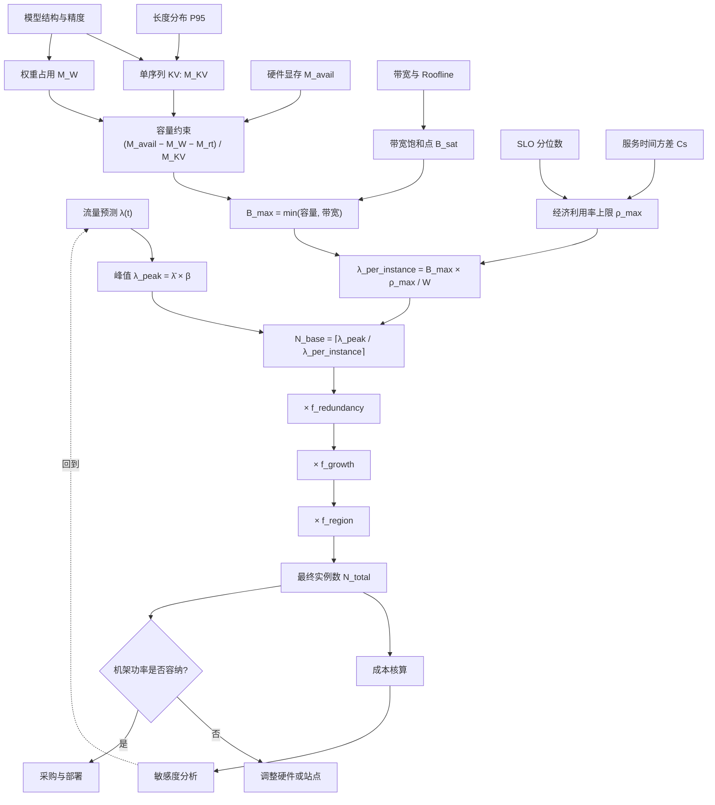

# 容量规划

> 位置：[InferenceAtlas](../../INDEX.md) > [模块 01](README.md) > 当前文档
> 信息截至：2026-07-29 ｜ 最后核验：2026-07-29 ｜ 内容版本：v0.1
> 时效性等级：低
> 相关主题：[排队论](03_queueing_theory_for_inference.md)｜[成本建模](06_cost_modeling_and_unit_economics.md)｜[Autoscaling](../03_serving_engines_and_scheduling/)

## 本章导读

容量规划回答一个问题：**为了在给定 SLO 下服务给定流量，需要多少台什么样的机器？**

这个问题看似简单，实际上是本模块前七章的综合应用：需要 workload 画像（第 1 章）确定负载特征、指标定义（第 2 章）明确 SLO、排队论（第 3 章）确定可接受利用率、Roofline 与带宽分析（第 4–5 章）估算单机产能、成本模型（第 6 章）评估方案、能效分析（第 7 章）确认物理可部署性。

本章给出一条**可执行的计算链**，从流量预测一路推到机器数量与成本，并在每一步标出误差来源。核心纪律是：**按峰值加余量规划，而非按均值**——这是容量规划中最常见也最昂贵的错误。

## 学习目标

读完本章后，读者应能够：

1. 从流量预测出发，完整推导出所需的实例数量；
2. 说明为什么按均值规划必然导致峰值期故障；
3. 计算 KV 显存约束下的单实例并发上限，并识别它与带宽上限中哪个先触及；
4. 设计一个包含余量、突发、故障域与增长的容量方案。

## 核心结论

- **容量必须按峰值 + 余量规划**。按均值规划的系统在峰值期利用率超过 1，排队时延发散。
- **单实例并发上限由两个约束中较小者决定**：KV 显存容量与带宽饱和点。多数长上下文场景下容量先触及。
- **余量不是浪费**，它是 SLO 的成本。经济利用率上限由排队论给出，超过它的"效率"实为服务劣化。
- **故障域与增长必须显式计入**。N+1 冗余、区域故障、季度增长都会改变最终数字，且它们是相乘而非相加的关系。

## 1. 问题定义、系统边界与工作负载

### 1.1 输入清单

| 输入 | 来源 | 精度要求 |
|---|---|---|
| 到达率时间序列 $\lambda(t)$ | 历史日志或业务预测 | 需覆盖日/周周期 |
| 输入/输出长度分布 | 日志 | P50/P95/P99 |
| SLO（分位数） | 产品要求 | 明确 |
| 模型结构参数 | 模型卡 | $L, H_{KV}, D_h$ |
| 精度配置 | 设计决策 | $b_w, b_{kv}$ |
| 硬件规格 | 官方来源 | 显存容量、带宽 |
| 增长预期 | 业务规划 | 季度或年度 |
| 可用性目标 | 产品要求 | 决定冗余度 |

**缺任何一项都会导致规划失效。** 实践中最常缺失的是长度分布（只有均值）与突发比。

## 2. 原理、数学与性能模型

### 2.1 计算链

**第一步：确定峰值负载**

$$
\lambda_{peak} = \bar{\lambda} \times \beta
$$

其中 $\beta$ 为突发比（**须注明观测窗口**，见 [第 1 章](01_inference_workload_taxonomy.md)）。

**第二步：确定单实例并发上限**

两个约束取较小者：

$$
B_{max} = \min\left(\underbrace{\frac{M_{avail} - M_W - M_{rt}}{M_{KV,\text{per-seq}}}}_{\text{容量约束}},\ \underbrace{B_{sat}}_{\text{带宽饱和点}}\right)
$$

其中：

- $M_{avail}$：单卡（或单实例）可用显存；
- $M_W = P_{params} \times b_w$：权重占用；
- $M_{rt}$：运行时开销（激活、缓冲、碎片），需实测标定；
- $M_{KV,\text{per-seq}} = 2 L S H_{KV} D_h b_{kv}$：单序列 KV 占用，$S$ 取 **P95 上下文长度**而非均值；
- $B_{sat}$：吞吐随 batch 增长饱和的点（见 [第 5 章](05_memory_bandwidth_and_arithmetic_intensity.md)）。

**关键**：$S$ 用 P95 而非均值。若用均值，长请求集中到达时会立刻 OOM 或触发大量抢占。

**第三步：确定单实例服务能力**

由 Little's Law，单实例在平均逗留时间 $W$ 下可承载的到达率：

$$
\lambda_{per\text{-}instance} = \frac{B_{max} \times \rho^{max}}{W}
$$

其中 $\rho^{max}$ 为经济利用率上限（由 [第 3 章](03_queueing_theory_for_inference.md) 的 SLO 约束确定）。

**第四步：基础实例数**

$$
N_{base} = \left\lceil \frac{\lambda_{peak}}{\lambda_{per\text{-}instance}} \right\rceil
$$

**第五步：叠加余量因子**

$$
N_{total} = N_{base} \times f_{redundancy} \times f_{growth} \times f_{region}
$$

| 因子 | 含义 | 典型考虑 |
|---|---|---|
| $f_{redundancy}$ | 故障冗余（N+1 或 N+2） | 单实例故障不应导致 SLO 违约 |
| $f_{growth}$ | 规划期内的业务增长 | 采购与部署周期内的增量 |
| $f_{region}$ | 多区域部署的复制系数 | 区域故障时的接管能力 |

**这三个因子是相乘的**，因此容易被低估。例如各取 1.2、1.3、1.5，合计就是 2.34 倍。

**局限**：整条链是**量级估算**。$M_{rt}$、$B_{sat}$、$\rho^{max}$ 都需要实测标定；$W$ 依赖输出长度分布。规划结果应视为"需要采购的量级"，最终配置必须压测验证。

### 2.2 两个约束哪个先触及

$$
\frac{M_{avail} - M_W - M_{rt}}{M_{KV,\text{per-seq}}} \quad \text{vs} \quad B_{sat}
$$

| 场景 | 通常先触及 | 含义 |
|---|---|---|
| 短上下文、小模型 | **带宽饱和** | 加显存无用，需要更多实例或更高带宽 |
| 长上下文 | **容量约束** | 显存容量是瓶颈，KV 压缩收益最大 |
| 大模型、单卡勉强装下 | **容量约束**（$M_W$ 挤占） | 考虑量化或张量并行 |

**诊断价值**：知道哪个约束先触及，就知道该往哪投资——加显存、换更高带宽的卡、还是做 KV 压缩。**投错方向是容量规划中最常见的浪费。**

## 3. 实现机制与系统设计

### 3.1 完整规划流程

**图展示什么**：从流量预测到最终实例数的完整计算链，以及三条并行的约束支路（显存容量、带宽、SLO 利用率）如何汇聚。

**核心瓶颈在哪**：图中 `B_max = min(容量, 带宽)` 是关键收敛点。多数规划错误发生在这里——只算了其中一个约束。另一个高风险点是右下角的机架功率校验：容量算对了但站点供电不足，会导致采购后无法上架。

**图中的 trade-off**：三个余量因子（冗余、增长、区域）相乘，直接决定成本。收紧它们能立即降成本，但会在故障或增长时失效。这是一个**风险与成本的显式交换**，应当由业务而非技术单独决定。

**面试如何引用**：被问到"如何做容量规划"时，按这条链逐步展开，并主动指出两个约束取小、三个因子相乘这两个易错点——这两处最能体现是否真正做过规划。

### 3.2 余量的三种用途

| 余量类型 | 应对 | 若不留的后果 |
|---|---|---|
| **排队余量**（$1-\rho^{max}$） | 到达的随机波动 | P99 发散 |
| **故障余量**（$f_{redundancy}$） | 实例/节点故障 | 单点故障即 SLO 违约 |
| **增长余量**（$f_{growth}$） | 业务增长 | 采购周期内容量不足 |

**常见误解**：把这三者混为一谈，只留一份余量。它们应对的是不同的风险，不能相互替代——排队余量在故障时已被消耗，无法再承担故障接管。

**填谷策略**：余量的成本可以通过用**可中断的批量负载**填充来部分回收。这是提高有效利用率而不牺牲 SLO 的少数手段之一（见 [第 6 章](06_cost_modeling_and_unit_economics.md)）。

## 4. 性能、成本、能耗与可靠性 trade-off

| 决策 | 降成本方向 | 风险 |
|---|---|---|
| 提高 $\rho^{max}$ | 减少实例数 | P99 恶化 |
| 减少 $f_{redundancy}$ | 减少实例数 | 故障时违约 |
| 减少 $f_{growth}$ | 延后采购 | 增长时容量不足 |
| 限制最大上下文 | 提高 $B_{max}$ | 功能受限 |
| KV 量化 | 提高 $B_{max}$ | 可能质量下降 |
| 用可中断实例做余量 | 降低余量成本 | 中断处理复杂度 |
| 批量任务填谷 | 提高有效利用率 | 需要有可延迟负载 |

**原则**：前三项是**风险交换**，应由业务决策；后四项是**技术优化**，可由工程决定。把风险交换伪装成技术优化是容量规划中的常见问题。

## 5. benchmark、真实案例或公开部署案例

| 与本章相关的机制性结论 | 来源 |
|---|---|
| 按最大序列长度预留 KV 显存造成浪费，分页管理可提高有效并发数 | [PagedAttention, SOSP 2023](https://arxiv.org/abs/2309.06180) |
| 迭代级调度提高有效批大小与利用率 | [Orca, OSDI 2022](https://www.usenix.org/conference/osdi22/presentation/yu) |

> 具体的容量规划案例（含实际流量、实例数与成本）需来自公开部署披露。当前 [`deployment_cases.csv`](../../data/deployment_cases.csv) 为空。本库不构造虚假案例。`待核实`

## 6. 设计决策框架

**容量规划检查表**：

- [ ] 已获取到达率时间序列，计算突发比 $\beta$（注明窗口）
- [ ] 长度分布使用 **P95** 而非均值
- [ ] 已分别计算容量约束与带宽饱和点，取较小者
- [ ] $M_{rt}$ 已通过实测标定，而非猜测
- [ ] $\rho^{max}$ 由 SLO 与服务时间方差推出，而非拍脑袋
- [ ] 三个余量因子已分别确定并说明依据
- [ ] 已核算机架功率是否容纳目标节点数
- [ ] 已做敏感度分析（利用率、长度分布、增长率各变化 ±30%）
- [ ] 已确定过载时的降级顺序
- [ ] 已规划余量的填谷方案

## 7. 常见失败模式与排查路径

| 失败模式 | 表现 | 根因 | 纠正 |
|---|---|---|---|
| 按均值规划 | 峰值期排队积压 | 忽略突发比 | 按 $\lambda_{peak}$ 规划 |
| 用均值长度算 KV | 长请求到达时 OOM | $S$ 取值过低 | 用 P95 |
| 只算一个约束 | 加了显存但吞吐没变 | 实际瓶颈是带宽 | 两个约束都算 |
| 余量混用 | 故障时无接管容量 | 三类余量未区分 | 分别预留 |
| 忽略机架功率 | 采购后无法上架 | 未做设施校验 | 规划时纳入 |
| $M_{rt}$ 靠猜 | 实际可并发数低于预期 | 未实测标定 | 压测标定 |
| 无敏感度分析 | 假设小幅变化即失效 | 单点估算 | 关键输入做区间 |
| 忽略故障域 | 单区域故障即全局不可用 | $f_{region}$ 未计 | 多区域规划 |

## 8. 关联面试主题

1. **完整推导容量规划的计算链** → 本章 2.1
2. **为什么必须按峰值而非均值规划** → 本章 2.1、[03 排队论](03_queueing_theory_for_inference.md)
3. **容量约束与带宽约束哪个先触及，如何判断** → 本章 2.2
4. **如何把 J/token 和 cost/token 纳入容量规划** → 本章 4、[06](06_cost_modeling_and_unit_economics.md)、[07](07_energy_efficiency_and_joules_per_token.md)
5. **如何应对 region failure 或容量短缺** → 本章 3.2

## 9. 小结

容量规划是本模块前七章的综合应用，其计算链为：峰值流量 → 单实例并发上限（容量与带宽约束取小）→ 单实例服务能力（经 Little's Law 与经济利用率）→ 基础实例数 → 乘以冗余、增长、区域三个余量因子。两个最常见的错误是按均值规划（应按峰值加余量）与只算单一约束（应两者取小）。三类余量应对不同风险，不可相互替代。整条链是量级估算，$M_{rt}$、$B_{sat}$、$\rho^{max}$ 均需实测标定，最终配置必须压测验证；同时必须校验机架功率能否容纳规划的节点数。

## 关键术语

| 中文术语 | 英文 | 定义 | 单位/口径 | 关联文档 |
|---|---|---|---|---|
| 突发比 | burst ratio $\beta$ | 峰值与平均到达率之比 | 无量纲 | [01](01_inference_workload_taxonomy.md) |
| 单实例并发上限 | max concurrency $B_{max}$ | 容量约束与带宽饱和点的较小者 | 个 | 本章 2.1 |
| 运行时开销 | runtime overhead $M_{rt}$ | 激活、缓冲、碎片等显存占用 | GB | 本章 2.1 |
| 经济利用率上限 | economic utilization ceiling | SLO 约束下可接受的最大利用率 | 无量纲 | [03](03_queueing_theory_for_inference.md) |
| 余量因子 | headroom factors | 冗余、增长、区域三个**相乘**的系数 | 无量纲 | 本章 2.1 |

## 延伸阅读

- [03 排队论](03_queueing_theory_for_inference.md) —— $\rho^{max}$ 的推导
- [05 内存带宽](05_memory_bandwidth_and_arithmetic_intensity.md) —— $B_{sat}$ 的推导
- [模块 03：Autoscaling](../03_serving_engines_and_scheduling/) —— 动态容量调整

## 主要来源

| # | 来源 | 类型 | 披露等级 | 核验日期 |
|---:|---|---|---|---|
| 1 | [PagedAttention (SOSP 2023)](https://arxiv.org/abs/2309.06180) | 会议论文 | 独立可复现实验 | 2026-07-29 |
| 2 | [Orca (OSDI 2022)](https://www.usenix.org/conference/osdi22/presentation/yu) | 会议论文 | 独立可复现实验 | 2026-07-29 |

> **说明**：本章的容量计算链为**本库综合排队论、Roofline 与显存模型构建的分析框架**，其量级估算性质与需实测标定的参数已在正文中逐条声明。

## 更新记录

| 日期 | 版本 | 变更 | 核验人 |
|---|---|---|---|
| 2026-07-29 | v0.1 | 初稿 | — |
