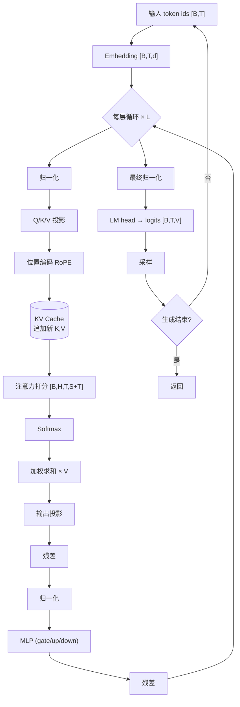

# 从第一性原理重建 Transformer 推理

> 位置：[InferenceAtlas](../../INDEX.md) > [模块 02](README.md) > 当前文档
> 信息截至：2026-07-29 ｜ 最后核验：2026-07-29 ｜ 内容版本：v0.1
> 时效性等级：低
> 相关主题：[prefill vs decode](02_prefill_vs_decode.md)｜[KV Cache 基础](04_kv_cache_fundamentals.md)｜[Roofline](../01_foundations_and_metrics/04_roofline_and_performance_modeling.md)

## 本章导读

本章从张量形状出发重建一次 decoder-only Transformer 的前向传播。目的不是复习模型结构——那在别处已有大量材料——而是**建立"每一步搬了多少字节、做了多少运算"的量化直觉**。

这个直觉是后续所有内容的基础。没有它，"decode 是 memory-bound"只是一句需要背诵的结论；有了它，这句话就是一个可以自己推导出来的事实，并且能立刻回答"如果换成 GQA 会怎样""如果上下文翻倍会怎样"这类追问。

本章只讨论推理，不涉及训练。二者的计算图有实质差异：推理无反向传播、无优化器状态、但有 KV cache 这个训练中不存在的状态。

## 学习目标

读完本章后，读者应能够：

1. 写出一次前向传播中每个算子的输入输出张量形状；
2. 分别估算 prefill 与 decode 单步的计算量与内存访问量；
3. 说明哪些张量必须驻留显存、哪些是临时的；
4. 解释为什么自回归结构必然导致 KV cache 的存在。

## 核心结论

- **推理的计算主体是矩阵乘**：Q/K/V 投影、注意力、输出投影、MLP。其余算子（归一化、激活、残差）计算量小但可能因访存而不可忽略。
- **权重的读取量与批大小无关**，因此批处理直接摊薄权重读取成本——这是批处理有效的第一性原理解释。
- **KV cache 不是优化技巧，是自回归结构的必然产物**。不缓存的代价是每步重算全序列，总计算量与序列长度平方成正比。
- **decode 每步的算术强度约为 $2B/b_w$**，其中 $B$ 是批大小。这个量决定了性能落在 Roofline 的哪一侧。

## 1. 问题定义、系统边界与工作负载

### 1.1 记号约定

| 符号 | 含义 | 典型量级 |
|---|---|---|
| $B$ | 批中的序列数 | 1 – 数百 |
| $T$ | 本次前向处理的 token 数（prefill 时为 $S_{in}$，decode 时为 1） | 1 – 数千 |
| $S$ | 已缓存的 token 数（上下文长度） | 数百 – 数十万 |
| $L$ | 层数 | 数十 – 上百 |
| $d$ | 隐藏维度 | 数千 |
| $H$ | query head 数 | 数十 |
| $H_{KV}$ | KV head 数（MHA 时 $=H$，GQA 时更小） | 1 – $H$ |
| $D_h$ | 每 head 维度，通常 $d = H \times D_h$ | 64 – 128 |
| $d_{ff}$ | MLP 中间维度 | 数倍于 $d$ |
| $V$ | 词表大小 | 数万 – 数十万 |
| $b_w$ | 权重每元素字节数 | 2 (BF16) / 1 (INT8) / 0.5 (INT4) |
| $b_{kv}$ | KV cache 每元素字节数 | 2 / 1 / 0.5 |

> 上表的"典型量级"为数量级提示，不针对任何具体模型。具体模型的参数见 [`models.csv`](../../data/models.csv) 并附官方来源。

### 1.2 系统边界

本章分析**单次前向传播**，不含采样、调度、内存管理。这些在后续章节展开。

## 2. 原理、数学与性能模型

### 2.1 逐层张量形状

一次前向传播中，每层的数据流：

| 步骤 | 算子 | 输入形状 | 权重形状 | 输出形状 |
|---|---|---|---|---|
| 0 | Embedding 查表 | $[B,T]$ (int) | $[V,d]$ | $[B,T,d]$ |
| 1 | 归一化（RMSNorm/LayerNorm） | $[B,T,d]$ | $[d]$ | $[B,T,d]$ |
| 2 | Q 投影 | $[B,T,d]$ | $[d, H D_h]$ | $[B,T,H,D_h]$ |
| 3 | K 投影 | $[B,T,d]$ | $[d, H_{KV} D_h]$ | $[B,T,H_{KV},D_h]$ |
| 4 | V 投影 | $[B,T,d]$ | $[d, H_{KV} D_h]$ | $[B,T,H_{KV},D_h]$ |
| 5 | 位置编码（如 RoPE） | Q,K | — | 同形状 |
| 6 | **KV cache 追加** | 新 K,V | — | cache 变为 $[B,S{+}T,H_{KV},D_h]$ |
| 7 | 注意力打分 | Q $[B,T,H,D_h]$，K $[B,S{+}T,H_{KV},D_h]$ | — | $[B,H,T,S{+}T]$ |
| 8 | Softmax | $[B,H,T,S{+}T]$ | — | 同形状 |
| 9 | 加权求和 | 概率 × V | — | $[B,T,H,D_h]$ |
| 10 | 输出投影 | $[B,T,d]$ | $[d,d]$ | $[B,T,d]$ |
| 11 | 残差相加 | — | — | $[B,T,d]$ |
| 12 | 归一化 | $[B,T,d]$ | $[d]$ | $[B,T,d]$ |
| 13 | MLP（如 SwiGLU：gate/up/down） | $[B,T,d]$ | $[d,d_{ff}]\times 2$，$[d_{ff},d]$ | $[B,T,d]$ |
| 14 | 残差相加 | — | — | $[B,T,d]$ |

最后一层之后：

| 步骤 | 算子 | 输入 | 权重 | 输出 |
|---|---|---|---|---|
| 15 | 最终归一化 | $[B,T,d]$ | $[d]$ | $[B,T,d]$ |
| 16 | LM head（词表投影） | $[B,T,d]$ | $[d,V]$ | $[B,T,V]$ |

**两个易被忽略的观察**：

1. **步骤 7 的注意力打分矩阵形状为 $[B,H,T,S{+}T]$**。在 prefill 且序列很长时，这个中间张量可以非常大——这正是 FlashAttention 类方法要避免物化它的原因。
2. **步骤 16 的输出是 $[B,T,V]$**。词表通常很大，因此 decode 时（$T=1$）logits 张量为 $[B,1,V]$，其大小与词表成正比，在大词表模型上不可忽略。

### 2.2 计算量估算

对一个形状为 $[m,k] \times [k,n]$ 的矩阵乘，计算量约为 $2mkn$ FLOP（乘加各一次）。

**每层的主要矩阵乘**（忽略常数因子）：

| 算子 | 计算量 |
|---|---|
| Q 投影 | $2 B T d \cdot H D_h$ |
| K,V 投影 | $2 \times 2 B T d \cdot H_{KV} D_h$ |
| 注意力（打分 + 加权） | $2 \times 2 B H T (S{+}T) D_h$ |
| 输出投影 | $2 B T d^2$ |
| MLP | $\approx 2 \times 3 B T d\, d_{ff}$（SwiGLU 三个矩阵） |

**关键观察**：除注意力外，所有项都与 $T$ 成正比、与 $S$ **无关**；只有注意力项与 $(S{+}T)$ 相关。

**这解释了长上下文的代价结构**：上下文变长时，权重相关的计算不变，但注意力计算线性增长（对 decode）或平方增长（对 prefill）。因此长上下文的瓶颈是注意力与 KV 访存，而非权重。

**总参数量的粗略构成**（每层）：

$$
P_{layer} \approx \underbrace{d \cdot H D_h + 2 d \cdot H_{KV} D_h + d^2}_{\text{注意力}} + \underbrace{3 d\, d_{ff}}_{\text{MLP}}
$$

对典型配置，MLP 通常占参数量的多数。

### 2.3 内存访问量与算术强度

**每步至少要读取的字节**：

| 项 | 字节数 | 随 $B$ 摊薄？ |
|---|---|---|
| 权重 | $W_{bytes} = P_{params} \times b_w$ | **是** |
| KV cache | $2 L B S H_{KV} D_h b_{kv}$ | 否 |
| 激活与中间结果 | 与 $B T d$ 同阶 | 部分 |

**decode 阶段（$T=1$）的算术强度**：

计算量 $\approx 2 P_{params} B$ FLOP（每参数一次乘加，$B$ 个序列），内存访问以权重为主 $\approx W_{bytes} = P_{params} b_w$：

$$
I_{decode} \approx \frac{2 P_{params} B}{P_{params} b_w} = \frac{2B}{b_w}
$$

**prefill 阶段（$T = S_{in}$）**：权重同样只读一次，但处理 $S_{in}$ 个 token：

$$
I_{prefill} \approx \frac{2 S_{in}}{b_w}
$$

**统一形式**：$I \approx 2 \times (\text{本次前向同时处理的 token 数}) / b_w$。prefill 与 decode 的差别只是这个 token 数分别是 $S_{in}$ 与 $B$。

**局限**：忽略了 KV 访存（长上下文下不可忽略）、激活读写与非矩阵乘算子。这是量级估算，用于判定 Roofline 位置。完整讨论见 [模块 01 第 5 章](../01_foundations_and_metrics/05_memory_bandwidth_and_arithmetic_intensity.md)。

### 2.4 自回归为什么必然导出 KV cache

自回归生成第 $t$ 个 token 时，注意力需要对**全部前 $t-1$ 个 token 的 K 和 V** 做计算。

**若不缓存**：每步都要对全序列重新计算 K/V 投影。生成 $N$ 个 token 的总投影计算量约与 $\sum_{t=1}^{N} t = O(N^2)$ 成正比。

**若缓存**：每步只需为新 token 计算一次 K/V 并追加，总计算量降为 $O(N)$。

**代价**：显存占用 $O(L \cdot B \cdot S \cdot H_{KV} \cdot D_h \cdot b_{kv})$。

**因此 KV cache 是一个纯粹的时间-空间交换**，且交换比极为有利（把平方降为线性）。这就是为什么它不是可选优化，而是所有实用实现的默认行为。它的后果——显存成为并发度的硬约束——是整个推理系统复杂性的来源。

## 3. 实现机制与系统设计

### 3.1 一次前向的数据流

**图展示什么**：单次前向的完整算子链、KV cache 的读写位置，以及 decode 时的自回归回环。

**核心瓶颈在哪**：两处。一是 `KV Cache` 节点——它在 decode 时每步被全量读取且无法被批处理摊薄；二是 `注意力打分` 的中间张量 $[B,H,T,S{+}T]$，长序列 prefill 时其大小可能超出可用显存，这是 FlashAttention 类方法的攻击点。

**图中的 trade-off**：右下角的自回归回环意味着 decode 无法在序列内并行——这是与 prefill 最本质的差异，也是投机解码要打破的约束。打破它的代价是引入 draft 模型与接受率的不确定性。

**面试如何引用**：被问到"讲一下 LLM 推理流程"时，用这张图并**主动指出 KV cache 的读写位置与自回归回环**。多数候选人能画出算子链，能指出这两个系统关键点的少得多。

### 3.2 显存中驻留什么

| 内容 | 生命周期 | 大小 |
|---|---|---|
| 模型权重 | 常驻 | $P_{params} \times b_w$ |
| **KV cache** | 随请求生存期 | $2LBSH_{KV}D_h b_{kv}$ |
| 激活与中间张量 | 单次前向内 | 与 $BTd$ 同阶 |
| 注意力中间矩阵 | 单个算子内（可被 tiling 消除） | 与 $BHT(S{+}T)$ 同阶 |
| Logits | 单步 | $BTV \times b$ |
| 运行时开销（碎片、缓冲、通信 buffer） | 常驻或临时 | 需实测标定 |

**设计含义**：只有前两项是"大头"且可预测。权重是固定的，因此**可用于 KV cache 的显存 = 总显存 − 权重 − 运行时开销**，这个差值直接决定并发上限（见 [模块 01 第 8 章](../01_foundations_and_metrics/08_capacity_planning.md)）。

## 4. 性能、成本、能耗与可靠性 trade-off

| 结构选择 | 参数量 | KV 大小 | 推理影响 |
|---|---|---|---|
| 增大 $d$ | ↑↑（平方项） | ↑ | 权重读取增加，decode 变慢 |
| 增大 $L$ | ↑ | ↑ | 同上，且串行深度增加 |
| 增大 $d_{ff}$ | ↑↑ | 不变 | 权重增加但 KV 不变 |
| 减小 $H_{KV}$（GQA/MQA） | 略 ↓ | **↓↓** | KV 显存与带宽大幅下降 |
| 增大 $D_h$ | ↑ | ↑ | — |
| 增大词表 $V$ | ↑ | 不变 | logits 张量增大，decode 尾部开销 |
| MoE（稀疏激活） | 总量 ↑ | 不变 | 每 token 读取的权重 ↓，但显存占用 ↑ |

**这张表是"面向推理的模型架构设计"的起点**：模型结构的选择直接决定了服务它的系统的性能特征。详见 [模块 16](../16_research_frontiers/)。

## 5. benchmark、真实案例或公开部署案例

| 与本章相关的公开结论 | 来源 |
|---|---|
| Transformer 架构定义（多头注意力、位置编码、逐位置前馈） | [Attention Is All You Need, NeurIPS 2017](https://arxiv.org/abs/1706.03762) |
| 注意力中间矩阵的物化是 HBM 访问瓶颈；分块与在线 softmax 可避免物化 | [FlashAttention, NeurIPS 2022](https://arxiv.org/abs/2205.14135) |
| KV cache 的显存管理方式直接决定可并发请求数 | [PagedAttention, SOSP 2023](https://arxiv.org/abs/2309.06180) |

> 具体模型的 $L, d, H, H_{KV}, D_h, V$ 参数需引用官方模型卡，将录入 [`models.csv`](../../data/models.csv) 并附来源与披露等级。当前为空。`待核实`

## 6. 设计决策框架

**从模型结构推出系统需求的步骤**：

1. 从官方模型卡获取 $L, d, H, H_{KV}, D_h, d_{ff}, V$（**不可猜测**，未公开则标 `未公开`）；
2. 计算参数量与权重显存 $P_{params} \times b_w$；
3. 计算单序列单 token 的 KV 占用 $2 L H_{KV} D_h b_{kv}$；
4. 由目标上下文长度与并发推出 KV 总占用；
5. 检查 权重 + KV + 运行时开销 是否超出可用显存；
6. 计算 $I_{decode} \approx 2B/b_w$，在 Roofline 上定位；
7. 若为 memory-bound（通常是），优化方向为减少访存而非提升算力。

## 7. 常见失败模式与排查路径

| 失败模式 | 表现 | 根因 | 纠正 |
|---|---|---|---|
| 忽略 logits 张量 | 大词表模型显存超预期 | 只算权重与 KV | 计入 $BTV$ |
| 用 $H$ 代替 $H_{KV}$ 算 KV | GQA 模型 KV 估算偏大数倍 | 混淆 query 与 KV head 数 | 用模型卡的 $H_{KV}$ |
| 忽略注意力中间矩阵 | 长序列 prefill OOM | 未考虑 $[B,H,T,S{+}T]$ | 用 tiling 类实现 |
| 用训练的计算图估推理 | 显存估算偏大 | 推理无反向与优化器状态 | 分别建模 |
| 忽略运行时开销 | 实际可并发数低于估算 | $M_{rt}$ 未标定 | 实测标定 |
| 认为 KV cache 是可选优化 | 性能远低于预期 | 每步重算全序列 | KV cache 是必需 |

## 8. 关联面试主题

1. **写出一次前向传播的张量形状** → 本章 2.1
2. **推导 decode 的算术强度** → 本章 2.3
3. **为什么自回归必然需要 KV cache** → 本章 2.4
4. **模型结构如何影响推理性能** → 本章 4
5. **显存中驻留哪些内容，各占多少** → 本章 3.2

## 9. 小结

本章从张量形状重建了 decoder-only Transformer 的一次前向传播。计算主体是矩阵乘，其中除注意力外的所有项都与已缓存长度 $S$ 无关，只有注意力与 $(S{+}T)$ 相关——这决定了长上下文的代价结构。权重读取量与批大小无关，因此批处理直接摊薄权重成本；decode 的算术强度约为 $2B/b_w$，prefill 约为 $2S_{in}/b_w$，二者形式相同只是"同时处理的 token 数"取值不同。KV cache 是自回归结构的必然产物：它把总计算量从平方降为线性，代价是显存占用，而这个代价正是推理系统全部复杂性的源头。

## 关键术语

| 中文术语 | 英文 | 定义 | 单位/口径 | 关联文档 |
|---|---|---|---|---|
| KV head 数 | $H_{KV}$ | K/V 投影的 head 数；GQA/MQA 中小于 query head 数 | 个 | [06 GQA/MQA/MLA](06_gqa_mqa_mla_and_kv_reduction.md) |
| 注意力中间矩阵 | attention score matrix | 形状 $[B,H,T,S{+}T]$，长序列时可能超出显存 | — | [模块 04](../04_compilers_runtimes_and_kernels/) |
| LM head | language model head | 最终的词表投影，输出 $[B,T,V]$ logits | — | 本章 2.1 |
| 常驻显存 | resident memory | 权重与 KV cache，决定并发上限 | GB | 本章 3.2 |

## 延伸阅读

- [02 prefill vs decode](02_prefill_vs_decode.md) —— 两阶段的完整对比
- [04 KV Cache 基础](04_kv_cache_fundamentals.md) —— cache 的结构与生命周期
- [模块 01 第 4–5 章](../01_foundations_and_metrics/04_roofline_and_performance_modeling.md) —— Roofline 与带宽分析

## 主要来源

| # | 来源 | 类型 | 披露等级 | 核验日期 |
|---:|---|---|---|---|
| 1 | [Attention Is All You Need (NeurIPS 2017)](https://arxiv.org/abs/1706.03762) | 会议论文 | 独立可复现实验 | 2026-07-29 |
| 2 | [FlashAttention (NeurIPS 2022)](https://arxiv.org/abs/2205.14135) | 会议论文 | 独立可复现实验 | 2026-07-29 |
| 3 | [PagedAttention (SOSP 2023)](https://arxiv.org/abs/2309.06180) | 会议论文 | 独立可复现实验 | 2026-07-29 |

> **说明**：本章的张量形状表与计算量估算为**基于公开架构描述的第一性原理推导**，采用通用记号，不针对任何具体模型。具体模型参数须引用官方模型卡。

## 更新记录

| 日期 | 版本 | 变更 | 核验人 |
|---|---|---|---|
| 2026-07-29 | v0.1 | 初稿 | — |
