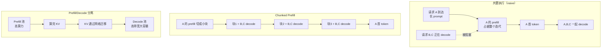

# Prefill 与 Decode

> 位置：[InferenceAtlas](../../INDEX.md) > [模块 02](README.md) > 当前文档
> 信息截至：2026-07-29 ｜ 最后核验：2026-07-29 ｜ 内容版本：v0.1
> 时效性等级：低
> 相关主题：[第一性原理](01_transformer_inference_from_first_principles.md)｜[调度](../03_serving_engines_and_scheduling/)｜[Disaggregation](../06_distributed_and_moe_inference/)

## 本章导读

LLM 推理由两个性质截然相反的阶段构成，而它们要在同一套硬件上共存。这个事实是推理系统几乎全部设计复杂性的来源。

**prefill** 是一次并行的批量计算：把整个输入一次性算完，算术强度高，算力饱和，时间随输入长度增长。**decode** 是一个串行循环：每步只产出一个 token，算术强度极低，被显存带宽卡住，时间随输出长度线性累积。

一个直接后果是：**为 prefill 优化的配置对 decode 往往无效，反之亦然**。而当二者混在同一个批次里时，还会互相伤害——长 prompt 的 prefill 会让正在 decode 的请求停顿，表现为 ITL 抖动。

本章系统对比两阶段，并说明这一对比如何传导到调度、内存、硬件与网络的每一层设计。

## 学习目标

读完本章后，读者应能够：

1. 从计算量与访存量出发解释两阶段的资源画像差异；
2. 说明 prefill 与 decode 分别决定哪个指标，以及优化二者的手段为何不同；
3. 解释批内 prefill/decode 干扰的机制，并说出至少两种缓解方式；
4. 判断一个具体 workload 的时间主要花在哪个阶段。

## 核心结论

- **prefill 通常 compute-bound，decode 通常 memory-bound**。二者的算术强度相差约 $S_{in}/B$ 倍。
- **prefill 决定 TTFT，decode 决定 TPOT**。二者的优化手段几乎不重叠。
- **批处理对 decode 的收益远大于对 prefill**：prefill 已有序列内并行，decode 只能靠跨序列并行。
- **混合执行会产生干扰**：长 prompt 的 prefill 阻塞同批 decode。chunked prefill 与 prefill/decode 分离是两条缓解路径，代价不同。

## 1. 问题定义、系统边界与工作负载

### 1.1 两阶段的定义

| | Prefill | Decode |
|---|---|---|
| 何时发生 | 请求开始时一次 | 之后每个输出 token 一次 |
| 输入 | 全部 $S_{in}$ 个 token | 上一步产出的 1 个 token |
| 并行性 | **序列内并行**（$S_{in}$ 个 token 同时算） | 序列内完全串行；只能跨序列并行 |
| 产出 | 首个输出 token + 填充 KV cache | 一个新 token + 追加 KV |
| 次数 | 1 次 | $S_{out}-1$ 次 |

### 1.2 时间占比

单请求的两阶段耗时：

$$
T_{prefill} \approx f(S_{in}), \qquad T_{decode} \approx (S_{out}-1) \times \text{TPOT}
$$

**哪个主导**取决于 workload。用 [模块 01 第 1 章](../01_foundations_and_metrics/01_inference_workload_taxonomy.md)的判据 $R = S_{in}/S_{out}$：长输入短输出（文档理解）prefill 主导，短输入长输出（reasoning）decode 主导。

## 2. 原理、数学与性能模型

### 2.1 算术强度对比

沿用 [第 1 章](01_transformer_inference_from_first_principles.md) 的推导，两阶段的算术强度形式相同：

$$
I \approx \frac{2 \times (\text{本次前向同时处理的 token 数})}{b_w}
$$

| 阶段 | 同时处理的 token 数 | 算术强度 |
|---|---|---|
| Prefill | $B \times S_{in}$（批中全部 token） | $\dfrac{2 B S_{in}}{b_w}$ |
| Decode | $B$（每序列 1 个） | $\dfrac{2B}{b_w}$ |

**比值**：

$$
\frac{I_{prefill}}{I_{decode}} \approx S_{in}
$$

输入长度即两阶段算术强度的比值。当 $S_{in}$ 为数百到数千时，二者相差二到三个数量级——**这就是为什么它们落在 Roofline 的两侧**。

### 2.2 完整资源画像对比

| 维度 | Prefill | Decode |
|---|---|---|
| 算术强度 | 高（$\propto S_{in}$） | **低**（$\propto B$） |
| Roofline 位置 | 水平屋顶（compute-bound） | **斜屋顶（memory-bound）** |
| 主要瓶颈 | 峰值算力、注意力的平方项 | **显存带宽** |
| 决定的指标 | **TTFT** | **TPOT / ITL** |
| 批处理收益 | 小（已有序列内并行） | **大**（唯一的并行来源） |
| 时延与长度关系 | 随 $S_{in}$ 超线性（注意力平方项） | 每步近似恒定，随 $S$ 缓慢上升 |
| KV cache 操作 | 大量**写入** | 每步追加 1 个，**全量读取** |
| 显存峰值 | 高（注意力中间张量） | 中（主要是 cache 本身） |
| 对量化的敏感度 | 中 | **高**（直接减少带宽需求） |
| 适合的硬件 | 高算力 | **高带宽、大容量** |
| 单位时间产出 | 高（一次算完所有输入） | 低（每步 1 token/序列） |
| 能否中断/分块 | **能**（chunked prefill） | 每步天然是断点 |

**这张表是本模块最有实用价值的单张表**，后续多个模块会反复引用。

### 2.3 注意力的复杂度差异

注意力是唯一与已缓存长度 $S$ 相关的算子：

| 阶段 | 打分矩阵形状 | 计算量 | 随长度 |
|---|---|---|---|
| Prefill | $[B,H,S_{in},S_{in}]$ | $\propto B H S_{in}^2 D_h$ | **平方** |
| Decode | $[B,H,1,S{+}1]$ | $\propto B H S D_h$ | 线性 |

**后果**：

- prefill 的时延随输入长度**超线性**增长（矩阵乘部分线性、注意力部分平方）。因此"输入翻倍，TTFT 翻倍多"是预期行为；
- decode 每步的注意力计算随上下文线性增长，但相对权重读取通常较小——**直到进入 KV 主导区**（见 [模块 01 第 5 章](../01_foundations_and_metrics/05_memory_bandwidth_and_arithmetic_intensity.md)）。

### 2.4 批处理收益为何不对称

**prefill**：单个请求的 $S_{in}$ 个 token 已经提供了大量并行度，权重读取已被这 $S_{in}$ 个 token 摊薄。再增加批中的序列数，只是让本已饱和的算力排队，收益有限。

**decode**：单个请求每步只有 1 个 token，权重读取完全无法摊薄。增加批中序列数 $B$ 是**唯一**的摊薄途径，因此收益近似线性。

**这一不对称直接解释了 continuous batching 的价值来源**：它主要改善的是 decode 阶段的有效批大小。

## 3. 实现机制与系统设计

### 3.1 两阶段在时间轴上的交织

**图展示什么**：三种处理两阶段共存的方式——朴素共置、chunked prefill、物理分离，以及各自的执行时序。

**核心瓶颈在哪**：朴素共置中，`A 的 prefill 占据整个迭代` 是瓶颈——B、C 的 decode 停顿，用户感知为 ITL 尖峰。Chunked prefill 把这个大块拆碎，代价是 A 自己的 TTFT 变长。分离方案消除了干扰，但引入了 `KV 通过网络迁移` 这个新瓶颈。

**图中的 trade-off**：从上到下，干扰逐步消除但复杂度递增。Chunked prefill 用**长请求的 TTFT** 换 **短请求的 ITL 稳定**；分离方案用**网络带宽与运维复杂度**换**两池各自的资源匹配度**。没有一种是免费的。

**面试如何引用**：被问到"长 prompt 影响其他请求怎么办"时，按这三层递进回答，并明确指出每层的代价与适用规模。能主动说出"分离在小规模下不划算"会显著加分（见 [模块 00 第 4 章](../00_start_here/04_how_to_design_an_inference_system.md) 3.4 节）。

### 3.2 三种方案对比

| 方案 | 干扰消除 | 复杂度 | 额外成本 | 适用规模 |
|---|---|---|---|---|
| 朴素共置 | 无 | 低 | 无 | 输入短且均匀 |
| **Chunked prefill** | 大部分 | 中 | 少量调度开销 | **多数场景的默认选择** |
| Prefill/decode 分离 | 完全 | **高** | KV 迁移带宽、双池运维 | 大规模且两阶段严重失配 |

**选择判据**：

1. 若输入长度分布集中且不长 → 朴素共置即可；
2. 若存在长 prompt 且影响短请求 ITL → chunked prefill；
3. 若规模足够大、两阶段资源需求严重失配、且网络带宽充裕 → 考虑分离。

**第 3 步的门槛比多数人预期的高**。分离的收益来自两池分别按各自画像配置硬件（prefill 池要算力、decode 池要带宽与容量），但 KV 迁移的带宽成本与双池的容量规划复杂度是实打实的。详见 [模块 06](../06_distributed_and_moe_inference/)。

### 3.3 硬件含义

| 阶段 | 偏好的硬件属性 |
|---|---|
| Prefill | 高峰值算力、低精度算力支持 |
| Decode | **高显存带宽、大显存容量** |

**共置的后果**：单一硬件必须同时服务两种需求，因此总会在某一侧妥协。这是 prefill/decode 分离在硬件层面的根本动机——它允许两池选用不同的加速器。

**但这也是分离的实际障碍**：多数组织不希望维护两种硬件 SKU。

## 4. 性能、成本、能耗与可靠性 trade-off

| 优化 | 对 prefill | 对 decode | 说明 |
|---|---|---|---|
| 增大 batch | 收益小 | **收益大** | 不对称 |
| 权重量化 | 收益中 | **收益大** | decode 是带宽受限 |
| KV 量化 | 写入减少 | **读取减少** | 长上下文时收益更大 |
| 前缀缓存 | **收益极大**（跳过 prefill） | 无直接收益 | 依赖前缀重复率 |
| 投机解码 | 无 | **收益大** | 摊薄权重读取 |
| FlashAttention 类 | **收益大**（长序列） | 收益中 | 避免物化中间矩阵 |
| Chunked prefill | TTFT 略升 | **ITL 稳定** | 干扰治理 |
| 上下文并行 | **收益大**（超长输入） | 无 | 见模块 06 |
| 更高算力硬件 | **收益大** | **无收益** | Roofline 两侧 |
| 更高带宽硬件 | 收益中 | **收益大** | 同上 |

**读法**：这张表回答"我该做哪项优化"。先确定 workload 是 prefill 还是 decode 主导，再看对应列。**在错误的列里挑优化是最常见的浪费。**

## 5. benchmark、真实案例或公开部署案例

| 公开结论 | 来源 | 与本章的关系 |
|---|---|---|
| 迭代级调度使请求可在生成过程中进出批次，提高有效批大小 | [Orca, OSDI 2022](https://www.usenix.org/conference/osdi22/presentation/yu) | decode 批处理收益的工程实现 |
| 注意力中间矩阵在长序列 prefill 时是 HBM 瓶颈 | [FlashAttention, NeurIPS 2022](https://arxiv.org/abs/2205.14135) | prefill 侧的关键优化 |
| KV 显存管理方式决定可并发数 | [PagedAttention, SOSP 2023](https://arxiv.org/abs/2309.06180) | decode 并发上限 |
| 投机解码用一次前向验证多 token，减少 target 前向次数 | [Speculative Decoding, ICML 2023](https://arxiv.org/abs/2211.17192) | decode 侧优化 |

> chunked prefill 与 prefill/decode 分离的具体收益数据依赖配置，将在 [模块 03](../03_serving_engines_and_scheduling/) 与 [模块 06](../06_distributed_and_moe_inference/) 中附来源。`待核实`

## 6. 设计决策框架

1. 从日志得到 $S_{in}$、$S_{out}$ 的分布，计算 $R = S_{in}/S_{out}$；
2. 估算 $T_{prefill}$ 与 $T_{decode}$ 的时间占比；
3. 确定主导阶段；
4. 从第 4 节表格中选择对应列的优化；
5. 检查长 prompt 是否造成 ITL 干扰（观测 ITL 分布而非均值）；
6. 若有干扰，优先上 chunked prefill；
7. 仅当规模大、失配严重、网络充裕时才评估分离；
8. 硬件选型按主导阶段的偏好属性（算力 vs 带宽）。

## 7. 常见失败模式与排查路径

| 失败模式 | 表现 | 根因 | 纠正 |
|---|---|---|---|
| 为 decode 主导负载买高算力卡 | 吞吐未改善 | 瓶颈是带宽 | 看带宽与容量 |
| 只看平均 ITL | 用户反馈卡顿但指标正常 | prefill 干扰是尖峰 | 看 ITL 分位数 |
| 长 prompt 未分块 | 短请求 P99 恶化 | 队头阻塞 | chunked prefill |
| 过早做分离 | 复杂度暴增、收益为负 | 规模不足 | 先用 chunked prefill |
| 分离后 TPOT 变差 | KV 迁移成为瓶颈 | 网络带宽不足 | 核算迁移带宽需求 |
| 用 prefill benchmark 评估 decode 能力 | 选型错误 | 两阶段画像不同 | 分别测量 |
| 输入翻倍预期 TTFT 翻倍 | 实际增长更多 | 注意力平方项 | 按超线性预期 |

## 8. 关联面试主题

1. **prefill 与 decode 的资源画像差异及成因** → 本章 2.1–2.2
2. **为什么批处理对 decode 收益远大于 prefill** → 本章 2.4
3. **长 prompt 影响其他请求的 ITL，如何解决** → 本章 3.1–3.2
4. **何时该做 prefill/decode 分离，何时不该** → 本章 3.2
5. **TTFT 高、TPOT 正常如何排查** → 本章 2.2、[模块 00](../00_start_here/02_end_to_end_inference_lifecycle.md)

## 9. 小结

Prefill 与 decode 的算术强度相差约 $S_{in}$ 倍，因此分别落在 Roofline 的两侧：prefill compute-bound 决定 TTFT，decode memory-bound 决定 TPOT。批处理对二者的收益不对称——prefill 已有序列内并行，decode 只能靠跨序列并行，这是 continuous batching 价值的来源。两阶段共置会产生干扰，长 prompt 的 prefill 阻塞同批 decode；缓解路径按代价递增为朴素共置、chunked prefill、物理分离，其中 chunked prefill 是多数场景的合理默认，而分离的适用门槛比通常预期的高。硬件层面两阶段偏好相反的属性（算力 vs 带宽），这既是分离的根本动机，也是它在实践中的障碍。

## 关键术语

| 中文术语 | 英文 | 定义 | 单位/口径 | 关联文档 |
|---|---|---|---|---|
| 预填充 | prefill | 对全部输入 token 的一次并行前向 | — | 本章 1.1 |
| 解码 | decode | 逐 token 自回归生成阶段 | — | 本章 1.1 |
| 分块预填充 | chunked prefill | 把长 prompt 的 prefill 切块与 decode 交错 | — | 本章 3.1 |
| 解耦式服务 | disaggregated serving | prefill 与 decode 分配到独立资源池 | — | [模块 06](../06_distributed_and_moe_inference/) |
| 批内干扰 | intra-batch interference | 同批中不同类型请求相互影响时延 | — | 本章 3.1 |

## 延伸阅读

- [03 推理期注意力复杂度](03_attention_complexity_during_inference.md) —— 平方项的完整分析
- [模块 03：prefill/decode 调度](../03_serving_engines_and_scheduling/) —— chunked prefill 的工程实现
- [模块 06：Disaggregation](../06_distributed_and_moe_inference/) —— 分离方案的完整讨论

## 主要来源

| # | 来源 | 类型 | 披露等级 | 核验日期 |
|---:|---|---|---|---|
| 1 | [Orca (OSDI 2022)](https://www.usenix.org/conference/osdi22/presentation/yu) | 会议论文 | 独立可复现实验 | 2026-07-29 |
| 2 | [FlashAttention (NeurIPS 2022)](https://arxiv.org/abs/2205.14135) | 会议论文 | 独立可复现实验 | 2026-07-29 |
| 3 | [PagedAttention (SOSP 2023)](https://arxiv.org/abs/2309.06180) | 会议论文 | 独立可复现实验 | 2026-07-29 |
| 4 | [Speculative Decoding (ICML 2023)](https://arxiv.org/abs/2211.17192) | 会议论文 | 独立可复现实验 | 2026-07-29 |

## 更新记录

| 日期 | 版本 | 变更 | 核验人 |
|---|---|---|---|
| 2026-07-29 | v0.1 | 初稿 | — |
