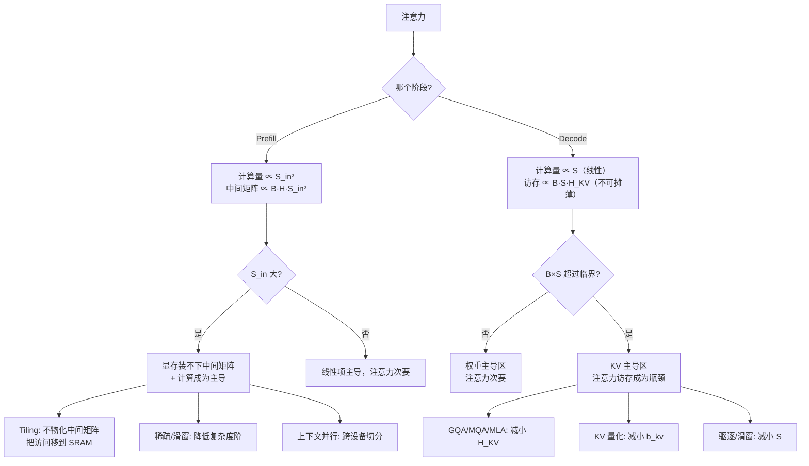

# 推理期注意力复杂度

> 位置：[InferenceAtlas](../../INDEX.md) > [模块 02](README.md) > 当前文档
> 信息截至：2026-07-29 ｜ 最后核验：2026-07-29 ｜ 内容版本：v0.1
> 时效性等级：低
> 相关主题：[prefill vs decode](02_prefill_vs_decode.md)｜[长上下文](07_long_context_inference.md)｜[FlashAttention](../04_compilers_runtimes_and_kernels/)

## 本章导读

注意力是 Transformer 中唯一与已缓存长度相关的算子。所有其他算子（投影、MLP、归一化）的代价只取决于本次处理的 token 数，与上下文多长无关。因此**长上下文的全部额外代价都来自注意力及其 KV cache**。

本章分别推导 prefill 与 decode 阶段注意力的计算复杂度与访存复杂度，并说明一个常被混淆的要点：**注意力在 prefill 时是计算问题（平方复杂度），在 decode 时是访存问题（线性但不可摊薄）**。二者需要不同的优化手段。

## 学习目标

读完本章后，读者应能够：

1. 分别写出 prefill 与 decode 阶段注意力的计算量与访存量表达式；
2. 解释为什么 prefill 的时延随输入长度超线性增长；
3. 说明 decode 阶段注意力何时从次要项变成主导项；
4. 判断一项注意力优化（如 tiling、稀疏、滑窗）作用于哪个瓶颈。

## 核心结论

- **Prefill 注意力计算量 $\propto S_{in}^2$**，因此输入长度翻倍，TTFT 增长超过一倍。
- **Decode 注意力计算量 $\propto S$（线性），但访存量同样 $\propto S$ 且无法被批处理摊薄**——这是长上下文 decode 变慢的直接原因。
- **注意力中间矩阵 $[B,H,T,S{+}T]$ 的物化是 prefill 的显存与带宽瓶颈**，tiling 类方法通过不物化它来消除该瓶颈。
- **稀疏/滑窗注意力改变的是复杂度的阶**，而 tiling 改变的是常数因子与访存层级——二者不可互相替代。

## 1. 问题定义、系统边界与工作负载

### 1.1 注意力的三步

| 步骤 | 运算 | 输出形状 |
|---|---|---|
| 打分 | $QK^\top / \sqrt{D_h}$ | $[B,H,T,S{+}T]$ |
| 归一化 | softmax（沿最后一维） | $[B,H,T,S{+}T]$ |
| 加权 | 概率 $\times V$ | $[B,T,H,D_h]$ |

$T$ 为本次处理的 token 数：prefill 时 $T=S_{in}$，decode 时 $T=1$。$S$ 为已缓存长度。

## 2. 原理、数学与性能模型

### 2.1 Prefill 阶段

设 $T=S_{in}$，$S=0$（首次）。

**计算量**（每层，忽略常数）：

$$
C_{attn}^{prefill} \approx \underbrace{2 B H S_{in}^2 D_h}_{\text{打分}} + \underbrace{2 B H S_{in}^2 D_h}_{\text{加权}} = 4 B H S_{in}^2 D_h
$$

**与其他算子对比**（每层）：

| 算子 | 计算量 | 随 $S_{in}$ |
|---|---|---|
| 投影 + MLP | $\propto B S_{in} \cdot (\text{参数量}_{layer})$ | 线性 |
| **注意力** | $\propto B H S_{in}^2 D_h$ | **平方** |

**交叉点**：当 $S_{in}$ 超过某个阈值后，注意力项超过线性项成为主导。该阈值与 $d$、$d_{ff}$、$H$、$D_h$ 有关，因模型而异。

**实用结论**：**输入长度翻倍时，prefill 时延增长在 2 倍到 4 倍之间**——线性部分翻倍，平方部分翻四倍，实际值取决于二者的相对占比。把 TTFT 按线性外推到更长输入会低估。

**显存**：打分矩阵 $[B,H,S_{in},S_{in}]$ 的元素数为 $B H S_{in}^2$。在长序列下这个中间张量可以超出可用显存——这是 tiling 类方法的直接动机。

### 2.2 Decode 阶段

设 $T=1$，已缓存 $S$ 个 token。

**计算量**（每层）：

$$
C_{attn}^{decode} \approx 4 B H S D_h
$$

**线性**于 $S$，不是平方——因为只有一个新 query。

**访存量**（每层）：必须读取全部 KV cache：

$$
M_{attn}^{decode} \approx 2 B S H_{KV} D_h b_{kv}
$$

**算术强度**：

$$
I_{attn}^{decode} \approx \frac{4 B H S D_h}{2 B S H_{KV} D_h b_{kv}} = \frac{2H}{H_{KV} b_{kv}}
$$

**这个结果很重要**：它**与 $S$ 和 $B$ 都无关**，只取决于 GQA 的分组比 $H/H_{KV}$ 与 KV 精度。

**推论**：

- MHA（$H=H_{KV}$）时 $I \approx 2/b_{kv}$，BF16 下约为 1——**极度 memory-bound**；
- GQA 分组比为 8 时 $I \approx 16/b_{kv}$，BF16 下约为 8——仍偏低但改善明显；
- KV 量化到 INT8 使 $I$ 翻倍。

**这从注意力算子内部解释了 GQA 与 KV 量化的价值**：它们不仅减少显存占用，还直接提高注意力算子的算术强度。

### 2.3 何时注意力成为 decode 的主导项

Decode 每步的总访存 = 权重 + KV：

$$
M_{total} \approx \underbrace{P_{params} b_w}_{\text{权重，被 } B \text{ 摊薄}} + \underbrace{2 L B S H_{KV} D_h b_{kv}}_{\text{KV，不可摊薄}}
$$

二者相等时的临界条件即 [模块 01 第 5 章](../01_foundations_and_metrics/05_memory_bandwidth_and_arithmetic_intensity.md) 的 $B^*$：

$$
B \times S = \frac{P_{params} b_w}{2 L H_{KV} D_h b_{kv}}
$$

**注意右边是常数**：这说明**并发数与上下文长度的乘积**决定了是否进入 KV 主导区，而非二者单独。

**实用含义**：服务 100 个 1K 上下文的请求与服务 10 个 10K 上下文的请求，在带宽压力上是等价的。这个等价关系在容量规划中很有用。

### 2.4 优化手段的作用层次

| 手段 | 改变什么 | Prefill | Decode |
|---|---|---|---|
| Tiling（FlashAttention 类） | 访存**层级**（HBM→SRAM），不改变复杂度阶 | **大** | 中 |
| GQA / MQA | 减小 $H_{KV}$，降低 KV 访存与提高 $I$ | 中 | **大** |
| MLA | 低维潜表示，降低 KV 体积 | 中 | **大** |
| KV 量化 | 减小 $b_{kv}$ | 中 | **大** |
| 滑窗注意力 | 把 $S$ 限制为窗口大小，**改变复杂度阶** | **大** | **大** |
| 稀疏注意力 | 减少参与计算的 KV 对，**改变复杂度阶** | **大** | 大 |
| 上下文并行 | 沿序列维度切分到多设备 | **大** | 中 |
| 前缀共享 | 复用已算好的 KV | **大**（跳过） | 中 |

**关键区分**：tiling **不改变复杂度的阶**，它改变常数因子与访存层级；滑窗与稀疏**改变阶**，但代价是丢失部分上下文信息（质量影响需评测）。把二者混为一谈是常见错误。

## 3. 实现机制与系统设计

### 3.1 注意力的瓶颈迁移

**图展示什么**：注意力瓶颈随阶段与规模的迁移路径，以及每个瓶颈对应的优化手段。

**核心瓶颈在哪**：两个分支点是关键。prefill 侧的 `S_in 大?` 决定是否需要 tiling；decode 侧的 `B×S 超过临界?` 决定是否需要 KV 压缩。**两个分支的答案不同，优化手段完全不重叠。**

**图中的 trade-off**：右侧的 `稀疏/滑窗` 与 `驱逐` 通过丢弃信息来降低复杂度，因此有质量代价；而 `Tiling`、`GQA`、`KV 量化` 中，前者无质量代价、后两者代价较小但需评测。选择顺序应当是先无损后有损。

**面试如何引用**：被问到"长上下文怎么优化"时，先问清是 prefill 慢还是 decode 慢，再沿对应分支展开。直接罗列优化清单而不区分分支，说明没有真正理解瓶颈结构。

## 4. 性能、成本、能耗与可靠性 trade-off

| 手段 | 质量影响 | 复杂度 | 收益条件 |
|---|---|---|---|
| Tiling | **无**（数学等价） | kernel 实现复杂 | 长序列 |
| GQA/MQA | 需预训练时选择 | 无额外 | 始终 |
| MLA | 需预训练时选择 | 中 | 始终 |
| KV 量化 | 小到中，需评测 | 中 | KV 主导区 |
| 滑窗 | **丢失远端上下文** | 低 | 任务不依赖远端 |
| 稀疏 | 取决于稀疏模式 | 高 | 需实证 |
| 前缀共享 | 无 | 中 | 前缀重复率高 |

**优先级建议**：先用无损手段（tiling、前缀共享），再用需预训练配合的结构手段（GQA/MLA），最后才考虑有损手段（量化、滑窗、驱逐），且每次都必须做质量评测。

## 5. benchmark、真实案例或公开部署案例

| 公开结论 | 来源 |
|---|---|
| 注意力性能由 HBM 读写而非 FLOP 主导；分块与在线 softmax 可避免物化 $[T,S]$ 矩阵，且数学上精确等价 | [FlashAttention, NeurIPS 2022](https://arxiv.org/abs/2205.14135) |
| Transformer 的自注意力对序列长度为平方复杂度 | [Attention Is All You Need, NeurIPS 2017](https://arxiv.org/abs/1706.03762) |

> 稀疏注意力、滑窗注意力的具体质量-性能权衡数据依赖模型与任务，将在 [模块 13](../13_research_papers_and_technical_reports/) 的论文卡片中逐条附来源。`待核实`

## 6. 设计决策框架

1. 确定是 prefill 慢还是 decode 慢（用六段分解）；
2. **若 prefill 慢**：检查是否已用 tiling 类实现；检查中间矩阵是否超显存；评估前缀共享的适用性；超长输入考虑上下文并行；
3. **若 decode 慢**：计算 $B \times S$ 是否超过临界值；若在 KV 主导区，按 GQA/MLA → KV 量化 → 驱逐的顺序评估；
4. 有损手段必须配质量评测；
5. 重新测量并确认瓶颈已迁移。

## 7. 常见失败模式与排查路径

| 失败模式 | 表现 | 根因 | 纠正 |
|---|---|---|---|
| 按线性外推 TTFT | 长输入下严重低估 | 忽略平方项 | 按超线性预期 |
| 长序列 prefill OOM | 显存溢出 | 中间矩阵物化 | 用 tiling 实现 |
| 认为 tiling 能降低复杂度阶 | 超长序列仍慢 | tiling 改常数不改阶 | 需稀疏/滑窗/并行 |
| 只按上下文长度评估 KV 压力 | 高并发短上下文也卡 | 应看 $B\times S$ | 用乘积判定 |
| 用滑窗后质量下降 | 任务效果变差 | 丢失远端上下文 | 先评测再上线 |
| GQA 模型按 MHA 估算 KV | 估算偏大数倍 | 用了 $H$ 而非 $H_{KV}$ | 查模型卡 |

## 8. 关联面试主题

1. **prefill 与 decode 注意力的复杂度差异** → 本章 2.1–2.2
2. **decode 注意力的算术强度为何与 $S$ 无关** → 本章 2.2
3. **何时注意力成为 decode 的主导项** → 本章 2.3
4. **tiling 与稀疏注意力的区别** → 本章 2.4
5. **长上下文如何优化** → 本章 3.1、[07 长上下文](07_long_context_inference.md)

## 9. 小结

注意力是唯一与上下文长度相关的算子，因此长上下文的全部额外代价都来自它。Prefill 阶段注意力计算量与输入长度成平方关系，导致 TTFT 超线性增长，且中间矩阵 $[B,H,S_{in},S_{in}]$ 的物化构成显存瓶颈——这是 tiling 类方法的攻击点。Decode 阶段注意力计算量与访存量都与上下文成线性关系，但其算术强度 $2H/(H_{KV}b_{kv})$ 与上下文长度和批大小都无关，只取决于 GQA 分组比与 KV 精度——这从算子内部解释了 GQA 与 KV 量化的价值。是否进入 KV 主导区由 $B \times S$ 的乘积决定，而非二者单独。优化手段应按无损优先的顺序选择。

## 关键术语

| 中文术语 | 英文 | 定义 | 单位/口径 | 关联文档 |
|---|---|---|---|---|
| 打分矩阵 | attention score matrix | $[B,H,T,S{+}T]$，长序列时的显存瓶颈 | — | 本章 1.1 |
| 分块 | tiling | 把数据分块保持在 SRAM，**不改变复杂度阶** | — | 本章 2.4 |
| 滑窗注意力 | sliding-window attention | 限制注意力范围为固定窗口，**改变复杂度阶** | token | 本章 2.4 |
| GQA 分组比 | GQA group ratio | $H/H_{KV}$，直接决定注意力算子的算术强度 | 无量纲 | [06](06_gqa_mqa_mla_and_kv_reduction.md) |

## 延伸阅读

- [06 GQA/MQA/MLA](06_gqa_mqa_mla_and_kv_reduction.md) —— KV 结构优化的完整对比
- [07 长上下文推理](07_long_context_inference.md) —— 长上下文的系统级处理
- [模块 04：FlashAttention](../04_compilers_runtimes_and_kernels/) —— tiling 的 kernel 实现

## 主要来源

| # | 来源 | 类型 | 披露等级 | 核验日期 |
|---:|---|---|---|---|
| 1 | [Attention Is All You Need (NeurIPS 2017)](https://arxiv.org/abs/1706.03762) | 会议论文 | 独立可复现实验 | 2026-07-29 |
| 2 | [FlashAttention (NeurIPS 2022)](https://arxiv.org/abs/2205.14135) | 会议论文 | 独立可复现实验 | 2026-07-29 |

> **说明**：本章的复杂度与算术强度推导为**本库基于第一性原理的教学推导**，忽略常数因子与实现细节，用于判定瓶颈类型。

## 更新记录

| 日期 | 版本 | 变更 | 核验人 |
|---|---|---|---|
| 2026-07-29 | v0.1 | 初稿 | — |
