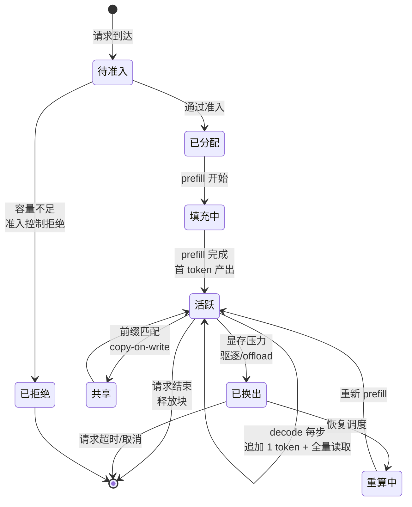

# KV Cache 基础

> 位置：[InferenceAtlas](../../INDEX.md) > [模块 02](README.md) > 当前文档
> 信息截至：2026-07-29 ｜ 最后核验：2026-07-29 ｜ 内容版本：v0.1
> 时效性等级：低
> 相关主题：[容量模型](05_kv_cache_capacity_and_memory_models.md)｜[PagedAttention](../03_serving_engines_and_scheduling/)｜[压缩与驱逐](08_kv_cache_compression_quantization_and_eviction.md)

## 本章导读

KV cache 是 LLM 推理与传统深度学习推理最本质的区别。它把一次无状态的前向计算变成了**有状态的、显存受限的、生命周期需要被管理的服务**。

这一变化的后果是全方位的：显存容量成为并发度的硬约束；调度器必须与内存分配器协同；请求之间可以共享状态因而产生隐私边界；系统在显存耗尽时会进入抖动而非简单变慢。本模块后续所有内容，以及模块 03、06 的大部分内容，都是在处理这个变化带来的问题。

本章建立 KV cache 的基本图景：它是什么、生命周期如何、有哪些管理维度。定量的容量模型在 [下一章](05_kv_cache_capacity_and_memory_models.md)。

## 学习目标

读完本章后，读者应能够：

1. 说明 KV cache 存储什么、为什么必须存、不存的代价是什么；
2. 描述一条 KV cache 从分配到释放的完整生命周期；
3. 列出 KV cache 管理的五个维度及其相互影响；
4. 解释跨请求共享 KV 带来的收益与隐私风险。

## 核心结论

- **KV cache 缓存的是每层、每个已处理 token 的 K 与 V 张量**，使 decode 每步只需为新 token 计算 K/V。
- **它是时间-空间交换**：把 $O(N^2)$ 的重复计算换成 $O(N)$ 的显存占用，交换比极为有利，因此是必需而非可选。
- **KV cache 的生命周期与请求绑定**，其占用在请求存活期间持续，因此长请求会长期占据显存并压低整体并发。
- **跨请求共享（前缀缓存）是重要收益来源，也是隐私边界**：共享意味着一个请求的计算结果被另一个请求使用，多租户场景必须显式管理。

## 1. 问题定义、系统边界与工作负载

### 1.1 缓存的是什么

对每一层、每一个已处理的 token，缓存两个张量：

| 张量 | 形状（单序列单层） | 来源 |
|---|---|---|
| K | $[S, H_{KV}, D_h]$ | K 投影 + 位置编码 |
| V | $[S, H_{KV}, D_h]$ | V 投影 |

**注意**：

- 缓存的是**位置编码之后**的 K（若使用 RoPE 等作用于 K 的编码），因为注意力直接使用它；
- 缓存 $H_{KV}$ 而非 $H$ 组——GQA/MQA 模型的 cache 显著小于 MHA；
- **Q 不缓存**，因为每步只需当前 token 的 Q。

### 1.2 不缓存的代价

见 [第 1 章 2.4 节](01_transformer_inference_from_first_principles.md)：不缓存时生成 $N$ 个 token 的 K/V 投影总计算量与 $N^2$ 成正比，缓存后降为线性。

**这个交换是压倒性有利的**，因此所有实用实现都缓存。真正的工程问题不是"要不要缓存"，而是"显存不够时怎么办"——这正是模块 03 的主题。

## 2. 原理、数学与性能模型

### 2.1 生命周期

| 阶段 | 事件 | 显存操作 |
|---|---|---|
| 1. 准入 | 请求被调度器接纳 | 预估所需容量，检查可行性 |
| 2. 分配 | prefill 开始 | 分配初始块 |
| 3. 填充 | prefill 执行 | 写入 $S_{in}$ 个 token 的 K/V |
| 4. 增长 | 每步 decode | 追加 1 个 token 的 K/V；块满时分配新块 |
| 5. 读取 | 每步 decode 的注意力 | **全量读取**该序列的 KV |
| 6.（可选）共享 | 前缀匹配 | 与其他序列共享只读块 |
| 7.（可选）换出 | 显存压力 | 驱逐或 offload 到 CPU/NVMe |
| 8.（可选）重算 | 被驱逐后恢复 | 重新 prefill 该序列 |
| 9. 释放 | 请求结束 | 归还块 |

**两个关键点**：

- **步骤 5 每步都发生且是全量的**——这是 decode 阶段带宽消耗的来源；
- **步骤 7–8 是抖动的来源**：驱逐后若请求仍需继续，必须重算，而重算又加剧显存压力，形成正反馈（见 [模块 01 第 3 章](../01_foundations_and_metrics/03_queueing_theory_for_inference.md)）。

### 2.2 五个管理维度

| 维度 | 问题 | 主要手段 |
|---|---|---|
| **分配粒度** | 连续大块还是分页小块 | 分页（PagedAttention） |
| **容量控制** | 显存不够时怎么办 | 准入控制、驱逐、抢占 |
| **共享** | 相同前缀是否复用 | 前缀缓存、copy-on-write |
| **压缩** | 能否用更少字节表示 | 量化、低秩、稀疏保留 |
| **层级** | 是否放到显存之外 | CPU / NVMe / 远端内存 offload |

**这五个维度互相影响**：分页使共享成为可能（块级映射）；压缩降低容量压力从而减少驱逐；层级化引入迁移带宽成本。孤立地优化某一维通常收益有限。

### 2.3 碎片的三个来源

按最大长度预留连续显存时，浪费来自：

| 类型 | 来源 | 量级 |
|---|---|---|
| **预留浪费** | 按最大可能长度预留，实际用不到 | 通常最大 |
| **内部碎片** | 分配单元大于实际需要 | 与块大小相关 |
| **外部碎片** | 空闲空间不连续，无法满足新请求 | 与分配模式相关 |

**分页管理的贡献**是把前两者压缩到块粒度、并基本消除第三者——因为逻辑连续不再要求物理连续。详见 [模块 03](../03_serving_engines_and_scheduling/) 与 [PagedAttention 论文](https://arxiv.org/abs/2309.06180)。

## 3. 实现机制与系统设计

### 3.1 KV Cache 生命周期图

**图展示什么**：一条 KV cache 从准入到释放的完整状态机，含共享、换出与重算三条支路。

**核心瓶颈在哪**：`活跃 → 已换出 → 重算中 → 活跃` 这个环路是系统退化的主路径。每次经过它都要付出一次完整 prefill 的代价，而重算本身又需要显存，因此在高压下会自我强化——这就是 cache thrashing。**观测这个环路的经过频率（抢占率）是判断系统是否健康的关键信号。**

**图中的 trade-off**：`已拒绝` 分支牺牲可用性以保护已接纳请求的时延；`共享` 分支提高效率但引入隐私边界；`已换出` 分支保住了请求不失败但代价是重算。三条支路分别是可用性、隐私、性能三个维度上的让步。

**面试如何引用**：被问到"显存不够时系统怎么办"时，用这张状态机说明三种处理（拒绝、共享腾出、换出重算）及各自代价，并指出重算环路的正反馈风险。这比只回答"会 OOM"深得多。

### 3.2 共享与隐私

前缀缓存让多个请求共享相同前缀的 KV 块。收益显著（跳过重复 prefill），但引入两个必须显式处理的问题：

| 问题 | 风险 | 处理 |
|---|---|---|
| **跨租户共享** | A 租户的内容影响 B 租户的计算路径，可能构成信息泄露 | 按租户隔离缓存命名空间 |
| **时序侧信道** | 命中与未命中的时延差异可被观测，从而推断他人是否发过某前缀 | 对敏感场景禁用跨租户共享或加噪 |

**设计原则**：**共享的默认作用域应当是租户内，而非全局**。跨租户共享只应在明确评估过风险的场景（如公共系统提示）中启用。这一点在多租户产品中经常被忽略。

### 3.3 与调度器的耦合

KV cache 管理不能独立于调度：

| 调度决策 | 对 cache 的影响 |
|---|---|
| 接纳新请求 | 需要新分配，可能触发驱逐 |
| 增大批大小 | 线性增加 KV 占用 |
| 抢占某请求 | 释放其块，但后续需重算 |
| 优先长请求 | 长期占用大量块，压低整体并发 |
| 长度感知组批 | 影响块的分配与回收模式 |

**因此在实现上，调度器与 KV 分配器必须共享状态**。把二者分离设计是常见的架构错误，会导致调度器做出内存上不可行的决策。

## 4. 性能、成本、能耗与可靠性 trade-off

| 管理策略 | 收益 | 代价 |
|---|---|---|
| 分页分配 | 消除碎片，提高并发 | 间接寻址开销、块大小需调优 |
| 前缀共享 | 跳过重复 prefill | 隐私边界、块引用计数复杂度 |
| KV 量化 | 容量与带宽双降 | 可能质量下降 |
| CPU offload | 突破显存容量 | PCIe 带宽成为瓶颈，时延上升 |
| 激进驱逐 | 提高接纳率 | 重算成本、方差增大 |
| 保守准入 | 稳定时延 | 拒绝率上升 |

**核心张力**：容量、时延、可用性三者不可兼得。系统必须显式选择在过载时牺牲哪一个——拒绝新请求（可用性）、换出重算（时延）、还是降低上下文上限（功能）。

## 5. benchmark、真实案例或公开部署案例

| 公开结论 | 来源 |
|---|---|
| 按最大长度预留连续 KV 显存造成显著浪费；分页管理以块为单位分配并支持跨请求共享与 copy-on-write | [PagedAttention, SOSP 2023](https://arxiv.org/abs/2309.06180) |
| 迭代级调度需要与 KV 分配协同，请求可动态进出批次 | [Orca, OSDI 2022](https://www.usenix.org/conference/osdi22/presentation/yu) |
| vLLM 与 SGLang 均实现了分页 KV 与前缀缓存（SGLang 的实现基于基数树） | [vLLM](https://github.com/vllm-project/vllm)、[SGLang](https://github.com/sgl-project/sglang)，`开源代码/配置披露` |

> 具体的前缀命中率、碎片率与抢占率数据依赖 workload 与实现，需实测。本库不引用无来源的通用比例。`待核实`

## 6. 设计决策框架

1. 确认模型的 $L$、$H_{KV}$、$D_h$（从官方模型卡，不可猜测）；
2. 用 [下一章](05_kv_cache_capacity_and_memory_models.md) 的公式估算单序列每 token 的 KV 占用；
3. 由目标并发与上下文推出总需求，与可用显存对比；
4. 选择分配粒度：几乎总是分页；块大小需按 workload 调优；
5. 评估前缀共享的适用性（测量请求间前缀重复率）；
6. **明确共享的作用域**（租户内 vs 全局），并记录风险评估；
7. 设定准入控制阈值与驱逐策略，限制抢占频率；
8. 监控：KV 占用率、抢占率、前缀命中率——三者缺一不可。

## 7. 常见失败模式与排查路径

| 失败模式 | 表现 | 根因 | 纠正 |
|---|---|---|---|
| Cache thrashing | 并发升高后吞吐骤降 | 驱逐-重算正反馈 | 准入控制 + 限制抢占频率 |
| 按最大长度预留 | 并发远低于理论值 | 预留浪费 | 分页分配 |
| 跨租户共享未隔离 | 潜在信息泄露 | 共享作用域过宽 | 按租户命名空间隔离 |
| 调度器与分配器分离 | 调度出内存不可行的批 | 状态不共享 | 二者协同设计 |
| 块大小不当 | 内部碎片或元数据开销大 | 未按 workload 调优 | 实测调优 |
| 只监控显存总量 | 无法预判抖动 | 缺抢占率与占用率 | 补齐三项监控 |
| 长请求独占 | 整体并发下降 | 无长度配额 | 按长度分池或限额 |

## 8. 关联面试主题

1. **KV cache 存什么、为什么必需** → 本章 1.1–1.2
2. **描述 KV cache 的完整生命周期** → 本章 2.1、3.1
3. **显存不足时系统有哪些选择，各自代价** → 本章 3.1、4
4. **前缀共享的收益与隐私风险** → 本章 3.2
5. **cache thrashing 如何排查** → 本章 7

## 9. 小结

KV cache 缓存每层每个已处理 token 的 K 与 V，把生成的总计算量从平方降为线性，是自回归推理的必需品而非可选优化。它的引入使推理从无状态变为有状态，显存容量因此成为并发度的硬约束。其生命周期包含准入、分配、填充、增长、读取、可选的共享/换出/重算、以及释放；其中"换出→重算→再换出"的环路是系统退化的主路径，也是 cache thrashing 的机制。管理有五个相互影响的维度：分配粒度、容量控制、共享、压缩、层级。跨请求共享是重要收益来源，但其默认作用域应当是租户内——全局共享会引入信息泄露与时序侧信道风险。KV 管理与调度必须协同设计，分离会导致调度器做出内存上不可行的决策。

## 关键术语

| 中文术语 | 英文 | 定义 | 单位/口径 | 关联文档 |
|---|---|---|---|---|
| 预留浪费 | reservation waste | 按最大可能长度预留而实际未用的显存 | GB | 本章 2.3 |
| 内部碎片 | internal fragmentation | 分配单元大于实际需要造成的浪费 | GB | 本章 2.3 |
| 外部碎片 | external fragmentation | 空闲空间不连续导致无法满足新分配 | GB | 本章 2.3 |
| 写时复制 | copy-on-write | 共享块在被修改时才复制 | — | [模块 03](../03_serving_engines_and_scheduling/) |
| 缓存颠簸 | cache thrashing | 驱逐与重算的正反馈导致的性能退化 | — | 本章 3.1 |
| 共享作用域 | sharing scope | 前缀缓存的可见范围（租户内 / 全局） | — | 本章 3.2 |

## 延伸阅读

- [05 KV 容量与内存模型](05_kv_cache_capacity_and_memory_models.md) —— 定量的容量计算
- [08 KV 压缩、量化与驱逐](08_kv_cache_compression_quantization_and_eviction.md) —— 压缩维度的展开
- [模块 03：PagedAttention 与 KV 内存管理](../03_serving_engines_and_scheduling/) —— 分配粒度的工程实现

## 主要来源

| # | 来源 | 类型 | 披露等级 | 核验日期 |
|---:|---|---|---|---|
| 1 | [PagedAttention (SOSP 2023)](https://arxiv.org/abs/2309.06180) | 会议论文 | 独立可复现实验 | 2026-07-29 |
| 2 | [Orca (OSDI 2022)](https://www.usenix.org/conference/osdi22/presentation/yu) | 会议论文 | 独立可复现实验 | 2026-07-29 |
| 3 | [vLLM 官方仓库](https://github.com/vllm-project/vllm) | 开源项目 | 开源代码/配置披露 | 2026-07-29 |
| 4 | [SGLang 官方仓库](https://github.com/sgl-project/sglang) | 开源项目 | 开源代码/配置披露 | 2026-07-29 |

## 更新记录

| 日期 | 版本 | 变更 | 核验人 |
|---|---|---|---|
| 2026-07-29 | v0.1 | 初稿 | — |
