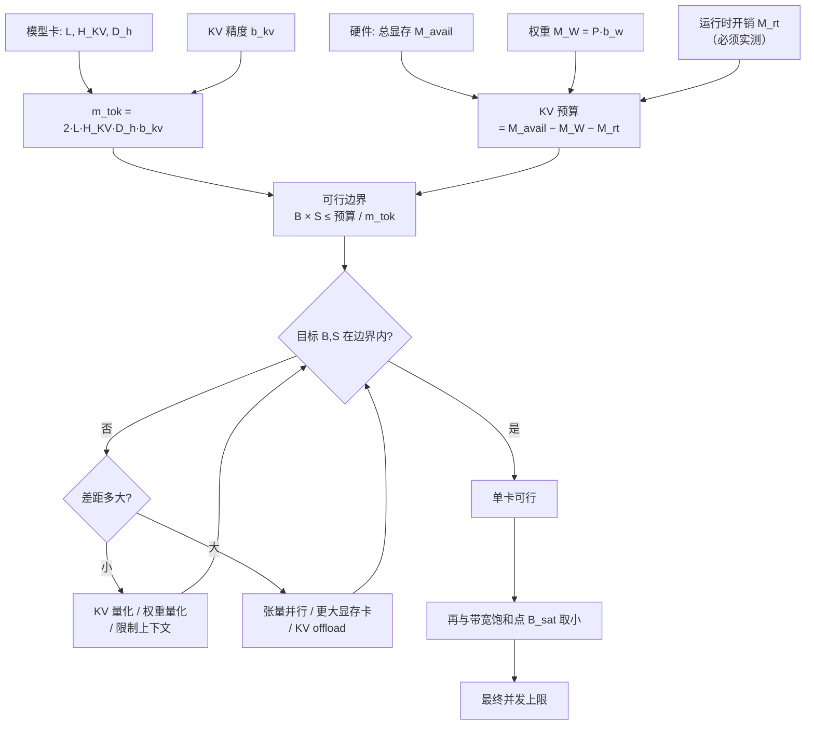

# KV Cache 容量与内存模型

> 位置：[InferenceAtlas](../../INDEX.md) > [模块 02](README.md) > 当前文档
> 信息截至：2026-07-29 ｜ 最后核验：2026-07-29 ｜ 内容版本：v0.1
> 时效性等级：低
> 相关主题：[KV Cache 基础](04_kv_cache_fundamentals.md)｜[容量规划](../01_foundations_and_metrics/08_capacity_planning.md)｜[GQA/MQA/MLA](06_gqa_mqa_mla_and_kv_reduction.md)

## 本章导读

本章给出全库最常被引用的一个公式，以及使用它的正确方式。

KV 容量计算在推理面试中出现频率极高，原因是它同时考察三件事：是否理解 KV cache 的结构、是否会用公式反解设计约束、是否知道公式的局限。**只会代入数字算出一个结果的候选人，和能说出"这是教学近似、真实占用还受哪些因素影响"的候选人，差距在这里。**

本章的核心不是公式本身（它很简单），而是**如何把它当作求解工具而非验证工具**：固定显存，反解出并发数与上下文长度的可行边界，从而把硬件选型从猜测变成计算。

## 学习目标

读完本章后，读者应能够：

1. 写出 KV 容量公式并解释每个因子的来源；
2. 固定显存反解 $(B, S)$ 可行边界，并画出这条曲线；
3. 列出至少五项使真实占用偏离公式的因素；
4. 用公式定量比较 MHA/GQA、不同 KV 精度、不同上下文长度的方案。

## 核心结论

- **$M_{KV} \approx 2 \times L \times B \times S \times H_{KV} \times D_h \times b_{kv}$**。每个因子都是线性的，因此任何一项减半，总量减半。
- **正确用法是反解**：固定可用显存，得到 $B \times S \le$ 常数的双曲线可行边界。并发与上下文长度是**竞争关系**。
- **公式是教学近似**，真实占用通常更大。偏差来自块粒度、对齐、padding、元数据、TP 分片与共享，需实测标定。
- **可用于 KV 的显存 = 总显存 − 权重 − 运行时开销**，其中运行时开销必须实测，不可猜测。

## 1. 问题定义、系统边界与工作负载

### 1.1 显存的三部分

$$
M_{avail} = M_W + M_{KV} + M_{rt}
$$

| 项 | 含义 | 可预测性 |
|---|---|---|
| $M_W$ | 模型权重 = $P_{params} \times b_w$ | **高**（确定值） |
| $M_{KV}$ | KV cache | **高**（本章公式） |
| $M_{rt}$ | 激活、临时缓冲、通信 buffer、碎片、框架开销 | **低**（须实测） |

**因此可用于 KV 的显存**：

$$
M_{KV}^{budget} = M_{avail} - M_W - M_{rt}
$$

**$M_{rt}$ 是最大的不确定性来源**。它与引擎实现、并行配置、最大批大小设置强相关。**规划时必须用实测值，用猜测值会导致上线后 OOM 或严重低估并发。**

## 2. 原理、数学与性能模型

### 2.1 容量公式

$$
\boxed{M_{KV} \approx 2 \times L \times B \times S \times H_{KV} \times D_h \times b_{kv}}
$$

**每个因子的来源**：

| 因子 | 含义 | 来源 |
|---|---|---|
| $2$ | K 与 V 两个张量 | 注意力结构 |
| $L$ | 层数 | 每层独立缓存 |
| $B$ | 并发序列数 | 每序列独立 |
| $S$ | 每序列已缓存 token 数 | 每 token 一份 |
| $H_{KV}$ | KV head 数 | **GQA/MQA 在此处压缩** |
| $D_h$ | 每 head 维度 | — |
| $b_{kv}$ | 每元素字节数 | **KV 量化在此处压缩** |

**单序列每 token 的占用**（一个有用的中间量）：

$$
m_{tok} = 2 \times L \times H_{KV} \times D_h \times b_{kv}
$$

单位：byte/token。它只依赖模型结构与精度，**与并发和长度无关**，因此是一个可以预先算好并复用的常数。

$$
M_{KV} = B \times S \times m_{tok}
$$

### 2.2 反解：可行边界

固定 $M_{KV}^{budget}$：

$$
B \times S \le \frac{M_{KV}^{budget}}{m_{tok}}
$$

**这是一条双曲线**。它的含义：

- **并发数与上下文长度是竞争关系**，二者的乘积有上限；
- 要么服务多个短请求，要么服务少数长请求；
- 支持的最大上下文长度（$B=1$ 时）= $M_{KV}^{budget} / m_{tok}$；
- 在目标上下文 $S_0$ 下的最大并发 = $M_{KV}^{budget} / (S_0 \times m_{tok})$。

**这条曲线是硬件选型的主要依据**。它把"这块卡够不够"从主观判断变成一个可以画出来的边界。

**与带宽约束的关系**：[模块 01 第 5 章](../01_foundations_and_metrics/05_memory_bandwidth_and_arithmetic_intensity.md) 指出还有一个带宽饱和点 $B_{sat}$。实际并发上限是二者的较小值：

$$
B_{max} = \min\left(\frac{M_{KV}^{budget}}{S \times m_{tok}},\ B_{sat}\right)
$$

**长上下文场景通常是容量先触及，短上下文场景通常是带宽先触及。** 知道哪个先触及决定了该往哪投资。

### 2.3 教学案例

> 以下使用**通用符号与假设值**演示计算方法，不针对任何具体模型或硬件。真实数值必须从官方模型卡与硬件规格获取。

**设定**：$L = 32$ 层，$H_{KV} = 8$（GQA），$D_h = 128$，KV 用 BF16（$b_{kv}=2$）。

**第一步：算 $m_{tok}$**

$$
m_{tok} = 2 \times 32 \times 8 \times 128 \times 2 = 131{,}072 \text{ byte/token} = 128 \text{ KiB/token}
$$

**第二步：假设 KV 预算为 40 GiB**

$$
B \times S \le \frac{40 \times 1024^3}{131072} = 327{,}680 \text{ token}
$$

**第三步：读出可行边界**

| 上下文 $S$ | 最大并发 $B$ |
|---:|---:|
| 1,024 | 320 |
| 4,096 | 80 |
| 16,384 | 20 |
| 32,768 | 10 |
| 131,072 | 2 |

**第四步：对比方案**

| 变更 | $m_{tok}$ | $B\times S$ 上限 | 相对基线 |
|---|---:|---:|---:|
| 基线（GQA-8, BF16） | 128 KiB | 327,680 | 1× |
| 改为 MHA（$H_{KV}=32$） | 512 KiB | 81,920 | **0.25×** |
| KV 量化到 INT8 | 64 KiB | 655,360 | **2×** |
| GQA-8 + INT8 KV | 64 KiB | 655,360 | 2× |
| MQA（$H_{KV}=1$）+ BF16 | 16 KiB | 2,621,440 | **8×** |

**这张表的价值**：它把架构选择与量化决策的影响变成了可比较的数字。**MHA 到 GQA-8 的四倍差距，是长上下文服务可行性的分水岭。**

### 2.4 公式的局限

真实占用通常**大于**公式值。偏差来源：

| 来源 | 方向 | 说明 |
|---|---|---|
| **块粒度** | 偏大 | 分页分配以块为单位，最后一块通常不满 |
| **对齐与 padding** | 偏大 | 张量对齐要求 |
| **元数据** | 偏大 | block table、引用计数等 |
| **张量并行分片** | 视情况 | TP 下每卡只存部分 head，但可能有复制 |
| **前缀共享** | **偏小** | 共享块被多序列复用，实际总量低于独立计算 |
| **框架预分配** | 偏大 | 部分引擎预留固定比例 |
| **推测性分配** | 偏大 | 为可能的增长预留 |

**结论**：公式给出的是**量级与相对比较**，不是精确值。**规划时应留出余量并实测标定**，具体余量比例依赖引擎实现，需自行测量。`待核实`

**但相对比较是可靠的**：上表第 2.3 节的"相对基线"列不受这些偏差影响（它们大致按比例作用），因此**用公式做方案对比比用它做绝对预测更可靠**。

## 3. 实现机制与系统设计

### 3.1 从容量到硬件选型

**图展示什么**：从模型结构与硬件规格出发，推导可行边界并做选型决策的完整链路。

**核心瓶颈在哪**：`运行时开销 M_rt（必须实测）` 是整条链路上唯一无法从规格推算的量，也因此是最常出错的环节。用猜测值会使整个下游计算失去意义。

**图中的 trade-off**：当目标不在边界内时，三类手段的代价递增——量化（可能损质量）、限制上下文（损功能）、张量并行或换卡（增成本与通信开销）。选择顺序应按代价从低到高。

**面试如何引用**：被问到"给定配置算 KV cache"时，不要只算一个数字，而是走完这条链并指出 $M_{rt}$ 需实测。再主动做一次"如果换成 MHA / 如果 KV 量化"的对比——这展示的是设计能力而非算术能力。

### 3.2 张量并行下的 KV 分布

TP 度为 $t$ 时，KV head 通常沿 head 维度切分：每卡存 $H_{KV}/t$ 组。因此单卡 KV 占用约为：

$$
M_{KV}^{per\text{-}card} \approx \frac{M_{KV}}{t}
$$

**注意事项**：

- 当 $H_{KV} < t$ 时（如 MQA 且 TP 度较大），无法整除，实现上可能复制 KV 到每卡，此时**总占用不降反升**；
- 这是 MQA 与大 TP 度组合时的一个实际约束，选型时需核对。

## 4. 性能、成本、能耗与可靠性 trade-off

| 手段 | $m_{tok}$ 变化 | 质量影响 | 其他代价 |
|---|---|---|---|
| GQA（相对 MHA） | ÷ 分组比 | 需预训练时选择 | 无额外推理成本 |
| MQA | ÷ $H$ | 需预训练时选择 | 大 TP 度下可能无法整除 |
| MLA | 显著降低 | 需预训练时选择 | 实现复杂度 |
| KV 量化 INT8 | ÷ 2 | 小到中，需评测 | 量化/反量化开销 |
| KV 量化 INT4 | ÷ 4 | 中，需评测 | 同上，风险更高 |
| 滑窗 | $S$ 被限制 | **丢失远端上下文** | 任务相关 |
| 驱逐 | 有效 $S$ 减小 | 丢失被驱逐部分 | 可能需重算 |
| CPU offload | 显存占用降低 | 无 | **PCIe 带宽成为瓶颈** |
| 前缀共享 | 有效 $B$ 减小 | 无 | 隐私边界 |

**优先级**：无质量代价的手段（前缀共享、TP 分片）优先；结构性手段（GQA/MLA）需在选模型时决定；有损手段（量化、滑窗、驱逐）最后且必须评测。

## 5. benchmark、真实案例或公开部署案例

| 公开结论 | 来源 |
|---|---|
| 按最大长度预留连续显存造成显著浪费；分页管理把浪费压缩到块粒度并支持共享 | [PagedAttention, SOSP 2023](https://arxiv.org/abs/2309.06180) |
| KV 显存的有效利用率直接决定可并发请求数 | 同上 |

> 具体模型的 $L$、$H_{KV}$、$D_h$ 与具体硬件的显存容量，需从官方模型卡与规格页获取，将录入 [`models.csv`](../../data/models.csv) 与 [`accelerators.csv`](../../data/accelerators.csv) 并附来源。本章第 2.3 节使用的是**演示用假设值**，非任何真实产品参数。`待核实`

## 6. 设计决策框架

1. 从官方模型卡取 $L$、$H_{KV}$、$D_h$（未公开则标 `未公开`，不猜测）；
2. 选定 $b_{kv}$，计算 $m_{tok}$；
3. 从硬件规格取 $M_{avail}$，计算 $M_W$；
4. **实测标定 $M_{rt}$**（不可跳过）；
5. 计算 KV 预算与可行边界 $B\times S$ 上限；
6. 对照目标 $(B,S)$ 判断是否可行；
7. 若不可行，按代价从低到高尝试：前缀共享 → 权重量化 → KV 量化 → 限制上下文 → TP → 换卡/offload；
8. 与带宽饱和点取小，得到最终并发上限；
9. 做方案对比表（如第 2.3 节第四步），把选择依据留档。

## 7. 常见失败模式与排查路径

| 失败模式 | 表现 | 根因 | 纠正 |
|---|---|---|---|
| 用 $H$ 代替 $H_{KV}$ | GQA 模型估算偏大数倍 | 混淆 query 与 KV head | 查模型卡的 $H_{KV}$ |
| $M_{rt}$ 靠猜 | 上线后 OOM 或并发远低于预期 | 未实测 | 压测标定 |
| 忘记减权重 | 可行边界严重高估 | 直接用总显存 | 用 KV 预算 |
| 把公式当精确值 | 边界处频繁抖动 | 忽略块粒度等偏差 | 留余量 |
| 只算容量不算带宽 | 加显存后吞吐没变 | 瓶颈是带宽 | 两约束取小 |
| MQA + 大 TP 度 | 显存不降反升 | $H_{KV}<t$ 无法整除 | 核对可整除性 |
| 忽略前缀共享 | 低估实际可并发数 | 公式假设独立 | 按实测命中率修正 |
| 用均值上下文规划 | 长请求到达时抖动 | $S$ 取值过低 | 用 P95 |

## 8. 关联面试主题

1. **写出 KV 容量公式并解释每个因子** → 本章 2.1
2. **给定显存反解可行的并发与上下文组合** → 本章 2.2–2.3
3. **公式有哪些局限，真实占用为何更大** → 本章 2.4
4. **MHA 改 GQA 对容量的影响有多大** → 本章 2.3
5. **容量约束与带宽约束哪个先触及** → 本章 2.2

## 9. 小结

KV 容量公式 $M_{KV} \approx 2 L B S H_{KV} D_h b_{kv}$ 中每个因子都是线性的。定义单序列每 token 占用 $m_{tok} = 2 L H_{KV} D_h b_{kv}$ 后，可行边界化为 $B \times S \le$ 预算 $/ m_{tok}$ 这条双曲线——并发数与上下文长度是竞争关系。正确的用法是**反解而非验证**：固定显存求可行组合，并据此做硬件选型与架构对比。公式是教学近似，真实占用因块粒度、对齐、元数据等通常更大，因前缀共享可能更小，必须实测标定；但**用它做方案相对比较比做绝对预测可靠得多**。可用于 KV 的显存需先扣除权重与运行时开销，其中运行时开销是整条链路上唯一无法从规格推算、必须实测的量。

## 关键术语

| 中文术语 | 英文 | 定义 | 单位/口径 | 关联文档 |
|---|---|---|---|---|
| 单 token KV 占用 | per-token KV footprint $m_{tok}$ | $2LH_{KV}D_h b_{kv}$，只依赖模型结构与精度 | byte/token | 本章 2.1 |
| KV 预算 | KV budget | 总显存减去权重与运行时开销 | GB | 本章 1.1 |
| 可行边界 | feasible frontier | $B\times S\le$ 预算 $/m_{tok}$ 的双曲线 | — | 本章 2.2 |
| 运行时开销 | runtime overhead $M_{rt}$ | 激活、缓冲、碎片等，**必须实测** | GB | 本章 1.1 |

## 延伸阅读

- [06 GQA/MQA/MLA](06_gqa_mqa_mla_and_kv_reduction.md) —— $H_{KV}$ 压缩的完整对比
- [08 KV 压缩、量化与驱逐](08_kv_cache_compression_quantization_and_eviction.md) —— $b_{kv}$ 与 $S$ 的压缩
- [模块 01 第 8 章：容量规划](../01_foundations_and_metrics/08_capacity_planning.md) —— 本章结论在规划中的应用

## 主要来源

| # | 来源 | 类型 | 披露等级 | 核验日期 |
|---:|---|---|---|---|
| 1 | [PagedAttention (SOSP 2023)](https://arxiv.org/abs/2309.06180) | 会议论文 | 独立可复现实验 | 2026-07-29 |
| 2 | [Attention Is All You Need (NeurIPS 2017)](https://arxiv.org/abs/1706.03762) | 会议论文 | 独立可复现实验 | 2026-07-29 |

> **说明**：本章第 2.3 节的数值案例使用**演示用假设参数**（$L=32$、$H_{KV}=8$、$D_h=128$、40 GiB 预算），不对应任何真实模型或硬件产品。真实参数必须从官方模型卡与硬件规格页获取并标注来源。

## 更新记录

| 日期 | 版本 | 变更 | 核验人 |
|---|---|---|---|
| 2026-07-29 | v0.1 | 初稿 | — |
