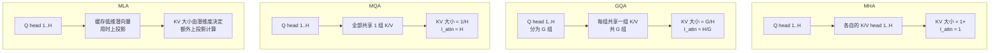

# GQA、MQA、MLA 与 KV 压缩

> 位置：[InferenceAtlas](../../INDEX.md) > [模块 02](README.md) > 当前文档
> 信息截至：2026-07-29 ｜ 最后核验：2026-07-29 ｜ 内容版本：v0.1
> 时效性等级：中
> 相关主题：[容量模型](05_kv_cache_capacity_and_memory_models.md)｜[注意力复杂度](03_attention_complexity_during_inference.md)｜[面向推理的架构](../16_research_frontiers/)

## 本章导读

KV cache 的大小与 KV head 数 $H_{KV}$ 成正比。因此**在架构层面减少 $H_{KV}$，是所有 KV 优化手段中杠杆最大的一类**——它同时降低显存占用与访存带宽，且不像量化那样需要在推理时做数值近似。

代价是：这类选择必须在**预训练阶段**做出，推理时无法更改。这使得 KV 结构成为模型架构决策中最直接影响服务经济性的一项——一个模型是 MHA 还是 GQA-8，会让它的长上下文服务成本相差数倍。

本章系统对比 MHA、MQA、GQA、MLA 四种结构，说明各自的机制、KV 压缩比与质量权衡，并给出选型判据。

## 学习目标

读完本章后，读者应能够：

1. 说明四种注意力结构在 K/V 投影上的差异；
2. 计算各结构的 KV 压缩比与对注意力算术强度的影响；
3. 解释为什么这些选择必须在预训练时做出；
4. 从服务成本角度评价一个模型的 KV 结构。

## 核心结论

- **KV 大小与 $H_{KV}$ 成正比**。MHA → GQA-8 使 KV 减少为 1/8；MHA → MQA 减少为 $1/H$。
- **它们同时改善容量与带宽**：$m_{tok}$ 下降意味着更高并发，注意力算术强度 $2H/(H_{KV}b_{kv})$ 上升意味着更快 decode。
- **必须在预训练时选择**。推理时无法把 MHA 模型转成 GQA（除非做代价高昂的再训练/蒸馏）。
- **MLA 走的是另一条路**：不是减少 head 数，而是把 K/V 压缩到低维潜空间，因此压缩比可以更高，但实现复杂度也更高。

## 1. 问题定义、系统边界与工作负载

### 1.1 四种结构的核心差异

| 结构 | Q head 数 | K/V head 数 | 机制 |
|---|---|---|---|
| **MHA** | $H$ | $H$ | 每个 query head 有独立的 K/V head |
| **MQA** | $H$ | **1** | 所有 query head 共享一组 K/V |
| **GQA** | $H$ | $G$（组数，$1<G<H$） | 每组 query head 共享一组 K/V |
| **MLA** | $H$ | 不直接存 K/V | 存低维潜向量，用时上投影 |

**注意**：MQA 是 GQA 在 $G=1$ 时的特例，MHA 是 $G=H$ 时的特例。GQA 是二者之间的连续谱。

## 2. 原理、数学与性能模型

### 2.1 KV 压缩比

沿用 [第 5 章](05_kv_cache_capacity_and_memory_models.md) 的 $m_{tok} = 2 L H_{KV} D_h b_{kv}$：

| 结构 | $H_{KV}$ | 相对 MHA 的 KV 大小 |
|---|---|---|
| MHA | $H$ | 1 |
| GQA，组数 $G$ | $G$ | $G/H$ |
| GQA-8（$H=64$ 时） | 8 | 1/8 |
| MQA | 1 | $1/H$ |
| MLA | 不适用（存潜向量） | 取决于潜维度，通常显著小于 MHA |

**MLA 的机制**：不缓存完整的 K/V，而是缓存一个低维的压缩表示，注意力计算时再上投影回来。因此其 cache 大小由潜维度而非 head 数决定。**这使得压缩比可以做得比 GQA 更激进，但需要额外的上投影计算，且实现更复杂。**

> MLA 的具体压缩比与实现细节因模型而异，需引用对应模型的官方技术报告。本库不给出通用数值。`待核实`

### 2.2 对注意力算术强度的影响

由 [第 3 章 2.2 节](03_attention_complexity_during_inference.md)：

$$
I_{attn}^{decode} \approx \frac{2H}{H_{KV} \, b_{kv}}
$$

| 结构 | $H/H_{KV}$ | $I_{attn}$（BF16 KV） |
|---|---:|---:|
| MHA | 1 | ≈ 1 |
| GQA-8（$H=64$） | 8 | ≈ 8 |
| MQA（$H=64$） | 64 | ≈ 64 |

**这是一个被低估的收益**：GQA/MQA 不仅让 KV 占用更少，还让注意力算子本身**从极度 memory-bound 向平衡点移动**。因此在长上下文场景（注意力主导时）收益是双重的。

### 2.3 质量权衡

减少 $H_{KV}$ 意味着减少 K/V 的表达能力。公开研究的共识方向是：

| 结构 | 质量（相对 MHA） | 说明 |
|---|---|---|
| GQA | 接近 | 组数适中时质量损失小 |
| MQA | 略低于 GQA | 压缩最激进 |
| MLA | 取决于潜维度 | 声称可在压缩同时保持质量 |

**重要限定**：具体的质量差异高度依赖模型规模、训练配置与评测任务。**本库不给出无来源的量化质量差异数字**，具体比较需引用对应论文或官方技术报告的评测结果。`待核实`

**工程上的实际含义**：GQA 已成为多数新模型的默认选择，因为它在质量损失很小的前提下带来了数倍的 KV 压缩。MQA 在对显存极度敏感的场景（如端侧、超长上下文）仍有价值。

### 2.4 为什么必须在预训练时决定

K/V 投影矩阵的形状由 $H_{KV}$ 决定：

- MHA：$W_K, W_V \in \mathbb{R}^{d \times H D_h}$
- GQA：$W_K, W_V \in \mathbb{R}^{d \times G D_h}$

**这些是模型参数的一部分**。把训练好的 MHA 模型改成 GQA，需要把多组 K/V head 合并成一组，这是一个有损变换，必须通过再训练或蒸馏来恢复质量——代价通常远高于直接训练一个 GQA 模型。

**因此**：从服务成本的角度，**模型的 KV 结构在选型时就已经决定了它的长上下文经济性**，这是一个不可后期修改的属性。这一点在模型选型（而非仅看质量榜单）时经常被忽略。

## 3. 实现机制与系统设计

### 3.1 四种结构对比

**图展示什么**：四种结构中 query head 与 K/V head 的对应关系，以及各自的 KV 大小与注意力算术强度。

**核心瓶颈在哪**：MHA 的 `KV 大小 = 1×, I_attn ≈ 1` 是最差组合——占用最大且算术强度最低。这解释了为什么长上下文服务在 MHA 模型上尤其困难：容量与带宽同时被压。

**图中的 trade-off**：从上到下压缩比递增，但表达能力递减（MLA 除外，它用计算换取压缩）。GQA 位于中间，是多数场景下压缩比与质量的平衡点；MLA 用额外的上投影计算换取更高压缩比，是一种不同维度的取舍。

**面试如何引用**：被问到"如何减少 KV cache"时，先区分**架构层**（本图，需预训练时决定）与**运行时层**（量化、驱逐、共享，推理时可选）。多数候选人只答后者，能指出前者不可后期更改会显著加分。

### 3.2 与张量并行的交互

TP 度为 $t$ 时，KV head 沿 head 维度切分。需要 $H_{KV}$ 能被 $t$ 整除：

| 情况 | 后果 |
|---|---|
| $H_{KV} \ge t$ 且整除 | 正常切分，每卡 $H_{KV}/t$ 组 |
| $H_{KV} < t$（如 MQA + 大 TP） | **无法切分，通常需在每卡复制 KV** |
| 不整除 | 需要 padding 或不均匀切分 |

**实际后果**：MQA 模型在大 TP 度下，KV 可能被复制到每张卡，使**总 KV 占用不降反升**。这是 MQA 的一个实际限制，选型时必须核对目标 TP 度。

**GQA 的一个附带优势**：组数通常选为 2 的幂且大于常见 TP 度，因此整除性问题较少。

## 4. 性能、成本、能耗与可靠性 trade-off

| 维度 | MHA | GQA | MQA | MLA |
|---|---|---|---|---|
| KV 占用 | 最大 | 中 | 最小 | 小 |
| 注意力算术强度 | 最低 | 中 | 最高 | 视实现 |
| 质量 | 基线 | 接近基线 | 略低 | 视潜维度 |
| 实现复杂度 | 最低 | 低 | 低 | **较高** |
| TP 兼容性 | 好 | 好 | **大 TP 度下受限** | 视实现 |
| 额外计算 | 无 | 无 | 无 | **上投影** |
| 长上下文经济性 | 差 | 好 | 最好 | 好 |

**选型建议**（从服务角度）：

- 长上下文为主要场景 → 优先 GQA 或 MLA 模型；
- 端侧/显存极度受限 → MQA 有价值；
- 需要大 TP 度 → 核对 $H_{KV}$ 与 TP 度的整除性；
- 质量优先且上下文不长 → MHA 仍可接受。

## 5. benchmark、真实案例或公开部署案例

| 结构 | 提出/主要工作 | 说明 |
|---|---|---|
| MHA | [Attention Is All You Need, NeurIPS 2017](https://arxiv.org/abs/1706.03762) | 原始多头注意力 |
| MQA、GQA、MLA | 各自有独立的原始论文与后续工作 | 将在 [模块 13](../13_research_papers_and_technical_reports/) 中逐篇建立论文卡片，附 arXiv/会议链接与实验设置 `待核实` |

> **纪律说明**：本库不在未核验一手来源的情况下给出 MQA/GQA/MLA 的原始论文编号、作者或具体实验数字。这些将在模块 13 撰写论文卡片时逐条打开原文核验后补入 [`papers.csv`](../../data/papers.csv)。当前 papers.csv 中仅含已核验的 5 篇。
>
> 各具体模型采用哪种 KV 结构（$H$、$H_{KV}$ 的实际取值），须引用官方模型卡，将录入 [`models.csv`](../../data/models.csv)。`待核实`

## 6. 设计决策框架

**评估一个候选模型的 KV 经济性**：

1. 从官方模型卡查 $H$、$H_{KV}$、$L$、$D_h$（未公开则标 `未公开`）；
2. 计算 $m_{tok} = 2LH_{KV}D_h b_{kv}$；
3. 计算目标上下文下的单序列 KV 占用；
4. 与其他候选模型对比 $m_{tok}$——**这是长上下文服务成本的直接代理指标**；
5. 计算注意力算术强度 $2H/(H_{KV}b_{kv})$；
6. 核对 $H_{KV}$ 与计划 TP 度的整除性；
7. 把 KV 经济性与质量评分一同纳入选型决策，而非只看质量榜。

**第 7 步是本章最实用的建议**：模型选型常常只比较质量，但两个质量相近的模型可能有数倍的服务成本差异，而这个差异完全由 KV 结构决定。

## 7. 常见失败模式与排查路径

| 失败模式 | 表现 | 根因 | 纠正 |
|---|---|---|---|
| 用 $H$ 算 GQA 模型的 KV | 估算偏大数倍 | 混淆 query 与 KV head | 查模型卡的 $H_{KV}$ |
| 选型只看质量榜 | 上线后长上下文成本超预期 | 未评估 KV 结构 | 把 $m_{tok}$ 纳入选型 |
| 期望推理时转 GQA | 无法实现 | KV 结构是模型参数 | 选型时决定 |
| MQA + 大 TP 度 | 显存不降反升 | $H_{KV}<t$ 需复制 | 核对整除性 |
| 只做运行时优化 | 收益有限 | 架构层已定死 | 区分架构层与运行时层 |
| 假设 MLA 一定更好 | 实现复杂度超预期 | 需额外上投影与专用 kernel | 评估引擎支持度 |

## 8. 关联面试主题

1. **MHA/MQA/GQA/MLA 的机制差异与压缩比** → 本章 1.1、2.1
2. **KV 结构如何影响注意力的算术强度** → 本章 2.2
3. **为什么不能在推理时把 MHA 转成 GQA** → 本章 2.4
4. **MQA 与大 TP 度的冲突** → 本章 3.2
5. **如何从服务成本角度评价一个模型** → 本章 6

## 9. 小结

KV cache 大小与 $H_{KV}$ 成正比，因此减少 KV head 数是杠杆最大的 KV 优化手段：它同时降低显存占用与访存带宽，并把注意力算子的算术强度从 $2/b_{kv}$ 提高到 $2H/(H_{KV}b_{kv})$。MHA、GQA、MQA 构成一个由组数参数化的连续谱，GQA 通常是压缩比与质量的平衡点；MLA 走另一条路，用低维潜表示与额外的上投影计算换取更高压缩比。这些选择必须在预训练时做出、推理时无法更改，因此**模型的 KV 结构在选型阶段就决定了它的长上下文服务经济性**——这是一个应与质量指标同等重视、但常被忽略的选型维度。MQA 在大张量并行度下可能因无法整除而需复制 KV，选型时须核对。

## 关键术语

| 中文术语 | 英文 | 定义 | 单位/口径 | 关联文档 |
|---|---|---|---|---|
| 多查询注意力 | MQA | 全部 query head 共享一组 K/V | — | 本章 1.1 |
| 分组查询注意力 | GQA | 每组 query head 共享一组 K/V | — | 本章 1.1 |
| 多头潜在注意力 | MLA | 缓存低维潜向量，用时上投影 | — | 本章 1.1 |
| 分组比 | group ratio | $H/H_{KV}$，决定压缩比与算术强度 | 无量纲 | 本章 2.2 |
| KV 经济性 | KV economics | 以 $m_{tok}$ 为代理的长上下文服务成本指标 | byte/token | 本章 6 |

## 延伸阅读

- [05 KV 容量模型](05_kv_cache_capacity_and_memory_models.md) —— $m_{tok}$ 的完整定义与应用
- [07 长上下文推理](07_long_context_inference.md) —— KV 结构在长上下文场景的作用
- [模块 16：面向推理的模型架构](../16_research_frontiers/) —— 架构与服务成本的协同设计

## 主要来源

| # | 来源 | 类型 | 披露等级 | 核验日期 |
|---:|---|---|---|---|
| 1 | [Attention Is All You Need (NeurIPS 2017)](https://arxiv.org/abs/1706.03762) | 会议论文 | 独立可复现实验 | 2026-07-29 |
| 2 | [PagedAttention (SOSP 2023)](https://arxiv.org/abs/2309.06180) | 会议论文 | 独立可复现实验 | 2026-07-29 |

> **说明**：MQA、GQA、MLA 的原始论文引用将在 [模块 13](../13_research_papers_and_technical_reports/) 中逐条核验后补入，本章刻意不给出未核验的论文编号与实验数字。本章的压缩比与算术强度推导为**基于结构定义的算术推论**，不依赖具体论文数值。

## 更新记录

| 日期 | 版本 | 变更 | 核验人 |
|---|---|---|---|
| 2026-07-29 | v0.1 | 初稿 | — |
