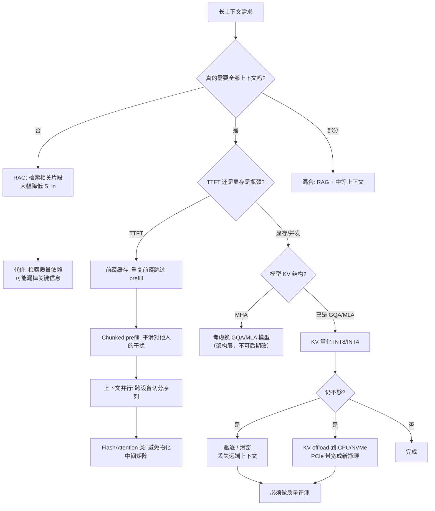

# 长上下文推理

> 位置：[InferenceAtlas](../../INDEX.md) > [模块 02](README.md) > 当前文档
> 信息截至：2026-07-29 ｜ 最后核验：2026-07-29 ｜ 内容版本：v0.1
> 时效性等级：中
> 相关主题：[注意力复杂度](03_attention_complexity_during_inference.md)｜[KV 压缩](08_kv_cache_compression_quantization_and_eviction.md)｜[上下文并行](../06_distributed_and_moe_inference/)

## 本章导读

长上下文是当前推理系统面临的最严峻的组合压力：**时延、显存、质量三方面同时恶化**，且三者的缓解手段互相冲突。

- **时延**：prefill 的注意力计算随输入长度平方增长，TTFT 迅速劣化；
- **显存**：KV 占用随长度线性增长，并发数被压到极低；
- **质量**：模型在长上下文上的实际有效利用能力，未必与其标称的上下文窗口相符。

第三点尤其容易被忽略：**一个模型标称支持 128K 上下文，不等于它在 128K 处的任务表现与 4K 处相同**。把标称窗口当作有效能力，是产品设计中的常见错误。

本章系统梳理三重压力的机制与缓解路径，并给出长上下文服务的决策树。

## 学习目标

读完本章后，读者应能够：

1. 分别量化长上下文对 TTFT、显存、并发的影响；
2. 说明标称上下文窗口与有效上下文能力的区别；
3. 在给定约束下选择合适的长上下文技术组合；
4. 判断何时应当用 RAG 替代长上下文，何时不应。

## 核心结论

- **长上下文的三重压力互相冲突**：降 TTFT 要更多算力，降显存要压缩 KV（可能损质量），保质量又限制了压缩幅度。
- **可行边界 $B \times S \le$ 常数** 意味着上下文翻倍则并发减半——**长上下文服务的单请求成本远高于短上下文**。
- **标称窗口 ≠ 有效能力**。必须用与实际任务相符的评测确认模型在目标长度上的表现。
- **RAG 与长上下文不是替代关系而是互补**：RAG 降低输入长度但引入检索质量依赖；长上下文避免检索误差但成本高。

## 1. 问题定义、系统边界与工作负载

### 1.1 三重压力

| 维度 | 机制 | 随长度 $S$ |
|---|---|---|
| **TTFT** | prefill 注意力计算 | **平方**（叠加线性项） |
| **显存** | KV cache 占用 | 线性 |
| **并发** | 可行边界 $B \times S \le$ 常数 | **反比** |
| **TPOT** | decode 注意力访存 | 线性（进入 KV 主导区后显著） |
| **质量** | 模型对远端信息的有效利用 | 与训练与架构相关，非单调 |

### 1.2 标称窗口与有效能力

**标称窗口**：模型配置允许的最大 token 数，由位置编码与训练配置决定。

**有效能力**：模型在给定长度上**实际能可靠利用信息**的程度。

二者可能存在显著差距，原因包括：训练数据中长样本的比例、位置编码外推的行为、注意力在长序列上的分布特性。

**工程含义**：产品上承诺"支持 128K 上下文"之前，必须在**与实际任务相符的评测**上验证该长度的表现。用通用长文本评测代替业务评测，或直接采信标称值，都会导致上线后的质量问题。

> 具体模型在不同长度上的质量表现需引用官方技术报告或独立评测，本库不给出无来源的判断。`待核实`

## 2. 原理、数学与性能模型

### 2.1 TTFT 的增长

由 [第 3 章](03_attention_complexity_during_inference.md)，prefill 计算量：

$$
C_{prefill} \approx \underbrace{\alpha \cdot S_{in}}_{\text{投影+MLP，线性}} + \underbrace{\beta \cdot S_{in}^2}_{\text{注意力，平方}}
$$

**增长倍数**（长度从 $S_1$ 到 $S_2 = k S_1$）：

$$
\frac{C(S_2)}{C(S_1)} = \frac{\alpha k S_1 + \beta k^2 S_1^2}{\alpha S_1 + \beta S_1^2}
$$

- 短序列（线性项主导）：约 $k$ 倍；
- 长序列（平方项主导）：约 $k^2$ 倍。

**实用结论**：**输入长度翻倍时，TTFT 增长在 2 倍到 4 倍之间**，越长越接近 4 倍。按线性外推会严重低估。

### 2.2 并发的塌陷

由 [第 5 章](05_kv_cache_capacity_and_memory_models.md)：

$$
B_{max} = \frac{M_{KV}^{budget}}{S \times m_{tok}}
$$

**上下文翻倍 → 并发减半**。这是一个刚性关系，无法通过调度优化绕过。

**成本含义**：单位时间内，一台机器服务长上下文请求的数量远少于短上下文请求。因此**长上下文请求的单请求成本显著更高**——这是长上下文 API 通常单独计价或有额外限制的技术依据。

### 2.3 进入 KV 主导区

由 [第 3 章 2.3 节](03_attention_complexity_during_inference.md)，$B \times S$ 超过临界值后，decode 的带宽消耗由 KV 主导。

**长上下文场景几乎必然处于 KV 主导区**（因为 $S$ 很大）。因此：

- 增大 batch 对吞吐的提升迅速饱和；
- 优化重点必须是 KV 侧（压缩、GQA/MLA、驱逐），而非权重侧；
- 权重量化的边际收益下降。

**这解释了一个常见困惑**：为什么在短上下文上效果显著的优化（如增大 batch、权重量化），在长上下文上收益有限。

## 3. 实现机制与系统设计

### 3.1 长上下文决策树

**图展示什么**：长上下文需求的完整决策路径，含 RAG 分流、TTFT 侧与显存侧两条独立支线。

**核心瓶颈在哪**：最上面的 `真的需要全部上下文吗?` 是收益最大的节点。用 RAG 把 $S_{in}$ 降一个数量级，其效果超过下游所有技术优化的总和。**跳过这个问题直接做技术优化，是长上下文项目中最常见的次优选择。**

**图中的 trade-off**：右下角 `驱逐/滑窗` 与 `KV offload` 是最后手段，代价分别是丢失信息与 PCIe 瓶颈；左侧 RAG 的代价是检索质量依赖。中间的 `换 GQA/MLA 模型` 收益大但属于架构层决策，无法在现有部署上实施。

**面试如何引用**：被问到"如何为长上下文 RAG 设计 KV cache"时，先走这棵树说明你会先质疑需求（是否真需要全上下文），再分 TTFT/显存两条线展开。直接跳到"用 KV 量化"会显得缺乏系统视角。

### 3.2 RAG 与长上下文的关系

**不是替代关系，而是不同的错误模式**：

| 方案 | 优势 | 失败模式 |
|---|---|---|
| **长上下文** | 无检索误差，模型看到全部信息 | 成本高、TTFT 长、远端信息可能被忽略 |
| **RAG** | 成本低、TTFT 短、可扩展到超大语料 | 检索漏召回则信息缺失、片段边界破坏语义 |
| **混合** | 检索后放入中等长度上下文 | 需同时调优两侧 |

**选择判据**：

- 语料远大于任何上下文窗口 → 必须 RAG；
- 信息分散且需要全局推理 → 倾向长上下文；
- 对检索误差零容忍（如合规审查） → 倾向长上下文；
- 成本敏感且信息定位性强 → 倾向 RAG；
- 多数生产场景 → 混合。

### 3.3 技术手段汇总

| 手段 | 作用 | 层次 | 质量代价 |
|---|---|---|---|
| RAG | 降低 $S_{in}$ | 应用层 | 检索误差 |
| 前缀缓存 | 跳过重复 prefill | 服务层 | 无 |
| Chunked prefill | 平滑干扰 | 调度层 | 无（长请求 TTFT 略升） |
| FlashAttention 类 | 避免物化中间矩阵 | Kernel 层 | **无** |
| 上下文并行 | 跨设备切分序列 | 分布式层 | 无（增通信） |
| GQA / MLA | 减小 $m_{tok}$ | **架构层** | 小（需预训练决定） |
| KV 量化 | 减小 $b_{kv}$ | 运行时层 | 小到中，需评测 |
| 滑窗 | 限制有效 $S$ | 架构/运行时 | **丢失远端** |
| 驱逐 | 减小有效 $S$ | 运行时层 | **丢失被驱逐部分** |
| KV offload | 突破显存容量 | 运行时层 | 无质量代价，但时延上升 |

**实施顺序**：无质量代价的先做（FlashAttention、前缀缓存、chunked prefill、上下文并行），有代价的后做且必须评测。

## 4. 性能、成本、能耗与可靠性 trade-off

| 目标 | 手段 | 冲突 |
|---|---|---|
| 降 TTFT | 更多算力、上下文并行 | 成本上升 |
| 提高并发 | KV 压缩、驱逐 | 可能损质量 |
| 保质量 | 不压缩、不驱逐 | 并发极低、成本高 |
| 降成本 | RAG 缩短输入 | 检索误差风险 |

**核心张力**：长上下文的三重压力无法同时完全缓解。**产品必须显式选择在哪里让步**——是接受更高成本、更长时延，还是接受质量上的某种妥协。回避这个选择的结果通常是三者都不达标。

**定价含义**：由于长上下文请求的单请求成本显著更高（并发反比关系），按 token 数线性计价会低估长请求的真实成本。这是长上下文 API 常有额外定价结构或速率限制的原因。

## 5. benchmark、真实案例或公开部署案例

| 公开结论 | 来源 |
|---|---|
| 自注意力对序列长度为平方复杂度 | [Attention Is All You Need, NeurIPS 2017](https://arxiv.org/abs/1706.03762) |
| 注意力的 HBM 访问是长序列瓶颈；tiling 可避免物化 $[S,S]$ 矩阵，数学上精确等价 | [FlashAttention, NeurIPS 2022](https://arxiv.org/abs/2205.14135) |
| 分页 KV 管理提高显存有效利用率，直接影响长上下文的可并发数 | [PagedAttention, SOSP 2023](https://arxiv.org/abs/2309.06180) |

> 位置编码外推、长上下文质量评测、稀疏/滑窗注意力的具体效果，将在 [模块 13](../13_research_papers_and_technical_reports/) 逐篇核验后补入。本章不引用未核验的论文数字。`待核实`

## 6. 设计决策框架

1. **先质疑需求**：是否真的需要全部上下文？能否用 RAG 或摘要降低输入长度？
2. **验证有效能力**：在**业务任务**上评测模型在目标长度的表现，不采信标称窗口；
3. **确定瓶颈**：TTFT 还是显存/并发（用六段分解与 KV 占用率）；
4. **TTFT 线**：前缀缓存 → chunked prefill → FlashAttention 类 → 上下文并行；
5. **显存线**：核查模型 KV 结构 → KV 量化 → （最后）驱逐/滑窗/offload；
6. **每个有损手段都做质量评测**，评测集必须包含长依赖任务；
7. **重新核算单请求成本**，确认定价或配额策略与成本结构一致；
8. 设定上下文长度上限与超限时的行为（截断？拒绝？降级到 RAG？）。

## 7. 常见失败模式与排查路径

| 失败模式 | 表现 | 根因 | 纠正 |
|---|---|---|---|
| 按线性外推 TTFT | 长输入下严重超时 | 忽略平方项 | 按 2–4 倍预期 |
| 采信标称上下文窗口 | 长文档任务质量差 | 标称 ≠ 有效 | 业务任务上评测 |
| 长上下文按 token 线性计价 | 长请求亏损 | 忽略并发反比 | 单独定价或限流 |
| 长请求挤占短请求 | 短请求 P99 恶化 | 未隔离 | 按长度分池 |
| 长上下文下继续加 batch | 吞吐不提升 | 已在 KV 主导区 | 转向 KV 优化 |
| 直接上驱逐/滑窗 | 质量下降未被发现 | 未做长依赖评测 | 评测集含长依赖任务 |
| KV offload 后 TPOT 恶化 | 时延不可接受 | PCIe 带宽瓶颈 | 核算迁移带宽 |
| 跳过 RAG 直接做长上下文 | 成本远超预期 | 未质疑需求 | 先评估 RAG 可行性 |

## 8. 关联面试主题

1. **长上下文对 TTFT、显存、并发的定量影响** → 本章 2.1–2.2
2. **如何为长上下文 RAG 设计 KV cache** → 本章 3.1、3.2
3. **标称上下文窗口与有效能力的区别** → 本章 1.2
4. **为什么长上下文下增大 batch 收益有限** → 本章 2.3
5. **长上下文的技术手段与实施顺序** → 本章 3.3

## 9. 小结

长上下文同时施加时延、显存、质量三重压力：TTFT 因注意力平方项而超线性增长（长度翻倍约增 2–4 倍），并发因可行边界 $B\times S\le$ 常数而与长度成反比，而模型的有效上下文能力未必与标称窗口相符。长上下文场景几乎必然处于 KV 主导区，因此增大 batch 与权重量化的收益有限，优化重点必须在 KV 侧。缓解手段按质量代价分层：FlashAttention、前缀缓存、chunked prefill、上下文并行无损；GQA/MLA 属架构层需预训练决定；KV 量化、驱逐、滑窗有损且必须评测。收益最大的一步往往不是技术优化，而是先质疑"是否真的需要全部上下文"——RAG 把输入降一个数量级的效果超过下游所有优化之和。并发反比关系还意味着长上下文请求的单请求成本显著更高，按 token 线性计价会低估其真实成本。

## 关键术语

| 中文术语 | 英文 | 定义 | 单位/口径 | 关联文档 |
|---|---|---|---|---|
| 标称上下文窗口 | nominal context window | 模型配置允许的最大 token 数 | token | 本章 1.2 |
| 有效上下文能力 | effective context capability | 模型实际能可靠利用信息的长度范围 | token | 本章 1.2 |
| 上下文并行 | context parallel | 沿序列维度切分到多设备 | — | [模块 06](../06_distributed_and_moe_inference/) |
| 三重压力 | triple pressure | 长上下文对时延、显存、质量的同时压力 | — | 本章 1.1 |

## 延伸阅读

- [08 KV 压缩、量化与驱逐](08_kv_cache_compression_quantization_and_eviction.md) —— 显存线手段的展开
- [模块 06：上下文并行](../06_distributed_and_moe_inference/) —— TTFT 线的分布式手段
- [模块 03：前缀缓存](../03_serving_engines_and_scheduling/) —— 服务层手段

## 主要来源

| # | 来源 | 类型 | 披露等级 | 核验日期 |
|---:|---|---|---|---|
| 1 | [Attention Is All You Need (NeurIPS 2017)](https://arxiv.org/abs/1706.03762) | 会议论文 | 独立可复现实验 | 2026-07-29 |
| 2 | [FlashAttention (NeurIPS 2022)](https://arxiv.org/abs/2205.14135) | 会议论文 | 独立可复现实验 | 2026-07-29 |
| 3 | [PagedAttention (SOSP 2023)](https://arxiv.org/abs/2309.06180) | 会议论文 | 独立可复现实验 | 2026-07-29 |

> **说明**：关于「标称窗口与有效能力存在差距」的论断，本库表述为**方向性判断并要求读者自行评测**，未引用具体模型的评测数字；相关文献将在模块 13 核验后补入。

## 更新记录

| 日期 | 版本 | 变更 | 核验人 |
|---|---|---|---|
| 2026-07-29 | v0.1 | 初稿 | — |
