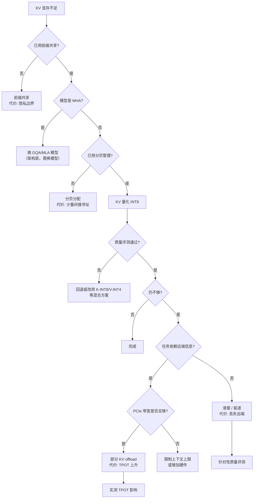

# KV Cache 压缩、量化、驱逐与卸载

> 位置：[InferenceAtlas](../../INDEX.md) > [模块 02](README.md) > 当前文档
> 信息截至：2026-07-29 ｜ 最后核验：2026-07-29 ｜ 内容版本：v0.1
> 时效性等级：中
> 相关主题：[容量模型](05_kv_cache_capacity_and_memory_models.md)｜[长上下文](07_long_context_inference.md)｜[量化](../04_compilers_runtimes_and_kernels/)

## 本章导读

当架构层（GQA/MLA）的选择已经定死、而显存仍然不够时，剩下的手段都作用在**运行时**：减少每元素字节数（量化）、减少缓存的 token 数（驱逐、滑窗）、或把数据挪到显存之外（offload）。

这三类手段的共同特征是**都有代价**，且代价的性质不同：量化损失数值精度，驱逐损失信息，offload 损失时延。因此本章的组织原则是把每种手段的**代价明确写出来**，而不是只讲收益。

一个必须建立的纪律：**任何有损手段上线前都必须做质量评测，且评测集必须包含依赖被牺牲信息的任务**。用通用评测检验滑窗注意力，几乎必然通不过检验——因为通用评测里很少有真正需要远端信息的样本。

## 学习目标

读完本章后，读者应能够：

1. 说明三类手段各自作用于 KV 公式的哪个因子，以及代价的性质；
2. 设计一个能真正检出质量损失的评测方案；
3. 判断 KV offload 在给定 PCIe 带宽下是否可行；
4. 按代价从低到高排出手段的实施顺序。

## 核心结论

- **三类手段作用于不同因子**：量化改 $b_{kv}$，驱逐/滑窗改有效 $S$，offload 改"显存中的" $M_{KV}$。
- **代价性质不同**：量化损精度、驱逐损信息、offload 损时延。**没有免费的容量。**
- **offload 的可行性由 PCIe 带宽决定**，而非显存容量。若每步需搬运的 KV 超过 PCIe 能力，TPOT 会显著恶化。
- **质量评测必须针对性设计**。通用评测检不出驱逐与滑窗的损失，因为其样本很少依赖远端信息。

## 1. 问题定义、系统边界与工作负载

### 1.1 三类手段的作用位置

回顾 $M_{KV} = 2 L B S H_{KV} D_h b_{kv}$：

| 类别 | 作用因子 | 具体手段 | 代价性质 |
|---|---|---|---|
| **压缩/量化** | $b_{kv}$ | INT8/INT4 KV、低秩投影 | 数值精度 |
| **减少 token** | 有效 $S$ | 驱逐、滑窗、稀疏保留、摘要 | **信息丢失** |
| **层级化** | 显存中的部分 | CPU / NVMe / 远端内存 offload | **时延** |
| （架构层，见第 6 章） | $H_{KV}$ | GQA / MQA / MLA | 需预训练决定 |
| （共享，见第 4 章） | 有效 $B$ | 前缀共享 | 隐私边界 |

## 2. 原理、数学与性能模型

### 2.1 KV 量化

**机制**：把 K/V 张量从 BF16/FP16 降到 INT8 或 INT4 存储，读取时反量化。

**收益**：$b_{kv}$ 减半（INT8）或降到四分之一（INT4），因此：

- KV 显存占用同比例下降 → 并发上限同比例上升；
- KV 访存带宽同比例下降 → decode 在 KV 主导区提速；
- 注意力算术强度 $2H/(H_{KV}b_{kv})$ 同比例上升。

**代价**：

| 代价 | 说明 |
|---|---|
| 数值精度 | K 与 V 的量化误差通过注意力传播到输出 |
| 量化/反量化开销 | 每次读取需反量化，增加计算 |
| 实现复杂度 | 需要支持量化 KV 的注意力 kernel |

**K 与 V 的不对称性**：二者在注意力中的作用不同——K 参与 softmax 前的打分（对误差更敏感，因为 softmax 会放大差异），V 参与加权求和（误差被平均，相对不敏感）。因此**对 K 和 V 采用不同精度是一种常见的工程做法**（如 K 用 INT8、V 用 INT4）。

> 具体的质量损失幅度依赖模型、任务与量化方案，必须实测。本库不给出无来源的通用数字。`待核实`

### 2.2 驱逐与滑窗

**滑窗注意力**：只保留最近 $W$ 个 token 的 KV，$S$ 被限制为常数。

$$
M_{KV} \to 2 L B \min(S, W) H_{KV} D_h b_{kv}
$$

**这改变了复杂度的阶**：显存占用从随长度线性增长变为常数。收益极大，代价是**完全丢失窗口外的信息**。

**驱逐（eviction）**：按某种重要性准则移除部分 token 的 KV，保留其余。

**共同代价**：被移除的信息无法恢复（除非重算）。因此：

- 若任务依赖远端信息 → 质量显著下降；
- 若任务只依赖局部 → 几乎无影响。

**这就是为什么评测必须针对性设计**：通用评测集中真正依赖远端信息的样本比例很低，因此即使滑窗丢掉了大量上下文，通用评测分数也可能几乎不变——**评测通过不代表方案可用**。

**有效的评测设计**：

| 评测类型 | 能否检出滑窗/驱逐的损失 |
|---|---|
| 通用能力评测 | **通常不能** |
| 长文档问答（答案在文档开头） | 能 |
| 需要跨全文聚合的任务 | 能 |
| 指定位置信息检索任务 | 能 |
| **业务真实样本** | **最可靠** |

### 2.3 Offload：可行性由带宽决定

把 KV 放到 CPU 内存或 NVMe，需要时搬回显存。

**关键判据不是容量而是带宽**。设每步 decode 需要从主机搬运的 KV 字节数为 $M_{move}$，链路带宽为 $BW_{link}$（PCIe 或 CXL）：

$$
t_{move} = \frac{M_{move}}{BW_{link}}
$$

**若 $t_{move}$ 超过原本的每步计算时间，TPOT 就被搬运主导**，offload 得不偿失。

**因此 offload 的适用条件**：

| 条件 | 说明 |
|---|---|
| 只搬运**部分** KV | 全量搬运几乎必然不可行 |
| 有可预测的访问模式 | 便于预取，隐藏延迟 |
| 能与计算重叠 | 用异步传输掩盖搬运时间 |
| 可容忍更高 TPOT | 批量场景比交互式更适合 |

**一个重要的对比**：显存带宽与 PCIe 带宽通常相差一个数量级以上。这个差距决定了 offload 无法成为长上下文的通用解——它更适合作为**溢出保护**（防止 OOM 导致请求失败）而非**常规容量扩展**。

> 具体的 PCIe/CXL 带宽数值与显存带宽的比值，需引用官方规格，将在 [模块 07](../07_hardware_and_server_architecture/)、[模块 08](../08_networking_and_interconnect/) 中附来源。`待核实`

## 3. 实现机制与系统设计

### 3.1 手段选择与实施顺序

**图展示什么**：KV 显存不足时的完整决策路径，按代价从低到高排列的手段顺序。

**核心瓶颈在哪**：两个分支点决定了后续路径。`任务依赖远端信息?` 决定能否用滑窗/驱逐——这是收益最大但代价也最大的一类；`PCIe 带宽是否足够?` 决定 offload 可行性，这个判据常被误认为是容量问题。

**图中的 trade-off**：路径越往下代价越高：前缀共享（隐私）→ 分页（微小开销）→ 量化（精度）→ 滑窗/驱逐（信息）→ offload（时延）→ 限制上下文（功能）。**每一步都应先穷尽上一步。**

**面试如何引用**：被问到"KV 显存不够怎么办"时，按这棵树逐层给出，并明确每层的代价。能指出"offload 的判据是带宽不是容量"通常是加分点，因为这是一个常见误解。

### 3.2 各手段汇总对比

| 手段 | 作用因子 | 典型收益 | 代价 | 可逆性 |
|---|---|---|---|---|
| 前缀共享 | 有效 $B$ | 依赖重复率 | 隐私边界 | 可逆 |
| 分页分配 | 消除碎片 | 显著 | 微小开销 | 可逆 |
| KV 量化 INT8 | $b_{kv}$ ÷2 | 2× 并发 | 精度，需评测 | 可逆（改配置） |
| KV 量化 INT4 | $b_{kv}$ ÷4 | 4× 并发 | 精度，风险更高 | 可逆 |
| K/V 混合精度 | $b_{kv}$ | 介于两者 | 平衡精度与压缩 | 可逆 |
| 滑窗 | 有效 $S$ | **极大** | **丢失远端** | 可逆但已丢的需重算 |
| 驱逐 | 有效 $S$ | 可控 | 丢失被驱逐部分 | 需重算恢复 |
| CPU offload | 显存中的量 | 大 | **TPOT 上升** | 可逆 |
| NVMe offload | 显存中的量 | 更大 | TPOT 显著上升 | 可逆 |
| 限制上下文上限 | $S$ | 确定 | **功能受限** | 可逆 |

### 3.3 质量评测设计

**最低要求**：

- [ ] 评测集包含**依赖被牺牲信息**的样本（如答案位于文档开头的长文档问答）
- [ ] 包含业务真实样本，而非仅公开评测集
- [ ] 对比基线为**未压缩**配置，而非另一个压缩配置
- [ ] 报告的是分布而非单一均值（部分样本可能严重退化）
- [ ] 长度覆盖到生产中的 P95 长度
- [ ] 若用混合精度，K 与 V 各自的方案都需单独消融

**常见评测缺陷**：只用短样本评测长上下文压缩方案——短样本下滑窗从未生效，因此必然"无损"。

## 4. 性能、成本、能耗与可靠性 trade-off

| 手段 | 显存 | TPOT | 质量 | 可靠性 |
|---|---|---|---|---|
| KV 量化 | ↓↓ | ↓（带宽减少） | ↓（需评测） | 中性 |
| 滑窗 | ↓↓↓ | ↓↓ | **↓↓（远端任务）** | 中性 |
| 驱逐 | ↓↓ | ↓ | ↓ | **驱逐后重算增加方差** |
| CPU offload | ↓↓↓ | **↑↑** | 无影响 | 增加失败点 |
| 前缀共享 | ↓ | ↓ | 无影响 | 引入隐私风险 |

**注意驱逐一行的可靠性列**：驱逐后若请求需要继续，必须重算，这**增大服务时间方差**，进而通过 $(1+C_S^2)$ 放大排队时延（见 [模块 01 第 3 章](../01_foundations_and_metrics/03_queueing_theory_for_inference.md)）。因此激进驱逐可能在缓解显存的同时恶化尾时延——这是一个容易被忽略的二阶效应。

## 5. benchmark、真实案例或公开部署案例

| 公开结论 | 来源 |
|---|---|
| 分页管理消除 KV 碎片，提高显存有效利用率并支持跨请求共享 | [PagedAttention, SOSP 2023](https://arxiv.org/abs/2309.06180) |
| 减少 HBM 访问是长序列注意力的关键优化方向 | [FlashAttention, NeurIPS 2022](https://arxiv.org/abs/2205.14135) |
| vLLM、SGLang 等引擎提供 KV 量化与前缀缓存能力，具体格式矩阵随版本变化 | [vLLM](https://github.com/vllm-project/vllm)、[SGLang](https://github.com/sgl-project/sglang)，`开源代码/配置披露` |

> KV 量化、驱逐策略（如基于注意力分数的重要性准则）的具体论文与实测效果，将在 [模块 13](../13_research_papers_and_technical_reports/) 逐篇核验后补入 [`papers.csv`](../../data/papers.csv) 与 [`techniques.csv`](../../data/techniques.csv)。本章不引用未核验的具体数字。`待核实`

## 6. 设计决策框架

1. 确认当前瓶颈确实是 KV 显存（查 KV 占用率与抢占率，而非仅看总显存）；
2. 按第 3.1 节决策树逐层推进，**先穷尽低代价手段**；
3. 上量化前，准备针对性评测集（含长依赖样本与业务样本）；
4. 量化后评测，未通过则尝试 K/V 混合精度而非直接放弃；
5. 考虑滑窗/驱逐前，**明确回答"任务是否依赖远端信息"**；
6. 考虑 offload 前，**先算 PCIe 带宽是否够**，而非只看容量；
7. 若使用驱逐，设置频率上限以避免方差恶化；
8. 监控：KV 占用率、抢占率、（若 offload）搬运带宽占用；
9. 记录每项决策的代价与评测依据，留档备查。

## 7. 常见失败模式与排查路径

| 失败模式 | 表现 | 根因 | 纠正 |
|---|---|---|---|
| 用通用评测检验滑窗 | 评测通过但上线后质量差 | 评测集不含长依赖样本 | 针对性设计评测 |
| 用短样本评测长上下文压缩 | 必然"无损" | 滑窗未生效 | 覆盖 P95 长度 |
| offload 按容量判断可行性 | TPOT 严重恶化 | 判据应是带宽 | 先算 $M_{move}/BW_{link}$ |
| 激进驱逐 | 显存缓解但 P99 恶化 | 重算增大方差 | 限制驱逐频率 |
| K 和 V 用同一精度 | 质量损失大于必要 | 二者敏感度不同 | 尝试混合精度 |
| 只报告均值质量 | 部分样本严重退化未被发现 | 均值掩盖分布 | 报告分位数 |
| 跳过前缀共享直接量化 | 付出精度代价却有更省的选项 | 未按代价排序 | 按决策树顺序 |
| 量化后未更新容量规划 | 未享受到并发提升 | 配置未同步 | 重算 $B_{max}$ |

## 8. 关联面试主题

1. **KV 显存不足时有哪些手段，各自代价** → 本章 3.1–3.2
2. **KV 量化中 K 与 V 为何敏感度不同** → 本章 2.1
3. **如何设计能检出滑窗/驱逐损失的评测** → 本章 2.2、3.3
4. **KV offload 的可行性判据是什么** → 本章 2.3
5. **激进驱逐为何可能恶化尾时延** → 本章 4

## 9. 小结

当架构层选择已定而显存仍不足时，运行时手段分三类：量化改 $b_{kv}$、驱逐与滑窗改有效 $S$、offload 改"显存中的"部分。三者代价性质不同——分别是数值精度、信息丢失、时延——**没有免费的容量**。K 与 V 在注意力中的作用不对称（K 经 softmax 对误差更敏感），因此混合精度是一种有效的中间方案。滑窗与驱逐的收益最大但代价最重，且**通用评测检不出其损失**，必须针对性设计包含长依赖样本的评测集。Offload 的可行性由 PCIe 带宽而非显存容量决定，因显存带宽与 PCIe 带宽差距显著，它更适合作为溢出保护而非常规容量扩展。驱逐还有一个易被忽略的二阶效应：重算增大服务时间方差，可能在缓解显存的同时恶化尾时延。

## 关键术语

| 中文术语 | 英文 | 定义 | 单位/口径 | 关联文档 |
|---|---|---|---|---|
| KV 量化 | KV quantization | 降低 KV cache 每元素字节数 | bit | 本章 2.1 |
| 滑窗注意力 | sliding-window attention | 只保留最近 $W$ 个 token 的 KV | token | 本章 2.2 |
| 驱逐 | eviction | 按重要性准则移除部分 KV | — | 本章 2.2 |
| 卸载 | offload | 把 KV 移到 CPU/NVMe/远端内存 | — | 本章 2.3 |
| 混合精度 KV | mixed-precision KV | K 与 V 采用不同量化精度 | — | 本章 2.1 |
| 针对性评测 | targeted evaluation | 专门包含依赖被牺牲信息样本的评测 | — | 本章 3.3 |

## 延伸阅读

- [05 KV 容量模型](05_kv_cache_capacity_and_memory_models.md) —— 各因子的定量关系
- [06 GQA/MQA/MLA](06_gqa_mqa_mla_and_kv_reduction.md) —— 架构层手段
- [模块 04：量化](../04_compilers_runtimes_and_kernels/) —— 量化的通用原理与 kernel 实现

## 主要来源

| # | 来源 | 类型 | 披露等级 | 核验日期 |
|---:|---|---|---|---|
| 1 | [PagedAttention (SOSP 2023)](https://arxiv.org/abs/2309.06180) | 会议论文 | 独立可复现实验 | 2026-07-29 |
| 2 | [FlashAttention (NeurIPS 2022)](https://arxiv.org/abs/2205.14135) | 会议论文 | 独立可复现实验 | 2026-07-29 |
| 3 | [vLLM 官方仓库](https://github.com/vllm-project/vllm) | 开源项目 | 开源代码/配置披露 | 2026-07-29 |
| 4 | [SGLang 官方仓库](https://github.com/sgl-project/sglang) | 开源项目 | 开源代码/配置披露 | 2026-07-29 |

> **说明**：本章关于 K/V 敏感度不对称、量化质量损失幅度、驱逐策略效果的表述均为**方向性判断并要求实测**，未引用未核验的具体数字。相关论文将在模块 13 逐篇核验后补入。

## 更新记录

| 日期 | 版本 | 变更 | 核验人 |
|---|---|---|---|
| 2026-07-29 | v0.1 | 初稿 | — |
