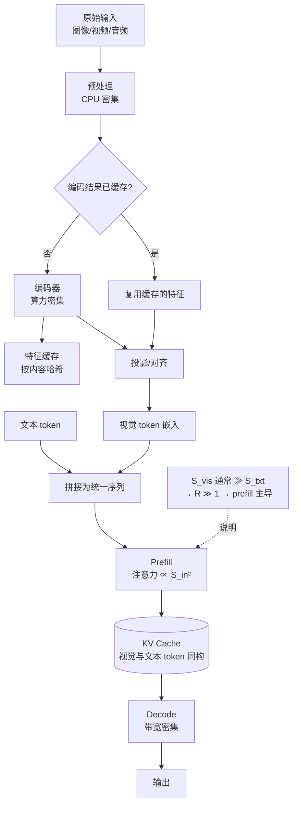

# 多模态推理

> 位置：[InferenceAtlas](../../INDEX.md) > [模块 02](README.md) > 当前文档
> 信息截至：2026-07-29 ｜ 最后核验：2026-07-29 ｜ 内容版本：v0.1
> 时效性等级：中
> 相关主题：[prefill vs decode](02_prefill_vs_decode.md)｜[长上下文](07_long_context_inference.md)｜[Workload 分类](../01_foundations_and_metrics/01_inference_workload_taxonomy.md)

## 本章导读

从推理系统的角度看，多模态输入（图像、视频、音频）的本质是**一个把非文本内容转换成大量 token 的前置阶段**。一旦转换完成，后续流程与纯文本推理基本一致。

这个视角带来的关键认识是：**多模态推理的主要压力落在 prefill 侧**。视觉 token 数量通常远超同等信息量的文本 token，因此多模态请求天然是"长输入短输出"型（$R \gg 1$），其瓶颈画像与文档理解类似而非与对话类似。

本章说明多模态输入如何转化为 token、由此产生的系统压力，以及与纯文本场景在缓存、批处理、调度上的差异。

## 学习目标

读完本章后，读者应能够：

1. 说明多模态输入到 token 的转换路径及其对 prefill 的影响；
2. 解释为什么多模态推理通常是 prefill 主导；
3. 识别多模态特有的缓存机会与障碍；
4. 说明编码器与语言模型共存带来的调度与部署问题。

## 核心结论

- **多模态的主要成本在 prefill**：视觉/音频 token 数量大，使 $R = S_{in}/S_{out} \gg 1$。
- **额外引入了编码器阶段**，它与语言模型的资源画像不同，构成一个额外的流水线级。
- **视觉 token 的 KV 与文本 token 的 KV 结构相同**，因此 KV 管理手段可直接复用。
- **缓存机会不同**：相同图像的重复请求可缓存编码结果，但图像通常不像系统提示那样高频重复，因此前缀缓存收益结构与文本场景不同。

## 1. 问题定义、系统边界与工作负载

### 1.1 转换路径

典型的多模态推理流程：

| 阶段 | 输入 | 输出 | 资源画像 |
|---|---|---|---|
| 1. 预处理 | 原始图像/音频/视频 | 归一化张量 | CPU 密集 |
| 2. 编码 | 张量 | 视觉/音频特征 | **算力密集（独立模型）** |
| 3. 投影/对齐 | 特征 | 语言模型可接受的 token 嵌入 | 轻 |
| 4. 拼接 | 视觉 token + 文本 token | 统一序列 | — |
| 5. Prefill | 统一序列 | 首 token + KV cache | **算力密集** |
| 6. Decode | — | 输出 token | 带宽密集 |

**关键观察**：阶段 2 是纯文本推理中不存在的额外流水线级。它有自己的模型权重、自己的批处理需求、自己的显存占用。

### 1.2 Token 数量的量级

不同模态转换为 token 的数量差异很大，取决于具体模型的编码策略（如图像被切分为多少 patch、视频采样多少帧、音频的帧率与窗口）。

**共性方向**：视觉与视频输入产生的 token 数通常**远多于**描述同一内容的文本。视频尤其显著，因为它在时间维度上叠加。

> 具体模型的每图像/每秒视频/每秒音频 token 数，须引用官方模型卡或技术报告，将录入 [`models.csv`](../../data/models.csv)。本库不给出无来源的通用数值。`待核实`

## 2. 原理、数学与性能模型

### 2.1 为什么是 prefill 主导

设视觉 token 数 $S_{vis}$，文本 token 数 $S_{txt}$，输出 $S_{out}$：

$$
R = \frac{S_{vis} + S_{txt}}{S_{out}}
$$

由于 $S_{vis}$ 通常很大而多模态任务（描述、问答、OCR）的输出通常不长，$R \gg 1$。

**由 [模块 01 第 1 章](../01_foundations_and_metrics/01_inference_workload_taxonomy.md) 的判据**：$R \gg 1$ → prefill 主导 → compute-bound → 优化重点是算力、chunked prefill、前缀缓存、上下文并行。

**这与对话场景的优化方向几乎相反**（对话是 decode 主导，重点在批处理与带宽）。因此**同一套为对话优化的配置服务多模态请求时，往往表现不佳**。

### 2.2 注意力的平方项

由 [第 3 章](03_attention_complexity_during_inference.md)，prefill 注意力计算量与 $S_{in}^2$ 成正比。视觉 token 使 $S_{in}$ 大幅增加，因此：

- TTFT 增长显著；
- 注意力中间矩阵 $[B,H,S_{in},S_{in}]$ 的显存压力增大，tiling 类实现更为必要；
- 多图或视频输入时，这个平方项可能主导整个 prefill。

### 2.3 编码器阶段的资源画像

| 维度 | 编码器 | 语言模型 |
|---|---|---|
| 计算特征 | 通常是视觉骨干网络，compute-bound | prefill compute-bound / decode memory-bound |
| 批处理 | 按图像数批处理 | 按序列批处理 |
| 显存 | 独立权重 + 激活 | 权重 + KV cache |
| 与请求的关系 | 每图像一次 | 每请求一次 prefill + 多次 decode |

**部署上的两个选择**：

| 方案 | 优势 | 代价 |
|---|---|---|
| 编码器与语言模型共置 | 部署简单，无迁移开销 | 两者争抢同一加速器，批处理策略互相干扰 |
| 编码器独立部署 | 各自按画像配置与扩缩容 | 特征需通过网络传输，增加时延与复杂度 |

**这与 prefill/decode 分离是同一类问题**：当两个阶段的资源画像差异足够大、规模足够大时，分离有收益；否则共置更简单。判据也类似——先看规模与失配程度。

## 3. 实现机制与系统设计

### 3.1 多模态推理流水线

**图展示什么**：多模态推理的完整流水线，含编码器阶段、特征缓存机会，以及视觉 token 与文本 token 汇合后的统一处理。

**核心瓶颈在哪**：`Prefill 注意力 ∝ S_in²` 是主瓶颈——视觉 token 大幅推高 $S_{in}$，而注意力对它是平方关系。次要瓶颈是 `编码器`，它构成一个额外的流水线级，且与语言模型争抢资源。

**图中的 trade-off**：`编码结果已缓存?` 分支是主要的优化机会，但它依赖同一内容被重复请求——这在多轮对话中讨论同一图像时成立，在一次性上传场景中不成立。因此**特征缓存的收益高度依赖使用模式**，不能假设。

**面试如何引用**：被问到"多模态推理与文本推理有什么不同"时，用这张图指出两点：多了编码器这一流水线级，以及视觉 token 使系统从 decode 主导变为 prefill 主导。第二点是更有分量的回答。

### 3.2 缓存机会

| 缓存对象 | 命中条件 | 收益 | 适用场景 |
|---|---|---|---|
| **编码器输出特征** | 同一图像/音频再次出现 | 跳过整个编码阶段 | **多轮对话讨论同一图像** |
| 视觉 token 的 KV | 同一图像 + 同一前缀 | 跳过该部分 prefill | 同上 |
| 系统提示的 KV | 系统提示固定 | 与文本场景相同 | 通用 |

**与纯文本场景的差异**：文本场景的前缀缓存主要命中在**系统提示**（高频重复）；多模态场景的最大机会在**多轮对话中重复引用的图像**。若产品形态是一次性上传+单轮问答，则特征缓存基本无收益。

**实现要点**：特征缓存需要一个内容标识（如图像哈希）作为键。这引入与前缀缓存相同的隐私考量——**跨租户共享图像特征缓存会泄露"某图像是否被他人上传过"这一信息**，作用域应默认限于租户内。

### 3.3 调度考量

多模态请求与纯文本请求混合时：

| 问题 | 机制 | 缓解 |
|---|---|---|
| 长 prefill 阻塞 | 视觉 token 使 prefill 很长 | chunked prefill |
| 批内长度极不齐 | 多模态请求远长于文本请求 | 长度感知组批或分池 |
| 编码器与 LM 争抢 | 共置时互相干扰 | 分离部署或时间片隔离 |
| KV 占用大 | $S_{in}$ 大导致 KV 大 | 与长上下文相同的手段 |

**建议**：当多模态与纯文本请求混合且量级相当时，**按 workload 分池通常优于统一调度**——二者的 $R$ 相差一个数量级以上，符合 [模块 01 第 1 章](../01_foundations_and_metrics/01_inference_workload_taxonomy.md) 给出的分池判据。

## 4. 性能、成本、能耗与可靠性 trade-off

| 决策 | 收益 | 代价 |
|---|---|---|
| 降低图像分辨率 | $S_{vis}$ 减少，prefill 变快 | 细节任务（如 OCR）质量下降 |
| 视频降采样帧率 | $S_{vis}$ 大幅减少 | 时序细节丢失 |
| 特征缓存 | 跳过编码 | 缓存空间 + 隐私边界 |
| 编码器独立部署 | 资源画像匹配 | 网络传输 + 复杂度 |
| 与文本请求分池 | 消除干扰 | 资源碎片化 |
| Chunked prefill | 平滑干扰 | 多模态请求自身 TTFT 上升 |

**成本结构提示**：多模态请求的输入 token 数远大于文本请求，因此**按输入 token 计价时，多模态请求的成本天然更高**。这在产品定价上需要显式体现，否则会出现类似长上下文的亏损问题（见 [第 7 章](07_long_context_inference.md)）。

## 5. benchmark、真实案例或公开部署案例

| 与本章相关的机制性结论 | 来源 |
|---|---|
| 自注意力对序列长度的平方复杂度（决定视觉 token 的代价结构） | [Attention Is All You Need, NeurIPS 2017](https://arxiv.org/abs/1706.03762) |
| 长序列注意力的 HBM 瓶颈与 tiling 缓解 | [FlashAttention, NeurIPS 2022](https://arxiv.org/abs/2205.14135) |
| 分页 KV 管理适用于任意来源的 token，包括视觉 token | [PagedAttention, SOSP 2023](https://arxiv.org/abs/2309.06180) |

> 具体多模态模型的编码策略、每图像 token 数、视频采样方式，须引用官方模型卡或技术报告，将录入 [`models.csv`](../../data/models.csv) 并标注 `modality` 字段。当前为空。`待核实`
>
> 多模态推理的专门系统优化（如视觉 token 剪枝、动态分辨率）的论文，将在 [模块 13](../13_research_papers_and_technical_reports/) 核验后补入。`待核实`

## 6. 设计决策框架

1. 从官方模型卡确认编码策略与每单位输入的 token 数（未公开则标 `未公开`）；
2. 估算典型请求的 $S_{vis}$、$S_{txt}$、$S_{out}$，计算 $R$；
3. 确认是 prefill 主导（通常是），据此选择优化方向；
4. 评估产品形态是否支持特征缓存（多轮讨论同一图像 vs 一次性上传）；
5. 若可缓存，设计内容标识与**租户内**作用域；
6. 决定编码器共置还是分离（按规模与失配程度）；
7. 若与文本请求混合，评估是否分池；
8. 核算多模态请求的实际成本，确认定价结构与之匹配；
9. 若需降本，先评估分辨率/帧率下调对**业务任务**的质量影响。

## 7. 常见失败模式与排查路径

| 失败模式 | 表现 | 根因 | 纠正 |
|---|---|---|---|
| 用对话配置服务多模态 | TTFT 严重超标 | 优化方向相反（decode vs prefill） | 按 $R$ 重新配置 |
| 多模态请求阻塞文本请求 | 文本请求 P99 恶化 | 长 prefill 队头阻塞 | chunked prefill 或分池 |
| 假设特征缓存有高命中 | 收益远低于预期 | 产品是一次性上传 | 先测重复率 |
| 跨租户共享特征缓存 | 潜在信息泄露 | 作用域过宽 | 限于租户内 |
| 按 token 线性计价 | 多模态请求亏损 | 未反映 prefill 成本 | 单独定价 |
| 降分辨率未评测 | OCR 等任务质量下降 | 用通用评测代替业务评测 | 业务任务上评测 |
| 忽略编码器显存 | 部署时 OOM | 只算 LM 权重与 KV | 计入编码器权重与激活 |
| 视频未降采样 | $S_{vis}$ 爆炸 | 按原始帧率处理 | 按任务需求设采样策略 |

## 8. 关联面试主题

1. **多模态推理与纯文本推理的系统差异** → 本章 1.1、3.1
2. **为什么多模态通常是 prefill 主导** → 本章 2.1
3. **多模态特有的缓存机会与隐私考量** → 本章 3.2
4. **编码器共置还是分离部署** → 本章 2.3
5. **多模态与文本请求混合时的调度问题** → 本章 3.3

## 9. 小结

从推理系统的角度，多模态输入的本质是一个把非文本内容转换为大量 token 的前置阶段。视觉与视频 token 数量通常远超同等信息的文本，使 $R = S_{in}/S_{out} \gg 1$，因此**多模态推理是 prefill 主导、compute-bound**，其优化方向与对话场景（decode 主导）几乎相反——用对话配置服务多模态请求往往表现不佳。多模态还引入了编码器这一额外流水线级，其资源画像与语言模型不同，是否分离部署的判据与 prefill/decode 分离类似。视觉 token 的 KV 与文本 token 同构，因此 KV 管理手段可直接复用。缓存机会的结构与文本场景不同：文本主要命中系统提示，多模态的最大机会在多轮对话中重复引用的图像，因此收益高度依赖产品形态，不能假设。

## 关键术语

| 中文术语 | 英文 | 定义 | 单位/口径 | 关联文档 |
|---|---|---|---|---|
| 视觉 token | visual token | 图像/视频经编码与投影后进入语言模型的 token | 个 | 本章 1.1 |
| 编码器阶段 | encoder stage | 把非文本输入转为特征的独立模型阶段 | — | 本章 1.1 |
| 特征缓存 | feature cache | 缓存编码器输出以复用 | — | 本章 3.2 |
| 内容标识 | content key | 用于特征缓存查找的内容哈希 | — | 本章 3.2 |

## 延伸阅读

- [07 长上下文推理](07_long_context_inference.md) —— 多模态与长上下文共享大部分压力结构
- [模块 01 第 1 章：Workload 分类](../01_foundations_and_metrics/01_inference_workload_taxonomy.md) —— $R$ 判据与分池准则
- [模块 03：调度与前缀缓存](../03_serving_engines_and_scheduling/) —— 缓存与调度的工程实现

## 主要来源

| # | 来源 | 类型 | 披露等级 | 核验日期 |
|---:|---|---|---|---|
| 1 | [Attention Is All You Need (NeurIPS 2017)](https://arxiv.org/abs/1706.03762) | 会议论文 | 独立可复现实验 | 2026-07-29 |
| 2 | [FlashAttention (NeurIPS 2022)](https://arxiv.org/abs/2205.14135) | 会议论文 | 独立可复现实验 | 2026-07-29 |
| 3 | [PagedAttention (SOSP 2023)](https://arxiv.org/abs/2309.06180) | 会议论文 | 独立可复现实验 | 2026-07-29 |

> **说明**：本章刻意不给出任何多模态模型的具体 token 转换比例或编码策略数值——这些必须来自官方模型卡。本章的分析基于「视觉 token 数量通常远超同等信息的文本」这一方向性事实，以及注意力平方复杂度这一已核验结论。

## 更新记录

| 日期 | 版本 | 变更 | 核验人 |
|---|---|---|---|
| 2026-07-29 | v0.1 | 初稿 | — |
