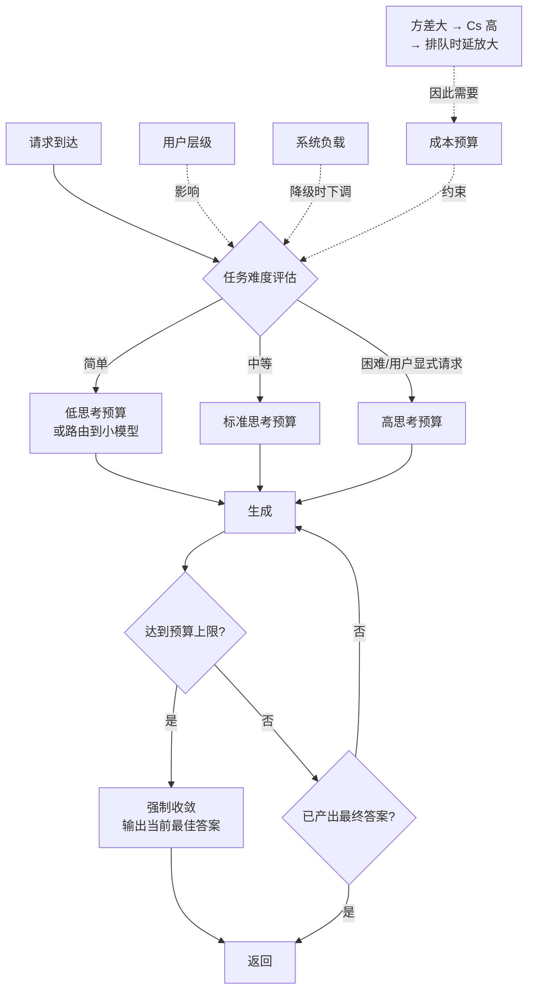

# Reasoning 工作负载与 Test-Time Compute

> 位置：[InferenceAtlas](../../INDEX.md) > [模块 02](README.md) > 当前文档
> 信息截至：2026-07-29 ｜ 最后核验：2026-07-29 ｜ 内容版本：v0.1
> 时效性等级：中
> 相关主题：[prefill vs decode](02_prefill_vs_decode.md)｜[解码算法](../05_decoding_and_generation_algorithms/)｜[成本建模](../01_foundations_and_metrics/06_cost_modeling_and_unit_economics.md)

## 本章导读

Reasoning 类工作负载对推理系统提出了一个新的问题：**输出长度不再由用户输入决定，而由模型行为决定**。一个短问题可能触发很长的推理过程，而这个长度事先不可知。

这打破了传统容量规划与成本预测的一个基本假设。在对话场景中，输出长度大致可预测，因此可以按分布规划；在 reasoning 场景中，同一个 prompt 在不同采样下的输出长度可能相差数倍，且随任务难度变化。

其系统后果是全面的：服务时间方差急剧增大（放大排队时延）、单请求成本不可预测、TTFT 不再是主要指标、"思考预算"成为必须显式治理的产品参数。

## 学习目标

读完本章后，读者应能够：

1. 说明 reasoning workload 与常规对话在四个参数上的差异；
2. 解释输出长度不可预测如何通过 $C_S$ 放大排队时延；
3. 设计一套 test-time compute 的治理机制（预算、分层、降级）；
4. 说明为什么 reasoning 的成本模型需要与常规请求分开。

## 核心结论

- **Reasoning 是极端的 decode 主导**（$R \ll 1$），瓶颈完全在带宽与总 token 数。
- **输出长度由模型行为决定，方差极大**，这通过 $(1+C_S^2)$ 显著放大排队时延，使系统对利用率更敏感。
- **成本与质量之间存在可调曲线**（更多 test-time compute → 更好结果 → 更高成本），这条曲线必须被显式治理，而非放任。
- **端到端时延取代 TTFT 成为主要指标**：用户等的是完整答案，首 token 早到但要等很久才结束，体验并不好。

## 1. 问题定义、系统边界与工作负载

### 1.1 Test-time compute 的形式

推理阶段额外投入计算的几种方式：

| 形式 | 机制 | token 成本 |
|---|---|---|
| **更长的单次生成** | 模型生成较长的中间推理过程再给出答案 | 线性于长度 |
| **自一致性** | 多次采样后取多数 | 线性于采样次数 |
| **搜索** | 生成多个候选路径并选择 | 视搜索宽度与深度 |
| **验证器** | 生成后由另一模型或规则检验，必要时重试 | 视重试率 |
| **工具调用** | 调用外部工具（检索、代码执行）并把结果放回上下文 | 上下文增长 + 多轮 |
| **多智能体** | 多个模型实例协作 | 数倍 |

**共同特征**：都用**更多 token**（因而更多时间与成本）换取**更好的结果**。差别在于 token 消耗的可预测性——单次长生成的方差最大，固定次数的自一致性方差最小。

### 1.2 四参数画像

| 参数 | Reasoning workload | 对比：对话 |
|---|---|---|
| 输入长度 $S_{in}$ | 短到中 | 短到中 |
| **输出长度 $S_{out}$** | **很长，且方差极大** | 中，方差中等 |
| $R = S_{in}/S_{out}$ | **≪ 1** | ≈ 1 |
| 到达模式 | 突发 | 突发 |
| 状态复用 | 低（每次推理路径不同） | 中（多轮前缀） |
| **主导指标** | **端到端时延、总成本** | TTFT、TPOT |

## 2. 原理、数学与性能模型

### 2.1 极端 decode 主导

由 $R \ll 1$，几乎全部时间花在 decode：

$$
T_{E2E} \approx T_{queue} + T_{prefill} + (S_{out} - 1) \times \text{TPOT}
$$

当 $S_{out}$ 很大时，第三项完全主导。

**后果**：

| 方面 | 影响 |
|---|---|
| 优化重点 | 完全在 decode 侧：批处理、量化、投机解码、带宽 |
| TTFT 的意义 | 大幅下降——首 token 早到但答案还要很久 |
| KV 占用 | 随生成持续增长，长时间占据显存 |
| 并发 | 长时间占用使实际并发低于短请求场景 |
| 成本 | 与 $S_{out}$ 成正比，且 $S_{out}$ 不可预测 |

### 2.2 方差如何放大排队时延

由 [模块 01 第 3 章](../01_foundations_and_metrics/03_queueing_theory_for_inference.md)：

$$
W_q \propto \frac{\rho}{1-\rho} \cdot (1 + C_S^2)
$$

**Reasoning 的 $C_S$ 为何特别大**：服务时间几乎正比于 $S_{out}$，而 $S_{out}$ 由模型行为决定，同一 prompt 不同采样可相差数倍，不同难度任务可相差一个数量级以上。

**定量后果**：若 $C_S$ 从对话场景的约 1 上升到 3，则 $(1+C_S^2)$ 从 2 上升到 10——**排队时延放大 5 倍**，在相同利用率下。

**因此**：

- Reasoning 服务的**经济利用率上限显著低于**对话服务；
- 用对话服务的容量规划经验套用会导致严重的尾时延问题；
- **限制最大输出长度是同时改善时延与成本的手段**，因为它同时压低了 $E[S]$ 与 $C_S$。

### 2.3 成本的不可预测性

$$
\text{Cost}_{request} \propto S_{out}
$$

由于 $S_{out}$ 事先不可知，单请求成本也不可知。这带来三个实际问题：

| 问题 | 后果 | 处理 |
|---|---|---|
| 无法事前报价 | 用户不知道会花多少 | 设置预算上限并告知 |
| 成本分布重尾 | 少数请求消耗大量资源 | 按 token 计费 + 上限 |
| 容量规划困难 | 平均值不足以规划 | 按 P95 输出长度规划 |

**定价含义**：**reasoning 请求按输出 token 计费是必然选择**，因为按请求计费会使长尾请求亏损。同时需要设置硬上限以防止极端情况。

### 2.4 质量-成本曲线

Test-time compute 与结果质量之间存在一条递增但**边际递减**的曲线：投入更多 token 通常能提升结果，但提升幅度随投入增加而下降。

**治理含义**：存在一个"够用"的投入水平，超过它的额外投入性价比很低。**产品需要能够按任务难度、用户层级或显式请求来调节这个投入水平**，而不是对所有请求使用同一档。

> 具体的质量-成本曲线形状高度依赖模型与任务，须引用官方技术报告或独立评测。本库不给出无来源的曲线或拐点数值。`待核实`

## 3. 实现机制与系统设计

### 3.1 Test-time compute 治理

**图展示什么**：test-time compute 的治理回路——按难度、用户层级、系统负载与成本预算共同决定思考预算，并在达到上限时强制收敛。

**核心瓶颈在哪**：`任务难度评估` 是最难也最关键的节点。评估不准会导致简单任务浪费预算、困难任务过早收敛。实践中它可能基于启发式规则、轻量分类器，或直接由用户选择档位。

**图中的 trade-off**：`系统负载 → 降级时下调预算` 这条边是本图最有价值的设计——它把 test-time compute 变成了一个**可用于过载降级的旋钮**。相比拒绝请求，下调思考预算是一种更平滑的降级方式，代价是质量而非可用性。

**面试如何引用**：被问到"如何分析 reasoning model 的 test-time compute 经济学"或"过载时如何降级"时，用这张图说明思考预算既是成本控制手段也是降级手段。能把二者联系起来是一个有分量的观察。

### 3.2 与常规请求混合

Reasoning 请求与对话请求混合时的问题：

| 问题 | 机制 | 缓解 |
|---|---|---|
| 长时间占用 KV | 生成持续数千 token | 按 workload 分池 |
| 拉高整体 $C_S$ | 方差混入共同队列 | 分队列/分池 |
| 挤占并发 | 长请求长期占位 | 配额限制 |
| SLO 不同 | 端到端 vs TTFT | 分层 SLO |

**建议**：**reasoning 与交互式对话应当分池**。二者的 $R$ 相差一个数量级以上、SLO 指标不同、方差特征迥异，符合 [模块 01 第 1 章](../01_foundations_and_metrics/01_inference_workload_taxonomy.md) 的分池判据。

### 3.3 缓存的适用性

| 缓存类型 | 对 reasoning 的适用性 |
|---|---|
| 系统提示前缀缓存 | **适用**（与常规相同） |
| 多轮对话前缀缓存 | 部分适用 |
| 推理过程的复用 | **基本不适用**——每次推理路径不同 |

**因此**：reasoning 场景从缓存中获得的收益结构与对话场景不同，主要来自输入侧的系统提示，而非生成侧。规划时不应假设缓存能显著降低 reasoning 的成本。

## 4. 性能、成本、能耗与可靠性 trade-off

| 手段 | 成本 | 质量 | 时延 | 说明 |
|---|---|---|---|---|
| 限制思考预算 | ↓↓ | ↓（困难任务） | ↓↓ | 同时压低 $E[S]$ 与 $C_S$ |
| 按难度分档 | ↓ | ≈ | ↓ | 需要难度评估 |
| 路由到小模型 | ↓↓ | ↓（复杂任务） | ↓ | 需路由质量保障 |
| 投机解码 | ↓（时延） | 不变 | ↓↓ | 但 J/token 可能上升 |
| 增大 batch | ↓ | 不变 | ↑ | decode 主导，收益大 |
| 量化 | ↓ | ↓（需评测） | ↓ | decode 主导，收益大 |
| 与对话分池 | ↑（碎片） | 不变 | ↓（双方） | 消除相互干扰 |

**关键观察**：**限制思考预算是唯一同时改善成本、时延与可预测性的手段**，代价是困难任务的质量。因此它应当是治理体系的核心，而非最后手段。

**能耗提示**：投机解码降低时延但增加总计算量，因此在 reasoning 场景（token 数本已很大）可能显著推高 J/token。需按 [模块 01 第 7 章](../01_foundations_and_metrics/07_energy_efficiency_and_joules_per_token.md) 单独评估。

## 5. benchmark、真实案例或公开部署案例

| 与本章相关的机制性结论 | 来源 |
|---|---|
| decode 阶段为 memory-bound，批处理与投机解码是主要优化手段 | [FlashAttention](https://arxiv.org/abs/2205.14135)、[Speculative Decoding](https://arxiv.org/abs/2211.17192) |
| 服务时间方差通过 $(1+C_S^2)$ 放大排队时延（排队论经典结果） | 见 [模块 01 第 3 章](../01_foundations_and_metrics/03_queueing_theory_for_inference.md) |
| 迭代级调度使长短请求可共存于同一批次 | [Orca, OSDI 2022](https://www.usenix.org/conference/osdi22/presentation/yu) |

> Test-time compute 与质量关系的具体实证结果（scaling 曲线、拐点位置），须引用相应论文或官方技术报告，将在 [模块 13](../13_research_papers_and_technical_reports/) 与 [模块 05](../05_decoding_and_generation_algorithms/) 中核验后补入。本章不引用未核验的曲线或数字。`待核实`

## 6. 设计决策框架

1. 确认 workload 为 reasoning 型（$R \ll 1$、输出长度方差大）；
2. **测量输出长度的分布**（P50/P95/P99），而非均值；
3. 计算 $C_S$，据此下调经济利用率上限（不能沿用对话场景的经验值）；
4. 按 P95 输出长度做容量规划；
5. 设计思考预算机制：难度评估、用户层级、硬上限；
6. 把思考预算接入过载降级路径；
7. 定价按输出 token 并设硬上限；
8. 与交互式请求分池；
9. SLO 用端到端时延而非 TTFT；
10. 单独评估投机解码对 J/token 的影响。

## 7. 常见失败模式与排查路径

| 失败模式 | 表现 | 根因 | 纠正 |
|---|---|---|---|
| 沿用对话的利用率目标 | P99 严重恶化 | $C_S$ 高得多 | 下调 $\rho^{max}$ |
| 按均值输出长度规划 | 容量周期性不足 | 分布重尾 | 按 P95 规划 |
| 按请求计费 | 长尾请求亏损 | 成本正比于输出 | 按 token 计费 + 上限 |
| 无思考预算上限 | 极端请求耗尽资源 | 缺治理 | 设硬上限 |
| 用 TTFT 作 SLO | 指标达标但体验差 | 用户等的是完整答案 | 用端到端时延 |
| 与对话请求混池 | 双方 P99 都恶化 | 方差与 SLO 迥异 | 分池 |
| 假设缓存能降本 | 收益远低于预期 | 推理路径不重复 | 只计系统提示的收益 |
| 无差别使用投机解码 | J/token 上升 | 总计算量增加 | 按场景评估 |

## 8. 关联面试主题

1. **reasoning workload 的系统特征与常规对话的差异** → 本章 1.2、2.1
2. **输出长度方差如何影响排队与容量规划** → 本章 2.2
3. **如何分析 reasoning model 的 test-time compute 经济学** → 本章 2.3–2.4、3.1
4. **思考预算如何同时用作成本控制与过载降级** → 本章 3.1
5. **为什么 reasoning 应与交互式请求分池** → 本章 3.2

## 9. 小结

Reasoning workload 的定义性特征是**输出长度由模型行为而非用户输入决定**，且方差极大。这使它成为极端的 decode 主导负载（$R \ll 1$），瓶颈完全在带宽与总 token 数，TTFT 让位于端到端时延成为主要指标。输出长度的高方差通过 $(1+C_S^2)$ 显著放大排队时延，使 reasoning 服务的经济利用率上限明显低于对话服务——沿用对话场景的容量经验会导致严重的尾时延问题。成本正比于不可预测的输出长度，因此必须按 token 计费并设硬上限。Test-time compute 与质量之间存在边际递减的曲线，需要按难度、用户层级与系统负载显式治理；其中"思考预算"这个旋钮同时是成本控制手段与过载降级手段，是本章最有实用价值的设计。缓存的收益结构也不同：推理路径不重复，收益主要来自输入侧的系统提示。

## 关键术语

| 中文术语 | 英文 | 定义 | 单位/口径 | 关联文档 |
|---|---|---|---|---|
| 测试时计算 | test-time compute | 推理阶段额外投入的计算 | token 或 FLOP | 本章 1.1 |
| 思考预算 | thinking budget | 单请求允许消耗的推理 token 上限 | token | 本章 3.1 |
| 自一致性 | self-consistency | 多次采样后取多数 | 次 | 本章 1.1 |
| 强制收敛 | forced convergence | 达到预算上限时输出当前最佳答案 | — | 本章 3.1 |
| 质量-成本曲线 | quality-cost curve | test-time compute 投入与结果质量的边际递减关系 | — | 本章 2.4 |

## 延伸阅读

- [模块 05：Reasoning 与 test-time scaling](../05_decoding_and_generation_algorithms/) —— 算法层的完整展开
- [模块 01 第 3 章：排队论](../01_foundations_and_metrics/03_queueing_theory_for_inference.md) —— 方差放大的定量分析
- [模块 15：市场与经济学](../15_market_economics_and_strategy/) —— reasoning 对推理成本结构的产业影响

## 主要来源

| # | 来源 | 类型 | 披露等级 | 核验日期 |
|---:|---|---|---|---|
| 1 | [Orca (OSDI 2022)](https://www.usenix.org/conference/osdi22/presentation/yu) | 会议论文 | 独立可复现实验 | 2026-07-29 |
| 2 | [FlashAttention (NeurIPS 2022)](https://arxiv.org/abs/2205.14135) | 会议论文 | 独立可复现实验 | 2026-07-29 |
| 3 | [Speculative Decoding (ICML 2023)](https://arxiv.org/abs/2211.17192) | 会议论文 | 独立可复现实验 | 2026-07-29 |

> **说明**：本章的系统分析基于已核验的排队论结果与 decode 阶段特性推导。关于 test-time compute 与质量关系的具体实证曲线，本章刻意不给出数值，留待模块 05 与 13 核验一手来源后补入。

## 更新记录

| 日期 | 版本 | 变更 | 核验人 |
|---|---|---|---|
| 2026-07-29 | v0.1 | 初稿 | — |
