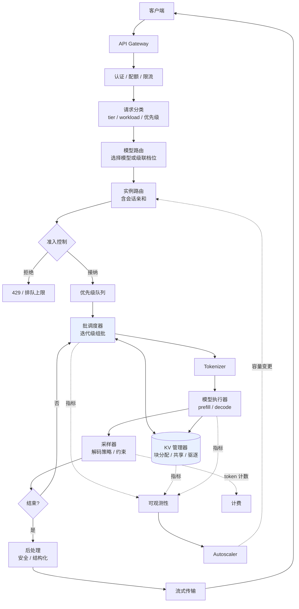

# Serving 架构总览

> 位置：[InferenceAtlas](../../INDEX.md) > [模块 03](README.md) > 当前文档
> 信息截至：2026-07-29 ｜ 最后核验：2026-07-29 ｜ 内容版本：v0.1
> 时效性等级：低
> 相关主题：[端到端生命周期](../00_start_here/02_end_to_end_inference_lifecycle.md)｜[批处理](02_static_dynamic_and_continuous_batching.md)｜[开源引擎](../12_open_source_deployment_and_reproduction/)

## 本章导读

本章描述"把模型变成服务"所需的全部组件，以及它们之间的职责边界。这些边界看似是架构洁癖，实际上决定了系统能否被诊断与演进：当职责混在一起时，一个时延问题可能同时是网关、调度器和内存管理器的问题，而没有人能单独修复它。

一个贯穿本模块的核心事实：**推理服务的性能主要由调度层决定，而非计算层**。同一个模型、同一块 GPU，不同的批处理与调度策略可以带来数倍的吞吐差异和完全不同的 tail latency 形态。计算层的优化（kernel、量化）通常带来百分比级的改善，调度层的选择带来倍数级的差异。

## 学习目标

读完本章后，读者应能够：

1. 列出 serving 系统的全部组件及其职责边界；
2. 说明控制面与数据面的划分，以及为什么这个划分重要；
3. 判断一个具体功能应当放在哪一层实现；
4. 识别常见的职责错配及其后果。

## 核心结论

- **推理服务的性能主要由调度层决定**。计算层优化是百分比级，调度层选择是倍数级。
- **控制面与数据面必须分离**：控制面（路由、准入、扩缩容）可以慢但必须正确；数据面（批处理、KV 管理、kernel）必须快。
- **调度器与 KV 分配器必须共享状态**，否则调度器会做出内存上不可行的决策——这是最常见的架构错误。
- **有状态性是 LLM serving 与传统模型服务的分水岭**。会话亲和、缓存共享、抢占恢复都源于此。

## 1. 问题定义、系统边界与工作负载

### 1.1 组件清单

| 层 | 组件 | 职责 | 面 |
|---|---|---|---|
| 接入 | API Gateway | 协议终结、TLS、路由 | 控制面 |
| 接入 | 认证与配额 | 鉴权、租户识别、限流 | 控制面 |
| 接入 | 请求分类 | 打标（tier、workload 类型、优先级） | 控制面 |
| 路由 | 模型路由 | 选择模型/版本/级联档位 | 控制面 |
| 路由 | 实例路由 | 选择后端实例（含会话亲和） | 控制面 |
| 调度 | 队列 | 排队、优先级、超时 | 数据面 |
| 调度 | 准入控制 | 过载保护、背压 | **两面交界** |
| 调度 | 批调度器 | 迭代级组批、抢占 | 数据面 |
| 执行 | Tokenizer | 文本 ↔ token | 数据面 |
| 执行 | KV 管理器 | 块分配、共享、驱逐 | 数据面 |
| 执行 | 模型执行器 | prefill / decode 前向 | 数据面 |
| 输出 | 采样器 | 解码策略、约束 | 数据面 |
| 输出 | 流式传输 | 增量返回、背压 | 数据面 |
| 输出 | 后处理 | 安全过滤、结构化解析 | 数据面 |
| 横切 | 可观测性 | 指标、日志、trace | 控制面 |
| 横切 | 计费 | token 计数、配额扣减 | 控制面 |
| 横切 | Autoscaler | 容量伸缩 | 控制面 |

### 1.2 控制面与数据面

| | 控制面 | 数据面 |
|---|---|---|
| 时间尺度 | 秒到分钟 | 微秒到毫秒 |
| 要求 | **正确性优先** | **延迟优先** |
| 失败后果 | 决策变差 | 请求变慢或失败 |
| 可否重试 | 通常可以 | 通常不行（已在关键路径） |
| 状态 | 可持久化 | 多为内存态 |

**为什么这个划分重要**：把控制面逻辑（如复杂的路由规则计算）放进数据面的每次迭代，会直接抬高 TPOT；反过来，把数据面决策（如批组成）交给外部控制面，会引入不可接受的往返延迟。**职责错位是性能问题的一类隐蔽来源。**

## 2. 原理、数学与性能模型

### 2.1 各层对指标的贡献

沿用 [模块 01 第 2 章](../01_foundations_and_metrics/02_latency_throughput_and_slo.md) 的六段分解：

| 层 | 贡献的时延段 | 影响的指标 |
|---|---|---|
| Gateway / 认证 | $T_{network}$ 的一部分 | 全局错误率 |
| 队列 | $T_{queue}$ | **TTFT、P99** |
| Tokenizer | $T_{tokenize}$ | TTFT（长输入时显著） |
| 批调度器 | 决定 $T_{prefill}$、$T_{decode}$ 的批上下文 | **全部** |
| KV 管理器 | 通过抢占影响 $T_{decode}$ | **P99、并发上限** |
| 执行器 | $T_{prefill}$、$T_{decode}$ 本身 | TTFT、TPOT |
| 采样器 | $T_{decode}$ 的一部分 | TPOT（约束解码时显著） |
| 后处理 | $T_{post}$ | 端到端时延尾部 |

**观察**：调度器与 KV 管理器**不直接产生时延，但决定了其他各段的执行环境**。这是它们影响力大于自身开销的原因。

### 2.2 为什么调度层是倍数级杠杆

考虑同一硬件上的两种极端配置：

| 配置 | 有效批大小 | 吞吐（相对） | TPOT（相对） |
|---|---|---|---|
| 静态批处理，批内等最长请求 | 低（受最长请求拖累） | 低 | 低 |
| 迭代级调度，请求随时进出 | 高 | **高** | 略高 |

由 [模块 01 第 5 章](../01_foundations_and_metrics/05_memory_bandwidth_and_arithmetic_intensity.md)，decode 吞吐近似正比于有效批大小（在权重主导区）。因此**调度策略通过改变有效批大小，直接线性地改变吞吐**。

相比之下，kernel 优化改善的是单次迭代耗时，通常是百分比级的改善。

**这就是"调度层是倍数级杠杆"的定量依据**，也是本模块在全库中权重较高的原因。

## 3. 实现机制与系统设计

### 3.1 完整架构

**图展示什么**：完整的 serving 架构，含控制面（路由、准入、扩缩容）与数据面（调度、KV、执行）的全部组件与数据流。

**核心瓶颈在哪**：高亮的两个组件——`批调度器` 与 `KV 管理器`——是系统的性能核心。二者之间的双向箭头表示它们必须共享状态：调度器决定组批时需要知道 KV 是否有空间，KV 管理器驱逐时需要通知调度器。**把这条双向边断开是最常见的架构错误。**

**图中的 trade-off**：`准入控制` 位于控制面与数据面的交界，它牺牲可用性（拒绝请求）以保护已接纳请求的时延。`Autoscaler → 实例路由` 的反馈回路时间尺度是分钟级，因此它无法应对秒级突发——那必须靠准入控制与余量。

**面试如何引用**：被问到"设计一个 LLM serving 系统"时，用这张图作为骨架开场，然后声明你要展开哪一层。主动指出调度器与 KV 管理器的耦合关系，以及准入控制的位置，会显示出你理解这不是一个简单的分层系统。

### 3.2 有状态性带来的额外要求

传统模型服务是无状态的：任何实例都能处理任何请求。LLM serving 不是。

| 状态 | 影响 | 引出的机制 |
|---|---|---|
| KV cache | 请求必须在同一实例上完成 | 实例亲和、抢占恢复 |
| 前缀缓存 | 命中依赖路由到有缓存的实例 | **缓存感知路由** |
| 会话历史 | 多轮对话应复用同一实例的缓存 | 会话亲和 |
| 采样状态 | 部分解码策略有跨步状态 | 状态随请求迁移 |

**最重要的一条是缓存感知路由**：若路由器不知道哪个实例缓存了什么前缀，前缀缓存的命中率会大幅低于理论值。这是一个跨越控制面与数据面的设计——路由决策（控制面）需要数据面的缓存状态。

### 3.3 常见职责错配

| 错配 | 表现 | 正确归属 |
|---|---|---|
| 路由逻辑放在数据面每次迭代 | TPOT 升高 | 控制面，请求级一次 |
| 批组成交给外部服务决定 | 每次迭代增加往返 | 数据面，本地决策 |
| 调度器不知道 KV 状态 | 组批后 OOM 或频繁抢占 | 二者共享状态 |
| 限流放在实例内部 | 无法全局控制 | 网关层 |
| 安全过滤放在流式路径中同步执行 | 首 token 延迟 | 流式旁路或分块检查 |
| Tokenizer 放在网关 | 网关 CPU 成瓶颈 | 靠近执行器 |
| 计费在数据面同步写 | 增加每步开销 | 异步旁路 |

## 4. 性能、成本、能耗与可靠性 trade-off

| 架构决策 | 收益 | 代价 |
|---|---|---|
| 网关与执行分离 | 独立扩缩容、协议隔离 | 一跳网络延迟 |
| 缓存感知路由 | 前缀命中率提升 | 路由器需维护缓存视图 |
| 会话亲和 | 缓存复用 | 负载不均、故障域集中 |
| 准入控制严格 | 时延稳定 | 拒绝率上升 |
| 多模型共置 | 提高利用率 | 相互干扰、显存竞争 |
| 单体引擎（调度+执行同进程） | 低延迟、状态共享简单 | 扩展性受限 |
| 分层架构 | 可演进、可独立优化 | 复杂度与跨层延迟 |

**普遍原则**：**数据面组件应当尽可能共置以共享状态并减少跳数；控制面组件应当尽可能分离以便独立演进**。多数成功的推理引擎在数据面是单体的，而在控制面是分层的。

## 5. benchmark、真实案例或公开部署案例

| 公开结论 | 来源 |
|---|---|
| 迭代级调度（continuous batching）是生成式模型服务吞吐提升的关键机制 | [Orca, OSDI 2022](https://www.usenix.org/conference/osdi22/presentation/yu) |
| 分页 KV 管理与调度协同，支持跨请求共享与动态分配 | [PagedAttention, SOSP 2023](https://arxiv.org/abs/2309.06180) |
| vLLM 提供 OpenAI 兼容 API server、Prometheus 指标端点、分页 KV 与前缀缓存 | [vLLM 仓库](https://github.com/vllm-project/vllm)，`开源代码/配置披露` |
| SGLang 提供基于基数树的前缀缓存（RadixAttention）与面向结构化生成的前端 | [SGLang 仓库](https://github.com/sgl-project/sglang)，`开源代码/配置披露` |

> 各引擎的详细架构对比（含 TGI、TensorRT-LLM、DeepSpeed-FastGen 等）将在 [模块 12](../12_open_source_deployment_and_reproduction/) 中逐项核验官方文档后建立。本章不给出未核验的特性矩阵。`待核实`

## 6. 设计决策框架

1. 先按第 1.1 节清单确认所有组件都有明确归属，无遗漏、无重复；
2. 标注每个组件属于控制面还是数据面；
3. 检查数据面路径上是否混入了控制面逻辑（第 3.3 节表）；
4. **确认调度器与 KV 管理器共享状态**；
5. 若使用前缀缓存，设计缓存感知路由；
6. 若需会话亲和，设计故障时的降级（亲和实例不可用时如何处理）；
7. 确定准入控制的位置与策略；
8. 为每个组件定义可观测信号（见 [模块 11](../11_benchmarking_reliability_and_observability/)）；
9. 明确多模型共置还是隔离部署。

## 7. 常见失败模式与排查路径

| 失败模式 | 表现 | 根因 | 纠正 |
|---|---|---|---|
| 调度器与 KV 分离 | 组批后 OOM 或频繁抢占 | 状态不共享 | 二者协同设计 |
| 无缓存感知路由 | 前缀命中率远低于预期 | 请求被路由到无缓存实例 | 路由器维护缓存视图 |
| 会话亲和无降级 | 实例故障导致会话中断 | 未设计故障路径 | 亲和 + 优雅回退 |
| 控制面逻辑进数据面 | TPOT 无故偏高 | 每次迭代做路由计算 | 移到请求级 |
| 同步安全过滤 | TTFT 升高 | 阻塞在关键路径 | 异步或分块检查 |
| 无准入控制 | 过载后不可恢复 | 缺入口保护 | 加准入控制 |
| 多模型共置无隔离 | 相互干扰 | 显存与调度竞争 | 配额或分池 |
| 可观测性覆盖不全 | 无法定位到层 | 缺组件级指标 | 按第 2.1 节表补齐 |

## 8. 关联面试主题

1. **设计一个 LLM serving 系统的完整架构** → 本章 3.1
2. **控制面与数据面如何划分，为什么** → 本章 1.2、3.3
3. **为什么调度层是性能的主要杠杆** → 本章 2.2
4. **有状态性给 serving 带来哪些额外要求** → 本章 3.2
5. **缓存感知路由解决什么问题** → 本章 3.2

## 9. 小结

Serving 系统由接入、路由、调度、执行、输出与横切六类组件构成，按时间尺度与要求分为控制面与数据面。推理服务的性能主要由调度层决定——调度策略通过改变有效批大小线性地影响吞吐，是倍数级杠杆，而计算层优化通常是百分比级。批调度器与 KV 管理器是系统的性能核心，二者**必须共享状态**，分离设计会导致调度器做出内存上不可行的决策。LLM serving 的有状态性（KV cache、前缀缓存、会话历史）是它与传统模型服务的分水岭，由此引出实例亲和、缓存感知路由与抢占恢复等机制。架构上的普遍原则是：数据面共置以共享状态、控制面分离以便演进。

## 关键术语

| 中文术语 | 英文 | 定义 | 单位/口径 | 关联文档 |
|---|---|---|---|---|
| 控制面 | control plane | 路由、准入、扩缩容等秒级决策组件 | — | 本章 1.2 |
| 数据面 | data plane | 调度、KV、执行等毫秒级关键路径组件 | — | 本章 1.2 |
| 缓存感知路由 | cache-aware routing | 依据实例的前缀缓存状态做路由决策 | — | 本章 3.2 |
| 会话亲和 | session affinity | 把同一会话的请求路由到同一实例 | — | 本章 3.2 |
| 职责错配 | responsibility misplacement | 功能被实现在错误的层，导致性能或可维护性问题 | — | 本章 3.3 |

## 延伸阅读

- [02 批处理](02_static_dynamic_and_continuous_batching.md) —— 调度层的核心机制
- [03 PagedAttention 与 KV 内存管理](03_pagedattention_and_kv_memory_management.md) —— KV 管理器的实现
- [模块 12：开源引擎](../12_open_source_deployment_and_reproduction/) —— 各引擎的具体架构

## 主要来源

| # | 来源 | 类型 | 披露等级 | 核验日期 |
|---:|---|---|---|---|
| 1 | [Orca (OSDI 2022)](https://www.usenix.org/conference/osdi22/presentation/yu) | 会议论文 | 独立可复现实验 | 2026-07-29 |
| 2 | [PagedAttention (SOSP 2023)](https://arxiv.org/abs/2309.06180) | 会议论文 | 独立可复现实验 | 2026-07-29 |
| 3 | [vLLM 官方仓库](https://github.com/vllm-project/vllm) | 开源项目 | 开源代码/配置披露 | 2026-07-29 |
| 4 | [SGLang 官方仓库](https://github.com/sgl-project/sglang) | 开源项目 | 开源代码/配置披露 | 2026-07-29 |

## 更新记录

| 日期 | 版本 | 变更 | 核验人 |
|---|---|---|---|
| 2026-07-29 | v0.1 | 初稿 | — |
