# 静态、动态与连续批处理

> 位置：[InferenceAtlas](../../INDEX.md) > [模块 03](README.md) > 当前文档
> 信息截至：2026-07-29 ｜ 最后核验：2026-07-29 ｜ 内容版本：v0.1
> 时效性等级：低
> 相关主题：[Serving 架构](01_serving_architecture_overview.md)｜[调度与准入控制](04_request_scheduling_and_admission_control.md)｜[带宽分析](../01_foundations_and_metrics/05_memory_bandwidth_and_arithmetic_intensity.md)

## 本章导读

批处理是推理服务中杠杆最大的单一机制。它的作用原理很简单——让多个序列共享一次权重读取——但它的**代价结构**并不简单：批越大吞吐越高，同时每个请求的时延越长、显存占用越多、tail latency 越难控制。

本章比较三代批处理方案，重点回答两个问题：**continuous batching 为什么能大幅提高利用率**，以及**它在什么情况下反而会损害 tail latency**。第二个问题在实践中更重要，因为多数团队在上了 continuous batching 后遇到的问题不是吞吐不够，而是 P99 不稳定。

## 学习目标

读完本章后，读者应能够：

1. 说明三种批处理的机制差异与各自的等待来源；
2. 从算术强度出发解释批处理的吞吐收益及其饱和条件；
3. 分析 continuous batching 下 tail latency 恶化的三种机制；
4. 在给定 workload 与 SLO 下选择合适的批处理策略与参数。

## 核心结论

- **静态批处理的浪费来自"等最长的"**；动态批处理的浪费来自"等凑满"；**continuous batching 基本消除了这两种等待**。
- **吞吐收益来自摊薄权重读取**，近似线性直到算力饱和或 KV 显存耗尽。
- **continuous batching 会损害 tail latency 的三个机制**：批内长短干扰、prefill 阻塞 decode、KV 压力下的抢占重算。
- **批大小不是越大越好**。存在一个由 SLO 与显存共同决定的最优区间，超过它吞吐不再增长而时延持续恶化。

## 1. 问题定义、系统边界与工作负载

### 1.1 三种方案

| 方案 | 组批时机 | 请求何时能离开 | 主要等待 |
|---|---|---|---|
| **静态批处理** | 固定批大小，凑满后执行 | **整批完成后** | 等凑满 + 等批内最长 |
| **动态批处理** | 时间窗口内尽量聚合 | 整批完成后 | 等窗口 + 等批内最长 |
| **连续批处理** | **每次迭代重新组批** | **自己完成即离开** | 仅等当前迭代 |

**核心差异在"何时能离开"**。前两者是请求级调度：批一旦形成就固定到全部完成；后者是迭代级调度：每一步之后都重新决定批的组成。

### 1.2 为什么变长输出使这个差异巨大

若所有请求的输出长度相同，三者差异很小——大家同时结束。

但 LLM 的输出长度差异极大（见 [模块 01 第 1 章](../01_foundations_and_metrics/01_inference_workload_taxonomy.md)）。在静态批处理下，一个输出 50 token 的请求会被迫等待同批中输出 5,000 token 的请求，期间它占用的计算槽位完全闲置。

**这就是 continuous batching 的收益来源**：把这些闲置槽位立刻交给新请求。

## 2. 原理、数学与性能模型

### 2.1 吞吐收益的来源

由 [模块 01 第 5 章](../01_foundations_and_metrics/05_memory_bandwidth_and_arithmetic_intensity.md)，decode 阶段的吞吐：

$$
\text{Throughput} \le \frac{B \times BW}{W_{bytes} + B \times M_{KV,\text{per-seq}}}
$$

**在权重主导区**（$B \times M_{KV} \ll W_{bytes}$）：

$$
\text{Throughput} \approx \frac{B \times BW}{W_{bytes}} \propto B
$$

**吞吐近似正比于有效批大小**。因此批处理策略的价值可以直接量化为：**它能把有效批大小提高多少**。

**静态批处理的有效批大小**：设批大小为 $B_0$，批内请求输出长度为 $\{N_1, \dots, N_{B_0}\}$，则整批耗时由 $\max N_i$ 决定，而总产出为 $\sum N_i$。平均有效批大小：

$$
B_{eff}^{static} = \frac{\sum_i N_i}{\max_i N_i}
$$

**当输出长度差异大时，这个值远小于 $B_0$**。例如若一个请求输出 5,000 而其余 31 个各输出 100，则 $B_{eff} = (5000 + 3100)/5000 \approx 1.6$，而不是 32。

**continuous batching 下** $B_{eff}$ 接近调度器维持的实际并发数，因为完成的请求立即被替换。

**这个比较定量地解释了为什么 continuous batching 的收益如此显著**：它不是让计算更快，而是让本已闲置的槽位被利用。

### 2.2 收益的饱和条件

批处理的吞吐收益在两种情况下停止：

| 条件 | 机制 | 表现 |
|---|---|---|
| **算力饱和** | 达到 Roofline 水平屋顶 | 吞吐转平 |
| **进入 KV 主导区** | $B \times M_{KV}$ 超过 $W_{bytes}$ | 吞吐增长放缓 |
| **KV 容量耗尽** | 显存不足 | **吞吐下降**（抢占重算） |

**第三种最危险**：它不是收益递减，而是收益为负。系统在超过容量后进入 cache thrashing，吞吐会低于更小批时的水平（见 [模块 01 第 3 章](../01_foundations_and_metrics/03_queueing_theory_for_inference.md) 的正反馈分析）。

**因此存在一个吞吐峰值批大小**，超过它性能反而下降。**这是一个必须通过压测找到并设置上限的参数，不能靠"越大越好"的直觉。**

### 2.3 Tail latency 恶化的三个机制

Continuous batching 提高吞吐，但会通过三条路径恶化 tail latency：

**机制一：批内长短干扰**

同批中所有请求共享每次迭代的耗时。批中有一个超长序列时，其注意力计算更重，会略微拖慢整批的每步耗时。影响相对温和但持续存在。

**机制二：Prefill 阻塞 decode**

新请求加入时需要 prefill。若 prefill 未分块，它会占据整个迭代，使同批所有正在 decode 的请求停顿一步。**这是 ITL 尖峰的主要来源**，也是 chunked prefill 要解决的问题（见 [第 5 章](05_prefill_decode_scheduling.md)）。

**机制三：KV 压力下的抢占重算**

批越大 KV 占用越多。接近容量时，新请求的接纳会触发对现有请求的抢占；被抢占的请求恢复时需重算，其时延出现巨大跳变。**这是 P99 长尾的主要来源**。

**三者的相对影响**：机制二影响 ITL 分布的中高分位，机制三影响极端分位（P99.9）。诊断时看 ITL 分布形状可以区分：均匀抬升多为机制一，周期性尖峰多为机制二，少数极端值多为机制三。

## 3. 实现机制与系统设计

### 3.1 三种方案的时序对比

```mermaid
flowchart TD
    subgraph "静态批处理"
    S1["t0: 凑满 4 个请求"] --> S2["执行到全部完成"]
    S2 --> S3["A 完成(短) 但槽位闲置"]
    S3 --> S4["等待 D 完成(长)"]
    S4 --> S5["t1: 整批退出，新批开始"]
    end

    subgraph "动态批处理"
    D1["时间窗口内聚合"] --> D2["窗口到期即执行"]
    D2 --> D3["仍需等批内最长"]
    D3 --> D4["整批退出"]
    end

    subgraph "连续批处理"
    C1["迭代 n: 批 = {A,B,C,D}"] --> C2["A 完成 → 立即离开"]
    C2 --> C3["迭代 n+1: 批 = {B,C,D,E}<br/>E 是新请求"]
    C3 --> C4["E 需 prefill → 可能阻塞 B,C,D"]
    C4 --> C5["迭代 n+2: 批 = {B,C,D,E}"]
    C5 --> C6{KV 是否充足?}
    C6 -- 否 --> C7["抢占某请求 → 后续需重算"]
    C6 -- 是 --> C5
    end
```



**图展示什么**：三种批处理的执行时序，以及 continuous batching 中两个引入 tail latency 的节点（新请求的 prefill、KV 不足时的抢占）。

**核心瓶颈在哪**：静态与动态批处理的瓶颈是 `等批内最长` 造成的槽位闲置；continuous batching 把这个瓶颈换成了两个新问题——`E 需 prefill 可能阻塞` 与 `抢占后重算`。**它不是消除了代价，而是把吞吐损失转换成了时延方差。**

**图中的 trade-off**：这正是本章的核心 trade-off。静态批处理时延可预测但吞吐低；continuous batching 吞吐高但时延方差大。选择取决于 SLO 是要求可预测性还是要求平均性能。

**面试如何引用**：被问到"continuous batching 有什么代价"时，用这张图指出两个具体节点，而不是笼统地说"会影响时延"。能说清 prefill 阻塞与抢占重算是两个不同机制、需要不同缓解手段，是理解深度的标志。

### 3.2 关键参数

| 参数 | 作用 | 设置依据 |
|---|---|---|
| 最大批大小 | 吞吐上限与显存上限 | **压测找吞吐峰值**，不是越大越好 |
| 最大 KV 块数 | 并发上限 | 由显存与 $m_{tok}$ 反推 |
| 单次迭代最大 token 数 | 限制 prefill 占用 | 与 chunked prefill 配合 |
| 抢占策略 | 抢占谁、何时 | 优先抢占低优先级或近期请求 |
| 调度窗口 | 每次重组批的粒度 | 通常为每次迭代 |
| 准入阈值 | 何时拒绝新请求 | 由 SLO 与经济利用率上限决定 |

**最重要的是前两个**。它们共同决定了系统运行在吞吐-时延曲线的哪个位置，且都必须通过压测标定而非估算。

### 3.3 伪代码：连续批处理调度器

```text
初始化:
    running ← 空集合        # 当前正在生成的请求
    waiting ← 优先级队列     # 等待接纳的请求
    kv ← KV 块分配器

循环 每次迭代:
    # 1. 回收已完成请求的资源
    对 running 中每个请求 r:
        若 r 已产生结束标记 或 达到最大长度:
            kv.释放(r)
            running.移除(r)
            向客户端发送结束事件

    # 2. 在预算内接纳新请求
    当 waiting 非空:
        r ← waiting.查看队首()
        需求 ← 估算KV需求(r)              # 用 P95 长度而非均值
        若 kv.可用容量() ≥ 需求 且 len(running) < 最大批大小:
            kv.分配(r, 需求)
            running.加入(r)
            waiting.出队()
        否则:
            跳出                          # 保持优先级顺序，不跳过队首

    # 3. 处理显存压力
    当 kv.可用容量() < 安全水位:
        受害者 ← 选择抢占目标(running)     # 优先低优先级/近期加入
        kv.释放(受害者)
        running.移除(受害者)
        waiting.加入(受害者, 标记需重算)
        抢占计数器.递增()                  # 监控项：抢占率

    # 4. 构造本次迭代的批
    prefill组 ← running 中处于 prefill 阶段的请求
    decode组  ← running 中处于 decode 阶段的请求
    # chunked prefill: 限制本次迭代的 prefill token 总量
    prefill批 ← 从 prefill组 取 token 数不超过 单次迭代最大token数 的部分

    # 5. 执行
    输出 ← 模型.前向(prefill批 ∪ decode组)

    # 6. 采样与流式返回
    对每个请求 r:
        token ← 采样器(输出[r], r.采样参数)
        kv.追加(r, token)
        流式发送(r, token)
```

**关键设计点**：

- 步骤 2 的 `否则: 跳出` 保持了优先级顺序。若改为"跳过队首去接纳更小的请求"，会提高利用率但造成长请求饥饿——这是一个需要显式选择的权衡；
- 步骤 2 用 **P95 长度**估算需求而非均值，避免接纳后很快就要抢占；
- 步骤 3 的抢占计数器是**必须监控的指标**，它是 cache thrashing 的先行信号；
- 步骤 4 的 chunked prefill 限制是抑制机制二（prefill 阻塞）的关键。

## 4. 性能、成本、能耗与可靠性 trade-off

| 参数调整 | 吞吐 | TPOT | P99 | 显存 |
|---|---|---|---|---|
| 增大最大批 | ↑ 直至饱和 | ↑ | ↑↑ | ↑ |
| 减小最大批 | ↓ | ↓ | ↓ | ↓ |
| 启用 chunked prefill | ≈ | ↓（同批） | **↓↓** | ≈ |
| 收紧准入阈值 | ↓ | ↓ | **↓↓** | ↓ |
| 允许更多抢占 | ↑（短期） | ↑ | **↑↑** | — |
| 长度感知组批 | ≈ | ≈ | ↓ | ≈ |
| 优先级队列 | ≈ | 分层 | 高优先级 ↓ | ≈ |

**核心权衡**：**吞吐与 P99 在批大小这个旋钮上直接对立**。goodput（见 [模块 01 第 2 章](../01_foundations_and_metrics/02_latency_throughput_and_slo.md)）是同时约束二者的正确目标函数——它会在批大小过大导致 SLO 违约时自动下降，从而给出最优点。

**实践建议**：**用 goodput 而非裸吞吐作为压测的优化目标**，扫描批大小找到 goodput 峰值。这一步比任何 kernel 优化的收益都大。

## 5. benchmark、真实案例或公开部署案例

| 公开结论 | 来源 |
|---|---|
| 迭代级调度与 selective batching：请求可在生成过程中动态进出批次，避免等待批内最长请求 | [Orca, OSDI 2022](https://www.usenix.org/conference/osdi22/presentation/yu) |
| 分页 KV 管理使动态接纳与抢占在显存层可行 | [PagedAttention, SOSP 2023](https://arxiv.org/abs/2309.06180) |
| vLLM、SGLang、TGI、TensorRT-LLM 均实现了迭代级/in-flight 批处理 | 各项目官方仓库与文档，`开源代码/配置披露` |

> 具体的吞吐提升倍数强依赖实验配置（模型、序列长度分布、硬件、基线实现），本库不脱离配置引用。完整实验设置见 [模块 13](../13_research_papers_and_technical_reports/) 的论文卡片。`待核实`

## 6. 设计决策框架

1. 确认 workload 的输出长度分布——差异越大，continuous batching 收益越高；
2. 默认选择 continuous batching（当代引擎的标准能力）；
3. **压测扫描最大批大小，以 goodput 为目标找峰值**，而非取最大值；
4. 由显存与 $m_{tok}$ 反推最大 KV 块数，设为硬上限；
5. 启用 chunked prefill 并调优单次迭代 token 上限；
6. 设置准入阈值，使系统不进入抢占频繁区；
7. 监控三项：有效批大小、抢占率、ITL 分布；
8. 若 P99 仍不达标，按机制一/二/三分别诊断（见 2.3 节）；
9. 混合 workload 时评估长度感知组批或分池。

## 7. 常见失败模式与排查路径

| 失败模式 | 表现 | 根因 | 纠正 |
|---|---|---|---|
| 批大小设为最大值 | 吞吐反而下降 | 越过峰值进入 thrashing | 压测找 goodput 峰值 |
| 只优化吞吐 | 吞吐达标但 SLO 违约 | 未约束时延 | 用 goodput 作目标 |
| ITL 周期性尖峰 | 用户感知卡顿 | prefill 阻塞（机制二） | 启用 chunked prefill |
| P99.9 极端值 | 少数请求超时 | 抢占重算（机制三） | 收紧准入、限制抢占 |
| ITL 均匀抬升 | 整体变慢 | 批内长请求干扰（机制一） | 长度感知组批 |
| 长请求饥饿 | 长请求长期排队 | 调度器跳过队首 | 保持优先级顺序或加老化 |
| 用均值估 KV 需求 | 接纳后很快抢占 | 低估需求 | 用 P95 |
| 未监控抢占率 | 无法预判退化 | 缺关键指标 | 补齐监控 |

## 8. 关联面试主题

1. **如何选择 static、dynamic 和 continuous batching** → 本章 1.1、2.1
2. **continuous batching 为什么能提高利用率** → 本章 2.1
3. **它在什么情况下会损害 tail latency** → 本章 2.3
4. **批大小该怎么设，为什么不是越大越好** → 本章 2.2、3.2
5. **写出 continuous batching 调度器的伪代码** → 本章 3.3

## 9. 小结

批处理的吞吐收益来自摊薄权重读取，近似正比于有效批大小。静态与动态批处理的有效批大小受"等批内最长请求"拖累，在输出长度差异大的 LLM 场景下可能远低于名义批大小；continuous batching 通过迭代级重组批基本消除这一浪费，这是其收益显著的定量原因。但它不是消除了代价，而是把吞吐损失转换成了时延方差：批内长短干扰、prefill 阻塞 decode、KV 压力下的抢占重算三个机制分别影响 ITL 分布的不同区域，需要不同的缓解手段。批大小存在一个吞吐峰值，超过它性能反而下降，因此必须通过压测标定并设上限；**以 goodput 而非裸吞吐为优化目标**是找到正确工作点的关键。

## 关键术语

| 中文术语 | 英文 | 定义 | 单位/口径 | 关联文档 |
|---|---|---|---|---|
| 有效批大小 | effective batch size | 实际贡献吞吐的平均并发序列数 | 个 | 本章 2.1 |
| 迭代级调度 | iteration-level scheduling | 每次生成迭代后重新组批 | — | 本章 1.1 |
| 选择性批处理 | selective batching | 对不同算子差异化应用批处理以适配变长序列 | — | 本章 5 |
| 吞吐峰值批大小 | throughput-peak batch size | 超过后吞吐反而下降的批大小 | 个 | 本章 2.2 |
| 抢占率 | preemption rate | 单位时间内被抢占的请求数，thrashing 先行信号 | 次/s | 本章 3.3 |

## 延伸阅读

- [03 PagedAttention 与 KV 内存管理](03_pagedattention_and_kv_memory_management.md) —— 使动态接纳成为可能的内存层
- [05 prefill/decode 调度](05_prefill_decode_scheduling.md) —— 机制二的完整解法
- [04 调度与准入控制](04_request_scheduling_and_admission_control.md) —— 机制三的完整解法

## 主要来源

| # | 来源 | 类型 | 披露等级 | 核验日期 |
|---:|---|---|---|---|
| 1 | [Orca (OSDI 2022)](https://www.usenix.org/conference/osdi22/presentation/yu) | 会议论文 | 独立可复现实验 | 2026-07-29 |
| 2 | [PagedAttention (SOSP 2023)](https://arxiv.org/abs/2309.06180) | 会议论文 | 独立可复现实验 | 2026-07-29 |
| 3 | [vLLM 官方仓库](https://github.com/vllm-project/vllm) | 开源项目 | 开源代码/配置披露 | 2026-07-29 |
| 4 | [SGLang 官方仓库](https://github.com/sgl-project/sglang) | 开源项目 | 开源代码/配置披露 | 2026-07-29 |

> **说明**：第 2.1 节的有效批大小推导与数值示例为**本库的教学构造**，用于说明机制；第 3.3 节的伪代码为**本库综合公开实现思路编写的教学版本**，非任何具体引擎的实际代码。

## 更新记录

| 日期 | 版本 | 变更 | 核验人 |
|---|---|---|---|
| 2026-07-29 | v0.1 | 初稿 | — |
