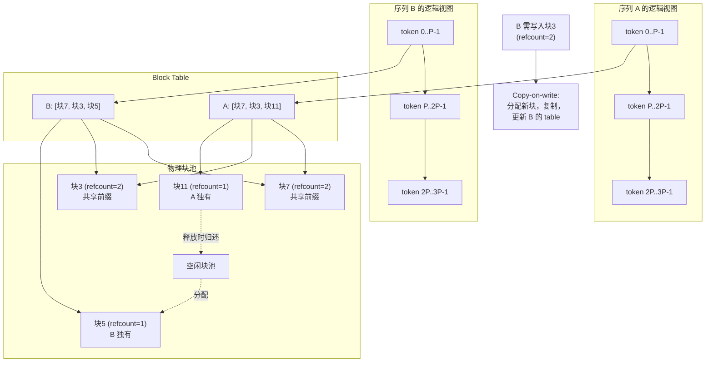

# PagedAttention 与 KV 内存管理

> 位置：[InferenceAtlas](../../INDEX.md) > [模块 03](README.md) > 当前文档
> 信息截至：2026-07-29 ｜ 最后核验：2026-07-29 ｜ 内容版本：v0.1
> 时效性等级：低
> 相关主题：[KV Cache 基础](../02_transformer_and_kv_cache/04_kv_cache_fundamentals.md)｜[批处理](02_static_dynamic_and_continuous_batching.md)｜[前缀缓存](08_prompt_caching_and_prefix_caching.md)

## 本章导读

KV cache 的显存管理是一个经典的操作系统问题：**变长、动态增长、生命周期不一的对象，如何在固定容量中高效共存**。朴素做法——为每个序列预留一段连续显存——会重复操作系统早期的所有错误：内部碎片、外部碎片、以及为最坏情况预留造成的巨大浪费。

PagedAttention 的贡献是把虚拟内存分页的思想引入 KV 管理：以固定大小的 block 为分配单位，通过 block table 建立逻辑到物理的间接映射。这解除了"逻辑连续必须物理连续"的约束，从而消除外部碎片、把内部碎片压缩到块粒度，并**使跨请求共享成为可能**。

最后这一点常被低估：分页不只是省显存，它是前缀缓存、copy-on-write、以及 KV 迁移等一系列上层能力的**基础设施**。

## 学习目标

读完本章后，读者应能够：

1. 分解朴素分配的三类浪费，并说明分页如何分别处理；
2. 描述 block table 的结构与地址翻译过程；
3. 解释 copy-on-write 如何支持跨请求共享；
4. 说明块大小选择的权衡，并给出调优方法。

## 核心结论

- **朴素预留的最大浪费是"预留浪费"**，即按最大可能长度预留而实际用不到的部分；分页把它压缩到不足一个块。
- **分页消除外部碎片**：任何空闲块都可用于任何序列，因为逻辑连续不再要求物理连续。
- **分页是共享的前提**：块级映射使多个序列指向同一物理块，配合 copy-on-write 实现前缀共享。
- **块大小是需要调优的参数**：过大则内部碎片增加，过小则元数据与寻址开销增加。

## 1. 问题定义、系统边界与工作负载

### 1.1 朴素分配的三类浪费

为每个序列预留一段连续显存（长度为该模型的最大上下文）时：

| 浪费类型 | 来源 | 典型量级 |
|---|---|---|
| **预留浪费** | 按最大长度预留，实际序列短得多 | **通常最大** |
| **内部碎片** | 分配单元大于实际需要 | 与单元大小相关 |
| **外部碎片** | 空闲空间不连续，无法满足新请求 | 与分配模式相关 |

**为什么预留浪费最大**：请求的实际长度往往远小于模型支持的最大长度，且事先不可知。若为安全起见按最大长度预留，绝大部分显存被闲置——这直接压低了可并发数。

### 1.2 与操作系统的类比

| 操作系统概念 | KV 管理中的对应 |
|---|---|
| 虚拟地址空间 | 序列的逻辑 token 位置 |
| 物理页帧 | 固定大小的 KV block |
| 页表 | block table |
| 页大小 | block size（每块容纳的 token 数） |
| 缺页 | 需要新块时的分配 |
| 换出 | KV offload 到 CPU/NVMe |
| 共享内存 | 跨序列共享的前缀块 |
| Copy-on-write | 共享块被修改时复制 |

**这个类比是准确的而非比喻**——PagedAttention 解决的确实是同一类问题，其解法也确实是同一套机制。理解操作系统内存管理的读者可以直接迁移直觉。

## 2. 原理、数学与性能模型

### 2.1 分页的结构

设块大小为 $P$（每块容纳 $P$ 个 token 的 KV）。

**单块的字节数**：

$$
\text{block\_bytes} = P \times m_{tok} = P \times 2 L H_{KV} D_h b_{kv}
$$

**一个长度为 $S$ 的序列需要的块数**：

$$
n_{blocks} = \left\lceil \frac{S}{P} \right\rceil
$$

**内部碎片**（最后一块的浪费）：

$$
\text{waste}_{internal} = (n_{blocks} \times P - S) \times m_{tok} < P \times m_{tok}
$$

**关键结论**：内部碎片**严格小于一个块**，与序列长度和最大上下文长度都无关。这与朴素预留形成鲜明对比——后者的浪费与"最大长度减实际长度"成正比。

### 2.2 块大小的权衡

| 块大小 | 内部碎片 | 元数据开销 | 寻址开销 | 共享粒度 |
|---|---|---|---|---|
| 大 | **高**（最多一整块） | 低 | 低 | 粗（前缀需对齐到块） |
| 小 | 低 | **高**（块数多，block table 大） | **高**（间接寻址频繁） | 细 |

**最优值依赖 workload**：

- 序列长度分布集中且较长 → 可用较大块（内部碎片相对占比小）；
- 序列短且长度分散 → 用较小块；
- 前缀共享重要 → 较小块提高共享命中的对齐概率。

**这是一个必须压测调优的参数**，不存在通用最优值。`待核实`（具体最优值依引擎实现与 workload 而定）

### 2.3 Copy-on-write 与共享

两个序列共享相同前缀时：

1. 二者的 block table 中，前缀部分指向**同一批物理块**；
2. 每个物理块维护**引用计数**；
3. 当某序列需要写入一个引用计数 > 1 的块时：
   - 分配新块，复制内容；
   - 更新该序列的 block table 指向新块；
   - 原块引用计数减一。

**为什么需要 copy-on-write**：共享前缀的两个序列在分叉后会写入不同内容。若不复制，一方的写入会污染另一方。

**在推理中的具体场景**：

| 场景 | 共享部分 | 分叉点 |
|---|---|---|
| 相同系统提示的多个请求 | 系统提示 | 用户输入开始处 |
| 多轮对话的历史 | 历史轮次 | 本轮新内容 |
| 同一 prompt 的多次采样 | 整个 prompt | 首个生成 token |
| Beam search 的多个 beam | 公共前缀 | 分叉点 |

**注意最后两行**：同一 prompt 的多次采样（如自一致性）与 beam search，是 copy-on-write 收益最直接的场景——它们天然共享大段前缀。

## 3. 实现机制与系统设计

### 3.1 分页 KV 的地址翻译



**图展示什么**：两个共享前缀的序列如何通过 block table 映射到部分共享的物理块，以及 copy-on-write 的触发条件。

**核心瓶颈在哪**：`Block Table` 的查找位于注意力 kernel 的关键路径上。每次访问 KV 都需要一次间接寻址，这是分页的固有开销。好的实现会把 block table 保持在快速内存中并批量翻译，使这个开销远小于它节省的显存所带来的收益。

**图中的 trade-off**：共享（refcount > 1）节省显存但引入 copy-on-write 的复制成本与引用计数管理的复杂度。当分叉频繁时，copy-on-write 的复制可能抵消部分共享收益——因此共享最适合**分叉点靠后**的场景（如长系统提示 + 短用户输入）。

**面试如何引用**：被问到 PagedAttention 时，画出这张图并强调两点：外部碎片消除（任何空闲块可用于任何序列）与共享能力（block table 使多序列指向同一物理块）。多数人只答第一点，第二点才是它成为基础设施的原因。

### 3.2 伪代码：分页 KV 块分配器

```text
数据结构:
    block_size      P                      # 每块容纳的 token 数
    free_list       空闲物理块 ID 的栈
    refcount[]      每个物理块的引用计数
    block_table[r]  请求 r 的逻辑块 → 物理块 映射

函数 分配(r, 需要的token数 n):
    需要块数 ← ceil(n / P)
    若 len(free_list) < 需要块数:
        返回 失败                          # 由调度器决定抢占或拒绝
    对 i in 1..需要块数:
        blk ← free_list.弹出()
        refcount[blk] ← 1
        block_table[r].追加(blk)
    返回 成功

函数 追加token(r, token):
    最后块 ← block_table[r].末尾()
    若 最后块 已满:
        blk ← free_list.弹出()             # 可能失败 → 触发抢占
        refcount[blk] ← 1
        block_table[r].追加(blk)
        最后块 ← blk
    若 refcount[最后块] > 1:               # 共享块需 copy-on-write
        新块 ← free_list.弹出()
        复制(最后块 → 新块)
        refcount[最后块] ← refcount[最后块] − 1
        refcount[新块] ← 1
        block_table[r].替换末尾(新块)
        最后块 ← 新块
    写入(最后块, token 的 K/V)

函数 共享前缀(r_new, r_existing, 前缀token数 k):
    共享块数 ← floor(k / P)                # 只共享完整块，不足一块的部分单独分配
    对 i in 1..共享块数:
        blk ← block_table[r_existing][i]
        refcount[blk] ← refcount[blk] + 1
        block_table[r_new].追加(blk)
    # 剩余不足一块的前缀需要单独分配并复制
    返回 共享块数 × P                       # 实际跳过的 token 数

函数 释放(r):
    对 blk in block_table[r]:
        refcount[blk] ← refcount[blk] − 1
        若 refcount[blk] == 0:
            free_list.压入(blk)
    删除 block_table[r]
```

**三个实现要点**：

1. **`共享前缀` 只共享完整块**。这解释了为什么块大小影响共享效率：块越大，前缀末尾不足一块的部分越多，共享的有效比例越低；
2. **`追加token` 中的 copy-on-write 检查每次都要做**，因此 refcount 的读取必须高效；
3. **`分配` 失败不是错误而是信号**，由调度器决定抢占还是拒绝——这体现了[第 1 章](01_serving_architecture_overview.md)强调的"调度器与 KV 管理器共享状态"。

### 3.3 与抢占的配合

当 `free_list` 耗尽时，系统有三个选择：

| 选择 | 机制 | 代价 |
|---|---|---|
| **拒绝新请求** | 准入控制生效 | 可用性下降 |
| **抢占现有请求** | 释放其块，加回等待队列 | 恢复时需**重算** |
| **换出到 CPU** | 块内容拷贝到主机内存 | PCIe 带宽 + 时延 |

**抢占的两种恢复方式**：

- **重算**：重新 prefill 该序列。计算成本高但不占用带宽；
- **换出/换入**：保存并恢复块内容。省计算但耗带宽。

二者的选择取决于**重算成本与传输成本的比较**：序列越长重算越贵，但传输也越贵。实践中短序列倾向重算、长序列倾向换出，具体阈值需实测。`待核实`

## 4. 性能、成本、能耗与可靠性 trade-off

| 决策 | 收益 | 代价 |
|---|---|---|
| 启用分页 | 消除外部碎片、内部碎片有界、支持共享 | 间接寻址开销、实现复杂度 |
| 增大块 | 元数据与寻址开销降低 | 内部碎片增加、共享粒度变粗 |
| 减小块 | 内部碎片降低、共享更细 | 元数据与寻址开销增加 |
| 启用共享 | 显著节省显存与 prefill | 引用计数管理、**隐私边界** |
| 抢占用重算 | 不占带宽 | 计算成本、增大方差 |
| 抢占用换出 | 省计算 | PCIe 带宽、时延 |
| 预留安全水位 | 减少抢占 | 可用显存减少 |

**关于隐私边界**：共享意味着一个请求的 KV 被另一个请求使用。跨租户共享会引入信息泄露与时序侧信道风险，**共享的默认作用域应限于租户内**（见 [模块 02 第 4 章](../02_transformer_and_kv_cache/04_kv_cache_fundamentals.md) 3.2 节）。

## 5. benchmark、真实案例或公开部署案例

| 公开结论 | 来源 |
|---|---|
| 借鉴虚拟内存分页管理 KV cache：固定大小块、block table 间接映射、copy-on-write 共享；碎片来源分解为内部碎片、外部碎片与预留浪费 | [PagedAttention, SOSP 2023](https://arxiv.org/abs/2309.06180) |
| 迭代级调度需要 KV 分配支持动态接纳与释放 | [Orca, OSDI 2022](https://www.usenix.org/conference/osdi22/presentation/yu) |
| vLLM 是 PagedAttention 的原始实现；SGLang 采用基数树组织前缀共享（RadixAttention） | [vLLM](https://github.com/vllm-project/vllm)、[SGLang](https://github.com/sgl-project/sglang)，`开源代码/配置披露` |

> 具体的显存节省比例与吞吐提升幅度依赖基线实现与 workload，本库不脱离配置引用。完整实验设置见 [模块 13](../13_research_papers_and_technical_reports/)。`待核实`

## 6. 设计决策框架

1. 确认引擎已启用分页 KV（当代主流引擎的默认能力）；
2. 由显存与 $m_{tok}$ 计算总块数；
3. **压测调优块大小**：扫描候选值，观察显存有效利用率与吞吐；
4. 测量请求间前缀重复率，评估共享收益；
5. **设定共享作用域为租户内**（除非明确评估过跨租户风险）；
6. 设定安全水位，使抢占率维持在可接受范围；
7. 选择抢占恢复策略（重算 vs 换出），按序列长度分档；
8. 监控：块利用率、共享命中率、抢占率、copy-on-write 频率。

## 7. 常见失败模式与排查路径

| 失败模式 | 表现 | 根因 | 纠正 |
|---|---|---|---|
| 块过大 | 显存有效利用率低 | 内部碎片 | 减小块并压测 |
| 块过小 | 吞吐下降 | 元数据与寻址开销 | 增大块 |
| 共享命中率低 | 前缀缓存收益不明显 | 前缀未对齐块边界 | 减小块或对齐前缀 |
| 频繁 copy-on-write | 共享收益被复制抵消 | 分叉点靠前 | 评估共享是否值得 |
| 跨租户共享 | 潜在信息泄露 | 作用域过宽 | 限于租户内 |
| 抢占率高 | P99 恶化 | 安全水位过低或批过大 | 收紧准入、减小批 |
| 抢占全用重算 | 长序列恢复慢 | 未按长度分档 | 长序列改用换出 |
| 未监控块利用率 | 无法调优 | 缺指标 | 补齐监控 |

## 8. 关联面试主题

1. **PagedAttention 解决什么问题，如何解决** → 本章 1.1、2.1
2. **块大小如何选择** → 本章 2.2
3. **copy-on-write 在推理中的具体场景** → 本章 2.3
4. **写出分页 KV 分配器的伪代码** → 本章 3.2
5. **KV 显存耗尽时的三种选择及代价** → 本章 3.3

## 9. 小结

KV 显存管理是一个经典的操作系统问题，PagedAttention 用虚拟内存分页的思想解决它：固定大小块 + block table 间接映射，使逻辑连续不再要求物理连续。这消除了外部碎片、把内部碎片压缩到不足一个块（与序列长度和最大上下文都无关），并**使跨请求共享成为可能**——后者常被低估，但它是前缀缓存、多采样共享、beam search 共享以及 KV 迁移的共同基础设施。块大小是必须压测调优的参数：过大增加内部碎片并使共享粒度变粗，过小增加元数据与寻址开销。分配失败不是错误而是给调度器的信号，由后者在拒绝、抢占重算、换出三者间选择——这正是"调度器与 KV 管理器必须共享状态"的具体体现。

## 关键术语

| 中文术语 | 英文 | 定义 | 单位/口径 | 关联文档 |
|---|---|---|---|---|
| 块 | block | KV cache 的固定大小分配单位，容纳 $P$ 个 token | token | 本章 2.1 |
| 块表 | block table | 逻辑块到物理块的映射 | — | 本章 3.1 |
| 引用计数 | reference count | 指向同一物理块的序列数 | 个 | 本章 2.3 |
| 写时复制 | copy-on-write | 共享块被修改时才复制 | — | 本章 2.3 |
| 安全水位 | safety watermark | 触发抢占前保留的空闲块比例 | % | 本章 3.3 |

## 延伸阅读

- [08 前缀缓存](08_prompt_caching_and_prefix_caching.md) —— 共享能力的上层应用
- [04 调度与准入控制](04_request_scheduling_and_admission_control.md) —— 分配失败后的决策
- [模块 02 第 4 章：KV Cache 基础](../02_transformer_and_kv_cache/04_kv_cache_fundamentals.md) —— 生命周期与管理维度

## 主要来源

| # | 来源 | 类型 | 披露等级 | 核验日期 |
|---:|---|---|---|---|
| 1 | [PagedAttention (SOSP 2023)](https://arxiv.org/abs/2309.06180) | 会议论文 | 独立可复现实验 | 2026-07-29 |
| 2 | [Orca (OSDI 2022)](https://www.usenix.org/conference/osdi22/presentation/yu) | 会议论文 | 独立可复现实验 | 2026-07-29 |
| 3 | [vLLM 官方仓库](https://github.com/vllm-project/vllm) | 开源项目 | 开源代码/配置披露 | 2026-07-29 |
| 4 | [SGLang 官方仓库](https://github.com/sgl-project/sglang) | 开源项目 | 开源代码/配置披露 | 2026-07-29 |

> **说明**：第 3.2 节伪代码为**本库综合公开设计思路编写的教学版本**，非任何具体引擎的实际代码。块大小最优值、抢占策略阈值均标注为需实测。

## 更新记录

| 日期 | 版本 | 变更 | 核验人 |
|---|---|---|---|
| 2026-07-29 | v0.1 | 初稿 | — |
