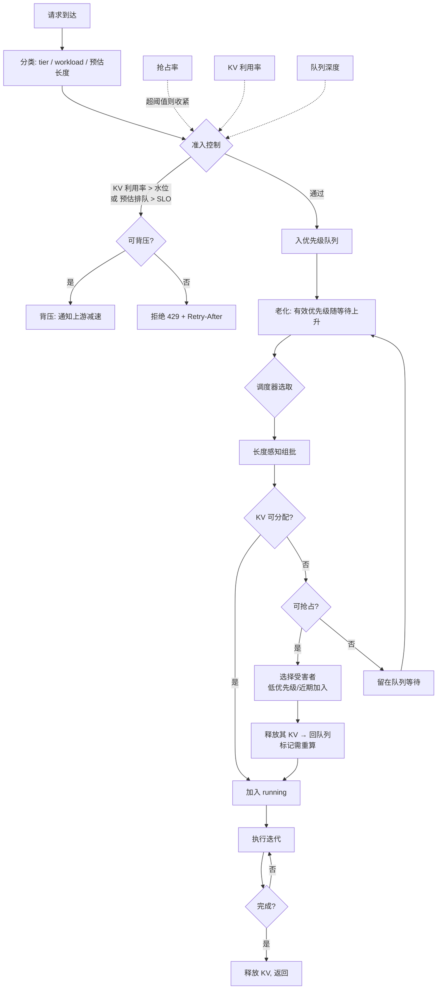

# 请求调度与准入控制

> 位置：[InferenceAtlas](../../INDEX.md) > [模块 03](README.md) > 当前文档
> 信息截至：2026-07-29 ｜ 最后核验：2026-07-29 ｜ 内容版本：v0.1
> 时效性等级：低
> 相关主题：[排队论](../01_foundations_and_metrics/03_queueing_theory_for_inference.md)｜[批处理](02_static_dynamic_and_continuous_batching.md)｜[多租户 QoS](06_multi_tenant_isolation_and_qos.md)

## 本章导读

准入控制是推理系统中最容易被省略、也最不该被省略的组件。省略它的系统在正常负载下工作良好，在过载时进入一种**无法自行恢复**的退化状态：排队积压 → KV 压力 → 抢占重算 → 服务时间方差增大 → 排队进一步积压。

这个正反馈回路是 [模块 01 第 3 章](../01_foundations_and_metrics/03_queueing_theory_for_inference.md) 分析过的机制。本章给出它的工程解法：在入口处限制进入速率，使系统利用率维持在经济上限以下。

本章还处理调度策略的选择——FIFO、优先级、deadline-aware、长度感知——以及它们各自解决什么问题、引入什么新问题。**没有一种调度策略在所有维度上占优**，选择取决于 SLO 的结构。

## 学习目标

读完本章后，读者应能够：

1. 说明准入控制为什么是必需而非可选；
2. 比较五种调度策略的适用场景与副作用；
3. 设计一套包含准入、优先级、老化与背压的完整调度方案；
4. 诊断饥饿、优先级倒置与过载不可恢复三类问题。

## 核心结论

- **准入控制是必需的**。没有它，过载后系统进入正反馈退化，流量降回正常也无法自愈。
- **调度策略的选择由 SLO 结构决定**：单一 SLO 用 FIFO 足够；分层 SLO 需要优先级；混合长度需要长度感知。
- **优先级会引入饥饿**，必须配合老化（aging）机制。
- **背压优于丢弃**：把压力回传给上游让其减速，比在入口大量拒绝更平滑。

## 1. 问题定义、系统边界与工作负载

### 1.1 调度器要做的三个决策

| 决策 | 问题 | 影响 |
|---|---|---|
| **是否接纳** | 新请求进不进系统 | 可用性 vs 时延稳定性 |
| **接纳谁** | 队列中先服务哪个 | 公平性、tier SLO |
| **是否抢占** | 显存不足时牺牲谁 | P99、重算成本 |

三者相互耦合：宽松的准入会增加抢占；激进的优先级会造成饥饿；频繁抢占会增大方差进而恶化排队。**必须作为一个整体设计**。

### 1.2 过载的正反馈

```text
到达率超过服务能力
  → 队列积压
  → 更多请求被接纳（若无准入控制）
  → KV 显存压力上升
  → 触发抢占
  → 被抢占请求需重算
  → 有效服务能力下降 + 服务时间方差增大
  → 队列进一步积压   ← 回到起点
```

**关键性质**：这个回路的增益大于 1，因此**即使外部流量降回正常水平，系统也可能停留在退化状态**——因为重算负担本身在维持这个循环。

**唯一可靠的打破方式是在入口切断**：拒绝或延迟接纳新请求，让系统消化积压。这就是准入控制的作用。

## 2. 原理、数学与性能模型

### 2.1 准入控制的判据

**目标**：使利用率 $\rho$ 维持在经济上限 $\rho^{max}$ 以下。由 [模块 01 第 3 章](../01_foundations_and_metrics/03_queueing_theory_for_inference.md)：

$$
\rho^{max} \approx \frac{2 W_q^{max}}{2 W_q^{max} + E[S](1+C_S^2)}
$$

**实践中的可观测代理指标**（比直接估算 $\rho$ 更可靠）：

| 代理指标 | 阈值含义 | 优点 |
|---|---|---|
| **队列深度** | 超过阈值即拒绝 | 简单、直接反映积压 |
| **预估排队时延** | 队列深度 × 平均服务时间 | 与 SLO 直接对应 |
| **KV 块利用率** | 超过安全水位即拒绝 | 直接防止抢占 |
| **抢占率** | 非零即收紧 | thrashing 的先行信号 |

**建议组合**：**KV 块利用率 + 预估排队时延**。前者防止显存侧退化，后者防止时延侧违约。单用队列深度不够，因为它不反映显存压力。

### 2.2 五种调度策略

| 策略 | 机制 | 优点 | 副作用 |
|---|---|---|---|
| **FIFO** | 先到先服务 | 公平、无饥饿、实现简单 | 队头阻塞；无法区分 tier |
| **优先级** | 高优先级先服务 | 支持分层 SLO | **低优先级饥饿** |
| **Deadline-aware** | 按剩余时间预算排序 | 直接优化 SLO 达成率 | 需要估算服务时间 |
| **长度感知** | 按预估长度分组或排序 | 降低 $C_S$，改善 P99 | 需预估长度；可能不公平 |
| **公平调度** | 按租户配额轮转 | 多租户隔离 | 峰值利用率下降 |

**组合使用是常态**：例如"优先级分层 + 层内 FIFO + 老化防饥饿 + 长度感知组批"。

### 2.3 老化机制

优先级调度会使低优先级请求无限期等待。**老化**（aging）通过随等待时间提升有效优先级来解决：

$$
\text{有效优先级} = \text{基础优先级} + \alpha \times \text{等待时间}
$$

**参数 $\alpha$ 的含义**：等待多久相当于提升一级优先级。它直接决定了低优先级请求的最坏等待时间上界。

**设计要点**：$\alpha$ 应由**低优先级的 SLO** 反推，而非随意设定。若低优先级承诺"P95 在 X 秒内开始服务"，则 $\alpha$ 需保证在 X 秒内其有效优先级能超过常见的高优先级请求。

### 2.4 背压

**拒绝**（返回 429）与**背压**（让上游减速）的区别：

| 方式 | 机制 | 适用 |
|---|---|---|
| 拒绝 | 立即返回错误 | 无状态客户端、可重试 |
| **背压** | 减慢接受速率、通知上游 | 有连接的客户端、内部服务调用 |
| 排队 + 超时 | 接纳但可能超时 | 短时突发 |

**背压优于拒绝的原因**：拒绝会引发客户端重试，重试又增加负载——这是另一个正反馈。背压让上游主动减速，避免了重试风暴。

**实现方式**：流式协议中减慢读取速率、HTTP/2 的流控、或显式返回"请稍后重试并附带建议等待时间"。

## 3. 实现机制与系统设计

### 3.1 完整调度流程



**图展示什么**：从请求到达到完成的完整调度路径，含准入、背压、老化、抢占四个控制点，以及三个反馈到准入控制的观测信号。

**核心瓶颈在哪**：`准入控制` 是全图唯一能打破过载正反馈的位置。图右侧三条虚线反馈（抢占率、KV 利用率、队列深度）构成了它的输入——**缺少这些反馈的准入控制是盲目的**，只能靠固定阈值，无法适应负载变化。

**图中的 trade-off**：`可背压?` 分支体现了背压优于拒绝的偏好；`可抢占?` 分支体现了"牺牲已接纳请求的时延"与"让新请求等待"之间的选择。抢占看似能提高吞吐，但其重算成本与方差增大会反向作用于准入控制的输入指标。

**面试如何引用**：被问到"过载时系统为什么不能自行恢复"或"如何做准入控制"时，用这张图指出正反馈回路以及准入控制作为唯一断点的位置，并说明三个反馈信号。能指出"抢占是双刃剑"是加分点。

### 3.2 伪代码：准入控制器

```text
参数:
    kv_watermark        KV 块利用率上限（如 0.85）
    queue_delay_slo     预估排队时延上限
    preempt_rate_limit  抢占率上限
    backpressure_enabled

状态（滑动窗口统计）:
    avg_service_time    平均服务时间
    preempt_rate        最近窗口的抢占率

函数 准入判定(request):
    # 1. 显存侧：防止进入 thrashing
    若 kv.利用率() > kv_watermark:
        返回 拒绝("KV 压力")

    # 2. 时延侧：防止 SLO 违约
    预估排队 ← 队列深度() × avg_service_time / 有效并发()
    若 预估排队 > queue_delay_slo[request.tier]:
        返回 拒绝("排队超 SLO")

    # 3. 退化侧：抢占率非零说明已在临界
    若 preempt_rate > preempt_rate_limit:
        返回 拒绝("系统退化中")

    # 4. 租户配额
    若 租户用量(request.tenant) > 配额(request.tenant):
        返回 拒绝("配额超限")

    返回 接纳

函数 处理拒绝(request, 原因):
    若 backpressure_enabled 且 request.来自内部服务:
        发送背压信号(request.上游)        # 优于直接拒绝，避免重试风暴
        返回 延迟接纳
    否则:
        建议等待 ← 估算恢复时间()
        返回 HTTP 429, Retry-After: 建议等待
```

**四个判据的分工**：显存侧防止 thrashing、时延侧保证 SLO、退化侧作为兜底、配额侧保证多租户公平。**任何一条单独使用都不够**——例如只看队列深度会漏掉显存压力，只看显存会漏掉长队列。

### 3.3 抢占受害者的选择

当必须抢占时，选择策略影响很大：

| 策略 | 依据 | 优点 | 缺点 |
|---|---|---|---|
| 最近加入 | LIFO | 已完成工作少，重算便宜 | 新请求持续被抢，可能饥饿 |
| 最低优先级 | tier | 保护高优先级 SLO | 低优先级体验差 |
| 剩余最长 | 预估剩余 | 释放资源多 | 长请求可能永远完不成 |
| **已完成最少** | 已生成 token 数 | **重算成本最低** | 需跟踪进度 |

**推荐组合**：优先级为第一排序键，"已完成最少"为第二排序键。这样既保护 tier SLO，又在同层内最小化重算浪费。

**必须配合的机制**：被抢占次数上限。若某请求被反复抢占，应提升其优先级或直接失败返回，而非无限循环——后者是资源的纯浪费。

## 4. 性能、成本、能耗与可靠性 trade-off

| 参数 | 收紧的效果 | 放松的效果 |
|---|---|---|
| KV 水位 | P99 稳定、拒绝率↑ | 吞吐↑、抢占↑、P99↑ |
| 排队时延阈值 | SLO 达成率↑、拒绝率↑ | 可用性↑、SLO 风险↑ |
| 老化系数 $\alpha$ | 低优先级等待↓、高优先级 SLO 风险↑ | 高优先级优先、低优先级饥饿风险↑ |
| 抢占次数上限 | 避免浪费、失败率↑ | 尽力完成、可能空转 |
| 租户配额 | 隔离性↑、峰值利用率↓ | 利用率↑、干扰风险↑ |

**核心张力**：**可用性与时延稳定性直接对立**。准入控制的每一次拒绝都是用可用性换时延。这个交换比应由产品决定：交互式服务通常宁可拒绝也要保时延，批量服务通常宁可排队也要保接纳。

**这也是分层 SLO 的价值**：它允许对不同 tier 采用不同的交换比，而非全局取一个折中值。

## 5. benchmark、真实案例或公开部署案例

| 公开结论 | 来源 |
|---|---|
| 迭代级调度使请求可动态进出批次，是调度器与 KV 管理协同的基础 | [Orca, OSDI 2022](https://www.usenix.org/conference/osdi22/presentation/yu) |
| 分页 KV 使抢占与恢复在显存层可行；KV 压力直接影响可并发数 | [PagedAttention, SOSP 2023](https://arxiv.org/abs/2309.06180) |
| 排队时延随利用率按 $\rho/(1-\rho)$ 发散，服务时间方差通过 $(1+C_S^2)$ 放大 | 排队论经典结果，见 [模块 01 第 3 章](../01_foundations_and_metrics/03_queueing_theory_for_inference.md) |

> 具体的水位阈值、老化系数、抢占策略参数依赖 workload 与 SLO，必须实测标定。本库不给出无来源的推荐值。`待核实`

## 6. 设计决策框架

1. 明确 SLO 结构：单一还是分层；
2. 若分层，为每层定义排队时延阈值与拒绝行为；
3. **实现准入控制**（不可省略），至少覆盖显存侧与时延侧两个判据；
4. 建立三个反馈信号：KV 利用率、队列深度、抢占率；
5. 选择调度策略：单一 SLO → FIFO；分层 → 优先级 + 老化；混合长度 → 加长度感知；
6. 若用优先级，**由低优先级 SLO 反推老化系数**；
7. 定义抢占受害者选择规则与次数上限；
8. 优先实现背压而非直接拒绝（对内部调用尤其重要）；
9. 压测过载场景，验证系统能在流量回落后自行恢复；
10. 监控：拒绝率、排队时延分布、抢占率、各 tier SLO 达成率。

**第 9 步经常被跳过**。正常负载下的压测无法暴露过载不可恢复的问题——必须专门做过载后回落的测试。

## 7. 常见失败模式与排查路径

| 失败模式 | 表现 | 根因 | 纠正 |
|---|---|---|---|
| 过载后不可恢复 | 流量回落仍积压 | 无准入控制，正反馈 | 加准入控制 |
| 拒绝引发重试风暴 | 拒绝后负载反而上升 | 客户端立即重试 | 背压 + Retry-After |
| 低优先级饥饿 | 低 tier 请求超时 | 优先级无老化 | 加老化机制 |
| 反复抢占同一请求 | 资源空转 | 无抢占次数上限 | 设上限并提升优先级 |
| 只看队列深度 | 显存侧退化未被发现 | 单一判据 | 加 KV 利用率判据 |
| 抢占率高但未告警 | P99 悄悄恶化 | 缺监控 | 抢占率纳入告警 |
| 优先级倒置 | 高优先级被低优先级阻塞 | 资源已被占用 | 支持抢占 |
| 准入阈值固定 | 负载变化后失效 | 无反馈 | 基于观测信号动态调整 |
| 未测过载恢复 | 生产事故时才发现 | 压测不覆盖 | 专门测过载回落 |

## 8. 关联面试主题

1. **为什么准入控制是必需的** → 本章 1.2、2.1
2. **五种调度策略的适用场景与副作用** → 本章 2.2
3. **优先级调度如何避免饥饿** → 本章 2.3
4. **背压与拒绝的区别，为什么前者更好** → 本章 2.4
5. **抢占受害者如何选择** → 本章 3.3

## 9. 小结

调度器要做三个耦合的决策：是否接纳、接纳谁、是否抢占。准入控制是其中最不可省略的一环——没有它，过载会触发"积压 → KV 压力 → 抢占 → 重算 → 方差增大 → 更多积压"的正反馈，使系统在流量回落后仍无法自愈。准入判据应至少覆盖显存侧（KV 利用率）与时延侧（预估排队时延），并以抢占率作为退化的先行信号。调度策略的选择由 SLO 结构决定：单一 SLO 用 FIFO，分层 SLO 需优先级配合老化以防饥饿，混合长度需长度感知以降低方差。背压优于直接拒绝，因为拒绝会引发重试风暴——另一个正反馈。抢占受害者应按"优先级 + 已完成最少"选择并设次数上限。**过载回落测试必须专门做**，正常负载压测无法暴露不可恢复问题。

## 关键术语

| 中文术语 | 英文 | 定义 | 单位/口径 | 关联文档 |
|---|---|---|---|---|
| 准入控制 | admission control | 入口处限制进入速率以保护已接纳请求 | — | 本章 2.1 |
| 背压 | backpressure | 把拥塞信号回传上游使其减速 | — | 本章 2.4 |
| 老化 | aging | 有效优先级随等待时间提升 | — | 本章 2.3 |
| 安全水位 | safety watermark | 触发拒绝或抢占的 KV 利用率阈值 | % | 本章 2.1 |
| 优先级倒置 | priority inversion | 高优先级被低优先级持有的资源阻塞 | — | 本章 7 |
| 过载不可恢复 | non-self-recovering overload | 流量回落后系统仍停留在退化状态 | — | 本章 1.2 |

## 延伸阅读

- [06 多租户隔离与 QoS](06_multi_tenant_isolation_and_qos.md) —— 配额与公平调度
- [12 服务事故手册](12_serving_incident_playbook.md) —— 过载事故的处置流程
- [模块 01 第 3 章：排队论](../01_foundations_and_metrics/03_queueing_theory_for_inference.md) —— 正反馈的定量分析

## 主要来源

| # | 来源 | 类型 | 披露等级 | 核验日期 |
|---:|---|---|---|---|
| 1 | [Orca (OSDI 2022)](https://www.usenix.org/conference/osdi22/presentation/yu) | 会议论文 | 独立可复现实验 | 2026-07-29 |
| 2 | [PagedAttention (SOSP 2023)](https://arxiv.org/abs/2309.06180) | 会议论文 | 独立可复现实验 | 2026-07-29 |

> **说明**：第 3.2 节伪代码与第 3.3 节的抢占策略建议为**本库综合排队论结论与公开工程实践提出的教学方案**，具体阈值参数必须按实际 workload 与 SLO 实测标定。

## 更新记录

| 日期 | 版本 | 变更 | 核验人 |
|---|---|---|---|
| 2026-07-29 | v0.1 | 初稿 | — |
