# Prefill/Decode 调度与 Chunked Prefill

> 位置：[InferenceAtlas](../../INDEX.md) > [模块 03](README.md) > 当前文档
> 信息截至：2026-07-29 ｜ 最后核验：2026-07-29 ｜ 内容版本：v0.1
> 时效性等级：低
> 相关主题：[prefill vs decode](../02_transformer_and_kv_cache/02_prefill_vs_decode.md)｜[批处理](02_static_dynamic_and_continuous_batching.md)｜[Disaggregation](../06_distributed_and_moe_inference/)

## 本章导读

Continuous batching 解决了"等批内最长请求"的问题，但引入了一个新问题：**新请求的 prefill 会占据整个迭代，使同批正在 decode 的请求停顿**。用户感知到的现象是——输出流畅进行时突然卡顿一下，然后继续。

这个现象的根源是两阶段的计算量差异。一次 decode 迭代只处理批中每序列 1 个 token，而一次 prefill 可能处理数千个 token。把它们放进同一次迭代，后者的耗时会主导整个迭代。

Chunked prefill 的解法很直接：把长 prefill 切成小块，每次迭代只处理一块，与 decode 交错执行。这把一次大停顿换成了多次小延迟——**总时间没有减少，但分布变平滑了**。

## 学习目标

读完本章后，读者应能够：

1. 量化 prefill 阻塞对同批 decode 请求 ITL 的影响；
2. 说明 chunked prefill 的机制与 chunk 大小的权衡；
3. 设计一个 token 预算式的混合调度策略；
4. 判断何时 chunked prefill 不够、需要物理分离。

## 核心结论

- **一次未分块的长 prefill 会使同批所有 decode 请求停顿一个 prefill 的时长**，这是 ITL 尖峰的主要来源。
- **Chunked prefill 把一次大停顿换成多次小延迟**：ITL 分布变平滑，代价是长请求自身的 TTFT 上升。
- **实现方式是 token 预算**：每次迭代设定一个总 token 上限，decode 请求优先占位，剩余预算给 prefill。
- **Chunk 大小是核心参数**：过大则平滑效果不足，过小则 prefill 效率下降（算术强度降低）。

## 1. 问题定义、系统边界与工作负载

### 1.1 阻塞的机制

一次迭代的耗时由该次迭代处理的 token 总数决定（近似）。

| 迭代构成 | 处理的 token 数 | 相对耗时 |
|---|---|---|
| 纯 decode，批 $B$ | $B$ | 基准 $t_d$ |
| decode + 一个长 prefill | $B + S_{in}$ | 约 $t_d \times (B + S_{in})/B$ |

**当 $S_{in} \gg B$ 时**（长 prompt、中等批），这次迭代的耗时可以是正常迭代的数十倍。

**对 decode 请求的影响**：它们在这次迭代中只前进了 1 个 token，却等了数十个正常迭代的时间。这直接表现为 ITL 的一个尖峰。

### 1.2 影响的分布形态

| 场景 | ITL 分布特征 |
|---|---|
| 无长 prompt | 集中，方差小 |
| 偶发长 prompt | 大部分正常 + **少数极端尖峰** |
| 频繁长 prompt | 整体抬升 + 频繁尖峰 |

**诊断价值**：ITL 分布的形状能直接指认问题。若 P50 正常而 P99 极高且呈现离散的尖峰，几乎可以确定是 prefill 阻塞；若整体均匀抬升，则更可能是批内长序列干扰或带宽饱和。

## 2. 原理、数学与性能模型

### 2.1 Token 预算模型

Chunked prefill 的实现基于一个简单的约束：**每次迭代处理的 token 总数不超过预算 $T_{budget}$**。

$$
\underbrace{B_{decode}}_{\text{每个 decode 请求 1 token}} + \underbrace{\sum_{i} c_i}_{\text{各 prefill 请求本次的 chunk}} \le T_{budget}
$$

**分配顺序**（关键设计）：

1. 先给所有正在 decode 的请求各分配 1 个 token 的额度；
2. 剩余预算 $T_{budget} - B_{decode}$ 分配给 prefill 请求；
3. 若剩余预算为 0，则本次迭代无 prefill 进展。

**这个顺序保证了 decode 不被饿死**——decode 请求总能每次迭代前进一步，ITL 有上界。

### 2.2 Chunk 大小的权衡

有效 chunk 大小 $c = T_{budget} - B_{decode}$。

| $T_{budget}$ | 对 decode 的影响 | 对 prefill 的影响 |
|---|---|---|
| 大 | ITL 尖峰仍明显 | prefill 快、算术强度高 |
| 小 | ITL 平滑 | **prefill 慢、TTFT 上升** |

**为什么小 chunk 降低 prefill 效率**：由 [模块 02 第 1 章](../02_transformer_and_kv_cache/01_transformer_inference_from_first_principles.md)，prefill 的算术强度约为 $2 \times (\text{本次处理 token 数}) / b_w$。chunk 越小，这次迭代的算术强度越低，越接近 memory-bound，硬件效率下降。

**因此存在一个下界**：chunk 不应小到使 prefill 退化为 memory-bound。实践中 $T_{budget}$ 应显著大于典型的 $B_{decode}$，以留出足够的 prefill 额度。

**注意力的额外考量**：chunked prefill 中，后面的 chunk 需要对前面 chunk 已写入的 KV 做注意力。因此切分不改变总计算量（不同于减少工作量的优化），只改变其时间分布。

### 2.3 TTFT 与 ITL 的交换

**未分块**：长请求 TTFT 短（一次算完），但同批 decode 请求 ITL 出现尖峰。

**分块后**：长请求 TTFT 上升（需多次迭代才完成 prefill），同批 decode 请求 ITL 平滑。

$$
\Delta \text{TTFT}_{\text{长请求}} \approx (\text{chunk 数} - 1) \times (\text{等待其他 decode 的时间})
$$

**这是一个明确的交换**：牺牲少数长请求的 TTFT，换取多数 decode 请求的 ITL 稳定。

**何时这个交换划算**：当 decode 请求数远多于长 prefill 请求数时（典型的交互式服务）。当长请求占多数时（如批量文档处理），分块的收益就不明显了。

## 3. 实现机制与系统设计

### 3.1 混合调度的执行时序

```mermaid
flowchart TD
    subgraph "未分块：一次大停顿"
    A1["迭代 n: B 个 decode (快)"] --> A2["迭代 n+1: B 个 decode + 完整 prefill (慢 N 倍)"]
    A2 --> A3["迭代 n+2: B+1 个 decode (快)"]
    A3 --> A4["ITL 分布: 大部分正常 + 一个极端尖峰"]
    end

    subgraph "Chunked Prefill：多次小延迟"
    B1["迭代 n: decode×B + chunk1"] --> B2["迭代 n+1: decode×B + chunk2"]
    B2 --> B3["迭代 n+2: decode×B + chunk3"]
    B3 --> B4["迭代 n+3: decode×(B+1)"]
    B4 --> B5["ITL 分布: 略微抬升但平滑<br/>长请求 TTFT 上升"]
    end

    subgraph "Token 预算分配"
    C1["T_budget"] --> C2["先分配: 每个 decode 请求 1 token"]
    C2 --> C3["剩余 = T_budget − B_decode"]
    C3 --> C4{剩余 > 0?}
    C4 -- 是 --> C5["分配给 prefill 队列<br/>可跨多个请求"]
    C4 -- 否 --> C6["本次迭代无 prefill 进展<br/>（decode 优先，不饿死）"]
    end
```



**图展示什么**：未分块与分块两种执行时序的对比，以及 token 预算的分配顺序。

**核心瓶颈在哪**：`剩余 = T_budget − B_decode` 这一步是关键。当 $B_{decode}$ 接近 $T_{budget}$ 时，留给 prefill 的额度接近零，**新请求的 TTFT 会急剧恶化**——系统忙于 decode 而无法接纳新工作。这是 chunked prefill 的一个失效模式，需要通过调大 $T_{budget}$ 或限制 $B_{decode}$ 来避免。

**图中的 trade-off**：右侧的 `decode 优先，不饿死` 保证了 ITL 上界，但代价正是上述的 prefill 饥饿风险。二者不能同时完全满足，必须通过参数在其间取平衡。

**面试如何引用**：被问到"长 prompt 影响其他请求怎么办"时，讲 chunked prefill 的 token 预算机制，并**主动指出它的失效模式**（decode 占满预算导致 prefill 饥饿）。这个反向思考通常能区分是否真正实践过。

### 3.2 伪代码：Token 预算调度

```text
参数:
    T_budget            每次迭代的 token 预算
    max_decode_share    decode 最多占用的预算比例（如 0.8），防止 prefill 饥饿

每次迭代:
    # 1. decode 请求优先，但设上限
    decode_quota ← min(len(running_decode), floor(T_budget × max_decode_share))
    选中的decode ← running_decode 中前 decode_quota 个   # 按优先级排序
    used ← decode_quota

    # 2. 剩余预算给 prefill
    remaining ← T_budget − used
    prefill_chunks ← 空列表
    对 r in running_prefill（按优先级）:
        若 remaining ≤ 0: 跳出
        r_剩余token ← r.总输入长度 − r.已prefill长度
        chunk ← min(r_剩余token, remaining)
        prefill_chunks.追加((r, chunk))
        r.已prefill长度 ← r.已prefill长度 + chunk
        remaining ← remaining − chunk

    # 3. 执行混合批
    输出 ← 模型.前向(选中的decode ∪ prefill_chunks)

    # 4. 完成 prefill 的请求转入 decode 阶段
    对 (r, _) in prefill_chunks:
        若 r.已prefill长度 == r.总输入长度:
            running_prefill.移除(r)
            running_decode.加入(r)
            发送首token(r)                  # TTFT 在此刻确定

    # 5. 未被本次选中的 decode 请求记录等待
    对 r in running_decode 且 r 不在 选中的decode:
        r.连续未调度次数 ← r.连续未调度次数 + 1
        若 r.连续未调度次数 > 阈值:
            提升 r 的调度优先级              # 防止长期不被选中
```

**三个设计要点**：

1. **`max_decode_share` 是防止 prefill 饥饿的关键**。没有它，高并发 decode 会完全挤占预算，新请求永远无法开始；
2. **步骤 4 中首 token 在 prefill 完成时发送**——这就是为什么 chunked prefill 会推高长请求的 TTFT；
3. **步骤 5 的连续未调度计数**处理了 $B_{decode} > $ 配额时的公平性，避免部分 decode 请求被持续跳过。

### 3.3 何时 chunked prefill 不够

Chunked prefill 平滑了干扰，但没有消除资源画像的失配：**prefill 需要算力、decode 需要带宽，二者仍在同一硬件上竞争**。

**需要考虑物理分离（disaggregation）的信号**：

| 信号 | 含义 |
|---|---|
| prefill 与 decode 的资源需求比例长期严重失配 | 单一硬件必然在一侧浪费 |
| 调大 $T_{budget}$ 改善 TTFT 但恶化 ITL，反之亦然 | 已在 Pareto 前沿上，无法两全 |
| 规模足够大 | 迁移开销与双池运维可被摊薄 |
| 网络带宽充裕 | KV 迁移不会成为新瓶颈 |

**四条都满足才考虑分离**。只满足前两条时，分离的复杂度通常得不偿失——详见 [模块 06](../06_distributed_and_moe_inference/) 与 [模块 00 第 4 章](../00_start_here/04_how_to_design_an_inference_system.md) 3.4 节。

## 4. 性能、成本、能耗与可靠性 trade-off

| 参数 | 增大的效果 | 减小的效果 |
|---|---|---|
| $T_{budget}$ | prefill 快、TTFT↓；ITL 尖峰↑ | ITL 平滑；TTFT↑、prefill 效率↓ |
| `max_decode_share` | decode ITL 稳定；prefill 饥饿风险↑ | prefill 及时；decode ITL↑ |
| 最大批大小 | 吞吐↑；预算被 decode 挤占 | prefill 额度充足；吞吐↓ |

**三者耦合**：增大批会挤占 prefill 额度，因此调大批时通常需要同步调大 $T_{budget}$，否则 TTFT 会恶化。**这三个参数应当一起调优，而非独立设置**——这是实践中容易出错的地方。

## 5. benchmark、真实案例或公开部署案例

| 公开结论 | 来源 |
|---|---|
| 迭代级调度与 selective batching 使变长序列可共存于同一批次 | [Orca, OSDI 2022](https://www.usenix.org/conference/osdi22/presentation/yu) |
| prefill 与 decode 的算术强度差异约为输入长度倍数 | 见 [模块 02 第 2 章](../02_transformer_and_kv_cache/02_prefill_vs_decode.md) 的推导 |
| vLLM、SGLang 等引擎提供 chunked prefill 相关配置 | 各项目官方文档，`开源代码/配置披露`；具体参数名与默认值随版本变化 `待核实` |

> Chunked prefill 的原始系统工作（如 Sarathi 系列）及其实测数据，将在 [模块 13](../13_research_papers_and_technical_reports/) 逐篇核验一手来源后录入 [`papers.csv`](../../data/papers.csv)。本章不引用未核验的论文编号与数字。`待核实`

## 6. 设计决策框架

1. 先确认 ITL 分布确实存在尖峰（而非均匀抬升）——用分位数而非均值判断；
2. 确认尖峰与新请求到达时刻相关（可用 trace 关联）；
3. 启用 chunked prefill；
4. **三参数联合调优**：$T_{budget}$、`max_decode_share`、最大批大小；
5. 优化目标用 goodput，同时观察 TTFT 与 ITL 两个分布；
6. 检查是否出现 prefill 饥饿（新请求 TTFT 异常升高）；
7. 若调参无法同时满足 TTFT 与 ITL 的 SLO，检查是否已在 Pareto 前沿；
8. 若已在前沿且规模与网络条件满足，才评估物理分离；
9. 监控：ITL 分位数、TTFT 分位数、每次迭代的 prefill/decode token 占比。

**第 9 项的最后一条常被忽略**：监控每次迭代中 prefill 与 decode 各占多少 token，能直接看出预算是否被一方挤占。

## 7. 常见失败模式与排查路径

| 失败模式 | 表现 | 根因 | 纠正 |
|---|---|---|---|
| ITL 周期性尖峰 | 用户感知卡顿 | prefill 未分块 | 启用 chunked prefill |
| 启用后 TTFT 恶化 | 新请求响应慢 | chunk 过小或 decode 挤占 | 调大 $T_{budget}$ |
| prefill 饥饿 | 新请求长时间无首 token | `max_decode_share` 过高 | 下调该比例 |
| 分块后吞吐下降 | 整体变慢 | chunk 太小，prefill 变 memory-bound | 增大 chunk |
| 调批大小后 TTFT 突变 | 参数改动副作用 | 三参数耦合未同步调 | 联合调优 |
| 部分 decode 请求被持续跳过 | 少数请求 ITL 极高 | 无连续未调度保护 | 加计数与优先级提升 |
| 只看均值 ITL | 尖峰不可见 | 均值掩盖分布 | 看 P95/P99 |
| 过早做分离 | 复杂度暴增收益有限 | 未先穷尽调参 | 先确认在 Pareto 前沿 |

## 8. 关联面试主题

1. **长 prompt 为什么会影响其他请求的 ITL** → 本章 1.1
2. **chunked prefill 的机制与代价** → 本章 2.1–2.3
3. **token 预算如何分配，为什么 decode 优先** → 本章 3.2
4. **chunked prefill 的失效模式是什么** → 本章 3.1、7
5. **何时 chunked prefill 不够、需要分离** → 本章 3.3

## 9. 小结

Continuous batching 引入的新问题是 prefill 阻塞 decode：一次未分块的长 prefill 会使同批所有 decode 请求停顿一个 prefill 的时长，表现为 ITL 分布中的离散尖峰。Chunked prefill 通过 token 预算把一次大停顿换成多次小延迟——总计算量不变，但分布变平滑。实现的关键是分配顺序：decode 请求优先各得 1 个 token 额度（保证 ITL 上界），剩余预算给 prefill；同时必须设 `max_decode_share` 上限防止 prefill 饥饿。Chunk 大小存在下界：过小会使 prefill 退化为 memory-bound，效率下降。$T_{budget}$、`max_decode_share`、最大批大小三个参数强耦合，必须联合调优。当调参已无法同时满足 TTFT 与 ITL 的 SLO、且规模与网络条件满足时，才应考虑物理分离——chunked prefill 平滑了干扰，但没有消除两阶段资源画像的根本失配。

## 关键术语

| 中文术语 | 英文 | 定义 | 单位/口径 | 关联文档 |
|---|---|---|---|---|
| 分块预填充 | chunked prefill | 把长 prefill 切块，与 decode 交错执行 | — | 本章 2.1 |
| Token 预算 | token budget | 每次迭代处理的 token 总数上限 | token | 本章 2.1 |
| Decode 份额上限 | max decode share | decode 最多占用的预算比例，防 prefill 饥饿 | % | 本章 3.2 |
| Prefill 饥饿 | prefill starvation | decode 占满预算导致新请求无法开始 | — | 本章 3.1 |
| ITL 尖峰 | ITL spike | 因 prefill 阻塞造成的离散时延跳变 | ms | 本章 1.2 |

## 延伸阅读

- [02 批处理](02_static_dynamic_and_continuous_batching.md) —— 本章问题的来源
- [模块 02 第 2 章：prefill vs decode](../02_transformer_and_kv_cache/02_prefill_vs_decode.md) —— 两阶段画像差异
- [模块 06：Disaggregation](../06_distributed_and_moe_inference/) —— 物理分离方案

## 主要来源

| # | 来源 | 类型 | 披露等级 | 核验日期 |
|---:|---|---|---|---|
| 1 | [Orca (OSDI 2022)](https://www.usenix.org/conference/osdi22/presentation/yu) | 会议论文 | 独立可复现实验 | 2026-07-29 |
| 2 | [PagedAttention (SOSP 2023)](https://arxiv.org/abs/2309.06180) | 会议论文 | 独立可复现实验 | 2026-07-29 |
| 3 | [vLLM 官方仓库](https://github.com/vllm-project/vllm) | 开源项目 | 开源代码/配置披露 | 2026-07-29 |

> **说明**：chunked prefill 的原始学术工作及其实测数据尚未在本库核验，正文中已标注 `待核实`，将在模块 13 补入。第 3.2 节伪代码为**本库编写的教学版本**。

## 更新记录

| 日期 | 版本 | 变更 | 核验人 |
|---|---|---|---|
| 2026-07-29 | v0.1 | 初稿 | — |
