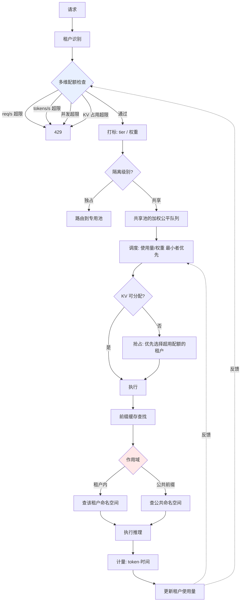

# 多租户隔离与 QoS

> 位置：[InferenceAtlas](../../INDEX.md) > [模块 03](README.md) > 当前文档
> 信息截至：2026-07-29 ｜ 最后核验：2026-07-29 ｜ 内容版本：v0.1
> 时效性等级：低
> 相关主题：[调度与准入控制](04_request_scheduling_and_admission_control.md)｜[SLO 设计](../01_foundations_and_metrics/02_latency_throughput_and_slo.md)｜[安全](../11_benchmarking_reliability_and_observability/)

## 本章导读

多租户推理服务的核心难题是：**共享资源带来成本优势，但也带来相互干扰与信息泄露两类风险**。完全隔离（每租户独占实例）消除了风险但放弃了成本优势；完全共享成本最低但一个租户的行为会直接影响其他租户的体验。

本章处理三个层次的隔离：**性能隔离**（一个租户的负载不应恶化他人的 SLO）、**容量隔离**（一个租户不应耗尽共享资源）、**信息隔离**（一个租户不应能推断他人的数据）。

第三层在 LLM 推理中尤其特殊：前缀缓存这个重要的性能优化，天然是一个跨请求的信息通道。这使得"是否共享缓存"成为一个安全决策而非纯性能决策。

## 学习目标

读完本章后，读者应能够：

1. 区分性能、容量、信息三类隔离，并说明各自的实现手段；
2. 设计一套配额 + 优先级 + 公平调度的多租户方案；
3. 说明前缀缓存共享的信息泄露风险与缓解方式；
4. 在隔离度与利用率之间做出可辩护的选择。

## 核心结论

- **三类隔离需要不同手段**：性能隔离靠调度、容量隔离靠配额、信息隔离靠作用域划分。
- **前缀缓存跨租户共享是一个信息通道**，可通过时序差异推断他人是否发送过某前缀。默认作用域应为租户内。
- **隔离度与利用率直接对立**。硬隔离（独占实例）浪费余量，软隔离（共享 + 配额）利用率高但需要精细的 QoS 机制。
- **配额必须覆盖多个维度**：请求速率、token 速率、并发数、KV 占用。只限速率不限 KV 无法防止显存被单租户耗尽。

## 1. 问题定义、系统边界与工作负载

### 1.1 三类隔离

| 类型 | 要防止什么 | 主要手段 | 失败后果 |
|---|---|---|---|
| **性能隔离** | 租户 A 的负载恶化租户 B 的时延 | 优先级、公平调度、分池 | SLO 违约 |
| **容量隔离** | 租户 A 耗尽显存/并发额度 | 多维配额、准入控制 | 其他租户被拒绝 |
| **信息隔离** | 租户 A 推断出租户 B 的数据 | 缓存作用域、时序防护 | **安全事件** |

**三者的严重性不同**：前两者是服务质量问题，第三者是安全问题。因此**信息隔离的默认配置应当是保守的**，性能优化不应默认牺牲它。

### 1.2 隔离级别谱

| 级别 | 机制 | 利用率 | 隔离度 |
|---|---|---|---|
| 独占实例 | 每租户专用硬件 | **最低** | **最高** |
| 独占进程 | 共享硬件、独立引擎实例 | 低 | 高 |
| 分池 | 按租户组划分实例池 | 中 | 中 |
| 共享 + 配额 | 单实例服务多租户 | **最高** | 依赖 QoS 机制 |

**选择依据**：合规要求（某些行业要求物理隔离）、租户规模（大租户可专用）、SLO 差异（高 tier 可专用）。多数服务采用**混合模式**：大客户与高敏感场景专用，长尾客户共享。

## 2. 原理、数学与性能模型

### 2.1 多维配额

只限请求速率是不够的。一个租户可以用少量请求消耗大量资源：

| 维度 | 为什么必需 | 不限制的后果 |
|---|---|---|
| **请求速率**（req/s） | 基础限流 | 请求洪泛 |
| **Token 速率**（tokens/s） | 请求数少但每个很长 | 少量长请求耗尽算力 |
| **并发数** | 同时在系统中的请求数 | 占满调度槽位 |
| **KV 占用**（块数或 GB） | 长上下文占用显存 | **显存被单租户耗尽** |
| 最大上下文长度 | 单请求的资源上限 | 极端请求 |
| 最大输出长度 | reasoning 类的不可预测消耗 | 单请求无限消耗 |

**最容易被遗漏的是 KV 占用维度**。一个租户用 10 个 128K 上下文的请求，可能比另一个租户 1000 个短请求占用更多显存。只按请求数分配配额会造成严重不公。

**建议**：以 **token·时间**（token-seconds，即"占用了多少 token 的 KV 多长时间"）作为统一的资源计量单位，它同时反映了长度与时长。

### 2.2 公平调度

**加权公平**：租户 $i$ 的权重为 $w_i$，则其应获得的资源份额为：

$$
\text{share}_i = \frac{w_i}{\sum_j w_j}
$$

**实现方式**：维护每租户的累计资源使用量，调度时优先服务"使用量 / 权重"最小的租户。

**关键设计：空闲资源的分配**。当某租户未用满配额时，其余额应如何处理？

| 策略 | 机制 | 优点 | 缺点 |
|---|---|---|---|
| 硬配额 | 未用则浪费 | 隔离性强、可预测 | **利用率低** |
| 借用 + 可回收 | 允许超用，需要时回收 | **利用率高** | 回收时可能抢占 |
| 借用 + 不可回收 | 允许超用直到自然释放 | 简单 | 恢复慢 |

**推荐"借用 + 可回收"**：它在保证隔离承诺的同时回收了闲置资源。代价是需要支持抢占，且抢占目标应优先选择"正在超用配额的租户"。

### 2.3 前缀缓存的信息通道

**泄露机制**：

1. 租户 A 发送 prompt $P$，其 KV 被缓存；
2. 租户 B 发送相同的 $P$；
3. 若缓存跨租户共享，B 的请求命中缓存，TTFT 显著低于未命中；
4. **B 通过观测 TTFT 即可推断"某人此前发送过 $P$"**。

**危害程度取决于场景**：

| 场景 | 风险 |
|---|---|
| 公共系统提示 | 低（本就公开） |
| 用户上传的文档 | **高**（可探测某文档是否被处理过） |
| 包含标识信息的 prompt | **高** |

**缓解手段**：

| 手段 | 效果 | 代价 |
|---|---|---|
| **作用域限于租户内** | 消除跨租户通道 | 命中率下降 |
| 仅共享显式标记为公共的前缀 | 保留主要收益 | 需要标记机制 |
| 时序归一化（人为延迟命中响应） | 消除时序信号 | 放弃 TTFT 收益 |
| 缓存分区 + 定期清理 | 降低窗口 | 部分缓解 |

**推荐默认配置**：**共享作用域为租户内，另设一个显式的"公共前缀"命名空间用于系统提示等确实公开的内容**。这保留了绝大部分实际收益（系统提示通常是命中的主体）而消除了主要风险。

## 3. 实现机制与系统设计

### 3.1 多租户 QoS 架构

**图展示什么**：多租户 QoS 的完整路径，含多维配额检查、隔离级别路由、加权公平调度、缓存作用域划分与资源计量反馈。

**核心瓶颈在哪**：高亮的两处是设计重点。`多维配额检查` 是容量隔离的入口，遗漏任一维度都会留下绕过通道；`缓存作用域` 是信息隔离的关键决策点——**这是全图唯一的安全性节点，其余都是服务质量节点**。

**图中的 trade-face**：`抢占: 优先选择超用配额的租户` 体现了"借用 + 可回收"策略——它允许闲置资源被借用（提高利用率），但在需要时优先回收超用部分（维持隔离承诺）。代价是抢占带来的重算成本。

**面试如何引用**：被问到"如何做 multi-tenant QoS"时，按三类隔离分别展开，并**主动指出前缀缓存是一个安全边界而非纯性能问题**。多数候选人只讲性能与配额，能识别信息隔离维度会明显区分开。

### 3.2 计量单位的选择

推荐以 **token·秒** 作为统一计量：

$$
\text{资源消耗}_r = \int (\text{请求 } r \text{ 占用的 KV token 数}) \, dt
$$

**为什么它比请求数或 token 数更好**：

| 计量 | 无法反映 |
|---|---|
| 请求数 | 长度差异 |
| Token 数 | 占用时长（长上下文长期驻留） |
| **Token·秒** | — |

**实践简化**：可用「$S \times$ 生存时长」近似，其中 $S$ 为该请求的上下文长度。这个量与它对 KV 显存的实际压力成正比，因此是公平计量的合理代理。

## 4. 性能、成本、能耗与可靠性 trade-off

| 决策 | 利用率 | 隔离度 | 复杂度 |
|---|---|---|---|
| 独占实例 | 最低 | 最高 | 低 |
| 共享 + 硬配额 | 中 | 高 | 中 |
| 共享 + 借用可回收 | **最高** | 中高 | **高** |
| 跨租户缓存共享 | 高（命中率） | **低（信息泄露）** | 低 |
| 租户内缓存 | 中 | 高 | 中 |
| 时序归一化 | 低 | 最高 | 中 |

**核心张力**：**利用率与隔离度直接对立**，且在缓存维度上这个对立涉及安全而非仅性能。

**建议的默认立场**：性能隔离与容量隔离可以按成本考量灵活选择；**信息隔离应当默认从严，只在明确评估后才放宽**。理由是前两者的失败可被观测和补偿，后者的失败往往在事故发生后才被发现。

## 5. benchmark、真实案例或公开部署案例

| 与本章相关的机制性结论 | 来源 |
|---|---|
| 分页 KV 支持跨请求共享与 copy-on-write，是前缀缓存的基础 | [PagedAttention, SOSP 2023](https://arxiv.org/abs/2309.06180) |
| 迭代级调度使不同请求可在同批中共存，是公平调度的执行基础 | [Orca, OSDI 2022](https://www.usenix.org/conference/osdi22/presentation/yu) |
| SGLang 的 RadixAttention 以基数树组织前缀共享 | [SGLang 仓库](https://github.com/sgl-project/sglang)，`开源代码/配置披露` |

> 前缀缓存时序侧信道的学术研究、以及各引擎的缓存作用域默认配置，将在 [模块 11](../11_benchmarking_reliability_and_observability/) 与 [模块 12](../12_open_source_deployment_and_reproduction/) 核验后补入。本章的风险分析基于**机制推理**而非引用具体漏洞报告。`待核实`

## 6. 设计决策框架

1. 明确合规要求（是否强制物理隔离）；
2. 按租户规模与 tier 划分隔离级别（大客户/高敏感专用，长尾共享）；
3. **配额覆盖全部维度**：req/s、tokens/s、并发、KV 占用、最大上下文、最大输出；
4. 选择计量单位（推荐 token·秒）；
5. 选择空闲资源策略（推荐借用 + 可回收）；
6. **决定缓存作用域，默认租户内**；
7. 若需公共前缀共享，建立显式的公共命名空间与准入流程；
8. 评估是否需要时序防护（高敏感场景）；
9. 抢占时优先选择超用配额的租户；
10. 监控：各租户 SLO 达成率、配额使用率、跨租户干扰指标（如某租户负载上升时他人 P99 的变化）。

**第 10 项的最后一条是验证隔离是否有效的直接方法**，但常被忽略。

## 7. 常见失败模式与排查路径

| 失败模式 | 表现 | 根因 | 纠正 |
|---|---|---|---|
| 只限请求速率 | 少量长请求耗尽资源 | 配额维度不全 | 加 token、并发、KV 维度 |
| 未限 KV 占用 | 单租户长上下文耗尽显存 | 遗漏关键维度 | 加 KV 配额 |
| 跨租户缓存默认开启 | 潜在信息泄露 | 未识别为安全边界 | 作用域限租户内 |
| 硬配额无借用 | 利用率低 | 闲置额度浪费 | 借用 + 可回收 |
| 借用不可回收 | 隔离承诺失效 | 无回收机制 | 支持抢占超用者 |
| 用请求数计量 | 长请求租户占便宜 | 计量单位不当 | 用 token·秒 |
| 无跨租户干扰监控 | 隔离失效未被发现 | 缺验证手段 | 监控相关性 |
| 抢占不区分超用 | 守规租户被牺牲 | 抢占策略未接入配额 | 优先抢超用者 |

## 8. 关联面试主题

1. **如何做 multi-tenant QoS** → 本章 3.1
2. **配额应覆盖哪些维度，为什么只限速率不够** → 本章 2.1
3. **前缀缓存的信息泄露风险与缓解** → 本章 2.3
4. **空闲资源如何分配才能兼顾隔离与利用率** → 本章 2.2
5. **如何验证隔离是否真的有效** → 本章 6 第 10 步

## 9. 小结

多租户推理需要三类隔离：性能隔离靠调度与分池、容量隔离靠多维配额、信息隔离靠缓存作用域划分。配额必须覆盖请求速率、token 速率、并发数与 **KV 占用**四个维度——只限速率无法防止单租户用少量长请求耗尽显存；推荐以 token·秒 作为统一计量单位，因为它同时反映长度与占用时长。空闲资源建议采用"借用 + 可回收"策略，在提高利用率的同时维持隔离承诺，代价是需要支持抢占且抢占应优先选择超用配额的租户。**前缀缓存跨租户共享是一个真实的信息通道**：通过 TTFT 差异可推断他人是否发送过某前缀。其默认作用域应为租户内，另设显式的公共前缀命名空间——这保留了主要收益而消除了主要风险。信息隔离与另两类的区别在于：前两者的失败可被观测和补偿，后者往往在事故后才被发现，因此其默认配置应当从严。

## 关键术语

| 中文术语 | 英文 | 定义 | 单位/口径 | 关联文档 |
|---|---|---|---|---|
| 性能隔离 | performance isolation | 防止租户间时延相互影响 | — | 本章 1.1 |
| 容量隔离 | capacity isolation | 防止单租户耗尽共享资源 | — | 本章 1.1 |
| 信息隔离 | information isolation | 防止租户推断他人数据 | — | 本章 1.1 |
| 多维配额 | multi-dimensional quota | 覆盖速率、token、并发、KV 的配额体系 | — | 本章 2.1 |
| Token·秒 | token-seconds | 统一资源计量单位，反映长度与时长 | token·s | 本章 3.2 |
| 借用可回收 | reclaimable borrowing | 允许超用闲置配额但需要时回收 | — | 本章 2.2 |
| 时序侧信道 | timing side channel | 通过响应时延差异推断他人行为 | — | 本章 2.3 |

## 延伸阅读

- [08 前缀缓存](08_prompt_caching_and_prefix_caching.md) —— 缓存机制与命中率
- [04 调度与准入控制](04_request_scheduling_and_admission_control.md) —— 配额执行点
- [模块 11：安全与滥用防护](../11_benchmarking_reliability_and_observability/) —— 完整的安全视角

## 主要来源

| # | 来源 | 类型 | 披露等级 | 核验日期 |
|---:|---|---|---|---|
| 1 | [PagedAttention (SOSP 2023)](https://arxiv.org/abs/2309.06180) | 会议论文 | 独立可复现实验 | 2026-07-29 |
| 2 | [Orca (OSDI 2022)](https://www.usenix.org/conference/osdi22/presentation/yu) | 会议论文 | 独立可复现实验 | 2026-07-29 |
| 3 | [SGLang 官方仓库](https://github.com/sgl-project/sglang) | 开源项目 | 开源代码/配置披露 | 2026-07-29 |

> **说明**：本章第 2.3 节的时序侧信道分析为**基于缓存机制的推理**，不引用任何具体的漏洞报告或攻击实例。相关学术研究待模块 11 核验后补入。

## 更新记录

| 日期 | 版本 | 变更 | 核验人 |
|---|---|---|---|
| 2026-07-29 | v0.1 | 初稿 | — |
