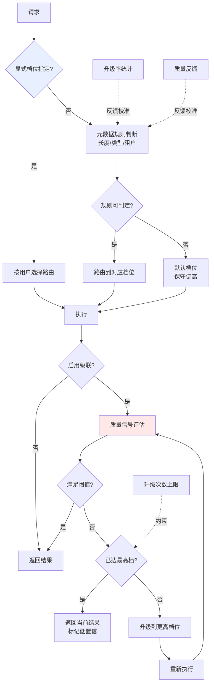

# 模型路由与级联系统

> 位置：[InferenceAtlas](../../INDEX.md) > [模块 03](README.md) > 当前文档
> 信息截至：2026-07-29 ｜ 最后核验：2026-07-29 ｜ 内容版本：v0.1
> 时效性等级：中
> 相关主题：[Serving 架构](01_serving_architecture_overview.md)｜[成本建模](../01_foundations_and_metrics/06_cost_modeling_and_unit_economics.md)｜[网关与路由](../12_open_source_deployment_and_reproduction/)

## 本章导读

不是所有请求都需要最强的模型。一个简单的格式转换请求与一个复杂的多步推理请求，用同一个大模型服务，前者的成本可能是必要成本的十倍以上。

**模型路由**根据请求特征选择合适档位的模型；**级联**则先用小模型尝试，不满意时再升级到大模型。二者都是用"选择的智能"换取成本降低。

核心难点不在机制而在**判据**：如何在不知道答案的情况下判断一个请求需要多强的模型？以及，当判断错误时，代价是什么？本章的重点是让这两个问题的答案变得可计算。

## 学习目标

读完本章后，读者应能够：

1. 区分路由与级联的机制、适用场景与代价结构；
2. 写出级联的期望成本与期望时延公式，并判断其是否划算；
3. 设计路由判据并评估其错误代价；
4. 说明为什么级联在时延敏感场景中通常不适用。

## 核心结论

- **路由是一次性决策，级联是可重试的多次决策**。前者的错误直接体现为质量或成本损失，后者的错误体现为时延增加。
- **级联的期望成本 $= C_{small} + p_{escalate} \times C_{large}$**。只有当 $p_{escalate}$ 足够低时才划算。
- **级联的期望时延近似为 $T_{small} + p_{escalate} \times T_{large}$**，在最坏情况下是两者之和——**因此级联对时延敏感场景通常不适用**。
- **路由判据的质量决定一切**。一个准确率不足的路由器会同时损害成本与质量。

## 1. 问题定义、系统边界与工作负载

### 1.1 两种机制

| | 模型路由 | 级联 |
|---|---|---|
| 决策时机 | 请求到达时**一次** | 小模型输出后**再决定** |
| 依据 | 请求特征（长度、类型、租户、显式标记） | **实际输出的质量信号** |
| 错误代价 | 质量不足或成本浪费 | **时延增加**（需重跑） |
| 适合 | 请求类型可预判 | 质量可事后判断 |
| 时延影响 | 无额外开销 | **可能翻倍** |

### 1.2 典型的档位划分

| 档位 | 适合的请求 |
|---|---|
| 小模型 / 蒸馏模型 | 格式转换、分类、简单抽取、闲聊 |
| 中等模型 | 常规问答、摘要、常见代码补全 |
| 大模型 | 复杂推理、长文档分析、专业领域 |
| Reasoning 模型 | 需要多步推理的困难任务 |

**关键设计问题**：档位之间的边界不是清晰的。同一类任务的难度分布很宽，因此**任何路由判据都会有错误率**——设计必须包含对错误的处理。

## 2. 原理、数学与性能模型

### 2.1 级联的期望成本

设小模型成本 $C_s$、大模型成本 $C_l$、升级概率 $p$：

$$
E[\text{Cost}] = C_s + p \times C_l
$$

**划算条件**（相比全部用大模型）：

$$
C_s + p C_l < C_l \quad \Longleftrightarrow \quad p < 1 - \frac{C_s}{C_l}
$$

**含义**：若小模型成本是大模型的 $1/10$，则升级率需低于 90% 才划算——这个条件通常容易满足。但若小模型成本是大模型的 $1/2$，升级率需低于 50%，条件就苛刻得多。

**因此**：**级联的收益主要来自档位之间足够大的成本差**。相邻档位差距不大时，级联的复杂度不值得。

### 2.2 级联的期望时延

$$
E[T] = T_s + p \times T_l
$$

但**用户感知的是分布而非期望**：

- 未升级的请求（概率 $1-p$）：时延 $T_s$，比直接用大模型更快；
- 升级的请求（概率 $p$）：时延 $T_s + T_l$，**比直接用大模型更慢**。

**P95 的行为**：若 $p > 5\%$，则 P95 时延就是 $T_s + T_l$——**级联恶化了尾时延**。

**这是级联最重要的限制**：它降低了平均成本与平均时延，但**抬高了尾时延**。在有严格 P95/P99 SLO 的交互式场景中，这通常不可接受。

**结论**：**级联更适合成本敏感、时延宽松的场景**（批量处理、异步任务），而非交互式对话。

### 2.3 路由的错误代价

设路由器把请求分到档位 $k$，真实需要的档位为 $k^*$：

| 情况 | 后果 |
|---|---|
| $k > k^*$（路由过高） | 成本浪费，质量无损 |
| $k < k^*$（路由过低） | **质量不足**，可能需人工介入或用户重试 |
| $k = k^*$ | 理想 |

**两类错误的代价不对称**：路由过高只损失成本，路由过低损失质量与用户信任。

**因此路由器应当是"保守的"**：在不确定时倾向选择更高档位。这与分类器设计中的非对称代价问题是同一类，可通过调整决策阈值实现。

**量化**：设路由过低的代价为 $L_{under}$、路由过高的成本浪费为 $L_{over}$，则最优决策阈值应偏向使 $P(\text{过低}) \times L_{under} \approx P(\text{过高}) \times L_{over}$ 的方向。由于通常 $L_{under} \gg L_{over}$，阈值应显著偏保守。

### 2.4 路由判据的来源

| 判据类型 | 可得性 | 准确性 | 成本 |
|---|---|---|---|
| **显式用户选择** | 需产品支持 | 高（用户知道需求） | 零 |
| 请求元数据（长度、类型、来源） | 高 | 中 | 零 |
| 关键词/规则 | 高 | 低到中 | 极低 |
| 轻量分类器 | 需训练 | 中到高 | 低 |
| 小模型自评估 | 高 | 中 | 中（一次小模型调用） |
| 历史反馈（同类请求的升级率） | 需积累 | 中 | 零 |

**推荐组合**：**显式用户选择为主 + 元数据规则兜底 + 历史反馈校准**。这个组合成本最低且可解释，避免了引入一个需要单独维护和评估的路由模型。

**引入路由模型的门槛应当很高**：它本身需要训练、评估、监控与更新，且其错误难以诊断。只有当规则式路由的错误率明显不可接受时才值得。

## 3. 实现机制与系统设计

### 3.1 路由与级联架构



**图展示什么**：路由与级联的完整决策路径，含显式指定优先、规则兜底、级联升级与两条反馈校准回路。

**核心瓶颈在哪**：高亮的 `质量信号评估` 是级联的技术核心也是最脆弱的环节——**如何在不知道正确答案的情况下判断输出质量**。可用信号包括模型自报的置信度、输出是否符合格式约束、是否包含明确的"我不确定"表述、以及规则校验。这些信号都是间接的，其可靠性必须单独评估。

**图中的 trade-off**：`升级次数上限` 约束了最坏时延——没有它，级联可能反复升级，时延不可控。代价是部分请求会以低置信结果返回，需要产品层面定义如何呈现。

**面试如何引用**：被问到"如何设计 model routing 和 cascade"时，用这张图并**主动区分二者**：路由是事前的，级联是事后的；路由的错误代价是质量或成本，级联的错误代价是时延。能指出"级联抬高尾时延因而不适合交互式场景"通常是有分量的观察。

### 3.2 伪代码：路由器

```text
函数 路由(request):
    # 1. 显式指定优先（成本最低、最准确）
    若 request.指定档位 存在:
        返回 request.指定档位

    # 2. 硬性约束：某些请求只能由特定档位处理
    若 request.输入长度 > 小模型上下文上限:
        返回 大模型档位
    若 request.需要工具调用 且 小模型不支持:
        返回 大模型档位

    # 3. 元数据规则
    对 rule in 规则表（按优先级）:
        若 rule.匹配(request):
            候选 ← rule.档位
            跳出
    否则:
        候选 ← 默认档位

    # 4. 历史校准：该类请求的历史升级率高则直接上调
    类别 ← 分类(request)
    若 历史升级率[类别] > 上调阈值:
        候选 ← 上调一档(候选)               # 避免大概率的级联往返

    # 5. 保守偏置：两类错误代价不对称
    若 置信度(候选) < 置信阈值:
        候选 ← 上调一档(候选)               # 宁可多花成本，不可质量不足

    返回 候选


函数 级联执行(request, 起始档位):
    档位 ← 起始档位
    升级次数 ← 0
    循环:
        结果 ← 执行(request, 档位)
        质量 ← 评估质量信号(结果)           # 置信度/格式校验/自报不确定
        若 质量 ≥ 阈值[档位]:
            记录(未升级)
            返回 结果
        若 升级次数 ≥ 升级上限 或 档位 == 最高档:
            记录(达上限)
            返回 结果 标记为低置信          # 产品需定义如何呈现
        档位 ← 上调一档(档位)
        升级次数 ← 升级次数 + 1
        记录(升级)
```

**三个设计要点**：

1. **步骤 2 的硬性约束优先于所有启发式**。上下文长度、工具支持等是能力边界，不是偏好；
2. **步骤 4 的历史校准避免了可预见的级联往返**——若某类请求历史上 80% 会升级，直接从高档开始更省；
3. **步骤 5 的保守偏置**实现了 2.3 节的非对称代价处理。

## 4. 性能、成本、能耗与可靠性 trade-off

| 方案 | 平均成本 | P95 时延 | 质量风险 | 复杂度 |
|---|---|---|---|---|
| 全部用大模型 | 最高 | 稳定 | 最低 | 最低 |
| 静态路由（规则） | 中 | 稳定 | 中（路由错误） | 低 |
| 路由 + 保守偏置 | 中高 | 稳定 | 低 | 低 |
| 级联 | **最低** | **最差** | 低 | 中 |
| 路由 + 级联 | 低 | 差 | 低 | 高 |

**选择判据**：

- **交互式、有严格 P95 SLO** → 路由（不用级联）；
- **批量、异步、成本敏感** → 级联；
- **混合** → 交互式路径用路由，异步路径用级联。

**这个区分是本章最实用的结论**：级联的成本优势是真实的，但它与交互式服务的时延要求根本冲突。

## 5. benchmark、真实案例或公开部署案例

| 与本章相关的机制性依据 | 来源 |
|---|---|
| 不同规模模型的推理成本差异源于权重读取量差异 | 见 [模块 01 第 5 章](../01_foundations_and_metrics/05_memory_bandwidth_and_arithmetic_intensity.md) 的 $BW/W_{bytes}$ 推导 |
| 路由与网关能力是推理软件栈的一部分 | [模块 12](../12_open_source_deployment_and_reproduction/) 将逐项核验各网关项目的能力 `待核实` |

> 模型路由与级联的学术工作（如 FrugalGPT 系列、LLM router 研究）及其实测的成本节省比例，将在 [模块 13](../13_research_papers_and_technical_reports/) 逐篇核验一手来源后录入。本章刻意不引用未核验的论文编号与节省比例数字。`待核实`
>
> 各厂商 API 的多档位定价关系，将在 [模块 15](../15_market_economics_and_strategy/) 与 [`cloud_pricing.csv`](../../data/cloud_pricing.csv) 中附官方定价页链接。`待核实`

## 6. 设计决策框架

1. 确认 SLO：若有严格 P95 要求，**排除级联**；
2. 定义档位并确认相邻档位的成本差足够大（否则不值得）；
3. 优先实现**显式用户选择**——成本最低、准确性最高；
4. 补充元数据规则作为兜底，含硬性能力约束；
5. 实现保守偏置（不确定时上调档位）；
6. 若用级联，设升级次数上限并定义低置信结果的产品呈现；
7. 设计质量信号并**单独评估其可靠性**（这是级联最脆弱处）；
8. 建立反馈回路：统计各类请求的升级率与质量反馈，回灌到路由规则；
9. 监控：各档位流量占比、升级率、路由错误的用户可见后果（重试率、投诉）；
10. **仅当规则式路由的错误率明确不可接受时**，才考虑引入路由模型。

## 7. 常见失败模式与排查路径

| 失败模式 | 表现 | 根因 | 纠正 |
|---|---|---|---|
| 交互式场景用级联 | P95 时延翻倍 | 级联抬高尾时延 | 改用路由 |
| 档位成本差不足 | 级联不划算 | $p < 1 - C_s/C_l$ 不满足 | 拉开档位差或放弃级联 |
| 路由无保守偏置 | 质量投诉上升 | 两类错误代价对称处理 | 加保守偏置 |
| 无升级次数上限 | 极端时延 | 反复升级 | 设上限 |
| 质量信号不可靠 | 该升不升或不该升却升 | 信号未单独评估 | 评估并校准信号 |
| 忽略硬性约束 | 长请求路由到小模型后失败 | 规则未含能力边界 | 硬约束优先 |
| 过早引入路由模型 | 维护负担大、错误难诊断 | 规则式未穷尽 | 先做好规则式 |
| 无反馈回路 | 路由质量随时间退化 | 规则静态 | 建立升级率反馈 |
| 只看平均成本 | 尾时延问题未暴露 | 未看分布 | 同时看 P95 |

## 8. 关联面试主题

1. **如何设计 model routing 和 cascade** → 本章 3.1
2. **级联的期望成本与划算条件** → 本章 2.1
3. **为什么级联不适合交互式场景** → 本章 2.2
4. **路由的两类错误为何代价不对称** → 本章 2.3
5. **质量信号如何设计与评估** → 本章 3.1

## 9. 小结

模型路由是事前的一次性决策，级联是事后的可重试决策。级联的期望成本为 $C_s + p C_l$，划算条件是升级率 $p < 1 - C_s/C_l$，因此其收益主要来自档位间足够大的成本差。但级联的关键限制在时延：升级的请求时延为两档之和，因此当升级率超过约 5% 时 P95 时延就等于两者之和——**级联降低了平均成本却抬高了尾时延，与交互式服务的 SLO 根本冲突**，更适合批量与异步场景。路由的两类错误代价不对称（过低损质量、过高损成本），因此路由器应带保守偏置。判据应优先使用显式用户选择与元数据规则，并用历史升级率校准；引入独立路由模型的门槛应当很高，因为它本身需要训练、评估与维护，且错误难以诊断。级联最脆弱的环节是质量信号——如何在不知道正确答案时判断输出质量——其可靠性必须单独评估。

## 关键术语

| 中文术语 | 英文 | 定义 | 单位/口径 | 关联文档 |
|---|---|---|---|---|
| 模型路由 | model routing | 请求到达时选择模型档位的一次性决策 | — | 本章 1.1 |
| 级联 | cascade | 先用小模型、不满意再升级的多次决策 | — | 本章 1.1 |
| 升级率 | escalation rate $p$ | 级联中需要升级到更高档位的请求比例 | % | 本章 2.1 |
| 保守偏置 | conservative bias | 不确定时倾向更高档位，处理非对称代价 | — | 本章 2.3 |
| 质量信号 | quality signal | 用于判断是否需要升级的间接指标 | — | 本章 3.1 |

## 延伸阅读

- [01 Serving 架构总览](01_serving_architecture_overview.md) —— 路由在架构中的位置
- [模块 01 第 6 章：成本建模](../01_foundations_and_metrics/06_cost_modeling_and_unit_economics.md) —— 成本差的量化
- [模块 12：网关与多模型路由](../12_open_source_deployment_and_reproduction/) —— 具体实现选型

## 主要来源

| # | 来源 | 类型 | 披露等级 | 核验日期 |
|---:|---|---|---|---|
| 1 | [PagedAttention (SOSP 2023)](https://arxiv.org/abs/2309.06180) | 会议论文 | 独立可复现实验 | 2026-07-29 |
| 2 | [Orca (OSDI 2022)](https://www.usenix.org/conference/osdi22/presentation/yu) | 会议论文 | 独立可复现实验 | 2026-07-29 |

> **说明**：本章的成本与时延公式为**基于概率的算术推导**，不依赖具体论文数值。模型路由与级联的学术工作及其实测节省比例，本章刻意不引用，留待模块 13 核验后补入。

## 更新记录

| 日期 | 版本 | 变更 | 核验人 |
|---|---|---|---|
| 2026-07-29 | v0.1 | 初稿 | — |
