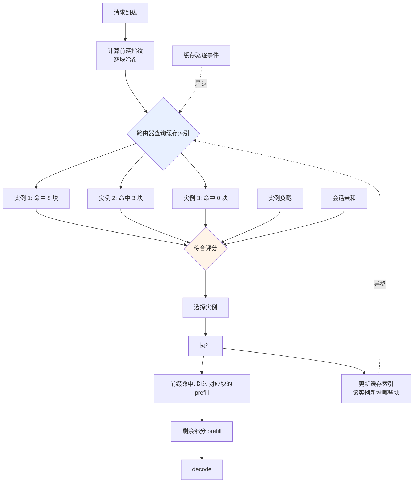

# Prompt 缓存与前缀缓存

> 位置：[InferenceAtlas](../../INDEX.md) > [模块 03](README.md) > 当前文档
> 信息截至：2026-07-29 ｜ 最后核验：2026-07-29 ｜ 内容版本：v0.1
> 时效性等级：中
> 相关主题：[PagedAttention](03_pagedattention_and_kv_memory_management.md)｜[多租户隔离](06_multi_tenant_isolation_and_qos.md)｜[会话状态](09_session_memory_and_conversation_state.md)

## 本章导读

前缀缓存是推理系统中收益/复杂度比最高的优化之一：如果多个请求共享相同前缀，那么这段前缀的 prefill 只需做一次。对于系统提示很长、用户输入很短的应用，这可以把 TTFT 降低一个量级。

但它的收益**高度依赖流量模式**，而这一点经常被误判。团队常常假设"我们有很长的系统提示，所以前缀缓存会很有效"，实际上线后发现命中率远低于预期——原因可能是块对齐、缓存容量不足导致快速驱逐、或路由没有把请求送到有缓存的实例。

本章处理三件事：收益的计算方法、命中率的实际影响因素、以及作为安全边界的作用域管理。

## 学习目标

读完本章后，读者应能够：

1. 计算前缀缓存的理论收益并识别影响实际命中率的因素；
2. 说明块对齐如何降低有效命中率，以及如何缓解；
3. 设计缓存感知路由并解释它为什么必要；
4. 说明缓存作用域的安全含义并给出默认配置建议。

## 核心结论

- **收益正比于被跳过的前缀长度占总输入的比例**。系统提示长、用户输入短的场景收益最大。
- **实际命中率通常低于理论值**，主因是块对齐、缓存容量、以及**路由未感知缓存位置**。
- **缓存感知路由是命中率的关键**：不知道哪个实例有缓存的路由器会大幅浪费缓存。
- **作用域是安全决策**：默认应限于租户内，另设显式的公共前缀命名空间。

## 1. 问题定义、系统边界与工作负载

### 1.1 什么可以被缓存

前缀缓存复用的是**KV cache**，而非输出。因此可缓存的条件是：

| 条件 | 说明 |
|---|---|
| **前缀 token 序列完全相同** | 一个 token 不同，之后的 KV 全部失效 |
| **模型与精度相同** | 不同模型的 KV 不可互换 |
| 位置对齐 | 前缀必须从序列开头开始 |

**关键限制：前缀必须是严格前缀**。若两个请求的差异出现在中间，则只有差异点之前的部分可复用。这解释了一个常见的设计要点：**把可变内容放在 prompt 末尾**。

### 1.2 典型的复用场景

| 场景 | 共享部分 | 复用率 |
|---|---|---|
| 相同系统提示的多个请求 | 系统提示 | **高** |
| 多轮对话 | 历史轮次 | 高（随轮次增长） |
| 同一文档的多个问题 | 文档内容 | **高** |
| 同一 prompt 的多次采样 | 整个 prompt | **最高** |
| Few-shot 示例固定 | 示例部分 | 高 |
| 完全不同的用户输入 | 无 | 零 |

## 2. 原理、数学与性能模型

### 2.1 收益计算

设总输入长度 $S_{in}$，命中的前缀长度 $S_{hit}$。

**Prefill 计算量的节省**：由 [模块 02 第 3 章](../02_transformer_and_kv_cache/03_attention_complexity_during_inference.md)，prefill 计算量含线性项与平方项：

$$
C(S) \approx \alpha S + \beta S^2
$$

命中后只需计算剩余部分（但注意力仍需对全部前缀做，因为新 token 要 attend 到缓存的 KV）：

$$
C_{saved} \approx \alpha S_{hit} + \beta (S_{in}^2 - (S_{in}-S_{hit})^2 - 2 S_{hit}(S_{in}-S_{hit}))/1
$$

**简化的实用估算**：TTFT 的节省近似正比于命中比例：

$$
\frac{\Delta \text{TTFT}}{\text{TTFT}} \approx \frac{S_{hit}}{S_{in}} \quad \text{（线性项主导时）}
$$

当平方项主导（超长前缀）时，节省比例更高。

**实用结论**：**命中比例是收益的一阶指标**。系统提示占输入 90% 的场景，TTFT 可降低约一个量级；占 30% 的场景，收益有限。

### 2.2 块对齐的损耗

由 [第 3 章](03_pagedattention_and_kv_memory_management.md)，共享以**块**为单位。设块大小 $P$，实际共享的 token 数：

$$
S_{hit}^{eff} = \left\lfloor \frac{S_{hit}}{P} \right\rfloor \times P
$$

**损耗**：最多 $P-1$ 个 token 无法共享。

**何时这个损耗重要**：当 $S_{hit}$ 本身不大时（例如与 $P$ 同数量级），损耗占比可能很高。当 $S_{hit} \gg P$ 时可忽略。

**缓解**：减小块大小（代价是元数据与寻址开销增加，见 [第 3 章 2.2 节](03_pagedattention_and_kv_memory_management.md)），或在应用层把共享前缀设计为块大小的整数倍。

### 2.3 命中率的实际影响因素

理论命中率（基于请求间前缀重复率）与实际命中率之间的差距来自：

| 因素 | 机制 | 缓解 |
|---|---|---|
| **路由未感知缓存** | 请求被送到没有该缓存的实例 | **缓存感知路由** |
| 缓存容量不足 | 前缀被驱逐后再次请求需重算 | 增加缓存预算、LRU 调优 |
| 块对齐 | 见 2.2 | 减小块或对齐前缀 |
| 前缀不完全相同 | 一个 token 差异使后续全部失效 | 规范化 prompt 构造 |
| 缓存 TTL 过短 | 低频前缀过早失效 | 按访问频率分层保留 |

**其中第一项影响最大也最容易被忽略**：在多实例部署中，若路由是轮询或随机的，则一个前缀的缓存只在 $1/N$ 的实例上存在，命中率会被稀释到理论值的 $1/N$。

### 2.4 缓存与显存的竞争

前缀缓存占用的显存与活跃请求的 KV 竞争同一预算：

$$
M_{KV}^{budget} = M_{active} + M_{cached}
$$

**权衡**：

- 缓存多 → 命中率高、TTFT 低，但可用于活跃请求的显存少 → 并发上限低；
- 缓存少 → 并发高，但命中率低 → TTFT 高。

**这是一个需要按 SLO 权衡的分配问题**。若 TTFT 是主要 SLO，倾向多留缓存；若吞吐是主要目标，倾向多留活跃预算。

**实用做法**：设置缓存预算的上下限，并在显存压力大时优先驱逐缓存而非抢占活跃请求——**抢占活跃请求的代价（重算 + 方差）通常高于丢弃缓存（下次未命中）**。

## 3. 实现机制与系统设计

### 3.1 缓存感知路由



**图展示什么**：缓存感知路由的完整流程——前缀指纹计算、跨实例缓存索引查询、综合评分选择实例，以及索引的异步更新。

**核心瓶颈在哪**：`路由器查询缓存索引` 是新增的关键路径。索引必须足够快（否则抵消收益）且足够新（否则路由到已驱逐缓存的实例）。**这是一个典型的一致性与性能权衡**：强一致索引开销大，最终一致索引可能过时。实践中通常选择异步更新的最终一致索引，并接受少量错判。

**图中的 trade-off**：`综合评分` 必须同时考虑缓存命中与实例负载。**只按命中率路由会导致热点**——所有共享同一系统提示的请求涌向同一实例。评分函数需要在二者间平衡，例如命中收益折算为等效负载后再比较。

**面试如何引用**：被问到"前缀缓存命中率低怎么排查"时，把缓存感知路由列为首查项。多数人会先查缓存容量或块大小，而路由稀释往往是更大的因素——在 $N$ 个实例上随机路由会把命中率稀释到 $1/N$。

### 3.2 伪代码：前缀缓存查找

```text
数据结构:
    # 按块粒度组织的前缀树（基数树/Trie），每个节点对应一个块的哈希
    cache_tree     节点 → (block_id, refcount, last_access)
    lru            按访问时间排序的块列表

函数 前缀指纹(tokens, P):
    # 逐块计算滚动哈希，第 i 块的哈希包含前面所有块（保证前缀语义）
    指纹列表 ← []
    h ← 初始值
    对 i in 0..floor(len(tokens)/P)−1:
        块 ← tokens[i*P : (i+1)*P]
        h ← hash(h, 块)                     # 链式，体现"前缀"而非"任意块"
        指纹列表.追加(h)
    返回 指纹列表

函数 查找(tokens, tenant):
    指纹 ← 前缀指纹(tokens, P)
    命中块 ← []
    节点 ← cache_tree.根(命名空间 = tenant)   # 作用域：租户内
    对 h in 指纹:
        子 ← 节点.查找子节点(h)
        若 子 不存在: 跳出                   # 前缀在此断开，后续不可能命中
        命中块.追加(子.block_id)
        子.last_access ← 现在
        lru.提升(子.block_id)
        节点 ← 子
    返回 命中块                              # 长度 × P = 可跳过的 token 数

函数 插入(tokens, blocks, tenant):
    指纹 ← 前缀指纹(tokens, P)
    节点 ← cache_tree.根(命名空间 = tenant)
    对 (h, blk) in zip(指纹, blocks):
        若 节点.无子节点(h):
            若 缓存预算已满:
                驱逐(lru.最久未用())         # 优先驱逐缓存，而非抢占活跃请求
            节点.添加子节点(h, blk)
            refcount[blk] ← refcount[blk] + 1
        节点 ← 节点.子节点(h)

函数 驱逐(block_id):
    refcount[block_id] ← refcount[block_id] − 1
    若 refcount[block_id] == 0:
        归还到空闲块池(block_id)
    cache_tree.移除对应节点(block_id)
    通知路由器索引更新(block_id, 已驱逐)     # 异步，保持路由索引新鲜
```

**四个设计要点**：

1. **链式哈希**保证了"前缀"语义——第 $i$ 块的指纹包含前面所有块，因此不会出现"中间块相同但前缀不同"的错误命中；
2. **查找在第一个未命中处立即中断**——前缀一旦断开，后续不可能命中；
3. **命名空间按租户划分**，这是 [第 6 章](06_multi_tenant_isolation_and_qos.md) 讨论的信息隔离的实现点；
4. **驱逐优先于抢占活跃请求**，因为前者的代价（下次未命中）低于后者（重算 + 方差增大）。

### 3.3 Prompt 构造规范

应用层的构造方式直接决定命中率：

| 做法 | 效果 |
|---|---|
| **可变内容放末尾** | 最大化共享前缀 |
| 系统提示中避免时间戳、随机 ID | 否则每次前缀都不同，命中率归零 |
| 固定 few-shot 示例的顺序 | 顺序变化会破坏前缀 |
| 共享前缀长度对齐块大小 | 减少对齐损耗 |
| 规范化空白与格式 | 避免不可见字符导致的差异 |

**最常见的错误是在系统提示中插入当前时间**。这会使每个请求的前缀都不同，前缀缓存完全失效——而这个错误在功能测试中不可见，只在观察命中率时才暴露。

## 4. 性能、成本、能耗与可靠性 trade-off

| 决策 | TTFT | 吞吐 | 显存 | 安全 |
|---|---|---|---|---|
| 增大缓存预算 | ↓↓ | ↓（活跃预算减少） | — | — |
| 减小块大小 | ↓（对齐损耗小） | ↓（寻址开销） | — | — |
| 缓存感知路由 | **↓↓** | ≈ | — | — |
| 跨租户共享 | ↓↓ | ↑ | ↓ | **↑↑ 风险** |
| 租户内共享 | ↓ | ≈ | ≈ | 安全 |
| 优先驱逐缓存而非抢占 | 略↑ | ↑（避免重算） | — | — |

**核心结论**：**缓存感知路由是性价比最高的一项**——它不消耗额外显存，只需要一个索引，却能把命中率从 $1/N$ 提升到接近理论值。

## 5. benchmark、真实案例或公开部署案例

| 公开结论 | 来源 |
|---|---|
| 分页 KV 与 copy-on-write 使跨请求前缀共享在显存层可行 | [PagedAttention, SOSP 2023](https://arxiv.org/abs/2309.06180) |
| SGLang 采用基数树（RadixAttention）组织前缀共享 | [SGLang 仓库](https://github.com/sgl-project/sglang)，`开源代码/配置披露` |
| vLLM 提供前缀缓存能力，具体配置项与默认值随版本变化 | [vLLM 仓库](https://github.com/vllm-project/vllm)，`开源代码/配置披露` `待核实` |

> 各厂商 API 的 prompt caching 定价与命中判定规则（如最小可缓存长度、TTL），须引用官方文档，将录入 [`cloud_pricing.csv`](../../data/cloud_pricing.csv) 并附来源。本章不给出无来源的具体规则。`待核实`

## 6. 设计决策框架

1. **先测量请求间的前缀重复率**——这是收益上限，不能假设；
2. 计算命中比例 $S_{hit}/S_{in}$，估算 TTFT 收益；
3. 若收益不显著，不必投入（复杂度不值得）；
4. 规范 prompt 构造：可变内容放末尾、去除时间戳与随机 ID；
5. **实现缓存感知路由**（多实例部署时这是命中率的决定因素）；
6. 设定缓存预算与活跃预算的分配，按 SLO 侧重；
7. 配置驱逐策略：优先驱逐缓存而非抢占活跃请求；
8. **设定作用域为租户内**，另建公共前缀命名空间；
9. 调优块大小，权衡对齐损耗与寻址开销；
10. 监控：命中率（实际 vs 理论）、缓存占用、驱逐率、按前缀的命中分布。

**第 10 项中"实际 vs 理论"的对比是诊断的关键**：二者差距大说明存在路由稀释、容量不足或对齐损耗。

## 7. 常见失败模式与排查路径

| 失败模式 | 表现 | 根因 | 纠正 |
|---|---|---|---|
| 命中率远低于理论 | TTFT 未改善 | **路由未感知缓存** | 实现缓存感知路由 |
| 命中率为零 | 完全无收益 | prompt 含时间戳/随机 ID | 规范 prompt 构造 |
| 命中率波动大 | 收益不稳定 | 缓存容量不足，频繁驱逐 | 增加缓存预算 |
| 短前缀无收益 | 小请求无改善 | 块对齐损耗 | 减小块或对齐前缀 |
| 启用后吞吐下降 | 并发上限降低 | 缓存挤占活跃预算 | 调整预算分配 |
| 单实例过热 | 负载不均 | 只按命中率路由 | 评分加入负载因子 |
| 跨租户共享 | 潜在信息泄露 | 作用域过宽 | 限于租户内 |
| 缓存驱逐引发抢占 | P99 恶化 | 驱逐优先级设置反了 | 优先驱逐缓存 |

## 8. 关联面试主题

1. **前缀缓存的收益如何计算** → 本章 2.1
2. **命中率低于预期的常见原因** → 本章 2.3、7
3. **缓存感知路由为什么必要** → 本章 3.1
4. **写出前缀缓存查找的伪代码** → 本章 3.2
5. **缓存作用域的安全含义** → 本章 3.2、[第 6 章](06_multi_tenant_isolation_and_qos.md)

## 9. 小结

前缀缓存复用共享前缀的 KV cache，收益近似正比于命中比例 $S_{hit}/S_{in}$，因此在系统提示长、用户输入短的场景收益最大。但实际命中率通常低于理论值，最大的原因是**路由未感知缓存位置**——在 $N$ 个实例上随机路由会把命中率稀释到约 $1/N$，这比缓存容量或块对齐的影响更大，却更容易被忽略。缓存感知路由因此是性价比最高的一项优化：它不消耗额外显存，只需一个最终一致的索引。其余影响因素包括块对齐损耗（最多 $P-1$ 个 token 无法共享）、缓存与活跃请求对显存预算的竞争（显存压力下应优先驱逐缓存而非抢占活跃请求）、以及 prompt 构造规范（系统提示中的时间戳会使命中率归零，且这个错误在功能测试中不可见）。缓存作用域是安全决策而非性能决策，默认应限于租户内。

## 关键术语

| 中文术语 | 英文 | 定义 | 单位/口径 | 关联文档 |
|---|---|---|---|---|
| 前缀缓存 | prefix caching | 复用请求间共享前缀的 KV cache | 命中率 % | 本章 1.1 |
| 命中比例 | hit ratio | $S_{hit}/S_{in}$，收益的一阶指标 | % | 本章 2.1 |
| 缓存感知路由 | cache-aware routing | 依据实例缓存状态做路由决策 | — | 本章 3.1 |
| 块对齐损耗 | block alignment loss | 因共享以块为单位造成的最多 $P-1$ 个 token 损失 | token | 本章 2.2 |
| 链式指纹 | chained fingerprint | 逐块滚动哈希，保证前缀语义 | — | 本章 3.2 |
| 路由稀释 | routing dilution | 多实例随机路由使命中率降为约 $1/N$ | — | 本章 2.3 |

## 延伸阅读

- [03 PagedAttention](03_pagedattention_and_kv_memory_management.md) —— 共享的底层机制
- [06 多租户隔离与 QoS](06_multi_tenant_isolation_and_qos.md) —— 作用域的安全分析
- [09 会话状态](09_session_memory_and_conversation_state.md) —— 多轮对话的缓存复用

## 主要来源

| # | 来源 | 类型 | 披露等级 | 核验日期 |
|---:|---|---|---|---|
| 1 | [PagedAttention (SOSP 2023)](https://arxiv.org/abs/2309.06180) | 会议论文 | 独立可复现实验 | 2026-07-29 |
| 2 | [SGLang 官方仓库](https://github.com/sgl-project/sglang) | 开源项目 | 开源代码/配置披露 | 2026-07-29 |
| 3 | [vLLM 官方仓库](https://github.com/vllm-project/vllm) | 开源项目 | 开源代码/配置披露 | 2026-07-29 |

> **说明**：第 3.2 节伪代码为**本库编写的教学版本**，基于公开的基数树前缀共享思路，非任何具体引擎的实际实现。各厂商 API 的缓存定价与命中规则标注为 `待核实`。

## 更新记录

| 日期 | 版本 | 变更 | 核验人 |
|---|---|---|---|
| 2026-07-29 | v0.1 | 初稿 | — |
