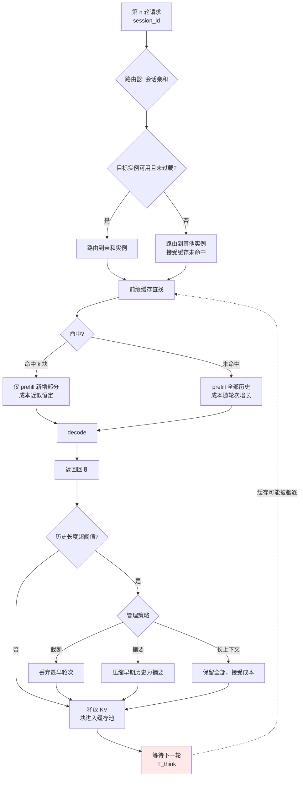

# 会话状态与多轮对话

> 位置：[InferenceAtlas](../../INDEX.md) > [模块 03](README.md) > 当前文档
> 信息截至：2026-07-29 ｜ 最后核验：2026-07-29 ｜ 内容版本：v0.1
> 时效性等级：低
> 相关主题：[前缀缓存](08_prompt_caching_and_prefix_caching.md)｜[长上下文](../02_transformer_and_kv_cache/07_long_context_inference.md)｜[Agent 推理](../05_decoding_and_generation_algorithms/)

## 本章导读

多轮对话是 LLM 应用最常见的形态，也是 KV cache 复用机会最大的场景：第 $n$ 轮的输入是前 $n-1$ 轮的完整历史加上新消息，因此前 $n-1$ 轮的 KV 理论上可以完全复用。

但这个理论收益要落地，需要解决三个工程问题：**KV 在轮次间保留在哪里**（显存驻留还是丢弃后重算）、**请求如何路由到有该 KV 的实例**（会话亲和）、以及**历史增长后如何管理**（截断、摘要还是长上下文）。

三者的选择互相影响，且都涉及成本与体验的直接交换。本章给出决策框架。

## 学习目标

读完本章后，读者应能够：

1. 比较 KV 驻留、丢弃重算、offload 三种轮间保留策略的成本；
2. 设计会话亲和路由并处理实例故障时的降级；
3. 分析历史增长的三种管理方式及其质量影响；
4. 说明为什么"驻留"在多数场景下不划算。

## 核心结论

- **轮间 KV 驻留的成本是"占用显存 × 用户思考时间"**，而这个时间通常远长于生成时间，因此**驻留通常不划算**。
- **主流做法是丢弃 + 前缀缓存**：不保证驻留，但若下次请求命中缓存则免费获得收益。
- **会话亲和提高命中率，但引入负载不均与故障域集中**，必须设计降级路径。
- **历史增长必须有管理策略**。不管理的多轮对话会线性推高每轮的 prefill 成本与 KV 占用。

## 1. 问题定义、系统边界与工作负载

### 1.1 多轮对话的资源特征

第 $n$ 轮的输入长度：

$$
S_{in}^{(n)} = \sum_{i=1}^{n-1} (\text{轮 } i \text{ 的输入} + \text{输出}) + \text{本轮新输入}
$$

**关键性质**：输入长度**随轮次单调增长**。因此：

| 指标 | 随轮次 |
|---|---|
| Prefill 成本（无缓存） | **超线性增长**（含注意力平方项） |
| KV 占用 | 线性增长 |
| 可复用前缀比例 | **上升**（历史占比越来越大） |
| 命中缓存时的 prefill 成本 | 仅新增部分，近似恒定 |

**这是一个重要的不对称**：不做缓存时，多轮对话的成本随轮次快速增长；做了缓存后，每轮的增量成本近似恒定。**因此多轮场景是前缀缓存收益最大的场景之一**。

## 2. 原理、数学与性能模型

### 2.1 三种轮间保留策略

| 策略 | 机制 | 下轮 prefill 成本 | 轮间显存占用 |
|---|---|---|---|
| **驻留** | KV 保留在显存 | 仅新增部分 | **全部历史** |
| **丢弃 + 缓存** | 释放，但块进入缓存池 | 命中则仅新增；未命中则全部 | 缓存池（可被驱逐） |
| **Offload** | 移到 CPU/NVMe | 新增 + 搬回成本 | 主机内存 |
| **丢弃 + 重算** | 完全释放 | **全部历史重算** | 零 |

### 2.2 驻留为什么通常不划算

驻留的成本是显存占用乘以占用时长：

$$
\text{Cost}_{resident} \propto M_{KV}^{(n)} \times T_{think}
$$

其中 $T_{think}$ 是用户阅读回复并输入下一条消息的时间。

**关键观察**：$T_{think}$ 通常远长于生成时间。一次生成可能几秒，而用户思考与输入可能数十秒到数分钟，甚至永远不再继续（会话中止）。

**因此**：驻留会让显存被长时间占用而不产生任何吞吐。在这段时间里，这部分显存本可以服务其他请求。

**量化对比**：设重算该历史的成本为 $C_{recompute}$，驻留期间放弃的吞吐机会成本为 $C_{opportunity} \propto M_{KV} \times T_{think}$。当 $T_{think}$ 较大时，$C_{opportunity} > C_{recompute}$，驻留不划算。

**结论**：**驻留只在会话高频连续（$T_{think}$ 很短）且显存充裕时才合理**。多数交互式对话不满足这个条件。

**主流做法**：丢弃 KV 但让块进入前缀缓存池——**这是一个机会主义策略**：不承诺保留，但若缓存未被驱逐则下次免费命中。它的期望收益介于驻留与完全丢弃之间，而成本接近后者。

### 2.3 会话亲和的收益与代价

**收益**：把同一会话的请求路由到同一实例，使前缀缓存命中率接近理论值（避免 [第 8 章](08_prompt_caching_and_prefix_caching.md) 讨论的路由稀释）。

**代价**：

| 代价 | 机制 | 缓解 |
|---|---|---|
| **负载不均** | 热门会话集中到少数实例 | 亲和 + 负载上限（超载时放弃亲和） |
| **故障域集中** | 实例故障使该会话全部历史缓存丢失 | 降级到重算，对用户透明 |
| 扩缩容时的缓存失效 | 实例下线导致缓存丢失 | 优雅下线 + 缓存预热 |

**设计原则**：**亲和应当是"偏好"而非"约束"**。当目标实例过载或不可用时，路由器应能选择其他实例并接受一次缓存未命中，而不是让请求排队或失败。

## 3. 实现机制与系统设计

### 3.1 会话状态管理流程

**图展示什么**：一轮对话的完整生命周期，含亲和路由、缓存查找、历史管理与轮间等待。

**核心瓶颈在哪**：高亮的 `等待下一轮 T_think` 是全图的经济学核心。这段时间里，若选择驻留则显存被占用而无产出；若选择丢弃则可能面临下次未命中。**这个等待时长的分布决定了策略选择**——它应当从生产日志中测量，而非假设。

**图中的 trade-off**：`路由到其他实例，接受缓存未命中` 这条边体现了"亲和是偏好而非约束"的原则。放弃一次命中的代价是一次重算，而坚持亲和的代价可能是排队或失败——前者通常更可接受。

**面试如何引用**：被问到"多轮对话如何优化"时，指出核心矛盾在轮间等待期的显存机会成本，并说明主流做法是"丢弃 + 机会主义缓存"而非驻留。能量化 $T_{think}$ 的影响是有分量的回答。

### 3.2 历史增长的管理

| 策略 | 机制 | 质量影响 | 成本 |
|---|---|---|---|
| **不管理** | 保留全部历史 | 无损 | 随轮次超线性增长 |
| **截断** | 丢弃最早的轮次 | **丢失早期上下文** | 恒定上限 |
| **滑窗 + 保留系统提示** | 保留系统提示 + 最近 N 轮 | 丢失中间历史 | 恒定上限 |
| **摘要** | 把早期历史压缩为摘要 | 有损但保留要点 | 恒定上限 + 摘要生成成本 |
| **检索式** | 把历史存入检索库，按需召回 | 依赖检索质量 | 低，但引入检索 |

**选择判据**：

- 短会话（几轮）→ 不管理；
- 长会话且早期上下文不重要（如客服问答）→ 滑窗；
- 长会话且需要长程一致性（如协作写作）→ 摘要或检索式；
- 对成本极度敏感 → 检索式。

**关键提醒**：**截断与滑窗会丢失信息，且这个损失在功能测试中通常不可见**（测试会话一般很短）。必须用真实长会话样本评测——这与 [模块 02 第 8 章](../02_transformer_and_kv_cache/08_kv_cache_compression_quantization_and_eviction.md) 讨论的评测设计问题是同一类。

### 3.3 会话状态的存储位置

| 内容 | 存储位置 | 理由 |
|---|---|---|
| 对话文本历史 | **外部存储**（数据库/对象存储） | 需持久化、跨实例可见 |
| KV cache | 显存（机会主义缓存） | 可重建，不必持久化 |
| 会话元数据（tier、配额、亲和目标） | 分布式缓存 | 路由器需快速访问 |
| 摘要/压缩结果 | 外部存储 | 生成成本高，值得持久化 |

**原则**：**KV cache 是可重建的派生数据，不应被当作需要持久化的状态**。真正的会话状态是文本历史，它必须持久化；KV 只是它的一种加速表示。

这个区分很重要——它决定了故障恢复的设计：实例故障时会话不应中断，只需在新实例上重新 prefill。

## 4. 性能、成本、能耗与可靠性 trade-off

| 决策 | TTFT | 显存 | 成本 | 可靠性 |
|---|---|---|---|---|
| KV 驻留 | ↓↓ | **↑↑（长时间）** | ↑（机会成本） | 故障时全丢 |
| 丢弃 + 缓存 | ↓（命中时） | ↑（可驱逐） | ↓ | 故障时重算 |
| 完全丢弃 | ↑↑ | 最低 | 视重算成本 | 无关 |
| 会话亲和 | ↓（命中率↑） | ≈ | ↓ | **故障域集中** |
| 历史截断 | ↓（输入短） | ↓ | ↓ | 质量风险 |
| 历史摘要 | ↓ | ↓ | 摘要生成成本 | 质量风险 |

**核心结论**：**"丢弃 + 机会主义缓存 + 亲和偏好"是多数场景的合理默认**。它在成本、体验、可靠性之间取得了较好的平衡，且实现复杂度可控。

## 5. benchmark、真实案例或公开部署案例

| 与本章相关的机制性依据 | 来源 |
|---|---|
| 分页 KV 与 copy-on-write 使多轮历史的前缀共享可行 | [PagedAttention, SOSP 2023](https://arxiv.org/abs/2309.06180) |
| 基数树组织的前缀缓存天然适配多轮对话的增量结构 | [SGLang 仓库](https://github.com/sgl-project/sglang)，`开源代码/配置披露` |

> 用户思考时间 $T_{think}$ 的分布、多轮对话的平均轮数、历史管理策略对质量的实际影响，均高度依赖具体产品，必须从自身日志测量。本库不给出无来源的通用数值。`待核实`

## 6. 设计决策框架

1. **从日志测量三个量**：平均轮数、$T_{think}$ 分布、会话中止率；
2. 由 $T_{think}$ 判断驻留是否划算（通常否）；
3. 默认采用"丢弃 + 前缀缓存"；
4. 实现会话亲和作为**路由偏好**，含过载与故障时的降级路径；
5. 确认会话文本历史持久化在外部存储，KV 仅作派生加速；
6. 按会话长度分布选择历史管理策略；
7. 若用截断/摘要，**用真实长会话样本评测质量影响**；
8. 监控：多轮命中率、按轮次的 TTFT 分布、亲和失效率、会话中止率。

**第 8 项中"按轮次的 TTFT 分布"能直接暴露问题**：若 TTFT 随轮次显著上升，说明缓存未有效工作。

## 7. 常见失败模式与排查路径

| 失败模式 | 表现 | 根因 | 纠正 |
|---|---|---|---|
| TTFT 随轮次上升 | 后续轮次越来越慢 | 缓存未命中，全量重算 | 检查亲和与缓存容量 |
| 显存长期高占用 | 并发上限低 | KV 驻留策略 | 改为丢弃 + 缓存 |
| 实例负载严重不均 | 部分实例过载 | 亲和为硬约束 | 亲和降级为偏好 |
| 实例故障导致会话中断 | 用户体验中断 | KV 被当作会话状态 | 文本历史持久化 |
| 长会话成本失控 | 单会话消耗过大 | 无历史管理 | 加截断/摘要 |
| 截断后质量下降 | 长程一致性变差 | 未评测 | 用长会话样本评测 |
| 摘要生成成为瓶颈 | 额外时延 | 同步生成摘要 | 异步生成 |
| 缓存频繁被驱逐 | 命中率低 | 缓存预算不足 | 增加预算或缩短保留 |

## 8. 关联面试主题

1. **多轮对话的 KV 应该驻留还是丢弃** → 本章 2.2
2. **会话亲和的收益与代价** → 本章 2.3
3. **历史增长如何管理** → 本章 3.2
4. **实例故障时会话如何不中断** → 本章 3.3
5. **如何诊断多轮对话的 TTFT 上升** → 本章 7

## 9. 小结

多轮对话是前缀缓存收益最大的场景之一：不做缓存时成本随轮次超线性增长，做了缓存后每轮增量成本近似恒定。但轮间 KV 保留策略需要仔细权衡——**驻留的成本是显存占用乘以用户思考时间，而后者通常远长于生成时间，因此驻留在多数交互式场景中不划算**。主流做法是"丢弃 + 机会主义缓存"：不承诺保留，但若缓存未被驱逐则下次免费命中。会话亲和能把命中率提升到接近理论值，但会引入负载不均与故障域集中，因此**必须实现为偏好而非硬约束**。关键的架构判断是：KV cache 是可重建的派生数据，真正需要持久化的会话状态是文本历史——这个区分决定了故障恢复的设计。历史增长必须有管理策略，而截断与摘要的质量损失在短会话的功能测试中不可见，必须用真实长会话样本评测。

## 关键术语

| 中文术语 | 英文 | 定义 | 单位/口径 | 关联文档 |
|---|---|---|---|---|
| 轮间驻留 | inter-turn residency | 对话轮次之间保留 KV 在显存 | — | 本章 2.1 |
| 思考时间 | think time $T_{think}$ | 用户阅读回复到发出下一条的间隔 | s | 本章 2.2 |
| 机会主义缓存 | opportunistic caching | 不承诺保留但命中即受益的策略 | — | 本章 2.2 |
| 会话亲和 | session affinity | 把同会话请求路由到同实例的**偏好** | — | 本章 2.3 |
| 派生数据 | derived data | 可从权威源重建的数据（如 KV cache） | — | 本章 3.3 |

## 延伸阅读

- [08 前缀缓存](08_prompt_caching_and_prefix_caching.md) —— 命中率的决定因素
- [模块 02 第 7 章：长上下文](../02_transformer_and_kv_cache/07_long_context_inference.md) —— 历史增长后的压力
- [模块 05：Agent 推理](../05_decoding_and_generation_algorithms/) —— 多轮 + 工具调用的复合场景

## 主要来源

| # | 来源 | 类型 | 披露等级 | 核验日期 |
|---:|---|---|---|---|
| 1 | [PagedAttention (SOSP 2023)](https://arxiv.org/abs/2309.06180) | 会议论文 | 独立可复现实验 | 2026-07-29 |
| 2 | [SGLang 官方仓库](https://github.com/sgl-project/sglang) | 开源项目 | 开源代码/配置披露 | 2026-07-29 |

> **说明**：本章的驻留经济性分析为**基于机会成本的推理**。$T_{think}$ 分布、平均轮数等参数依赖具体产品，本章要求从自身日志测量而不给出通用值。

## 更新记录

| 日期 | 版本 | 变更 | 核验人 |
|---|---|---|---|
| 2026-07-29 | v0.1 | 初稿 | — |
