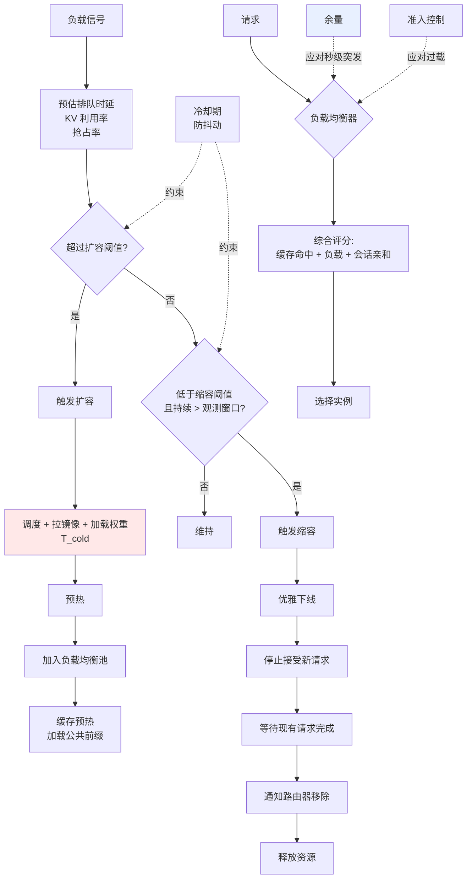

# 自动扩缩容与负载均衡

> 位置：[InferenceAtlas](../../INDEX.md) > [模块 03](README.md) > 当前文档
> 信息截至：2026-07-29 ｜ 最后核验：2026-07-29 ｜ 内容版本：v0.1
> 时效性等级：低
> 相关主题：[容量规划](../01_foundations_and_metrics/08_capacity_planning.md)｜[准入控制](04_request_scheduling_and_admission_control.md)｜[编排](../12_open_source_deployment_and_reproduction/)

## 本章导读

推理服务的自动扩缩容比传统 Web 服务困难得多，原因是**冷启动时间以分钟计而非秒计**：新实例需要调度、拉取镜像、加载权重（可能数十 GB）、预热 kernel、建立缓存。当突发流量到来时，扩容通常来不及。

这带来一个反直觉的结论：**autoscaler 不是应对突发的主要手段**。应对突发的是余量与准入控制；autoscaler 应对的是**趋势性的负载变化**（日周期、业务增长）。把二者搞混，会导致既扩不及时又常年浪费。

本章处理扩缩容的指标选择、冷启动的缓解、以及负载均衡与缓存亲和的冲突。

## 学习目标

读完本章后，读者应能够：

1. 说明为什么 autoscaler 无法应对秒级突发，以及正确的分工是什么；
2. 选择合适的扩缩容指标并解释为什么 GPU 利用率通常不合适；
3. 设计冷启动缓解方案并量化其成本；
4. 处理负载均衡与缓存亲和之间的冲突。

## 核心结论

- **Autoscaler 应对趋势，准入控制与余量应对突发**。冷启动时间决定了这个分工。
- **GPU 利用率不是好的扩缩容指标**。它可以在系统已严重排队时仍显示很高，也可以在 memory-bound 时显示很低。
- **应使用队列深度、排队时延、KV 利用率**作为扩缩容信号——它们直接对应 SLO。
- **缩容比扩容更危险**：缩掉的实例带走了它的缓存与正在处理的请求，恢复成本高。

## 1. 问题定义、系统边界与工作负载

### 1.1 冷启动的构成

| 阶段 | 内容 | 量级 |
|---|---|---|
| 调度 | 分配节点、GPU | 秒级 |
| 镜像拉取 | 容器镜像（可能很大） | 秒到分钟 |
| **权重加载** | 从存储读入显存 | **通常是主导项** |
| 引擎初始化 | 图编译、kernel 选择、CUDA graph 捕获 | 秒到分钟 |
| 预热 | 首次推理的额外开销 | 秒级 |
| 缓存建立 | 前缀缓存从零开始 | 持续影响 |

**权重加载通常是主导项**，其时间近似为「模型权重字节数 ÷ 存储读取带宽」。这解释了为什么大模型的冷启动更慢，也指出了优化方向（见 3.2 节）。

> 具体的冷启动时长依赖模型大小、存储介质、网络与引擎实现，必须实测。本库不给出通用数值。`待核实`

### 1.2 突发与趋势的区分

| 类型 | 时间尺度 | 应对手段 |
|---|---|---|
| **秒级突发** | 秒 | **余量 + 准入控制 + 背压** |
| 分钟级波动 | 分钟 | Autoscaler（勉强） |
| **日周期** | 小时 | **Autoscaler（预测式）** |
| 业务增长 | 天到月 | 容量规划 |

**核心判断**：**若冷启动需要 $T_{cold}$，则 autoscaler 无法应对时间尺度小于 $T_{cold}$ 的变化**。这不是调参能解决的，是物理限制。

## 2. 原理、数学与性能模型

### 2.1 扩缩容指标的选择

| 指标 | 是否合适 | 原因 |
|---|---|---|
| **GPU 利用率** | ❌ 通常不合适 | 可在 memory-bound 时偏低、在排队时偏高，与 SLO 不直接对应 |
| CPU 利用率 | ❌ | 与推理瓶颈无关 |
| **队列深度** | ✅ | 直接反映供需失衡 |
| **预估排队时延** | ✅✅ | **直接对应 SLO** |
| **KV 块利用率** | ✅ | 直接反映容量压力 |
| 请求速率 | ⚠️ 部分 | 不反映请求的资源消耗差异 |
| Token 速率 | ✅ | 比请求速率更准确 |
| 抢占率 | ✅ | 退化的先行信号 |

**推荐组合**：**预估排队时延（主）+ KV 块利用率（辅）+ 抢占率（告警）**。前者对应时延 SLO，后者对应容量压力，第三个作为退化预警。

**为什么 GPU 利用率不合适**（展开）：

- decode 阶段是 memory-bound，此时 SM 利用率可能不高，但系统已达带宽上限；
- 反之，若有大量小 kernel 频繁启动，利用率可能虚高而实际吞吐很低；
- 它不区分"忙于有效工作"与"忙于重算被抢占的请求"。

**这是推理与传统服务在监控上的一个重要差异**，直接沿用 Web 服务的扩缩容指标会失效。

### 2.2 扩容的滞后

设冷启动时间 $T_{cold}$，扩容决策周期 $T_{decide}$，则从负载上升到新容量可用的总延迟：

$$
T_{lag} = T_{decide} + T_{cold}
$$

在这段时间内，现有实例必须独自承担增量负载。因此**余量必须至少覆盖 $T_{lag}$ 内的负载增长**：

$$
\text{所需余量} \ge \int_0^{T_{lag}} (\lambda(t) - \lambda_0) \, dt \ \text{对应的容量}
$$

**实用含义**：$T_{cold}$ 越长，需要的常备余量越大。**因此缩短冷启动不只是"扩得更快"，还直接降低了常年的余量成本**——这是冷启动优化被低估的价值。

### 2.3 缩容的风险

缩容看似是扩容的逆操作，但代价不对称：

| 影响 | 说明 |
|---|---|
| 正在处理的请求 | 必须等待完成或迁移（KV 无法迁移则需重算） |
| 前缀缓存 | **全部丢失**，其他实例需重新建立 |
| 会话亲和 | 该实例上的会话失去亲和目标 |
| 再次扩容 | 需重新付出 $T_{cold}$ |

**因此缩容应当比扩容更保守**：

- 使用更长的观测窗口（避免被短期低谷误导）；
- 设置最小实例数下限；
- 优雅下线：停止接受新请求，等待现有请求完成；
- 缩容后设冷却期，避免抖动。

**抖动（thrashing）是缩容最常见的失败模式**：负载在阈值附近波动导致反复扩缩，每次都付出冷启动与缓存重建的代价。滞后（hysteresis）——扩容阈值与缩容阈值不同——是标准解法。

## 3. 实现机制与系统设计

### 3.1 扩缩容与负载均衡架构



**图展示什么**：扩缩容决策回路、冷启动路径、优雅下线流程，以及负载均衡的综合评分。

**核心瓶颈在哪**：高亮的 `T_cold` 是整个回路的时间常数，它决定了 autoscaler 能响应什么时间尺度的变化。另一个高亮的 `余量` 说明了正确的分工——**秒级突发由余量吸收，而非等待扩容**。

**图中的 trade-off**：`冷却期` 同时约束扩容与缩容，防止抖动，代价是响应变慢。缩容侧的观测窗口更长，体现了"缩容比扩容更保守"的原则。

**面试如何引用**：被问到"如何 autoscale 并避免 cold start"时，先指出 autoscaler 与余量的分工（这是最容易被答错的点），再讲冷启动优化与防抖动。能说清"缩短冷启动降低了常备余量成本"是有深度的观察。

### 3.2 冷启动优化

| 手段 | 机制 | 效果 | 代价 |
|---|---|---|---|
| **Warm pool** | 预启动实例待命 | 消除大部分冷启动 | **常年成本** |
| 镜像预拉取 | 节点上预置镜像 | 省去拉取时间 | 存储占用 |
| 权重本地缓存 | 权重预置在节点本地存储 | 省去网络读取 | 存储占用 |
| 并行加载 | 多线程/多流加载权重 | 缩短加载时间 | 带宽占用 |
| 更小的模型/量化 | 减少权重字节数 | 直接缩短加载 | 质量或功能 |
| 引擎快照 | 保存初始化后的状态 | 省去编译与图捕获 | 实现复杂度 |
| 缓存预热 | 新实例加载公共前缀 | 减少初期未命中 | 预热时间 |

**Warm pool 的经济学**：它把"扩容延迟"换成了"常年闲置成本"。是否划算取决于突发频率与突发时的损失：

$$
\text{划算条件}: \ P(\text{突发}) \times \text{损失}_{\text{突发}} > \text{成本}_{\text{warm pool}}
$$

**实用建议**：**warm pool 的规模应按突发的常见幅度而非最坏情况设定**，最坏情况交给准入控制降级处理。

### 3.3 负载均衡与缓存亲和的冲突

| 策略 | 缓存命中率 | 负载均衡 |
|---|---|---|
| 纯轮询/随机 | **低**（路由稀释） | 最优 |
| 纯缓存亲和 | 最高 | **差**（热点） |
| **综合评分** | 高 | 好 |

**综合评分的设计**：把缓存命中的收益折算为等效负载再比较。例如：

```text
score(instance) = 当前负载 − 缓存命中块数 × 每块的等效负载减免
选择 score 最小的实例
```

**关键参数**是"每块的等效负载减免"——它决定了在缓存收益与负载均衡之间的偏好。该参数应由实测的命中收益标定，而非拍脑袋。

**必须的保护**：设置负载上限，超过上限的实例即使缓存命中率最高也不选——否则热点会持续恶化。

## 4. 性能、成本、能耗与可靠性 trade-off

| 决策 | 成本 | 响应速度 | 稳定性 |
|---|---|---|---|
| 大余量 | ↑↑ | 突发响应快 | 高 |
| Warm pool | ↑ | 扩容快 | 高 |
| 激进扩容阈值 | ↑ | 快 | 可能抖动 |
| 保守缩容阈值 | ↑ | — | **高** |
| 长冷却期 | ≈ | 慢 | 高 |
| 缓存亲和权重高 | ↓（命中率高） | — | 热点风险 |

**核心权衡**：**成本与响应速度直接对立**，而稳定性（防抖动）通常需要牺牲一些响应速度。

**建议的默认立场**：**缩容保守、扩容适度、余量按 $T_{lag}$ 计算**。理由是缩容错误的恢复成本远高于扩容错误的浪费成本。

## 5. benchmark、真实案例或公开部署案例

| 与本章相关的机制性依据 | 来源 |
|---|---|
| 排队时延随利用率发散，因此队列深度是比利用率更好的扩容信号 | 见 [模块 01 第 3 章](../01_foundations_and_metrics/03_queueing_theory_for_inference.md) |
| KV 容量是并发的硬约束，因此 KV 利用率是有效的容量信号 | [PagedAttention, SOSP 2023](https://arxiv.org/abs/2309.06180) |

> 冷启动时长、warm pool 规模建议、扩缩容阈值等参数依赖具体部署，必须实测标定。Kubernetes/KServe/Ray Serve 等编排层的具体扩缩容能力与配置，将在 [模块 12](../12_open_source_deployment_and_reproduction/) 中核验官方文档后建立。`待核实`

## 6. 设计决策框架

1. **实测冷启动时间 $T_{cold}$** 及其构成（哪一段最长）；
2. 由 $T_{lag} = T_{decide} + T_{cold}$ 计算所需常备余量；
3. 明确分工：余量 + 准入控制应对突发，autoscaler 应对趋势；
4. 选择扩缩容指标：预估排队时延（主）+ KV 利用率（辅）；
5. **不使用 GPU 利用率作为主指标**；
6. 设置扩容与缩容的不同阈值（滞后）与冷却期；
7. 缩容使用更长观测窗口 + 优雅下线 + 最小实例数下限；
8. 按突发常见幅度设定 warm pool 规模（若成本可接受）；
9. 优化冷启动的主导项（通常是权重加载）；
10. 负载均衡采用综合评分，并设负载上限保护；
11. 监控：扩缩容事件、冷启动时长分布、抖动次数、缩容导致的缓存丢失量。

## 7. 常见失败模式与排查路径

| 失败模式 | 表现 | 根因 | 纠正 |
|---|---|---|---|
| 扩容永远来不及 | 突发时 SLO 违约 | 用 autoscaler 应对突发 | 加余量 + 准入控制 |
| 用 GPU 利用率扩容 | 该扩时不扩、不该扩时扩 | 指标与 SLO 不对应 | 改用排队时延 |
| 扩缩容抖动 | 频繁扩缩，缓存反复丢失 | 阈值无滞后 | 加滞后 + 冷却期 |
| 缩容后性能骤降 | 剩余实例过载 | 缩容过激进 | 保守阈值 + 长窗口 |
| 缩容中断请求 | 用户请求失败 | 未优雅下线 | 停止接受 + 等待完成 |
| 新实例长期低命中率 | 扩容后 TTFT 未改善 | 缓存未预热 | 加载公共前缀 |
| 负载严重不均 | 部分实例过载 | 亲和权重过高 | 加负载上限 |
| 冷启动优化无效 | 时间未缩短 | 优化了非主导项 | 先测量构成 |

## 8. 关联面试主题

1. **如何 autoscale 并避免 cold start** → 本章 1.2、3.2
2. **为什么 GPU 利用率不适合作扩容指标** → 本章 2.1
3. **缩容为什么比扩容更危险** → 本章 2.3
4. **如何解决模型加载与权重分发瓶颈** → 本章 3.2
5. **负载均衡与缓存亲和如何平衡** → 本章 3.3

## 9. 小结

推理服务的冷启动以分钟计，其中权重加载通常是主导项。这个物理限制决定了 autoscaler 与余量的分工：**autoscaler 应对趋势性变化（日周期、业务增长），秒级突发必须由余量、准入控制与背压吸收**。所需余量由 $T_{lag} = T_{decide} + T_{cold}$ 决定，因此缩短冷启动不只加快扩容，还直接降低常年余量成本。扩缩容指标应使用预估排队时延与 KV 利用率而非 GPU 利用率——后者在 memory-bound 时偏低、在排队时偏高，与 SLO 不直接对应，这是推理与传统 Web 服务在监控上的重要差异。缩容比扩容更危险，因为它带走了缓存与正在处理的请求，因此应采用更保守的阈值、更长的观测窗口与优雅下线，并用滞后与冷却期防止抖动。负载均衡需在缓存亲和与负载均匀之间用综合评分平衡，并设负载上限防止热点。

## 关键术语

| 中文术语 | 英文 | 定义 | 单位/口径 | 关联文档 |
|---|---|---|---|---|
| 冷启动 | cold start | 新实例从调度到可服务的总时间 | s | 本章 1.1 |
| 扩容滞后 | scaling lag $T_{lag}$ | 决策周期加冷启动时间 | s | 本章 2.2 |
| Warm pool | warm pool | 预启动待命的实例池 | 个 | 本章 3.2 |
| 滞后 | hysteresis | 扩容与缩容采用不同阈值以防抖动 | — | 本章 2.3 |
| 优雅下线 | graceful drain | 停止接受新请求并等待现有请求完成 | — | 本章 2.3 |
| 综合评分 | composite scoring | 兼顾缓存命中与负载的路由评分 | — | 本章 3.3 |

## 延伸阅读

- [04 准入控制](04_request_scheduling_and_admission_control.md) —— 突发的正确应对手段
- [11 Serverless 与突发推理](11_serverless_and_burst_inference.md) —— 冷启动问题的极端形态
- [模块 01 第 8 章：容量规划](../01_foundations_and_metrics/08_capacity_planning.md) —— 余量的定量计算

## 主要来源

| # | 来源 | 类型 | 披露等级 | 核验日期 |
|---:|---|---|---|---|
| 1 | [PagedAttention (SOSP 2023)](https://arxiv.org/abs/2309.06180) | 会议论文 | 独立可复现实验 | 2026-07-29 |
| 2 | [Orca (OSDI 2022)](https://www.usenix.org/conference/osdi22/presentation/yu) | 会议论文 | 独立可复现实验 | 2026-07-29 |

> **说明**：本章的扩容滞后分析为**基于时间尺度的推理**。冷启动时长、阈值参数、warm pool 规模均依赖具体部署，本章要求实测而不给出通用值。

## 更新记录

| 日期 | 版本 | 变更 | 核验人 |
|---|---|---|---|
| 2026-07-29 | v0.1 | 初稿 | — |
