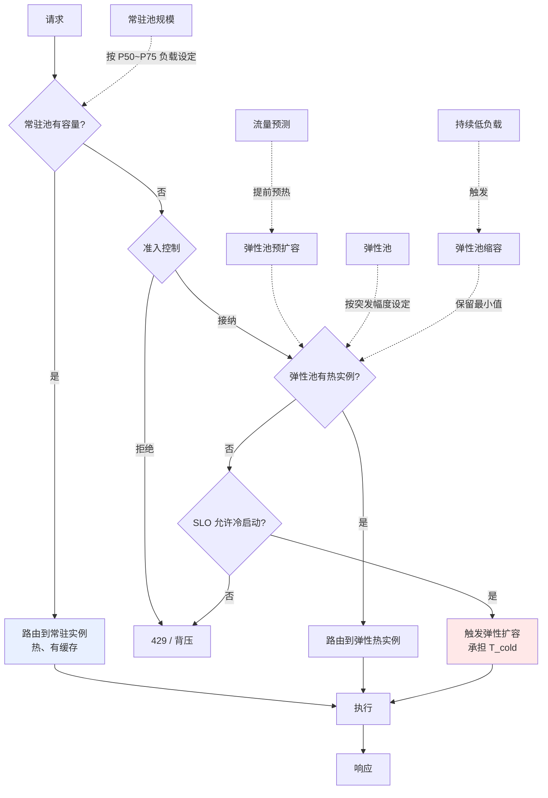

# Serverless 与突发推理

> 位置：[InferenceAtlas](../../INDEX.md) > [模块 03](README.md) > 当前文档
> 信息截至：2026-07-29 ｜ 最后核验：2026-07-29 ｜ 内容版本：v0.1
> 时效性等级：中
> 相关主题：[自动扩缩容](10_autoscaling_and_load_balancing.md)｜[成本建模](../01_foundations_and_metrics/06_cost_modeling_and_unit_economics.md)｜[容量规划](../01_foundations_and_metrics/08_capacity_planning.md)

## 本章导读

Serverless 推理的承诺很有吸引力：按实际用量付费、无需容量规划、自动应对突发。对于流量稀疏或高度不可预测的场景，它可以把利用率问题完全外包出去。

但 LLM 推理与传统 serverless 的适配度并不好，根源仍是冷启动：传统 serverless 函数的冷启动以百毫秒计，而加载一个大模型的权重可能需要数十秒到数分钟。这使得"零到一"的扩容在交互式场景中不可接受。

本章的目的是给出**适用边界**——serverless 在哪些推理场景中确实合理，在哪些场景中是错误选择，以及混合架构如何取二者之长。

## 学习目标

读完本章后，读者应能够：

1. 说明 serverless 推理与传统 serverless 的关键差异；
2. 计算 serverless 与常驻部署的成本交叉点；
3. 判断一个 workload 是否适合 serverless；
4. 设计常驻 + 弹性的混合架构。

## 核心结论

- **Serverless 的核心价值是把低利用率的成本外包**。当自有部署的利用率很低时，它几乎必然更划算。
- **冷启动是主要障碍**。权重加载时间使"零实例"状态无法满足交互式 SLO。
- **存在一个利用率交叉点**：低于它 serverless 更省，高于它常驻更省。这个点可以计算。
- **混合架构通常最优**：常驻基线容量 + 弹性溢出，兼顾成本与响应速度。

## 1. 问题定义、系统边界与工作负载

### 1.1 与传统 serverless 的差异

| 维度 | 传统 serverless 函数 | LLM 推理 |
|---|---|---|
| 冷启动 | 百毫秒级 | **秒到分钟级**（权重加载） |
| 状态 | 无状态 | **有状态**（KV cache、前缀缓存） |
| 单次执行时长 | 毫秒到秒 | 秒到分钟（长输出） |
| 资源粒度 | CPU/内存 | **整块或部分 GPU** |
| 并发模型 | 每请求一实例 | **批处理，多请求共享实例** |
| 缓存价值 | 低 | **高**（前缀缓存） |

**最后两行常被忽略但很重要**：LLM 推理的经济性建立在批处理之上，而 serverless 的"每请求独立"模型与批处理天然冲突。若 serverless 平台不支持在实例内批处理多个请求，其单位成本会显著高于常驻部署。

**同样，前缀缓存的价值在频繁冷启动的环境中大打折扣**——实例生命周期短则缓存无法积累。

### 1.2 三种形态

| 形态 | 机制 | 冷启动 | 适用 |
|---|---|---|---|
| **纯 serverless（零到一）** | 无请求时零实例 | 完整冷启动 | 稀疏、时延宽松 |
| **保留并发（min instances）** | 保持最少 N 个实例 | 仅超出部分冷启动 | 中等流量 |
| **常驻 + 弹性溢出** | 自有常驻 + 溢出到弹性 | 溢出部分冷启动 | **多数生产场景** |

## 2. 原理、数学与性能模型

### 2.1 成本交叉点

设：

- 常驻部署：单实例单位时间成本 $c_r$，需 $N$ 个实例覆盖峰值；
- Serverless：按实际使用时间计费，单位时间成本 $c_s$（通常 $c_s > c_r$，因为包含了弹性溢价）；
- 平均利用率 $U$（实际使用时间 / 总时间）。

**常驻成本**（按峰值配置）：

$$
\text{Cost}_{resident} = N \times c_r \times T
$$

**Serverless 成本**（按实际使用）：

$$
\text{Cost}_{serverless} = N \times c_s \times T \times U
$$

**交叉点**：

$$
\text{Cost}_{serverless} < \text{Cost}_{resident} \quad \Longleftrightarrow \quad U < \frac{c_r}{c_s}
$$

**含义**：若 serverless 单价是常驻的 2 倍（$c_s = 2c_r$），则利用率低于 50% 时 serverless 更省。

**这个公式非常实用**：它把"该不该用 serverless"变成了两个可测量的量——自有部署的实际利用率，以及两种方案的单价比。

**注意**：$U$ 应使用**有效利用率**（见 [模块 01 第 6 章](../01_foundations_and_metrics/06_cost_modeling_and_unit_economics.md)），即实际交付 / 理论产能，而非 GPU 忙碌比例。

> 具体的 $c_s/c_r$ 比值需引用各厂商官方定价，将录入 [`cloud_pricing.csv`](../../data/cloud_pricing.csv)。本章不给出无来源的数值。`待核实`

### 2.2 冷启动对 SLO 的影响

设冷启动概率 $p_{cold}$（请求到达时无可用热实例的概率），冷启动时长 $T_{cold}$：

$$
\text{TTFT} = \begin{cases} \text{TTFT}_{warm} & \text{概率 } 1-p_{cold} \\ \text{TTFT}_{warm} + T_{cold} & \text{概率 } p_{cold} \end{cases}
$$

**对分位数的影响**：若 $p_{cold} > 5\%$，则 **P95 TTFT 包含完整的冷启动时间**。

**因此**：交互式服务若要求 P95 TTFT 在秒级，则 $p_{cold}$ 必须远小于 5%，这基本要求保持足够的常驻实例——**这时 serverless 的成本优势也就消失了大半**。

**结论**：**纯 serverless 适合 P95 SLO 宽松的场景**（异步任务、批处理、低频内部工具），不适合交互式对话。

### 2.3 突发的两种来源

| 来源 | 特征 | 应对 |
|---|---|---|
| **可预测突发**（日周期、活动） | 时间已知 | 预热（提前扩容） |
| **不可预测突发** | 随机 | 余量 + 准入控制 + 弹性溢出 |

**预热是最有效的手段**：对已知的流量高峰，在其到来前完成扩容，冷启动问题就不存在了。**这要求业务侧提供流量预期**——这是一个跨团队的协作问题而非纯技术问题。

## 3. 实现机制与系统设计

### 3.1 混合架构

**图展示什么**：常驻 + 弹性的混合架构，含容量分层、准入控制、预热路径与缩容。

**核心瓶颈在哪**：高亮的 `触发弹性扩容，承担 T_cold` 是唯一会显著抬高时延的路径。设计的目标是**尽量让请求落在前两条路径上**——通过合理的常驻池规模与预热，把走到这条路径的概率压到 SLO 可容忍的水平以下。

**图中的 trade-off**：`常驻池规模按 P50~P75 负载设定` 是成本与响应速度的平衡点：设得太低则频繁走弹性路径（时延风险），设得太高则常年浪费（成本）。**P50~P75 是一个经验起点，具体值应按 SLO 与成本约束标定**。

**面试如何引用**：被问到"如何应对突发流量"或"serverless 适合推理吗"时，用这张图说明分层策略，并指出关键判据是"走到冷启动路径的概率"而非"是否用了 serverless"。

### 3.2 容量分层的设定

| 层 | 规模依据 | 覆盖 |
|---|---|---|
| **常驻池** | P50–P75 负载 | 日常流量，热且有缓存 |
| **弹性热实例**（min instances） | P90 负载减常驻 | 常见峰值 |
| **弹性冷扩容** | 无上限（受配额） | 极端突发 |
| **准入控制** | — | 超出全部容量时的保护 |

**设计逻辑**：**每一层的成本递增、响应速度递减**。因此按流量分位数分配：高频负载用便宜且快的常驻，低频峰值用贵但弹性的层，极端情况由准入控制降级。

**关键参数是常驻池规模**。它应由以下计算确定：

$$
N_{resident} = \text{满足 } P(\text{负载} > N_{resident} \text{ 的容量}) \le p_{cold}^{target} \text{ 的最小值}
$$

其中 $p_{cold}^{target}$ 由 SLO 反推（如 P95 SLO 要求 $p_{cold} < 5\%$）。

### 3.3 有状态性的处理

Serverless 实例生命周期短，这对推理的有状态特征不利：

| 状态 | 问题 | 处理 |
|---|---|---|
| KV cache（请求内） | 无问题（请求内完成） | — |
| 前缀缓存 | 实例销毁则丢失 | 常驻池承载缓存密集流量 |
| 会话亲和 | 实例不稳定 | 会话路由到常驻池 |

**推荐策略**：**把缓存敏感与会话相关的流量优先路由到常驻池，把无状态的一次性请求路由到弹性池**。这样弹性池的冷启动代价不会叠加缓存丢失的代价。

这是一个基于 workload 特征的路由决策，与 [第 7 章](07_model_routing_and_cascade_systems.md) 的模型路由是不同维度但同类的思路。

## 4. 性能、成本、能耗与可靠性 trade-off

| 方案 | 成本（低利用率） | 成本（高利用率） | P95 时延 | 运维复杂度 |
|---|---|---|---|---|
| 纯常驻（按峰值） | **最高** | 低 | 最好 | 低 |
| 纯 serverless | **最低** | 高 | **最差** | 最低 |
| 常驻 + 弹性 | 中 | 中低 | 好 | **最高** |
| 常驻 + 预留实例 | 中 | **最低** | 最好 | 中 |

**选择判据**：

- 利用率低且时延宽松 → serverless；
- 利用率高且稳定 → 常驻（可用预留实例进一步降价）；
- 利用率中等或波动大 → 混合；
- 严格 P95 SLO → 至少要有足够的常驻或热实例。

## 5. benchmark、真实案例或公开部署案例

| 与本章相关的机制性依据 | 来源 |
|---|---|
| 利用率直接进入单位成本分母 | 见 [模块 01 第 6 章](../01_foundations_and_metrics/06_cost_modeling_and_unit_economics.md) |
| 批处理是推理经济性的基础，与"每请求一实例"模型冲突 | 见 [模块 01 第 5 章](../01_foundations_and_metrics/05_memory_bandwidth_and_arithmetic_intensity.md) |

> 各云厂商 serverless 推理产品的定价、冷启动时长、最小实例配置、是否支持实例内批处理等，须引用官方文档，将录入 [`cloud_pricing.csv`](../../data/cloud_pricing.csv) 并附核验日期。本章不给出任何厂商的具体数值或产品评价。`待核实`

## 6. 设计决策框架

1. **测量自有部署的有效利用率 $U$**；
2. 获取 serverless 与常驻的单价比 $c_s/c_r$（官方定价）；
3. 用 $U < c_r/c_s$ 判断成本方向；
4. **测量冷启动时长 $T_{cold}$**；
5. 由 P95 SLO 反推可容忍的冷启动概率 $p_{cold}^{target}$；
6. 由流量分布确定常驻池规模，使 $p_{cold} \le p_{cold}^{target}$；
7. 设定弹性池的最小实例数（覆盖常见峰值）；
8. 把缓存敏感与会话流量路由到常驻池；
9. 对可预测峰值实施预热；
10. 保留准入控制作为最终保护；
11. 监控：冷启动率、各层流量占比、实际利用率、单位成本。

## 7. 常见失败模式与排查路径

| 失败模式 | 表现 | 根因 | 纠正 |
|---|---|---|---|
| 交互式用纯 serverless | P95 TTFT 极差 | 冷启动进入尾部 | 加常驻/热实例 |
| 按 GPU 忙碌率算利用率 | 成本判断错误 | 应用有效利用率 | 用交付量/产能 |
| 弹性池无批处理 | 单位成本高于预期 | 每请求一实例 | 确认平台支持批处理 |
| 缓存流量走弹性池 | 命中率极低 | 实例生命周期短 | 路由到常驻池 |
| 未预热可预测峰值 | 高峰期冷启动集中 | 缺业务协作 | 建立流量预期机制 |
| 常驻池按均值设定 | 频繁走冷启动 | 应按分位数设定 | 按 P50–P75 |
| 无准入控制 | 极端突发下崩溃 | 依赖弹性无上限 | 保留准入控制 |
| 忽略配额上限 | 弹性扩容被拒 | 云侧配额限制 | 提前申请并监控 |

## 8. 关联面试主题

1. **serverless 推理与传统 serverless 的差异** → 本章 1.1
2. **serverless 与常驻的成本交叉点如何计算** → 本章 2.1
3. **冷启动如何影响 P95 SLO** → 本章 2.2
4. **如何设计常驻 + 弹性的混合架构** → 本章 3.1–3.2
5. **如何应对 region failure 或容量短缺** → 本章 3.1、[12 事故手册](12_serving_incident_playbook.md)

## 9. 小结

Serverless 推理的核心价值是把低利用率的成本外包，其划算条件可精确表述为 $U < c_r/c_s$——即有效利用率低于两种方案的单价比。但 LLM 推理与传统 serverless 的适配度不佳：权重加载使冷启动以秒到分钟计，若冷启动概率超过约 5%，P95 TTFT 就会包含完整的冷启动时间，因此**纯 serverless 不适合有严格 P95 SLO 的交互式场景**。此外，LLM 推理的经济性建立在批处理之上，而"每请求一实例"的 serverless 模型与之冲突；前缀缓存的价值也会因实例生命周期短而大打折扣。混合架构通常最优：常驻池按 P50–P75 负载设定承载日常流量与缓存敏感请求，弹性池覆盖常见峰值，冷扩容应对极端情况，准入控制作为最终保护。对可预测峰值实施预热是最有效的手段，但它要求业务侧提供流量预期——这是跨团队协作问题而非纯技术问题。

## 关键术语

| 中文术语 | 英文 | 定义 | 单位/口径 | 关联文档 |
|---|---|---|---|---|
| 成本交叉点 | cost crossover | $U = c_r/c_s$，serverless 与常驻成本相等的利用率 | % | 本章 2.1 |
| 冷启动概率 | cold start probability $p_{cold}$ | 请求到达时无热实例的概率 | % | 本章 2.2 |
| 保留并发 | reserved concurrency / min instances | serverless 保持的最少热实例数 | 个 | 本章 1.2 |
| 弹性溢出 | elastic overflow | 常驻容量不足时溢出到弹性资源 | — | 本章 3.1 |
| 预热 | pre-warming | 在可预测峰值前提前扩容 | — | 本章 2.3 |

## 延伸阅读

- [10 自动扩缩容](10_autoscaling_and_load_balancing.md) —— 冷启动优化的完整手段
- [模块 01 第 6 章：成本建模](../01_foundations_and_metrics/06_cost_modeling_and_unit_economics.md) —— 有效利用率的定义
- [模块 15：GPUaaS 与 neocloud](../15_market_economics_and_strategy/) —— 供给侧的经济学

## 主要来源

| # | 来源 | 类型 | 披露等级 | 核验日期 |
|---:|---|---|---|---|
| 1 | [PagedAttention (SOSP 2023)](https://arxiv.org/abs/2309.06180) | 会议论文 | 独立可复现实验 | 2026-07-29 |
| 2 | [Orca (OSDI 2022)](https://www.usenix.org/conference/osdi22/presentation/yu) | 会议论文 | 独立可复现实验 | 2026-07-29 |

> **说明**：本章的成本交叉点与冷启动概率分析为**基于定价结构与概率的算术推导**。本章刻意不评价、不比较任何云厂商的 serverless 推理产品，也不给出其定价或冷启动数值——这些将在模块 15 与 `cloud_pricing.csv` 中附官方来源与核验日期后录入。

## 更新记录

| 日期 | 版本 | 变更 | 核验人 |
|---|---|---|---|
| 2026-07-29 | v0.1 | 初稿 | — |
