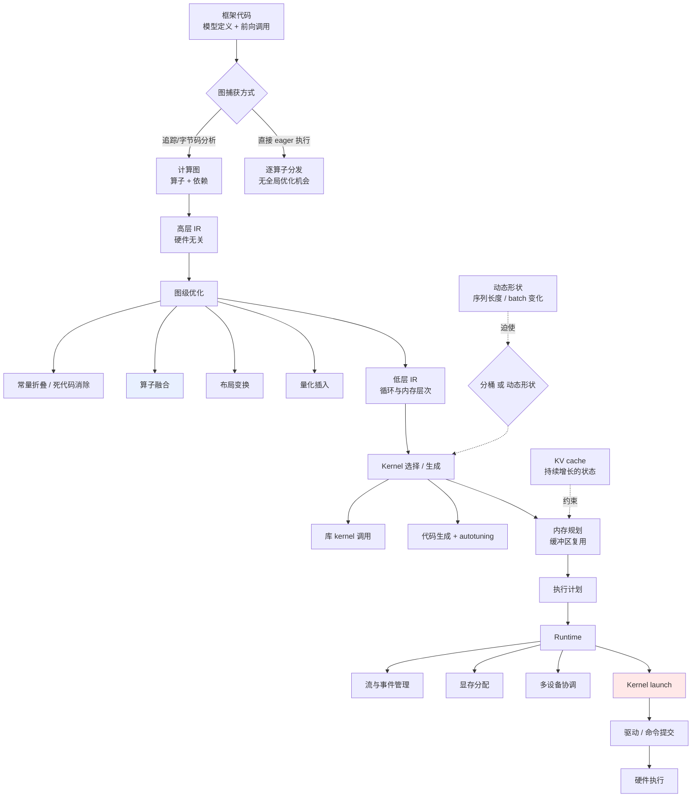

# 推理软件栈

> 位置：[InferenceAtlas](../../INDEX.md) > [模块 04](README.md) > 当前文档
> 信息截至：2026-07-29 ｜ 最后核验：2026-07-29 ｜ 内容版本：v0.1
> 时效性等级：低
> 相关主题：[Serving 架构](../03_serving_engines_and_scheduling/01_serving_architecture_overview.md)｜[图编译器与 IR](02_graph_compilers_and_ir.md)｜[Roofline](../01_foundations_and_metrics/04_roofline_and_performance_modeling.md)

## 本章导读

上一模块讨论了调度层——它决定**做多少工作**。本模块下探到执行层——它决定**每一份工作的单价**。

这两层的杠杆量级不同：调度层的选择带来倍数级的吞吐差异（见 [模块 03 第 1 章](../03_serving_engines_and_scheduling/01_serving_architecture_overview.md)），执行层的优化通常带来百分比级的改善。但百分比级不等于不重要——当调度已经优化到位，执行层就是剩下的全部空间；而且执行层的问题往往表现为"性能远低于 Roofline 两条屋顶"，这类问题不改算法就能修复，性价比很高。

本章建立全栈的层次图与职责边界，说明一个张量运算从 Python 代码到 GPU 指令要经过哪些变换，以及每一层可能引入的开销。

## 学习目标

读完本章后，读者应能够：

1. 说出推理软件栈的七个层次及各自职责；
2. 追踪一个算子从框架到硬件指令的完整变换路径；
3. 判断一个性能问题应当在哪一层排查；
4. 解释为什么"实际性能远低于 Roofline 上界"通常是实现问题而非算法问题。

## 核心结论

- **栈的七层**：框架 → 图捕获 → IR → 编译器 → runtime → kernel → 驱动/硬件。每层都可能成为瓶颈。
- **编译器的价值主要来自三件事**：算子融合（减少中间结果读写）、内存规划（减少分配与拷贝）、kernel 选择（为具体形状选最优实现）。
- **推理与训练的编译需求不同**：推理形状相对固定、无反向传播、但有 KV cache 这个动态增长的状态，且对启动开销更敏感。
- **"远低于两条屋顶"是本层的典型症状**：占用率不足、launch 开销、同步等待、内存未合并访问，都不改变算法而显著影响性能。

## 1. 问题定义、系统边界与工作负载

### 1.1 七层结构

| # | 层 | 职责 | 典型产物 |
|---:|---|---|---|
| 1 | **框架 / 前端** | 用户 API、张量抽象、自动微分（推理不用） | Python 调用序列 |
| 2 | **图捕获** | 把动态执行转成静态图 | 计算图 |
| 3 | **IR（中间表示）** | 与硬件无关的可优化表示 | 多级 IR |
| 4 | **编译器 / 优化器** | 图优化、融合、内存规划、kernel 选择 | 优化后的执行计划 |
| 5 | **Runtime** | 执行调度、内存分配、流管理、多设备协调 | 运行时调用序列 |
| 6 | **Kernel** | 具体的设备端计算实现 | GPU/加速器指令 |
| 7 | **驱动 / 硬件** | 指令提交、DMA、硬件执行 | 硬件动作 |

**边界的实用价值**：性能问题的定位需要先确定它在哪一层。第 3.3 节给出层与症状的映射。

### 1.2 推理与训练的编译需求差异

| 维度 | 训练 | 推理 |
|---|---|---|
| 反向传播 | 有 | **无** |
| 优化器状态 | 有 | 无 |
| 形状变化 | batch 相对固定 | **序列长度动态、batch 动态** |
| 有状态性 | 无（每步独立） | **KV cache 持续增长** |
| 启动开销敏感度 | 低（步长毫秒到秒） | **高**（decode 每步可能只有毫秒级） |
| 编译时间容忍度 | 高（一次编译多次运行） | 中（冷启动时间进入 SLO） |
| 数值精度要求 | 需支持训练稳定性 | 可更激进量化 |

**最重要的两条**：

1. **动态形状**：推理的序列长度和批大小随请求变化。全静态编译需要为每个形状组合编译一份，导致编译爆炸；因此推理编译普遍采用分桶（bucketing）或动态形状支持；
2. **启动开销敏感**：decode 每步的计算量很小，kernel launch 与 runtime 调度的固定开销占比可能很高——这是 CUDA Graphs 等技术的动机（见 [10 CUDA Graphs](10_cuda_graphs_and_execution_overhead.md)）。

## 2. 原理、数学与性能模型

### 2.1 编译器创造价值的三个机制

**机制一：算子融合减少内存往返**

未融合时，每个算子把结果写回显存，下一个算子再读回来。融合后中间结果保持在寄存器或片上内存。

设一串 $k$ 个逐元素算子作用于大小为 $N$ 字节的张量：

| | 内存访问量 |
|---|---|
| 不融合 | 约 $2kN$（每算子读一次写一次） |
| 融合 | 约 $2N$（读一次、写一次） |

**收益倍数约为 $k$**。由于逐元素算子是 memory-bound（算术强度极低），这个收益直接转化为时间节省。

**这是编译器最大的单一价值来源**，也解释了为什么 fused RMSNorm、fused RoPE、fused MLP 在推理引擎中如此普遍。

**机制二：内存规划减少分配与拷贝**

编译器分析张量的生存期，复用缓冲区，避免运行时反复分配。收益在于：

- 减少分配器开销（尤其是显存分配，通常较慢）；
- 减少碎片；
- 使总显存峰值可预测（对容量规划有直接价值）。

**机制三：kernel 选择**

同一个矩阵乘，不同形状下最优的 kernel 实现不同（分块大小、循环顺序、是否用 tensor core）。编译器根据具体形状从候选库中选择，或通过 autotuning 搜索。

**推理的特殊性**：由于形状动态，kernel 选择要么在编译时按分桶预选，要么在运行时按实际形状查表。前者可能选到次优，后者引入查表开销。

### 2.2 各层引入的开销

| 层 | 固定开销 | 何时显著 |
|---|---|---|
| 框架（Python） | 解释器开销、张量对象构造 | **decode 每步**（计算量小） |
| 图捕获 | 首次捕获成本 | 冷启动、形状变化时重捕获 |
| 编译 | 编译时间 | 冷启动、动态形状导致重编译 |
| Runtime | 调度、流同步、内存分配 | 小 kernel 频繁执行时 |
| Kernel launch | 每次 launch 的固定成本 | **decode 每步有大量小 kernel** |
| 驱动 | 命令提交 | 同上 |

**关键观察**：这些开销**几乎都与计算量无关**，是每次调用的固定成本。因此在 prefill（大计算量）中占比可忽略，在 decode（小计算量）中可能主导——这是推理软件栈优化的核心矛盾。

**量化表述**：设一次 decode 迭代的纯计算时间为 $T_{compute}$，固定开销为 $T_{overhead}$，则有效效率为：

$$
\eta = \frac{T_{compute}}{T_{compute} + T_{overhead}}
$$

当 $T_{compute}$ 很小（小 batch decode）时，$\eta$ 可能显著低于 1。**CUDA Graphs 等技术的收益正是压低 $T_{overhead}$**，其效果在小 batch 时最明显、大 batch 时递减。

## 3. 实现机制与系统设计

### 3.1 从代码到指令的完整路径

**图展示什么**：从框架代码到硬件指令的完整变换链，以及动态形状与 KV cache 这两个推理特有因素施加的约束。

**核心瓶颈在哪**：两处高亮。`算子融合` 是编译器价值的主要来源——它把 memory-bound 的算子串合并，收益约为串长倍数。`Kernel launch` 是 decode 阶段的主要固定开销来源，因为每步有大量小 kernel 而每次 launch 的成本与计算量无关。

**图中的 trade-off**：左侧的 `直接 eager 执行` 分支放弃了全局优化机会，换取灵活性与零编译时间。这是一个真实的取舍——在形状高度动态、编译成本无法摊薄的场景下，eager 可能反而更优。

**面试如何引用**：被问到"编译器对推理有什么用"时，答三个机制（融合、内存规划、kernel 选择）并指出融合是最大来源；被问到"decode 为什么慢"时，除了带宽还应提到固定开销占比——这一点多数候选人不会提。

### 3.2 图捕获的两条路线

| 路线 | 机制 | 优点 | 局限 |
|---|---|---|---|
| **追踪（tracing）** | 跑一遍记录算子序列 | 简单、无需理解源码 | 丢失控制流，形状写死 |
| **字节码/AST 分析** | 分析程序结构 | 保留控制流，可处理动态 | 复杂，需处理语言特性 |

**推理场景的具体困难**：自回归循环是一个数据依赖的控制流（生成到结束标记才停）。纯追踪会把循环展开成固定次数，这对推理不可用。因此实用方案通常是**只捕获单步前向**，循环留在框架层——这也解释了为什么 launch 开销在 decode 中难以完全消除（每步都要重新提交）。

### 3.3 层与症状的映射

| 症状 | 可能的层 | 排查手段 |
|---|---|---|
| 性能远低于两条屋顶 | Kernel、Runtime | profiler 看占用率、launch 间隙 |
| 小 batch 时效率极低 | Runtime、launch | 看固定开销占比，试 CUDA Graphs |
| 形状变化后突然变慢 | 编译器、kernel 选择 | 检查是否触发重编译或落入次优 kernel |
| 冷启动慢 | 编译、图捕获 | 拆分编译时间与权重加载时间 |
| 显存峰值高于预期 | 内存规划 | 看中间张量生存期与缓冲复用 |
| 数值结果异常 | 量化、融合 | 逐层对比，关闭融合定位 |
| 多卡时扩展性差 | Runtime、通信 | 看集合通信耗时与重叠情况 |
| CPU 占用高 | 框架、Python | 看是否 Python 成为提交瓶颈 |

**这张表是本模块的排查入口**，后续各章展开对应手段。

## 4. 性能、成本、能耗与可靠性 trade-off

| 决策 | 收益 | 代价 |
|---|---|---|
| 深度编译优化 | 运行时性能高 | 冷启动慢、调试困难 |
| Eager 执行 | 灵活、零编译 | 放弃全局优化 |
| 静态形状 + 分桶 | kernel 选择最优 | 桶间浪费、桶数爆炸风险 |
| 动态形状支持 | 无浪费 | kernel 可能次优 |
| 激进融合 | 减少访存 | 数值可能与未融合略有差异；调试难 |
| CUDA Graphs | 消除 launch 开销 | 形状必须固定，需重捕获 |
| Autotuning | 找到最优 kernel | 调优时间长 |
| 使用厂商闭源库 | 性能好、省事 | 可移植性差、黑盒 |

**普遍取舍**：**性能与灵活性/可调试性对立**。深度优化的栈在出问题时更难定位——因此可观测性（见 [11 编译调试与 profiling](11_compiler_debugging_and_profiling.md)）必须与优化同步建设，而非事后补。

## 5. benchmark、真实案例或公开部署案例

| 与本章相关的机制性结论 | 来源 |
|---|---|
| 注意力的瓶颈是 HBM 读写而非 FLOP；通过分块避免物化中间矩阵可显著减少内存访问 | [FlashAttention, NeurIPS 2022](https://arxiv.org/abs/2205.14135) |
| 迭代级调度改变了执行层面对的批构成，因而影响 kernel 选择与形状分布 | [Orca, OSDI 2022](https://www.usenix.org/conference/osdi22/presentation/yu) |

> **本模块的来源限制**：本节撰写时，`pytorch.org`、`docs.nvidia.com`、`onnxruntime.ai` 等官方文档站在本环境中**不可访问**（组织级出口策略，见 [AGENTS.md 第 11 节](../../AGENTS.md)）。因此本模块中涉及**具体产品的版本号、配置项名称、默认值、特性矩阵**一律标注 `待核实`，待网络策略放开后逐条补入。本模块的架构与原理分析不依赖这些细节。

## 6. 设计决策框架

1. 确认瓶颈确实在执行层（先用 Roofline 定位，见 [模块 01 第 4 章](../01_foundations_and_metrics/04_roofline_and_performance_modeling.md)）；
2. 若"远低于两条屋顶"，按第 3.3 节表定位层；
3. 检查融合是否生效（看实际 kernel 数量与预期对比）；
4. 检查小 batch 下的固定开销占比；
5. 检查形状分布是否导致频繁重编译或次优 kernel；
6. 量化前先确认精度需求与硬件支持；
7. 优化的同时建设可观测性，不要事后补；
8. 记录每项优化的收益与代价，便于回退。

## 7. 常见失败模式与排查路径

| 失败模式 | 表现 | 根因 | 纠正 |
|---|---|---|---|
| 只优化算法不看实现 | 理论改进但实测无收益 | 瓶颈在执行层 | 先做 Roofline 定位 |
| 融合未生效 | kernel 数远多于预期 | 图捕获失败或模式不匹配 | 看编译日志 |
| 形状爆炸 | 冷启动极慢、显存高 | 分桶粒度过细 | 减少桶数 |
| 频繁重编译 | 运行中周期性卡顿 | 动态形状触发 | 固定形状或用动态形状 kernel |
| Launch 开销主导 | 小 batch 效率极低 | 每步大量小 kernel | CUDA Graphs 或更大融合 |
| 融合改变数值 | 结果与参考实现不一致 | 累加顺序变化 | 确认容差；必要时关闭该融合 |
| 黑盒库无法定位 | 慢但不知为何 | 闭源 kernel | 换可观测的实现或联系厂商 |
| 优化后无法调试 | 出问题定位困难 | 可观测性缺失 | 保留可关闭优化的开关 |

## 8. 关联面试主题

1. **推理软件栈有哪些层，各自职责** → 本章 1.1
2. **编译器对推理的价值来自哪三个机制** → 本章 2.1
3. **推理与训练的编译需求有何不同** → 本章 1.2
4. **为什么小 batch decode 的效率会很低** → 本章 2.2
5. **性能远低于 Roofline 上界时如何排查** → 本章 3.3

## 9. 小结

推理软件栈分七层：框架、图捕获、IR、编译器、runtime、kernel、驱动/硬件。编译器创造价值主要靠三个机制——算子融合（收益约为融合串长倍数，因逐元素算子是 memory-bound）、内存规划（减少分配与碎片、使显存峰值可预测）、kernel 选择（为具体形状选最优实现）。推理与训练的编译需求有两条关键差异：序列长度与批大小动态变化，迫使采用分桶或动态形状支持；以及 decode 每步计算量小，使 kernel launch 与 runtime 调度的固定开销占比可能主导——有效效率 $\eta = T_{compute}/(T_{compute}+T_{overhead})$ 在小 batch 时显著低于 1。这解释了 CUDA Graphs 类技术的收益结构：小 batch 时明显、大 batch 时递减。执行层问题的典型症状是"实际性能远低于 Roofline 两条屋顶"，这类问题不改算法就能修复，性价比高，但需要可观测性支撑。

## 关键术语

| 中文术语 | 英文 | 定义 | 单位/口径 | 关联文档 |
|---|---|---|---|---|
| 图捕获 | graph capture | 把动态执行转为静态计算图 | — | 本章 3.2 |
| 中间表示 | IR (intermediate representation) | 编译过程中的可优化表示，通常分多级 | — | [02](02_graph_compilers_and_ir.md) |
| 算子融合 | operator fusion | 合并相邻算子以减少中间结果的内存往返 | — | 本章 2.1 |
| 内存规划 | memory planning | 分析张量生存期以复用缓冲区 | — | 本章 2.1 |
| 固定开销 | fixed overhead | 与计算量无关的每次调用成本 | ms | 本章 2.2 |
| 分桶 | bucketing | 为若干离散形状分别编译以应对动态形状 | — | 本章 1.2 |

## 延伸阅读

- [02 图编译器与 IR](02_graph_compilers_and_ir.md) —— 第 3 层与第 4 层的展开
- [07 算子融合与 kernel 优化](07_kernel_fusion_and_operator_optimization.md) —— 机制一的完整分析
- [10 CUDA Graphs](10_cuda_graphs_and_execution_overhead.md) —— 固定开销的处理

## 主要来源

| # | 来源 | 类型 | 披露等级 | 核验日期 |
|---:|---|---|---|---|
| 1 | [FlashAttention (NeurIPS 2022)](https://arxiv.org/abs/2205.14135) | 会议论文 | 独立可复现实验 | 2026-07-29 |
| 2 | [Orca (OSDI 2022)](https://www.usenix.org/conference/osdi22/presentation/yu) | 会议论文 | 独立可复现实验 | 2026-07-29 |

> **说明**：本章的层次划分与开销模型为**本库综合公开编译器设计原理提出的分析框架**。涉及具体编译器产品的实现细节、版本与配置项，因官方文档站在本环境不可达而标注 `待核实`（见第 5 节）。

## 更新记录

| 日期 | 版本 | 变更 | 核验人 |
|---|---|---|---|
| 2026-07-29 | v0.1 | 初稿 | — |
