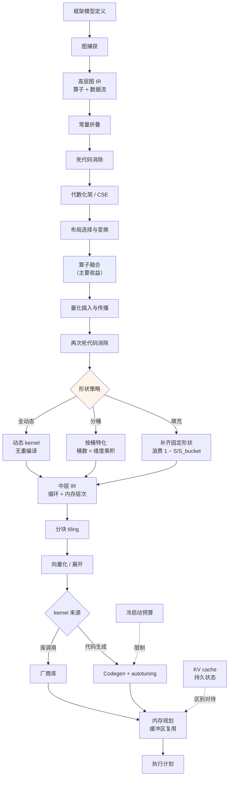

# 图编译器与中间表示

> 位置：[InferenceAtlas](../../INDEX.md) > [模块 04](README.md) > 当前文档
> 信息截至：2026-07-29 ｜ 最后核验：2026-07-29 ｜ 内容版本：v0.1
> 时效性等级：低
> 相关主题：[软件栈](01_inference_software_stack.md)｜`07_kernel_fusion_and_operator_optimization.md`｜`11_compiler_debugging_and_profiling.md`

## 本章导读

编译器把"用户写的模型"变成"硬件能高效执行的指令"，中间要经过多级中间表示（IR）。每一级 IR 都是一次抽象层次的下降：从"这是一个注意力层"降到"这是若干矩阵乘和 softmax"，再降到"这是一组嵌套循环和内存访问"，最后降到具体指令。

**为什么需要多级而不是一步到位**：不同的优化需要不同的信息。算子融合需要看到算子间的数据流（高层信息），而循环分块需要看到内存访问模式（低层信息）。把所有优化放在同一层，要么信息不足，要么复杂度失控。

本章说明各级 IR 的设计权衡、图优化的主要 pass，以及推理场景对编译器的特殊要求——尤其是动态形状这个训练中不那么突出的问题。

## 学习目标

读完本章后，读者应能够：

1. 说明多级 IR 的设计动机与各级承载的信息；
2. 列出图级优化的主要 pass 及其前提条件；
3. 分析动态形状对编译的影响与三种应对策略；
4. 判断一个优化应当在哪一级 IR 上做。

## 核心结论

- **多级 IR 的动机是"不同优化需要不同粒度的信息"**，而非工程洁癖。
- **图级优化的收益主要来自融合**，其余 pass（常量折叠、死代码消除、布局变换）多为辅助。
- **动态形状是推理编译的核心难题**，三种应对——全动态、分桶、填充——各有明确代价。
- **优化 pass 的顺序影响结果**。融合应在布局变换之后、量化插入之前，否则可能错失机会或引入冗余转换。

## 1. 问题定义、系统边界与工作负载

### 1.1 多级 IR 的层次

| 级别 | 承载的信息 | 适合的优化 |
|---|---|---|
| **高层图 IR** | 算子、张量、数据流依赖 | 融合、常量折叠、死代码消除、布局选择 |
| **中层 IR** | 循环结构、内存层次意图 | 分块（tiling）、循环变换、向量化 |
| **低层 IR** | 具体指令、寄存器 | 指令调度、寄存器分配 |

**逐级下降的原则**：每级只做该级信息足以支撑的优化。在高层做循环分块是不可能的（还没有循环）；在低层做算子融合是困难的（算子边界已消失）。

### 1.2 推理编译的特殊约束

| 约束 | 来源 | 影响 |
|---|---|---|
| **动态形状** | 序列长度、batch 随请求变 | 编译爆炸或 kernel 次优 |
| **有状态** | KV cache 跨步持续 | 内存规划必须区分持久与临时 |
| **控制流** | 自回归循环、投机解码的接受/拒绝 | 纯追踪无法处理 |
| **启动开销敏感** | decode 每步计算量小 | 需减少 kernel 数与 launch 次数 |
| **冷启动预算** | 编译时间进入 SLO | 限制 autotuning 深度 |

**其中动态形状影响最大**，第 2.3 节展开。

## 2. 原理、数学与性能模型

### 2.1 图级优化的主要 pass

| Pass | 作用 | 前提 | 收益来源 |
|---|---|---|---|
| **常量折叠** | 编译期算出常量表达式 | 输入为常量 | 减少运行时计算 |
| **死代码消除** | 删除结果未被使用的算子 | 数据流分析 | 减少无效工作 |
| **公共子表达式消除** | 合并重复计算 | 算子纯函数性 | 避免重算 |
| **代数化简** | 用等价但更便宜的形式替换 | 数学等价 | 减少算子数 |
| **布局变换** | 选择张量在内存中的排布 | 知道后续算子偏好 | **改善访存合并** |
| **算子融合** | 合并相邻算子 | 数据流可融合、无副作用 | **减少内存往返（主要收益）** |
| **量化插入** | 插入量化/反量化节点并传播 | 精度策略确定 | 减少字节数 |
| **常量预计算** | 权重的重排、预处理 | 权重不变 | 移到编译期 |

**相对重要性**：对推理而言，**融合与布局变换是主要收益来源**，因为它们直接作用于内存访问；其余 pass 多为清理性质，收益较小但成本也低。

### 2.2 融合的边界条件

不是所有相邻算子都能融合。判定条件：

| 条件 | 说明 |
|---|---|
| **数据流形状兼容** | 逐元素算子最易融合；改变形状的算子（reshape、transpose）需特殊处理 |
| **无副作用** | 算子不能有外部可见的状态修改 |
| **中间结果可放入片上** | 若中间张量太大，融合后仍需落显存，收益消失 |
| **数值可接受** | 融合可能改变累加顺序，需确认容差 |
| **没有多个消费者** | 若中间结果被多处使用，融合可能导致重算 |

**第三条最容易被忽略**：融合的收益来自中间结果不落显存，而这要求它能放进寄存器或共享内存。对于大张量，融合可能无效甚至有害（增加寄存器压力导致占用率下降）。

**推理中的典型融合模式**：

| 模式 | 融合内容 | 收益 |
|---|---|---|
| Fused LayerNorm/RMSNorm | 归约 + 缩放 + 逐元素 | 减少多次全张量往返 |
| Fused RoPE | 位置编码应用到 Q/K | 避免额外读写 |
| Fused attention | 打分 + softmax + 加权（tiling） | **避免物化中间矩阵** |
| Fused MLP | 上投影 + 激活 + 下投影的部分 | 减少中间张量 |
| Fused sampling | logits 处理 + top-k/top-p | 减少大词表张量往返 |
| Fused dequant + GEMM | 反量化与矩阵乘合并 | 避免物化高精度权重 |

**最后一行尤其重要**：若量化权重需要先反量化成完整的高精度张量再做矩阵乘，量化的带宽收益就完全丧失了。**量化必须与 kernel 融合才有意义**——这是 `09_quantization_kernels.md` 的核心。

### 2.3 动态形状的三种应对

| 策略 | 机制 | 优点 | 代价 |
|---|---|---|---|
| **全动态** | kernel 接受运行时形状 | 无浪费、无重编译 | kernel 可能次优（无法针对形状特化） |
| **分桶** | 为若干离散形状各编译一份 | 每桶内 kernel 最优 | 桶间填充浪费；桶数多则编译爆炸 |
| **填充到固定** | 补齐到固定大小 | 实现最简单 | **计算浪费**，比例取决于分布 |

**分桶的桶数问题**：若对 batch 大小与序列长度都分桶，桶数是二者的乘积。这很容易爆炸，因此实践中通常只对其中一维分桶。

**填充的浪费量化**：设桶边界为 $S_{bucket}$，实际长度为 $S$，则浪费比例为 $1 - S/S_{bucket}$。桶越粗浪费越大。

**推理的常见组合**：**序列长度用分桶或全动态，batch 用分桶**（因为 batch 的取值范围小且离散）。这与 CUDA Graphs 的要求也匹配——后者需要形状固定（见 `10_cuda_graphs_and_execution_overhead.md`）。

### 2.4 Pass 顺序的影响

优化 pass 不可交换，顺序影响结果：

| 顺序关系 | 原因 |
|---|---|
| 常量折叠 **先于** 融合 | 折叠后可能暴露新的融合机会 |
| 布局变换 **先于** 融合 | 融合后算子边界消失，无法再调整布局 |
| 融合 **先于** 量化插入 | 否则量化节点会阻断融合 |
| 内存规划 **最后** | 需要最终的算子序列与张量生存期 |
| 死代码消除 **多次穿插** | 每次变换都可能产生新的死代码 |

**实践含义**：当发现某个预期的融合没有发生时，**pass 顺序是首查项之一**——可能是前面某个 pass 插入了阻断节点。

## 3. 实现机制与系统设计

### 3.1 编译流水线

**图展示什么**：从模型定义到执行计划的完整编译流水线，含图级 pass 的顺序、形状策略的三分支，以及中低层的循环变换与 kernel 选择。

**核心瓶颈在哪**：高亮的 `算子融合` 是收益主体，其位置也很关键——必须在布局变换之后（否则无法调整布局）、量化插入之前（否则被阻断）。另一个高亮的 `形状策略` 是推理特有的决策点，三条分支的代价完全不同且不可兼得。

**图中的 trade-off**：右下角 `冷启动预算 → 限制 autotuning` 这条约束在推理中比训练严格得多：训练可以花几分钟调优换取几小时的加速，推理的冷启动时间直接进入 SLO（见 [模块 03 第 10 章](../03_serving_engines_and_scheduling/10_autoscaling_and_load_balancing.md)），因此 autotuning 深度受限。

**面试如何引用**：被问到"编译器怎么优化推理"时，用这条流水线说明 pass 顺序的重要性，并指出动态形状是推理特有的难点。能说出"融合必须在量化插入之前否则被阻断"这类具体约束，说明理解不止于概念。

### 3.2 IR 设计的权衡

| 设计选择 | 优点 | 代价 |
|---|---|---|
| IR 层级多 | 每级职责清晰、优化易写 | 转换开销、信息可能丢失 |
| IR 层级少 | 转换少、信息保留完整 | 单层复杂度高 |
| IR 表达力强（支持控制流、动态形状） | 覆盖场景广 | 优化难写、分析复杂 |
| IR 表达力受限（只支持静态数据流图） | 优化简单有效 | 无法处理动态场景 |
| 与硬件解耦 | 可移植 | 难以利用硬件特性 |
| 硬件相关 | 性能好 | 移植成本高 |

**推理场景的偏好**：由于推理的控制流相对简单（主要是自回归循环，且通常留在框架层），IR 可以选择较受限的表达力换取优化的简单有效。这与训练框架需要支持任意 Python 控制流的情况不同。

## 4. 性能、成本、能耗与可靠性 trade-off

| 决策 | 运行时性能 | 冷启动 | 可调试性 |
|---|---|---|---|
| 深度融合 | ↑↑ | ↓（编译久） | **↓↓** |
| 浅度融合 | ↑ | ≈ | 好 |
| 分桶细 | ↑（每桶最优） | **↓↓** | ≈ |
| 分桶粗 | ↓（浪费） | ↑ | ≈ |
| 全动态形状 | 中 | **↑↑** | 好 |
| Autotuning 深 | ↑ | **↓↓** | ≈ |
| 用厂商库 | ↑ | ↑ | ↓（黑盒） |
| 自生成 kernel | 视调优 | ↓ | 好（可读） |

**核心张力**：**运行时性能与冷启动时间对立**。推理中冷启动进入 SLO，因此不能像训练那样无限制地深度优化。实践中的常见做法是**编译产物缓存**——首次编译后持久化，后续实例直接加载，把冷启动成本摊薄到多次启动上。

## 5. benchmark、真实案例或公开部署案例

| 与本章相关的机制性结论 | 来源 |
|---|---|
| 通过分块把注意力的中间矩阵保持在片上而不物化到 HBM——一个"融合 + tiling"的典型案例，且数学上精确等价 | [FlashAttention, NeurIPS 2022](https://arxiv.org/abs/2205.14135) |
| 变长序列使批的形状分布动态变化，直接影响 kernel 选择 | [Orca, OSDI 2022](https://www.usenix.org/conference/osdi22/presentation/yu) |

> **来源限制**：具体编译器（TorchInductor、TensorRT、XLA、TVM、MLIR 等）的 IR 层级设计、pass 列表与实现细节，需引用各自官方文档与源码。这些站点在本环境**不可访问**（见 [AGENTS.md 第 11 节](../../AGENTS.md)），故本章只给出**与具体实现无关的编译原理与推理特有约束**，产品细节标注 `待核实`。

## 6. 设计决策框架

1. 明确形状分布（batch 与序列长度的实际取值范围与频率）；
2. 据此选择形状策略：取值少且离散 → 分桶；范围宽且连续 → 全动态；
3. 若分桶，只对一个维度分桶以避免爆炸；
4. 确认融合在 pass 顺序中的位置正确（布局之后、量化之前）；
5. 验证预期的融合确实发生（看 kernel 数量与编译日志）；
6. 检查融合的中间结果是否真的能放进片上——否则融合无效；
7. 按冷启动预算限制 autotuning 深度；
8. 启用编译产物缓存以摊薄冷启动；
9. 保留关闭单项优化的开关，用于问题定位。

## 7. 常见失败模式与排查路径

| 失败模式 | 表现 | 根因 | 纠正 |
|---|---|---|---|
| 预期融合未发生 | kernel 数量偏多 | pass 顺序或模式不匹配 | 查编译日志与 pass 顺序 |
| 融合后反而变慢 | 性能下降 | 中间结果过大，寄存器压力高 | 拆分融合 |
| 桶数爆炸 | 冷启动极慢、显存高 | 多维同时分桶 | 只分一维 |
| 填充浪费大 | 有效算力利用率低 | 桶粒度过粗 | 细化或改用动态 |
| 频繁重编译 | 运行中周期性卡顿 | 形状超出已编译集合 | 扩大覆盖或用动态 kernel |
| 量化阻断融合 | 量化后性能不升反降 | 量化插入过早 | 调整 pass 顺序 |
| 冷启动超预算 | 扩容不及时 | autotuning 过深 | 限制深度 + 产物缓存 |
| 数值与参考不符 | 结果偏差 | 融合改变累加顺序 | 确认容差；定位到具体 pass |

## 8. 关联面试主题

1. **为什么需要多级 IR** → 本章 1.1
2. **图级优化有哪些 pass，哪个收益最大** → 本章 2.1
3. **融合的边界条件是什么** → 本章 2.2
4. **动态形状有哪三种应对，各自代价** → 本章 2.3
5. **pass 顺序为什么重要** → 本章 2.4

## 9. 小结

多级 IR 的设计动机是不同优化需要不同粒度的信息：融合需要算子间数据流（高层），分块需要内存访问模式（中层），指令调度需要寄存器信息（低层）。图级优化中**融合与布局变换是主要收益来源**，其余多为清理性质。融合有四个边界条件，其中最易被忽略的是"中间结果必须能放进片上"——否则融合无效甚至因寄存器压力而有害。量化必须与 kernel 融合才有意义，否则反量化出完整高精度张量会抵消全部带宽收益。动态形状是推理编译的核心难题，全动态、分桶、填充三种应对各有明确代价，且分桶在多维同时使用时会爆炸。Pass 顺序不可交换：融合须在布局变换之后、量化插入之前，这是"预期融合未发生"时的首查项。运行时性能与冷启动时间对立，而推理的冷启动进入 SLO，因此 autotuning 深度受限，编译产物缓存是常见的摊薄手段。

## 关键术语

| 中文术语 | 英文 | 定义 | 单位/口径 | 关联文档 |
|---|---|---|---|---|
| 中间表示 | IR | 编译过程中的可优化表示，通常分多级 | — | 本章 1.1 |
| 优化 pass | optimization pass | 对 IR 施加的一次变换 | — | 本章 2.1 |
| 布局变换 | layout transformation | 选择张量在内存中的排布以改善访存 | — | 本章 2.1 |
| 分桶 | bucketing | 为若干离散形状分别编译 | 桶数 | 本章 2.3 |
| Pass 顺序 | pass ordering | 优化施加的先后，不可交换 | — | 本章 2.4 |
| 编译产物缓存 | compilation cache | 持久化编译结果以摊薄冷启动 | — | 本章 4 |

## 延伸阅读

- `07_kernel_fusion_and_operator_optimization.md` —— 融合的实现层面
- `09_quantization_kernels.md` —— 量化与融合的必然结合
- `11_compiler_debugging_and_profiling.md` —— 验证优化是否生效

## 主要来源

| # | 来源 | 类型 | 披露等级 | 核验日期 |
|---:|---|---|---|---|
| 1 | [FlashAttention (NeurIPS 2022)](https://arxiv.org/abs/2205.14135) | 会议论文 | 独立可复现实验 | 2026-07-29 |
| 2 | [Orca (OSDI 2022)](https://www.usenix.org/conference/osdi22/presentation/yu) | 会议论文 | 独立可复现实验 | 2026-07-29 |

> **说明**：本章为**与具体产品无关的编译原理分析**。各编译器的实际 IR 设计与 pass 实现标注 `待核实`，原因见第 5 节。

## 更新记录

| 日期 | 版本 | 变更 | 核验人 |
|---|---|---|---|
| 2026-07-29 | v0.1 | 初稿 | — |
