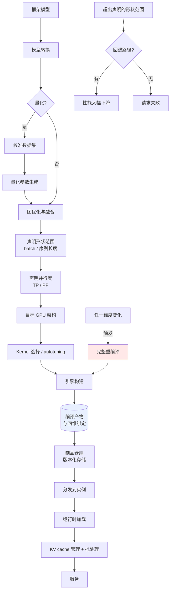

# TensorRT-LLM

> 位置：[InferenceAtlas](../../INDEX.md) > [模块 04](README.md) > 当前文档
> 信息截至：2026-07-29 ｜ 最后核验：2026-07-29 ｜ 内容版本：v0.1
> 时效性等级：**高**（版本演进快，90 天复核）
> 相关主题：[软件栈](01_inference_software_stack.md)｜[部署实践](../12_open_source_deployment_and_reproduction/)｜[09 量化 kernel](09_quantization_kernels.md)

> **来源限制声明**：撰写本章时，`docs.nvidia.com`、`developer.nvidia.com` 与 GitHub 上的
> NVIDIA/TensorRT-LLM 仓库在本环境**均不可访问**（组织级出口策略，见 [AGENTS.md 第 11 节](../../AGENTS.md)）。
> 因此本章**只给出可从编译器架构原理推导的分析框架与选型判据**，
> **不给出**版本号、配置项名称、默认值、特性矩阵或性能数字——这些一律标注 `待核实`，
> 待网络策略放开后逐条核验官方文档补入。读者不应把本章当作产品手册。

## 本章导读

TensorRT-LLM 属于"**深度编译型**"推理栈：它把模型编译成针对特定硬件、特定形状范围高度优化的执行引擎，用编译期的工作换取运行期的性能。

这条路线与"**运行时解释型**"栈（如以 PyTorch eager 为主的实现）构成推理软件的两个极端。理解这条谱系上的取舍，比记住任何单个产品的特性列表更有价值——因为特性会变，取舍结构不会。

本章的重点是：这类深度编译栈**在什么条件下值得**，以及它带来的**运维约束**是什么。

## 学习目标

读完本章后，读者应能够：

1. 说明深度编译型推理栈的价值来源与代价结构；
2. 列出评估这类产品时必须核实的问题清单；
3. 判断一个部署场景是否适合深度编译路线；
4. 识别深度编译带来的运维约束（编译产物管理、硬件绑定、调试困难）。

## 核心结论

- **深度编译的价值来自"把决策移到编译期"**：kernel 选择、内存规划、融合模式都可以针对具体硬件与形状做到最优。
- **代价是灵活性与运维复杂度**：编译产物与硬件、模型、形状范围绑定，任一变化都需重新编译。
- **适合的场景是"配置稳定、规模大、追求极致性能"**；不适合频繁换模型、形状高度动态或团队缺乏相应运维能力的场景。
- **选型必须核实的是特性矩阵与版本，而非宣传性能数字**——后者脱离配置无意义（见 [模块 00 第 3 章](../00_start_here/03_how_to_read_inference_benchmarks.md)）。

## 1. 问题定义、系统边界与工作负载

### 1.1 推理栈的谱系

| 类型 | 代表思路 | 编译期工作 | 运行期灵活性 |
|---|---|---|---|
| **解释执行** | 逐算子分发 | 无 | 最高 |
| 即时编译 | 首次执行时编译并缓存 | 中 | 中 |
| **深度编译（AOT）** | 提前编译成引擎 | **最多** | **最低** |

TensorRT-LLM 属于第三类。这个分类决定了它的全部优缺点。

### 1.2 深度编译栈的组成

一个深度编译型推理栈通常包含：

| 组件 | 职责 |
|---|---|
| 模型转换 | 从框架格式转为该栈的模型表示 |
| 图优化与融合 | 见 [第 2 章](02_graph_compilers_and_ir.md) |
| Kernel 选择/生成 | 针对具体 GPU 架构与形状 |
| 量化工具链 | 校准、量化参数生成、量化 kernel 绑定 |
| 引擎构建 | 产出可部署的编译产物 |
| 运行时 | 加载引擎、管理 KV cache、批处理 |
| 服务集成 | 与推理服务器/编排层对接 |

**关键认识**：编译产物是一个**与硬件架构、模型、形状范围、量化方案都绑定的二进制**。这个绑定关系是深度编译路线全部运维复杂度的来源。

## 2. 原理、数学与性能模型

### 2.1 编译期决策的价值

回顾 [第 1 章 2.1 节](01_inference_software_stack.md) 的三个机制，深度编译在每个上都能做得更彻底：

| 机制 | 解释执行 | 深度编译 |
|---|---|---|
| 算子融合 | 有限（只能用预定义的融合算子） | **可针对具体图结构生成** |
| 内存规划 | 运行时分配器 | **全局生存期分析，缓冲复用** |
| Kernel 选择 | 通用 kernel | **针对形状与架构特化** |

**为什么编译期能做得更好**：它有完整的全局信息（整张图、所有形状、目标硬件），且不受运行时预算限制——可以花几分钟搜索最优配置。

**收益的量级**：主要来自减少内存往返与选到更优 kernel，通常是**百分比级到小倍数级**，而非数量级。与调度层的倍数级杠杆（[模块 03](../03_serving_engines_and_scheduling/01_serving_architecture_overview.md)）相比是次一级的，**但在调度已优化后就是剩余的主要空间**。

> 具体的加速比必须来自有完整配置的实测，本章不给出。评估方法见 [模块 00 第 3 章](../00_start_here/03_how_to_read_inference_benchmarks.md)。`待核实`

### 2.2 绑定关系与重编译触发

编译产物绑定以下维度，任一变化即需重编译：

| 维度 | 变化场景 | 重编译成本 |
|---|---|---|
| **GPU 架构** | 换硬件代际 | 完整重编译 |
| **模型权重/结构** | 换模型、微调后 | 完整重编译 |
| **形状范围** | 支持更长上下文、更大 batch | 完整重编译 |
| **量化方案** | 调整精度策略 | 完整重编译 + 重新校准 |
| **并行度（TP/PP）** | 改变切分 | 完整重编译 |
| 栈版本 | 升级 | 通常需重编译 |

**运维含义**：**编译产物需要像制品一样被管理**——版本化、存储、分发、与运行时版本对齐。这是一个实实在在的工程负担，且规模越大越明显（多种 GPU × 多个模型 × 多个形状桶 × 多个量化方案）。

**成本估算**：设 $n_{gpu}$ 种硬件、$n_{model}$ 个模型、$n_{shape}$ 个形状配置、$n_{quant}$ 个量化方案，则产物数量为四者乘积。**这个乘积很容易失控**，是深度编译路线在多模型环境中的主要摩擦点。

### 2.3 与动态形状的张力

深度编译偏好静态形状（可特化），而推理天然动态。解决方式仍是 [第 2 章 2.3 节](02_graph_compilers_and_ir.md) 的三选一，但深度编译栈通常偏向**分桶 + 有限动态**：在构建时声明形状范围，编译器在该范围内生成可用的 kernel。

**这带来一个实际约束**：**形状范围必须在构建时确定**。若生产中出现超出范围的请求，要么被拒绝，要么触发回退路径（性能大幅下降）。因此**容量规划必须与编译配置对齐**——这是一个跨越 [模块 01 第 8 章](../01_foundations_and_metrics/08_capacity_planning.md) 与本模块的协同点。

## 3. 实现机制与系统设计

### 3.1 深度编译栈的部署流程

**图展示什么**：从框架模型到服务的完整部署链路，含量化校准、形状与并行度声明、引擎构建、制品管理与运行时加载。

**核心瓶颈在哪**：高亮的 `编译产物` 与 `完整重编译` 是这条路线的运维核心。产物与四个维度绑定，其组合数是乘积关系；任一维度变化都触发完整重编译，而非增量更新。**这是深度编译路线的主要摩擦，也是选型时最应评估的点。**

**图中的 trade-off**：右下角的 `超出声明的形状范围` 分支说明了静态特化的代价——性能来自编译期的假设，而假设失效时代价是性能骤降或请求失败。因此**形状范围的声明必须覆盖生产的实际分布（含尾部）**，这要求容量规划与编译配置协同。

**面试如何引用**：被问到"如何做 TensorRT-LLM / vLLM / SGLang 选型"时，不要比特性列表，而是用这张图说明深度编译路线的绑定关系与运维成本，再问对方的配置稳定性与团队能力——这才是选型的真实决定因素。

### 3.2 评估这类产品必须核实的问题

**选型时应当核实的不是宣传数字，而是这些结构性问题**：

| # | 问题 | 为什么重要 |
|---:|---|---|
| 1 | 支持哪些模型架构？新架构的支持滞后多久？ | 决定能否跟上模型迭代 |
| 2 | 支持哪些 GPU 架构？旧架构何时停止支持？ | 影响硬件生命周期规划 |
| 3 | 量化方案有哪些？各自的质量评估数据是否公开？ | 决定能否安全量化 |
| 4 | 形状范围如何声明？超出范围的行为是什么？ | 决定容量规划的耦合度 |
| 5 | 编译时间是多少？能否缓存与复用？ | 决定冷启动与运维成本 |
| 6 | 是否支持 continuous batching、chunked prefill、前缀缓存？ | 决定与调度层的配合 |
| 7 | 可观测性接口有哪些？ | 决定生产可运维性 |
| 8 | 许可与商业条款？ | 合规前提 |
| 9 | 与推理服务器/编排层的集成方式？ | 决定架构改造量 |
| 10 | 社区活跃度与版本节奏？ | 决定长期维护风险 |

> 以上问题的**具体答案**必须查阅官方文档与仓库，本环境不可达，故全部标注 `待核实`。本库的 [`inference_engines.csv`](../../data/inference_engines.csv) 已为这些字段预留了 schema。

### 3.3 适用与不适用

| 适合 | 不适合 |
|---|---|
| 配置稳定（模型与硬件长期不变） | 频繁换模型或做 A/B |
| 规模大（编译成本可摊薄） | 小规模、多模型 |
| 追求极致单机性能 | 优先开发效率 |
| 团队有相应运维能力 | 缺乏制品管理能力 |
| 形状分布可预知 | 形状高度不可预测 |
| 硬件同构 | 异构硬件池 |

**判据的核心是"变化频率"**：深度编译把成本前置到编译期，因此**变化越少越划算**。一个每周换模型的团队，其编译成本可能超过节省的推理成本。

## 4. 性能、成本、能耗与可靠性 trade-off

| 维度 | 深度编译栈 | 解释执行栈 |
|---|---|---|
| 峰值性能 | **高** | 中 |
| 冷启动 | 慢（除非产物缓存） | 快 |
| 模型切换成本 | **高**（需重编译） | 低 |
| 硬件绑定 | **强** | 弱 |
| 运维复杂度 | **高**（制品管理） | 低 |
| 可调试性 | 低 | 高 |
| 社区生态 | 视产品 | 通常更广 |

**混合策略**：实践中常见的做法是**主力模型用深度编译、长尾模型用解释执行**。这在性能与灵活性之间取得平衡，代价是维护两套栈。

## 5. benchmark、真实案例或公开部署案例

> **本章不引用任何性能数字。**
>
> 理由有二：(1) 官方文档在本环境不可达，无法核验；(2) 即使可达，脱离完整配置（模型版本、硬件、序列长度、并发、量化、软件版本）的加速比不可比，本库明令禁止这样引用（见 [模块 00 第 3 章](../00_start_here/03_how_to_read_inference_benchmarks.md)）。
>
> 待网络策略放开后，将按 [`benchmarks_schema.md`](../../data/schemas/benchmarks_schema.md) 的 20 项清单逐条录入官方与第三方结果。当前 [`benchmarks.csv`](../../data/benchmarks.csv) 为空。`待核实`

**可引用的机制性依据**：

| 结论 | 来源 |
|---|---|
| 融合与 tiling 通过减少 HBM 访问提升性能，是编译型优化的核心机制 | [FlashAttention, NeurIPS 2022](https://arxiv.org/abs/2205.14135) |
| 迭代级批处理改变了执行层面对的形状分布 | [Orca, OSDI 2022](https://www.usenix.org/conference/osdi22/presentation/yu) |

## 6. 设计决策框架

1. 评估配置变化频率（模型、硬件、形状、量化）——这是首要判据；
2. 估算编译产物的组合数（四维乘积），判断制品管理负担；
3. 核实第 3.2 节的 10 个问题（需官方文档）；
4. 确认形状范围能覆盖生产分布的 P99，并定义超范围行为；
5. 确认与调度层能力的配合（continuous batching 等）；
6. 若量化，先做质量评测再上线；
7. 建立编译产物的版本化、存储与分发流程；
8. 保留一条解释执行的回退路径用于应急与调试；
9. 在自己的 workload 上做对比测试，不采信宣传数字。

## 7. 常见失败模式与排查路径

| 失败模式 | 表现 | 根因 | 纠正 |
|---|---|---|---|
| 产物组合爆炸 | 存储与运维不堪重负 | 四维乘积失控 | 减少维度（统一硬件/收敛形状桶） |
| 超出形状范围 | 请求失败或性能骤降 | 声明范围未覆盖尾部 | 按 P99 声明 |
| 换模型成本高 | 迭代变慢 | 深度编译不适合该场景 | 长尾模型改用解释执行 |
| 冷启动超预算 | 扩容不及时 | 编译未缓存 | 产物预构建 + 缓存 |
| 版本不匹配 | 加载失败或行为异常 | 引擎与运行时版本错配 | 版本对齐检查 |
| 量化后质量下降 | 效果变差 | 未做质量评测 | 上线前评测 |
| 无法定位性能问题 | 慢但不知为何 | 编译产物黑盒 | 保留可观测接口与回退路径 |
| 采信宣传数字选型 | 实际不及预期 | 配置不同 | 自己 workload 上实测 |

## 8. 关联面试主题

1. **深度编译型与解释执行型推理栈的取舍** → 本章 1.1、4
2. **编译产物与哪些维度绑定，运维含义是什么** → 本章 2.2
3. **如何做推理引擎选型** → 本章 3.2–3.3
4. **深度编译栈如何处理动态形状** → 本章 2.3
5. **为什么不能用宣传的加速比做选型依据** → 本章 5、[模块 00 第 3 章](../00_start_here/03_how_to_read_inference_benchmarks.md)

## 9. 小结

TensorRT-LLM 代表"深度编译型"推理栈：把 kernel 选择、内存规划、融合模式的决策前置到编译期，用完整的全局信息与不受限的编译预算换取运行期性能。其收益通常是百分比级到小倍数级——次于调度层的倍数级杠杆，但在调度优化到位后就是剩余的主要空间。代价集中在**绑定关系**：编译产物与 GPU 架构、模型、形状范围、量化方案、并行度五个维度绑定，产物数量是这些维度的乘积，且任一变化都触发完整重编译而非增量更新。这使得**配置变化频率成为选型的首要判据**——变化越少越划算。形状范围必须在构建时声明并覆盖生产分布的尾部，否则超范围请求会性能骤降或失败，因此容量规划必须与编译配置协同。选型时应核实的是特性矩阵、支持范围与运维接口这些结构性问题，而非宣传的加速比——后者脱离完整配置不可比。

## 关键术语

| 中文术语 | 英文 | 定义 | 单位/口径 | 关联文档 |
|---|---|---|---|---|
| 深度编译 | ahead-of-time compilation | 提前编译成与硬件绑定的执行引擎 | — | 本章 1.1 |
| 编译产物 | compiled engine / artifact | 与硬件、模型、形状、量化绑定的二进制 | — | 本章 2.2 |
| 绑定维度 | binding dimensions | 触发重编译的配置维度 | 个 | 本章 2.2 |
| 形状范围声明 | shape range declaration | 构建时声明支持的 batch 与序列长度区间 | — | 本章 2.3 |
| 回退路径 | fallback path | 超出编译假设时的降级执行方式 | — | 本章 3.1 |

## 延伸阅读

- [02 图编译器与 IR](02_graph_compilers_and_ir.md) —— 编译期做了什么
- [12 模块：部署与参考架构](../12_open_source_deployment_and_reproduction/) —— 各引擎的部署对比
- [模块 00 第 3 章：如何读 benchmark](../00_start_here/03_how_to_read_inference_benchmarks.md) —— 为什么不能采信宣传数字

## 主要来源

| # | 来源 | 类型 | 披露等级 | 核验日期 |
|---:|---|---|---|---|
| 1 | [FlashAttention (NeurIPS 2022)](https://arxiv.org/abs/2205.14135) | 会议论文 | 独立可复现实验 | 2026-07-29 |
| 2 | [Orca (OSDI 2022)](https://www.usenix.org/conference/osdi22/presentation/yu) | 会议论文 | 独立可复现实验 | 2026-07-29 |

> **说明**：本章为**深度编译型推理栈的架构分析框架**，不是 TensorRT-LLM 的产品手册。所有产品特定信息（版本、配置项、特性矩阵、性能）因官方来源不可达而标注 `待核实`，见章首来源限制声明。

## 更新记录

| 日期 | 版本 | 变更 | 核验人 |
|---|---|---|---|
| 2026-07-29 | v0.1 | 初稿（受来源限制，仅含架构分析） | — |
