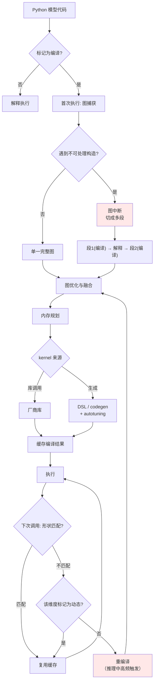

# torch.compile、Inductor 与 Triton

> 位置：[InferenceAtlas](../../INDEX.md) > [模块 04](README.md) > 当前文档
> 信息截至：2026-07-29 ｜ 最后核验：2026-07-29 ｜ 内容版本：v0.1
> 时效性等级：**高**（90 天复核）
> 相关主题：[图编译器与 IR](02_graph_compilers_and_ir.md)｜`07_kernel_fusion_and_operator_optimization.md`｜`11_compiler_debugging_and_profiling.md`

> **来源限制声明**：`pytorch.org`、`docs.pytorch.org` 与相关 GitHub 仓库在本环境**不可访问**（见 [AGENTS.md 第 11 节](../../AGENTS.md)）。本章只给出**可从编译原理推导的架构分析**，所有 API 名称、版本行为、配置项与性能数字标注 `待核实`。

## 本章导读

与 [上一章](03_tensorrt_llm.md) 的深度编译路线不同，`torch.compile` 代表**渐进式编译**：默认走解释执行，用户按需在热点上开启编译，编译在首次执行时发生并缓存。

这条路线的设计取舍很清晰：**用一部分峰值性能换取开发效率与灵活性**。对推理而言，它的价值在于让"写 Python、跑得不太慢"成为可能，而不必把模型转成另一套表示。

本章讨论三个层次——图捕获前端、编译中端、kernel 生成后端——各自的职责与推理场景下的具体困难。

## 学习目标

读完本章后，读者应能够：

1. 说明渐进式编译与深度编译的取舍差异；
2. 分解图捕获、图编译、kernel 生成三层的职责；
3. 解释图中断（graph break）为何发生及其性能后果；
4. 说明用 Python DSL 写 kernel 的价值与局限。

## 核心结论

- **渐进式编译的核心价值是"不改变编程模型"**：模型仍是 Python 代码，编译是可选的加速层。
- **图中断是主要性能陷阱**：编译器无法处理的构造会把图切成多段，融合机会随之丢失。
- **推理的动态形状会触发重编译**，这在生成循环中尤其麻烦——序列长度每步都变。
- **Python DSL 写 kernel 降低了门槛**，但不改变性能上限由硬件与算法决定这一事实。

## 1. 问题定义、系统边界与工作负载

### 1.1 三层结构

| 层 | 职责 | 输出 |
|---|---|---|
| **图捕获前端** | 分析 Python 执行，提取可编译的子图 | 计算图 + 未捕获部分 |
| **编译中端** | 图优化、融合决策、内存规划 | 优化后的图 |
| **Kernel 生成后端** | 生成设备端代码或调用库 | 可执行 kernel |

**与深度编译栈的对应关系**：这三层与 [第 1 章](01_inference_software_stack.md) 的第 2–6 层一致，差别在于**何时执行**（首次运行时 vs 部署前）与**覆盖范围**（部分子图 vs 整个模型）。

### 1.2 部分编译的含义

渐进式编译不要求整个模型可编译。遇到无法处理的构造时，它把图**切断**，未捕获部分回落到解释执行。

**后果**：

| 影响 | 说明 |
|---|---|
| 融合机会丢失 | 跨越断点的算子无法融合 |
| 额外的边界开销 | 每段编译图的进出都有成本 |
| 优化范围受限 | 内存规划只在段内有效 |

**因此"编译成功"不等于"编译有效"**——需要检查图被切成了几段。这是本路线最重要的诊断动作。

## 2. 原理、数学与性能模型

### 2.1 图中断的常见来源

| 来源 | 为什么难处理 |
|---|---|
| 数据依赖的控制流 | 分支取决于张量值，编译期不可知 |
| 与外部系统交互 | 打印、日志、文件 IO 有副作用 |
| 不支持的算子或库调用 | 编译器不认识 |
| Python 动态特性 | 反射、动态属性 |
| 张量值转 Python 标量 | 强制同步，且值编译期不可知 |

**推理场景的高发点**：

- **自回归循环的终止判断**（是否生成了结束标记）是数据依赖控制流；
- **采样逻辑**中常有 `.item()` 之类的取值操作；
- **KV cache 的动态增长**涉及形状变化。

**实践中的应对**：把编译范围限定在**单步前向**（不含循环与采样），循环与采样留在解释执行。这与 [第 2 章 3.2 节](02_graph_compilers_and_ir.md) 讨论的图捕获路线一致。

### 2.2 重编译的代价

编译结果针对特定的形状与类型特化。当输入不匹配时触发重编译。

**推理中的触发源**：

| 变化 | 频率 |
|---|---|
| batch 大小变化 | **每次迭代可能变**（continuous batching） |
| 序列长度变化 | **每步都变**（decode 逐步增长） |
| KV cache 长度变化 | 同上 |

**这是推理编译的核心困难**：若对每个形状都特化，重编译会持续发生，其开销可能超过编译带来的收益。

**应对**：

| 手段 | 机制 | 代价 |
|---|---|---|
| **标记为动态维度** | 该维度不参与特化 | kernel 可能次优 |
| 分桶 | 按桶特化 | 桶间填充浪费 |
| 限制重编译次数 | 超限后回落到动态 | 部分场景次优 |

**推荐做法**：**把序列长度维度标记为动态，batch 维度分桶**。理由是序列长度取值连续且范围宽（分桶不现实），而 batch 取值离散且范围小。

### 2.3 Python DSL 写 kernel

Triton 一类的工具允许用 Python 语法写 GPU kernel，编译器负责生成实际的设备代码。

**价值**：

| 方面 | 说明 |
|---|---|
| 降低门槛 | 无需写 CUDA C++，无需手动管理线程块索引 |
| 自动化部分优化 | 内存合并、共享内存分配可由编译器处理 |
| 快速迭代 | 修改与测试周期短 |
| 可读性 | kernel 逻辑更接近算法描述 |

**局限**（必须清楚）：

| 局限 | 说明 |
|---|---|
| 性能上限不变 | 仍受 Roofline 约束；DSL 不创造带宽 |
| 抽象泄漏 | 要写出好 kernel 仍需理解 tiling、共享内存、占用率 |
| 硬件特性覆盖 | 最新硬件特性可能不被支持 |
| 极致优化仍需底层 | 追求最后百分之几时可能要回到底层 |

**结论**：DSL 改变的是**编写成本**，不是**性能上限**。它让更多人能写出 80 分的 kernel，但 95 分的 kernel 仍需要理解硬件。

## 3. 实现机制与系统设计

### 3.1 渐进式编译的执行路径

**图展示什么**：渐进式编译的完整路径，含图中断的产生、编译缓存与重编译触发。

**核心瓶颈在哪**：两个高亮点。`图中断` 使融合只能在段内进行，跨段的优化机会丢失；`重编译` 在推理中因序列长度每步变化而高频触发，其开销可能吞掉编译收益。**这两个是本路线诊断的首查项。**

**图中的 trade-off**：右下 `该维度标记为动态?` 是关键旋钮——标记为动态可避免重编译但 kernel 无法针对形状特化；不标记则 kernel 更优但重编译频繁。**没有两全，必须按维度分别决策**（序列长度动态、batch 分桶）。

**面试如何引用**：被问到 torch.compile 在推理中的问题时，答图中断与重编译两点，并说明推荐的维度策略。能指出"编译成功不等于编译有效，要看图被切成几段"是实践经验的标志。

### 3.2 诊断清单

| 检查项 | 方法 | 期望 |
|---|---|---|
| 图被切成几段 | 编译日志/诊断工具 | 越少越好，理想为 1 |
| 中断发生在哪 | 同上 | 定位到具体代码行 |
| 重编译次数 | 计数器 | 稳定后应趋近 0 |
| 实际 kernel 数量 | profiler | 应显著少于未编译时 |
| 编译耗时 | 计时 | 需在冷启动预算内 |
| 数值是否一致 | 与解释执行对比 | 在容差内 |

> 具体的诊断工具名称、环境变量与日志格式需查官方文档，本环境不可达。`待核实`

## 4. 性能、成本、能耗与可靠性 trade-off

| 维度 | 渐进式编译 | 深度编译 |
|---|---|---|
| 编程模型 | **不变** | 需转换 |
| 峰值性能 | 中到高 | **高** |
| 首次执行 | 慢（编译） | 快（已编译） |
| 部署前准备 | 无 | 需构建引擎 |
| 模型切换 | **容易** | 需重编译 |
| 动态形状 | 支持但可能重编译 | 需声明范围 |
| 可调试性 | **较好** | 差 |
| 制品管理 | 无（或轻量缓存） | **重** |

**选择判据**：**变化频率高、团队规模小、追求开发效率 → 渐进式；配置稳定、规模大、追求极致 → 深度编译。** 这与 [上一章 3.3 节](03_tensorrt_llm.md) 是同一个判据的两面。

## 5. benchmark、真实案例或公开部署案例

> 本章**不给出任何性能数字**：官方来源不可达且脱离配置的加速比不可比。见 [模块 00 第 3 章](../00_start_here/03_how_to_read_inference_benchmarks.md)。`待核实`

| 可引用的机制性依据 | 来源 |
|---|---|
| 通过 tiling 把注意力中间结果保持在片上，是 kernel 层优化的典型 | [FlashAttention, NeurIPS 2022](https://arxiv.org/abs/2205.14135) |

## 6. 设计决策框架

1. 先确认瓶颈在执行层（Roofline 定位）；
2. 把编译范围限定在**单步前向**，循环与采样留在解释执行；
3. 序列长度维度标记为动态，batch 维度分桶；
4. 编译后**检查图被切成几段**，逐个消除中断；
5. 观察重编译次数，稳定后应趋近 0；
6. 对比编译前后的实际 kernel 数量，确认融合生效；
7. 确认编译耗时在冷启动预算内，必要时用缓存；
8. 与解释执行对比数值，确认在容差内；
9. 保留关闭编译的开关用于调试。

## 7. 常见失败模式与排查路径

| 失败模式 | 表现 | 根因 | 纠正 |
|---|---|---|---|
| 编译后无加速 | 性能不变 | 图被切成多段 | 定位并消除中断 |
| 运行中周期性卡顿 | 时延尖峰 | 重编译 | 标记动态维度 |
| 冷启动超预算 | 扩容慢 | 编译耗时 | 缓存 + 限制 autotuning |
| 编译后 OOM | 显存超 | 编译期额外占用或缓存膨胀 | 限制缓存大小 |
| 数值不一致 | 结果偏差 | 融合改变累加顺序 | 确认容差；定位到 pass |
| 采样逻辑破坏图 | 中断在循环内 | `.item()` 等取值操作 | 编译只覆盖前向 |
| 每步都重编译 | 极慢 | 序列长度参与特化 | 该维度标记动态 |

## 8. 关联面试主题

1. **渐进式编译与深度编译的取舍** → 本章 4
2. **什么是图中断，为何影响性能** → 本章 1.2、2.1
3. **推理中为什么重编译特别频繁** → 本章 2.2
4. **动态维度与分桶如何按维度选择** → 本章 2.2
5. **Python DSL 写 kernel 的价值与局限** → 本章 2.3

## 9. 小结

`torch.compile` 代表渐进式编译路线：不改变编程模型，编译作为可选加速层在首次执行时发生并缓存。其核心价值是开发效率与灵活性，代价是峰值性能通常不及深度编译。推理场景下有两个主要陷阱：**图中断**使编译图被切成多段、跨段融合机会丢失——因此"编译成功"不等于"编译有效"，必须检查段数；**重编译**因序列长度每步变化而高频触发，其开销可能吞掉编译收益。推荐的应对是把编译范围限定在单步前向、序列长度维度标记为动态、batch 维度分桶。Python DSL 写 kernel 显著降低了编写门槛，但性能上限仍由 Roofline 与算法决定——它让更多人写出 80 分 kernel，95 分仍需理解硬件。

## 关键术语

| 中文术语 | 英文 | 定义 | 单位/口径 | 关联文档 |
|---|---|---|---|---|
| 渐进式编译 | progressive / JIT compilation | 默认解释执行，按需在热点编译并缓存 | — | 本章 1.1 |
| 图中断 | graph break | 编译器无法处理的构造导致图被切断 | 段数 | 本章 1.2 |
| 重编译 | recompilation | 输入形状/类型不匹配缓存时重新编译 | 次 | 本章 2.2 |
| 动态维度 | dynamic dimension | 不参与特化的张量维度 | — | 本章 2.2 |
| Kernel DSL | kernel DSL | 用高级语言编写 GPU kernel 的领域语言 | — | 本章 2.3 |

## 延伸阅读

- [03 TensorRT-LLM](03_tensorrt_llm.md) —— 对照的深度编译路线
- `07_kernel_fusion_and_operator_optimization.md` —— 融合的实现细节
- `11_compiler_debugging_and_profiling.md` —— 诊断工具

## 主要来源

| # | 来源 | 类型 | 披露等级 | 核验日期 |
|---:|---|---|---|---|
| 1 | [FlashAttention (NeurIPS 2022)](https://arxiv.org/abs/2205.14135) | 会议论文 | 独立可复现实验 | 2026-07-29 |

> **说明**：本章为**渐进式编译路线的架构分析**，非产品手册。API 名称、版本行为、配置项与性能数字因官方来源不可达而标注 `待核实`。

## 更新记录

| 日期 | 版本 | 变更 | 核验人 |
|---|---|---|---|
| 2026-07-29 | v0.1 | 初稿（受来源限制，仅含架构分析） | — |
