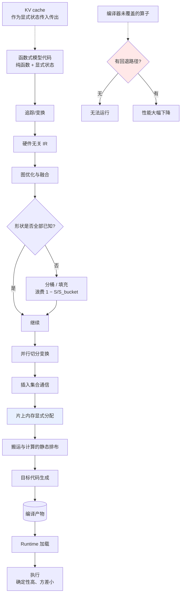

# XLA、JAX 与 TPU Runtime

> 位置：[InferenceAtlas](../../INDEX.md) > [模块 04](README.md) > 当前文档
> 信息截至：2026-07-29 ｜ 最后核验：2026-07-29 ｜ 内容版本：v0.1
> 时效性等级：**高**（90 天复核）
> 相关主题：[图编译器与 IR](02_graph_compilers_and_ir.md)｜[硬件架构](../07_hardware_and_server_architecture/)｜[分布式推理](../06_distributed_and_moe_inference/)

> **来源限制声明**：Google 相关官方文档站在本环境**不可访问**（见 [AGENTS.md 第 11 节](../../AGENTS.md)）。本章只给出**可从编译器与硬件架构原理推导的分析**，所有 API、版本行为、TPU 具体规格与性能数字标注 `待核实`。

## 本章导读

XLA 代表第三条路线：**面向特定硬件设计的编译器优先栈**。与 GPU 生态"先有硬件后有编译器"不同，这条路线中编译器与加速器是协同设计的——硬件可以放弃通用性，把复杂度交给编译器。

这带来一个对推理系统有实际意义的对照：**当硬件更规整（大矩阵单元、显式管理的片上内存、确定性执行）时，编译器能做的事更多，但对编译器的依赖也更强**。理解这个取舍，有助于评估任何"编译器 + 专用芯片"的方案，而不限于某一家。

## 学习目标

读完本章后，读者应能够：

1. 说明编译器优先栈与硬件的协同设计关系；
2. 解释函数式编程模型如何简化编译；
3. 分析静态形状要求对推理的影响；
4. 评估任何"专用芯片 + 专用编译器"方案的通用判据。

## 核心结论

- **编译器优先栈用"编译器承担复杂度"换取"硬件可以更简单规整"**，这是一个系统级的复杂度转移而非消除。
- **函数式、无副作用的编程模型显著简化编译**：纯函数易于分析、变换与并行化。
- **静态形状要求与推理的动态性冲突**，应对方式仍是分桶或填充，代价与 [第 2 章](02_graph_compilers_and_ir.md) 所述一致。
- **对编译器的强依赖是双刃剑**：编译器覆盖的场景性能优秀，未覆盖的场景可能没有回退路径。

## 1. 问题定义、系统边界与工作负载

### 1.1 协同设计的含义

| 维度 | 通用 GPU 路线 | 编译器优先路线 |
|---|---|---|
| 硬件复杂度 | 高（缓存层次、乱序、动态调度） | **较低**（规整、确定性） |
| 编译器复杂度 | 中（可依赖硬件的动态机制） | **高**（必须静态安排一切） |
| 片上内存管理 | 部分由硬件缓存自动完成 | **通常需显式管理** |
| 执行确定性 | 较低 | **高** |
| 对新算子的适应 | 快（写 kernel 即可） | 慢（需编译器支持） |

**核心权衡**：硬件放弃动态机制换取面积与能效，代价是编译器必须做得更好，且对编译器未覆盖的场景缺乏回退。

**对推理的实际含义**：这类栈在**成熟、规整的 workload**（标准 Transformer 推理）上可以做得很好，但在**新架构、非常规算子**上适配周期更长。因此选型时应当问：我的模型架构是否在其良好支持的范围内？

### 1.2 函数式编程模型

这条路线通常配合函数式风格：变换以纯函数形式表达，无隐式状态修改。

**为什么这简化编译**：

| 性质 | 编译上的好处 |
|---|---|
| 无副作用 | 算子可自由重排、融合、消除 |
| 显式数据流 | 依赖关系清晰，无隐藏耦合 |
| 不可变张量 | 无别名分析难题 |
| 变换可组合 | 批处理、并行、微分可作为程序变换实现 |

**代价**：程序员必须显式管理状态。对推理而言，**KV cache 恰恰是一个持续变化的状态**——这需要以显式的"状态进、状态出"形式表达，写起来比原地修改繁琐。

## 2. 原理、数学与性能模型

### 2.1 静态形状的要求与代价

编译器优先栈通常要求**编译时已知全部形状**，因为它要静态安排片上内存与执行调度。

**与推理动态性的冲突**（同 [第 2 章 2.3 节](02_graph_compilers_and_ir.md)）：

| 推理中的动态源 | 应对 |
|---|---|
| batch 变化 | 分桶 |
| 序列长度增长 | **填充到桶边界** |
| KV cache 增长 | 预分配到最大长度或分桶 |

**填充浪费的量化**：桶边界 $S_{bucket}$、实际长度 $S$，浪费比例 $1 - S/S_{bucket}$。

**decode 阶段的特殊性**：每步序列长度加一，若严格按长度分桶，桶数等于最大长度。实际做法是按较粗的粒度分桶，接受桶内填充——**这意味着 decode 的注意力计算有一部分是在填充位置上做的无效工作**。

**代价的可接受性**：由于 decode 是 memory-bound（[模块 01 第 5 章](../01_foundations_and_metrics/05_memory_bandwidth_and_arithmetic_intensity.md)），额外的计算不一定转化为额外时间——只要不额外读取 KV。这使得填充在 decode 中的实际代价小于其算力浪费比例。**但填充位置的 KV 若被读取，则代价是实打实的。**

### 2.2 编译器承担的额外职责

在这条路线上，编译器要做通用 GPU 栈中由硬件承担的工作：

| 职责 | 通用 GPU | 编译器优先 |
|---|---|---|
| 片上数据放置 | 缓存自动 | **编译器显式安排** |
| 数据搬运时机 | 硬件预取 | **编译器插入** |
| 计算与搬运重叠 | 硬件调度 | **编译器排布** |
| 多设备通信 | 运行时库 | **常在编译期确定** |

**后果**：编译时间更长、编译器 bug 的影响更大、但一旦编译成功执行更可预测（时延方差小）。

**对 SLO 的含义**：执行确定性高意味着 **P99 与 P50 的差距更小**——这在有严格尾时延要求的场景中是一个真实优势，且常被性能对比忽略（对比通常只看均值或峰值吞吐）。

### 2.3 多设备的编译期切分

这条路线通常把并行切分表达为**程序变换**：用户标注张量如何在设备网格上分片，编译器据此插入通信。

**优点**：切分策略与模型代码分离，改变并行度不需重写模型。

**局限**：切分方案在编译期确定，运行时不能改变。对推理而言这通常可接受（并行度是部署配置，不随请求变化）。

**与推理的结合点**：张量并行的通信落在每 token 的关键路径上（见 [模块 06](../06_distributed_and_moe_inference/)）。编译期确定切分使得通信与计算的重叠可以被静态排布，这在理论上优于运行时决策。

## 3. 实现机制与系统设计

### 3.1 编译器优先栈的结构

**图展示什么**：编译器优先栈的完整链路，含函数式前端、形状处理、并行切分、片上内存的显式管理与静态排布。

**核心瓶颈在哪**：高亮的 `片上内存显式分配` 是这条路线与通用 GPU 栈的分水岭——它由编译器而非硬件缓存完成，这既是性能优势的来源（无缓存不命中的不确定性），也是复杂度的来源。另一个高亮的 `有回退路径?` 是风险点：强依赖编译器意味着未覆盖场景可能完全无法运行。

**图中的 trade-off**：`执行确定性高、方差小` 是一个常被低估的优势——它直接改善 P99/P50 比值。但代价是灵活性：新算子需要编译器支持，而非写个 kernel 就能用。

**面试如何引用**：被问到"专用芯片 + 专用编译器的方案怎么评估"时，用这张图指出复杂度转移（硬件→编译器）、确定性优势、以及回退路径缺失的风险。这个框架适用于任何同类方案，不限于某一家。

### 3.2 评估同类方案的通用判据

| # | 问题 | 为什么重要 |
|---:|---|---|
| 1 | 支持哪些模型架构？新架构适配周期多长？ | 决定能否跟上迭代 |
| 2 | 编译器未覆盖的算子有无回退路径？ | 决定风险上限 |
| 3 | 形状如何处理？填充浪费多大？ | 影响有效利用率 |
| 4 | 编译时间多长？可否缓存？ | 影响冷启动 |
| 5 | 执行时延的方差如何？ | 影响 P99 |
| 6 | 并行切分如何表达与调整？ | 影响部署灵活性 |
| 7 | 可观测性接口有哪些？ | 决定可运维性 |
| 8 | 生态成熟度（模型可得性、工具链）？ | 决定迁移成本 |

> 具体答案需查官方文档，本环境不可达。`待核实`

## 4. 性能、成本、能耗与可靠性 trade-off

| 维度 | 编译器优先栈 | 通用 GPU 栈 |
|---|---|---|
| 规整 workload 性能 | **高** | 高 |
| 非常规算子 | **弱**（需编译器支持） | 强（写 kernel 即可） |
| 时延确定性 | **高** | 中 |
| 编译时间 | 长 | 中 |
| 生态广度 | 较窄 | **广** |
| 硬件能效 | 可能更优（面积换能效） | 中 |
| 迁移成本 | **高** | 低 |

**选型的核心问题不是性能而是覆盖度**：如果你的模型与算子在良好支持范围内，这类方案通常表现优秀；如果你需要频繁引入新架构，适配周期会成为主要摩擦。

## 5. benchmark、真实案例或公开部署案例

> 本章**不给出任何 TPU 规格或性能数字**。这些必须来自官方文档与 MLPerf 官方结果，二者在本环境均不可达。将在 [`accelerators.csv`](../../data/accelerators.csv) 与 [`benchmarks.csv`](../../data/benchmarks.csv) 中逐条附来源后录入。`待核实`

| 可引用的机制性依据 | 来源 |
|---|---|
| 减少 HBM 访问是长序列注意力的关键，无论何种硬件 | [FlashAttention, NeurIPS 2022](https://arxiv.org/abs/2205.14135) |
| Transformer 的计算图结构决定了编译优化的机会所在 | [Attention Is All You Need, NeurIPS 2017](https://arxiv.org/abs/1706.03762) |

## 6. 设计决策框架

1. 确认模型架构在该栈的良好支持范围内（第 3.2 节问题 1）；
2. 确认存在回退路径，或接受"未覆盖即不可用"的风险；
3. 估算填充浪费比例，判断是否可接受；
4. 评估编译时间与冷启动预算；
5. 若尾时延是主要 SLO，把执行确定性优势纳入评估；
6. 评估并行切分的表达方式是否满足部署需求；
7. 核算迁移成本（模型转换、工具链、团队学习）；
8. 在自己的 workload 上实测，不采信宣传数字。

## 7. 常见失败模式与排查路径

| 失败模式 | 表现 | 根因 | 纠正 |
|---|---|---|---|
| 新模型无法运行 | 编译失败 | 算子未支持 | 确认适配周期或换栈 |
| 填充浪费大 | 有效利用率低 | 桶粒度粗 | 细化分桶 |
| 编译时间过长 | 冷启动超预算 | 静态排布搜索空间大 | 缓存产物 |
| 迁移成本超预期 | 项目延期 | 低估生态差异 | 先做小规模验证 |
| 只比峰值吞吐 | 选型判断偏差 | 忽略确定性优势 | 同时比 P99/P50 |
| 无回退路径 | 单点风险 | 强依赖编译器 | 准备备用栈 |

## 8. 关联面试主题

1. **编译器优先栈与通用 GPU 栈的取舍** → 本章 1.1、4
2. **函数式编程模型为何简化编译** → 本章 1.2
3. **静态形状要求对推理的影响** → 本章 2.1
4. **为什么执行确定性对 SLO 有价值** → 本章 2.2
5. **如何评估"专用芯片 + 专用编译器"方案** → 本章 3.2

## 9. 小结

XLA 一类的编译器优先栈体现了一次系统级的复杂度转移：硬件放弃缓存、乱序等动态机制以换取面积与能效，编译器则承担片上内存放置、搬运时机、计算通信重叠的静态安排。函数式、无副作用的编程模型显著简化了这类编译，代价是 KV cache 这类持续状态必须显式地"进出"表达。静态形状要求与推理的动态性冲突，应对仍是分桶与填充；但由于 decode 是 memory-bound，填充的算力浪费不一定完全转化为时间损失——**除非填充位置的 KV 也被读取**。这条路线的一个常被低估的优势是执行确定性带来的低时延方差，直接改善 P99/P50 比值；主要风险则是对编译器的强依赖——未覆盖的算子可能没有回退路径。因此选型的核心问题不是峰值性能而是**覆盖度**。

## 关键术语

| 中文术语 | 英文 | 定义 | 单位/口径 | 关联文档 |
|---|---|---|---|---|
| 协同设计 | hardware-compiler co-design | 硬件与编译器共同设计，复杂度在二者间分配 | — | 本章 1.1 |
| 函数式模型 | functional programming model | 纯函数、无副作用、状态显式传递 | — | 本章 1.2 |
| 静态排布 | static scheduling | 编译期确定数据搬运与计算的时序 | — | 本章 2.2 |
| 填充浪费 | padding waste | $1-S/S_{bucket}$，因补齐固定形状产生 | % | 本章 2.1 |
| 覆盖度 | coverage | 编译器支持的算子与架构范围 | — | 本章 4 |

## 延伸阅读

- [02 图编译器与 IR](02_graph_compilers_and_ir.md) —— 形状策略的通用讨论
- [06 跨硬件可移植性](06_onnx_runtime_openvino_and_portability.md) —— 跨硬件的另一条路径
- [模块 07：硬件架构](../07_hardware_and_server_architecture/) —— 加速器设计取舍

## 主要来源

| # | 来源 | 类型 | 披露等级 | 核验日期 |
|---:|---|---|---|---|
| 1 | [FlashAttention (NeurIPS 2022)](https://arxiv.org/abs/2205.14135) | 会议论文 | 独立可复现实验 | 2026-07-29 |
| 2 | [Attention Is All You Need (NeurIPS 2017)](https://arxiv.org/abs/1706.03762) | 会议论文 | 独立可复现实验 | 2026-07-29 |

> **说明**：本章为**编译器优先栈的架构分析框架**，适用于评估同类方案。TPU 具体规格、XLA/JAX API 与性能数字因官方来源不可达而标注 `待核实`。

## 更新记录

| 日期 | 版本 | 变更 | 核验人 |
|---|---|---|---|
| 2026-07-29 | v0.1 | 初稿（受来源限制，仅含架构分析） | — |
