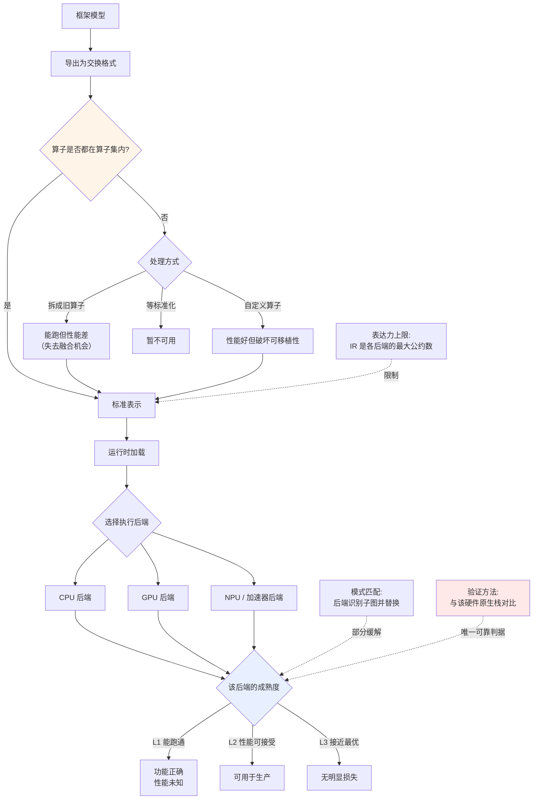

# 跨硬件可移植性

> 位置：[InferenceAtlas](../../INDEX.md) > [模块 04](README.md) > 当前文档
> 信息截至：2026-07-29 ｜ 最后核验：2026-07-29 ｜ 内容版本：v0.1
> 时效性等级：**高**（90 天复核）
> 相关主题：[软件栈](01_inference_software_stack.md)｜[TensorRT-LLM](03_tensorrt_llm.md)｜[边缘推理](../10_edge_and_on_device_inference/)

> **来源限制声明**：`onnxruntime.ai` 及相关厂商文档站在本环境**不可访问**（见 [AGENTS.md 第 11 节](../../AGENTS.md)）。本章只给出**可移植性的通用分析框架**，所有算子集版本、执行提供者列表、支持矩阵与性能数字标注 `待核实`。

## 本章导读

前面三章讨论的三条路线（深度编译、渐进式编译、编译器优先）都**绑定特定硬件生态**。本章讨论第四条路线：**以可移植性为首要目标**——一份模型表示，多种硬件后端。

这条路线的价值主张很清晰：避免硬件锁定、支持异构部署、降低迁移成本。它在端侧与边缘场景尤其重要，因为那里的硬件极度碎片化（不同的 CPU、集成 GPU、NPU、DSP）。

但可移植性有确定的代价，且这个代价常被低估。本章的重点是把这个代价说清楚：**中间表示的表达力上限、性能与最优实现的差距、以及"支持"一词的三种不同含义**。

## 学习目标

读完本章后，读者应能够：

1. 说明可移植性方案的分层结构与性能损失来源；
2. 区分"支持某硬件"的三种不同含义；
3. 分析算子集版本与模型架构演进之间的滞后问题；
4. 判断一个场景是否值得为可移植性付出性能代价。

## 核心结论

- **可移植性的代价主要来自两处**：中间表示无法表达某些硬件特有优化；后端实现的成熟度参差。
- **"支持"有三种含义**——能跑通、性能可接受、性能接近最优。**厂商的支持矩阵通常只保证第一种**。
- **算子集的演进滞后于模型架构**：新架构出现到可移植表示能表达它，中间有一段真空期。
- **可移植性在端侧价值最高**（硬件碎片化严重），在数据中心价值较低（硬件相对同构）。

## 1. 问题定义、系统边界与工作负载

### 1.1 分层结构

| 层 | 职责 | 可移植性所在 |
|---|---|---|
| **模型交换格式** | 与框架无关的模型表示 | **是**——一份文件多处用 |
| 运行时 | 加载、调度、内存管理 | 部分 |
| **执行后端** | 针对具体硬件的实现 | **否**——每种硬件一套 |
| 硬件 | — | 否 |

**关键认识**：**可移植的是模型表示，不是性能**。同一个模型文件在不同后端上跑，功能一致但性能可以相差很大。

### 1.2 "支持"的三种含义

这是本章最实用的一个区分：

| 层次 | 含义 | 如何验证 |
|---|---|---|
| **L1：能跑通** | 所有算子有对应实现，结果正确 | 跑一遍，比对数值 |
| **L2：性能可接受** | 达到该硬件能力的合理比例 | 与该硬件的原生栈对比 |
| **L3：接近最优** | 用上了该硬件的关键特性 | Roofline 定位 + 与原生栈对比 |

**厂商的支持矩阵通常只承诺 L1**。看到"支持 X 硬件"时，必须自己验证到 L2 或 L3。

**验证方法**：**在同一硬件上，用可移植栈与该硬件的原生栈各跑一次，比较性能差距**。这个差距就是可移植性的实际代价，且它因模型、因硬件而异，无法从文档得知。

## 2. 原理、数学与性能模型

### 2.1 性能损失的两个来源

**来源一：表达力上限**

中间表示必须是各硬件的"最大公约数"——它只能表达所有目标后端都能理解的操作。因此：

| 情况 | 后果 |
|---|---|
| 某硬件有特殊指令/单元 | 若 IR 无法表达，无法利用 |
| 某硬件偏好特定布局 | 若 IR 固定了布局，需额外转换 |
| 某融合模式只在特定硬件有意义 | 通用 IR 难以表达 |

**缓解方式**：后端可以做**模式匹配**——识别出 IR 中的某个子图对应本硬件的某个优化实现，然后替换。这有效但不完备：**模式必须被后端开发者预先识别并实现**，新出现的模式会有滞后。

**来源二：实现成熟度**

同一个可移植栈的不同后端，投入的工程量可能相差很大。主力后端通常打磨充分，长尾后端可能只做到 L1。

**这解释了为什么"支持很多硬件"未必是优势**——支持的广度与每个后端的深度往往此消彼长。

### 2.2 算子集的滞后

模型架构在演进，而可移植表示的算子集需要标准化流程才能扩展。

**滞后链条**：

```text
新架构提出 → 框架实现 → 可移植格式的算子集扩展 → 
各后端实现新算子 → 各后端优化新算子
```

**每一环都有延迟**，且串行累积。因此**新架构在可移植栈上的可用时间总是晚于原生栈**。

**应对方式**：

| 方式 | 机制 | 代价 |
|---|---|---|
| 用已有算子组合表达 | 把新算子拆成旧算子 | **性能差**（失去融合机会） |
| 自定义算子 | 后端各自实现 | 破坏可移植性 |
| 等待标准化 | — | 时间成本 |

**第一条是常见的默认行为，也是性能损失的隐蔽来源**：模型能跑（L1 达成），但因为新架构被拆成了一堆旧算子，性能远低于原生实现。

### 2.3 何时值得付出这个代价

| 场景 | 硬件碎片化 | 可移植性价值 |
|---|---|---|
| **端侧 / 边缘** | **极高**（各种 CPU/GPU/NPU/DSP） | **最高** |
| 企业本地部署 | 高（客户硬件不可控） | 高 |
| 多云 | 中 | 中 |
| 自建数据中心 | **低**（硬件同构） | **低** |

**判据**：**可移植性的价值与硬件碎片化程度成正比**。在硬件同构的数据中心，为可移植性付出性能代价通常不划算——直接用原生栈更合理。

**一个例外**：即使硬件同构，可移植格式仍可作为**模型交换与归档格式**使用（与框架解耦），只是不用它的运行时。这是一种常被忽略的用法。

## 3. 实现机制与系统设计

### 3.1 可移植栈的执行路径



**图展示什么**：从框架模型导出到多后端执行的完整路径，含算子集覆盖的分支处理与后端成熟度的三个层次。

**核心瓶颈在哪**：两处高亮。`算子是否都在算子集内` 是新架构落地的第一道关卡，"拆成旧算子"这条看似无害的路径是性能损失的隐蔽来源。`该后端的成熟度` 则决定了实际可用性——而它无法从支持矩阵读出。

**图中的 trade-off**：`自定义算子` 分支体现了核心矛盾——为了性能而写自定义算子，恰恰破坏了选择这条路线的初衷（可移植性）。**这是一个需要显式决策的点**，而非工程细节。

**面试如何引用**：被问到可移植方案时，**主动区分"支持"的三个层次**并指出厂商矩阵通常只保证 L1。再说明验证方法是与原生栈对比——这个回答比罗列支持列表有价值得多。

### 3.2 评估清单

| # | 问题 | 为什么重要 |
|---:|---|---|
| 1 | 目标硬件的后端处于 L1 / L2 / L3 哪一层？ | 决定是否可用于生产 |
| 2 | 与该硬件原生栈的性能差距是多少？ | **唯一可靠的代价度量** |
| 3 | 模型的算子是否都在算子集内？有无被拆解的？ | 隐蔽的性能损失来源 |
| 4 | 新架构的支持滞后通常多久？ | 决定能否跟上迭代 |
| 5 | 是否需要自定义算子？若需要，还剩多少可移植性？ | 检验初衷是否达成 |
| 6 | 量化支持情况与格式兼容性？ | 端侧尤其关键 |
| 7 | 动态形状支持如何？ | 影响推理适用性 |
| 8 | 可观测性接口？ | 决定可运维性 |

> 具体答案需查官方文档与实测，本环境不可达。`待核实`

## 4. 性能、成本、能耗与可靠性 trade-off

| 维度 | 可移植栈 | 原生栈 |
|---|---|---|
| 硬件覆盖 | **广** | 窄 |
| 峰值性能 | 中（视后端成熟度） | **高** |
| 迁移成本 | **低** | 高 |
| 新架构支持 | 滞后 | **及时** |
| 供应商锁定 | **低** | 高 |
| 调试与生态 | 视项目 | 通常更成熟 |
| 端侧适用性 | **高** | 视硬件 |

**核心权衡**：**用性能与及时性换取硬件无关性**。这个交换在硬件碎片化的场景中划算，在同构场景中通常不划算。

**一个常见的混合策略**：**数据中心用原生栈追求性能，端侧用可移植栈应对碎片化**。二者服务不同的部署形态，不必二选一。

## 5. benchmark、真实案例或公开部署案例

> 本章**不给出任何性能数字或支持矩阵**：官方来源不可达，且可移植栈与原生栈的性能差距高度依赖模型、硬件与版本，脱离配置引用无意义（见 [模块 00 第 3 章](../00_start_here/03_how_to_read_inference_benchmarks.md)）。`待核实`

| 可引用的机制性依据 | 来源 |
|---|---|
| 融合与硬件特性利用是性能的主要来源，而这二者最难跨硬件通用化 | [FlashAttention, NeurIPS 2022](https://arxiv.org/abs/2205.14135)、本模块 [第 7 章](07_kernel_fusion_and_operator_optimization.md) |

## 6. 设计决策框架

1. 评估部署形态的硬件碎片化程度——这是首要判据；
2. 同构数据中心：默认用原生栈；碎片化端侧：优先可移植栈；
3. **在目标硬件上实测**，与原生栈对比，量化性能差距；
4. 检查模型算子是否有被拆解的（性能损失的隐蔽来源）；
5. 确认后端成熟度处于 L2 以上再用于生产；
6. 若需自定义算子，重新评估可移植性是否还成立；
7. 端侧场景额外核实量化格式兼容性；
8. 考虑"用交换格式做归档、用原生栈做执行"的混合用法。

## 7. 常见失败模式与排查路径

| 失败模式 | 表现 | 根因 | 纠正 |
|---|---|---|---|
| 采信支持矩阵 | 上线后性能远低于预期 | 矩阵只保证 L1 | 与原生栈实测对比 |
| 算子被静默拆解 | 能跑但慢 | 新架构不在算子集内 | 检查导出后的算子列表 |
| 写了自定义算子 | 可移植性已失 | 为性能牺牲初衷 | 重新评估路线选择 |
| 同构环境用可移植栈 | 白付性能代价 | 场景判断错误 | 改用原生栈 |
| 新架构上线滞后 | 落后于竞品 | 算子集标准化周期 | 提前评估滞后期 |
| 端侧量化格式不兼容 | 无法部署 | 格式与后端不匹配 | 提前核实 |
| 只在一种硬件上验证 | 换硬件后问题暴露 | 后端成熟度不均 | 每种目标硬件都验证 |

## 8. 关联面试主题

1. **可移植性的代价来自哪里** → 本章 2.1
2. **"支持某硬件"的三种含义与验证方法** → 本章 1.2
3. **算子集滞后如何影响新架构落地** → 本章 2.2
4. **什么场景值得为可移植性付出性能代价** → 本章 2.3
5. **可移植栈与原生栈如何混合使用** → 本章 4

## 9. 小结

可移植方案的价值主张是"一份模型表示、多种硬件后端"，但**可移植的是模型表示而非性能**。性能损失有两个来源：中间表示作为各后端的最大公约数存在表达力上限（硬件特有优化难以表达，只能靠后端的模式匹配部分缓解）；以及不同后端的实现成熟度参差。本章最实用的区分是**"支持"的三个层次**——能跑通、性能可接受、接近最优——而厂商的支持矩阵通常只保证第一种，因此**唯一可靠的评估方法是在目标硬件上与原生栈实测对比**。算子集的标准化流程滞后于模型架构演进，新架构常被拆成旧算子组合来"支持"，这是一个能跑但慢的隐蔽性能损失来源。可移植性的价值与硬件碎片化程度成正比：在端侧与边缘最高，在同构数据中心最低。常见的合理策略是混合——数据中心用原生栈，端侧用可移植栈。

## 关键术语

| 中文术语 | 英文 | 定义 | 单位/口径 | 关联文档 |
|---|---|---|---|---|
| 模型交换格式 | model exchange format | 与框架无关的模型表示 | — | 本章 1.1 |
| 执行后端 | execution backend | 针对具体硬件的实现层 | — | 本章 1.1 |
| 支持的三个层次 | L1/L2/L3 support | 能跑通 / 性能可接受 / 接近最优 | — | 本章 1.2 |
| 表达力上限 | expressiveness ceiling | IR 作为最大公约数无法表达硬件特有优化 | — | 本章 2.1 |
| 算子拆解 | operator decomposition | 用旧算子组合表达新算子，牺牲性能 | — | 本章 2.2 |
| 模式匹配 | pattern matching | 后端识别子图并替换为硬件优化实现 | — | 本章 2.1 |

## 延伸阅读

- [03 TensorRT-LLM](03_tensorrt_llm.md)、[05 XLA](05_xla_jax_and_tpu_runtime.md) —— 对照的绑定硬件路线
- [模块 10：边缘与端侧推理](../10_edge_and_on_device_inference/) —— 可移植性价值最高的场景
- [07 算子融合](07_kernel_fusion_and_operator_optimization.md) —— 为何融合最难跨硬件通用化

## 主要来源

| # | 来源 | 类型 | 披露等级 | 核验日期 |
|---:|---|---|---|---|
| 1 | [FlashAttention (NeurIPS 2022)](https://arxiv.org/abs/2205.14135) | 会议论文 | 独立可复现实验 | 2026-07-29 |

> **说明**：本章为**可移植性的通用分析框架**，非任何具体产品的手册。算子集版本、执行提供者列表、支持矩阵与性能数字因官方来源不可达而标注 `待核实`。

## 更新记录

| 日期 | 版本 | 变更 | 核验人 |
|---|---|---|---|
| 2026-07-29 | v0.1 | 初稿（受来源限制，仅含框架分析） | — |
