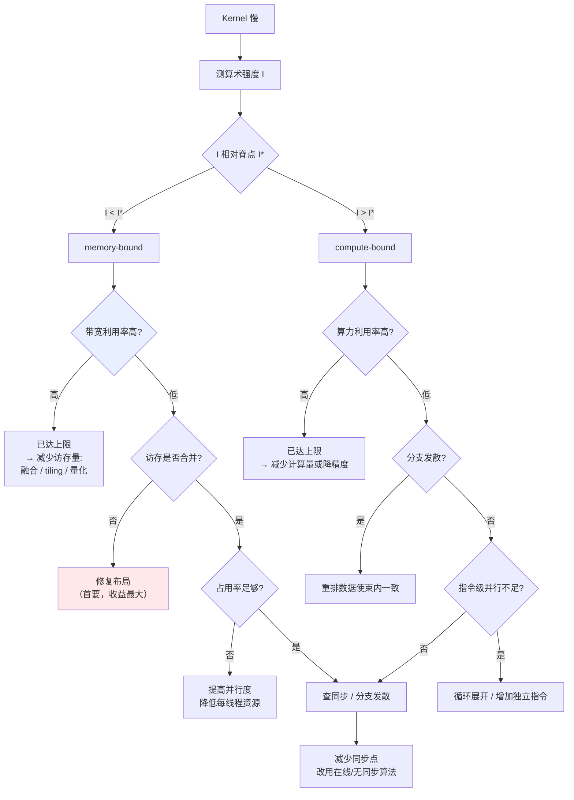

# 算子融合与 Kernel 优化

> 位置：[InferenceAtlas](../../INDEX.md) > [模块 04](README.md) > 当前文档
> 信息截至：2026-07-29 ｜ 最后核验：2026-07-29 ｜ 内容版本：v0.1
> 时效性等级：低
> 相关主题：[图编译器与 IR](02_graph_compilers_and_ir.md)｜[Roofline](../01_foundations_and_metrics/04_roofline_and_performance_modeling.md)｜[FlashAttention](08_flashattention_and_memory_efficient_attention.md)

## 本章导读

本章下探到 kernel 层——GPU 上实际执行计算的代码。这一层的优化不改变算法，只改变"同样的计算怎么在硬件上跑"，但收益可以很大：一个未优化的 kernel 与一个调优过的 kernel，性能可能相差数倍。

理解 kernel 优化需要一组硬件概念：线程组织、内存层次、占用率、访存合并。这些概念不是 GPU 编程的细节，而是**解释性能现象的语言**——没有它们，"为什么这个 kernel 慢"只能靠试。

本章的组织方式是：先建立最小必要的硬件模型，再用它解释融合的收益与限制，最后给出优化的判断顺序。

## 学习目标

读完本章后，读者应能够：

1. 用线程层次与内存层次解释一个 kernel 的性能特征；
2. 说明占用率的含义与它不是越高越好的原因；
3. 分析融合的收益上限与失效条件；
4. 按正确顺序诊断一个慢 kernel。

## 核心结论

- **kernel 优化的目标是让计算单元不空闲**，而空闲的三大来源是：等内存、等同步、没有足够的并行工作。
- **融合的收益等于被消除的内存往返**，上限由中间结果能否驻留片上决定。
- **占用率不是越高越好**：高占用率靠减少每线程资源实现，可能反而降低单线程效率。存在一个最优点。
- **访存合并比算法优化更基础**：非合并访问可以让带宽利用率降到零头，且这个问题无法靠更好的算法弥补。

## 1. 问题定义、系统边界与工作负载

### 1.1 最小硬件模型

理解 kernel 性能需要的最小概念集：

| 概念 | 含义 | 与性能的关系 |
|---|---|---|
| **线程** | 最小执行单元 | 数量决定并行度 |
| **线程束（warp）** | 一组同步执行的线程 | 束内分支发散会串行化 |
| **线程块（block）** | 共享片上内存的线程组 | 块内可协作、可同步 |
| **流多处理器（SM）** | 执行块的硬件单元 | 数量决定总并行容量 |
| **寄存器** | 每线程私有、最快 | 数量有限，用多了限制并行度 |
| **共享内存 / SRAM** | 块内共享、快 | 容量有限，是 tiling 的载体 |
| **L2 缓存** | 芯片级共享 | 跨块复用的机会 |
| **HBM** | 全局显存、慢 | **主要瓶颈** |

**层次间的差距**：从寄存器到共享内存到 HBM，容量递增而带宽与延迟递减，且相邻层级间通常有数量级差距。**kernel 优化的本质就是把数据尽量留在更高层级。**

### 1.2 计算单元为何空闲

| 空闲来源 | 机制 | 对策 |
|---|---|---|
| **等内存** | 数据未就绪 | 提高算术强度、改善访存模式、增加并发以掩盖延迟 |
| **等同步** | 线程间屏障、原子操作 | 减少同步点、改用无同步算法 |
| **并行不足** | 工作量不够填满硬件 | 增大问题规模、合并小 kernel |
| **分支发散** | 束内线程走不同路径 | 重排数据使束内路径一致 |
| **资源限制** | 寄存器/共享内存用尽 | 降低每线程占用 |

**推理场景的高发项**：decode 阶段每步计算量小，容易落入"并行不足"；而长序列注意力容易落入"等内存"。二者的对策不同，因此**先判断是哪一种**是优化的第一步。

## 2. 原理、数学与性能模型

### 2.1 融合的收益上限

设一串 $k$ 个逐元素算子，作用于 $N$ 字节的张量：

| | HBM 访问量 |
|---|---|
| 不融合 | $\approx 2kN$ |
| 融合 | $\approx 2N$ |

**收益倍数 $\approx k$**，但这有三个前提：

| 前提 | 违反后果 |
|---|---|
| 中间结果可驻留寄存器/共享内存 | 否则仍需落 HBM，收益归零 |
| 融合后不增加寄存器压力至降低占用率 | 否则并行度下降，可能净损失 |
| 算子间无需全局同步 | 否则无法在单个 kernel 内完成 |

**第三条的具体影响**：归约类算子（如 softmax 的求和、LayerNorm 的均值方差）需要跨线程协作。若归约范围超出单个块，就需要跨块同步，而跨块同步通常意味着拆成多个 kernel。**这是"为什么有些算子难以融合"的根本原因。**

**在线算法的价值**：如果归约可以改写成增量形式（如在线 softmax），就能在分块处理时逐块更新，避免全局同步——这正是 FlashAttention 的关键技术之一（见 [下一章](08_flashattention_and_memory_efficient_attention.md)）。

### 2.2 占用率的正确理解

**占用率**（occupancy）= 实际活跃线程束数 / 硬件支持的最大线程束数。

**它的作用**：更多活跃线程束意味着当某束等内存时，硬件可以切换到其他束执行，从而**掩盖内存延迟**。

**为什么不是越高越好**：

提高占用率的手段是减少每线程占用的资源（寄存器、共享内存）。但：

| 减少的资源 | 后果 |
|---|---|
| 寄存器 | 中间值需溢出到显存，增加访存 |
| 共享内存 | tiling 块变小，数据复用减少 |

**因此存在一个最优点**：占用率足以掩盖延迟即可，再高就是在用单线程效率换并行度。

**实用判据**：

| 情况 | 诊断 |
|---|---|
| 占用率低 **且** 带宽利用率低 | 并行不足，应提高占用率 |
| 占用率低 **但** 带宽利用率高 | **已达带宽上限，占用率不是问题** |
| 占用率高 **但** 性能差 | 可能是访存模式或分支发散问题 |

**第二行最重要**：很多人看到低占用率就去优化它，但如果带宽已经打满，提高占用率不会带来任何收益。**先看带宽利用率，再看占用率。**

### 2.3 访存合并

GPU 以事务为单位访问显存。当一个线程束内的线程访问**连续且对齐**的地址时，这些访问可以合并为少数几个事务；否则会退化为多个事务。

**代价的量级**：完全非合并的访问，其有效带宽可能只有合并访问的零头——具体比例取决于访问模式与硬件。

**推理中的常见来源**：

| 来源 | 说明 |
|---|---|
| 张量布局不匹配 | 算子偏好的布局与实际布局不同 |
| 转置操作 | 天然产生跨步访问 |
| 分页 KV 的间接寻址 | block table 引入的非连续性 |
| GQA 的 head 分组 | 分组访问模式可能不连续 |

**对策**：布局变换（在图级完成，见 [第 2 章](02_graph_compilers_and_ir.md)）、tiling 时先合并读入共享内存再在片上做非连续访问。

**关键认识**：**访存合并是比算法优化更基础的问题**。一个访存模式糟糕的最优算法，可能慢于一个访存良好的次优算法。

### 2.4 分块（Tiling）

Tiling 把大问题切成能放进片上内存的块，在块内充分复用数据。

**收益来源**：设一个 $T \times T$ 的分块，块内每个元素被复用 $T$ 次，则 HBM 访问量减少约 $T$ 倍。

**约束**：块大小受共享内存容量限制。块越大复用越多，但可能因共享内存耗尽而降低占用率——**这又是一个需要平衡的点**。

**推理中的典型应用**：矩阵乘的经典分块、注意力的分块（避免物化 $[S,S]$ 矩阵）、以及 KV cache 的分块读取。

## 3. 实现机制与系统设计

### 3.1 Kernel 诊断顺序

**图展示什么**：从"kernel 慢"出发的完整诊断树，先按 Roofline 分流，再逐层排查。

**核心瓶颈在哪**：高亮的 `带宽利用率高?` 是最重要的分叉——它区分了"已达硬件上限，只能减少访存量"与"未达上限，存在实现问题"。另一个高亮的 `修复布局` 是 memory-bound 分支下收益最大的一项，因为非合并访问的代价是数量级的。

**图中的 trade-off**：`提高并行度、降低每线程资源` 与 `tiling 需要更大共享内存` 直接冲突——前者要少占资源，后者要多占。这就是占用率与数据复用的经典矛盾，没有普适答案，需要按具体 kernel 扫描。

**面试如何引用**：被问到"kernel 慢怎么优化"时，按这棵树走而不是罗列技巧。**先分流 memory/compute-bound，再看是否已达上限**——这个顺序本身就说明你不是在盲试。

### 3.2 推理中的典型融合模式

| 融合 | 消除的往返 | 难点 |
|---|---|---|
| **Norm + 缩放 + 残差** | 多次全张量读写 | 归约需块内协作 |
| **RoPE 应用到 Q/K** | 一次读写 | 索引计算 |
| **QKV 投影合并** | 三次权重读取合为一次 | 权重需预先拼接 |
| **注意力（分块）** | **$[S,S]$ 中间矩阵不物化** | 需在线 softmax |
| **MLP 的 gate + up + 激活** | 中间张量 | 寄存器压力 |
| **反量化 + GEMM** | **高精度权重不物化** | 量化格式与 kernel 耦合 |
| **Sampling 链** | 大词表 logits 的多次读写 | top-k/top-p 的归约 |

**其中两项是"必须做"而非"优化"**：

1. **注意力分块**：不做则长序列 OOM；
2. **反量化 + GEMM 融合**：不做则量化的带宽收益完全丧失（见 [第 9 章](09_quantization_kernels.md)）。

其余是收益递减的优化。**区分"必须"与"优化"有助于安排优先级。**

### 3.3 何时不该手写 kernel

| 情况 | 建议 |
|---|---|
| 标准矩阵乘 | 用厂商库，手写极难超越 |
| 标准注意力 | 用成熟实现（已高度优化） |
| 自定义的融合模式 | 值得写（库不覆盖） |
| 新的量化格式 | 通常必须写 |
| 特殊的访存模式 | 值得写 |

**判据**：**只在"库不覆盖且确实是瓶颈"时手写**。手写 kernel 的维护成本高（硬件代际更替需重调），且极易被高估收益——先用 profiler 确认这个 kernel 确实占了显著时间比例。

## 4. 性能、成本、能耗与可靠性 trade-off

| 优化 | 性能 | 可维护性 | 数值 |
|---|---|---|---|
| 融合 | ↑↑ | ↓ | 可能改变累加顺序 |
| Tiling | ↑↑ | ↓ | 无（若算法等价） |
| 提高占用率 | 视情况 | ≈ | 无 |
| 布局变换 | ↑↑（若原本非合并） | ↓（需全局一致） | 无 |
| 手写 kernel | ↑ | **↓↓** | 需自行保证 |
| 用厂商库 | ↑ | ↑ | 由库保证 |

**能耗视角**：由于数据搬运的能耗高于算术运算（见 [模块 01 第 7 章](../01_foundations_and_metrics/07_energy_efficiency_and_joules_per_token.md)），**减少访存的优化同时改善性能与能效**。融合与 tiling 属于此类，是难得的双赢。

## 5. benchmark、真实案例或公开部署案例

| 公开结论 | 来源 |
|---|---|
| 注意力的瓶颈是 HBM 读写而非 FLOP；通过分块与在线 softmax 避免物化 $[S,S]$ 矩阵，且数学上精确等价 | [FlashAttention, NeurIPS 2022](https://arxiv.org/abs/2205.14135) |
| 分页 KV 引入的间接寻址需要注意力 kernel 支持非连续布局 | [PagedAttention, SOSP 2023](https://arxiv.org/abs/2309.06180) |

> 具体的占用率阈值、访存合并的带宽损失比例、各硬件的共享内存容量等，需引用厂商架构文档，本环境不可达。`待核实`

## 6. 设计决策框架

1. 用 profiler 确认该 kernel 确实占显著时间比例（否则不值得优化）；
2. 测算术强度，按 Roofline 分流 memory/compute-bound；
3. **先看带宽（或算力）利用率是否已达上限**——已达则只能减少工作量；
4. 未达上限时，memory 侧首查访存合并（收益最大）；
5. 其次查占用率，但不盲目追高；
6. 再查同步点与分支发散；
7. 融合前确认中间结果能驻留片上；
8. 优先用成熟库，只在库不覆盖处手写；
9. 融合后验证数值在容差内。

## 7. 常见失败模式与排查路径

| 失败模式 | 表现 | 根因 | 纠正 |
|---|---|---|---|
| 盲目提高占用率 | 无收益甚至变慢 | 带宽已饱和 / 寄存器溢出 | 先看带宽利用率 |
| 融合后变慢 | 性能下降 | 寄存器压力致占用率骤降 | 拆分融合 |
| 融合无收益 | 访存量未减少 | 中间结果仍落 HBM | 检查是否真的驻留片上 |
| 忽略访存合并 | 带宽利用率极低 | 布局不匹配 | 修复布局或先合并读入 |
| 优化了非瓶颈 kernel | 端到端无改善 | 未看时间占比 | profiler 定位 |
| 手写 kernel 难维护 | 硬件升级后需重调 | 低估维护成本 | 尽量用库 |
| 分支发散未发现 | compute-bound 但利用率低 | 束内路径不一致 | 重排数据 |
| 归约算子无法融合 | 融合失败 | 需跨块同步 | 改用在线/增量形式 |

## 8. 关联面试主题

1. **kernel 优化的目标与空闲的三大来源** → 本章 1.2
2. **融合的收益上限与三个前提** → 本章 2.1
3. **占用率为什么不是越高越好** → 本章 2.2
4. **访存合并为何比算法优化更基础** → 本章 2.3
5. **慢 kernel 的诊断顺序** → 本章 3.1

## 9. 小结

Kernel 优化不改变算法，只改变计算在硬件上的执行方式，但收益可达数倍。其目标是让计算单元不空闲，而空闲的三大来源是等内存、等同步、并行不足——三者对策不同，因此**先判断是哪一种**是优化的第一步。融合的收益约等于被消除的内存往返倍数，但受三个前提约束：中间结果须驻留片上、不因寄存器压力压低占用率、算子间不需跨块同步。第三条解释了归约类算子为何难融合，也说明了在线算法（如在线 softmax）的价值——它把全局归约改写成增量形式，使分块处理成为可能。占用率不是越高越好：提高它靠减少每线程资源，可能导致寄存器溢出或 tiling 块变小；正确的判断顺序是**先看带宽利用率是否已达上限，再看占用率**。访存合并是比算法更基础的问题，非合并访问的带宽损失是数量级的，且无法靠更好的算法弥补。

## 关键术语

| 中文术语 | 英文 | 定义 | 单位/口径 | 关联文档 |
|---|---|---|---|---|
| 线程束 | warp | 一组同步执行的线程；束内分支发散会串行化 | — | 本章 1.1 |
| 占用率 | occupancy | 活跃线程束数与硬件上限之比 | % | 本章 2.2 |
| 访存合并 | memory coalescing | 束内线程访问连续地址以合并为少数事务 | — | 本章 2.3 |
| 分块 | tiling | 把问题切成可驻留片上的块以复用数据 | — | 本章 2.4 |
| 寄存器压力 | register pressure | 每线程寄存器需求；过高导致溢出或降占用率 | — | 本章 2.1 |
| 分支发散 | branch divergence | 束内线程走不同路径导致串行执行 | — | 本章 1.2 |
| 在线归约 | online reduction | 可增量更新的归约形式，避免全局同步 | — | 本章 2.1 |

## 延伸阅读

- [08 FlashAttention](08_flashattention_and_memory_efficient_attention.md) —— 融合 + tiling + 在线归约的完整案例
- [09 量化 kernel](09_quantization_kernels.md) —— 反量化必须与 GEMM 融合的原因
- [11 编译调试与 profiling](11_compiler_debugging_and_profiling.md) —— 诊断工具

## 主要来源

| # | 来源 | 类型 | 披露等级 | 核验日期 |
|---:|---|---|---|---|
| 1 | [FlashAttention (NeurIPS 2022)](https://arxiv.org/abs/2205.14135) | 会议论文 | 独立可复现实验 | 2026-07-29 |
| 2 | [PagedAttention (SOSP 2023)](https://arxiv.org/abs/2309.06180) | 会议论文 | 独立可复现实验 | 2026-07-29 |

> **说明**：本章的硬件模型为**通用 GPU 架构的抽象描述**，不针对特定产品。具体的资源上限、事务大小与带宽损失比例需引用厂商架构文档，因不可达而标注 `待核实`。

## 更新记录

| 日期 | 版本 | 变更 | 核验人 |
|---|---|---|---|
| 2026-07-29 | v0.1 | 初稿 | — |
