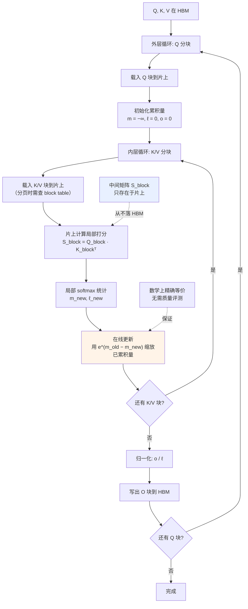

# FlashAttention 与内存高效注意力

> 位置：[InferenceAtlas](../../INDEX.md) > [模块 04](README.md) > 当前文档
> 信息截至：2026-07-29 ｜ 最后核验：2026-07-29 ｜ 内容版本：v0.1
> 时效性等级：低
> 相关主题：[算子融合](07_kernel_fusion_and_operator_optimization.md)｜[注意力复杂度](../02_transformer_and_kv_cache/03_attention_complexity_during_inference.md)｜[Roofline](../01_foundations_and_metrics/04_roofline_and_performance_modeling.md)

## 本章导读

FlashAttention 是本模块所有原理的一次完整汇合：它同时用到了融合、tiling、在线归约三项技术，解决的是一个具体而关键的问题——**注意力的中间矩阵不该被写进 HBM**。

它值得单独成章，不是因为它是某个特定实现，而是因为它示范了一种思维方式：**把优化目标从"减少 FLOP"改为"减少 HBM 访问"**。这个视角转换是当代 GPU 上性能工程的核心，适用范围远超注意力本身。

本章的重点是机制而非实现细节：为什么朴素注意力慢、在线 softmax 如何使分块成为可能、以及这套方法在 prefill 与 decode 两阶段的收益差异。

## 学习目标

读完本章后，读者应能够：

1. 解释朴素注意力的 HBM 访问量为何随序列长度平方增长；
2. 说明在线 softmax 的数学形式及其为何允许分块；
3. 分析该方法在 prefill 与 decode 上的收益差异；
4. 说明它与 PagedAttention 的关系（互补而非替代）。

## 核心结论

- **朴素注意力的瓶颈是把 $[S,S]$ 矩阵写进 HBM 再读回来**，其访问量随 $S^2$ 增长，远超 Q/K/V 本身。
- **在线 softmax 使分块成为可能**：softmax 可以增量计算而无需先看到全部值，这是整个方法的数学基础。
- **该方法数学上精确等价**，不是近似——这是它能被无条件采用的原因。
- **prefill 收益远大于 decode**：decode 时 $T=1$，中间矩阵本就很小，主要收益来自 KV 的高效读取而非避免物化。

## 1. 问题定义、系统边界与工作负载

### 1.1 朴素注意力的访问量

朴素实现分三步，每步都读写 HBM：

| 步骤 | 操作 | HBM 写 | HBM 读 |
|---|---|---|---|
| 1 | $S = QK^\top$ | $[B,H,T,S_{kv}]$ | Q, K |
| 2 | $P = \text{softmax}(S)$ | $[B,H,T,S_{kv}]$ | $S$ |
| 3 | $O = PV$ | $O$ | $P$, V |

**中间矩阵被写了两次、读了两次**。其元素数为 $B \cdot H \cdot T \cdot S_{kv}$。

**在 prefill 时** $T = S_{kv} = S$，因此中间矩阵大小与 $S^2$ 成正比。当 $S$ 较大时，它可以远大于 Q/K/V 三者之和（后者与 $S$ 线性相关）。

**因此**：朴素注意力的 HBM 访问被中间矩阵主导，而中间矩阵**从未被真正需要**——它只是计算过程的临时产物。

### 1.2 目标

在不物化中间矩阵的前提下算出正确的输出。

**障碍**：softmax 需要归一化，而归一化需要知道整行的和——看起来必须先算出整行才能归一化。**在线 softmax 正是绕过这个障碍的技术。**

## 2. 原理、数学与性能模型

### 2.1 在线 softmax

标准 softmax（含数值稳定的最大值减法）：

$$
\text{softmax}(x)_i = \frac{e^{x_i - m}}{\sum_j e^{x_j - m}}, \quad m = \max_j x_j
$$

**问题**：$m$ 与分母都需要遍历全部 $x_j$。

**在线形式**：设已处理前 $k$ 个元素，维护三个量——当前最大值 $m^{(k)}$、当前指数和 $\ell^{(k)}$、当前加权输出 $o^{(k)}$。处理新的一块时：

$$
m^{(k+1)} = \max(m^{(k)},\ m_{\text{new}})
$$

$$
\ell^{(k+1)} = e^{m^{(k)} - m^{(k+1)}} \ell^{(k)} + e^{m_{\text{new}} - m^{(k+1)}} \ell_{\text{new}}
$$

$$
o^{(k+1)} = e^{m^{(k)} - m^{(k+1)}} o^{(k)} + e^{m_{\text{new}} - m^{(k+1)}} o_{\text{new}}
$$

**关键洞察**：当发现更大的最大值时，**已累积的结果可以通过一个缩放因子 $e^{m^{(k)} - m^{(k+1)}}$ 修正**，而不必重算。这使得"边处理边累积"成为可能。

**为什么这是精确的**：上述更新是代数恒等变换，不引入任何近似。因此最终结果与标准 softmax 完全一致（浮点舍入差异除外）。

**这一点很重要**：它意味着采用该方法**不需要做质量评测**——与量化、稀疏注意力等有损方法根本不同。

### 2.2 分块与访问量

有了在线 softmax，就可以：

1. 把 K/V 分成若干块；
2. 每次把一块 K/V 载入片上内存；
3. 与片上的 Q 块计算局部注意力；
4. 用在线公式更新累积量；
5. 全部块处理完后输出。

**HBM 访问量的变化**：

| | HBM 访问 |
|---|---|
| 朴素 | Q + K + V + **中间矩阵读写 $\times 2$** |
| 分块 | Q + K + V + 输出（**中间矩阵不出现**） |

**收益**：消除了与 $T \times S_{kv}$ 成正比的那一项。当 $T$ 与 $S_{kv}$ 都很大时（prefill 长序列），这是主要项，收益显著。

**代价**：K/V 可能被多次读取（若 Q 也分块，每个 Q 块都要遍历所有 K/V 块）。因此实现上会权衡分块方式以最小化总访问量。

### 2.3 Prefill 与 Decode 的收益差异

| | Prefill | Decode |
|---|---|---|
| $T$（本次 query 数） | $S_{in}$（大） | **1** |
| 中间矩阵大小 | $\propto S_{in}^2$ | $\propto S$（一行） |
| 中间矩阵是否是主要项 | **是** | 否 |
| 主要收益来源 | **避免物化中间矩阵** | KV 的高效读取与融合 |
| 收益量级 | **大** | 中 |

**这个区分很重要**：常见的表述"FlashAttention 加速注意力"在 decode 上是误导的——decode 时中间矩阵只有一行，本就不构成显存问题。decode 阶段的注意力瓶颈是**读取全部 KV cache**（见 [模块 02 第 3 章](../02_transformer_and_kv_cache/03_attention_complexity_during_inference.md)），而这个访问量无法通过分块消除，只能通过减少 KV 体积（GQA、量化）来降低。

**因此**：decode 阶段的注意力优化重点是 kernel 对**分页、非连续 KV 布局**的高效支持，而非避免物化。

### 2.4 与 PagedAttention 的关系

二者常被并列，但解决的是**不同层次的问题**：

| | FlashAttention 类 | PagedAttention |
|---|---|---|
| 解决 | 计算时的**中间矩阵物化** | 存储时的**显存碎片** |
| 层次 | Kernel | 内存管理 |
| 收益 | 减少 HBM 访问、降低显存峰值 | 提高显存有效利用率、支持共享 |
| 关系 | **互补** | **互补** |

**实践中二者结合**：分页管理决定 KV 存在哪些块，注意力 kernel 需要能处理这种非连续布局并同时用 tiling 避免物化。**这个结合对 kernel 提出了额外要求**——它必须通过 block table 间接寻址，这是分页 KV 对 kernel 实现的主要影响。

## 3. 实现机制与系统设计

### 3.1 分块注意力的执行流程



**图展示什么**：分块注意力的双层循环结构，含片上局部计算与在线累积更新。

**核心瓶颈在哪**：内层循环的 `载入 K/V 块` 是主要的 HBM 访问。若 Q 也分块，每个 Q 块都要遍历全部 K/V 块，因此 **K/V 的总读取量是 Q 块数的倍数**——分块策略的选择要在片上容量与重复读取之间平衡。

**图中的 trade-off**：高亮的 `在线更新` 用少量额外的指数与乘法换取了不物化中间矩阵。这是一个**明确有利的交换**：额外算术很便宜（compute 相对充裕），省下的 HBM 访问很贵。这正是"从减少 FLOP 转向减少 HBM 访问"这一视角转换的具体体现。

**面试如何引用**：被问到 FlashAttention 时，讲在线 softmax 的缩放修正机制（多数人只会说"分块"），并**主动区分 prefill 与 decode 的收益差异**——后者是很多人没想清楚的地方。

### 3.2 伪代码：分块注意力

```text
输入: Q[T, d], K[S, d], V[S, d], 块大小 Bq, Bk
输出: O[T, d]

对 每个 Q 块 qi in 0..ceil(T/Bq)−1:
    Q_blk ← 载入 Q[qi*Bq : (qi+1)*Bq]        # 到片上
    m ← −∞ 向量                               # 每行的运行最大值
    l ← 0 向量                                # 每行的运行指数和
    O_blk ← 0 矩阵                            # 每行的运行加权和

    对 每个 K/V 块 kj in 0..ceil(S/Bk)−1:
        # 分页 KV 时，此处需经 block table 间接寻址
        K_blk ← 载入 K[kj*Bk : (kj+1)*Bk]
        V_blk ← 载入 V[kj*Bk : (kj+1)*Bk]

        S_blk ← Q_blk · K_blkᵀ / sqrt(d)      # 片上，从不落 HBM
        应用因果掩码(S_blk, qi, kj)            # 若为因果注意力

        m_new ← 逐行最大(S_blk)
        m_upd ← max(m, m_new)

        # 关键：用缩放因子修正已累积的量，而非重算
        scale_old ← exp(m − m_upd)
        scale_new ← exp(m_new − m_upd)

        P_blk ← exp(S_blk − m_upd)            # 局部概率（未归一化）
        l ← scale_old * l + 逐行求和(P_blk)
        O_blk ← scale_old * O_blk + P_blk · V_blk
        m ← m_upd

    O_blk ← O_blk / l                          # 最后统一归一化
    写出 O[qi*Bq : (qi+1)*Bq] ← O_blk
```

**三个实现要点**：

1. **`scale_old` 是整个算法的核心**——它让"发现更大的最大值"不需要重算已处理的部分；
2. **归一化推迟到最后**，避免每块都做除法；
3. **因果掩码可以跳过整块**：当 $kj$ 块完全在 $qi$ 块之后时，该块全被掩码，可直接跳过——这在因果注意力中能省下约一半的计算。

### 3.3 对 KV 布局的要求

分页 KV（见 [模块 03 第 3 章](../03_serving_engines_and_scheduling/03_pagedattention_and_kv_memory_management.md)）使 KV 在物理上非连续。这要求注意力 kernel：

| 要求 | 说明 |
|---|---|
| 支持间接寻址 | 通过 block table 定位物理块 |
| 块大小对齐 | KV 块大小与 kernel 的分块粒度需协调 |
| 处理不满的块 | 序列末尾的块通常不满 |
| 支持共享块 | 多序列指向同一物理块 |

**协调点**：KV 管理的块大小与 kernel 的 tiling 块大小是**两个独立但需要协调的参数**。若二者不匹配，会产生额外的边界处理开销。这是一个容易被忽略的调优维度。

## 4. 性能、成本、能耗与可靠性 trade-off

| 维度 | 分块注意力 vs 朴素 |
|---|---|
| HBM 访问 | **↓↓**（prefill 长序列时） |
| 显存峰值 | **↓↓**（不物化中间矩阵） |
| 算术运算 | 略增（在线更新的指数与缩放） |
| 数值精度 | **等价**（代数恒等变换） |
| 质量影响 | **无**——无需评测 |
| 能效 | **↑**（减少访存） |
| 实现复杂度 | ↑↑ |
| 支持的最大序列长度 | **↑↑** |

**最重要的一行是"质量影响：无"**。这使它与量化、稀疏注意力、滑窗等有损方法处于完全不同的类别——**它可以无条件采用**，而后者每次都需要针对性评测（见 [模块 02 第 8 章](../02_transformer_and_kv_cache/08_kv_cache_compression_quantization_and_eviction.md)）。

## 5. benchmark、真实案例或公开部署案例

| 公开结论 | 来源 |
|---|---|
| 注意力的性能瓶颈在 HBM 读写而非 FLOP；通过分块与在线 softmax 避免物化 $[T,S]$ 注意力矩阵；该方法计算精确注意力（非近似） | [FlashAttention, NeurIPS 2022](https://arxiv.org/abs/2205.14135) |
| 分页 KV 管理与注意力 kernel 需协同：kernel 须支持非连续 KV 布局 | [PagedAttention, SOSP 2023](https://arxiv.org/abs/2309.06180) |
| 自注意力对序列长度的平方复杂度 | [Attention Is All You Need, NeurIPS 2017](https://arxiv.org/abs/1706.03762) |

> 具体的加速倍数与显存节省比例依赖序列长度、head 维度、硬件与基线实现，本库不脱离配置引用。FlashAttention 后续版本（v2/v3 等）的改进点需核验原文，本环境不可达。`待核实`

## 6. 设计决策框架

1. 确认使用的注意力实现是否已采用分块（当代主流引擎通常默认启用）；
2. 若处理长序列 prefill 且遇到 OOM，首查是否物化了中间矩阵；
3. 若使用分页 KV，确认 kernel 支持间接寻址；
4. 协调 KV 块大小与 kernel tiling 块大小；
5. 对因果注意力，确认实现跳过了完全被掩码的块；
6. **不要期待 decode 阶段有同等收益**——那里的瓶颈是 KV 读取量；
7. decode 侧的优化应转向减少 KV 体积（GQA/MLA/量化）；
8. 由于数学等价，采用时无需质量评测（但仍需验证实现正确性）。

## 7. 常见失败模式与排查路径

| 失败模式 | 表现 | 根因 | 纠正 |
|---|---|---|---|
| 长序列 prefill OOM | 显存溢出 | 中间矩阵被物化 | 使用分块实现 |
| decode 未见加速 | 性能不变 | decode 瓶颈不在物化 | 转向减少 KV 体积 |
| 分页后 kernel 报错 | 不支持非连续布局 | kernel 与内存管理不匹配 | 用支持分页的实现 |
| 块大小不匹配 | 边界处理开销大 | KV 块与 tiling 块不协调 | 统一调优 |
| 因果注意力未优化 | 计算量约翻倍 | 未跳过被掩码的块 | 确认实现 |
| 误以为是近似方法 | 不必要的质量评测 | 混淆等价变换与近似 | 理解其数学性质 |
| 与稀疏注意力混淆 | 期望降低复杂度阶 | 分块改常数不改阶 | 见模块 02 第 3 章 |

## 8. 关联面试主题

1. **朴素注意力的瓶颈在哪** → 本章 1.1
2. **在线 softmax 的机制与为何允许分块** → 本章 2.1
3. **该方法在 prefill 与 decode 上的收益差异** → 本章 2.3
4. **它与 PagedAttention 是什么关系** → 本章 2.4
5. **为什么它可以无条件采用而量化不行** → 本章 4

## 9. 小结

FlashAttention 示范了一次关键的视角转换：把优化目标从"减少 FLOP"改为"减少 HBM 访问"。朴素注意力的瓶颈是把 $[T,S]$ 中间矩阵写进 HBM 再读回来，而这个矩阵从未被真正需要。在线 softmax 通过维护运行最大值、指数和与加权输出三个量，并在发现更大最大值时用缩放因子 $e^{m_{old}-m_{new}}$ 修正已累积结果，使得分块处理成为可能且**数学上精确等价**——这使它与量化、稀疏、滑窗等有损方法处于完全不同的类别，可以无条件采用而无需质量评测。收益在 prefill 长序列时最大（中间矩阵是主要项），在 decode 时较小（$T=1$，中间矩阵只有一行，真正的瓶颈是读取全部 KV cache）——这个区分常被忽略。它与 PagedAttention 互补而非替代：后者解决存储碎片，前者解决计算时的物化，二者结合要求 kernel 支持通过 block table 的间接寻址。

## 关键术语

| 中文术语 | 英文 | 定义 | 单位/口径 | 关联文档 |
|---|---|---|---|---|
| 在线 softmax | online softmax | 可增量更新的 softmax 形式，通过缩放因子修正已累积量 | — | 本章 2.1 |
| 中间矩阵物化 | materialisation | 把注意力打分矩阵写入 HBM | — | 本章 1.1 |
| 精确等价 | exact equivalence | 代数恒等变换，非近似，无质量影响 | — | 本章 2.1 |
| 双层分块 | two-level tiling | Q 与 K/V 分别分块的嵌套循环结构 | — | 本章 3.1 |
| 掩码块跳过 | masked block skipping | 因果注意力中跳过完全被掩码的块 | — | 本章 3.2 |

## 延伸阅读

- [07 算子融合与 kernel 优化](07_kernel_fusion_and_operator_optimization.md) —— 本章用到的通用技术
- [模块 02 第 3 章：注意力复杂度](../02_transformer_and_kv_cache/03_attention_complexity_during_inference.md) —— 两阶段的复杂度分析
- [模块 03 第 3 章：PagedAttention](../03_serving_engines_and_scheduling/03_pagedattention_and_kv_memory_management.md) —— 互补的内存管理层

## 主要来源

| # | 来源 | 类型 | 披露等级 | 核验日期 |
|---:|---|---|---|---|
| 1 | [FlashAttention (NeurIPS 2022)](https://arxiv.org/abs/2205.14135) | 会议论文 | 独立可复现实验 | 2026-07-29 |
| 2 | [PagedAttention (SOSP 2023)](https://arxiv.org/abs/2309.06180) | 会议论文 | 独立可复现实验 | 2026-07-29 |
| 3 | [Attention Is All You Need (NeurIPS 2017)](https://arxiv.org/abs/1706.03762) | 会议论文 | 独立可复现实验 | 2026-07-29 |

> **说明**：第 2.1 节的在线 softmax 推导与第 3.2 节伪代码为**本库基于公开算法思想编写的教学版本**。具体加速倍数与后续版本改进点标注 `待核实`。

## 更新记录

| 日期 | 版本 | 变更 | 核验人 |
|---|---|---|---|
| 2026-07-29 | v0.1 | 初稿 | — |
