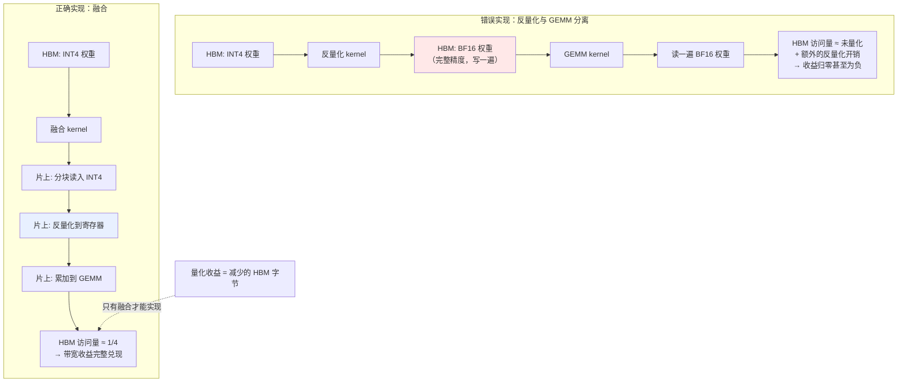

# 量化与量化 Kernel

> 位置：[InferenceAtlas](../../INDEX.md) > [模块 04](README.md) > 当前文档
> 信息截至：2026-07-29 ｜ 最后核验：2026-07-29 ｜ 内容版本：v0.1
> 时效性等级：中
> 相关主题：[算子融合](07_kernel_fusion_and_operator_optimization.md)｜[内存带宽](../01_foundations_and_metrics/05_memory_bandwidth_and_arithmetic_intensity.md)｜[KV 压缩](../02_transformer_and_kv_cache/08_kv_cache_compression_quantization_and_eviction.md)

## 本章导读

量化是 memory-bound 推理中杠杆最大的单项优化：它直接减少需要搬运的字节数，而 decode 阶段的性能上界正是 $BW/W_{bytes}$（见 [模块 01 第 5 章](../01_foundations_and_metrics/05_memory_bandwidth_and_arithmetic_intensity.md)）。把权重从 16 位降到 8 位，理论上界翻倍；降到 4 位，翻两番。

但这个收益有一个**必要条件**，而它经常被忽略：**反量化必须与计算融合在同一个 kernel 内**。如果实现是"先把量化权重展开成完整的高精度张量，再做矩阵乘"，那么 HBM 上仍然要写一遍、读一遍完整精度的权重——**量化的全部带宽收益荡然无存，还额外付出了反量化的计算**。

本章因此把重点放在两件事：量化的设计空间（量化什么、什么粒度、怎么处理离群值），以及 kernel 层面为什么融合是必需而非优化。

## 学习目标

读完本章后，读者应能够：

1. 区分权重量化、激活量化、KV 量化三者的收益与难度差异；
2. 说明量化粒度（per-tensor / per-channel / per-group）的取舍；
3. 解释离群值为何是激活量化的主要障碍；
4. 说明为什么反量化必须与 GEMM 融合，以及不融合的后果。

## 核心结论

- **权重量化是 decode 场景收益最确定的一项**，因为它直接压低 $W_{bytes}$，而后者决定了单序列速度上界。
- **激活量化比权重量化难得多**：激活分布随输入变化且存在离群值，而权重是静态的、可离线校准的。
- **量化粒度越细，质量越好、开销越大**。存在一个由硬件与质量共同决定的实用区间。
- **反量化必须与 GEMM 融合**。不融合则带宽收益完全丧失——这不是优化，是量化生效的前提。

## 1. 问题定义、系统边界与工作负载

### 1.1 量化三个对象

| 对象 | 收益 | 难度 | 何时生效 |
|---|---|---|---|
| **权重** | 直接压低 $W_{bytes}$ → decode 速度上界提升 | **低**（静态，可离线校准） | 始终 |
| **激活** | 减少中间张量读写、可用低精度算力 | **高**（动态、有离群值） | compute-bound 时更明显 |
| **KV cache** | 压低 $m_{tok}$ → 提高并发与 decode 带宽 | 中 | KV 主导区（长上下文/高并发） |

**优先级建议**：**权重优先，KV 次之，激活最后**。理由是权重量化收益确定且风险最低；KV 量化在长上下文场景收益大；激活量化风险最高且收益依赖是否 compute-bound。

### 1.2 精度格式

| 格式 | 每元素字节 | 典型用途 |
|---|---|---|
| FP32 | 4 | 参考基线 |
| TF32 / BF16 / FP16 | 2 | 常规推理基线 |
| FP8 | 1 | 需硬件支持 |
| INT8 | 1 | 广泛支持 |
| INT4 | 0.5 | 权重量化常用 |
| FP4 类 | 0.5 | 需较新硬件支持 |

**浮点与整数格式的差异**：浮点格式有指数位，动态范围大，对离群值更宽容；整数格式在同位宽下精度分辨率更高但动态范围受限，因此更依赖缩放因子的选择。

> 各硬件对具体格式的支持情况与其算力倍数关系，需引用厂商架构文档，本环境不可达。`待核实`

## 2. 原理、数学与性能模型

### 2.1 量化的基本形式

对称量化（以整数为例）：

$$
x_q = \text{round}\left(\frac{x}{s}\right), \qquad \hat{x} = s \cdot x_q
$$

其中 $s$ 为缩放因子，$x_q$ 为量化后的整数，$\hat{x}$ 为反量化的近似值。

**误差来源**：舍入误差与截断误差。缩放因子 $s$ 的选择决定了二者的平衡——$s$ 太大则分辨率不足（舍入误差大），$s$ 太小则大值被截断（截断误差大）。

**非对称量化**额外引入零点偏移 $z$：$\hat{x} = s(x_q - z)$，适合分布不以零为中心的情形（如 ReLU 后的激活），代价是计算稍复杂。

### 2.2 量化粒度

缩放因子的共享范围决定粒度：

| 粒度 | 一个 $s$ 覆盖 | 存储开销 | 质量 |
|---|---|---|---|
| **Per-tensor** | 整个张量 | 最小 | 最差（受全局离群值支配） |
| **Per-channel** | 每个输出通道 | 小 | 好 |
| **Per-group** | 通道内每 $g$ 个元素 | 中 | **最好** |

**权衡的量化表述**：设 group 大小为 $g$，每个 $s$ 用 2 字节存储，则缩放因子的存储开销占比约为：

$$
\frac{2}{g \cdot b_w} \quad\text{（相对量化后的权重）}
$$

**例**：INT4（$b_w = 0.5$ 字节）配 $g=128$ 时，开销约为 $2/(128 \times 0.5) \approx 3\%$；$g=32$ 时约 12.5%。

**因此 group 太小会显著侵蚀量化收益**——这是一个容易被忽略的账。选择 group 大小时必须把缩放因子的存储与读取一并计入。

**kernel 层面的额外代价**：更细的粒度意味着 kernel 在计算时要频繁切换缩放因子，增加索引与乘法开销。因此**最优粒度是质量、存储、kernel 效率三者的折中**，且与硬件的向量宽度有关。

### 2.3 离群值：激活量化的核心障碍

**现象**：激活张量中，少数元素的数值可能远大于主体分布。

**为什么这对量化致命**：per-tensor 量化的缩放因子由最大值决定。若最大值远大于主体，则主体元素量化后集中在很少几个整数值上，**有效分辨率大幅下降**。

**为什么权重没有这个问题**：权重分布通常更集中，且是静态的——可以离线分析并选择最优缩放策略。激活则随输入变化，无法预先确定。

**主要应对思路**：

| 思路 | 机制 | 代价 |
|---|---|---|
| **更细粒度** | 让离群值只影响它所在的组 | 存储与 kernel 开销 |
| **数学等价迁移** | 把激活的量化难度部分转移到权重（权重更好量化） | 需要离线校准与变换 |
| **混合精度** | 离群通道保持高精度 | kernel 需支持混合路径 |
| **只量化权重** | 完全回避激活量化 | 放弃低精度算力的收益 |

**最后一行值得强调**：**weight-only 量化在 memory-bound 的 decode 场景中已能取得主要收益**，因为瓶颈是权重读取而非计算。激活量化的额外收益主要体现在 compute-bound 场景（prefill、大 batch），且风险显著更高。**因此"只做权重量化"在很多推理部署中是理性的选择，而非妥协。**

### 2.4 校准

量化参数需要用样本数据确定，这个过程称为校准。

| 要素 | 要求 |
|---|---|
| 校准集分布 | **必须与生产分布相符**——用通用语料校准而服务专业领域会失准 |
| 样本量 | 足以覆盖分布，但通常不需很多 |
| 是否含长序列 | 若服务长上下文，校准集须含长样本 |
| 是否含多语言/多模态 | 与生产一致 |

**最常见的校准错误是分布不匹配**：用一份和生产流量不同的语料校准，得到的缩放因子在真实请求上不最优。**这个问题在量化后的通用评测中往往看不出来**，只在特定领域的真实流量上暴露。

## 3. 实现机制与系统设计

### 3.1 融合是量化生效的前提



**图展示什么**：反量化与 GEMM 分离 vs 融合两种实现的 HBM 访问路径对比。

**核心瓶颈在哪**：高亮的 `HBM: BF16 权重（完整精度）` 是错误实现的致命点——反量化后的完整精度张量被写回 HBM 再读出，**其字节数与未量化时相同**。量化省下的读取被反量化的写入抵消，还额外付出了计算。

**图中的 trade-off**：融合把反量化压进 kernel 内部，代价是 kernel 复杂度显著上升（要处理量化格式、缩放因子索引、可能的混合精度路径），且每种量化格式都需要对应的 kernel 实现。**这就是"量化格式与 kernel 强耦合"的来源**，也解释了为什么引擎支持的量化格式总是有限的。

**面试如何引用**：被问到量化时，除了讲精度与质量，**主动指出"反量化必须与 GEMM 融合，否则收益归零"**。这是一个区分"读过量化介绍"与"实际部署过量化模型"的判据。

### 3.2 量化 GEMM 的执行结构

```text
融合的量化 GEMM（教学伪代码）

输入: W_q[N, K] (INT4, 打包存储), scales[N, K/g], X[M, K] (BF16)
输出: Y[M, N] (BF16)

对 每个输出分块 (mi, ni):
    acc ← 0 累加器 (FP32)

    对 每个 K 方向的分块 ki:
        # 1. 从 HBM 读入量化权重块 —— 这里就是带宽收益的来源
        W_blk_q ← 载入 W_q[ni块, ki块]        # INT4，字节数为 BF16 的 1/4
        s_blk   ← 载入 scales[ni块, ki块/g]   # 缩放因子，开销约 2/(g·b_w)

        # 2. 片上反量化 —— 从不写回 HBM
        W_blk ← 解包并反量化(W_blk_q, s_blk)  # 停留在寄存器/共享内存

        # 3. 片上累加
        X_blk ← 载入 X[mi块, ki块]
        acc ← acc + X_blk · W_blkᵀ

    Y[mi块, ni块] ← 转换精度(acc)
```

**三个要点**：

1. **步骤 1 是收益的唯一来源**——读入的字节数按量化比例减少；
2. **步骤 2 的结果绝不能写回 HBM**，否则退化为图中的错误实现；
3. **缩放因子的读取也占带宽**，group 越小占比越高（见 2.2 节的开销公式）。

### 3.3 量化与其他优化的交互

| 交互对象 | 关系 |
|---|---|
| **算子融合** | 量化节点插入过早会阻断融合（见 [第 2 章 2.4 节](02_graph_compilers_and_ir.md)） |
| **KV cache** | KV 量化独立于权重量化，二者可组合 |
| **投机解码** | draft 模型可用更激进量化（其错误由 target 验证纠正） |
| **批处理** | 量化提升 decode 上界，但 batch 增大后瓶颈可能转向 KV |
| **深度编译** | 量化方案是编译产物的绑定维度之一（见 [第 3 章 2.2 节](03_tensorrt_llm.md)） |

**投机解码那一行值得展开**：由于 draft 模型的输出会被 target 模型验证，draft 的量化误差**不会污染最终输出**——最坏情况只是接受率下降。这使得 draft 模型可以用比 target 更激进的量化，是一个常被忽略的组合优化机会。

## 4. 性能、成本、能耗与可靠性 trade-off

| 决策 | decode 速度 | 显存 | 质量 | 实现复杂度 |
|---|---|---|---|---|
| 权重 INT8 | ↑↑ | ↓↓ | 小影响 | 中 |
| 权重 INT4 | ↑↑↑ | ↓↓↓ | 中影响，需评测 | 中高 |
| 激活量化 | ↑（compute-bound 时） | ↓ | **风险高** | **高** |
| KV 量化 | ↑（KV 主导区） | ↓↓ | 小到中 | 中 |
| 更细 group | — | ↑（缩放因子） | ↑ | ↑ |
| 混合精度（离群通道） | ↑ | ↓ | ↑ | **高** |

**能耗**：量化减少 HBM 访问，因此**同时改善性能与能效**（见 [模块 01 第 7 章](../01_foundations_and_metrics/07_energy_efficiency_and_joules_per_token.md)），属于双赢类优化。

**可靠性提示**：量化是**有损**的。与 FlashAttention 那类数学等价的优化不同，**每一次量化配置变更都必须重新做质量评测**，且评测集须覆盖生产分布（见 2.4 节的校准分布问题）。

## 5. benchmark、真实案例或公开部署案例

| 与本章相关的机制性依据 | 来源 |
|---|---|
| decode 单序列速度上界为 $BW/W_{bytes}$，因此减小 $W_{bytes}$ 直接提升上界 | 本库 [模块 01 第 5 章](../01_foundations_and_metrics/05_memory_bandwidth_and_arithmetic_intensity.md) 的第一性原理推导 |
| 减少 HBM 访问是 memory-bound 场景的核心优化方向 | [FlashAttention, NeurIPS 2022](https://arxiv.org/abs/2205.14135) |

> **来源限制**：SmoothQuant、GPTQ、AWQ 等具体量化方法的原始论文、算法细节与实测质量数据，需核验一手来源；`arxiv.org` 与相关站点在本环境不可达（见 [AGENTS.md 第 11 节](../../AGENTS.md)）。本章因此**只描述这些方法所属的思路类别**（如"数学等价迁移""混合精度"），**不给出论文编号、作者或实验数字**，留待 [模块 13](../13_research_papers_and_technical_reports/) 逐篇核验后录入 [`papers.csv`](../../data/papers.csv)。`待核实`
>
> 各硬件对 FP8/INT4/FP4 的支持与算力倍数、各引擎支持的量化格式矩阵，同样标注 `待核实`。

## 6. 设计决策框架

1. 确认当前是 memory-bound（decode 通常是）——若是，权重量化收益最确定；
2. 从权重量化开始（INT8 → 视质量决定是否 INT4）；
3. **确认实现是融合的**：检查 kernel 数量与 HBM 访问量，而非只看配置项；
4. 选择 group 大小时，把缩放因子的存储与带宽开销计入（用 2.2 节公式）；
5. 校准集**必须与生产分布相符**，含长序列与领域样本；
6. 质量评测覆盖生产分布，不能只用通用评测；
7. 长上下文场景追加 KV 量化；
8. **激活量化最后考虑**，且需确认确实处于 compute-bound；
9. 若用投机解码，考虑 draft 模型用更激进量化；
10. 记录量化配置为编译产物的绑定维度，纳入版本管理。

## 7. 常见失败模式与排查路径

| 失败模式 | 表现 | 根因 | 纠正 |
|---|---|---|---|
| **量化后无加速** | 吞吐不变或下降 | **反量化未与 GEMM 融合** | 检查 HBM 访问量与 kernel 数 |
| group 过小 | 收益低于预期 | 缩放因子开销侵蚀 | 用 2.2 节公式核算 |
| 通用评测通过但生产质量差 | 领域任务退化 | 校准集分布不匹配 | 用生产分布校准与评测 |
| 激活量化质量崩塌 | 输出明显变差 | 离群值支配缩放因子 | 改细粒度或只做 weight-only |
| 量化阻断融合 | 整体变慢 | 量化节点插入过早 | 调整 pass 顺序 |
| 长上下文下收益消失 | 加速不明显 | 已进入 KV 主导区 | 追加 KV 量化 |
| 换量化方案后引擎报错 | 加载失败 | 格式与 kernel 强耦合 | 确认引擎支持该格式 |
| 只在短样本上评测 | 长序列质量问题未发现 | 评测集不覆盖 | 覆盖 P95 长度 |

## 8. 关联面试主题

1. **如何在质量、吞吐、延迟、成本间选择 INT8/INT4/FP8/BF16** → 本章 1.1、4
2. **为什么反量化必须与 GEMM 融合** → 本章 3.1
3. **量化粒度如何选择，group 太小有什么问题** → 本章 2.2
4. **离群值为什么是激活量化的主要障碍** → 本章 2.3
5. **为什么 weight-only 量化在 decode 场景已足够** → 本章 2.3

## 9. 小结

量化在 memory-bound 推理中杠杆最大，因为它直接压低 $W_{bytes}$，而后者决定了 decode 单序列速度上界 $BW/W_{bytes}$。但收益的兑现有一个必要条件：**反量化必须与 GEMM 融合在同一 kernel 内**。分离实现会把完整精度权重写回 HBM 再读出，字节数与未量化相同——**量化收益归零，还额外付出反量化计算**。这不是优化而是前提，也解释了量化格式与 kernel 的强耦合。三个量化对象中，权重最容易（静态、可离线校准）、KV 次之、激活最难（动态且有离群值支配缩放因子）；由于 decode 的瓶颈是权重读取而非计算，**weight-only 量化在多数推理部署中已能取得主要收益，是理性选择而非妥协**。粒度越细质量越好但缩放因子的存储与带宽开销越大，$2/(g \cdot b_w)$ 这个占比在 INT4 配小 group 时可达两位数百分比，必须计入。校准集分布与生产不匹配是最隐蔽的失败模式——通用评测往往发现不了。

## 关键术语

| 中文术语 | 英文 | 定义 | 单位/口径 | 关联文档 |
|---|---|---|---|---|
| 仅权重量化 | weight-only quantization | 只量化权重，激活保持较高精度 | — | 本章 1.1 |
| 量化粒度 | quantization granularity | 缩放因子的共享范围（tensor/channel/group） | — | 本章 2.2 |
| 缩放因子开销 | scale overhead | $2/(g\cdot b_w)$，细粒度带来的额外存储与带宽 | % | 本章 2.2 |
| 离群值 | outlier | 数值远大于主体分布的元素，支配缩放因子 | — | 本章 2.3 |
| 融合反量化 | fused dequantisation | 反量化在 kernel 内完成，结果不写回 HBM | — | 本章 3.1 |
| 校准分布匹配 | calibration distribution match | 校准集须与生产流量分布一致 | — | 本章 2.4 |

## 延伸阅读

- [07 算子融合](07_kernel_fusion_and_operator_optimization.md) —— 融合的通用机制
- [模块 02 第 8 章：KV 量化](../02_transformer_and_kv_cache/08_kv_cache_compression_quantization_and_eviction.md) —— KV 侧的量化
- [模块 01 第 5 章：带宽分析](../01_foundations_and_metrics/05_memory_bandwidth_and_arithmetic_intensity.md) —— 收益的第一性原理

## 主要来源

| # | 来源 | 类型 | 披露等级 | 核验日期 |
|---:|---|---|---|---|
| 1 | [FlashAttention (NeurIPS 2022)](https://arxiv.org/abs/2205.14135) | 会议论文 | 独立可复现实验 | 2026-07-29 |

> **说明**：本章的量化数学、粒度开销公式与融合分析为**基于第一性原理的推导**。具体量化算法（SmoothQuant/GPTQ/AWQ 等）的论文引用与实测质量数据因来源不可达而**刻意省略**，标注 `待核实`，留待模块 13 核验后补入。

## 更新记录

| 日期 | 版本 | 变更 | 核验人 |
|---|---|---|---|
| 2026-07-29 | v0.1 | 初稿 | — |
