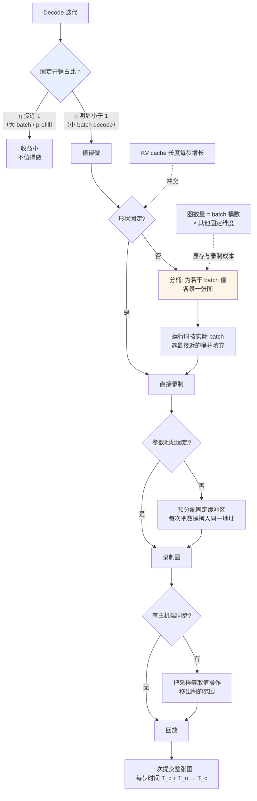

# CUDA Graphs 与执行开销

> 位置：[InferenceAtlas](../../INDEX.md) > [模块 04](README.md) > 当前文档
> 信息截至：2026-07-29 ｜ 最后核验：2026-07-29 ｜ 内容版本：v0.1
> 时效性等级：低
> 相关主题：[软件栈](01_inference_software_stack.md)｜[算子融合](07_kernel_fusion_and_operator_optimization.md)｜[批处理](../03_serving_engines_and_scheduling/02_static_dynamic_and_continuous_batching.md)

## 本章导读

前面几章讨论的都是"如何让每份计算更便宜"。本章讨论一个不同性质的问题：**当计算本身很小时，提交这份计算的固定成本可能超过计算本身**。

这正是 LLM decode 的处境。每一步只处理批中每序列 1 个 token，计算量小，但仍要走完整的调用链：框架分发 → runtime 调度 → kernel launch → 驱动提交。这条链上的每一环都有与计算量无关的固定开销，而一次 decode 迭代可能包含数百个 kernel。

CUDA Graphs 的思路很直接：**把一整串 kernel 调用录制成一个图，之后一次提交整个图**，从而把 $N$ 次提交的开销压缩成 1 次。代价是图一旦录制，其形状与参数地址就固定了——而这与推理的动态性直接冲突。

## 学习目标

读完本章后，读者应能够：

1. 量化固定开销在 decode 中的占比及其随 batch 的变化；
2. 说明 CUDA Graphs 的机制、前提条件与失效场景；
3. 解释为什么它与动态形状冲突，以及实践中如何调和；
4. 判断一个部署是否会从中受益。

## 核心结论

- **固定开销与计算量无关**，因此在小 batch decode 中占比最高，在 prefill 与大 batch 中可忽略。
- **收益 $\propto$ 开销占比**：$\eta = T_c/(T_c+T_o)$，$T_c$ 越小收益越大。这决定了它是"小 batch 优化"。
- **图录制要求形状固定、地址固定**，因此需要配合分桶与固定的显存缓冲。
- **它与融合是互补的**：融合减少 kernel 数量，图捕获减少每个 kernel 的提交成本。二者叠加效果最好。

## 1. 问题定义、系统边界与工作负载

### 1.1 固定开销的构成

一次 kernel 执行的完整成本：

| 环节 | 开销性质 | 与计算量的关系 |
|---|---|---|
| 框架层分发（Python） | 固定 | **无关** |
| Runtime 参数打包与校验 | 固定 | 无关 |
| Kernel launch | 固定 | 无关 |
| 驱动命令提交 | 固定 | 无关 |
| **实际计算** | 可变 | 正比 |
| 同步与事件 | 固定 | 无关 |

**关键性质**：前四项与最后一项都是**每次调用的固定成本**。

### 1.2 为什么 decode 特别受影响

| 阶段 | 单次迭代的计算量 | kernel 数量 | 固定开销占比 |
|---|---|---|---|
| Prefill | 大（处理 $S_{in}$ 个 token） | 与层数成正比 | **低** |
| Decode（大 batch） | 中 | 同上 | 中 |
| **Decode（小 batch）** | **小**（每序列 1 token） | 同上 | **高** |

**核心矛盾**：kernel 数量由**模型层数**决定，与 batch 无关；而计算量与 batch 成正比。因此 batch 越小，"每个 kernel 的固定开销 ÷ 每个 kernel 的计算量"越大。

## 2. 原理、数学与性能模型

### 2.1 效率模型

设一次 decode 迭代的纯计算时间为 $T_c$，固定开销总和为 $T_o$，则有效效率：

$$
\eta = \frac{T_c}{T_c + T_o}
$$

**$T_o$ 的构成**：$T_o \approx N_{kernel} \times t_{launch}$，其中 $N_{kernel}$ 与层数成正比、$t_{launch}$ 是每次提交的固定成本。

**$T_c$ 的构成**：由 [模块 01 第 5 章](../01_foundations_and_metrics/05_memory_bandwidth_and_arithmetic_intensity.md)，decode 在权重主导区时 $T_c \approx W_{bytes}/BW$，**与 batch 无关**（权重读取被摊薄）。

**这导出一个重要结论**：在权重主导区，$T_c$ 与 $T_o$ 都近似与 batch 无关，因此 $\eta$ 也近似恒定——**固定开销吃掉的是一个固定比例的时间**。

**但吞吐视角不同**：吞吐 $\propto B \times \eta / T_c$。由于 $\eta$ 恒定，消除 $T_o$ 相当于把每步时间从 $T_c + T_o$ 降到 $T_c$，吞吐提升倍数为：

$$
\frac{T_c + T_o}{T_c} = \frac{1}{\eta}
$$

**因此收益直接由 $\eta$ 决定**。$\eta = 0.5$ 时收益是 2 倍；$\eta = 0.9$ 时只有约 1.1 倍。**测出 $\eta$ 就知道该不该做这项优化。**

### 2.2 如何测 $\eta$

| 方法 | 做法 |
|---|---|
| 直接测量 | profiler 看 kernel 执行时间总和 vs 迭代墙钟时间 |
| 间接推断 | 观察 kernel 之间的空隙（gap）占比 |
| 对比实验 | 人为增大 batch，看每步时间是否近似不变（若是，说明开销主导） |

**第三种最简单**：若 batch 从 1 增到 8 而每步时间几乎不变，说明这段时间主要不是在算，而是在提交。

### 2.3 图捕获的机制

**录制阶段**：执行一遍完整的迭代，runtime 记录下所有 kernel 调用及其依赖关系，构成一张有向无环图。

**回放阶段**：一次调用即提交整张图，驱动按记录的顺序与依赖执行，**跳过了每个 kernel 的单独提交流程**。

**前提条件**（这是全部限制的来源）：

| 前提 | 原因 | 冲突点 |
|---|---|---|
| **形状固定** | 图中记录的是具体的 kernel 配置 | 推理的序列长度每步变 |
| **参数地址固定** | 图记录的是指针而非值 | 缓冲区需预分配且不重分配 |
| **控制流固定** | 图是静态的 DAG | 数据依赖的分支不可表达 |
| **无主机端同步** | 中途取值会打断图 | 采样中的 `.item()` 类操作 |

**这四条与推理的动态性全面冲突**，因此实践中需要一套调和手段。

## 3. 实现机制与系统设计

### 3.1 与动态性的调和

**图展示什么**：从判断是否值得做，到形状、地址、同步三个前提的逐项调和，最终到回放的完整决策路径。

**核心瓶颈在哪**：高亮的 `固定开销占比 η` 是第一道也是最重要的判据——**先测 $\eta$ 再决定是否投入**。很多团队直接上这项优化却收益甚微，就是因为跳过了这一步。另一个高亮的 `分桶` 是主要的工程成本来源：图的数量等于桶数乘以其他固定维度，每张图都要单独录制并占用显存。

**图中的 trade-off**：分桶带来填充浪费（实际 batch 小于桶边界时，多算的部分是无效工作），但由于 decode 是 memory-bound 且权重读取已被摊薄，这部分额外计算的时间代价小于其算力浪费比例——**这与 [第 5 章](05_xla_jax_and_tpu_runtime.md) 讨论的填充代价是同一个道理**。

**面试如何引用**：被问到"小 batch decode 效率低怎么办"时，先讲测 $\eta$ 判断值不值得，再讲三个前提的调和。**主动说出"KV cache 长度每步增长与图的形状固定要求冲突"**，说明你想过实际落地的困难而不只是知道这个技术。

### 3.2 KV cache 长度增长的处理

这是最棘手的一条：图要求形状固定，而 KV cache 每步增长一个 token。

**常见处理思路**：

| 思路 | 机制 | 代价 |
|---|---|---|
| **预分配到最大长度** | KV 缓冲区按最大上下文分配，图中记录固定形状 | 显存浪费 |
| **按长度分桶** | 为若干长度区间各录一张图 | 图数量增加 |
| **图外处理注意力** | 只把与长度无关的部分放进图 | 收益打折 |
| 分页 KV + 固定块表大小 | 块表形状固定，实际使用量由运行时参数控制 | 需 kernel 配合 |

**最后一条与分页 KV 的结合值得注意**：分页管理把"KV 在哪"变成了块表中的索引，而块表本身可以是固定大小的。这使得图的形状可以固定，实际长度作为一个标量参数传入——**这是分页 KV 的一个额外好处，常被忽略**（见 [模块 03 第 3 章](../03_serving_engines_and_scheduling/03_pagedattention_and_kv_memory_management.md)）。

### 3.3 与融合的关系

| 手段 | 作用 | 效果 |
|---|---|---|
| **算子融合** | 减少 $N_{kernel}$ | 减少总固定开销 |
| **图捕获** | 减少每个 kernel 的提交成本 | 同样减少总固定开销 |

**二者互补且叠加**：融合把 100 个 kernel 变成 30 个，图捕获把 30 次提交变成 1 次。**先做融合再做图捕获**，因为融合还能减少 HBM 访问（收益更全面），而图捕获只解决提交开销。

**一个实用判断**：如果融合已经做得很充分、kernel 数量已经很少，图捕获的边际收益会下降——因为 $T_o$ 本身已经变小了。

## 4. 性能、成本、能耗与可靠性 trade-off

| 决策 | 小 batch 性能 | 大 batch 性能 | 显存 | 复杂度 |
|---|---|---|---|---|
| 启用图捕获 | **↑↑** | ↑（有限） | ↑（多张图 + 固定缓冲） | ↑↑ |
| 分桶细 | ↑（填充少） | ↑ | **↑↑**（图数量多） | ↑ |
| 分桶粗 | ↑（仍有收益） | ↑ | ↓ | ↓ |
| 预分配最大 KV | 使图可行 | 同左 | **↓↓ 可并发数** | 低 |
| 分页 KV + 固定块表 | 使图可行 | 同左 | 无额外浪费 | 中 |

**注意第四行**：为了让图可行而把 KV 预分配到最大长度，会**直接压低可并发数**——这可能抵消掉图捕获带来的收益。**这是一个真实的陷阱**：优化了每步时间，却减少了并发，总吞吐可能不升反降。分页方案避免了这个问题。

**可靠性提示**：图捕获引入了"录制时的状态"与"回放时的状态"必须一致这一隐含契约。若代码在录制后修改了缓冲区地址或形状，行为是未定义的——**这类 bug 很难定位**，因此需要在启用时保留可关闭的开关。

## 5. benchmark、真实案例或公开部署案例

| 与本章相关的机制性依据 | 来源 |
|---|---|
| decode 阶段的计算量小、kernel 数量与层数成正比，因此固定开销占比高 | 本库 [模块 02 第 2 章](../02_transformer_and_kv_cache/02_prefill_vs_decode.md) 与 [第 1 章 2.2 节](01_inference_software_stack.md) 的推导 |
| 分页 KV 使 KV 的物理位置由块表索引，形状可固定 | [PagedAttention, SOSP 2023](https://arxiv.org/abs/2309.06180) |

> **来源限制**：CUDA Graphs 的 API 细节、各引擎的配置项与默认行为、以及实测的加速数字，需引用官方文档与各项目仓库，本环境不可达（见 [AGENTS.md 第 11 节](../../AGENTS.md)）。本章因此**只给出机制分析与判据**，不给出 API 名称与性能数字。`待核实`

## 6. 设计决策框架

1. **先测 $\eta$**：用 batch 扫描法（增大 batch 看每步时间是否近似不变）；
2. $\eta$ 接近 1 则不值得做，直接跳过；
3. $\eta$ 明显小于 1 时，**先做算子融合**（收益更全面），再考虑图捕获；
4. 确定 batch 分桶方案，桶数与显存预算平衡；
5. **KV 长度处理优先选分页 + 固定块表**，避免预分配最大长度压低并发；
6. 把采样等含主机端取值的操作移出图的范围；
7. 预分配固定的输入输出缓冲区，每次拷入同一地址；
8. 验证：对比启用前后的每步时间与**总吞吐**（不能只看每步时间）；
9. 保留可关闭的开关用于问题定位。

**第 8 步的强调是必要的**：每步变快但并发下降，总吞吐可能不升反降。**必须以总吞吐（或 goodput）验证**。

## 7. 常见失败模式与排查路径

| 失败模式 | 表现 | 根因 | 纠正 |
|---|---|---|---|
| 启用后收益甚微 | 性能几乎不变 | $\eta$ 本就接近 1 | 先测 $\eta$ 再决定 |
| 每步变快但吞吐下降 | 总吞吐不升反降 | 预分配最大 KV 压低并发 | 改用分页 + 固定块表 |
| 显存暴增 | OOM | 图数量过多 | 减少分桶粒度 |
| 图捕获失败 | 报错或回退 | 存在主机端同步 | 把取值操作移出图 |
| 行为异常且难定位 | 结果错误 | 缓冲区地址在录制后变化 | 固定缓冲；保留关闭开关 |
| 形状变化后失效 | 回落到非图路径 | 超出已录制的桶 | 扩大桶覆盖或接受回退 |
| 冷启动变慢 | 扩容不及时 | 录制多张图耗时 | 减少桶数或后台预录 |
| 只测每步时间 | 上线后不及预期 | 未看总吞吐 | 用 goodput 验证 |

## 8. 关联面试主题

1. **为什么小 batch decode 的效率会很低** → 本章 1.2、2.1
2. **CUDA Graphs 的机制与四个前提条件** → 本章 2.3
3. **KV cache 长度增长与图的形状固定如何调和** → 本章 3.2
4. **图捕获与算子融合是什么关系** → 本章 3.3
5. **为什么每步变快可能导致总吞吐下降** → 本章 4

## 9. 小结

固定开销（框架分发、runtime 调度、kernel launch、驱动提交）与计算量无关，而 kernel 数量由模型层数决定、与 batch 无关——因此小 batch decode 的固定开销占比最高。效率模型 $\eta = T_c/(T_c+T_o)$ 给出了明确判据：**消除固定开销的吞吐收益倍数正是 $1/\eta$**，所以测出 $\eta$ 就知道该不该做这项优化，$\eta$ 接近 1 时不值得投入。CUDA Graphs 把一串 kernel 调用录制成图并一次提交，但要求形状固定、参数地址固定、控制流固定、无主机端同步——这四条与推理的动态性全面冲突。调和手段是 batch 分桶、预分配固定缓冲、把采样移出图范围；其中最棘手的 KV 长度增长问题，**分页 KV + 固定大小块表是比预分配最大长度更好的解法**——后者会直接压低可并发数，可能使总吞吐不升反降。图捕获与算子融合互补：融合减少 kernel 数量且额外减少 HBM 访问，应当先做。

## 关键术语

| 中文术语 | 英文 | 定义 | 单位/口径 | 关联文档 |
|---|---|---|---|---|
| 固定开销 | fixed overhead $T_o$ | 与计算量无关的每次调用成本 | ms | 本章 1.1 |
| 有效效率 | effective efficiency $\eta$ | $T_c/(T_c+T_o)$；收益倍数为 $1/\eta$ | 无量纲 | 本章 2.1 |
| 图捕获 | graph capture | 录制 kernel 调用序列为可一次提交的图 | — | 本章 2.3 |
| 图回放 | graph replay | 一次提交整张已录制的图 | — | 本章 2.3 |
| Batch 扫描法 | batch sweep | 增大 batch 观察每步时间是否不变，以判断开销占比 | — | 本章 2.2 |

## 延伸阅读

- [07 算子融合](07_kernel_fusion_and_operator_optimization.md) —— 应当先做的互补手段
- [模块 03 第 3 章：PagedAttention](../03_serving_engines_and_scheduling/03_pagedattention_and_kv_memory_management.md) —— 固定块表使图可行
- [11 编译调试与 profiling](11_compiler_debugging_and_profiling.md) —— 测量 $\eta$ 的工具

## 主要来源

| # | 来源 | 类型 | 披露等级 | 核验日期 |
|---:|---|---|---|---|
| 1 | [PagedAttention (SOSP 2023)](https://arxiv.org/abs/2309.06180) | 会议论文 | 独立可复现实验 | 2026-07-29 |

> **说明**：本章的效率模型与收益判据为**基于第一性原理的推导**。CUDA Graphs 的 API 细节、各引擎配置项与实测加速数字因官方来源不可达而标注 `待核实`。

## 更新记录

| 日期 | 版本 | 变更 | 核验人 |
|---|---|---|---|
| 2026-07-29 | v0.1 | 初稿 | — |
