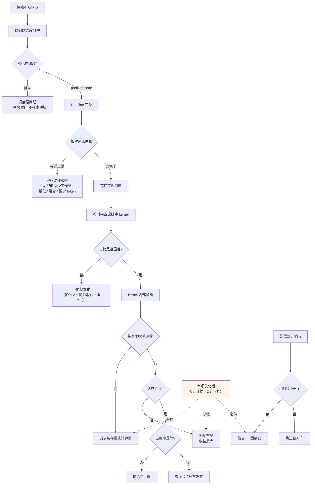

# 编译调试与 Profiling

> 位置：[InferenceAtlas](../../INDEX.md) > [模块 04](README.md) > 当前文档
> 信息截至：2026-07-29 ｜ 最后核验：2026-07-29 ｜ 内容版本：v0.1
> 时效性等级：低
> 相关主题：[软件栈](01_inference_software_stack.md)｜[算子融合](07_kernel_fusion_and_operator_optimization.md)｜[可观测性](../11_benchmarking_reliability_and_observability/)

## 本章导读

本模块前十章讲的是"可以做哪些优化"。本章讲的是**如何知道该做哪个、以及做了之后是否真的生效**。

这一环节的重要性容易被低估。执行层优化的一个共同特征是：**它们都可能在配置上"启用"了但在实际上没有生效**——融合可能因模式不匹配而未发生，图捕获可能静默回退，量化可能因未融合而收益归零。如果只看配置项而不验证，很容易得出错误结论。

本章给出一套自上而下的诊断方法：先确认瓶颈在哪一层，再验证优化是否生效，最后处理数值正确性问题。

## 学习目标

读完本章后，读者应能够：

1. 按正确顺序自上而下定位性能瓶颈；
2. 用可观测的证据验证每项优化是否真的生效；
3. 设计一个能定位融合/量化引入的数值差异的对比流程；
4. 说明为什么"配置启用"不等于"实际生效"。

## 核心结论

- **诊断必须自上而下**：先端到端分解，再定位到层，最后才到 kernel。反过来做会在细节上浪费大量时间。
- **每项优化都要有可观测的验证证据**，而非依赖配置项。融合看 kernel 数量，量化看 HBM 访问量，图捕获看提交次数。
- **数值差异的定位靠二分**：逐层对比中间结果，把差异范围缩小到具体算子。
- **可观测性必须与优化同步建设**。深度优化的栈在出问题时更难定位，事后补观测代价极高。

## 1. 问题定义、系统边界与工作负载

### 1.1 三类问题

| 类型 | 问题 | 主要工具 |
|---|---|---|
| **性能问题** | 比预期慢 | 端到端分解 → profiler |
| **正确性问题** | 结果与参考不符 | 逐层对比 → 二分定位 |
| **稳定性问题** | 偶发异常、时延尖峰 | 时序 trace → 关联事件 |

**三者的诊断顺序不同**，混在一起处理会互相干扰。**先确认是哪一类**。

### 1.2 观测的层次

| 层次 | 观测对象 | 回答的问题 |
|---|---|---|
| 端到端 | 六段时延分解 | 时间花在哪一段 |
| 组件 | 队列深度、KV 占用、批大小 | 哪个组件异常 |
| 迭代 | 每步耗时、kernel 序列 | 单次前向的构成 |
| Kernel | 执行时间、占用率、带宽利用率 | 哪个 kernel 慢、为什么 |
| 指令 | 指令混合、停顿原因 | kernel 内部的瓶颈 |

**原则**：**逐层下降，每层都确认再往下**。直接从 kernel 层开始，往往会优化一个只占总时间 2% 的算子。

## 2. 原理、数学与性能模型

### 2.1 自上而下的诊断流程

**第一步：端到端分解**

用 [模块 01 第 2 章](../01_foundations_and_metrics/02_latency_throughput_and_slo.md) 的六段分解，确定劣化落在哪一段。若落在排队段，问题在调度层而非执行层——**不要往下走**。

**第二步：确认是执行层问题**

用 Roofline 定位（[模块 01 第 4 章](../01_foundations_and_metrics/04_roofline_and_performance_modeling.md)）：

| 观测 | 结论 |
|---|---|
| 接近带宽或算力屋顶 | **已达硬件上限**，只能减少工作量 |
| 远低于两条屋顶 | **存在实现问题**，值得继续排查 |

**这一步是分水岭**。已达上限时，继续做 kernel 优化不会有收益。

**第三步：定位到 kernel**

按时间占比排序，只关注占比显著的 kernel。**优化占比 2% 的 kernel，即使提速一倍，端到端也只改善 1%。**

**第四步：kernel 内部诊断**

用 [第 7 章 3.1 节](07_kernel_fusion_and_operator_optimization.md) 的诊断树：先看带宽/算力利用率，再看访存合并，再看占用率、同步、分支发散。

### 2.2 固定开销的测量

由 [第 10 章](10_cuda_graphs_and_execution_overhead.md)，$\eta = T_c/(T_c+T_o)$。

**测量方法**：

| 方法 | 做法 | 得到 |
|---|---|---|
| Kernel 时间求和 | profiler 中所有 kernel 执行时间之和 | $T_c$ |
| 迭代墙钟时间 | 一次迭代的实际耗时 | $T_c + T_o$ |
| 相除 | — | $\eta$ |
| **Batch 扫描** | 增大 batch 看每步时间是否近似不变 | 定性判断 $T_o$ 是否主导 |

**Batch 扫描法最实用**：不需要 profiler，观察每步时间对 batch 的敏感度即可。若从 batch=1 到 8 每步时间几乎不变，说明这段时间主要花在提交而非计算。

### 2.3 验证优化是否生效

**这是本章最实用的部分**。每项优化都有可观测的验证证据：

| 优化 | 声称的效果 | **验证证据** | 若未生效的表现 |
|---|---|---|---|
| 算子融合 | 减少中间结果读写 | **kernel 数量显著减少** | 数量与未融合时相近 |
| 图捕获 | 减少提交开销 | **kernel 间空隙消失** | 空隙依旧、每步时间不变 |
| 量化 | 减少权重字节 | **HBM 读取量按比例下降** | 读取量不变（未融合反量化） |
| Tiling 注意力 | 不物化中间矩阵 | **显存峰值下降、长序列不 OOM** | 显存峰值随 $S^2$ 增长 |
| 前缀缓存 | 跳过重复 prefill | **命中率指标 > 0 且 TTFT 下降** | 命中率为 0 |
| 内存规划 | 复用缓冲区 | 分配次数下降、峰值可预测 | 分配频繁 |
| CUDA Graphs | 一次提交 | 提交次数从 $N$ 降到 1 | 提交次数不变 |

**核心纪律**：**不要相信配置项，要看证据**。配置里写着 `enable_fusion=true` 不代表融合真的发生了——模式不匹配、pass 顺序错误、图中断都会让它静默失效。

### 2.4 数值差异的定位

融合与量化都可能改变数值结果。定位流程：

1. **确认是否在容差内**。融合改变累加顺序会产生浮点差异，这是预期的；判断标准应是任务指标而非逐位相同；
2. **建立参考实现**：关闭所有优化的版本；
3. **逐层对比**：比较每层输出与参考的差异，找到差异开始显著放大的层；
4. **二分定位**：在该层内逐项关闭优化（融合、量化、特定 kernel），确定是哪一项引入的；
5. **判断是 bug 还是精度**：若关闭某项后差异消失且该项是有损的（如量化），属精度问题；若该项应当是等价的（如融合），则是 bug。

**关键区分**：**数学等价的优化（tiling、融合）出现显著差异是 bug；有损优化（量化、稀疏）出现差异是预期，需评估幅度**。混淆二者会导致错误的处理方向。

## 3. 实现机制与系统设计

### 3.1 完整诊断流程

**图展示什么**：从"性能不及预期"到具体优化动作的完整诊断路径，含端到端分解、Roofline 分流、kernel 定位与内部诊断。

**核心瓶颈在哪**：高亮的 `相对两条屋顶` 是最重要的分叉——它区分"已达硬件极限"与"存在实现问题"，二者的处理方向完全不同。另一个高亮的 `验证证据` 是最容易被跳过却最关键的环节：**没有验证的优化等于没做**。

**图中的 trade-off**：左上的 `排队 → 调度层问题` 分支提醒一件事——**执行层优化只有在瓶颈确实在执行层时才有意义**。很多团队在调度层有明显问题时去优化 kernel，投入产出比极低。

**面试如何引用**：被问到"性能问题怎么排查"时，按这张图自上而下讲，并**主动强调"每项优化都要有可观测的验证证据"**。能举出具体证据（融合看 kernel 数、量化看 HBM 读取量）比泛泛说"用 profiler"有说服力得多。

### 3.2 应当常备的观测项

| 层次 | 观测项 | 为什么必需 |
|---|---|---|
| 端到端 | 六段时延分解 | 定位到段 |
| 迭代 | 每步墙钟时间、kernel 数量 | 判断融合与开销 |
| Kernel | 时间占比、带宽利用率、占用率 | 定位与内部诊断 |
| 内存 | HBM 读写量、显存峰值、分配次数 | 验证量化与内存规划 |
| 编译 | 编译次数、图段数、编译耗时 | 验证编译有效性 |
| 缓存 | 前缀命中率 | 验证缓存生效 |
| 数值 | 与参考实现的逐层差异 | 正确性 |

**建设时机**：**与优化同步，而非事后**。深度优化的栈在出问题时更难定位（见 [第 1 章 4 节](01_inference_software_stack.md)），事后补观测的代价远高于同步建设。

### 3.3 常见的"静默失效"

这类问题的共同特征是**不报错、配置看起来正确、但优化没有生效**：

| 优化 | 静默失效的原因 | 检出方法 |
|---|---|---|
| 算子融合 | 模式不匹配、pass 顺序错、图中断 | 看 kernel 数量 |
| 量化 | 反量化未与 GEMM 融合 | 看 HBM 读取量 |
| 图捕获 | 前提不满足时回退 | 看提交次数或空隙 |
| 前缀缓存 | 路由未感知、prompt 含变化内容 | 看命中率 |
| Tiling 注意力 | 回落到朴素实现 | 看显存峰值随长度的增长 |
| 编译 | 图被切成多段 | 看段数 |

**这张表建议直接作为上线前的检查清单使用**——每一项都对应一个可观测的数字，逐项确认比阅读配置文件可靠得多。

## 4. 性能、成本、能耗与可靠性 trade-off

| 决策 | 收益 | 代价 |
|---|---|---|
| 生产环境常开 profiler | 问题可即时定位 | 性能开销 |
| 只在故障时开启 | 无常态开销 | 偶发问题难复现 |
| 保留优化开关 | 可二分定位 | 代码复杂度 |
| 记录逐层数值 | 正确性可追溯 | 存储与性能开销 |
| 采样式观测 | 开销低 | 可能漏掉低频事件 |

**推荐组合**：**常态开启低开销的聚合指标（kernel 数量、时间占比、HBM 量、命中率），按需开启高开销的详细 trace**。这与 [模块 11](../11_benchmarking_reliability_and_observability/) 的可观测性设计一致。

## 5. benchmark、真实案例或公开部署案例

| 与本章相关的机制性依据 | 来源 |
|---|---|
| 注意力的瓶颈是 HBM 访问——因此 HBM 读写量是验证相关优化的核心观测项 | [FlashAttention, NeurIPS 2022](https://arxiv.org/abs/2205.14135) |
| KV 显存管理方式直接影响可并发数——因此显存峰值与占用率是必备观测 | [PagedAttention, SOSP 2023](https://arxiv.org/abs/2309.06180) |

> **来源限制**：具体 profiler 工具的名称、命令、输出格式与指标定义，需引用厂商与项目官方文档，本环境不可达（见 [AGENTS.md 第 11 节](../../AGENTS.md)）。本章因此**只给出与工具无关的诊断方法与验证判据**。`待核实`

## 6. 设计决策框架

1. **先确认问题类型**（性能 / 正确性 / 稳定性），三者诊断路径不同；
2. 性能问题从端到端六段分解开始，确认劣化在执行层再往下；
3. 用 Roofline 判断"已达上限"还是"实现问题"；
4. 按时间占比排序，只优化占比显著的 kernel；
5. kernel 内部按 [第 7 章](07_kernel_fusion_and_operator_optimization.md) 诊断树排查；
6. 测 $\eta$ 判断是否值得做开销类优化；
7. **每项优化后按 2.3 节表验证证据**；
8. 正确性问题用逐层对比 + 二分定位；
9. **区分"数学等价优化出现差异"（bug）与"有损优化出现差异"（预期）**；
10. 观测能力与优化同步建设，保留可关闭优化的开关。

## 7. 常见失败模式与排查路径

| 失败模式 | 表现 | 根因 | 纠正 |
|---|---|---|---|
| 优化了非瓶颈 | 端到端无改善 | 未按占比排序 | 先看时间占比 |
| 在调度层问题上优化 kernel | 投入产出极低 | 未做端到端分解 | 先分解定位 |
| 已达上限仍继续优化 | 无收益 | 未做 Roofline 定位 | 先判断是否触顶 |
| 相信配置项 | 以为优化生效实则没有 | 静默失效 | 按 2.3 节验证证据 |
| 把等价优化的差异当精度问题 | 放过了 bug | 未区分两类 | 明确优化的数学性质 |
| 把量化差异当 bug | 无谓排查 | 同上 | 同上 |
| 事后补观测 | 故障时无法定位 | 观测滞后于优化 | 同步建设 |
| 无优化开关 | 无法二分 | 优化硬编码 | 保留开关 |
| 只测每步时间 | 总吞吐反而下降 | 忽略并发影响 | 用 goodput 验证 |

## 8. 关联面试主题

1. **性能问题的诊断顺序** → 本章 2.1、3.1
2. **如何验证一项优化是否真的生效** → 本章 2.3
3. **如何定位融合或量化引入的数值差异** → 本章 2.4
4. **哪些优化会"静默失效"，如何检出** → 本章 3.3
5. **为什么可观测性要与优化同步建设** → 本章 3.2、4

## 9. 小结

执行层优化的诊断必须自上而下：端到端六段分解 → 确认劣化在执行层 → Roofline 判断是否已达硬件上限 → 按时间占比定位 kernel → kernel 内部诊断。跳过前面几步直接看 kernel，很容易优化一个只占总时间百分之几的算子。本章最实用的部分是**验证清单**：每项优化都有对应的可观测证据——融合看 kernel 数量、量化看 HBM 读取量、图捕获看提交次数与空隙、前缀缓存看命中率、tiling 注意力看显存峰值。这些优化的共同风险是**静默失效**：不报错、配置正确、但实际没有生效。因此**不要相信配置项，要看证据**。正确性问题用逐层对比加二分定位，而处理方向取决于该优化的数学性质——**数学等价的优化（tiling、融合）出现显著差异是 bug，有损优化（量化、稀疏）出现差异是预期**，混淆二者会导致错误的排查方向。观测能力必须与优化同步建设，因为深度优化的栈在出问题时更难定位。

## 关键术语

| 中文术语 | 英文 | 定义 | 单位/口径 | 关联文档 |
|---|---|---|---|---|
| 自上而下诊断 | top-down diagnosis | 从端到端逐层下降定位瓶颈 | — | 本章 2.1 |
| 验证证据 | verification evidence | 证明某项优化真的生效的可观测数字 | — | 本章 2.3 |
| 静默失效 | silent failure | 配置正确但优化实际未生效且不报错 | — | 本章 3.3 |
| 二分定位 | bisection | 逐项关闭优化以缩小差异来源范围 | — | 本章 2.4 |
| 时间占比 | time share | 单个 kernel 占总执行时间的比例 | % | 本章 2.1 |

## 延伸阅读

- [07 算子融合与 kernel 优化](07_kernel_fusion_and_operator_optimization.md) —— kernel 内部诊断树
- [10 CUDA Graphs](10_cuda_graphs_and_execution_overhead.md) —— $\eta$ 的测量与判据
- [模块 11：可观测性](../11_benchmarking_reliability_and_observability/) —— 生产环境的观测体系

## 主要来源

| # | 来源 | 类型 | 披露等级 | 核验日期 |
|---:|---|---|---|---|
| 1 | [FlashAttention (NeurIPS 2022)](https://arxiv.org/abs/2205.14135) | 会议论文 | 独立可复现实验 | 2026-07-29 |
| 2 | [PagedAttention (SOSP 2023)](https://arxiv.org/abs/2309.06180) | 会议论文 | 独立可复现实验 | 2026-07-29 |

> **说明**：本章为**与工具无关的诊断方法论**。具体 profiler 的名称、命令与指标定义因官方来源不可达而标注 `待核实`。

## 更新记录

| 日期 | 版本 | 变更 | 核验人 |
|---|---|---|---|
| 2026-07-29 | v0.1 | 初稿 | — |
