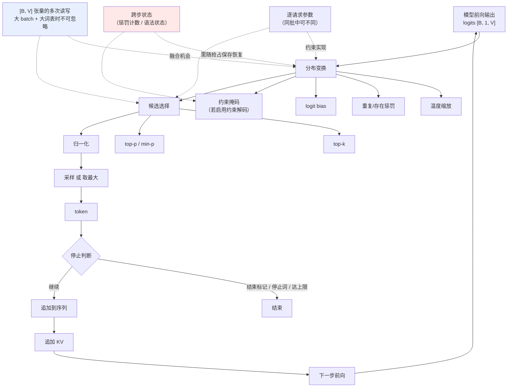

# 解码基础

> 位置：[InferenceAtlas](../../INDEX.md) > [模块 05](README.md) > 当前文档
> 信息截至：2026-07-29 ｜ 最后核验：2026-07-29 ｜ 内容版本：v0.1
> 时效性等级：低
> 相关主题：[prefill vs decode](../02_transformer_and_kv_cache/02_prefill_vs_decode.md)｜`02_greedy_sampling_topk_topp_temperature.md`｜[投机解码](04_speculative_decoding.md)

## 本章导读

解码是把模型输出的 logits 变成 token 的那一步。它在计算量上微不足道——相比一次完整的前向传播，采样几乎不花时间——但它在系统上的地位远超其计算占比：

**它决定了自回归循环的形状**。每一步生成什么 token、何时停止、能否并行、能否复用，都由解码逻辑决定。投机解码之所以可能，正是因为解码这一步可以被重新组织；约束解码之所以有系统代价，也是因为它介入了这一步。

本章建立解码的基本框架：一次解码步骤做了什么、有哪些可调的自由度、以及它与系统各层的接口。

## 学习目标

读完本章后，读者应能够：

1. 描述一次解码步骤的完整流程与各环节的开销；
2. 说明解码的三类自由度（分布变换、候选选择、停止条件）；
3. 分析大词表对 decode 尾部开销的影响；
4. 说明解码逻辑与批处理、KV 管理、约束机制的接口关系。

## 核心结论

- **解码的计算量微不足道，但它决定循环结构**——这是它系统地位高于计算占比的原因。
- **logits 张量的大小与词表成正比**，在大词表模型上，采样相关的读写不可忽略。
- **解码有三类自由度**：分布变换（温度、惩罚）、候选选择（贪心/采样/束搜索）、停止条件。三者可组合。
- **解码是否有跨步状态，决定了它能否与批处理和抢占无缝配合**。

## 1. 问题定义、系统边界与工作负载

### 1.1 一次解码步骤

| 环节 | 输入 → 输出 | 开销 |
|---|---|---|
| 1. 取 logits | 模型输出 $[B, 1, V]$ | 由前向产生 |
| 2. 分布变换 | logits → 调整后的 logits | 与 $V$ 成正比 |
| 3. 候选筛选 | 调整后 logits → 候选集 | 排序/筛选，与 $V$ 相关 |
| 4. 采样 | 候选集 → 一个 token | 小 |
| 5. 停止判断 | token → 是否结束 | 小 |
| 6. 追加 | token → 序列与 KV | 小 |

**关键观察**：**环节 2–3 的开销与词表大小 $V$ 成正比**。当 $V$ 很大而 batch 也大时，$[B, V]$ 这个张量的多次读写在 decode 的总时间中可能不可忽略——这正是"融合采样链"成为一项优化的原因（见 [模块 04 第 7 章](../04_compilers_runtimes_and_kernels/07_kernel_fusion_and_operator_optimization.md)）。

### 1.2 三类自由度

| 类别 | 控制什么 | 典型参数 |
|---|---|---|
| **分布变换** | 概率分布的形状 | 温度、重复惩罚、logit bias |
| **候选选择** | 从哪些 token 中选 | top-k、top-p、min-p、束搜索 |
| **停止条件** | 何时结束 | 停止词、最大长度、结束标记 |

**三者正交**：可以任意组合。例如"温度 0.7 + top-p 0.9 + 遇到某停止词结束"。

**系统含义**：这些参数是**每请求的**，因此同一批次中不同请求可以有不同参数。这要求采样实现支持**逐请求参数**，而非全批统一——这是一个实现上的约束，也是批处理与解码接口的关键点。

## 2. 原理、数学与性能模型

### 2.1 从 logits 到概率

模型输出的是未归一化的 logits $z \in \mathbb{R}^V$。转为概率：

$$
p_i = \frac{e^{z_i / T}}{\sum_j e^{z_j / T}}
$$

其中 $T$ 为温度。$T \to 0$ 时分布趋近于 one-hot（等价于贪心）；$T$ 增大时分布趋于均匀。

**数值稳定性**：实现中必须减去最大值再取指数，否则 $e^{z_i}$ 会溢出。这与 [模块 04 第 8 章](../04_compilers_runtimes_and_kernels/08_flashattention_and_memory_efficient_attention.md) 的 softmax 稳定化是同一技术。

### 2.2 解码的开销结构

设批大小 $B$、词表 $V$、每元素字节数 $b$：

| 张量 | 大小 | 说明 |
|---|---|---|
| Logits | $B \times V \times b$ | 每步产生 |
| 排序/筛选中间结果 | 同阶 | top-k/top-p 需要 |

**与权重读取的对比**：由 [模块 01 第 5 章](../01_foundations_and_metrics/05_memory_bandwidth_and_arithmetic_intensity.md)，每步权重读取为 $W_{bytes} = P_{params} \times b_w$。

**采样开销占比**：

$$
\frac{B \cdot V \cdot b \cdot k_{passes}}{W_{bytes}}
$$

其中 $k_{passes}$ 为对 logits 张量的读写遍数（未融合时可能好几遍）。

**结论**：**$B$ 越大、$V$ 越大、融合越差，采样开销占比越高**。在小 batch 上可忽略，在大 batch + 大词表上值得优化。这解释了为什么"融合采样链"是一项真实的优化而非过度设计。

### 2.3 跨步状态

某些解码策略有跨步状态：

| 策略 | 跨步状态 | 系统影响 |
|---|---|---|
| 贪心 / 独立采样 | **无** | 最容易与批处理、抢占配合 |
| 重复惩罚 | 已生成 token 的计数 | 需随请求保存 |
| 束搜索 | 多条候选序列及其分数 | **显著复杂**（多序列、需剪枝） |
| 约束解码 | 语法状态机的当前状态 | 需随请求保存 |
| 投机解码 | draft 提议与验证状态 | 需协调两个模型 |

**关键判断**：**无状态的解码策略最容易与 continuous batching 和抢占配合**；有状态的策略在请求被抢占并恢复时，状态也必须一并保存与恢复，否则行为不一致。

**这是一个容易被忽略的正确性问题**：若抢占只保存了 KV 而丢弃了采样状态（如重复惩罚的计数），恢复后的生成行为会与未被抢占时不同。

## 3. 实现机制与系统设计

### 3.1 解码流水线

**图展示什么**：一次解码步骤的完整流水线，含分布变换、候选选择、采样、停止判断与自回归回环。

**核心瓶颈在哪**：高亮的 `[B, V] 张量的多次读写` 是性能侧的关注点——未融合时这个张量要被读写好几遍，在大词表模型上构成实际开销。另一处高亮的 `跨步状态` 是正确性侧的关注点：抢占恢复时若不一并保存，生成行为会不一致。

**图中的 trade-off**：`逐请求参数` 使同批请求可以有不同的采样配置（产品灵活性），但代价是采样 kernel 必须支持参数向量化，实现比全批统一复杂。这个灵活性在多租户场景中通常是必需的。

**面试如何引用**：被问到解码时，除了讲采样算法，**主动指出两个系统关注点**——大词表下的采样开销、以及跨步状态与抢占的交互。这两点说明你从系统而非算法角度理解过这一层。

### 3.2 与系统各层的接口

| 接口对象 | 关系 |
|---|---|
| **批处理** | 逐请求参数要求向量化实现；无状态策略最易配合 |
| **KV 管理** | 每步追加一个 token 的 KV；束搜索会产生分叉（需 copy-on-write） |
| **抢占** | 跨步状态必须与 KV 一同保存恢复 |
| **约束机制** | 约束以掩码形式作用于 logits，状态机随请求维护 |
| **投机解码** | 需要一次验证多个位置，改变了"一步一 token"的假设 |
| **流式返回** | 每产生一个 token 即可发送 |

**束搜索那一行值得注意**：它会从一条序列分叉出多条，这与 [模块 03 第 3 章](../03_serving_engines_and_scheduling/03_pagedattention_and_kv_memory_management.md) 的 copy-on-write 直接相关——**分叉点之前的 KV 可以共享，之后各自独立**。这是分页 KV 的一个典型应用场景。

## 4. 性能、成本、能耗与可靠性 trade-off

| 决策 | 质量 | 时延 | 实现复杂度 |
|---|---|---|---|
| 贪心 | 确定但可能重复 | 最低 | 最低 |
| 采样（温度/top-p） | 多样、可调 | 低 | 低 |
| 束搜索 | 某些任务更优 | **高**（多条序列） | **高** |
| 约束解码 | 保证格式 | 中（掩码开销） | 中高 |
| 融合采样链 | 无影响 | ↓（大词表时明显） | 中 |
| 逐请求参数 | 灵活性↑ | 略↑ | 中 |

**束搜索在 LLM 推理中的地位**：它显著增加计算与显存（多条序列并行），而在开放式生成任务上的质量收益通常不明显。**因此在多数 LLM serving 中不是默认选择**，主要用于有明确最优解的任务（如某些结构化生成）。详见 `03_beam_search_and_constrained_decoding.md`。

## 5. benchmark、真实案例或公开部署案例

| 与本章相关的机制性依据 | 来源 |
|---|---|
| 自回归生成的每步依赖前面所有 token——解码循环的结构基础 | [Attention Is All You Need, NeurIPS 2017](https://arxiv.org/abs/1706.03762) |
| 分页 KV 的 copy-on-write 支持束搜索与多次采样的前缀共享 | [PagedAttention, SOSP 2023](https://arxiv.org/abs/2309.06180) |
| 投机解码通过一次验证多个位置改变了"一步一 token"的循环结构 | [Speculative Decoding, ICML 2023](https://arxiv.org/abs/2211.17192) |

> 各引擎支持的采样参数集合、约束解码实现与默认值，需引用官方文档，本环境不可达（见 [AGENTS.md 第 11 节](../../AGENTS.md)）。`待核实`

## 6. 设计决策框架

1. 确认业务需要的解码策略（贪心/采样/约束/束搜索）；
2. 确认是否需要逐请求参数——多租户通常需要；
3. 检查采样实现是否支持参数向量化；
4. 估算采样开销占比（用 2.2 节公式），大 batch + 大词表时考虑融合；
5. **确认跨步状态在抢占恢复时被正确保存**；
6. 若用束搜索，确认 KV 管理支持分叉与共享；
7. 若用约束解码，评估掩码构造的开销（见 `09_structured_output_and_grammar_constrained_decoding.md`）；
8. 确认停止条件的实现覆盖所有情形（结束标记、停止词、长度上限）。

## 7. 常见失败模式与排查路径

| 失败模式 | 表现 | 根因 | 纠正 |
|---|---|---|---|
| 抢占后生成行为不一致 | 恢复后输出与预期不同 | 采样状态未保存 | 状态随 KV 一同持久化 |
| 大 batch 下 TPOT 异常 | decode 变慢 | 采样链未融合，$[B,V]$ 多次读写 | 融合采样 kernel |
| 参数不生效 | 温度等设置无效果 | 实现为全批统一 | 支持逐请求参数 |
| 束搜索显存暴涨 | OOM | 多序列各自持有 KV | 用 copy-on-write 共享前缀 |
| 无法停止 | 生成不结束 | 停止条件覆盖不全 | 补齐长度上限兜底 |
| 数值溢出 | NaN | softmax 未做最大值稳定化 | 减最大值再取指数 |
| 约束解码拖慢 decode | TPOT 上升 | 掩码构造在关键路径 | 预计算或增量更新掩码 |

## 8. 关联面试主题

1. **一次解码步骤做了什么** → 本章 1.1、3.1
2. **解码的三类自由度及其组合** → 本章 1.2
3. **大词表如何影响 decode 开销** → 本章 2.2
4. **跨步状态与抢占的交互** → 本章 2.3
5. **束搜索为何不是 LLM serving 的默认选择** → 本章 4

## 9. 小结

解码把 logits 变成 token，其计算量相比一次前向微不足道，但它决定了自回归循环的结构——投机解码、约束解码、束搜索之所以可能或有代价，都源于它们介入了这一步。解码有三类正交的自由度：分布变换、候选选择、停止条件。系统层面有两个关注点常被忽略：一是 **logits 张量 $[B,V]$ 的多次读写在大 batch 加大词表时构成实际开销**，这是融合采样链的动机；二是**有跨步状态的解码策略（重复惩罚、约束状态机、束搜索）在抢占恢复时必须与 KV 一同保存**，否则生成行为会不一致——这是一个容易被忽略的正确性问题。逐请求采样参数是多租户的常见需求，要求采样实现支持参数向量化。束搜索因显著增加计算与显存、而在开放式生成上质量收益不明显，通常不是 LLM serving 的默认选择。

## 关键术语

| 中文术语 | 英文 | 定义 | 单位/口径 | 关联文档 |
|---|---|---|---|---|
| 分布变换 | distribution shaping | 温度、惩罚等对 logits 的调整 | — | 本章 1.2 |
| 候选选择 | candidate selection | top-k/top-p 等筛选可采样的 token 集合 | — | 本章 1.2 |
| 跨步状态 | cross-step state | 解码策略在步骤间保持的状态 | — | 本章 2.3 |
| 逐请求参数 | per-request parameters | 同批中不同请求可用不同采样配置 | — | 本章 1.2 |
| 采样开销占比 | sampling overhead share | $[B,V]$ 张量读写相对权重读取的比例 | % | 本章 2.2 |

## 延伸阅读

- `02_greedy_sampling_topk_topp_temperature.md` —— 各参数的作用与相互影响
- `03_beam_search_and_constrained_decoding.md` —— 有状态策略的代价
- [模块 03 第 3 章：PagedAttention](../03_serving_engines_and_scheduling/03_pagedattention_and_kv_memory_management.md) —— 束搜索的 KV 共享

## 主要来源

| # | 来源 | 类型 | 披露等级 | 核验日期 |
|---:|---|---|---|---|
| 1 | [Attention Is All You Need (NeurIPS 2017)](https://arxiv.org/abs/1706.03762) | 会议论文 | 独立可复现实验 | 2026-07-29 |
| 2 | [PagedAttention (SOSP 2023)](https://arxiv.org/abs/2309.06180) | 会议论文 | 独立可复现实验 | 2026-07-29 |
| 3 | [Speculative Decoding (ICML 2023)](https://arxiv.org/abs/2211.17192) | 会议论文 | 独立可复现实验 | 2026-07-29 |

> **说明**：本章的开销模型为**基于张量大小的算术推导**。各引擎的参数集合与实现细节因官方来源不可达而标注 `待核实`。

## 更新记录

| 日期 | 版本 | 变更 | 核验人 |
|---|---|---|---|
| 2026-07-29 | v0.1 | 初稿 | — |
