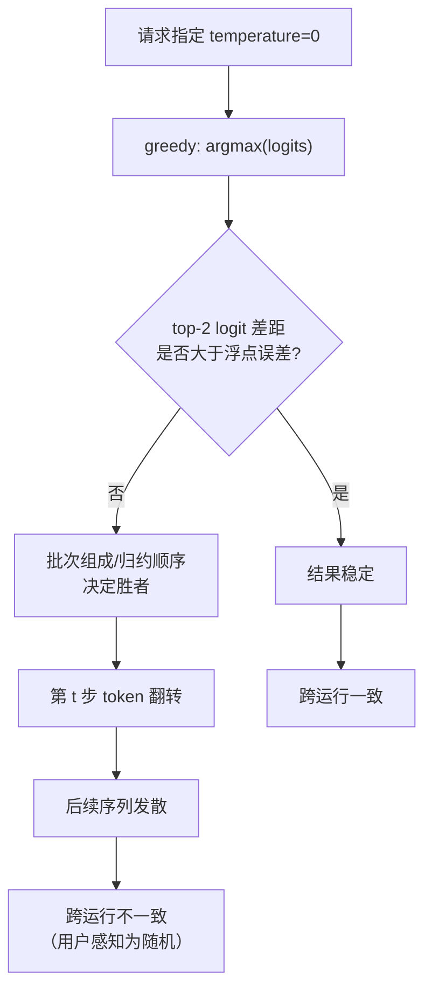
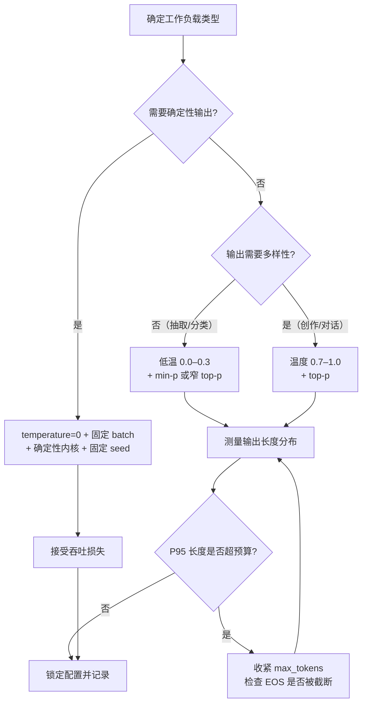

# 采样参数：greedy、temperature、top-k、top-p、min-p

> 位置：[InferenceAtlas](../../INDEX.md) > [模块 05](README.md) > 当前文档
> 信息截至：2026-07-29 ｜ 最后核验：2026-07-29 ｜ 内容版本：v0.1
> 时效性等级：低
> 相关主题：[解码基础](01_decoding_basics.md)｜[投机解码](04_speculative_decoding.md)｜`10_generation_quality_latency_tradeoffs.md`

## 本章导读

采样参数是推理服务对外暴露的最细粒度旋钮。它们看上去只影响"生成质量"，但在系统层面，它们同时影响三件事：**尾部时延**（因为它们改变期望生成长度）、**可复现性**（因为它们引入随机性与数值敏感性）、以及**投机解码的收益**（因为它们改变 draft 与 target 分布的重合度）。

一个只把采样参数当作"模型侧配置"的服务，会在容量规划时反复被意外的长尾拖垮：把温度从 0 调到 1.0 可能让平均输出长度显著变化，而输出长度是 decode 阶段成本的唯一线性驱动因素。

本章的目标是把采样参数从"玄学调参"还原为**可以推理其系统后果的确定性变换**：每个参数做了什么数学操作、它对分布熵的影响方向、它对停止行为的影响、以及它在批处理实现中的代价。

## 学习目标

读完本章后，读者应能够：

1. 写出 temperature、top-k、top-p、min-p 各自的数学定义，并说明它们的作用顺序为何重要；
2. 解释为什么 greedy 解码不等于"确定性输出"，并列出破坏可复现性的三个系统来源；
3. 说明采样参数如何通过期望输出长度影响 decode 成本与 KV 占用；
4. 分析逐请求采样参数对批处理内核实现的约束；
5. 判断某个采样配置会让投机解码的接受率升高还是降低。

## 核心结论

- **采样参数是分布变换的组合，顺序不可交换**：先温度后截断与先截断后温度会得到不同分布，服务必须固定并文档化顺序。
- **greedy 不保证可复现**：批次组成变化、归约顺序、内核选择都会改变浮点结果，进而在近似平局处翻转 argmax。
- **采样参数的最大系统影响不在采样本身，而在期望输出长度**——它决定 decode 步数，而 decode 步数决定成本与 KV 峰值。
- **逐请求参数是硬约束**：同一批次内不同请求参数不同，采样内核必须向量化处理参数张量，不能走标量分支。
- **低温度提高投机解码接受率**，高温度降低接受率；这使得采样配置与投机策略必须联合评估。

## 1. 问题定义、系统边界与工作负载

### 1.1 采样管线的位置

解码器接收模型输出的 logits $z \in \mathbb{R}^{B \times V}$（$B$ 为批大小，$V$ 为词表大小），经过一串变换后产生每个请求的下一个 token。这条管线完全位于模型之外，属于服务框架的职责。

| 阶段 | 变换 | 是否改变分布支撑集 |
|---|---|---|
| logit 偏置 | $z_i \leftarrow z_i + b_i$ | 否（除非 $b_i = -\infty$） |
| 重复惩罚 | $z_i \leftarrow f(z_i, \text{history})$ | 否 |
| 温度缩放 | $z_i \leftarrow z_i / T$ | 否 |
| top-k 截断 | 保留最大 $k$ 个 | 是 |
| top-p 截断 | 保留累积概率达 $p$ 的最小集合 | 是 |
| min-p 截断 | 保留 $p_i \ge p_{\min} \cdot p_{\max}$ 的项 | 是 |
| 归一化采样 | 从剩余项按概率抽样 | — |

**系统边界**：本章讨论的全部内容发生在一次前向之后、下一次前向之前。它不改变模型权重，不改变 KV cache 内容，只改变"下一个 token 是什么"。但正因为它决定了下一个 token，它间接决定了后续所有前向的输入。

### 1.2 工作负载差异

不同工作负载对采样参数的敏感度差异很大：

| 工作负载 | 典型配置倾向 | 系统后果 |
|---|---|---|
| 代码补全 | 低温度或 greedy | 输出短、可复现要求高 |
| 对话/创作 | 中高温度 + top-p | 输出长度方差大 |
| 结构化抽取 | 低温度 + 语法约束 | 见 `09_structured_output_and_grammar_constrained_decoding.md` |
| 批量评测 | greedy | 要求跨运行一致 |
| 多样本自洽 | 高温度、多次采样 | 成本乘以采样数，见 `07_reasoning_inference_and_test_time_scaling.md` |

## 2. 原理、数学与性能模型

### 2.1 softmax 与温度

模型输出 logits 后，基础分布为

$$
p_i = \frac{\exp(z_i)}{\sum_{j=1}^{V} \exp(z_j)}
$$

- $z_i$：第 $i$ 个 token 的 logit，无量纲；
- $V$：词表大小，无量纲计数；
- $p_i$：概率，无量纲，$\sum_i p_i = 1$。

引入温度 $T > 0$：

$$
p_i(T) = \frac{\exp(z_i / T)}{\sum_{j} \exp(z_j / T)}
$$

**直觉**：$T$ 是分布的"锐化/平滑"旋钮。$T \to 0^+$ 时，$p$ 收敛到在 $\arg\max_i z_i$ 处的单点分布（即 greedy）；$T = 1$ 保持模型原始分布；$T \to \infty$ 时收敛到词表上的均匀分布。

**假设与局限**：
- 该公式假设 logits 已是模型的最终输出，未经其他变换；
- $T$ 的绝对数值没有跨模型可比性——不同模型的 logit 尺度不同，同一个 $T=0.8$ 在两个模型上产生的熵可能相差很大；
- 实现上 $T=0$ 不能直接代入（除零），服务通常把 $T=0$ 特判为 greedy。

**熵的单调性**：分布的 Shannon 熵

$$
H(T) = -\sum_i p_i(T) \log p_i(T)
$$

关于 $T$ 单调不减。这是温度作为"多样性旋钮"的数学基础：升温必然不减少不确定性。

### 2.2 三种截断的定义与对比

设按概率降序排列后的分布为 $p_{(1)} \ge p_{(2)} \ge \dots \ge p_{(V)}$。

**top-k**：保留集合 $S_k = \{(1), (2), \dots, (k)\}$。

$$
S_k = \{\text{前 } k \text{ 个 token}\}
$$

**top-p（nucleus）**：保留最小的前缀集合使累积概率不小于 $p$：

$$
S_p = \{(1), \dots, (m)\}, \quad m = \min\left\{ m' : \sum_{i=1}^{m'} p_{(i)} \ge p \right\}
$$

**min-p**：保留概率不低于最大概率某一比例的项：

$$
S_{\min\text{-}p} = \{ i : p_i \ge p_{\min} \cdot p_{(1)} \}
$$

截断后重新归一化：$\tilde{p}_i = p_i / \sum_{j \in S} p_j$（$i \in S$），否则为 0。

| 方法 | 集合大小 | 对分布形状的自适应性 | 失效场景 |
|---|---|---|---|
| top-k | 固定为 $k$ | 无 | 分布很尖时仍纳入 $k-1$ 个低概率项；分布很平时切掉合理候选 |
| top-p | 随分布变化 | 中 | 分布极平时集合可能非常大 |
| min-p | 随最大概率变化 | 高 | 依赖 $p_{(1)}$ 的稳定性 |

**关键区别**：top-k 的集合大小与分布形状无关，top-p 与 min-p 则自适应。在模型高度确定的位置（$p_{(1)} \approx 0.99$），top-p 只会保留 1 个 token 而 top-k 会保留 $k$ 个——后者引入了不必要的随机性。

### 2.3 顺序不可交换

温度缩放与截断**不可交换**。考虑先截断后升温：截断已经把支撑集固定，升温只在这个小集合内重分配概率，无法引回被切掉的 token。反过来，先升温后截断：升温抬高了尾部概率，top-p 会保留更多 token。

**结论**：服务必须固定一个顺序并公开文档化。常见约定是**先做 logit 层变换（偏置、惩罚、温度），再做概率层截断**。任何 A/B 实验若跨越不同框架比较采样质量，必须先确认两侧顺序一致，否则结论无效。

### 2.4 采样参数与期望输出长度

这是采样参数**最重要的系统效应**，却常被忽略。

设某请求在第 $t$ 步终止的概率为 $q_t$（由停止词、EOS token 概率、最大长度共同决定），则期望输出长度

$$
E[L] = \sum_{t=1}^{L_{\max}} t \cdot q_t
$$

decode 阶段的时间与成本近似正比于 $E[L]$，KV cache 峰值占用正比于 $E[L]$ 的上分位数而非均值。

**温度如何影响 $E[L]$**：EOS 是词表中的一个普通 token。升温会把 EOS 的概率向均匀分布方向拉——如果原始 EOS 概率低于均匀值，升温**提高** EOS 概率；如果高于均匀值，升温**降低**它。因此升温对输出长度的影响方向依赖于模型在该位置的置信度，不存在普适方向。

**截断如何影响 $E[L]$**：如果 EOS 落在截断集合之外，它的概率被置零，该步无法终止。在低 $p$ 的 top-p 配置下，模型"想停但停不下来"的情况会导致输出长度显著拉长。

> **工程判据**：任何采样参数的默认值变更，都必须重新测量输出长度分布（均值与 P95/P99），并据此重新校准容量模型。只看质量指标而不看长度分布的参数调整，是产能事故的常见来源。

### 2.5 采样的计算开销

采样管线的开销主要来自对 $[B, V]$ 张量的多次遍历：

| 操作 | 复杂度 | 备注 |
|---|---|---|
| 温度缩放 | $O(BV)$ | 逐元素 |
| softmax | $O(BV)$ | 两遍或在线单遍 |
| top-k | $O(BV \log k)$ 或 $O(BV)$ | 依实现，堆或部分选择 |
| top-p | $O(BV \log V)$ | 需要排序 |
| min-p | $O(BV)$ | 只需最大值与一次比较 |

**内存流量视角**：设 $b$ 为元素字节数（fp32 为 4），朴素实现每个操作读一次写一次，$n$ 个操作的总流量约

$$
\text{Bytes} \approx 2 n B V b
$$

- $B$：批大小；$V$：词表大小；$n$：管线中的遍历次数；$b$：字节/元素。
- **直觉**：这条流量与模型权重读取流量竞争同一条 HBM 带宽。
- **局限**：该式忽略缓存命中与融合，是上界估计；实际融合实现可以把 $n$ 降到接近 1。

**何时值得关心**：当 $V$ 大、$B$ 大、模型相对小时，这项流量在 decode 步中的占比上升。top-p 的全排序是其中最重的一环——这也是 min-p 在实现上更"便宜"的原因。（关于融合的一般原理见 [模块 04 第 7 章](../04_compilers_runtimes_and_kernels/07_kernel_fusion_and_operator_optimization.md)。）

## 3. 实现机制与系统设计

### 3.1 逐请求参数是硬约束

连续批处理意味着同一批次内的请求来自不同用户，采样参数各不相同。这对内核实现施加了明确约束：

```
# 反模式：按参数分支
for each request in batch:
    if request.top_k > 0:
        apply_top_k(logits[request], request.top_k)   # 串行、发散

# 正确形态：参数张量化
top_k     = tensor([...])   # shape [B]
top_p     = tensor([...])   # shape [B]
temperature = tensor([...]) # shape [B]
logits = logits / temperature.unsqueeze(1)   # 广播，单次核
```

**设计原则**：所有采样参数都应表示为形状 $[B]$ 的张量，与 logits 广播运算。任何需要按请求走不同代码路径的实现，都会在批大小增长时暴露为可观的开销。

**特例的处理**：`top_k = 0` 表示禁用。张量化实现通常把它编码为 $k = V$（即不截断），避免分支。

### 3.2 采样管线的伪代码

```
function sample_step(logits, params):
    # logits: [B, V]，params 各字段形状 [B]

    # --- 阶段 1：logit 层变换 ---
    logits = apply_logit_bias(logits, params.bias)
    logits = apply_repetition_penalty(logits, params.penalty, history)
    logits = logits / max(params.temperature, EPS)    # T=0 走 greedy 分支

    # --- 阶段 2：转概率 ---
    probs = softmax(logits, dim=-1)

    # --- 阶段 3：截断（在概率空间）---
    if any(params.top_k < V):
        probs = mask_below_kth(probs, params.top_k)
    if any(params.top_p < 1.0):
        probs = mask_beyond_nucleus(probs, params.top_p)
    if any(params.min_p > 0):
        probs = mask_below_ratio(probs, params.min_p)

    # --- 阶段 4：归一化与抽样 ---
    probs = probs / probs.sum(dim=-1, keepdim=True)
    token = multinomial(probs, num_samples=1)          # [B, 1]

    # --- 阶段 5：greedy 覆盖 ---
    greedy_mask = (params.temperature == 0)
    token = where(greedy_mask, argmax(logits, dim=-1), token)

    return token
```

**注意事项**：
1. 阶段 3 的三种截断可以共存，实现上取交集；
2. 阶段 5 的 greedy 覆盖放在最后，避免在早期分支；
3. `multinomial` 需要每请求独立的随机数流——见 3.4。

### 3.3 采样与调度的接口

采样步骤产生的 token 需要写回三处：

| 目标 | 内容 | 时机 |
|---|---|---|
| 序列缓冲 | 追加 token id | 立即 |
| KV cache | 下一步前向时写入 | 下一步 |
| 停止检测 | 与停止词表比对 | 立即 |

**停止检测的隐藏成本**：停止词可能是多 token 序列。检测"是否生成了停止字符串"需要在**解码后的文本层面**做后缀匹配，而不是 token 层面——因为同一字符串可能有多种 token 化。朴素实现每步对整个已生成文本做一次匹配，复杂度随长度增长。正确做法是维护增量匹配状态（如 Aho–Corasick 自动机状态），使每步为 $O(1)$ 摊销。

**与抢占的交互**：如果请求被抢占并重新计算（见 [模块 03 第 4 章](../03_serving_engines_and_scheduling/04_request_scheduling_and_admission_control.md)），已生成的 token 序列必须完整保留，且重放时不得重新采样——否则输出会与抢占前不一致。这要求采样结果是**持久化状态**而非可重算的中间量。

### 3.4 可复现性的三个破坏源

用户经常报告"温度设为 0 但两次输出不同"。这不是 bug，而是三个系统层面的效应：

| 破坏源 | 机制 | 是否可消除 |
|---|---|---|
| **批次组成变化** | 不同 batch size 触发不同 GEMM 内核/分块，浮点归约顺序不同，logits 末位有差异 | 只能通过固定 batch size 或使用确定性内核 |
| **归约顺序不确定** | 多线程/多 block 归约（如 all-reduce、split-K GEMM）无固定顺序 | 可选确定性算法，但有性能代价 |
| **随机数流** | 采样时的 RNG 状态与请求在批中的位置耦合 | 可通过每请求独立 seeded 生成器消除 |

**为什么 greedy 也不安全**：greedy 取 argmax。当前两名 logit 差距小于浮点误差量级时，微小扰动足以翻转结果。一旦第 $t$ 步翻转，后续所有 token 都可能不同——自回归放大了单点差异。

**工程建议**：
1. 把"确定性"作为一个**显式服务等级**，而不是温度为 0 的隐含承诺；
2. 若需要严格复现，必须同时固定：batch 组成、内核选择、RNG seed，并使用确定性归约；
3. 文档中明确说明 `temperature=0` 的语义是"贪心"，不是"确定性"。



**图解读**：
1. **本图展示什么**：greedy 解码下不确定性的产生路径——从浮点近似平局到序列级发散。
2. **核心瓶颈**：瓶颈不在采样逻辑，而在 GEMM 与归约的浮点非确定性，采样只是把它放大到可观测。
3. **图中的 trade-off**：确定性归约与内核固定会牺牲吞吐（无法按批大小选最优内核）；追求确定性即接受性能损失。
4. **面试如何引用**：被问"为什么 temperature=0 还不确定"时，用这张图区分"算法确定性"与"数值确定性"，并指出自回归的误差放大是关键放大器。

### 3.5 重复惩罚的语义分歧

"重复惩罚"在不同框架中的定义不完全一致，是跨框架对比的常见陷阱。两类常见形式：

**乘除式**：

$$
z_i' = \begin{cases} z_i / \rho & z_i > 0 \\ z_i \cdot \rho & z_i \le 0 \end{cases} \quad (\rho > 1,\ i \in \text{history})
$$

**减法式（presence/frequency）**：

$$
z_i' = z_i - \alpha \cdot \mathbb{1}[i \in \text{history}] - \beta \cdot c_i
$$

其中 $c_i$ 是 token $i$ 在历史中出现的次数。

| 形式 | 对 logit 符号敏感 | 与出现次数成正比 | 尺度不变性 |
|---|---|---|---|
| 乘除式 | 是（分段） | 否 | 否 |
| 减法式 | 否 | 可选（frequency 项） | 是 |

**乘除式的问题**：它对 logit 的符号做分段处理，而 logit 的符号本身没有语义（softmax 对整体平移不变）。这意味着两个数学上等价的 logit 向量（相差一个常数）在乘除式惩罚下会得到不同结果。减法式没有这个问题。

**工程含义**：迁移服务时，重复惩罚参数**不能直接照搬**。必须确认目标框架的定义，并重新调参。

## 4. 性能、成本、能耗与可靠性 trade-off

### 4.1 参数选择的多维影响

| 参数变化 | 质量 | 期望长度 | 采样开销 | 投机接受率 | 可复现性 |
|---|---|---|---|---|---|
| 温度 ↑ | 多样性↑，事实性可能↓ | 方向依模型置信度 | 不变 | ↓ | 不变（本就随机） |
| 温度 → 0 | 确定性输出、可能重复 | 通常缩短 | 略降（跳过采样） | ↑ | 部分改善 |
| top-k ↓ | 更保守 | 可能拉长（EOS 被切） | 略降 | ↑ | 不变 |
| top-p ↓ | 更保守 | 可能拉长 | 排序开销不变 | ↑ | 不变 |
| min-p ↑ | 更保守 | 可能拉长 | 最低 | ↑ | 不变 |

**关键交叉项**：温度与投机解码的交互。投机解码的接受率取决于 draft 分布 $q$ 与 target 分布 $p$ 的重合程度。升温同时展平两个分布，使得 $\min(1, p/q)$ 的期望值下降——高温度配置下投机解码的收益系统性地低于低温度配置。（推导见 [投机解码](04_speculative_decoding.md) 第 2 节。）

### 4.2 成本模型

设单请求 decode 成本

$$
C \approx E[L] \cdot c_{\text{step}}
$$

- $E[L]$：期望输出 token 数；
- $c_{\text{step}}$：单步成本（$ \$/\text{token}$ 或 J/token）；
- **假设**：$c_{\text{step}}$ 在整个请求期间近似恒定。这在批次组成稳定时成立，在批次剧烈波动时不成立。

采样参数几乎不影响 $c_{\text{step}}$（采样开销占比小），但可以显著影响 $E[L]$。因此：

> **采样参数的成本效应，几乎全部通过输出长度传导。**

这个结论有一个直接的运营推论：如果要控制成本，限制 `max_tokens` 比调整采样参数有效得多——前者是硬上界，后者只是分布的软偏移。

### 4.3 可靠性视角

| 风险 | 触发条件 | 缓解 |
|---|---|---|
| 无限生成 | 截断切掉 EOS，模型陷入循环 | 强制 `max_tokens` 上界 |
| 长尾时延爆炸 | 高方差长度分布 | 按长度分位数做容量规划，见 [模块 01 第 8 章](../01_foundations_and_metrics/08_capacity_planning.md) |
| 参数注入 | 用户传入极端参数（如 `top_k=1e9`） | 服务端 clamp 到合法区间 |
| 复现失败 | 见 3.4 | 明确 SLA 语义 |

**参数校验是安全边界**：采样参数来自用户输入，必须做范围校验。$T \le 0$、$p \notin [0,1]$、$k < 0$ 等非法值若直接进入内核，可能触发 NaN 或越界。校验应在请求入口完成，而非依赖内核内部的隐式行为。

## 5. benchmark、真实案例或公开部署案例

本节的严谨陈述受限于当前环境的网络出口策略——`arxiv.org`、`huggingface.co` 等主要一手来源在本仓库环境中不可达（见 [AGENTS.md 第 11 节](../../AGENTS.md)）。因此本节**不引用任何未经一手核验的具体数值**。

可确认的开源实现事实（`开源代码/配置披露`，来源为各项目公开仓库，`待核实`：具体文件路径与版本需在网络可达时补充精确链接）：

| 事实 | 披露标签 | 状态 |
|---|---|---|
| vLLM 支持逐请求 temperature/top_k/top_p 参数 | `开源代码/配置披露` | `待核实`（需补精确源码链接） |
| min-p 采样已被多个开源推理框架实现 | `开源代码/配置披露` | `待核实` |
| 若干框架提供 `seed` 参数以固定采样 RNG | `开源代码/配置披露` | `待核实` |

**读者可自行复现的实验**（不需要外部数据，属 `独立可复现实验` 范畴）：

1. **长度分布实验**：固定 prompt 集合，扫描温度 $\in \{0, 0.3, 0.7, 1.0\}$，记录输出长度的均值与 P95。观察方向是否与 2.4 的分析一致。
2. **顺序敏感实验**：实现"先温度后截断"与"先截断后温度"两条路径，在同一 seed 下比较输出。验证 2.3 的不可交换性。
3. **greedy 复现实验**：同一 prompt 分别在 batch size 1 与 batch size 32 下 greedy 解码，逐 token 比较。观察首个分歧位置及其 top-2 logit 差距。

> 实验设计要求见 [模块 11](../11_benchmarking_reliability_and_observability/)（规划中）与 [如何读 benchmark](../00_start_here/03_how_to_read_inference_benchmarks.md)。

## 6. 设计决策框架



**图解读**：
1. **本图展示什么**：从工作负载出发选择采样配置的决策路径，终点强制回到"测量输出长度分布"这一系统检查。
2. **核心瓶颈**：瓶颈在"P95 长度是否超预算"这个环节——它是采样配置与容量规划的唯一耦合点，也是最常被跳过的一步。
3. **图中的 trade-off**：确定性分支（左）以吞吐换可复现；多样性分支（右）以长度方差换质量。两条路都不免费。
4. **面试如何引用**：被问"如何为某业务选采样参数"时，用这张图强调答案必须包含系统验证环节，而不是停在"温度设 0.7"。

### 决策清单

| 问题 | 若答案为"是" | 若答案为"否" |
|---|---|---|
| 用户需要跨运行一致的输出？ | 走确定性路径，明确文档化限制 | 使用采样 |
| 输出会进入下游解析器？ | 考虑语法约束解码而非仅靠低温 | 采样参数足够 |
| 是否启用投机解码？ | 优先低温配置，重测接受率 | 温度自由 |
| 词表是否很大且批次很大？ | 优先 min-p（无需排序），评估融合采样 | top-p 可接受 |
| 参数由终端用户直接控制？ | 必须服务端 clamp + 审计 | 内部预设即可 |

## 7. 常见失败模式与排查路径

| 症状 | 可能原因 | 排查步骤 |
|---|---|---|
| 输出无限循环直到 max_tokens | 截断切掉了 EOS；或重复惩罚过弱 | 打印每步 EOS 的原始概率与截断后概率；若截断后为 0，放宽 top-p/top-k |
| 温度为 0 输出仍变化 | 数值非确定性（3.4） | 固定 batch size 复测；对比首个分歧位置的 top-2 logit 差 |
| 迁移框架后质量下降 | 变换顺序不同，或重复惩罚定义不同（3.5） | 逐项对齐两侧的管线顺序与惩罚公式，在同 seed 下比较 |
| P99 时延突然恶化 | 采样参数变更导致输出变长 | 对比变更前后的输出长度分布，而非只看单请求时延 |
| 出现 NaN | 温度为 0 未特判，或截断后全为 0 | 检查参数 clamp；检查归一化分母是否为 0 |
| 投机解码收益消失 | 温度升高导致接受率下降 | 固定温度重测接受率；见 `06_draft_model_selection_and_acceptance_rate.md` |
| 同一 seed 结果仍不同 | RNG 状态与批位置耦合 | 改为每请求独立 seeded 生成器 |

**排查原则**：采样问题的第一步永远是**打印中间分布**——原始 logits 的 top-10、温度后的 top-10、截断后的支撑集大小。绝大多数"模型行为异常"的报告，在看到这三组数据后会立刻定位到某个参数变换。

## 8. 关联面试主题

1. **temperature、top-k、top-p、min-p 的数学定义与适用场景差异**——见本章第 2 节，注意强调 top-k 不自适应分布形状。
2. **为什么 temperature=0 不等于确定性输出**——见本章 3.4，关键词：浮点归约顺序、批次组成、自回归误差放大。
3. **采样参数如何影响服务成本**——见本章 4.2，核心是"通过期望输出长度传导"。
4. **逐请求采样参数对批处理实现的约束**——见本章 3.1，与 [连续批处理](../03_serving_engines_and_scheduling/02_static_dynamic_and_continuous_batching.md) 联动。
5. **采样配置与投机解码接受率的关系**——见 [投机解码](04_speculative_decoding.md) 与 `06_draft_model_selection_and_acceptance_rate.md`。
6. **停止词检测为什么不能在 token 层面做**——见本章 3.3。
7. **大词表下采样开销何时变得重要**——见本章 2.5 与 [模块 04 第 7 章](../04_compilers_runtimes_and_kernels/07_kernel_fusion_and_operator_optimization.md)。

## 9. 小结

采样参数的表面是"生成质量旋钮"，实质是**分布变换的确定性组合**，其系统后果主要通过三条路径传导：

1. **期望输出长度** → decode 步数 → 成本与 KV 峰值。这是最重要也最易被忽略的一条。
2. **数值敏感性** → 可复现性。greedy 不等于确定性，确定性需要在批处理、归约、RNG 三个层面同时约束。
3. **分布形状** → 投机解码接受率。采样配置与投机策略必须联合评估，不能独立调优。

在实现层面，逐请求参数是硬约束：所有参数必须张量化，与 logits 广播运算；任何按请求分支的实现都会在批增大时暴露。在运营层面，任何采样默认值的变更都应触发一次输出长度分布的重新测量——这是把采样从"模型侧配置"提升为"容量规划输入"的关键动作。

## 关键术语

| 中文术语 | 英文 | 定义 | 单位/口径 | 关联文档 |
|---|---|---|---|---|
| 温度 | temperature | logits 的缩放因子，控制分布锐度 | 无量纲，$T>0$ | 本章 2.1 |
| 核采样 | nucleus sampling / top-p | 保留累积概率达阈值的最小 token 集合 | 概率，$p \in (0,1]$ | 本章 2.2 |
| top-k 采样 | top-k sampling | 保留概率最大的 $k$ 个 token | 计数，$k \ge 1$ | 本章 2.2 |
| min-p 采样 | min-p sampling | 保留概率不低于最大概率某比例的 token | 比例，$p_{\min} \in [0,1)$ | 本章 2.2 |
| 贪心解码 | greedy decoding | 每步取 argmax | — | 本章 2.1 |
| 重复惩罚 | repetition penalty | 降低已出现 token 概率的变换 | 无量纲 | 本章 3.5 |
| 存在惩罚 | presence penalty | 对出现过的 token 施加固定 logit 减量 | logit 单位 | 本章 3.5 |
| 频率惩罚 | frequency penalty | 与出现次数成正比的 logit 减量 | logit 单位 | 本章 3.5 |
| 数值确定性 | numerical determinism | 相同输入在相同软硬件下产生逐比特相同输出 | — | 本章 3.4 |

## 延伸阅读

- [解码基础](01_decoding_basics.md) — 解码步骤的完整分解与三类自由度
- [投机解码](04_speculative_decoding.md) — 采样温度如何影响接受率
- `09_structured_output_and_grammar_constrained_decoding.md` — 当低温度不足以保证格式时
- `10_generation_quality_latency_tradeoffs.md` — 质量与时延的系统级权衡
- [容量规划](../01_foundations_and_metrics/08_capacity_planning.md) — 输出长度分布如何进入容量模型
- [连续批处理](../03_serving_engines_and_scheduling/02_static_dynamic_and_continuous_batching.md) — 逐请求参数的批处理背景

## 主要来源

本章内容以数学推导与系统原理为主，不依赖需要外部核验的具体数值。涉及框架实现的陈述已在第 5 节标注为 `待核实`，原因是当前环境无法访问相关一手来源（详见 [AGENTS.md 第 11 节](../../AGENTS.md)）。

| 类别 | 说明 | 披露标签 |
|---|---|---|
| softmax 与温度定义 | 标准数学定义，无需外部来源 | — |
| top-p / top-k / min-p 定义 | 按第 2 节给出的数学形式，为本库自洽定义 | — |
| 框架实现细节 | 需一手源码核验 | `待核实` |

## 更新记录

| 日期 | 版本 | 变更 | 核验人 |
|---|---|---|---|
| 2026-07-29 | v0.1 | 初稿：采样参数的数学定义、系统效应、可复现性分析与决策框架 | — |
