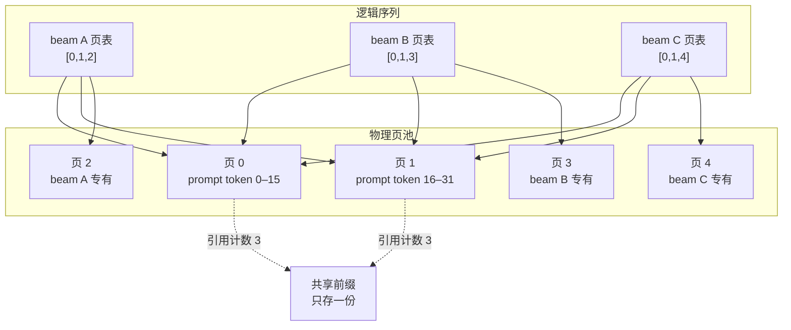
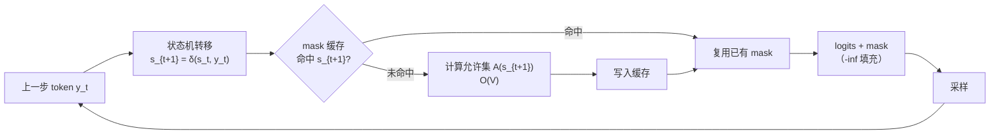
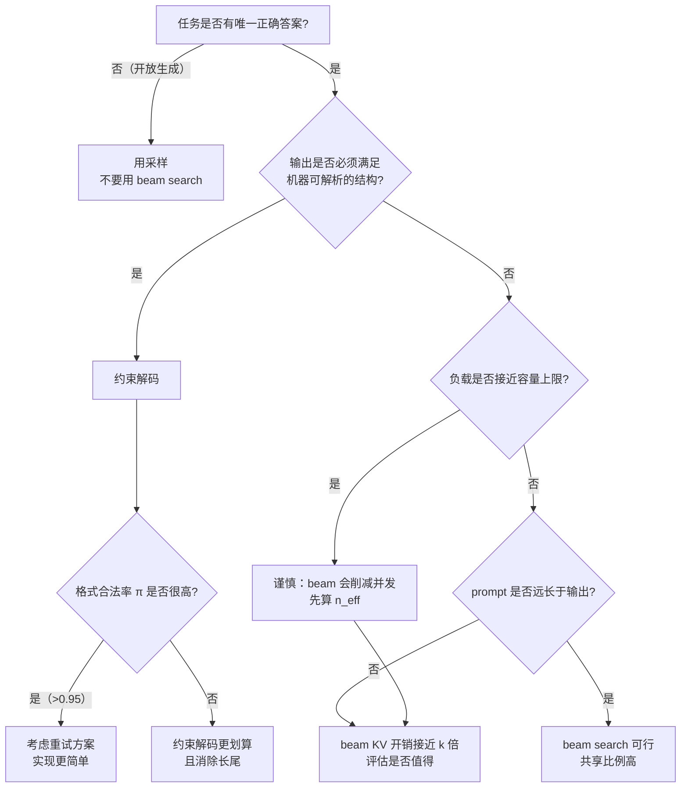

# 束搜索与约束解码

> 位置：[InferenceAtlas](../../INDEX.md) > [模块 05](README.md) > 当前文档
> 信息截至：2026-07-29 ｜ 最后核验：2026-07-29 ｜ 内容版本：v0.1
> 时效性等级：低
> 相关主题：[采样参数](02_greedy_sampling_topk_topp_temperature.md)｜`09_structured_output_and_grammar_constrained_decoding.md`｜[KV cache 管理](../03_serving_engines_and_scheduling/03_pagedattention_and_kv_memory_management.md)

## 本章导读

束搜索（beam search）与约束解码（constrained decoding）是两类**改变解码搜索空间形状**的技术。前者把单条序列扩展为多条并行假设，后者把可选 token 集合从整个词表收缩到语法允许的子集。

它们在系统上的共同点是：**都打破了"一个请求对应一条 KV 序列"这个使批处理与内存管理得以简化的基本假设**。束搜索让一个请求同时持有 $k$ 条部分共享的 KV 序列；约束解码则在每一步引入一次与词表同宽的 mask 计算，且这个 mask 依赖于该请求的私有状态机。

因此本章不只讨论算法，更关注它们对内存管理、批处理效率与调度公平性的冲击。一个在离线脚本里工作良好的 beam search，放进在线服务后可能把有效批容量削减到原来的 $1/k$——这是很多团队在生产中放弃 beam search 的直接原因。

## 学习目标

读完本章后，读者应能够：

1. 写出束搜索的评分函数与长度归一化形式，并说明为何需要长度惩罚；
2. 量化束搜索对 KV cache 占用与有效批容量的影响；
3. 解释 beam 的分叉/剪枝为何天然适合分页 KV 与写时复制；
4. 描述约束解码的两层结构（状态机推进 + logit mask）及其每步开销来源；
5. 判断某个业务场景应选择 beam search、采样、还是约束解码。

## 核心结论

- **束搜索用 $k$ 倍的 KV 与计算换取更高的序列级评分**，它优化的是模型自身的对数似然，不必然等于人类偏好的质量。
- **束搜索最大的系统代价不是计算而是 KV**：$k$ 条假设意味着同一请求占用约 $k$ 倍 KV 页，直接压缩并发请求数。
- **分页 KV 与写时复制让 beam 的共享前缀几乎免费**——这是 beam search 在现代引擎中仍可实现的技术前提。
- **约束解码的开销与词表大小成正比且每步发生**，且 mask 计算依赖请求私有状态，难以跨请求批处理，是典型的"小算子拖慢大系统"。
- **约束解码不改变模型，只改变支撑集**；它保证格式合法，不保证语义正确。

## 1. 问题定义、系统边界与工作负载

### 1.1 从"逐 token 最优"到"序列最优"

贪心解码在每一步取局部最优，但局部最优的连乘不等于全局最优。设序列 $y = (y_1, \dots, y_L)$，模型给出

$$
\log P(y \mid x) = \sum_{t=1}^{L} \log P(y_t \mid y_{<t}, x)
$$

贪心解码求的是逐项 $\arg\max$，而非整条序列的 $\arg\max$。束搜索是对后者的近似搜索：维持 $k$ 条最优部分序列（beam），每步扩展并剪枝。

**它解决什么**：在输出空间高度结构化、且"最可能的序列"确实是目标的任务上（机器翻译、语法纠错、受限格式生成），束搜索能带来可测量的评分提升。

**它不解决什么**：在开放式生成上，最大化对数似然会系统性地偏向短、通用、重复的输出。这是束搜索在对话与创作场景中被采样取代的根本原因——不是它慢，而是它优化了错误的目标。

### 1.2 约束解码要解决的问题

当输出必须满足外部结构（合法 JSON、给定 schema、可解析的函数调用），有三条路：

| 方案 | 保证强度 | 系统代价 | 失败模式 |
|---|---|---|---|
| 提示词要求格式 | 无保证 | 零 | 偶发不合法，需重试 |
| 生成后校验 + 重试 | 概率保证 | 重试成本，时延方差大 | 长尾时延爆炸 |
| 约束解码 | 硬保证 | 每步 mask 开销 | 可能"格式对但内容空" |

**约束解码的定位**：它把"格式合法"从概率事件变成确定性事件，代价是每步的 mask 计算与状态机维护。当下游解析器不能容忍失败时，这个代价通常是值得的——因为重试的期望成本可能远高于 mask 开销。

### 1.3 系统边界

两项技术都发生在解码环节，都不修改模型权重。但它们对系统的侵入深度不同：

| 维度 | 束搜索 | 约束解码 |
|---|---|---|
| 是否改变 KV 结构 | 是（$k$ 条序列，含分叉） | 否 |
| 是否改变每步计算量 | 是（batch 维乘 $k$） | 否（只加 mask） |
| 是否引入请求私有状态 | 是（beam 状态） | 是（状态机位置） |
| 是否影响输出分布 | 是（改变选择规则） | 是（截断支撑集） |
| 是否可与投机解码组合 | 复杂 | 复杂（见第 4 节） |

## 2. 原理、数学与性能模型

### 2.1 束搜索的评分与长度归一化

朴素评分为累积对数概率：

$$
S(y_{1:t}) = \sum_{i=1}^{t} \log P(y_i \mid y_{<i}, x)
$$

- $S$：序列得分，单位为 nats（自然对数）或 bits（以 2 为底）；
- 每一项 $\log P \le 0$，因此 $S$ 单调不增。

**问题**：$S$ 随长度单调下降，因此束搜索天然偏好短序列。长度归一化引入惩罚项：

$$
S_{\text{norm}}(y_{1:t}) = \frac{S(y_{1:t})}{\mathrm{lp}(t)}, \qquad \mathrm{lp}(t) = \left( \frac{c + t}{c + 1} \right)^{\alpha}
$$

- $t$：当前长度，单位 token；
- $\alpha$：长度惩罚指数，无量纲。$\alpha = 0$ 无惩罚；$\alpha = 1$ 近似平均对数概率；$\alpha > 1$ 偏好更长序列；
- $c$：平滑常数，无量纲，避免短序列时分母剧烈变化。

**直觉**：$\mathrm{lp}(t)$ 把"总分"折算为"每 token 平均分"的一个族。$\alpha$ 调节归一化强度。

**假设与局限**：
- 该形式是启发式的，没有从概率模型推导出来；$\alpha$ 必须按任务经验确定；
- 归一化改变了不同长度候选之间的相对顺序，因此 $\alpha$ 的变化可能显著改变输出长度分布——这与第 2 章讨论的容量规划关切直接相连；
- 在极端 $\alpha$ 下，束搜索会退化为"总是选最长"或"总是选最短"。

### 2.2 束搜索的一步

设当前有 $k$ 条 beam，词表大小 $V$：

1. 对每条 beam 做一次前向，得到 $k \times V$ 个扩展候选；
2. 对每个候选计算 $S_{\text{norm}}$；
3. 从 $kV$ 个候选中取 top-$k$（跨 beam 的全局 top-$k$，不是每条 beam 各取 1）；
4. 已完成（生成 EOS）的候选移入完成集，beam 数量相应补足或缩减。

**关键点**：第 3 步是**跨 beam 的全局选择**。这意味着一条 beam 可能分裂出多个后继，而另一条 beam 可能完全消失。这个"分叉与死亡"的模式正是 KV 管理的难点。

### 2.3 束搜索的资源模型

**计算**：每步的批维度从 $B$ 变为 $B \cdot k$。对于 decode 阶段（内存带宽受限），时间近似

$$
T_{\text{step}}(k) \approx \max\left( \frac{W}{\text{BW}},\ \frac{2 \cdot P \cdot B \cdot k}{\text{FLOPS}} \right)
$$

- $W$：模型权重字节数（B）；$\text{BW}$：有效内存带宽（B/s）；
- $P$：模型参数量；$\text{FLOPS}$：有效算力（FLOP/s）；
- **直觉**：在权重读取主导的区间（小 $B \cdot k$），增大 $k$ 几乎不增加时间——beam 的额外计算"搭了权重读取的便车"；一旦 $B \cdot k$ 越过 roofline 拐点，时间开始线性增长。
- **局限**：忽略了 attention 部分（其计算随 KV 长度增长），也忽略了 top-$k$ 选择本身的开销。

这解释了一个反直觉的现象：**在小批量下，$k=4$ 的束搜索可能只比 $k=1$ 慢很少**。真正的代价在别处。

**KV 内存**：这是束搜索的真实瓶颈。若不共享，$k$ 条 beam 各持一份完整 KV：

$$
M_{\text{KV}}^{\text{beam}} \approx k \cdot M_{\text{KV}}^{\text{single}} = k \cdot 2 L B S H_{kv} D_h b_{kv}
$$

各符号含义见 [模块 02 第 5 章](../02_transformer_and_kv_cache/05_kv_cache_capacity_and_memory_models.md)。

**有效批容量的削减**：设 KV 预算为 $M_{\text{budget}}$，单序列每 token 占用 $m_{\text{tok}}$，则可并发的请求数

$$
B_{\max} \approx \frac{M_{\text{budget}}}{k \cdot S \cdot m_{\text{tok}}}
$$

**$k=4$ 直接把并发请求数削到约 $1/4$**（在无共享的情况下）。由于吞吐大致正比于并发数，束搜索的吞吐代价主要来自这里，而非计算。

### 2.4 共享前缀带来的实际占用

$k$ 条 beam 并非完全不同——它们共享一个公共前缀，只在分叉点之后分离。设分叉发生在位置 $d$（distinct 起点），实际占用约

$$
M_{\text{KV}}^{\text{shared}} \approx \left( d + k \cdot (S - d) \right) \cdot m_{\text{tok}}
$$

- $d$：共享前缀长度（token）；$S$：当前总长度（token）；
- **直觉**：共享前缀只算一份，分叉后的部分才乘 $k$。
- **局限**：这假设分叉点唯一。实际 beam 树的分叉是多层的，精确占用需按树结构统计；该式是保守上界的一个改良近似。

**关键推论**：在长 prompt + 短输出的场景（$d \approx S$），共享让束搜索的 KV 开销接近 $k=1$；在短 prompt + 长输出的场景（$d \ll S$），开销接近 $k$ 倍。**束搜索的可行性因此高度依赖输入输出长度比**。

| 场景 | prompt 长度 | 输出长度 | 共享比例 | 束搜索 KV 开销 |
|---|---|---|---|---|
| 长文摘要 | 长 | 短 | 高 | 接近 $1\times$ |
| 翻译 | 中 | 中 | 中 | 约 $k/2 \times$ |
| 开放生成 | 短 | 长 | 低 | 接近 $k \times$ |
| RAG 问答 | 很长 | 短 | 很高 | 接近 $1\times$ |

### 2.5 约束解码的数学形式

约束解码在每一步维护一个状态机状态 $s_t$，并据此计算允许集合 $A(s_t) \subseteq \{1, \dots, V\}$。

$$
\tilde{z}_i = \begin{cases} z_i & i \in A(s_t) \\ -\infty & \text{否则} \end{cases}
$$

采样在 $\tilde{z}$ 上进行。状态转移 $s_{t+1} = \delta(s_t, y_t)$。

**性质**：
- 若 $A(s_t) \ne \emptyset$ 对所有可达状态成立，则生成的序列必然被状态机接受——**格式合法性是硬保证**；
- 该操作只重分配概率质量，不引入模型未预测的 token；
- 它**改变了输出分布**：合法 token 的相对概率被保留，但整体分布被条件化到合法集合上。

**开销模型**：每步开销

$$
c_{\text{constrain}} = c_{\delta} + c_{\text{mask}}
$$

- $c_{\delta}$：状态转移成本，通常 $O(1)$（查表）；
- $c_{\text{mask}}$：构造并应用 mask 的成本，$O(V)$ 每请求，$O(BV)$ 每批；
- **直觉**：转移很便宜，mask 很贵，因为它与词表同宽。
- **局限**：若 mask 可缓存（同一状态复用），$c_{\text{mask}}$ 可摊销为接近零；这正是实现优化的主战场。

**为什么难批处理**：不同请求处于不同状态机状态，mask 各不相同。这意味着 mask 是形状 $[B, V]$ 的稠密张量，且每步都可能变化。它无法像模型权重那样被所有请求共享。

## 3. 实现机制与系统设计

### 3.1 束搜索与分页 KV 的天然契合

束搜索的 KV 访问模式与分页 KV cache（见 [模块 03 第 3 章](../03_serving_engines_and_scheduling/03_pagedattention_and_kv_memory_management.md)）高度匹配：



**图解读**：
1. **本图展示什么**：三条 beam 通过各自页表引用同一组共享前缀物理页，只有分叉后的内容占用私有页。
2. **核心瓶颈**：瓶颈从"KV 内存总量"转移到"页表管理与引用计数的正确性"——尤其是 beam 死亡时的页回收，漏回收会造成内存泄漏，早回收会造成数据损坏。
3. **图中的 trade-off**：共享节省了内存，但引入了写时复制的复杂度：当一条 beam 需要写入一个引用计数大于 1 的页时，必须先复制该页，这带来一次不可预测的内存分配与拷贝。
4. **面试如何引用**：被问"beam search 在生产中为什么可行/不可行"时，用这张图说明分页 KV 是使其可行的前提，然后指出真正的限制在分叉后的私有页数量随输出长度线性增长。

**写时复制的必要性**：beam 之间共享的页是只读的。当某条 beam 生成新 token 需要写入一个共享页的剩余槽位时，必须触发复制。实现要点：

| 操作 | 条件 | 动作 |
|---|---|---|
| 追加 token | 目标页引用计数 = 1 | 直接写入 |
| 追加 token | 目标页引用计数 > 1 | 复制该页，更新本 beam 页表，原页引用计数减一 |
| beam 死亡 | — | 页表中所有页引用计数减一，归零则回收 |
| beam 分裂 | — | 新 beam 复制页表（不复制页），所有页引用计数加一 |

### 3.2 束搜索的伪代码

```
function beam_search(prompt, k, max_len, alpha):
    beams = [ Beam(tokens=prompt, score=0.0, pages=alloc(prompt)) ]
    finished = []

    for t in 1..max_len:
        if beams is empty: break

        # 单次批量前向：批维为当前 beam 数
        logits = model_forward(beams)          # [len(beams), V]
        logprobs = log_softmax(logits)

        # 生成全部候选（跨 beam）
        candidates = []
        for b in beams:
            for token_id in top_n(logprobs[b], n=2*k):   # 剪枝：每 beam 只看 2k 个
                new_score = b.score + logprobs[b][token_id]
                candidates.append( (b, token_id, new_score) )

        # 全局排序，按长度归一化分数
        candidates.sort(key = lambda c: c.new_score / lp(t, alpha), desc=True)

        new_beams = []
        for (parent, token_id, score) in candidates:
            if len(new_beams) + len(finished) >= k: break
            if token_id == EOS:
                finished.append( parent.extend(token_id, score) )
            else:
                child = parent.fork()            # 复制页表，引用计数 +1
                child.append(token_id, score)    # 触发必要的写时复制
                new_beams.append(child)

        release_unreferenced(beams, new_beams)   # 死亡 beam 的页回收
        beams = new_beams

    return best_by_normalized_score(finished + beams, alpha)
```

**实现要点**：
1. **每 beam 只取 top-$2k$**：因为最终只需 $k$ 个后继，取 $2k$ 足以覆盖（考虑 EOS 占用名额）。这把候选集从 $kV$ 降到 $2k^2$，使排序开销可忽略。
2. **`fork()` 复制页表而非页**：这是共享的实现点。
3. **`release_unreferenced` 必须在替换 beams 之前完成引用计数更新**，否则会误回收仍被新 beam 引用的页。
4. **完成的 beam 占用名额**：一旦有 beam 完成，活跃 beam 数减少，后续步骤的批维随之缩小——这使 beam search 的计算量随步数递减。

### 3.3 约束解码的两层结构



**图解读**：
1. **本图展示什么**：约束解码的闭环——状态转移、mask 获取（带缓存）、logit 掩码、采样，再回到状态转移。
2. **核心瓶颈**：瓶颈在"未命中"分支的 $O(V)$ 允许集计算。缓存命中率决定了约束解码是"几乎免费"还是"每步都贵"，而命中率取决于状态空间的大小与访问局部性。
3. **图中的 trade-off**：缓存用内存换时间。JSON schema 这类状态数有限的语法缓存效果好；而带有大量字面量分支的复杂语法可能状态爆炸，缓存失效。
4. **面试如何引用**：被问"约束解码的开销在哪"时，用这张图指出开销不在状态机（$O(1)$）而在 mask 构造（$O(V)$），并说明缓存是关键优化，且缓存效果依赖语法结构。

**状态机的来源**：
| 约束类型 | 状态机 | 状态数量 |
|---|---|---|
| 固定枚举（如"是/否"） | 前缀树 | 很少 |
| JSON 语法 | 下推自动机（栈） | 中等，但含栈状态 |
| JSON schema | 语法 + 类型检查 | 依 schema 复杂度 |
| 正则表达式 | DFA | 依表达式，可能爆炸 |
| 上下文无关文法 | Earley/LR 状态 | 大 |

**token 化与语法的错位**：这是约束解码最深的实现坑。语法定义在**字符**层面，而解码发生在 **token** 层面。一个 token 可能横跨语法的多个终结符边界（例如 token `":"` 同时包含引号与冒号）。因此必须预先计算"每个 token 在每个状态下是否合法"，这是一个 $|S| \times V$ 的表，构建代价可能很高。

详细讨论见 `09_structured_output_and_grammar_constrained_decoding.md`。

### 3.4 与调度器的交互

两项技术都给调度器带来非平凡的约束：

| 技术 | 调度影响 | 应对 |
|---|---|---|
| 束搜索 | 单请求占 $k$ 个批槽位与 $k$ 倍 KV | 准入控制时按 $k$ 计价，而非按请求计数 |
| 束搜索 | 活跃 beam 数随步数变化 | 批组装必须支持动态槽位数 |
| 约束解码 | 每请求私有 mask 状态 | 抢占时必须保存/恢复状态机位置 |
| 约束解码 | mask 构造可能阻塞 | 移出关键路径，异步预构造 |

**准入控制的正确计价**：如果准入控制把一个 $k=4$ 的 beam search 请求算作"一个请求"，它会严重高估可用容量。正确做法是把资源占用折算为等效请求数：

$$
n_{\text{eff}} = 1 + (k-1) \cdot \frac{S - d}{S}
$$

- $d$：预期共享前缀长度；$S$：预期总长度。
- **直觉**：完全共享时 $n_{\text{eff}} = 1$，完全不共享时 $n_{\text{eff}} = k$。
- **局限**：$d$ 在准入时未知，只能用历史统计估计；估计偏低会导致过度准入。

## 4. 性能、成本、能耗与可靠性 trade-off

### 4.1 束搜索的代价结构

| 维度 | 相对 $k=1$ 的倍率 | 说明 |
|---|---|---|
| 每步 FLOPs | $\approx k$ | 但在带宽受限区可能不体现为时间 |
| 每步时间（小批） | $\approx 1$ | 权重读取主导，beam 搭便车 |
| 每步时间（大批） | $\approx k$ | 越过 roofline 拐点后线性 |
| KV 内存 | $1 \sim k$ | 依共享比例，见 2.4 |
| 有效并发数 | $1/n_{\text{eff}}$ | 直接决定吞吐损失 |
| 能耗/token | $\ge 1$ | 计算与内存都增加 |

**核心洞察**：束搜索**在低负载时几乎免费，在高负载时代价极高**。这使它成为一个典型的"压测时才暴露问题"的特性——开发环境的单请求测试完全无法预示生产表现。

### 4.2 束搜索 vs 采样的目标错配

| 指标 | 束搜索 | 采样 |
|---|---|---|
| 优化目标 | 序列对数似然 | 从模型分布中抽样 |
| 输出多样性 | 低（$k$ 条常高度相似） | 高 |
| 与人类偏好的对齐 | 间接 | 间接 |
| 在开放式任务上 | 倾向短、通用、重复 | 更自然 |
| 在结构化任务上 | 通常更好 | 需要更多重试 |
| 可复现性 | 与 greedy 同样受数值影响 | 可 seed 控制 |

> **判据**：如果任务有唯一正确答案且模型的似然与正确性相关（翻译、纠错、格式转换），束搜索值得考虑。如果任务是开放式的，束搜索优化的目标本身就是错的，再多的 $k$ 也不会改善。

### 4.3 约束解码的代价结构

| 维度 | 影响 | 量级 |
|---|---|---|
| 每步额外计算 | mask 应用 $O(BV)$ | 与采样管线同量级 |
| mask 构造 | 缓存未命中时 $O(V)$ 或更高 | 依语法 |
| 预处理 | token-状态兼容表构建 | 一次性，可能很重 |
| 内存 | mask 缓存 + 兼容表 | 依状态数 × 词表 |
| 时延方差 | 缓存命中率波动 | 可能显著 |

**与重试方案的对比**：设无约束下格式合法率为 $\pi$，则重试方案的期望生成次数为 $1/\pi$，期望成本约 $C/\pi$。约束解码的成本约 $C \cdot (1 + \epsilon)$，其中 $\epsilon$ 是每步 mask 开销占比。

$$
\text{约束解码更优} \iff 1 + \epsilon < \frac{1}{\pi} \iff \pi < \frac{1}{1+\epsilon}
$$

- **直觉**：只要合法率不是极高，约束解码就更划算；而且它消除了长尾（重试方案的 P99 由多次重试主导）。
- **局限**：该式忽略了预处理成本与实现复杂度；对于只偶尔使用约束的服务，摊销可能不成立。

### 4.4 与投机解码的组合难度

| 组合 | 难点 |
|---|---|
| 束搜索 + 投机 | 需要对 $k$ 条 beam 同时投机；接受判定需在 beam 选择之后，破坏了原有的分布不变性证明 |
| 约束解码 + 投机 | draft 模型必须遵守同一约束，否则提议的 token 大量被 mask 掉，接受率崩塌 |

**约束 + 投机的可行做法**：把约束 mask 同时应用于 draft 与 target 的分布，然后在**掩码后的分布**上做标准的接受判定。这保持了"输出等价于在约束下从 target 分布采样"这一性质。代价是 draft 模型每步也要付 mask 开销。

（投机解码的分布不变性推导见 [投机解码](04_speculative_decoding.md) 第 2 节。）

## 5. benchmark、真实案例或公开部署案例

当前环境的网络出口策略阻断了 `arxiv.org`、`huggingface.co`、`usenix.org` 等一手来源（详见 [AGENTS.md 第 11 节](../../AGENTS.md)），因此本节不引用任何未经一手核验的具体性能数字。以下为可确认的定性事实与可自行复现的实验设计。

| 陈述 | 披露标签 | 状态 |
|---|---|---|
| 多个主流开源推理引擎实现了 beam search | `开源代码/配置披露` | `待核实`（需补源码链接与版本） |
| 部分引擎的分页 KV 实现支持 beam 的写时复制 | `开源代码/配置披露` | `待核实` |
| 多个开源库提供基于 DFA/CFG 的约束解码 | `开源代码/配置披露` | `待核实` |
| 商用 API 普遍提供某种形式的结构化输出保证 | `可信第三方估计` | `待核实` |

**可自行复现的实验**（`独立可复现实验`）：

1. **beam 的吞吐悬崖实验**：固定 prompt 集合，在 $k \in \{1,2,4,8\}$ 下分别测量单请求时延与满负载吞吐。预期观察：单请求时延几乎不变，而满负载吞吐随 $k$ 大幅下降。这直接验证 4.1 的"低负载免费、高负载昂贵"。
2. **共享比例实验**：构造两组请求——长 prompt/短输出与短 prompt/长输出，在相同 $k$ 下测量峰值 KV 页数。验证 2.4 的共享比例分析。
3. **长度惩罚实验**：扫描 $\alpha \in \{0, 0.6, 1.0, 1.5\}$，记录输出长度分布与任务指标。观察 $\alpha$ 对长度的单调影响。
4. **约束 mask 缓存命中率实验**：对一个固定 JSON schema，统计每步 mask 缓存命中率随生成进程的变化。预期在重复结构处命中率高，在自由文本字段处低。
5. **约束 vs 重试的成本对比**：测量无约束下的格式合法率 $\pi$ 与约束解码的每步开销 $\epsilon$，代入 4.3 的判据，再用实测总成本验证。

> 实验方法论要求见 [如何读推理 benchmark](../00_start_here/03_how_to_read_inference_benchmarks.md)。

## 6. 设计决策框架



**图解读**：
1. **本图展示什么**：从任务性质出发，在采样、束搜索、约束解码、重试四条路径之间做选择。
2. **核心瓶颈**：瓶颈判断点是"负载是否接近容量上限"与"prompt 是否远长于输出"这两个系统性问题——它们决定了 beam search 的真实代价，而这两个问题与算法质量无关。
3. **图中的 trade-off**：左侧分支（采样）放弃了序列级最优以换取吞吐；右下（约束解码）用每步固定开销换取硬保证；右上（重试）用时延方差换实现简单。
4. **面试如何引用**：被问"什么时候用 beam search"时，用这张图给出结构化答案，重点强调"任务目标匹配"先于"性能评估"，避免直接跳到性能讨论。

### 决策清单

| 问题 | 若答案为"是" | 若答案为"否" |
|---|---|---|
| 模型似然与任务正确性相关？ | beam search 可能有效 | beam search 优化错误目标 |
| 下游解析器能容忍失败？ | 可用提示词 + 重试 | 需要约束解码 |
| 系统运行在高负载区？ | beam 的并发削减不可接受 | 可考虑 |
| KV 预算紧张？ | 优先评估 $n_{\text{eff}}$ | 空间较大 |
| 语法状态数是否有限？ | mask 缓存有效 | 评估状态爆炸风险 |
| 是否同时启用投机解码？ | 需要联合设计（4.4） | 独立评估 |

## 7. 常见失败模式与排查路径

| 症状 | 可能原因 | 排查步骤 |
|---|---|---|
| 启用 beam 后吞吐骤降但单请求时延不变 | KV 占用挤压并发（2.3） | 统计峰值 KV 页数与活跃请求数；对比 $k=1$ |
| beam 输出全部高度相似 | 束搜索固有性质，非 bug | 若需多样性，改用采样或 diverse beam 变体 |
| beam 输出总是很短 | 长度惩罚 $\alpha$ 过小 | 提高 $\alpha$，观察长度分布 |
| beam 内存泄漏 | 死亡 beam 的页未回收 | 检查引用计数在 beam 替换前后的一致性；加断言：总引用数 = 各页表长度之和 |
| beam 输出损坏/串行 | 写时复制缺失 | 检查写入前是否验证引用计数；构造两条 beam 写同一页的测试 |
| 约束解码后输出为空或立即结束 | 允许集在某状态为空 | 打印每步的 $|A(s_t)|$；定位首个为 0 的位置 |
| 约束解码时延抖动大 | mask 缓存命中率低 | 统计命中率；检查状态空间大小 |
| 约束下格式合法但内容无意义 | 约束只保证语法不保证语义 | 需要在 schema 层加语义约束，或加后置校验 |
| 约束 + 投机后接受率崩塌 | draft 未应用同一约束（4.4） | 在 draft 侧也应用 mask，重测接受率 |
| 抢占恢复后约束状态错乱 | 状态机位置未持久化 | 把 $s_t$ 纳入请求的持久状态 |

**排查原则**：beam search 的问题几乎总在**内存与引用计数**，约束解码的问题几乎总在 **token 与语法的边界错位**或**允许集为空**。先看这两处，再看别的。

## 8. 关联面试主题

1. **束搜索的评分函数与长度归一化为什么必要**——见本章 2.1，关键是对数概率随长度单调下降。
2. **束搜索为什么在生产服务中很少启用**——见本章 2.3 与 4.1，答案是 KV 削减并发，而非计算慢。
3. **分页 KV 与写时复制如何支撑 beam search**——见本章 3.1，与 [PagedAttention](../03_serving_engines_and_scheduling/03_pagedattention_and_kv_memory_management.md) 联动。
4. **约束解码的开销来自哪里**——见本章 2.5 与 3.3，$O(V)$ 的 mask 构造与请求私有状态。
5. **约束解码 vs 生成后重试的成本判据**——见本章 4.3。
6. **token 化与语法边界错位问题**——见本章 3.3，是约束解码最深的实现难点。
7. **束搜索/约束解码与投机解码的组合难点**——见本章 4.4。
8. **准入控制如何为 beam search 请求正确计价**——见本章 3.4 的 $n_{\text{eff}}$。

## 9. 小结

束搜索与约束解码都以"改变搜索空间"的方式介入解码，但它们的系统画像截然不同：

**束搜索**的代价集中在 **KV 内存**。它在计算上常常"搭权重读取的便车"而几乎免费，却通过 $k$ 倍的 KV 占用直接削减并发请求数。共享前缀与写时复制能大幅缓解这一点，缓解程度取决于 prompt 与输出的长度比。它的适用性首先由**任务目标是否与对数似然对齐**决定，其次才是性能——在开放式生成上，它优化的目标本身就不对。

**约束解码**的代价集中在**每步的 $O(V)$ mask**与**请求私有的状态机**。它提供的是格式合法性的硬保证，与"生成后重试"相比在合法率不高时明显更划算，且消除了重试带来的长尾。它最深的实现难点是 token 边界与语法边界的错位，需要预先构建 token-状态兼容表。

两者与投机解码的组合都需要谨慎的联合设计：约束必须同时施加于 draft 与 target，否则接受率崩塌。

## 关键术语

| 中文术语 | 英文 | 定义 | 单位/口径 | 关联文档 |
|---|---|---|---|---|
| 束搜索 | beam search | 维持 $k$ 条最优部分序列的近似搜索解码 | 束宽 $k$ 为计数 | 本章 2.1 |
| 束宽 | beam width | 同时保留的假设数量 | 计数 | 本章 2.2 |
| 长度惩罚 | length penalty | 对累积对数概率按长度归一化的启发式 | 指数 $\alpha$ 无量纲 | 本章 2.1 |
| 写时复制 | copy-on-write | 共享页在写入前才复制的机制 | — | 本章 3.1 |
| 引用计数 | reference count | 记录物理页被多少逻辑序列引用 | 计数 | 本章 3.1 |
| 约束解码 | constrained decoding | 按状态机限制每步允许 token 集合的解码 | — | 本章 2.5 |
| 允许集 | allowed set | 当前状态下语法允许的 token 集合 | 集合 | 本章 2.5 |
| logit 掩码 | logit mask | 把非法 token 的 logit 置为负无穷的操作 | — | 本章 2.5 |
| 等效请求数 | effective request count | 束搜索请求折算的资源占用当量 | 计数 | 本章 3.4 |

## 延伸阅读

- [采样参数](02_greedy_sampling_topk_topp_temperature.md) — 分布变换的基础与顺序问题
- [投机解码](04_speculative_decoding.md) — 与本章技术组合时的分布不变性要求
- `09_structured_output_and_grammar_constrained_decoding.md` — 约束解码的完整展开
- [PagedAttention 与 KV 内存管理](../03_serving_engines_and_scheduling/03_pagedattention_and_kv_memory_management.md) — 共享与写时复制的系统基础
- [KV cache 容量与内存模型](../02_transformer_and_kv_cache/05_kv_cache_capacity_and_memory_models.md) — $m_{\text{tok}}$ 的推导
- [请求调度与准入控制](../03_serving_engines_and_scheduling/04_request_scheduling_and_admission_control.md) — 为 beam 请求正确计价

## 主要来源

本章以数学推导与系统机制分析为主。涉及具体框架实现的陈述已在第 5 节标注为 `待核实`，原因是当前环境无法访问所需的一手来源（详见 [AGENTS.md 第 11 节](../../AGENTS.md)）。

| 类别 | 说明 | 披露标签 |
|---|---|---|
| 束搜索评分与长度归一化 | 标准算法定义，本库给出自洽形式 | — |
| 分页 KV 与写时复制机制 | 机制描述，与模块 03 保持一致 | — |
| 约束解码的状态机形式 | 标准自动机理论，本库给出自洽形式 | — |
| 各框架的具体实现与性能数字 | 需一手核验 | `待核实` |

## 更新记录

| 日期 | 版本 | 变更 | 核验人 |
|---|---|---|---|
| 2026-07-29 | v0.1 | 初稿：束搜索的资源模型与共享分析、约束解码的两层结构与成本判据 | — |
