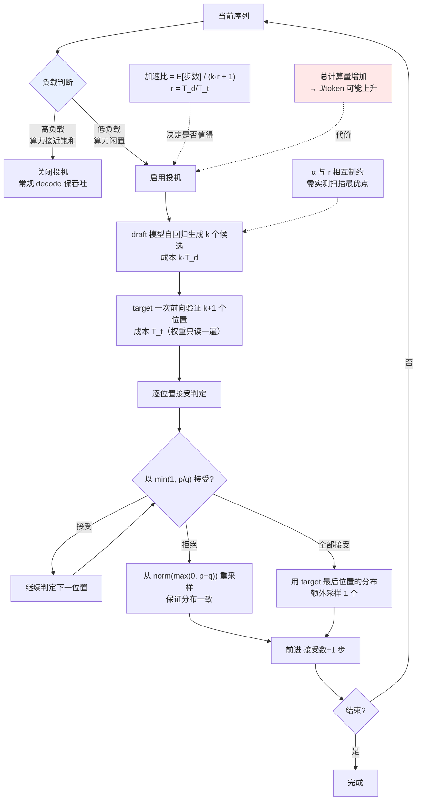

# 投机解码

> 位置：[InferenceAtlas](../../INDEX.md) > [模块 05](README.md) > 当前文档
> 信息截至：2026-07-29 ｜ 最后核验：2026-07-29 ｜ 内容版本：v0.1
> 时效性等级：低
> 相关主题：[解码基础](01_decoding_basics.md)｜[带宽分析](../01_foundations_and_metrics/05_memory_bandwidth_and_arithmetic_intensity.md)｜[批处理](../03_serving_engines_and_scheduling/02_static_dynamic_and_continuous_batching.md)

## 本章导读

投机解码是少数能**在不改变输出分布的前提下降低时延**的技术。它的核心洞察建立在 [模块 01 第 5 章](../01_foundations_and_metrics/05_memory_bandwidth_and_arithmetic_intensity.md) 的带宽分析之上：decode 阶段每生成一个 token 都要把权重完整读一遍，而这次读取**本可以顺便验证多个 token**——算力是闲置的，带宽才是瓶颈。

于是：让一个便宜的 draft 模型先猜几个 token，再让 target 模型一次前向并行验证这几个位置。猜对了就一次前进多步，猜错了就从错的地方重来。通过一个精心设计的接受规则，最终输出分布与直接从 target 采样**完全一致**。

但它的收益条件比多数介绍中说的更苛刻。本章的重点是把这些条件说清楚：**什么时候有效、什么时候无效、以及为什么在大 batch 下收益会消失**。

## 学习目标

读完本章后，读者应能够：

1. 说明 draft-verify 机制以及它为何能保持输出分布不变；
2. 写出期望加速比公式并识别其中每一项的来源；
3. 解释为什么大 batch 下收益会显著缩小甚至为负；
4. 判断一个具体部署是否会从投机解码中受益。

## 核心结论

- **收益来源是摊薄权重读取**：一次前向验证 $k$ 个位置，权重只读一遍。这在 memory-bound 时有效，在算力饱和时无效。
- **期望加速比由接受率 $\alpha$ 与 draft 开销共同决定**，二者相互制约——更强的 draft 提高 $\alpha$ 但也更贵。
- **大 batch 下收益缩小**：批处理本身已经摊薄了权重读取，投机解码的边际收益随之下降，而它增加的计算量代价不变。
- **它降低时延但增加总计算量**，因此**可能恶化 J/token 与吞吐**——这是一个需要显式权衡的取舍，不是纯粹的改善。

## 1. 问题定义、系统边界与工作负载

### 1.1 机制

| 步骤 | 动作 |
|---|---|
| 1 | draft 模型自回归生成 $k$ 个候选 token |
| 2 | target 模型对这 $k+1$ 个位置**一次前向**，得到每个位置的分布 |
| 3 | 按接受规则逐位置判定，接受一个前缀 |
| 4 | 在第一个被拒绝的位置**重采样**一个 token |
| 5 | 前进（接受数 + 1）个 token，回到步骤 1 |

**关键点**：步骤 2 的一次前向覆盖了 $k+1$ 个位置。由于 decode 是 memory-bound，这次前向的耗时**接近于**只处理一个位置的耗时——**这就是全部收益的来源**。

**为什么是 $k+1$**：即使 $k$ 个提议全被接受，target 在最后一个位置的分布也可以直接用于采样下一个 token，因此最好情况下一轮前进 $k+1$ 步。

### 1.2 分布不变性

朴素做法（接受 draft 的 token 若 target 也认为它概率高）会**改变输出分布**。正确的接受规则采用修改的拒绝采样：

设 draft 在某位置给出分布 $q$，target 给出 $p$，draft 采样得到 token $x$。则：

- 以概率 $\min\left(1, \dfrac{p(x)}{q(x)}\right)$ **接受** $x$；
- 否则**拒绝**，并从修正分布 $\text{norm}(\max(0,\ p - q))$ 中重采样。

**为什么这保证分布一致**：这是拒绝采样的标准构造。接受的部分与拒绝后重采样的部分合起来，恰好构成从 $p$ 中采样。因此**最终输出的分布与直接从 target 采样完全相同**。

**实践含义**：**采用投机解码不需要做质量评测**——这一点与量化根本不同。它属于 [模块 04 第 8 章](../04_compilers_runtimes_and_kernels/08_flashattention_and_memory_efficient_attention.md) 讨论的"精确等价优化"类别。

**一个重要限定**：分布一致是**逐 token 的分布一致**，在浮点实现中仍会有舍入差异；且若 draft 与 target 使用不同的采样参数（温度等），一致性不成立。**实现时必须让二者的分布变换一致。**

## 2. 原理、数学与性能模型

### 2.1 期望前进步数

设每个位置的接受概率为 $\alpha$（各位置独立近似），提议长度 $k$。则一轮中被接受的 token 数是一个截断几何分布，期望前进步数：

$$
E[\text{步数}] = \frac{1 - \alpha^{k+1}}{1 - \alpha}
$$

**验证极限**：$\alpha \to 0$ 时趋近 1（全被拒，只靠重采样前进 1 步）；$\alpha \to 1$ 时趋近 $k+1$（全接受）。

**数值示例**（$k=4$）：

| $\alpha$ | $E[\text{步数}]$ |
|---:|---:|
| 0.5 | 1.94 |
| 0.6 | 2.18 |
| 0.7 | 2.53 |
| 0.8 | 3.01 |
| 0.9 | 3.69 |

**观察**：接受率对期望步数的影响是**非线性且陡峭**的。$\alpha$ 从 0.7 提到 0.8，期望步数提升约 19%。**因此接受率是投机解码工程的核心指标。**

### 2.2 期望加速比

设 target 一次前向耗时 $T_t$，draft 一次前向耗时 $T_d$。一轮的总耗时约为：

$$
T_{\text{round}} \approx k \cdot T_d + T_t
$$

（draft 自回归生成 $k$ 个，target 验证一次。）

不用投机时，前进 $E[\text{步数}]$ 步需要 $E[\text{步数}] \cdot T_t$。因此加速比：

$$
\boxed{\text{Speedup} \approx \frac{E[\text{步数}] \cdot T_t}{k \cdot T_d + T_t} = \frac{\frac{1-\alpha^{k+1}}{1-\alpha}}{k \cdot \frac{T_d}{T_t} + 1}}
$$

**令 $r = T_d/T_t$**（draft 相对成本），则加速比只依赖三个量：$\alpha$、$k$、$r$。

**数值示例**（$k=4$）：

| $\alpha$ | $r=0.05$ | $r=0.1$ | $r=0.2$ | $r=0.3$ |
|---:|---:|---:|---:|---:|
| 0.5 | 1.62 | 1.39 | 1.08 | 0.88 |
| 0.7 | 2.11 | 1.81 | 1.41 | 1.15 |
| 0.9 | 3.08 | 2.64 | 2.05 | 1.68 |

**三个关键读数**：

1. **$r$ 太大时加速比会小于 1**（表中 $\alpha=0.5, r=0.3$ 的 0.88）——**投机解码可能让系统变慢**；
2. **$r$ 与 $\alpha$ 相互制约**：更强的 draft 模型 $\alpha$ 更高但 $r$ 也更大。存在一个最优点，需要实测扫描；
3. **$k$ 也需要调优**：$k$ 太小则收益有限，太大则后面的提议接受概率低（$\alpha^k$ 衰减）而 draft 成本线性增加。

**局限声明**：上式假设各位置接受概率独立且相同，且忽略了验证时的额外开销（更大的注意力计算、树形结构的管理）。它给出**量级与趋势**，最优参数必须实测。

### 2.3 为什么大 batch 下收益消失

这是本章最重要、也最常被忽略的一点。

**回顾**：投机解码的收益来自"一次权重读取验证多个 token"。但 [模块 01 第 5 章](../01_foundations_and_metrics/05_memory_bandwidth_and_arithmetic_intensity.md) 指出，**批处理已经在做同一件事**——$B$ 个序列共享一次权重读取。

**后果**：

| 状态 | 算力利用 | 投机解码的边际收益 |
|---|---|---|
| 小 batch（memory-bound） | 低，算力闲置 | **大**——用闲置算力换时延 |
| 大 batch（接近算力饱和） | 高 | **小甚至为负**——没有闲置算力可用 |

**定量表述**：投机解码把 target 的一次前向从处理 $B$ 个位置变成处理 $B \times (k+1)$ 个位置。若 $B$ 已经大到接近 Roofline 的水平屋顶，则这次前向的耗时不再"几乎不变"，而是**近似线性增加**——收益的前提消失了。

**因此**：

- **投机解码是低并发/低负载场景的优化**；
- 在高负载下它可能**降低吞吐**（同样的硬件做了更多计算但产出的有效 token 没有相应增加）；
- **理想的调度策略是按负载动态开关**：低负载时启用以降低时延，高负载时关闭以保吞吐。

**这个动态开关是一个值得实现的特性**，但它要求调度器能观测当前负载并据此改变解码路径。

### 2.4 计算量与能耗

投机解码**增加总计算量**：

| 项 | 增加 |
|---|---|
| draft 前向 | $k$ 次 draft 模型前向 |
| target 验证 | 处理 $k+1$ 个位置而非 1 个 |
| 被拒绝的部分 | 白算 |

**因此 J/token 可能上升**（见 [模块 01 第 7 章](../01_foundations_and_metrics/07_energy_efficiency_and_joules_per_token.md)）。这使它与融合、tiling 那类"性能与能效双赢"的优化不同——**它是用能耗换时延**。

**在 reasoning 场景尤其需要注意**：那里的输出 token 数本已很大，若再叠加投机解码的额外计算，总能耗增幅可观（见 [模块 02 第 10 章](../02_transformer_and_kv_cache/10_reasoning_workloads_and_test_time_compute.md)）。

## 3. 实现机制与系统设计

### 3.1 执行流程与收益条件



**图展示什么**：投机解码的完整执行流程，含负载判断分支、draft 提议、target 验证、接受规则与重采样。

**核心瓶颈在哪**：高亮的 `负载判断` 是全图最重要的决策点——**投机解码的收益完全取决于是否有闲置算力**。在高负载下强行启用会降低吞吐。另一处高亮的 `总计算量增加` 是它与"双赢型"优化的分界：它用能耗与算力换时延。

**图中的 trade-off**：`α 与 r 相互制约` 是参数调优的核心矛盾——更强的 draft 提高接受率但拉高相对成本，二者的最优点必须通过实测扫描确定，无法从理论推出。

**面试如何引用**：被问到投机解码时，写出加速比公式并**主动指出两点**：大 batch 下收益消失的机制、以及它增加总计算量因而可能恶化 J/token。这两点区分了"知道这个技术"与"评估过是否该用"。

### 3.2 伪代码

```text
参数: draft 模型 D, target 模型 T, 提议长度 k

函数 投机步(prefix):
    # 1. draft 自回归提议
    proposals ← []
    q_dists   ← []
    cur ← prefix
    对 i in 1..k:
        q ← D.前向(cur).分布()          # 须与 target 使用相同的分布变换
        x ← 采样(q)
        proposals.追加(x); q_dists.追加(q)
        cur ← cur + x

    # 2. target 一次前向验证 k+1 个位置（收益来源：权重只读一遍）
    p_dists ← T.前向并行(prefix + proposals)   # 返回 k+1 个位置的分布

    # 3. 逐位置接受判定
    accepted ← []
    对 i in 1..k:
        x ← proposals[i]; p ← p_dists[i]; q ← q_dists[i]
        u ← 均匀随机(0,1)
        若 u ≤ min(1, p[x] / q[x]):
            accepted.追加(x)
        否则:
            # 从修正分布重采样，保证整体分布与直接从 p 采样一致
            residual ← 归一化(max(0, p − q))
            accepted.追加(采样(residual))
            返回 accepted                  # 拒绝点之后的提议全部作废

    # 4. 全部接受时，用 target 的最后一个位置额外采样一个
    accepted.追加(采样(p_dists[k+1]))
    返回 accepted                          # 本轮前进 k+1 步
```

**四个实现要点**：

1. **draft 与 target 必须使用相同的分布变换**（温度、top-p 等），否则 $p/q$ 的比较无意义，分布一致性不成立；
2. **拒绝点之后的提议全部作废**——它们基于一个已被否定的前缀；
3. **重采样用的是 $\max(0, p-q)$ 归一化**，不是简单地从 $p$ 采样；
4. **步骤 2 是唯一的收益来源**：它必须是一次前向而非 $k+1$ 次。

### 3.3 与其他机制的交互

| 机制 | 交互 |
|---|---|
| **Continuous batching** | 不同请求的接受数不同，导致前进步数不齐，批管理更复杂 |
| **KV cache** | 被拒绝位置的 KV 需回滚；分页管理使回滚较容易 |
| **前缀缓存** | draft 与 target 各自的缓存需分别管理 |
| **量化** | **draft 可用更激进的量化**——其误差由 target 验证纠正，最坏只是 $\alpha$ 下降 |
| **抢占** | 投机状态需与 KV 一同保存恢复 |
| **约束解码** | 约束需同时作用于 draft 与 target，否则提议大量被拒 |

**量化那一行是一个常被忽略的组合优化**：draft 模型的量化误差不会污染最终输出，因此可以比 target 激进得多。这降低了 $r$，直接提升加速比。

**KV 回滚**：被拒绝的位置已经写入了 KV，需要撤销。分页管理下这相对简单（丢弃或标记块），连续分配下则较麻烦——**这是分页 KV 的又一个附带好处**。

## 4. 性能、成本、能耗与可靠性 trade-off

| 维度 | 影响 |
|---|---|
| TPOT / 端到端时延 | **↓↓**（低负载时） |
| 吞吐 | ↓（高负载时），≈ 或略↑（低负载时） |
| 输出质量 | **无影响**（分布等价） |
| 总计算量 | **↑** |
| J/token | **↑** |
| 显存 | ↑（draft 模型权重 + 其 KV） |
| 实现复杂度 | ↑↑ |
| 与批处理的配合 | 复杂（前进步数不齐） |

**核心定位**：**投机解码是"用算力与能耗换时延"的优化**。它在算力闲置时几乎是免费的，在算力紧张时是纯损失。因此**它的价值高度依赖负载状态**，这与多数优化不同。

## 5. benchmark、真实案例或公开部署案例

| 公开结论 | 来源 |
|---|---|
| 用小 draft 模型批量提议、大 target 模型并行验证；通过修改的拒绝采样保证输出分布与直接从 target 采样一致 | [Speculative Decoding, ICML 2023](https://arxiv.org/abs/2211.17192) |
| decode 阶段为 memory-bound，权重读取是瓶颈——投机解码收益的物理基础 | 本库 [模块 01 第 5 章](../01_foundations_and_metrics/05_memory_bandwidth_and_arithmetic_intensity.md) 的推导 |
| 分页 KV 使被拒绝位置的回滚较容易 | [PagedAttention, SOSP 2023](https://arxiv.org/abs/2309.06180) |

> 具体的接受率数值、最优 $k$、以及各类 draft 方案（Medusa、EAGLE、多 token 预测等）的原始论文与实测数据，需核验一手来源；`arxiv.org` 在本环境不可达（见 [AGENTS.md 第 11 节](../../AGENTS.md)）。本章因此**只给出机制与公式，不给出具体数值**，留待 [模块 13](../13_research_papers_and_technical_reports/) 核验后录入。`待核实`

## 6. 设计决策框架

1. **先确认当前是 memory-bound 且算力有闲置**——否则不必继续；
2. 估算 $r = T_d/T_t$（draft 相对成本）；
3. 实测接受率 $\alpha$（在真实流量上，不同任务差异大）；
4. 用 2.2 节公式估算加速比；**若小于 1 则直接放弃**；
5. 扫描 $k$ 与 draft 强度，找 $\alpha$ 与 $r$ 的最优组合；
6. **考虑对 draft 用更激进的量化**以降低 $r$；
7. 确认 draft 与 target 的分布变换一致；
8. 确认 KV 回滚机制正确（分页管理下较简单）；
9. **实现按负载的动态开关**：高负载时关闭；
10. 单独评估 J/token 的变化，尤其在 reasoning 场景；
11. 用 goodput 而非裸时延验证（因为它可能降低吞吐）。

## 7. 常见失败模式与排查路径

| 失败模式 | 表现 | 根因 | 纠正 |
|---|---|---|---|
| 加速比小于 1 | 启用后更慢 | $r$ 太大或 $\alpha$ 太低 | 用公式先估算再上线 |
| 高负载下吞吐下降 | 峰值期变差 | 算力已饱和，无闲置可用 | 按负载动态关闭 |
| 接受率远低于预期 | 收益不明显 | draft 与 target 分布差异大；或分布变换不一致 | 核对采样参数；换 draft |
| 输出分布改变 | 结果与非投机时统计不同 | 接受规则实现错误 | 用修改的拒绝采样 |
| J/token 上升 | 电费/碳核算变差 | 总计算量增加 | 按场景权衡；reasoning 场景尤需评估 |
| 显存不足 | OOM | draft 模型及其 KV 占用 | 计入容量规划 |
| 批内步数不齐 | 调度复杂、效率下降 | 各请求接受数不同 | 调度器需支持变长前进 |
| 约束解码下大量被拒 | 加速消失 | 约束只作用于 target | 约束同时作用于 draft |

## 8. 关联面试主题

1. **如何设计 speculative decoding 并判断是否有真实收益** → 本章 2.2、6
2. **为什么它能保持输出分布不变** → 本章 1.2
3. **为什么大 batch 下收益会消失** → 本章 2.3
4. **接受率与 draft 成本如何相互制约** → 本章 2.2
5. **它对 J/token 的影响** → 本章 2.4

## 9. 小结

投机解码的收益建立在 decode 是 memory-bound 这一事实上：一次权重读取本可以顺便验证多个 token，而算力是闲置的。通过修改的拒绝采样——以 $\min(1, p/q)$ 接受、拒绝后从 $\text{norm}(\max(0,p-q))$ 重采样——它**保证输出分布与直接从 target 采样完全一致**，因此属于精确等价优化，无需质量评测。期望加速比为 $\frac{(1-\alpha^{k+1})/(1-\alpha)}{k \cdot r + 1}$，只依赖接受率 $\alpha$、提议长度 $k$、draft 相对成本 $r$ 三个量；**当 $r$ 较大而 $\alpha$ 较低时加速比可以小于 1，即让系统变慢**。最关键也最常被忽略的一点是：**批处理本身已经在摊薄权重读取，因此大 batch 下投机解码的边际收益消失甚至为负**——它本质上是低负载场景的优化，理想做法是按负载动态开关。它还增加总计算量，因而**用能耗换时延**，这与融合、tiling 那类双赢优化根本不同，在 reasoning 等长输出场景尤需单独评估。一个常被忽略的组合优化是：draft 模型可以用比 target 激进得多的量化，因为其误差会被 target 验证纠正。

## 关键术语

| 中文术语 | 英文 | 定义 | 单位/口径 | 关联文档 |
|---|---|---|---|---|
| 提议长度 | proposal length $k$ | draft 一轮生成的候选 token 数 | 个 | 本章 1.1 |
| 接受率 | acceptance rate $\alpha$ | 单个位置的提议被接受的概率 | % | 本章 2.1 |
| Draft 相对成本 | draft cost ratio $r$ | $T_d/T_t$，draft 与 target 单次前向耗时之比 | 无量纲 | 本章 2.2 |
| 修改的拒绝采样 | modified rejection sampling | 保证输出分布不变的接受规则 | — | 本章 1.2 |
| 期望前进步数 | expected advance | $(1-\alpha^{k+1})/(1-\alpha)$ | 步 | 本章 2.1 |
| 负载动态开关 | load-adaptive toggling | 按算力饱和度决定是否启用投机 | — | 本章 2.3 |

## 延伸阅读

- `05_medusa_eagle_and_multi_token_prediction.md` —— 降低 $r$ 的不同思路
- `06_draft_model_selection_and_acceptance_rate.md` —— $\alpha$ 的工程化提升
- [模块 01 第 5 章：带宽分析](../01_foundations_and_metrics/05_memory_bandwidth_and_arithmetic_intensity.md) —— 收益的物理基础

## 主要来源

| # | 来源 | 类型 | 披露等级 | 核验日期 |
|---:|---|---|---|---|
| 1 | [Fast Inference from Transformers via Speculative Decoding (ICML 2023)](https://arxiv.org/abs/2211.17192) | 会议论文 | 独立可复现实验 | 2026-07-29 |
| 2 | [PagedAttention (SOSP 2023)](https://arxiv.org/abs/2309.06180) | 会议论文 | 独立可复现实验 | 2026-07-29 |

> **说明**：本章的加速比公式与数值表为**基于概率的算术推导**，其独立性假设与忽略项已在正文声明。具体接受率数值、最优参数、以及 Medusa/EAGLE 等方案的论文引用因来源不可达而标注 `待核实`。

## 更新记录

| 日期 | 版本 | 变更 | 核验人 |
|---|---|---|---|
| 2026-07-29 | v0.1 | 初稿 | — |
