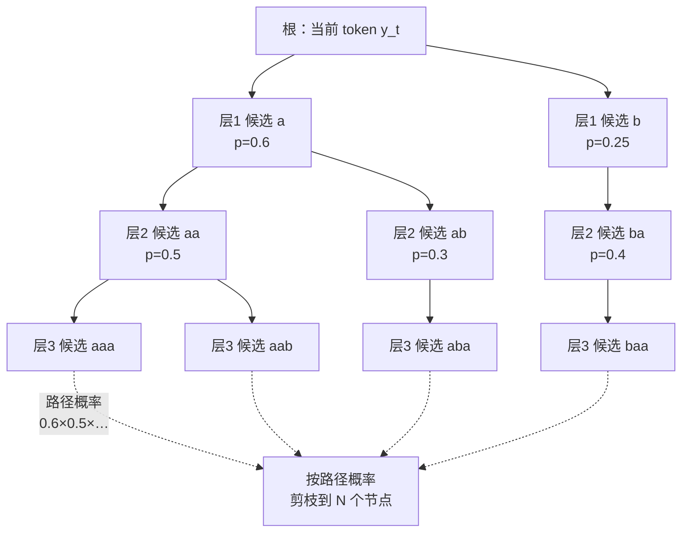
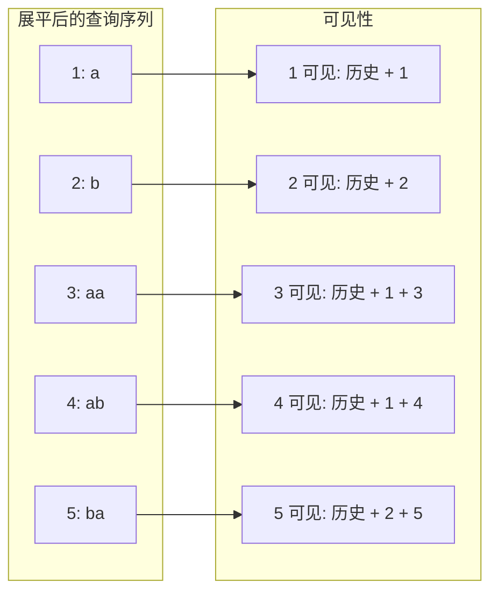
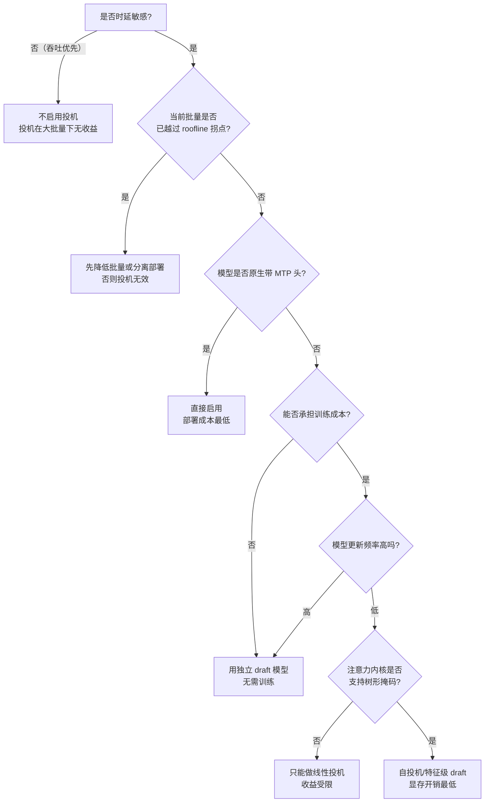

# Medusa、EAGLE 与多 token 预测

> 位置：[InferenceAtlas](../../INDEX.md) > [模块 05](README.md) > 当前文档
> 信息截至：2026-07-29 ｜ 最后核验：2026-07-29 ｜ 内容版本：v0.1
> 时效性等级：中
> 相关主题：[投机解码](04_speculative_decoding.md)｜`06_draft_model_selection_and_acceptance_rate.md`｜[FlashAttention](../04_compilers_runtimes_and_kernels/08_flashattention_and_memory_efficient_attention.md)

## 本章导读

标准投机解码需要一个**独立的 draft 模型**：另一套权重、另一份 KV cache、另一条部署流水线。这在工程上代价不小——你要为它做量化、做显存规划、做版本对齐，而它的唯一职责是猜测。

本章讨论的这一类方法共同回答一个问题：**能否不引入独立模型，就得到多个候选 token？**

三条主要路线：
- **自投机（self-drafting）**：在目标模型自身上加轻量预测头，让它一次性给出未来若干位置的猜测（Medusa 是这一路线的代表）；
- **特征级自回归 draft**：不在 token 空间做 draft，而在目标模型的隐藏特征空间做（EAGLE 是这一路线的代表）；
- **多 token 预测（MTP）训练**：在训练阶段就让模型学会预测未来多个位置，推理时这些头天然可用于投机。

它们的共同系统优势是**消除了独立 draft 模型的部署开销**；共同代价是**都需要额外训练**（哪怕只是训练小的头），且都把投机从"线性序列"推向了"**树形候选**"，后者要求注意力内核支持非因果的树形掩码——这是本章最重要的系统级结论。

## 学习目标

读完本章后，读者应能够：

1. 说明自投机相对独立 draft 模型在系统上省掉了什么、增加了什么；
2. 解释为什么树形投机的期望接受长度高于线性投机，并写出其期望模型；
3. 描述树形注意力掩码的构造方式及其对内核的要求；
4. 区分"在 token 空间 draft"与"在特征空间 draft"的信息利用差异；
5. 判断某个部署场景应选择独立 draft、自投机、还是不投机。

## 核心结论

- **自投机用"额外训练的预测头"换掉"额外部署的模型"**，把工程复杂度从运维侧转移到训练侧。
- **树形投机的核心收益来自"同一步验证多条路径"**：验证的边际成本很低（decode 阶段带宽受限），因此拓宽候选树几乎免费，直到越过 roofline 拐点。
- **树形投机要求注意力支持自定义掩码**，这是它最硬的系统前置条件——没有这个内核能力，树形方案无法实现。
- **特征级 draft 比 token 级 draft 利用了更多信息**（隐藏状态而非离散 token），这是它在同等参数量下可能获得更高接受率的原因。
- **所有自投机方法都继承投机解码的基本约束**：批量越大收益越小，因为大批量下系统已从带宽受限转向计算受限。

## 1. 问题定义、系统边界与工作负载

### 1.1 独立 draft 模型的工程负担

回顾标准投机解码（见 [投机解码](04_speculative_decoding.md)）：需要一个 draft 模型 $q$ 与目标模型 $p$。系统上这意味着：

| 负担项 | 内容 | 影响 |
|---|---|---|
| 显存 | draft 权重 + draft KV cache | 挤占目标模型的 KV 预算 |
| 词表对齐 | draft 与 target 必须共享词表 | 限制了 draft 的选型 |
| 版本管理 | 两套权重需同步更新 | 发布流程复杂化 |
| 量化配置 | draft 可用更激进量化，但需单独调 | 额外调优工作 |
| 调度 | draft 与 target 交替执行 | 内核启动开销翻倍 |

**关键矛盾**：draft 模型的显存占用会直接减少可用于 KV cache 的空间，从而降低并发数。而并发数下降本身就削减吞吐——这与投机解码想要的收益方向相反。

### 1.2 自投机要消除什么

自投机方法的目标是把 draft 的成本压缩到"几个额外的输出头"：

$$
\text{参数开销} = O(H \cdot d \cdot V) \quad \text{vs.} \quad \text{独立 draft} = O(P_{\text{draft}})
$$

- $H$：预测头数量（计数）；$d$：隐藏维度；$V$：词表大小；
- $P_{\text{draft}}$：draft 模型总参数量。
- **直觉**：预测头只是若干个 $d \times V$ 的输出投影（可能带一层变换），相比一个完整的小模型（含所有 attention 与 FFN 层）小得多。
- **局限**：当 $V$ 很大时，$d \cdot V$ 本身不小；$H$ 个头的参数量可能接近一个小模型。这一比较并非在所有配置下都成立。

**系统上省掉的**：独立的 KV cache、独立的前向调度、词表对齐约束。
**系统上增加的**：树形注意力掩码支持、更复杂的验证逻辑、训练依赖。

### 1.3 系统边界

| 维度 | 独立 draft 投机 | 自投机（预测头） | 特征级 draft |
|---|---|---|---|
| 是否需要额外权重 | 是（完整模型） | 是（轻量头） | 是（轻量自回归模块） |
| 是否需要额外 KV | 是 | 否 | 少量 |
| 是否需要训练 | 否（可用现成小模型） | 是 | 是 |
| 候选结构 | 线性或树形 | 通常树形 | 通常树形 |
| 对注意力内核要求 | 标准即可（线性） | 需树形掩码 | 需树形掩码 |
| 词表约束 | 必须一致 | 天然一致 | 天然一致 |

## 2. 原理、数学与性能模型

### 2.1 多头预测的基本形式

设目标模型在位置 $t$ 的最后一层隐藏状态为 $h_t \in \mathbb{R}^d$。标准语言模型头给出

$$
z_t^{(1)} = W_{\text{lm}} h_t
$$

预测的是位置 $t+1$。多头方案额外引入 $H-1$ 个头：

$$
z_t^{(j)} = W_j \, g_j(h_t), \quad j = 2, \dots, H
$$

其中 $g_j$ 是一个轻量变换（例如一层带残差的 MLP），$z_t^{(j)}$ 预测位置 $t+j$。

- $W_j \in \mathbb{R}^{V \times d}$：第 $j$ 个头的输出投影；
- $g_j$：第 $j$ 个头的特征变换。
- **直觉**：头 $j$ 试图在只看到 $t$ 之前信息的条件下，直接猜测 $t+j$ 位置的 token。
- **假设**：这些头需要被训练。它们不能从预训练模型中"免费"得到。
- **局限**：预测越远的位置，条件信息越不足，准确率必然递减。这是自投机接受率随深度快速衰减的根本原因。

**准确率的深度衰减**：设第 $j$ 个头的单点准确率为 $a_j$，一般有

$$
a_1 > a_2 > \dots > a_H
$$

因为头 $j$ 在预测 $t+j$ 时，并不知道 $t+1, \dots, t+j-1$ 实际是什么。这与独立 draft 模型不同——后者是自回归的，每一步都能看到前一步的结果。

**这个差异是核心权衡**：多头方案省掉了 draft 的自回归开销（一次前向拿到所有头），代价是各头之间**没有条件依赖**，准确率衰减更快。

### 2.2 从线性到树形

如果只用每个头的 top-1，得到一条线性候选序列，长度 $H$，期望接受长度较低。**树形投机**改为：让每个头给出 top-$n_j$ 个候选，组成一棵候选树。

设树的第 $j$ 层有 $n_j$ 个候选，则树中的路径总数为 $\prod_j n_j$，节点总数为

$$
N_{\text{nodes}} = \sum_{j=1}^{H} \prod_{i=1}^{j} n_i
$$

- $n_j$：第 $j$ 层的分支数（计数）；
- **直觉**：节点数即一次验证前向需要处理的 token 数。
- **局限**：完整笛卡尔积增长极快，实际实现会剪枝，只保留概率最高的若干节点，形成一棵不规则的树。

**期望接受长度**：设第 $j$ 层的"某个候选被接受"的概率为 $\alpha_j$（注意这是**集合命中**概率，高于单点准确率 $a_j$），则期望接受长度

$$
E[\ell] = \sum_{j=1}^{H} \prod_{i=1}^{j} \alpha_i
$$

- **推导**：接受长度至少为 $j$ 的概率是前 $j$ 层都命中的概率 $\prod_{i \le j} \alpha_i$；期望即对其求和。
- **假设**：各层命中相互独立。这是简化——实际上前一层猜错会改变后一层的条件，独立性不成立，因此该式是乐观估计。
- **局限**：$\alpha_j$ 依赖于分支数 $n_j$、模型、任务与采样温度，必须实测。

**为什么树形有效**：$\alpha_j$（top-$n_j$ 命中）显著高于 $a_j$（top-1 命中）。把分支从 1 加到 4，命中率的提升往往比"多加一层"带来的收益更大——因为深层的条件信息不足是硬约束，而拓宽是廉价的。

### 2.3 拓宽为什么"几乎免费"

这是树形投机最重要的性能论证。验证步骤把 $N_{\text{nodes}}$ 个 token 一次性送入目标模型做一次前向。这次前向的时间

$$
T_{\text{verify}}(N) \approx \max\left( \frac{W}{\text{BW}},\ \frac{2 P N}{\text{FLOPS}} \right) + T_{\text{attn}}(N, S)
$$

- $W$：权重字节数；$\text{BW}$：有效带宽（B/s）；$P$：参数量；$N = N_{\text{nodes}}$；
- $T_{\text{attn}}(N, S)$：对长度 $S$ 的 KV 做 $N$ 个查询的注意力时间。
- **直觉**：在 $N$ 较小时，第一项（权重读取）主导，$T_{\text{verify}}$ 几乎与 $N$ 无关——**多验证几十个 token 不额外花时间**。这正是"拓宽免费"的来源。
- **拐点**：当 $2PN/\text{FLOPS}$ 超过 $W/\text{BW}$ 时，即

$$
N^* \approx \frac{W \cdot \text{FLOPS}}{2 P \cdot \text{BW}}
$$

超过 $N^*$ 后，验证时间开始线性增长，继续拓宽不再免费。

- **局限**：该式忽略了 $T_{\text{attn}}$。在长上下文下，注意力部分对 $N$ 的依赖不可忽略，实际拐点会低于此估计。

**关键推论**：$N^*$ 与批大小共享同一个预算。如果服务已经在大批量下运行（$B$ 大），系统已经越过拐点，树形投机的"免费拓宽"红利消失。这与标准投机解码"批量越大收益越小"的结论完全一致，只是表述角度不同。

| 运行状态 | $B \cdot N$ 相对 $N^*$ | 树形投机收益 |
|---|---|---|
| 低并发、时延敏感 | 远小于 | 高，拓宽近乎免费 |
| 中等并发 | 接近 | 中，需谨慎选 $N$ |
| 高并发、吞吐优先 | 远大于 | 低甚至为负 |

### 2.4 特征级 draft 的信息优势

token 级 draft 把上一步的输出离散化为 token id，再作为下一步的输入。这个离散化**丢失了信息**：模型对下一个 token 的完整分布被压缩成了一个整数。

特征级 draft 的思路是：draft 模块的输入不是 token id，而是目标模型的隐藏特征 $h_t$（或其变换）。draft 模块在特征空间做自回归：

$$
\hat{h}_{t+1} = f_{\text{draft}}(h_t, e_{y_{t+1}}), \qquad z_{t+2} = W_{\text{lm}} \hat{h}_{t+1}
$$

- $f_{\text{draft}}$：轻量自回归模块（通常一层 transformer 块）；
- $e_{y_{t+1}}$：已采样 token 的嵌入；
- $W_{\text{lm}}$：**复用目标模型的语言模型头**，不需要新的 $V \times d$ 参数。
- **直觉**：draft 不再重新学习"如何从头预测 token"，而是学习"如何在特征空间外推一步"。特征包含了比 token id 丰富得多的信息。
- **假设**：目标模型的特征空间是平滑的，可以被一个轻量模块外推。
- **局限**：draft 模块需要访问目标模型的中间特征，这意味着更紧的耦合——它不能像独立 draft 模型那样"即插即用"，且模型更新后必须重训。

**参数量优势**：复用 $W_{\text{lm}}$ 意味着 draft 模块本身可以很小（只有 $f_{\text{draft}}$ 的参数），远小于多头方案的 $H$ 个 $V \times d$ 投影。

| 方案 | draft 参数量主导项 | 是否有跨步条件依赖 | 是否复用 LM 头 |
|---|---|---|---|
| 独立 draft 模型 | 完整小模型 | 是 | 否（自带） |
| 多预测头 | $H \cdot V \cdot d$ | 否 | 否 |
| 特征级自回归 | $f_{\text{draft}}$ 的参数 | 是 | 是 |

**这张表解释了设计演进的逻辑**：多头方案去掉了 draft 模型但失去了条件依赖；特征级方案在保持轻量的同时恢复了条件依赖，代价是与目标模型更紧的耦合。

### 2.5 训练时多 token 预测

第三条路线把多 token 预测放进**预训练**阶段：训练时在每个位置同时预测未来 $H$ 个 token，损失为各头交叉熵之和。

$$
\mathcal{L} = \sum_{t} \sum_{j=1}^{H} \lambda_j \, \mathrm{CE}\left( z_t^{(j)}, \, y_{t+j} \right)
$$

- $\lambda_j$：第 $j$ 个头的损失权重；$\mathrm{CE}$：交叉熵。
- **直觉**：这不只是为了推理加速——多 token 预测被认为可能改善表示学习本身，因为它迫使模型建立更长程的规划。
- **推理时的用法**：这些头已经训好，可以直接用于投机；也可以在不投机时丢弃，退化为标准单头解码。
- **局限**：需要在预训练阶段就做出这个决策，无法对已有模型追加（只能微调出头，效果通常不如原生训练）。

**系统含义**：若模型原生带 MTP 头，投机解码的部署成本接近零——不需要额外权重、不需要额外训练、不需要额外部署。这是三条路线中系统上最干净的，但它要求模型提供方在训练时就做了这个选择。

## 3. 实现机制与系统设计

### 3.1 树形候选的构造



**图解读**：
1. **本图展示什么**：从当前 token 出发，各预测头给出 top-$n$ 候选，逐层展开形成候选树，最后按累积路径概率剪枝到固定节点预算 $N$。
2. **核心瓶颈**：瓶颈是节点预算 $N$——它受 2.3 的 roofline 拐点 $N^*$ 约束。树的形状（宽而浅 vs 窄而深）在给定 $N$ 下是一个优化问题，通常宽而浅更优，因为深层准确率衰减快。
3. **图中的 trade-off**：加宽提升每层命中率 $\alpha_j$ 但快速消耗节点预算；加深提升潜在接受长度上限但每层收益递减。给定 $N$，两者竞争同一预算。
4. **面试如何引用**：被问"树形投机比线性投机好在哪"时，用这张图说明"同一次验证前向可以覆盖多条路径"，并指出树形状本身是需要按接受率数据调优的超参。

**剪枝策略**：完整笛卡尔积不可行，实现上按**累积路径概率**排序，保留前 $N$ 个节点。剪枝可以是静态的（离线按统计确定树形，运行时固定）或动态的（每步按当前概率重新构造）。

| 剪枝方式 | 优点 | 缺点 |
|---|---|---|
| 静态树形 | 掩码可预计算并缓存；形状固定利于 CUDA Graph | 无法适应当前上下文的置信度 |
| 动态树形 | 高置信位置可以窄树省算力 | 每步重建掩码；形状变化破坏图捕获 |

**实践倾向**：静态树形通常更受青睐，因为形状固定使得注意力掩码可以预计算、批次形状稳定、可以被 CUDA Graph 捕获（见 [模块 04 第 10 章](../04_compilers_runtimes_and_kernels/10_cuda_graphs_and_execution_overhead.md)）。这是一个典型的"算法上略差但系统上更优"的选择。

### 3.2 树形注意力掩码

这是本章最硬的系统要求。把树的所有节点展平成一个长度为 $N$ 的序列送入模型，但**节点之间的可见性不是标准的因果掩码**——节点 $i$ 只应看到它在树中的祖先，不应看到兄弟分支。

设 $\mathrm{anc}(i)$ 为节点 $i$ 的祖先集合（含自身），则掩码

$$
M_{ij} = \begin{cases} 0 & j \in \mathrm{anc}(i) \text{ 或 } j \in \text{历史 KV} \\ -\infty & \text{否则} \end{cases}
$$

**与标准因果掩码的区别**：因果掩码是下三角的，只依赖位置顺序。树形掩码依赖**树结构**，不是任何三角形状。



**图解读**：
1. **本图展示什么**：树的节点被展平成查询序列后，每个节点的可见 KV 集合由其在树中的祖先链决定，而非位置先后。
2. **核心瓶颈**：瓶颈在注意力内核是否支持任意掩码。高度优化的注意力内核（如 FlashAttention 系列）通常对掩码形式有假设（因果、滑窗等）；支持任意掩码可能需要走较慢的路径，从而吃掉投机的收益。
3. **图中的 trade-off**：树越复杂，掩码越不规则，越难被优化内核处理；简单的树（如"每层等宽的完全树"）掩码有规律，可能被特化实现。这是算法灵活性与内核效率的直接冲突。
4. **面试如何引用**：被问"树形投机的实现难点"时，用这张图指出难点不在树的构造而在注意力掩码——并说明这是为什么某些框架只支持线性投机而不支持树形。

**位置编码的处理**：树中同一层的节点对应同一个绝对位置。因此位置编码（如 RoPE）必须按**节点在树中的深度**赋予，而非按展平后的索引。这是一个极易出错的实现点：用展平索引会让第 5 个节点被编码为位置 $t+5$，而它实际上是位置 $t+2$ 的一个候选。

### 3.3 验证与接受

验证阶段用一次目标模型前向得到树中每个节点位置的 target 分布，然后沿树寻找最长的被接受路径。

```
function tree_verify(target_logits, tree, draft_probs, temperature):
    # target_logits: [N, V]，N 为树节点数
    accepted = []
    node = tree.root
    while node has children:
        # 在当前节点位置，target 分布为 p
        p = softmax(target_logits[node.index] / temperature)

        matched = None
        for child in node.children (按 draft 概率降序):
            q = draft_probs[child]              # draft 给该 token 的概率
            r = uniform(0, 1)
            if r < min(1, p[child.token] / q):  # 标准接受判定
                matched = child
                break
            else:
                # 拒绝：从残差分布重采样，路径终止
                p = normalize(max(0, p - q_dist))
                accepted.append( sample(p) )
                return accepted

        if matched is None:
            accepted.append( sample(p) )        # bonus token
            return accepted

        accepted.append(matched.token)
        node = matched

    # 走到叶子：额外采一个 bonus token
    p = softmax(target_logits[node.index] / temperature)
    accepted.append( sample(p) )
    return accepted
```

**要点**：
1. **分布不变性依然成立**——只要每一步用的是标准的 $\min(1, p/q)$ 判定与残差重采样，树形验证的输出分布仍等同于直接从 target 采样。证明思路与线性情形相同（见 [投机解码](04_speculative_decoding.md) 第 2 节），只是沿着树的一条路径应用。
2. **多子节点的处理**：在同一节点位置有多个候选时，按 draft 概率降序依次尝试。每次拒绝后需从残差分布中扣除已尝试候选的概率质量，否则会破坏分布不变性。
3. **bonus token**：走到叶子或全部拒绝时，都可以从 target 分布免费采一个 token——因为该位置的 target 分布已经算出来了。这使得最坏情况下每步至少前进 1 个 token，投机永不倒退。

**贪心情形的简化**：若温度为 0，接受判定退化为"draft token 是否等于 target 的 argmax"，实现大幅简化。这也是投机解码在低温度下接受率更高的直接原因。

### 3.4 KV cache 的处理

树形投机对 KV cache 提出两个要求：

| 要求 | 说明 | 实现 |
|---|---|---|
| 临时写入 $N$ 个 token 的 KV | 验证时所有节点都要算 KV | 预留 $N$ 个槽位的临时区 |
| 验证后只保留接受路径的 KV | 未接受节点的 KV 必须丢弃 | 按接受路径压缩/搬移 |

**压缩操作**：接受路径的 KV 分散在临时区的不同位置（因为树是展平的）。需要一次 gather 把它们搬到连续位置。这个操作的成本

$$
c_{\text{compact}} \approx 2 \cdot \ell \cdot m_{\text{tok}} / \text{BW}
$$

- $\ell$：接受长度；$m_{\text{tok}}$：每 token 的 KV 字节数；因子 2 为读+写。
- **直觉**：只搬接受的部分，通常 $\ell \ll N$，成本小。
- **局限**：在分页 KV 下，若接受路径跨页，搬移可能触发页分配；这引入了不可预测的延迟。

**与分页 KV 的配合**：一个更优的做法是不搬移数据，而是**调整页表**——让逻辑序列的页表指向接受路径对应的物理槽位。这把 $O(\ell)$ 的数据搬移换成了 $O(1)$ 的元数据更新，但要求页内的槽位粒度支持这种映射，实现更复杂。

### 3.5 与其他技术的交互

| 技术 | 交互 | 说明 |
|---|---|---|
| CUDA Graph | 正向（静态树） | 固定树形使批次形状稳定，可被捕获；动态树破坏捕获 |
| 分页 KV | 需适配 | 临时区管理与接受后压缩 |
| 连续批处理 | 冲突 | 不同请求的接受长度不同，导致批内序列长度发散 |
| 量化 | 正向 | 预测头可用更低精度，因为它只需给出候选 |
| 约束解码 | 需联合 | 约束 mask 必须同时施加于预测头，见 [束搜索与约束解码](03_beam_search_and_constrained_decoding.md) 4.4 |
| 张量并行 | 中性 | 预测头可与 LM 头同样切分 |

**与连续批处理的冲突值得展开**：普通 decode 每步每请求前进 1 个 token，批内所有序列同步增长。投机解码下，请求 A 可能接受 3 个 token 而请求 B 只接受 1 个。这导致：

1. 批内序列长度快速发散，KV 页占用不均；
2. 请求的完成时间难以预测，调度器的排队模型失效；
3. 若采用统一的树节点预算 $N$，已经接受很多的请求与刚开始的请求会浪费不同比例的算力。

**缓解**：把投机作为**每请求可开关的特性**，只对时延敏感的请求启用；或按批负载动态关闭投机（高负载时关闭）。后者是最实用的策略——它直接对应 2.3 的 roofline 分析。

## 4. 性能、成本、能耗与可靠性 trade-off

### 4.1 三条路线的对比

| 维度 | 独立 draft | 多预测头 | 特征级自回归 | 原生 MTP |
|---|---|---|---|---|
| 额外显存 | 高（权重+KV） | 中（$H$ 个大投影） | 低 | 无（已在模型内） |
| 训练需求 | 无 | 需训头 | 需训模块 | 需在预训练时决定 |
| 跨步条件依赖 | 有 | 无 | 有 | 无（各头独立） |
| 词表约束 | 需一致 | 天然一致 | 天然一致 | 天然一致 |
| 部署复杂度 | 高 | 中 | 中 | 低 |
| 对内核的要求 | 低（线性） | 高（树形） | 高（树形） | 高（树形） |
| 模型更新后 | draft 可复用 | 需重训头 | 需重训模块 | 随模型一起 |

**"模型更新后"这一行常被忽略但很重要**：自投机方法把 draft 能力绑定到具体模型版本。每次模型微调或更新，都需要重新训练预测头。对于快速迭代的服务，这是持续的工程负担。独立 draft 模型在这一点上更宽松——只要词表不变，同一个 draft 可以服务多个 target 版本。

### 4.2 收益的边界条件

投机类方法的加速比（见 [投机解码](04_speculative_decoding.md)）

$$
\text{Speedup} \approx \frac{E[\ell]}{1 + c_{\text{draft}} / c_{\text{target}}}
$$

- $E[\ell]$：期望每步前进的 token 数（含 bonus）；
- $c_{\text{draft}}, c_{\text{target}}$：draft 与验证的单步成本。
- **自投机的优势**：$c_{\text{draft}}$ 极小（只是几个矩阵乘），分母接近 1，加速比接近 $E[\ell]$。
- **局限**：该式假设 target 的验证成本与普通 decode 相同。当 $N$ 越过 $N^*$ 时不成立，需改用 2.3 的完整模型。

**收益消失的三个条件**（任一满足即应关闭投机）：

| 条件 | 机制 | 判据 |
|---|---|---|
| 批量大 | $B \cdot N > N^*$，验证不再免费 | 监控实际 $T_{\text{verify}}$ 是否随 $N$ 线性增长 |
| 温度高 | $\alpha_j$ 下降，$E[\ell] \to 1$ | 监控实测接受率 |
| 领域不匹配 | 预测头在训练分布外准确率崩塌 | 分领域统计接受率 |

### 4.3 能耗视角

投机解码是典型的**用能量换时延**：

$$
\frac{E_{\text{spec}}}{E_{\text{base}}} \approx \frac{N \cdot \text{（每 token 能耗）}}{\ell \cdot \text{（每 token 能耗）}} = \frac{N}{E[\ell]}
$$

- **直觉**：为了产出 $E[\ell]$ 个 token，实际计算了 $N$ 个节点。$N / E[\ell]$ 就是能耗放大倍数。
- **局限**：这忽略了固定开销（权重读取）在两种模式下相同这一点。在带宽受限区，能耗放大远小于此估计，因为增加的计算并未增加权重读取能耗。更精确的模型需区分权重读取能耗与计算能耗。

**运营含义**：在电力受限的数据中心（见 [模块 09](../09_datacenter_power_thermal_and_operations/)，规划中），投机解码的开启需要纳入功耗预算。它降低了 TPOT 但提高了每 token 的焦耳数——这是一个明确的、需要被显式决策的取舍，而非纯粹的优化。

### 4.4 可靠性与正确性

| 风险 | 后果 | 缓解 |
|---|---|---|
| 位置编码按展平索引赋予 | 输出静默错误 | 单元测试：树形投机输出应与非投机 greedy 完全一致（温度 0） |
| 残差分布未正确扣除 | 分布偏移，质量下降但不报错 | 统计测试：大量采样后比较投机与非投机的 token 频率分布 |
| KV 压缩遗漏 | 后续步骤读到被拒绝节点的 KV | 断言：压缩后 KV 长度 = 历史长度 + 接受长度 |
| 接受长度统计错误 | 监控失真，误判收益 | 独立统计 $E[\ell]$ 与实测端到端加速比，二者应一致 |

**最重要的验证**：**温度为 0 时，启用投机与不启用投机的输出必须逐 token 完全相同**。这是一个强不变量，能捕获绝大多数实现错误。任何投机实现在上线前都应有这个测试。

## 5. benchmark、真实案例或公开部署案例

本节受限于当前环境的网络出口策略：`arxiv.org`、`openreview.net`、`huggingface.co` 等发表与模型卡的一手来源均不可达（详见 [AGENTS.md 第 11 节](../../AGENTS.md)）。因此**本节不给出任何具体的加速比、接受率或参数量数字**——这类数字必须来自可核验的一手来源，凭记忆填写违反本库的披露纪律。

| 陈述 | 披露标签 | 状态 |
|---|---|---|
| Medusa 提出在目标模型上加多个预测头做自投机 | `技术文档披露` | `待核实`（需补原始论文链接与版本） |
| EAGLE 提出在特征空间做自回归 draft | `技术文档披露` | `待核实` |
| 多 token 预测已被用于预训练目标 | `技术文档披露` | `待核实` |
| 多个开源推理引擎支持某种形式的树形投机 | `开源代码/配置披露` | `待核实` |
| 上述方法的具体加速比 | — | **不引用**（无一手来源） |

**可自行复现的实验**（`独立可复现实验`）：

1. **接受率的深度衰减**：对一个已训练的多头方案，逐层统计 $a_j$（top-1 命中）与 $\alpha_j$（top-$n$ 命中）。验证 2.1 的单调递减与 2.2 中"拓宽优于加深"的判断。
2. **节点预算扫描**：固定树深，扫描 $N \in \{1, 8, 16, 32, 64, 128\}$，测量单次验证前向的耗时。定位实际拐点 $N^*$，与 2.3 的公式估计对比。
3. **批量-收益曲线**：固定树形，扫描批大小 $B$，测量端到端加速比。预期观察加速比随 $B$ 单调下降并在某点跌破 1。
4. **分布一致性测试**：温度 0 下比较投机与非投机输出（应完全相同）；温度 1 下采样大量样本，用统计检验比较两种模式的 token 频率分布。
5. **静态 vs 动态树形**：在相同节点预算下比较两者的 $E[\ell]$ 与端到端时延。验证 3.1 中"静态在系统上更优"的判断是否在你的栈上成立。
6. **能耗测量**：在开关投机两种配置下测量功耗与 token 吞吐，计算 J/token 的变化，验证 4.3 的方向。

> 实验方法论要求见 [如何读推理 benchmark](../00_start_here/03_how_to_read_inference_benchmarks.md)。

## 6. 设计决策框架



**图解读**：
1. **本图展示什么**：从时延敏感性出发，依次经过系统条件（批量、内核能力）与工程条件（训练成本、更新频率），落到四种可选方案。
2. **核心瓶颈**：最上层的两个判断（时延敏感性、roofline 位置）是硬门槛——若不通过，后面所有算法选择都无意义。这是把投机从"算法选型"提升为"系统决策"的关键。
3. **图中的 trade-off**：左侧路径（独立 draft）用显存换工程简单；右下路径（自投机）用训练成本与内核要求换显存。中间的"原生 MTP"是唯一没有明显代价的选项，但它不是部署方能决定的。
4. **面试如何引用**：被问"如何为一个服务选择投机方案"时，用这张图先排除不适用的场景，再讨论方案差异——这比直接比较各方法的加速比更能体现系统思维。

### 决策清单

| 问题 | 若答案为"是" | 若答案为"否" |
|---|---|---|
| 服务运行在低并发区？ | 投机有实质收益 | 优先考虑关闭 |
| 采样温度低？ | 接受率高，收益好 | 重测接受率再决定 |
| 注意力内核支持任意掩码？ | 树形可行 | 只能线性 |
| 模型版本稳定？ | 自投机的训练成本可摊销 | 独立 draft 更省心 |
| 显存紧张？ | 自投机优于独立 draft | 两者皆可 |
| 有功耗预算约束？ | 需计入 $N/E[\ell]$ 的能耗放大 | 按时延优化即可 |

## 7. 常见失败模式与排查路径

| 症状 | 可能原因 | 排查步骤 |
|---|---|---|
| 温度 0 下投机与非投机输出不同 | 位置编码按展平索引赋予（3.2） | 打印每个树节点的位置编码索引，应等于 $t + \text{深度}$ |
| 输出质量下降但不报错 | 残差分布未正确扣除（3.3） | 大样本频率分布检验；逐步比较 target 分布与实际采样分布 |
| 加速比远低于 $E[\ell]$ 的预期 | 验证前向已越过拐点（2.3） | 扫描 $N$，看 $T_{\text{verify}}$ 是否线性增长 |
| 加速比小于 1（投机变慢） | 接受率过低或树形不当 | 统计 $E[\ell]$；若接近 1，说明 draft 质量不足 |
| 高负载下时延恶化 | 投机在大批量下有害（4.2） | 按批负载动态关闭投机 |
| 接受率在某类请求上崩塌 | 预测头训练分布不覆盖该领域 | 分领域统计接受率；考虑领域特化的头 |
| 后续步骤读到错误 KV | 压缩遗漏（3.4） | 断言压缩后 KV 长度；构造"接受长度=1"的极端用例 |
| 启用后显存 OOM | 临时区未纳入预算 | KV 预算需额外预留 $N \cdot m_{\text{tok}}$ |
| CUDA Graph 频繁重捕获 | 动态树形导致形状变化（3.1） | 改用静态树形 |
| 批内序列长度严重发散 | 接受长度不均（3.5） | 考虑按请求开关投机，或分池部署 |

**排查顺序建议**：先做"温度 0 一致性测试"（能排除大部分正确性问题），再看 $E[\ell]$ 的实测值（能区分"算法不行"与"系统不行"），最后才看端到端时延。跳过前两步直接调时延，几乎总是浪费时间。

## 8. 关联面试主题

1. **自投机相对独立 draft 模型的系统权衡**——见本章 1.2 与 4.1，核心是"训练侧成本换运维侧成本"。
2. **为什么树形投机的拓宽"几乎免费"**——见本章 2.3，roofline 拐点是关键概念。
3. **树形注意力掩码为什么是实现难点**——见本章 3.2，与 [FlashAttention](../04_compilers_runtimes_and_kernels/08_flashattention_and_memory_efficient_attention.md) 的内核假设冲突。
4. **多头方案为什么接受率随深度快速衰减**——见本章 2.1，缺乏跨步条件依赖。
5. **特征级 draft 的信息优势来自哪里**——见本章 2.4，隐藏状态 vs 离散 token。
6. **树形验证如何保持分布不变性**——见本章 3.3，与 [投机解码](04_speculative_decoding.md) 的证明一致。
7. **投机解码与连续批处理的冲突**——见本章 3.5，接受长度不均导致的调度困难。
8. **投机解码的能耗代价**——见本章 4.3，$N/E[\ell]$ 的放大倍数。
9. **验证投机实现正确性的强不变量**——见本章 4.4，温度 0 下的逐 token 一致性。

## 9. 小结

Medusa、EAGLE 与多 token 预测代表了投机解码从"两个模型"走向"一个模型"的演进。它们的系统画像可以归结为三点：

**第一，成本从运维转向训练**。省掉了独立 draft 模型的显存、KV、调度与版本管理，代价是需要训练预测头或 draft 模块，且这些组件与具体模型版本绑定——模型一更新就要重训。对迭代快的服务，这个成本可能超过它省掉的。

**第二，树形结构是核心杠杆，但需要内核支持**。树形投机的收益论证很干净：在带宽受限区，验证 $N$ 个 token 与验证 1 个 token 耗时接近，因此拓宽候选几乎免费，直到 $B \cdot N$ 越过 roofline 拐点。但要实现它，注意力内核必须支持由树结构决定的非因果掩码，位置编码必须按树深度而非展平索引赋予。这两点是最常见的实现错误来源。

**第三，所有投机方法共享同一个边界条件**：在高并发、高温度、领域不匹配的任一情形下收益消失甚至为负。因此投机不应是一个全局开关，而应是一个**按批负载与请求类型动态决定的策略**。把它作为默认常开配置，是在高负载时主动损害系统的做法。

最后，正确性上有一个强不变量值得反复强调：**温度为 0 时，投机与非投机的输出必须逐 token 相同**。任何投机实现在上线前都应通过这个测试。

## 关键术语

| 中文术语 | 英文 | 定义 | 单位/口径 | 关联文档 |
|---|---|---|---|---|
| 自投机 | self-speculative decoding | 用目标模型自身的额外头产生候选，无需独立 draft 模型 | — | 本章 1.2 |
| 预测头 | prediction head / draft head | 附加在目标模型上、预测未来某位置 token 的轻量输出层 | 头数为计数 | 本章 2.1 |
| 树形投机 | tree speculation | 每层给出多个候选、组成候选树并一次性验证 | 节点数为计数 | 本章 2.2 |
| 树形注意力掩码 | tree attention mask | 按树结构（祖先可见）而非位置顺序构造的注意力掩码 | — | 本章 3.2 |
| 期望接受长度 | expected accept length | 每次投机步骤平均前进的 token 数 | token/步 | 本章 2.2 |
| 节点预算 | node budget | 一次验证前向中处理的树节点上限 | 计数 | 本章 2.3 |
| 特征级 draft | feature-level drafting | 在隐藏特征空间而非 token 空间做自回归提议 | — | 本章 2.4 |
| 多 token 预测 | multi-token prediction (MTP) | 训练时同时预测未来多个位置的目标 | 头数为计数 | 本章 2.5 |
| bonus token | bonus token | 验证前向顺带产生的、必然可接受的额外 token | token | 本章 3.3 |
| KV 压缩 | KV compaction | 验证后丢弃未接受节点 KV、保留接受路径的操作 | — | 本章 3.4 |

## 延伸阅读

- [投机解码](04_speculative_decoding.md) — 分布不变性证明与基础加速比模型
- `06_draft_model_selection_and_acceptance_rate.md` — 接受率的工程化提升
- [束搜索与约束解码](03_beam_search_and_constrained_decoding.md) — 树形结构与共享 KV 的另一应用
- [FlashAttention 与内存高效注意力](../04_compilers_runtimes_and_kernels/08_flashattention_and_memory_efficient_attention.md) — 树形掩码为何与优化内核冲突
- [CUDA Graphs 与执行开销](../04_compilers_runtimes_and_kernels/10_cuda_graphs_and_execution_overhead.md) — 静态树形为何有系统优势
- [Roofline 与性能建模](../01_foundations_and_metrics/04_roofline_and_performance_modeling.md) — 拐点 $N^*$ 的理论背景
- [PagedAttention 与 KV 内存管理](../03_serving_engines_and_scheduling/03_pagedattention_and_kv_memory_management.md) — 临时区与压缩的实现基础

## 主要来源

本章的数学模型与系统分析为本库自洽推导。涉及具体方法（Medusa、EAGLE、MTP）的归属性陈述已在第 5 节标注为 `待核实`，具体性能数字**未引用**，原因是当前环境无法访问相应的一手来源（详见 [AGENTS.md 第 11 节](../../AGENTS.md)）。

| 类别 | 说明 | 披露标签 |
|---|---|---|
| 多头预测的数学形式 | 本库给出的自洽形式 | — |
| 树形期望接受长度模型 | 本库推导，已标注独立性假设 | — |
| roofline 拐点 $N^*$ | 由模块 01 的 roofline 模型导出 | — |
| 方法归属与原始设计细节 | 需一手论文核验 | `待核实` |
| 具体加速比与接受率数值 | 无一手来源，**未给出** | — |

## 更新记录

| 日期 | 版本 | 变更 | 核验人 |
|---|---|---|---|
| 2026-07-29 | v0.1 | 初稿：自投机三条路线的对比、树形投机的收益模型与掩码实现、边界条件与验证不变量 | — |
