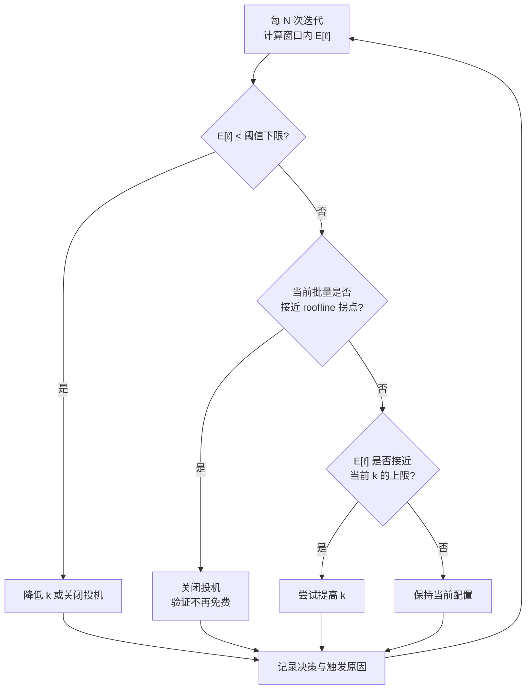
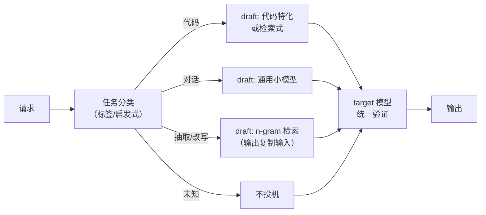
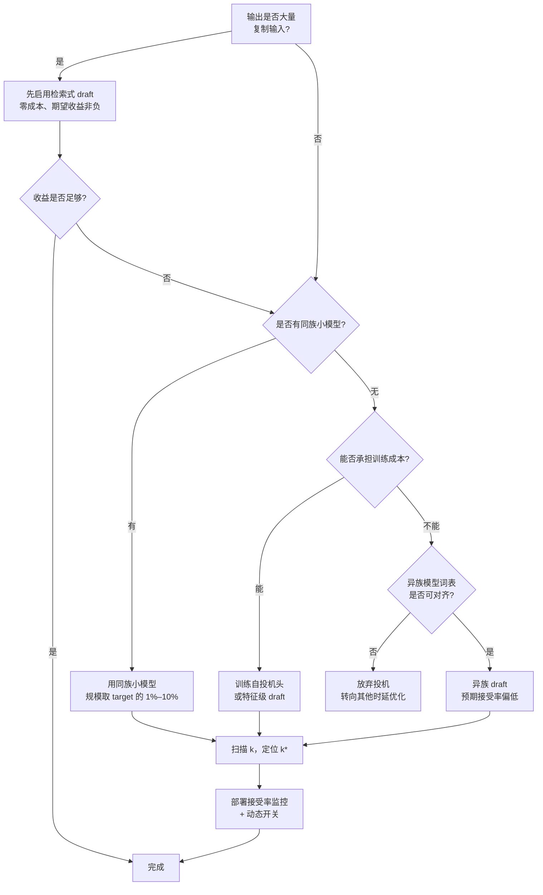

# draft 模型选型与接受率工程

> 位置：[InferenceAtlas](../../INDEX.md) > [模块 05](README.md) > 当前文档
> 信息截至：2026-07-29 ｜ 最后核验：2026-07-29 ｜ 内容版本：v0.1
> 时效性等级：中
> 相关主题：[投机解码](04_speculative_decoding.md)｜[Medusa/EAGLE/MTP](05_medusa_eagle_and_multi_token_prediction.md)｜[量化内核](../04_compilers_runtimes_and_kernels/09_quantization_kernels.md)

## 本章导读

投机解码的收益完全由两个量决定：**接受率**与 **draft 开销**。前者决定每步能前进多远，后者决定为此付出多少。选错 draft 模型会让加速比跌破 1——投机反而比不投机更慢。

但"接受率"这个词在实践中被用得很含混。它至少有三种不同的口径：单 token 接受概率、期望接受长度、以及"整个提议块被完全接受的比例"。三者数值不同，用错口径会导致监控失真、优化方向错误。本章第 2 节先把口径厘清。

更重要的是，接受率**不是模型的固有属性**，而是 (draft, target, 任务, 温度, 上下文长度) 这个五元组的函数。同一对模型在代码任务上接受率高、在开放对话上低；温度 0 时高、温度 1 时低。因此"某某 draft 模型接受率 0.8"这样的说法在没有限定条件时是没有意义的。

本章目标：给出 draft 选型的完整判据、接受率的正确度量方式、以及在生产中提升接受率的可行手段。

## 学习目标

读完本章后，读者应能够：

1. 区分三种接受率口径，并说明各自适用的场景；
2. 写出加速比关于接受率与开销比的完整表达式，并求最优提议长度；
3. 列出影响接受率的五类因素，并按可控性排序；
4. 给出 draft 模型选型的量化判据（何时"更大的 draft"反而更差）；
5. 设计接受率的线上监控方案，并据此做动态策略调整。

## 核心结论

- **接受率必须指明口径与条件**：口径有三种，条件至少包括任务、温度、上下文长度。脱离条件的接受率数字不可比。
- **加速比对提议长度不是单调的**，存在最优 $k^*$；$k$ 超过最优值后，draft 开销的增长超过接受长度的增长。
- **draft 越大接受率越高，但收益可能被开销吃掉**：存在一个"draft 规模上限"，超过后加速比下降。
- **接受率最强的杠杆是"draft 与 target 的训练一致性"**，其次是量化精度，最后才是模型规模。
- **接受率必须线上持续监控并驱动动态开关**，因为它随流量构成漂移，离线测得的值在生产中不成立。

## 1. 问题定义、系统边界与工作负载

### 1.1 什么在被选择

一次 draft 选型决策实际包含四个维度：

| 维度 | 选项空间 | 主要影响 |
|---|---|---|
| draft 模型来源 | 同族小模型 / 剪枝的 target / 训练的头 / n-gram | 接受率与工程成本 |
| draft 规模 | 参数量、层数 | 接受率 ↔ 开销 |
| draft 精度 | fp16 / int8 / int4 | 开销 ↔ 接受率 |
| 提议长度/树形 | $k$ 或树的形状 | 期望接受长度 ↔ 验证成本 |

这四个维度不是独立的。更小的 draft 可以用更长的 $k$（因为开销低），更低精度的 draft 需要更短的 $k$（因为质量差、深层接受率衰减快）。选型必须联合优化。

### 1.2 各类 draft 来源的画像

| 来源 | 接受率 | draft 开销 | 工程成本 | 词表约束 |
|---|---|---|---|---|
| 同族小模型 | 高 | 中 | 低（现成） | 天然满足 |
| 异族小模型 | 低到中 | 中 | 中（需对齐词表） | 需处理 |
| target 的剪枝/蒸馏版 | 高 | 中 | 高（需训练） | 天然满足 |
| 附加预测头（Medusa 式） | 中 | 极低 | 中（需训练） | 天然满足 |
| 特征级 draft（EAGLE 式） | 中到高 | 极低 | 中（需训练） | 天然满足 |
| n-gram / 前缀检索 | 场景依赖，可以很高 | 接近零 | 极低 | 无 |

**n-gram/检索式 draft 值得单独说明**：它不用任何神经网络，而是从 prompt 或历史中检索重复片段作为提议。在**输出大量复制输入**的场景（代码编辑、文档改写、RAG 引用、结构化填充）中，这类方法的接受率可以非常高，且开销近乎为零。它是被低估的选项——在合适场景下，它的加速比可以超过训练出来的神经 draft。

**判据**：如果任务的输出与输入有大量字面重叠，先试检索式 draft，再考虑神经 draft。

### 1.3 系统边界

本章讨论的选型决策发生在**部署配置层**，不改变模型训练（除非选择训练 draft）。它的输出是一组配置：draft 权重路径、精度、提议长度、开关策略。这组配置需要按任务与负载分别确定，不存在全局最优。

## 2. 原理、数学与性能模型

### 2.1 三种接受率口径

**口径 A：单 token 接受概率 $\alpha$**

$$
\alpha = \Pr[\text{某个提议 token 被接受} \mid \text{它之前的提议都已被接受}]
$$

这是理论分析中最常用的量，也是加速比公式中的 $\alpha$。它是**条件概率**。

**口径 B：期望接受长度 $E[\ell]$**

$$
E[\ell] = \sum_{j=0}^{k} \Pr[\ell \ge j]
$$

在"各步接受独立且概率相同"的简化假设下：

$$
E[\ell] = \sum_{j=0}^{k} \alpha^j = \frac{1 - \alpha^{k+1}}{1 - \alpha}
$$

这是每次投机步骤平均前进的 token 数（含 bonus token）。它是**直接决定加速比的量**。

**口径 C：块完全接受率**

$$
\beta = \Pr[\ell = k+1] = \alpha^k
$$

即整个提议块被全部接受的比例。这个数字在 $k$ 较大时很小（$\alpha = 0.8, k = 5$ 时约 0.33），容易造成"接受率很低"的错觉。

| 口径 | 符号 | 典型用途 | 常见误用 |
|---|---|---|---|
| 单 token 条件接受概率 | $\alpha$ | 理论建模、跨配置对比 | 与口径 C 混淆导致低估 |
| 期望接受长度 | $E[\ell]$ | 加速比计算、线上监控 | 未含 bonus token 导致低估 1 |
| 块完全接受率 | $\beta$ | 调试提议质量 | 被当作 $\alpha$ 汇报 |

> **监控建议**：线上应主要监控 $E[\ell]$，因为它与加速比直接相关且不依赖独立性假设（可以直接统计实际前进的 token 数）。$\alpha$ 可以从 $E[\ell]$ 反推，但反推依赖简化假设。

### 2.2 加速比与最优提议长度

设 $c_d$ 为一次 draft 步骤成本、$c_t$ 为一次 target 验证成本，定义开销比

$$
r = \frac{c_d}{c_t}
$$

一次投机迭代的成本为 $k \cdot c_d + c_t = c_t (k r + 1)$，产出 $E[\ell]$ 个 token。基线每 token 成本为 $c_t$。因此

$$
\text{Speedup}(k) = \frac{E[\ell]}{k r + 1} = \frac{1 - \alpha^{k+1}}{(1 - \alpha)(k r + 1)}
$$

- $\alpha \in (0,1)$：单 token 接受概率；$k$：提议长度（token）；$r$：开销比，无量纲。
- **直觉**：分子随 $k$ 饱和（上限 $1/(1-\alpha)$），分母随 $k$ 线性增长。因此必然存在最优 $k^*$。
- **假设**：各步接受独立同分布；验证一次 $k+1$ 个 token 的成本与验证 1 个相同（带宽受限区成立）。
- **局限**：在大批量下第二个假设失效，需改用 [Medusa/EAGLE/MTP](05_medusa_eagle_and_multi_token_prediction.md) 2.3 的完整模型。

**最优 $k$ 的性质**：分子的边际增益是 $\alpha^{k+1}$（几何衰减），分母的边际成本是 $r$（常数）。最优点近似满足

$$
\alpha^{k^*+1} \approx \frac{r \cdot E[\ell]}{k^* r + 1}
$$

这个方程没有闭式解，实践中直接数值扫描即可。定性结论：

| 参数变化 | $k^*$ 的方向 | 直觉 |
|---|---|---|
| $\alpha$ ↑ | ↑ | 接受率高时值得多提议 |
| $r$ ↑ | ↓ | draft 贵时少提议 |
| $\alpha \to 1$ | 很大 | draft 几乎总对，尽量多提议 |
| $r \to 0$ | 很大 | draft 几乎免费（自投机场景） |

**加速比的上界**：令 $k \to \infty$ 且 $r \to 0$：

$$
\text{Speedup}_{\max} = \frac{1}{1 - \alpha}
$$

- $\alpha = 0.5 \Rightarrow$ 上界 2；$\alpha = 0.8 \Rightarrow$ 上界 5；$\alpha = 0.9 \Rightarrow$ 上界 10。
- **这个上界说明接受率是决定性的**：$r$ 再小，接受率不高也没用。把工程精力投在提升 $\alpha$ 上，通常比投在降低 $r$ 上回报更高。

### 2.3 加速比的数值表

下表为**由上式计算得出的模型输出**（非实测数据），用于理解参数敏感性。所有数值为公式代入结果，可自行验算。

**表 1：$\text{Speedup}(k)$，$r = 0.2$**

| $\alpha \backslash k$ | 1 | 2 | 3 | 4 | 5 | 6 | 8 |
|---|---|---|---|---|---|---|---|
| 0.5 | 1.25 | 1.25 | 1.17 | 1.08 | 0.98 | 0.90 | 0.77 |
| 0.6 | 1.33 | 1.40 | 1.36 | 1.28 | 1.19 | 1.10 | 0.95 |
| 0.7 | 1.42 | 1.56 | 1.58 | 1.54 | 1.47 | 1.39 | 1.23 |
| 0.8 | 1.50 | 1.74 | 1.84 | 1.87 | 1.84 | 1.80 | 1.66 |
| 0.9 | 1.58 | 1.94 | 2.15 | 2.28 | 2.34 | 2.37 | 2.36 |

**表 2：$\text{Speedup}(k)$，$r = 0.05$（轻量 draft，如自投机）**

| $\alpha \backslash k$ | 1 | 2 | 3 | 4 | 5 | 6 | 8 |
|---|---|---|---|---|---|---|---|
| 0.5 | 1.43 | 1.59 | 1.63 | 1.61 | 1.57 | 1.53 | 1.43 |
| 0.6 | 1.52 | 1.78 | 1.89 | 1.92 | 1.91 | 1.87 | 1.77 |
| 0.7 | 1.62 | 1.99 | 2.20 | 2.31 | 2.35 | 2.35 | 2.28 |
| 0.8 | 1.71 | 2.22 | 2.57 | 2.80 | 2.95 | 3.04 | 3.09 |
| 0.9 | 1.81 | 2.46 | 2.99 | 3.41 | 3.75 | 4.01 | 4.38 |

**从两张表可读出的结论**：

1. **$r$ 从 0.2 降到 0.05，最优 $k$ 显著右移**——轻量 draft 才能支撑长提议。这解释了为什么自投机方案倾向于更深的树。
2. **在 $r=0.2$、$\alpha=0.5$ 时，$k=5$ 起加速比已跌破 1，$k=8$ 时降到 0.77**——投机比不投机更慢。这是"投机反而有害"的典型区域。
3. **$\alpha=0.9$ 与 $\alpha=0.5$ 的差距远大于 $r$ 的差距**：接受率是主导变量。
4. 每一列的最优值都不在最大 $k$ 处（除非 $\alpha$ 很高且 $r$ 很小），**盲目增大 $k$ 有害**。

### 2.4 影响接受率的五类因素

按**可控性**从高到低排列：

| 因素 | 影响方向 | 可控性 | 说明 |
|---|---|---|---|
| **采样温度** | 温度 ↑ → $\alpha$ ↓ | 高（配置） | 见 2.5 |
| **draft 精度** | 精度 ↓ → $\alpha$ ↓ | 高（配置） | 低比特量化会改变 draft 分布 |
| **提议长度 $k$** | $k$ ↑ → 深层 $\alpha$ ↓ | 高（配置） | 深层条件信息不足 |
| **draft 规模** | 规模 ↑ → $\alpha$ ↑ | 中（选型） | 但 $r$ 同时上升 |
| **训练一致性** | 同族/同数据 → $\alpha$ ↑ | 低（受供给约束） | 最强的因素 |
| **任务领域** | 分布内 → $\alpha$ ↑ | 低（业务决定） | 需分领域监控 |
| **上下文长度** | 通常长上下文 → $\alpha$ 略降 | 低 | 需实测确认 |

**"训练一致性"为什么最强**：接受判定比较的是 $p$（target 分布）与 $q$（draft 分布）。如果两个模型来自同一训练数据、同一 tokenizer、同一架构族，它们的分布天然接近。异族模型即使能力更强，分布形状也可能差异很大，导致接受率低。

> **反直觉但重要**：**一个能力更强但异族的 draft 模型，接受率可能低于一个能力较弱但同族的 draft 模型**。投机解码要的不是"draft 更聪明"，而是"draft 更像 target"。

### 2.5 温度对接受率的影响

标准接受判定的接受概率为

$$
\Pr[\text{接受}] = \sum_i \min(p_i, q_i)
$$

- 这是 $p$ 与 $q$ 的**重叠系数**（overlap coefficient），也等于 $1 - \mathrm{TV}(p, q)$，其中 $\mathrm{TV}$ 是全变差距离。
- **直觉**：接受率就是两个分布的重合面积。

温度 $T$ 同时作用于 $p$ 与 $q$。当 $T \to 0$，两个分布都塌缩为单点分布：

$$
\Pr[\text{接受}] \to \mathbb{1}[\arg\max p = \arg\max q]
$$

即"draft 的 top-1 是否等于 target 的 top-1"。这个概率通常**高于**高温下的重叠系数，因为模型在多数位置对 top-1 是一致的，分歧集中在低置信位置。

当 $T \to \infty$，两个分布都趋于均匀，重叠系数趋于 1——但此时输出已无意义。因此接受率关于 $T$ 并非单调，而是先降后升，实用区间（$T \in [0, 1.5]$）内通常单调递减。

**工程含义**：
1. 低温度配置下投机收益更好，这与"结构化任务用低温"天然契合；
2. 若产品允许，把默认温度调低不仅改善一致性，也提升投机收益；
3. **接受率监控必须按温度分桶**，否则不同温度的流量混在一起会掩盖问题。

### 2.6 draft 规模的最优点

设 draft 规模为 $s$（相对 target 的参数量比例），则近似地：

$$
r(s) \approx s, \qquad \alpha(s) = \alpha_{\infty} - \frac{c}{s^{\gamma}}
$$

- $\alpha_{\infty}$：draft 无限大时的接受率上限（受限于两模型的架构与训练差异，即使 draft = target 也不必然为 1，除非完全相同）；
- $c, \gamma > 0$：拟合常数。
- **直觉**：接受率随 draft 规模递增但饱和；开销线性增长。因此加速比关于 $s$ 先升后降。
- **局限**：$r(s) \approx s$ 只在两模型都处于带宽受限区时成立；$\alpha(s)$ 的幂律形式是经验假设，必须实测拟合。

**实践判据**：

| draft/target 参数比 | 典型定位 |
|---|---|
| < 1% | 开销可忽略，接受率通常不足以支撑长 $k$ |
| 1%–10% | 常见的平衡区间 |
| 10%–30% | 接受率高但开销明显，需 $k$ 较大才划算 |
| > 30% | 通常不划算，$r$ 太大 |

**这些区间是定性指引，不是实测结论**。实际最优点必须按 (draft, target, 任务) 三元组扫描确定。

### 2.7 量化对接受率的影响

draft 模型可以用比 target 更激进的量化，因为：

1. draft 的输出只是**提议**，错了会被拒绝，不影响最终分布；
2. draft 的开销直接进入 $r$，降低它有直接收益。

但量化会改变 $q$，从而降低重叠系数：

$$
\alpha_{\text{quant}} = \sum_i \min(p_i, q_i^{\text{quant}}) \le \sum_i \min(p_i, q_i)
$$

（该不等式并非严格成立于所有情形——量化后的 $q$ 理论上可能偶然更接近 $p$——但在实践中量化几乎总是降低接受率。）

**净效应的判据**：量化把 $r$ 降到 $r'$，把 $\alpha$ 降到 $\alpha'$。值得当且仅当

$$
\frac{1 - \alpha'^{k+1}}{(1-\alpha')(k r' + 1)} > \frac{1 - \alpha^{k+1}}{(1-\alpha)(k r + 1)}
$$

**定性结论**：当 $r$ 已经很小时（draft 很轻），进一步量化的收益有限而接受率损失是实打实的——**不值得**。当 $r$ 较大时（draft 较重），量化的收益可能显著。这与直觉一致但常被忽略：**不是所有 draft 都该激进量化**。

（量化的实现细节见 [模块 04 第 9 章](../04_compilers_runtimes_and_kernels/09_quantization_kernels.md)。）

## 3. 实现机制与系统设计

### 3.1 接受率的正确统计

```
# 每次投机迭代记录
struct SpecStats:
    proposed: int        # 本次提议的 token 数 k
    accepted: int        # 被接受的提议 token 数（不含 bonus）
    advanced: int        # 实际前进的 token 数 = accepted + 1
    temperature: float
    task_tag: string
    context_len: int

# 聚合
E_ell   = mean(advanced)                    # 口径 B，直接可测
alpha   = sum(accepted) / sum(proposed)     # 口径 A 的估计
beta    = mean(accepted == proposed)        # 口径 C
speedup_est = E_ell / (k * r + 1)
```

**关键点**：
1. `advanced = accepted + 1` 恒成立——bonus token 保证每次至少前进 1。**忘记 +1 会系统性低估收益**，这是最常见的监控错误。
2. $\alpha$ 的估计 `sum(accepted)/sum(proposed)` 是有偏的（因为拒绝后剩余提议不再被评估），但作为监控指标足够。若需无偏估计，应统计每个位置的条件接受率。
3. **必须按 `temperature`、`task_tag`、`context_len` 分桶**，否则聚合值会掩盖分布差异。

### 3.2 接受率驱动的动态策略



**图解读**：
1. **本图展示什么**：一个基于滑动窗口接受率与系统负载的闭环控制器，动态调整提议长度或开关投机。
2. **核心瓶颈**：瓶颈在控制回路的**稳定性**——若窗口太短，$E[\ell]$ 的噪声会导致配置频繁震荡；若太长，对流量切换的响应滞后。窗口长度是需要调优的关键参数。
3. **图中的 trade-off**：激进调整能更快适应流量变化，但配置切换本身有成本（可能触发 CUDA Graph 重捕获、破坏批次稳定性）。保守调整稳定但会在流量切换后维持次优配置一段时间。
4. **面试如何引用**：被问"投机解码在生产中怎么运维"时，用这张图说明它不是静态配置而是需要闭环控制的策略，并指出两个触发条件（接受率低、批量大）对应不同的失效机制。

**滞回设计**：为避免震荡，开关阈值应有滞回带。例如：$E[\ell] < 1.2$ 时关闭，$E[\ell] > 1.5$ 时才重新开启。中间区域保持当前状态。

**关闭状态下如何重新评估**：一旦关闭投机，就不再产生接受率数据，控制器"失明"。解决方案是**影子采样**：对一小部分请求（如 1%）始终开启投机，用它们的数据维持对 $E[\ell]$ 的估计。

### 3.3 分领域的 draft 路由

不同任务的接受率差异可能很大。一个可行的架构是按任务标签路由到不同 draft：



**图解读**：
1. **本图展示什么**：按任务类型把请求路由到不同的 draft 策略，共享同一个 target 模型做验证。
2. **核心瓶颈**：瓶颈在**显存**——同时驻留多个 draft 模型会挤占 KV 预算。这限制了可并存的 draft 数量，通常只有 1–2 个神经 draft 是可行的；检索式 draft 因为不占显存，可以自由并存。
3. **图中的 trade-off**：多 draft 提升了平均接受率，但增加显存占用（降低并发）与路由复杂度（分类错误会导致接受率崩塌）。分类的准确性直接决定这个方案是否划算。
4. **面试如何引用**：被问"如何进一步提升投机收益"时，用这张图提出分领域路由，同时主动指出显存约束——这展示了对"局部优化可能损害全局"的意识。

**低成本的替代方案**：与其部署多个神经 draft，不如**先判断是否适用检索式 draft**。检索式不占显存、不需训练、在复制型任务上接受率极高。把"检索式 + 单一通用神经 draft"作为默认组合，通常比多个神经 draft 更划算。

### 3.4 检索式 draft 的实现

对输出高度复制输入的任务，可以用简单的字符串匹配产生提议：

```
function ngram_draft(generated_tokens, context_tokens, n, k):
    # 取最近 n 个已生成 token 作为查询模式
    pattern = generated_tokens[-n:]

    # 在上下文（prompt + 已生成）中反向查找该模式的出现
    for pos in reverse_search(context_tokens, pattern):
        # 找到匹配，提议其后续 k 个 token
        candidate = context_tokens[pos + n : pos + n + k]
        if len(candidate) == k:
            return candidate

    return None    # 无匹配，本步不投机
```

**特性**：
| 属性 | 值 |
|---|---|
| draft 开销 $r$ | 接近 0（纯 CPU 字符串操作） |
| 显存占用 | 0 |
| 训练需求 | 无 |
| 接受率 | 极度场景依赖：复制型任务可以很高，生成型任务接近 0 |
| 失败模式 | 无匹配时退化为普通 decode（无损失） |

**为什么它是"免费的选项"**：无匹配时直接不投机，不产生任何额外成本。有匹配时开销近乎为零。因此它的期望收益非负——**在任何场景下启用它都不会更慢**（除去可忽略的查找开销）。这使它成为应当默认开启的基线。

**参数选择**：
- $n$（模式长度）：太短会匹配到无关位置（接受率低），太长会经常找不到匹配（提议率低）。需按任务扫描。
- 查找方向：反向查找（从最近的位置开始）通常优于正向，因为局部重复比远端重复更可能延续。

### 3.5 draft 与 target 的执行调度

投机解码把一个 decode 步骤拆成"$k$ 次 draft 前向 + 1 次 target 验证"。这带来调度上的考虑：

| 问题 | 说明 | 应对 |
|---|---|---|
| 内核启动开销 | $k+1$ 次前向而非 1 次，启动开销放大 | CUDA Graph 捕获整个投机迭代 |
| draft 与 target 争抢 SM | 若并发执行会互相干扰 | 串行执行；或用流优先级 |
| draft 的 KV 管理 | draft 也需要自己的 KV cache | 单独的、更小的页池 |
| 拒绝后 draft KV 回滚 | 被拒绝的 draft KV 需丢弃 | 与 target 的 KV 压缩同步处理 |

**CUDA Graph 的适用性**：整个投机迭代（$k$ 次 draft + 1 次验证）的形状在 $k$ 固定时是稳定的，可以被捕获为一张图。这消除了 $k+1$ 次前向的启动开销，是投机解码的重要优化。但它要求 $k$ 固定——这与 3.2 的动态 $k$ 调整冲突。

**折中**：预捕获几个离散的 $k$ 值（如 $k \in \{2, 4, 6\}$）对应的图，动态调整时在这几个图之间切换，而非任意调 $k$。这是典型的"用有限档位换取图捕获收益"的做法（背景见 [模块 04 第 10 章](../04_compilers_runtimes_and_kernels/10_cuda_graphs_and_execution_overhead.md)）。

## 4. 性能、成本、能耗与可靠性 trade-off

### 4.1 选型的多目标权衡

| 选择 | 时延 | 吞吐 | 显存 | 能耗 | 工程成本 |
|---|---|---|---|---|---|
| 不投机 | 基线 | 基线 | 基线 | 基线 | 零 |
| 检索式 draft | ↓（场景依赖） | 中性到略降 | 不变 | 略升 | 极低 |
| 小型同族 draft | ↓↓ | ↓（显存挤占） | ↑ | ↑ | 低 |
| 大型 draft | ↓（若 $k$ 合适） | ↓↓ | ↑↑ | ↑↑ | 低 |
| 训练的自投机头 | ↓↓ | ↓（轻微） | ↑（轻微） | ↑ | 中（需训练） |

**"吞吐↓"这一列常被忽略**：投机解码降低单请求时延，但在系统层面它**降低吞吐**——因为它用更多计算换更少的串行步骤，而吞吐关心的是总计算效率。在吞吐优先的场景，投机解码是净损失。

### 4.2 何时投机是净损失

| 情形 | 机制 | 判据 |
|---|---|---|
| 高并发批处理 | 已在计算受限区，验证不再免费 | $B \cdot (k+1) > N^*$ |
| 接受率低 | $E[\ell] \approx 1$，只付出不收益 | $E[\ell] < 1 + kr$ |
| 显存紧张 | draft 挤占 KV，并发下降 | draft 显存 / 总 KV 预算 > 5%–10% |
| 吞吐 SLO 优先 | 投机换时延不换吞吐 | 业务定义 |

**"$E[\ell] < 1 + kr$"这个判据很实用**：它直接由 $\text{Speedup} = E[\ell]/(kr+1) < 1$ 得出，可以作为线上告警条件。

### 4.3 能耗

投机解码的能耗放大约为

$$
\frac{E_{\text{spec}}}{E_{\text{base}}} \approx \frac{k \cdot r_E + 1}{E[\ell]}
$$

- $r_E$：draft 与 target 单步的能耗比（不必等于时间比 $r$，因为两者的算力利用率不同）；
- **直觉**：分子是每次迭代的总能耗（以 target 单步为单位），分母是产出的 token 数。
- **局限**：在带宽受限区，权重读取能耗在两种模式下相同，实际放大小于此估计。精确建模需分离权重读取能耗与计算能耗。

**结论**：投机解码几乎总是提高每 token 能耗。只有在 $E[\ell]$ 很高且 $r_E$ 很小时才可能持平。**这是一个用能量买时延的交易**，在电力受限的部署中必须显式核算（见 [模块 01 第 7 章](../01_foundations_and_metrics/07_energy_efficiency_and_joules_per_token.md)）。

### 4.4 可靠性

| 风险 | 后果 | 缓解 |
|---|---|---|
| 接受率随流量漂移 | 加速比悄然变负 | 线上持续监控 + 自动关闭 |
| draft 与 target 版本失配 | 接受率崩塌或词表越界 | 版本绑定与启动校验 |
| draft OOM | 服务不可用 | draft 显存计入总预算 |
| 接受判定实现错误 | 输出分布偏移（静默） | 温度 0 一致性测试 |
| 监控口径错误 | 误判收益，做错决策 | 用 $E[\ell]$ 而非 $\beta$；确认 `+1` |

**版本绑定的重要性**：draft 与 target 必须共享 tokenizer。若 target 更新后词表扩展而 draft 未更新，draft 可能提议超出范围的 token id，或对同一文本产生不同 token 化。启动时应校验两者的词表大小与若干采样 token 的一致性。

## 5. benchmark、真实案例或公开部署案例

当前环境的网络出口策略阻断了 `arxiv.org`、`huggingface.co`、`mlcommons.org` 等一手来源（详见 [AGENTS.md 第 11 节](../../AGENTS.md)），因此本节**不引用任何具体的接受率或加速比实测数字**。第 2.3 节的两张表是由本章公式直接计算得出的**模型输出**，已明确标注，不应被当作实测数据引用。

| 陈述 | 披露标签 | 状态 |
|---|---|---|
| 多个开源推理引擎支持独立 draft 模型投机 | `开源代码/配置披露` | `待核实` |
| 多个开源推理引擎支持 n-gram/prompt 查找式投机 | `开源代码/配置披露` | `待核实` |
| 各类 draft 在具体模型对上的接受率 | — | **不引用**（无一手来源） |

**可自行复现的实验**（`独立可复现实验`）：

1. **接受率的口径对比**：对同一配置同时统计 $\alpha$、$E[\ell]$、$\beta$。验证 $\beta = \alpha^k$ 的近似关系，并观察三者数值差异有多大。
2. **$k$ 的扫描**：固定 draft 与 target，扫描 $k \in \{1..8\}$，测量端到端加速比。定位实测 $k^*$，与表 1/表 2 的预测对比。若显著偏离，检查独立性假设是否成立（统计逐位置的条件接受率）。
3. **温度扫描**：固定 $k$，扫描温度 $\in \{0, 0.3, 0.7, 1.0\}$，测量 $E[\ell]$。验证 2.5 的单调递减。
4. **draft 规模扫描**：若有同族多规格模型，扫描 draft 规模，测量 $\alpha$ 与 $r$，拟合 2.6 的关系并定位最优规模。
5. **量化净效应**：对同一 draft 分别用 fp16 与 int8/int4，测量 $(\alpha, r)$ 对，代入加速比公式判断净效应。验证 2.7 的"$r$ 已小时量化不划算"。
6. **检索式 draft 的场景依赖性**：在代码编辑、文档改写、开放对话三类任务上分别测量 n-gram draft 的提议命中率与 $E[\ell]$。验证 3.4 的场景依赖判断。
7. **批量-加速比曲线**：扫描并发数，测量加速比，定位跌破 1 的临界点。与 4.2 的判据对比。

> 实验方法论与报告要求见 [如何读推理 benchmark](../00_start_here/03_how_to_read_inference_benchmarks.md)。

## 6. 设计决策框架



**图解读**：
1. **本图展示什么**：draft 选型的完整决策路径，从最廉价的检索式开始，逐级升级到需要训练的方案，终点强制接入监控。
2. **核心瓶颈**：瓶颈在"是否有同族小模型"这个供给约束——它不由部署方决定，而由模型提供方是否发布了同族多规格决定。这是投机解码在实践中最常见的硬约束。
3. **图中的 trade-off**：从上到下，工程成本递增而接受率不必然递增（异族 draft 在最下方但接受率可能低于同族）。这提醒不要把"更复杂"等同于"更好"。
4. **面试如何引用**：被问"如何给一个服务加投机解码"时，按这张图从检索式讲起——这展示了"先做零成本的事"的工程判断，比直接跳到训练自投机头更有说服力。

### 决策清单

| 问题 | 若答案为"是" | 若答案为"否" |
|---|---|---|
| 服务是时延敏感的？ | 继续评估投机 | 不要投机 |
| 输出复制输入的比例高？ | 检索式 draft 优先 | 需要神经 draft |
| 有同族小模型可用？ | 首选，接受率有保障 | 考虑训练或异族 |
| draft 显存 < 总 KV 预算的 10%？ | 可接受 | 并发损失可能抵消收益 |
| $r$ 已经很小（< 0.05）？ | 不必进一步量化 draft | 量化可能有净收益 |
| 有功耗预算约束？ | 需核算 J/token 上升 | 按时延优化 |
| 流量构成稳定？ | 静态配置可行 | 必须动态监控与开关 |

## 7. 常见失败模式与排查路径

| 症状 | 可能原因 | 排查步骤 |
|---|---|---|
| 汇报的接受率很低但加速比正常 | 用了口径 C（$\beta = \alpha^k$） | 改用 $E[\ell]$；确认 $\beta$ 与 $\alpha^k$ 是否吻合 |
| 加速比比预期低约 1 个 token | 统计 `advanced` 时漏了 bonus 的 +1 | 检查统计代码；`advanced` 应恒 ≥ 1 |
| 增大 $k$ 后反而更慢 | 越过 $k^*$（2.2） | 扫描 $k$ 找最优；检查 $r$ 是否比预期大 |
| 换了更强的 draft 后接受率下降 | 异族模型分布差异（2.4） | 比较同族与异族在同一 target 上的 $\alpha$ |
| 白天有收益夜间无收益 | 流量构成变化导致接受率漂移 | 按任务标签与温度分桶统计 |
| 高并发时投机使时延更差 | 越过 roofline 拐点（4.2） | 按批量分桶统计加速比；接入动态关闭 |
| 量化 draft 后加速比下降 | 接受率损失超过开销收益（2.7） | 测量量化前后的 $(\alpha, r)$，代入公式 |
| 启用投机后 OOM | draft 显存未计入预算 | 把 draft 权重 + draft KV 计入总预算重算 |
| 输出与非投机不一致（温度 0） | 接受判定或 KV 回滚实现错误 | 温度 0 逐 token 对比，定位首个分歧 |
| draft 提议非法 token id | 词表不一致 | 启动时校验两侧词表大小与采样一致性 |
| 配置在两档之间震荡 | 动态控制器无滞回（3.2） | 加滞回带；延长统计窗口 |
| 关闭投机后再也不开启 | 控制器失明（3.2） | 加影子采样维持接受率估计 |

**排查顺序**：先确认口径（很多"接受率低"的报告只是口径问题），再看 $E[\ell]$ 与 $r$ 的实测值代入公式是否解释了观测到的加速比。若公式解释不了，才去查实现。

## 8. 关联面试主题

1. **接受率的三种口径与各自适用场景**——见本章 2.1，这是区分"用过"与"懂"的常见问题。
2. **加速比关于 $k$ 为什么不单调，最优 $k$ 如何确定**——见本章 2.2 与 2.3 的数值表。
3. **加速比的理论上界 $1/(1-\alpha)$ 说明了什么**——见本章 2.2，接受率是主导变量。
4. **为什么"更强的 draft"不一定接受率更高**——见本章 2.4，训练一致性 > 模型能力。
5. **温度如何影响接受率，为什么**——见本章 2.5，重叠系数与全变差距离。
6. **draft 量化什么时候不划算**——见本章 2.7，$r$ 已小时量化是净损失。
7. **检索式 draft 为什么是"免费的选项"**——见本章 3.4，无匹配时无成本。
8. **投机解码为什么降低吞吐**——见本章 4.1，它用计算换串行步骤。
9. **接受率的线上监控与动态开关设计**——见本章 3.2，含滞回与影子采样。
10. **投机解码的能耗代价**——见本章 4.3。

## 9. 小结

draft 选型的核心是一个两变量优化：**接受率 $\alpha$ 与开销比 $r$**。加速比 $E[\ell]/(kr+1)$ 完全由它们与提议长度 $k$ 决定，而这个函数关于 $k$ 不单调——存在最优 $k^*$，超过它反而变慢。

在这两个变量中，**$\alpha$ 是主导的**：加速比的理论上界是 $1/(1-\alpha)$，$r$ 再小也突破不了。而提升 $\alpha$ 最有效的手段不是把 draft 做得更强，而是让它**更像 target**——同族、同 tokenizer、同训练数据的一致性，比模型能力更重要。这是投机解码最反直觉也最实用的结论。

工程实践上有三条优先级：

1. **先试检索式 draft**。它零成本、零显存、期望收益非负，在复制型任务上收益可观。跳过它直接上神经 draft 是常见的次优决策。
2. **接受率必须线上监控，且必须分桶**。它随任务、温度、上下文长度显著变化，离线测得的值在生产中不成立。监控要用 $E[\ell]$ 口径，且不要漏掉 bonus token 的 +1。
3. **投机必须能被动态关闭**。在高并发、低接受率、吞吐优先的任一情形下，它是净损失。把它做成常开的静态配置，等于在高负载时主动损害系统。

最后，投机解码是一个**用能量与吞吐换时延**的交易，不是纯粹的优化。在电力或吞吐受限的部署中，这个交易可能不划算——这需要在决策时被显式承认，而不是被"加速比 2x"的说法掩盖。

## 关键术语

| 中文术语 | 英文 | 定义 | 单位/口径 | 关联文档 |
|---|---|---|---|---|
| 接受率 | acceptance rate | 提议 token 被目标模型接受的概率 | 概率，需指明口径 | 本章 2.1 |
| 期望接受长度 | expected accept length | 每次投机迭代平均前进的 token 数（含 bonus） | token/迭代 | 本章 2.1 |
| 块完全接受率 | full-block acceptance | 整个提议块被全部接受的比例 | 概率 | 本章 2.1 |
| 开销比 | draft-to-target cost ratio | draft 单步成本与 target 单步成本之比 | 无量纲 | 本章 2.2 |
| 最优提议长度 | optimal proposal length | 使加速比最大的 $k$ | token | 本章 2.2 |
| 重叠系数 | overlap coefficient | $\sum_i \min(p_i,q_i)$，等于 $1-\mathrm{TV}(p,q)$ | 概率 | 本章 2.5 |
| 检索式 draft | retrieval / n-gram drafting | 从上下文检索重复片段作为提议 | — | 本章 3.4 |
| 影子采样 | shadow sampling | 对小比例流量始终开启投机以维持指标估计 | 比例 | 本章 3.2 |
| 滞回带 | hysteresis band | 避免开关震荡的双阈值区间 | — | 本章 3.2 |

## 延伸阅读

- [投机解码](04_speculative_decoding.md) — 分布不变性与基础机制
- [Medusa、EAGLE 与多 token 预测](05_medusa_eagle_and_multi_token_prediction.md) — 极低 $r$ 的自投机路线
- [采样参数](02_greedy_sampling_topk_topp_temperature.md) — 温度如何进入接受率
- [量化内核](../04_compilers_runtimes_and_kernels/09_quantization_kernels.md) — draft 量化的实现基础
- [CUDA Graphs 与执行开销](../04_compilers_runtimes_and_kernels/10_cuda_graphs_and_execution_overhead.md) — 固定 $k$ 的系统收益
- [能效与每 token 焦耳](../01_foundations_and_metrics/07_energy_efficiency_and_joules_per_token.md) — 能耗代价的核算口径
- [Roofline 与性能建模](../01_foundations_and_metrics/04_roofline_and_performance_modeling.md) — 批量临界点的理论背景

## 主要来源

本章的公式与数值表为本库自洽推导与计算。第 2.3 节的两张表是**公式代入结果**，非实测数据，已在正文明确标注。涉及框架实现的陈述已在第 5 节标注为 `待核实`；具体的接受率与加速比实测数字**未引用**，原因是当前环境无法访问相应的一手来源（详见 [AGENTS.md 第 11 节](../../AGENTS.md)）。

| 类别 | 说明 | 披露标签 |
|---|---|---|
| 加速比与最优 $k$ 模型 | 本库推导，已标注假设与局限 | — |
| 表 1、表 2 的数值 | 由本章公式计算得出，非实测 | — |
| 重叠系数与全变差的关系 | 标准概率论结果 | — |
| draft 规模区间指引 | 定性指引，非实测结论，已标注 | — |
| 各框架实现与实测数字 | 需一手核验 | `待核实` |

## 更新记录

| 日期 | 版本 | 变更 | 核验人 |
|---|---|---|---|
| 2026-07-29 | v0.1 | 初稿：接受率三口径、最优提议长度模型与数值表、选型判据、线上监控与动态开关设计 | — |
