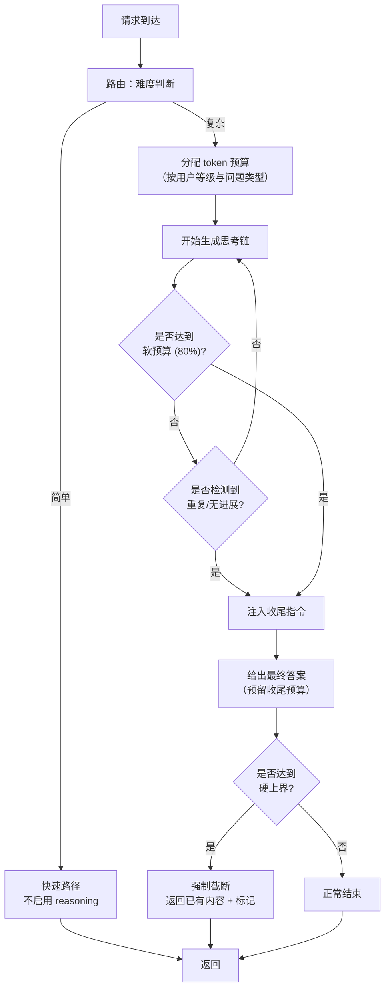
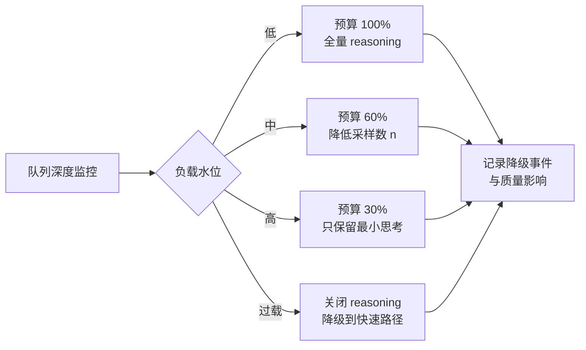
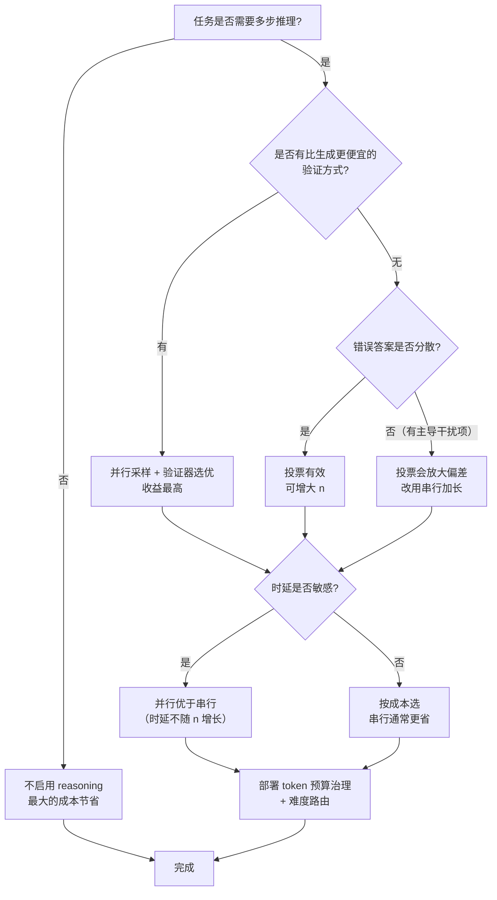

# reasoning 推理与 test-time scaling 的成本治理

> 位置：[InferenceAtlas](../../INDEX.md) > [模块 05](README.md) > 当前文档
> 信息截至：2026-07-29 ｜ 最后核验：2026-07-29 ｜ 内容版本：v0.1
> 时效性等级：高
> 相关主题：[reasoning 工作负载](../02_transformer_and_kv_cache/10_reasoning_workloads_and_test_time_compute.md)｜`08_tool_use_and_agent_inference.md`｜[成本建模](../01_foundations_and_metrics/06_cost_modeling_and_unit_economics.md)

## 本章导读

test-time scaling 把"用更多推理计算换更好答案"变成了一个可调节的产品维度。这在系统上引入了一个此前不存在的变量：**同一个模型、同一个 prompt，成本可以相差一个数量级，而这个差异由推理时的策略决定**。

传统推理服务的成本模型建立在"输出长度大致可预测"之上。reasoning 模型打破了这个假设——同一类问题的思考长度可能从几百 token 到几万 token 不等，且长度与问题难度的关系是模型内部决定的，服务无法预先知道。

[模块 02 第 10 章](../02_transformer_and_kv_cache/10_reasoning_workloads_and_test_time_compute.md) 已从 KV cache 与内存的角度讨论了 reasoning 工作负载。**本章聚焦于成本治理**：如何为不可预测的思考长度做容量规划、如何在质量与成本之间建立可决策的曲线、以及有哪些具体的治理手段（预算上限、分级、提前终止、路由）可以把这个变量重新纳入控制。

## 学习目标

读完本章后，读者应能够：

1. 列举 test-time scaling 的四类形态，并说明各自的成本结构差异；
2. 写出质量-成本曲线的基本形式，并说明"收益递减"对预算分配的含义；
3. 解释为什么 reasoning 工作负载的容量规划必须基于长度分位数而非均值；
4. 设计一套 token 预算治理机制（硬上界、软预算、分级、提前终止）；
5. 判断某个请求应该走 reasoning 路径还是快速路径。

## 核心结论

- **test-time scaling 的四类形态成本结构不同**：串行加长（时延↑）、并行采样（吞吐↓）、树搜索（两者皆↑）、工具循环（外部时延主导）。混为一谈会做出错误的容量决策。
- **质量随计算量的增长普遍是次线性的**，因此存在一个"边际质量/边际成本"跌破业务阈值的点，超过它继续加计算是浪费。
- **reasoning 的成本方差远大于均值**，容量规划必须用 P95/P99 长度，用均值规划会周期性过载。
- **token 预算必须是可强制执行的硬约束**，而不只是提示词里的建议——软约束在长尾上不起作用。
- **最有效的治理手段是路由**：让简单问题不进入 reasoning 路径，比在 reasoning 路径内部优化成本更有效。

## 1. 问题定义、系统边界与工作负载

### 1.1 test-time scaling 的四类形态

| 形态 | 机制 | 成本结构 | 时延结构 |
|---|---|---|---|
| **串行加长** | 生成更长的思考链 | decode token 数 ↑ | 时延线性 ↑ |
| **并行采样** | 同一问题采 $n$ 个样本后聚合 | 计算 × $n$ | 时延 ≈ 不变（并行）|
| **树搜索** | 生成-评估-回溯 | 计算 × 分支数，含评估开销 | 时延 ↑（串行轮次）|
| **工具循环** | 调用外部工具后继续推理 | 计算 + 外部调用 | 外部时延可能主导 |

**为什么必须区分**：这四类对系统的压力完全不同。

- 串行加长压的是**单请求时延**与 **KV cache 深度**；
- 并行采样压的是**并发容量**（$n$ 个副本同时占用批槽位）；
- 树搜索同时压两者，且引入了**同步点**（评估必须等所有分支完成）；
- 工具循环引入了**外部依赖**，请求在等待工具时占着 KV 但不消耗算力——这是一种资源浪费模式，需要专门处理（见 `08_tool_use_and_agent_inference.md`）。

**混淆的后果**：如果把并行采样当作"输出更长"来规划容量，会严重低估并发压力；如果把串行加长当作"更多请求"来规划，会低估单请求的 KV 深度。

### 1.2 成本的不可预测性

reasoning 工作负载与传统生成的关键差异：

| 维度 | 传统生成 | reasoning |
|---|---|---|
| 输出长度的可预测性 | 中（与任务类型相关） | 低（与问题难度相关，服务不可见） |
| 长度分布形状 | 相对集中 | 长尾显著 |
| 用户可见的输出 | 全部 | 可能只有最终答案（思考过程隐藏） |
| 计费口径 | 输出 token | 需决定是否计思考 token |
| 提前终止的可行性 | 低（截断即损失） | 中（可以要求"给出当前最佳答案"）|

**"用户可见输出 ≠ 计费 token"**这一点值得强调：思考过程可能占总 token 的大部分，但用户只看到最终答案。这带来一个产品与工程的对齐问题——如果按可见输出计费，成本与收入脱钩；如果按总 token 计费，需要向用户解释为什么"几百字的答案"消耗了几万 token。这不是本库要解决的产品问题，但它决定了成本治理的紧迫性。

### 1.3 系统边界

本章讨论的治理手段位于**服务层**，不修改模型：

| 层次 | 手段 | 本章是否覆盖 |
|---|---|---|
| 模型训练 | 训练模型自适应控制思考长度 | 否（超出推理系统范围） |
| 服务配置 | token 预算、超时、分级 | 是 |
| 路由 | 难度判断、快慢路径分流 | 是 |
| 调度 | reasoning 请求的准入与优先级 | 是 |
| 计费 | 口径设计 | 仅提及影响 |

## 2. 原理、数学与性能模型

### 2.1 质量-成本曲线的基本形式

设投入的推理计算量为 $C$（可以是 token 数、采样数或节点数），得到的质量为 $Q(C)$。经验上这类曲线具有以下性质：

1. $Q$ 单调不减；
2. $Q$ 有上界 $Q_{\max}$（模型能力的天花板）；
3. $\mathrm{d}Q/\mathrm{d}C$ 递减（收益递减）。

一个常用的拟合形式：

$$
Q(C) = Q_{\max} - (Q_{\max} - Q_0) \cdot e^{-C/C_0}
$$

- $Q_0$：$C \to 0$ 时的基线质量（单次直接回答）；
- $Q_{\max}$：无限计算下的质量上限；
- $C_0$：特征计算量，单位与 $C$ 相同，刻画曲线的"半衰"尺度。
- **直觉**：每增加 $C_0$ 的计算，与上限的差距缩小到 $1/e$。
- **假设**：收益递减是指数形式。这是一个拟合假设，不是从原理推导出来的。
- **局限**：实际曲线可能有平台期与跃变（例如某类问题需要达到某个思考深度才能解出），指数形式无法刻画。**这个公式应被当作定性框架，而非预测工具。**

**边际收益**：

$$
\frac{\mathrm{d}Q}{\mathrm{d}C} = \frac{Q_{\max} - Q_0}{C_0} e^{-C/C_0}
$$

设业务对质量的估值为 $v$（每单位质量的价值），单位计算成本为 $c$，则继续投入计算的条件是

$$
v \cdot \frac{\mathrm{d}Q}{\mathrm{d}C} > c
$$

解得最优计算量

$$
C^* = C_0 \ln\left( \frac{v (Q_{\max} - Q_0)}{c \, C_0} \right)
$$

- **直觉**：$C^*$ 随质量估值 $v$ 对数增长——**质量再值钱，也不值得投入无限计算**，因为收益递减是指数的。
- **局限**：$v$ 通常无法准确估计；且质量的价值往往不是线性的（正确率从 0.9 到 0.95 的价值可能远高于从 0.5 到 0.55）。该式给出的是思考框架而非可直接代入的公式。

### 2.2 并行采样的特殊结构

并行采样（生成 $n$ 个样本后取多数或用验证器选优）有一个不同于串行加长的性质：**质量提升有明确的概率上界**。

设单次采样正确的概率为 $\pi$，采 $n$ 次后：

**至少一次正确**（有完美验证器时的上界）：

$$
Q_{\text{oracle}}(n) = 1 - (1 - \pi)^n
$$

**投票选优**（无验证器时）：投票的效果**强烈依赖错误答案如何分布**，这一点常被忽略。两个极端：

- **错误分散**（每个错误答案各不相同）：正确答案只要出现 2 次就胜出；
- **错误集中**（存在一个有吸引力的干扰项，模型反复给出它）：退化为正确答案与该干扰项的多数之争。

$$
Q_{\text{disp}}(n) = \Pr[C \ge 2] + \frac{\Pr[C = 1]}{n}, \qquad C \sim \text{Binomial}(n, \pi)
$$

$$
Q_{\text{conc}}(n) = \Pr\left[ C > n/2 \right]
$$

- $Q_{\text{disp}}$ 对应「错误完全分散」：$C=1$ 时所有 $n$ 个答案各出现一次，随机打破平局，胜率 $1/n$；
- $Q_{\text{conc}}$ 对应「错误完全集中」，要求正确答案取得严格多数，是保守下界；
- **假设**：两式都假设各次采样独立。实际采样高度相关（同一模型、同一 prompt），因此两式都是理想化的。

| 场景 | $\pi$ | $n=1$ | $n=4$ | $n=8$ | $n=16$ | $n=32$ |
|---|---|---|---|---|---|---|
| 有验证器 $Q_{\text{oracle}}$ | 0.3 | 0.30 | 0.76 | 0.94 | 1.00 | 1.00 |
| 有验证器 $Q_{\text{oracle}}$ | 0.5 | 0.50 | 0.94 | 1.00 | 1.00 | 1.00 |
| 投票·错误分散 $Q_{\text{disp}}$ | 0.3 | 0.30 | 0.45 | 0.77 | 0.98 | 1.00 |
| 投票·错误分散 $Q_{\text{disp}}$ | 0.5 | 0.50 | 0.75 | 0.97 | 1.00 | 1.00 |
| 投票·错误集中 $Q_{\text{conc}}$ | 0.3 | 0.30 | 0.08 | 0.06 | 0.03 | 0.01 |
| 投票·错误集中 $Q_{\text{conc}}$ | 0.5 | 0.50 | 0.31 | 0.36 | 0.40 | 0.43 |
| 投票·错误集中 $Q_{\text{conc}}$ | 0.7 | 0.70 | 0.65 | 0.81 | 0.93 | 0.99 |

（上表为按上述公式计算的**模型输出**，非实测数据。真实任务落在两个极端之间，且采样并不独立，因此实际曲线会低于「分散」行、高于「集中」行。）

**从表中可读出的关键结论**：

1. **有验证器时并行采样的杠杆最大**：$\pi = 0.3$ 时 $n=8$ 即可达到 0.94。这来自「验证比生成容易」这一性质——只要能廉价判定对错，采样数就直接转化为正确率。
2. **投票的效果由错误的分布形态决定，而不只由 $\pi$ 决定**。同样是 $\pi = 0.3$，错误分散时 $n=16$ 能到 0.98，错误集中时反而降到 0.03。**这是投票法最重要也最容易被忽略的性质**。
3. **错误集中是危险的情形**：当模型有系统性偏差、反复给出同一个干扰项时，增加采样数会让这个错误答案的票数优势更稳固——投票**放大**而非纠正偏差。
4. 因此 $\pi$ 不是唯一需要测量的量，**还必须测量错误答案的集中度**（例如最高频错误答案的占比，或错误答案分布的经验熵）。

> **工程判据**：部署并行采样前要问两个问题。第一，「有没有比生成更便宜的验证方式」——如果有（代码可执行、答案可校验、有奖励模型），杠杆极高。第二，如果只能投票，「错误答案是分散的还是集中的」——在自己的任务集上实测最高频错误答案的占比；若该占比接近或超过 $\pi$，投票会有害。

### 2.3 成本的方差结构

reasoning 工作负载的成本分布是**重尾**的。设输出长度 $L$ 的分布为 $F$，则：

- 平均成本 $\propto E[L]$；
- **峰值资源需求** $\propto$ 高分位数（如 $L_{P99}$）；
- KV cache 峰值占用由**同时在飞的请求的长度之和**决定。

**为什么均值规划会失败**：设系统按 $E[L]$ 规划 KV 容量。当一批请求恰好都是长思考时，实际占用远超规划值，触发抢占或拒绝。由于长请求占用时间也长，它们在系统中的**共存概率高于独立假设**——这是一个正反馈：长请求积累 → KV 紧张 → 抢占 → 长请求被重算 → 更长时间占用。

**用 Little's Law 看这个问题**（见 [模块 01 第 3 章](../01_foundations_and_metrics/03_queueing_theory_for_inference.md)）：

$$
N = \lambda \cdot W
$$

- $N$：系统中平均请求数；$\lambda$：到达率（请求/s）；$W$：平均驻留时间（s）。
- reasoning 使 $W$ 大幅增加且方差大。在相同 $\lambda$ 下，$N$ 成比例上升，KV 需求随之上升。
- **推论**：reasoning 服务的 KV 预算需求，不是"每请求 KV × 并发数"这么简单，而必须考虑长驻留请求的堆积。

**长度分位数的实用估计**：若长度近似对数正态分布，$\ln L \sim \mathcal{N}(\mu, \sigma^2)$：

$$
L_{P95} = e^{\mu + 1.645\sigma}, \qquad \frac{L_{P95}}{E[L]} = e^{1.645\sigma - \sigma^2/2}
$$

- **直觉**：$\sigma$ 越大，P95 与均值的比值越大。$\sigma = 1$ 时该比值约 3.1；$\sigma = 1.5$ 时约 3.9。
- **局限**：对数正态只是一个方便的近似，实际分布可能更重尾。应直接用经验分位数而非拟合。

### 2.4 思考 token 的边际价值不均匀

一个重要的观察：思考链中的 token 对最终质量的贡献**不是均匀的**。开头的问题分解、中段的关键推导、结尾的验算，价值密度差异很大；而模型也可能产生大量低价值的重复与自我确认。

这带来一个治理机会：**如果能识别低价值段落，就可以在不损失质量的前提下削减成本**。可行的手段：

| 手段 | 机制 | 风险 |
|---|---|---|
| 重复检测提前终止 | 检测到 $n$-gram 高频重复即终止 | 可能截断正在进行的枚举 |
| 无进展检测 | 若干步内没有新的关键实体出现 | 需定义"进展"，易误判 |
| 预算提示 | 在 prompt 中告知剩余预算 | 软约束，不保证遵守 |
| 硬上界 | 达到 token 上限强制停止 | 可能截断在答案之前 |
| 分段确认 | 每 $m$ 个 token 检查是否已有答案 | 增加检查开销 |

**"硬上界"的失败模式**：如果在模型给出答案之前强制停止，用户得到的是一段没有结论的思考——这比给出一个较差的答案更糟。因此硬上界必须配合**强制收尾机制**：达到上界时不是直接截断，而是注入一个"请立即给出当前最佳答案"的指令，再给一小段预算完成收尾。

## 3. 实现机制与系统设计

### 3.1 token 预算的分层治理



**图解读**：
1. **本图展示什么**：从路由到硬上界的完整 token 预算治理链路，含软预算、无进展检测与强制收尾三道闸门。
2. **核心瓶颈**：瓶颈在最上游的"难度判断"——它的准确性决定了整条链路的效率。判断过于保守会让简单问题走 reasoning 路径（成本浪费），过于激进会让复杂问题走快速路径（质量损失）。下游所有治理手段的总收益，都小于把路由做对的收益。
3. **图中的 trade-off**：软预算越早触发，成本越可控但质量损失越大；收尾预算越大，答案越完整但总成本越高。这两个参数需要按业务的质量-成本估值来定。
4. **面试如何引用**：被问"如何控制 reasoning 模型的成本"时，用这张图给出分层答案，并主动指出"路由是最大杠杆"——这比只谈 token 上限更能体现系统视角。

### 3.2 预算分配策略

预算不应该是全局常数，而应按多个维度分配：

| 维度 | 依据 | 示例策略 |
|---|---|---|
| 用户等级 | 付费层级 | 高级用户更高预算 |
| 问题类型 | 分类器或用户标注 | 数学/代码给高预算，闲聊给零 |
| 历史难度 | 同类问题的历史消耗 | 用 P50 消耗的某个倍数作为预算 |
| 系统负载 | 当前队列深度 | 高负载时全局收紧预算 |
| 已消耗量 | 用户的周期配额 | 接近配额时降级 |

**"系统负载"这一维度值得强调**：在高负载时全局收紧 reasoning 预算，是一个高效的**背压机制**。它比拒绝请求更温和（用户仍得到答案，只是质量略降），比排队更有效（不增加时延）。这是 reasoning 服务相比传统服务多出来的一个调节旋钮——传统服务无法"降低单请求的计算量"来缓解压力。



**图解读**：
1. **本图展示什么**：把 reasoning 预算作为负载背压手段，按队列深度分四档逐级降级。
2. **核心瓶颈**：瓶颈是**降级的可观测性**——如果不记录降级事件与对应的质量影响，运营方无法判断降级策略是否合理，也无法向用户解释质量波动。这是常被忽略的一环。
3. **图中的 trade-off**：降级保护了系统可用性但损害了单请求质量。关键问题是"用户更能接受慢一点还是差一点"，这个答案因业务而异，决定了降级 vs 排队的选择。
4. **面试如何引用**：被问"reasoning 服务如何做过载保护"时，用这张图指出一个传统服务没有的手段——**降低单请求计算量**，并说明它是 reasoning 特有的弹性来源。

### 3.3 并行采样的资源管理

并行采样的 $n$ 个副本共享同一个 prompt。这带来一个明确的优化机会：

| 阶段 | 是否可共享 | 说明 |
|---|---|---|
| prompt 的 KV | **可以** | $n$ 个副本共享同一份 prompt KV |
| 思考链的 KV | 不可以 | 各副本内容不同 |
| prefill 计算 | **可以** | 只需 prefill 一次 |

**共享 prompt KV 的收益**：设 prompt 长度 $S_p$、思考长度 $S_t$，共享后的 KV 占用

$$
M_{\text{shared}} = (S_p + n \cdot S_t) \cdot m_{\text{tok}}
$$

vs. 不共享的 $n(S_p + S_t) \cdot m_{\text{tok}}$。节省比例

$$
1 - \frac{S_p + n S_t}{n(S_p + S_t)} = \frac{(n-1) S_p}{n (S_p + S_t)}
$$

- **直觉**：prompt 越长、思考越短，节省越多。$n \to \infty$ 时节省比例趋于 $S_p/(S_p+S_t)$。
- **局限**：这假设 prompt KV 可被 $n$ 个逻辑序列共享，需要分页 KV 与引用计数支持（同 [束搜索](03_beam_search_and_constrained_decoding.md) 3.1 的机制）。

**这与前缀缓存是同一机制**（见 [模块 03 第 8 章](../03_serving_engines_and_scheduling/08_prompt_caching_and_prefix_caching.md)）：并行采样是前缀共享的一个特例，其中共享的前缀就是整个 prompt。因此在支持前缀缓存的引擎上，这个优化通常是自动生效的。

**调度上的要求**：$n$ 个副本应尽量**同批调度**，原因有二：
1. 共享的 prompt KV 在所有副本都完成前不能释放，分散调度会延长持有时间；
2. 聚合步骤需要等所有副本完成，分散调度会拉长端到端时延（木桶效应）。

### 3.4 难度路由的实现

路由是最大的成本杠杆，但也最难做对。可行的信号：

| 信号 | 成本 | 准确性 | 说明 |
|---|---|---|---|
| 用户显式选择 | 零 | 高（若用户可靠） | 但用户倾向于总选最强 |
| 关键词/正则 | 极低 | 低 | 只能捕获明显模式 |
| 小模型分类器 | 低 | 中 | 需训练与维护 |
| 主模型的置信度 | 中（需先生成） | 中高 | 先快速回答，低置信才升级 |
| 级联（cascade） | 中 | 高 | 见下 |

**级联策略**是最实用的方案：

```
function cascade_answer(question, budget):
    # 第一级：快速路径
    fast_answer = generate(question, reasoning=off, max_tokens=SHORT)

    # 判断是否需要升级
    if verifier_ok(fast_answer) or confidence(fast_answer) > threshold:
        return fast_answer          # 大部分请求在此返回

    # 第二级：reasoning 路径
    return generate(question, reasoning=on, max_tokens=budget)
```

**成本分析**：设比例 $\rho$ 的请求需要升级，快速路径成本 $c_f$，reasoning 成本 $c_r$：

$$
E[\text{cost}] = c_f + \rho \cdot c_r
$$

vs. 全量 reasoning 的 $c_r$。级联更优当且仅当

$$
c_f + \rho c_r < c_r \iff \rho < 1 - \frac{c_f}{c_r}
$$

- **直觉**：当 $c_f \ll c_r$（快速路径便宜得多）时，只要升级率不接近 1，级联就划算。
- **局限**：该式忽略了升级带来的**时延增加**——升级的请求要付两次生成的时延。对时延敏感的场景，这个代价可能不可接受。

（级联与路由的一般讨论见 [模块 03 第 7 章](../03_serving_engines_and_scheduling/07_model_routing_and_cascade_systems.md)。）

### 3.5 提前终止的实现

```
function should_terminate(state, config):
    # 1. 硬上界
    if state.tokens >= config.hard_limit:
        return TERMINATE_FORCE

    # 2. 软预算：注入收尾指令
    if state.tokens >= config.soft_limit and not state.wrapping_up:
        state.wrapping_up = True
        return INJECT_WRAPUP

    # 3. 重复检测
    if repetition_score(state.recent_tokens, window=config.rep_window) > config.rep_threshold:
        return INJECT_WRAPUP

    # 4. 无进展检测
    if state.steps_since_new_entity > config.stall_limit:
        return INJECT_WRAPUP

    # 5. 已有明确答案标记
    if contains_answer_marker(state.recent_text):
        return TERMINATE_NORMAL

    return CONTINUE
```

**实现要点**：
1. **收尾指令的注入**：在已生成的思考链之后追加一段系统指令（如"基于以上分析，请立即给出最终答案"），然后继续生成。这需要服务能在生成中途向序列注入 token——大多数引擎支持，但需要正确处理 KV（注入的 token 也要 prefill）。
2. **重复检测的窗口**：太小会误判正常的枚举，太大会反应迟钝。这个参数需要按任务调。
3. **强制截断的标记**：被强制截断的响应应带有明确标记，让下游知道这个答案是不完整的，可以选择重试或降级处理。**静默截断是最糟的做法**——它把一个可检测的失败变成了一个不可检测的质量问题。

## 4. 性能、成本、能耗与可靠性 trade-off

### 4.1 四种形态的资源画像对比

| 形态 | 单请求时延 | 系统吞吐 | KV 峰值 | 能耗/答案 | 可提前终止 |
|---|---|---|---|---|---|
| 串行加长 | ↑↑ | ↓ | ↑↑（单序列深） | ↑ | 是 |
| 并行采样 | ≈ | ↓↓ | ↑（$n$ 序列） | ↑↑ | 部分（可少采几个）|
| 树搜索 | ↑↑ | ↓↓ | ↑↑ | ↑↑ | 是（剪枝）|
| 工具循环 | ↑↑↑（含外部）| ↓（占位不算） | ↑（长时间持有）| ≈ | 是 |

**"工具循环"这一行的特殊性**：请求在等待外部工具时不消耗算力，但**占用着 KV cache**。这是一种纯粹的资源浪费——KV 被占着，算力空转。缓解手段是在等待期间**换出 KV**（swap 到 CPU 内存或重算），但换出/换入本身有成本，需要按等待时长决策。详见 `08_tool_use_and_agent_inference.md`。

### 4.2 质量-成本的决策点

对每个业务，需要确定三个数字：

| 参数 | 含义 | 如何确定 |
|---|---|---|
| $Q_{\text{min}}$ | 可接受的最低质量 | 业务定义（如正确率下限） |
| $C_{\text{max}}$ | 单请求成本上限 | 单位经济学（见 [模块 01 第 6 章](../01_foundations_and_metrics/06_cost_modeling_and_unit_economics.md)） |
| $\partial Q/\partial C\big|_{\text{stop}}$ | 边际收益的停止阈值 | 由质量估值 $v$ 与成本 $c$ 之比确定 |

**实用做法**：不去拟合 2.1 的连续曲线，而是**离散地测量若干预算档位下的质量**，画出经验曲线，然后按业务阈值选点。

| 预算档 | 相对成本 | 质量（需实测） | 边际质量/边际成本 |
|---|---|---|---|
| 无 reasoning | 1× | — | — |
| 短思考 | 3× | — | — |
| 中思考 | 10× | — | — |
| 长思考 | 30× | — | — |
| 长思考 + 4 采样 | 120× | — | — |

（成本倍率为示意性的档位设计，质量列必须由各团队在自己的任务集上实测填写。本库不提供质量数字，因为它完全依赖于具体模型与任务。）

**读表方法**：从上往下看，当"边际质量/边际成本"跌破业务阈值时停止。**通常这个点比直觉早得多**——因为成本是几何增长而质量是次线性增长。

### 4.3 能耗

reasoning 的能耗放大直接等于计算量放大：

$$
\frac{E_{\text{reasoning}}}{E_{\text{direct}}} \approx \frac{L_{\text{think}} + L_{\text{answer}}}{L_{\text{answer}}} \cdot n
$$

- $L_{\text{think}}$：思考 token 数；$L_{\text{answer}}$：答案 token 数；$n$：并行采样数。
- **直觉**：思考链比答案长 10 倍且采 4 个样本，能耗放大约 44 倍。
- **局限**：该式假设每 token 能耗相同，忽略了 prompt 共享带来的 prefill 节省。

**这个放大倍数值得被明确摆在决策桌上**。在数据中心电力受限的情况下（见 [模块 09](../09_datacenter_power_thermal_and_operations/)，规划中），reasoning 的普及会直接转化为电力需求。把它当作"免费的质量提升"是错误的。

### 4.4 可靠性

| 风险 | 后果 | 缓解 |
|---|---|---|
| 长请求堆积 | KV 耗尽，大面积抢占 | 按 P99 长度规划；限制并发 reasoning 请求数 |
| 硬截断在答案之前 | 用户得到无结论的输出 | 强制收尾机制（3.5） |
| 静默截断 | 质量问题不可检测 | 截断必须带标记 |
| 路由误判 | 简单问题走贵路径 / 复杂问题质量差 | 监控两类误判率；级联可缓解后者 |
| 工具等待占用 KV | 有效容量下降 | 长等待时换出 KV |
| 预算未强制执行 | 成本失控 | 预算必须是服务端硬约束，不能只写在 prompt 里 |

**"预算必须是服务端硬约束"**：把 token 预算写在系统提示词里（"请在 2000 token 内完成思考"）是**不可靠的**——模型可能不遵守，尤其在难题上。真正的预算控制必须在服务层实现为强制的 `max_tokens` 与提前终止逻辑。软约束可以作为辅助（它能让模型主动收敛），但不能作为唯一手段。

## 5. benchmark、真实案例或公开部署案例

当前环境的网络出口策略阻断了 `arxiv.org`、`huggingface.co`、`openreview.net` 等一手来源（详见 [AGENTS.md 第 11 节](../../AGENTS.md)）。因此本节**不引用任何具体模型的 reasoning 长度、质量提升幅度或定价数字**——这类数字必须来自可核验的官方披露或论文，凭记忆填写违反本库的披露纪律。

第 2.2 节的表格是按该节公式计算得出的**模型输出**，已明确标注，不应被当作实测数据。第 4.2 节的成本档位是**示意性设计**，质量列刻意留空。

| 陈述 | 披露标签 | 状态 |
|---|---|---|
| 多个商用 API 提供可调的推理努力/思考预算参数 | `官方披露` | `待核实`（需补官方文档链接） |
| reasoning 模型的思考 token 通常远多于答案 token | `可信第三方估计` | `待核实` |
| 具体模型的思考长度分布 | — | **不引用**（无一手来源） |
| 具体的质量提升幅度 | — | **不引用**（无一手来源） |

**可自行复现的实验**（`独立可复现实验`）：

1. **长度分布测量**：在自己的任务集上运行 reasoning 模型，记录思考 token 数的完整分布。计算 $E[L]$、$L_{P95}$、$L_{P99}$ 及其比值，验证 2.3 的重尾判断。
2. **质量-预算曲线**：按 4.2 的档位表，在同一任务集上测量各档的质量指标，填写"边际质量/边际成本"列，定位业务的停止点。
3. **并行采样的验证器杠杆与错误集中度**：在有可执行验证的任务（如代码）上，对比「验证器选优」与「投票选优」随 $n$ 的变化；同时统计最高频错误答案的占比，判断本任务落在 2.2 的「分散」还是「集中」一侧。
4. **prompt KV 共享收益**：在并行采样下测量峰值 KV 占用，对比开启/关闭前缀共享。验证 3.3 的节省公式。
5. **级联的成本收益**：测量快速路径的升级率 $\rho$ 与两级成本 $c_f, c_r$，代入 3.4 的判据，再用实测总成本验证。同时测量升级请求的端到端时延增加。
6. **提前终止的质量影响**：在不同软预算下测量强制收尾对质量的影响。确定"收尾预算"的合理值。
7. **负载背压的有效性**：在压测中启用 3.2 的分档降级，观察队列深度与 P99 时延的响应，与"直接拒绝"策略对比。

> 实验方法论要求见 [如何读推理 benchmark](../00_start_here/03_how_to_read_inference_benchmarks.md)。

## 6. 设计决策框架



**图解读**：
1. **本图展示什么**：从任务性质出发，依次判断验证器可得性、单次正确率、时延敏感性，落到具体的 test-time scaling 形态，终点强制接入预算治理。
2. **核心瓶颈**：瓶颈是"是否有比生成更便宜的验证方式"这个分叉——它决定了并行采样是高杠杆还是低收益。这个问题常被跳过，导致团队在没有验证器的情况下盲目增大采样数。
3. **图中的 trade-off**：并行路径用吞吐换时延（$n$ 倍算力但时延不变），串行路径用时延换吞吐。两条路的总能耗都上升，没有免费的质量。
4. **面试如何引用**：被问"如何设计一个 reasoning 服务"时，用这张图从"能否验证"讲起——这是最有信息量的判断点，比直接谈 token 预算更能体现对 test-time scaling 本质的理解。

### 决策清单

| 问题 | 若答案为"是" | 若答案为"否" |
|---|---|---|
| 任务需要多步推理？ | 继续评估 | 关闭 reasoning，最大节省 |
| 有便宜的验证方式？ | 并行采样 + 选优 | 只能投票或串行 |
| 错误答案分散？ | 投票有效，可增大 $n$ | 投票放大偏差，改用串行 |
| 时延敏感？ | 优先并行 | 优先串行（更省） |
| 成本可控？ | — | 必须部署预算治理 |
| 有难度信号可用？ | 部署路由/级联 | 先建设难度信号 |
| 有电力预算约束？ | 核算能耗放大倍数 | 按成本决策 |

## 7. 常见失败模式与排查路径

| 症状 | 可能原因 | 排查步骤 |
|---|---|---|
| 成本远超预算但均值正常 | 长尾请求主导（2.3） | 看 P95/P99 消耗与成本的分布，而非均值 |
| KV 周期性耗尽 | 按均值规划容量 | 按 $L_{P99}$ 重算 KV 预算；限制并发 reasoning 数 |
| 用户收到无结论的输出 | 硬截断在答案前（2.4） | 检查是否有强制收尾；加收尾预算 |
| 质量问题不可检测 | 静默截断 | 截断响应必须带标记并上报 |
| 增大采样数 $n$ 质量反而下降 | 错误集中，投票放大偏差（2.2） | 统计最高频错误答案的占比；若接近或超过 $\pi$，改用串行或引入验证器 |
| 并行采样时 KV 翻 $n$ 倍 | prompt KV 未共享（3.3） | 确认前缀缓存已启用；检查引用计数 |
| 并行采样端到端时延远超单次 | 副本分散调度（3.3） | 强制同批调度 $n$ 个副本 |
| prompt 里写了 token 上限但模型不遵守 | 软约束不可靠（4.4） | 改为服务端强制 `max_tokens` |
| 简单问题也消耗大量 token | 路由缺失或过于保守 | 部署级联；测量升级率 $\rho$ |
| 工具等待期间容量下降 | KV 被空占（4.1） | 长等待时换出 KV；见 `08_tool_use_and_agent_inference.md` |
| 高负载时全面超时 | 缺少预算背压（3.2） | 部署按负载分档的预算降级 |
| 降级后无法评估影响 | 降级事件未记录 | 记录降级事件与对应质量指标 |

**排查原则**：reasoning 的成本问题几乎总是**分布问题而非均值问题**。任何以均值为基础的分析都会低估。第一步永远是画出消耗的完整分布。

## 8. 关联面试主题

1. **test-time scaling 的四类形态及其成本结构差异**——见本章 1.1，这是区分"听说过"与"部署过"的问题。
2. **为什么并行采样的价值依赖验证器，以及投票何时会放大偏差**——见本章 2.2，错误答案的集中度是关键变量。
3. **为什么 reasoning 的容量规划必须用分位数**——见本章 2.3，含 Little's Law 的推论。
4. **token 预算为什么必须是服务端硬约束**——见本章 4.4。
5. **强制收尾机制解决什么问题**——见本章 2.4 与 3.5，硬截断在答案前比质量差更糟。
6. **reasoning 特有的过载保护手段**——见本章 3.2，降低单请求计算量是传统服务没有的旋钮。
7. **级联路由的成本判据**——见本章 3.4，$\rho < 1 - c_f/c_r$。
8. **并行采样的 prompt KV 共享**——见本章 3.3，与前缀缓存是同一机制。
9. **reasoning 的能耗放大**——见本章 4.3。
10. **工具等待期间的 KV 空占问题**——见本章 4.1。

## 9. 小结

test-time scaling 给推理系统引入了一个新变量：**单请求的计算量不再是固定的，而是可调的**。这既是负担（成本不可预测）也是资源（多了一个调节旋钮）。

在成本治理上，本章的结论可以归结为三层优先级：

**第一层，路由**。让不需要 reasoning 的请求不走 reasoning 路径，是最大的成本杠杆。级联策略（先快后慢）在 $c_f \ll c_r$ 时几乎总是划算的，代价是升级请求的时延翻倍。所有下游治理手段的收益之和，通常小于把路由做对的收益。

**第二层，形态选择**。四类形态的成本结构不同，选择应基于两个判断：**是否有比生成更便宜的验证方式**（有则并行采样杠杆极高），以及**时延是否敏感**（敏感则并行优于串行）。在没有验证器、且错误答案集中于某个主导干扰项时，增大采样数会**降低**质量——投票放大而非纠正系统性偏差。这是一个必须知道的负结果。

**第三层，预算强制**。token 预算必须实现为服务端硬约束，配合软预算、无进展检测与强制收尾三道闸门。硬截断在答案给出之前是最差的结果，必须用收尾机制避免；任何截断都必须带标记，不能静默。

在容量规划上有一条独立的、同样重要的结论：**reasoning 的成本分布是重尾的，必须按 P95/P99 而非均值规划**。长请求在系统中共存的概率高于独立假设，且抢占会形成正反馈。用均值规划的 reasoning 服务会周期性过载。

最后，reasoning 的能耗放大可以达到数十倍。把它当作"免费的质量提升"是错误的——它是一笔需要被显式核算的能量与成本支出。

## 关键术语

| 中文术语 | 英文 | 定义 | 单位/口径 | 关联文档 |
|---|---|---|---|---|
| 测试时扩展 | test-time scaling | 通过增加推理计算量提升输出质量 | 计算量为 token 或 FLOP | 本章 1.1 |
| 串行加长 | sequential scaling | 生成更长的思考链 | token | 本章 1.1 |
| 并行采样 | parallel sampling | 对同一问题采多个样本后聚合 | 采样数 $n$ | 本章 2.2 |
| 自洽 | self-consistency | 对多个采样结果取多数 | — | 本章 2.2 |
| 验证器 | verifier | 判断候选答案正确性的机制 | — | 本章 2.2 |
| 思考 token | thinking token | 推理过程中产生但可能不展示给用户的 token | token | 本章 1.2 |
| token 预算 | token budget | 单请求允许消耗的 token 上限 | token | 本章 3.1 |
| 软预算 | soft budget | 触发收尾指令但不强制停止的阈值 | token | 本章 3.5 |
| 强制收尾 | forced wrap-up | 达到预算时注入指令要求立即给答案 | — | 本章 2.4 |
| 级联 | cascade | 先用便宜模型/路径，不满足才升级 | — | 本章 3.4 |
| 预算背压 | budget backpressure | 按系统负载动态收紧计算预算 | — | 本章 3.2 |

## 延伸阅读

- [reasoning 工作负载与 test-time compute](../02_transformer_and_kv_cache/10_reasoning_workloads_and_test_time_compute.md) — 从 KV 与内存角度的分析
- `08_tool_use_and_agent_inference.md` — 工具循环的资源问题
- [成本建模与单位经济学](../01_foundations_and_metrics/06_cost_modeling_and_unit_economics.md) — $C_{\max}$ 的确定方法
- [排队论](../01_foundations_and_metrics/03_queueing_theory_for_inference.md) — Little's Law 与长驻留请求
- [容量规划](../01_foundations_and_metrics/08_capacity_planning.md) — 分位数规划方法
- [模型路由与级联系统](../03_serving_engines_and_scheduling/07_model_routing_and_cascade_systems.md) — 路由的一般设计
- [prompt 缓存与前缀缓存](../03_serving_engines_and_scheduling/08_prompt_caching_and_prefix_caching.md) — 并行采样的 KV 共享基础
- [能效与每 token 焦耳](../01_foundations_and_metrics/07_energy_efficiency_and_joules_per_token.md) — 能耗放大的核算

## 主要来源

本章的模型与判据为本库自洽推导。第 2.2 节的表格为公式计算结果（非实测），第 4.2 节的成本档位为示意性设计（质量列刻意留空）。涉及具体模型与产品的陈述已在第 5 节标注为 `待核实`；具体的思考长度、质量提升幅度与定价数字**未引用**，原因是当前环境无法访问相应的一手来源（详见 [AGENTS.md 第 11 节](../../AGENTS.md)）。

| 类别 | 说明 | 披露标签 |
|---|---|---|
| 质量-成本曲线形式 | 拟合假设，已标注为定性框架 | — |
| oracle 与投票公式及表格 | 标准概率计算，非实测，已标注理想化假设 | — |
| 对数正态分位数关系 | 标准统计结果 | — |
| 级联成本判据 | 本库推导 | — |
| 具体模型的行为与数字 | 需一手核验 | `待核实` / 未引用 |

## 更新记录

| 日期 | 版本 | 变更 | 核验人 |
|---|---|---|---|
| 2026-07-29 | v0.1 | 初稿：四类形态的成本结构、质量-成本曲线、并行采样的验证器杠杆、token 预算分层治理与难度路由 | — |
